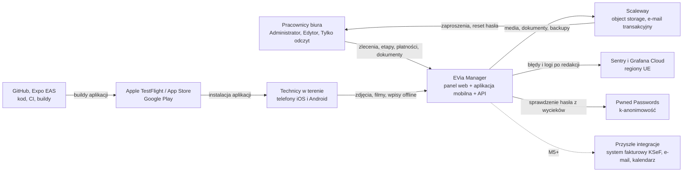
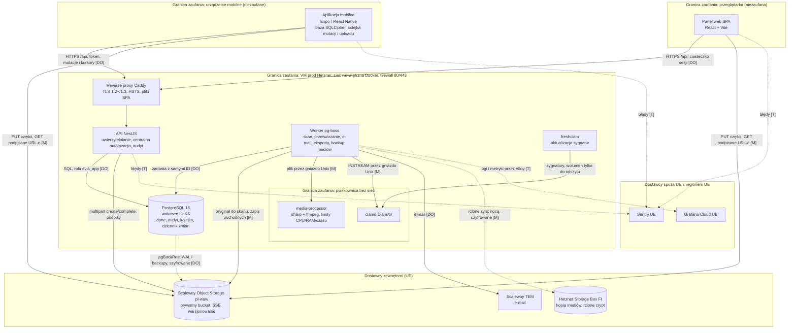
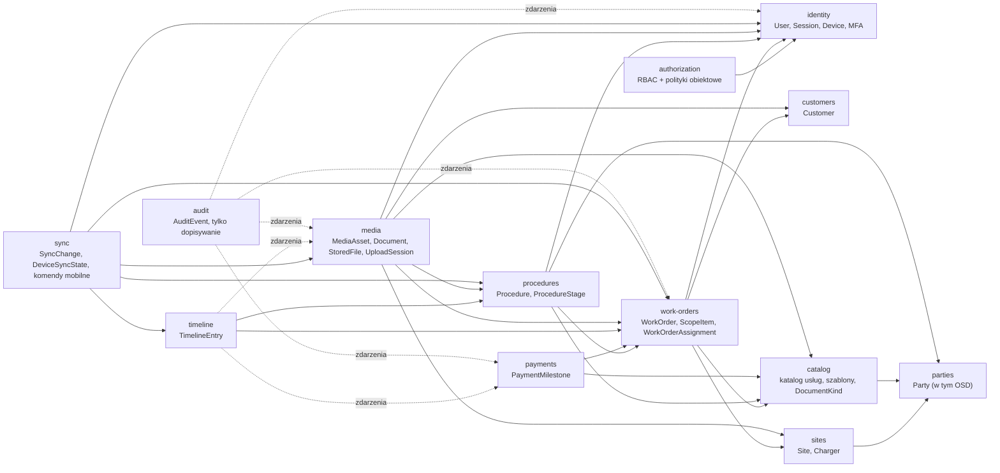

# Architektura EVia Manager

> Właściciel: `solution-architect`. Stan: **zaakceptowana przez Konrada 2026-10-02** (EVM-001). Decyzje szczegółowe: [`adr/`](adr/README.md). Ceny i kurs walut zweryfikowane 2026-10-02.

## Podsumowanie dla decydenta

**Rekomendowany stack**
| Obszar | Wybór | ADR |
|---|---|---|
| Architektura | modularny monolit: API + worker z jednego kodu, centralna autoryzacja i audyt | [0001](adr/0001-architektura-ogolna-modularny-monolit.md) |
| Backend | TypeScript, Node.js 26 LTS, NestJS 12 | [0002](adr/0002-backend-typescript-nestjs.md) |
| Baza | PostgreSQL 18 + Kysely, migracje expand → migrate → contract, PITR | [0003](adr/0003-baza-danych-postgresql-kysely-migracje.md) |
| API | REST + OpenAPI 3.1 contract-first, generowane typy/klienci/testy ról | [0004](adr/0004-api-rest-openapi-contract-first.md) |
| Logowanie | własny moduł: Argon2id, MFA (TOTP, passkeys), sesje nieprzezroczyste | [0005](adr/0005-uwierzytelnianie-i-mfa.md) |
| Panel web | React + Vite (SPA), shadcn/ui + Tailwind z design tokens | [0006](adr/0006-panel-web-react-vite-shadcn.md) |
| Mobile | React Native + Expo (iOS + Android), SQLCipher, upload w tle systemowy | [0007](adr/0007-aplikacja-mobilna-expo-react-native.md) |
| Offline | własny protokół: kolejka mutacji + kanał zmian z kursorem | [0008](adr/0008-synchronizacja-offline.md) |
| Media | Scaleway Object Storage (Warszawa), multipart z podpisanymi URL-ami, ClamAV, izolowane przetwarzanie | [0009](adr/0009-storage-i-przetwarzanie-mediow.md) |
| Zadania w tle | pg-boss w PostgreSQL | [0010](adr/0010-zadania-w-tle-pg-boss.md) |
| Hosting | Hetzner (VM, Niemcy) + Scaleway (storage, backupy, e-mail) + Storage Box (kopia mediów) | [0011](adr/0011-hosting-i-srodowiska-ue.md) |
| CI/CD | GitHub Actions, pnpm + Turborepo, EAS Build (iOS bez Maca); GitHub Free z kontrolami kompensującymi, zizmor i actionlint (proponowane) | [0012](adr/0012-ci-cd-monorepo-narzedzia-jakosci.md), [0016](adr/0016-github-free-ochrona-main-kontrole-kompensujace.md) |
| Obserwowalność | Grafana Cloud (UE) + Sentry (UE), redakcja danych osobowych | [0013](adr/0013-obserwowalnosc.md) |
| Testy | Vitest, Testcontainers, macierz ról z kontraktu, Playwright, Maestro | [0014](adr/0014-narzedzia-testowe.md) |
| Środowisko testów | Per warstwa: backend w kontenerach Linux, web w przeglądarkach na Windows, mobile i E2E Android na emulatorze Windows, narzędzia natywnie; CI Linux jako dodatkowa bramka (bez emulatora); iOS odłożony | [0015](adr/0015-srodowisko-testow-per-warstwa.md) |

**Dlaczego tak:** jeden język (TypeScript) w backendzie, panelu i aplikacji mobilnej — wspólny kontrakt i logika synchronizacji, mniej błędów, szybsza praca agentów. Sprawdzona („nudna”) technologia z dojrzałymi narzędziami testowymi. Jedna maszyna i jedna baza zamiast wielu usług — tanio i prosto. Dane klientów u firm z UE (Niemcy, Francja; storage w Warszawie). Upload dużych filmów w tle przez mechanizmy systemu (iOS URLSession, Android UIDT); ryzyko sprawdzamy w spike'u EVM-011 przed M2.

**Koszty (netto, miesięcznie):** **MVP ≈ 192 zł** wobec budżetu 300 zł — mieści się z rezerwą ok. 108 zł, **łącznie z** niezmiennym backupem poza głównym miejscem, skanem antywirusowym, MFA, kontem Apple i planem GitHub Pro (egzekwowana ochrona `main`). **Po 2 latach (30 osób, 3 TB): ≈ 407–498 zł** — przekracza 300 zł; ponad połowa to storage mediów. Szczegóły: [Koszty](#koszty).

**Główne ryzyka**
1. **Upload w tle w React Native** opiera się na bibliotece społeczności lub własnym module natywnym → spike EVM-011; plan B: własny moduł Expo, w ostateczności Flutter.
2. **Koszt mediów po 2 latach** (3 TB + kopia zapasowa ≈ 266 zł/mies. samego storage'u i backupu) → lifecycle (Glacier), limit jakości wideo w aplikacji.
3. **Samodzielnie utrzymywany PostgreSQL** (aktualizacje, backup, szyfrowanie LUKS) → automatyzacja i testy odtworzenia (EVM-007); alternatywa: baza zarządzana (wariant B, ≈ 458 zł).
4. **Podprocesorzy spoza UE** (Sentry, Grafana Labs, GitHub, Expo, Apple, Google — bez danych klientów w treści, telemetria po redakcji w regionach UE) → ryzyko rezydualne CLOUD Act do akceptacji w EVM-005.
5. **Podwyżki cen dostawców** (w 2026 r. Hetzner dwukrotnie, Scaleway, OVHcloud) → rezerwa budżetu, przenośność (Docker, PostgreSQL, S3, IaC).

**Decyzje Konrada (2026-10-02, demo EVM-001)**
1. Hosting: **wariant A** (Hetzner + Scaleway, ≈ 192 zł/mies.).
2. Archiwum wideo: **tak** — oryginały filmów > 12 mies. w tańszej klasie storage'u.
3. Jakość wideo: **1080p z ograniczonym bitrate, maks. 30 min / 4 GB**.
4. Telefony: **mieszane — firmowe i prywatne (BYOD)**; wsparcie iOS 17+ i Android 10+. Konsekwencja: polityka BYOD (prywatność, wymagana blokada ekranu, czyszczenie danych firmowych bez MDM) do opracowania w EVM-005.
5. Podprocesorzy z USA w regionach UE (Sentry, Grafana Cloud): **tak**, po redakcji danych osobowych; ryzyko rezydualne oceni EVM-005.
6. Konta: **Apple Developer i Google Play Console firmowe** (zakłada Konrad przed EVM-009), **GitHub Pro** na koncie osobistym (potwierdzenie przy EVM-006). *Doprecyzowanie 2026-10-03 ([ADR-0015](adr/0015-srodowisko-testow-per-warstwa.md)): iOS odłożony — konto Apple Developer zakładane dopiero po decyzji o iOS (przed planowaniem wydania iOS); przed EVM-009 potrzebne tylko konto Google Play Console.*

**Pytania do decyzji (z rekomendacją) — stan przed demo**
1. **Hosting:** wariant A (≈ 192 zł, PostgreSQL utrzymywany przez nas) czy B (≈ 458 zł, wszystko w Scaleway z zarządzaną bazą)? — *Rekomendacja: A*; przejście na B później zajmuje 1–2 dni.
2. **Archiwum wideo:** czy oryginały filmów starszych niż 12 miesięcy mogą trafiać do tańszej klasy (odtworzenie oryginału trwa kilka godzin; podgląd 720p dostępny od ręki)? — *Rekomendacja: tak* (oszczędność ≈ 90 zł/mies. przy 3 TB).
3. **Jakość wideo w aplikacji:** nagrywanie 1080p z ograniczonym bitrate, film maks. 30 min / 4 GB? — *Rekomendacja: tak* (4K zwielokrotniłoby koszt storage'u i czas uploadu).
4. **Telefony:** jakie modele i wersje systemów, firmowe czy prywatne? — *Rekomendacja: wspieramy iOS 17+ i Android 10+; telefony firmowe* (prywatne wymagają dodatkowej polityki prywatności i czyszczenia danych).
5. **Podprocesorzy z USA w regionach UE** (Sentry, Grafana Cloud) dla błędów i logów po redakcji? — *Rekomendacja: tak*; alternatywa: samodzielnie hostowane narzędzia (+ ok. 30–40 zł/mies. i więcej pracy).
6. **Konta deweloperskie:** Apple Developer Program (99 USD/rok; dla firmy wymagany numer D-U-N-S) i Google Play Console (25 USD jednorazowo) — *Rekomendacja: konta firmowe zakładane przez Konrada przed EVM-009.* Repozytorium: **GitHub Pro** na koncie osobistym (4 USD/mies.) lub **GitHub Team** dla organizacji firmy (4 USD/użytkownika) — bez planu płatnego ochrona `main` w repo prywatnym nie działa (ADR-0012). *Rekomendacja: GitHub Pro; decyzja przy EVM-006.*

---

## Czynniki architektoniczne (drivers)
1. **Elastyczny model zleceń** — kompozycja: katalog usług + szablony + procesy z etapami (`docs/product/domain.md`).
2. **Mobile offline-first** — garaże bez zasięgu; trwała kolejka zmian; zdjęcia i duże filmy z wznawialnym uploadem w tle (iOS + Android); zero utraty danych.
3. **Archiwum mediów i dokumentów** — lata retencji, terabajty, bezpieczny dostęp, kontrola kosztów.
4. **Bezpieczeństwo** — ASVS L2, MASVS, RBAC, audyt, MFA; RODO i UE (`docs/security/README.md`).
5. **Mała firma** — niski koszt, mały narzut operacyjny, jeden człowiek akceptujący zmiany; zespół agentów AI jako wykonawcy (silne typowanie, dojrzałe narzędzia testowe, dobra dokumentacja).
6. **Ewolucja** — przyszłe integracje (fakturowanie / KSeF, e-mail, kalendarz), inwestycje deweloperskie, projekty DC — bez budowania ich na zapas.

## C4 — poziom 1: kontekst systemu

## C4 — poziom 2: kontenery, granice zaufania i przepływy danych
Linie ciągłe: ruch aplikacyjny; przerywane: backup i telemetria. Etykiety w nawiasach kwadratowych oznaczają rodzaj danych: **[DO]** dane osobowe (klienci, pracownicy), **[M]** media i dokumenty, **[T]** telemetria po redakcji. To podstawa analizy STRIDE w EVM-005.

## Mapa modułów domenowych
> Doprecyzowana w EVM-002 (do akceptacji Konrada na demo EVM-002): nowy moduł `parties` (kontrahenci, w tym OSD), `sites` nie zależy od `customers`, **schemat PostgreSQL per moduł** (decyzja delegowana z ADR-0001, reguła 5). Własność tabel, klucze obce i port kompozycji zlecenia: [`domain-model.md`](domain-model.md#moduły-i-własność-tabel).

Strzałka = „zależy od publicznego API modułu” (i kierunek kluczy obcych między schematami). Wszystkie moduły zależą od `platform` (pominięte dla czytelności); `authorization` jest wywoływany z warstwy `api` każdego modułu; `sync` czyta fasady wszystkich modułów w zakresie synchronizacji (pokazane główne). `procedures` i `payments` rejestrują się jako kontrybutorzy kompozycji zlecenia przez port zdefiniowany w `work-orders` (bez cyklu). Reguły egzekwuje dependency-cruiser ([ADR-0001](adr/0001-architektura-ogolna-modularny-monolit.md)).

| Moduł | Odpowiedzialność | Kamień |
|---|---|---|
| `platform` | jądro współdzielone: UUIDv7, czas (`Europe/Warsaw`/UTC), pieniądze (grosze), błędy RFC 9457, zdarzenia/outbox, idempotencja (rekordy kluczy), dostęp do bazy, szyfrowanie pól, konfiguracja | M0 |
| `identity`, `authorization`, `audit` | konta, logowanie, MFA, sesje i urządzenia; deny-by-default; dziennik audytu | M1 (E1), M2 (E9) |
| `customers`, `sites`, `parties` | klienci, lokalizacje (z ładowarkami), kontrahenci (administracja, OSD, projektanci…), wyszukiwanie z polskimi znakami | M1 (E2, E3) |
| `catalog`, `work-orders`, `procedures` | katalog usług, szablony, zlecenia, procesy i etapy | M1 (E3, E4) |
| `payments` | etapy płatności, nieopłacone i po terminie | M1 (E7) |
| `timeline` | dziennik, wpisy, komentarze, automatyczna historia | M1 (E5) |
| `media` | upload, skan, przetwarzanie, pobieranie, eksport | M1 (E6), M2 (E11) |
| `sync` | synchronizacja offline urządzeń | M2 (E10–E13) |
| później | `notifications` (M3), `reporting` (M4), `integrations` (M5), `investments` (M6) | — |

## Struktura repozytorium (monorepo)
Potwierdzona w EVM-006 bez zmian względem [ADR-0012](adr/0012-ci-cd-monorepo-narzedzia-jakosci.md) (pnpm workspaces + Turborepo); katalogi powstają dopiero z treścią (YAGNI). Polecenia: `CLAUDE.md` → „Stack i komendy”; CI i ochrona `main`: [`../ops/github-i-ci.md`](../ops/github-i-ci.md).

| Ścieżka | Zawartość | Od |
|---|---|---|
| `packages/config` | wspólna konfiguracja: tsconfig (`strict`), ESLint, preset pokrycia Vitest, runner `node:test`, jedno źródło wykluczeń pokrycia | EVM-006 |
| `packages/tokens` | `@evia/tokens` — tokeny z `design/tokens/` → CSS (`--evm-…`) i stałe React Native (Style Dictionary 5) | EVM-006 |
| `tools/*` | narzędzia repozytorium jako workspace'y: `docs-lifecycle` (EVM-012), `diff-coverage`, `container`, `git-hooks`, `scan`, `main-integrity`, `repo-policy` | EVM-006 |
| `compose.yaml` (katalog główny) | kontener `backend-tests` (ADR-0015) i skanery uruchamiane przez `docker compose -f compose.yaml run --rm …` | EVM-006 |
| `infra/docker/backend-tests/` | obraz środowiska testów backendu (Node 26 po digeście + pnpm) | EVM-006 |
| `.github/workflows/` | `ci.yml`, `nightly.yml`, `renovate.yml` | EVM-006 |
| `apps/api`, `apps/web` · `apps/mobile` · `infra/` (OpenTofu) · `services/media-processor`, `packages/{contracts,sync-core,ui-web}` | aplikacje, infrastruktura i pakiety domenowe | EVM-008 · EVM-009 · EVM-007 · przy pierwszej potrzebie |

Kierunek zależności (dependency-cruiser, bramka lokalna i CI): `apps/*`, `services/*` i `packages/*` nie importują `tools/*`; `packages/*` nie importują `apps/*` ani `services/*`; `tools/*` nie importują `apps/*` ani `services/*`; bez cykli. Granice modułów `apps/api` (ADR-0001) — od EVM-008.

## Wymagania niefunkcjonalne — wartości docelowe
Wartości bezpieczeństwa są propozycją do potwierdzenia polityk w EVM-005.

| Obszar | Wymaganie | Wartość docelowa | Źródło |
|---|---|---|---|
| Dostępność | dostępność produkcji (miesięcznie) | ≥ 99,5%; prace planowe poza 7:00–19:00 | ADR-0011 |
| Niezawodność | **RPO bazy** | ≤ 15 min (typowo ~1 min; wizja: ≤ 1 h) | ADR-0003 |
| | **RTO** (pełne odtworzenie) | ≤ 8 h (cel 4 h) | ADR-0003, ADR-0011 |
| | okno PITR bazy | 30 dni | ADR-0003 |
| | RPO mediów (awaria dostawcy) / przypadkowe usunięcie | ≤ 24 h / odzyskanie z wersji do 30 dni | ADR-0009 |
| | test odtworzenia | baza: co miesiąc i przed każdym wydaniem; media: próbka co miesiąc; pełne DR: raz w roku | ADR-0011 |
| Wydajność | listy i szczegóły (p95, typowe dane) | < 1 s w UI; < 300 ms po stronie API | wizja, ADR-0002 |
| | czas od uploadu do `ready` (p95) | zdjęcie < 2 min; film 2-min. < 15 min | ADR-0010 |
| Skala | pojemność projektowa | 30 użytkowników, 10 tys. zleceń, 3 TB mediów (zapas ×10 bez zmian architektury) | AC4 |
| Limity plików | zdjęcie / wideo / dokument | ≤ 50 MB / ≤ 4 GB i ≤ 30 min (1080p) / ≤ 100 MB | ADR-0009 |
| Limity API | treść JSON / strona listy / rate limit | ≤ 1 MB / maks. 100 (domyślnie 25) / 300 żądań/min/użytkownika | ADR-0004 |
| Offline | **maks. praca offline bez ponownego uwierzytelnienia** | 7 dni przeglądania; rejestracja nowych mediów zawsze możliwa (wysyłka po zalogowaniu) | ADR-0005 |
| | trwałość kolejki | przetrwa zabicie aplikacji i restart telefonu; 0 duplikatów | ADR-0007, ADR-0008 |
| | retencja kluczy idempotencji / dziennika zmian | 30 dni / 90 dni | ADR-0004, ADR-0008 |
| Bezpieczeństwo | **MFA** | obowiązkowe dla Administratora (TOTP lub passkey); dostępne dla wszystkich | ADR-0005 |
| | hasła | min. 15 znaków, Argon2id, blokada haseł z wycieków | ADR-0005 |
| | **sesja web** | bezczynność 60 min, maks. 12 h; step-up dla operacji administratora po 15 min | ADR-0005 |
| | **tokeny mobilne** | access 15 min; refresh rotowany: bezczynność 14 dni, maks. 30 dni | ADR-0005 |
| | brute force | opóźnienia po 5 próbach, blokada 15 min po 10 próbach / 15 min; 20 prób/min/IP | ADR-0005 |
| | reset hasła / zaproszenie | token jednorazowy 30 min / 72 h | ADR-0005 |
| | **podpisane URL-e** | pobieranie ≤ 5 min; części uploadu ≤ 60 min | ADR-0009 |
| | unieważnienie sesji/urządzenia | natychmiastowe (następne żądanie) | ADR-0005 |
| | szyfrowanie | TLS 1.2+ (pref. 1.3) + HSTS; w spoczynku: LUKS, SSE, szyfrowane backupy | ADR-0003, ADR-0011 |
| Retencja | **logi operacyjne** / błędy / logi lokalne VM | 14 dni / 30 dni / 7 dni | ADR-0013 |
| | **dziennik audytu** | ≥ 2 lata (do potwierdzenia w EVM-005) | ADR-0013 |
| | media w kwarantannie / stare wersje obiektów | 30 dni / 30 dni | ADR-0009 |
| Lokalizacja | UI, strefa, sortowanie | polski (i18n-ready), `Europe/Warsaw`, kolacja ICU `pl-PL`, wyszukiwanie bez diakrytyków | ADR-0003, ADR-0006 |
| Platformy | przeglądarki / mobile | aktualne Chrome, Edge, Safari, Firefox / iOS 17+, Android 10+ (do potwierdzenia po spisie floty) | ADR-0006, ADR-0007 |
| Dostępność (a11y) | web / mobile | WCAG 2.2 AA / dostępność platformowa | wizja |

## Koszty
**Założenia:** ceny netto (bez VAT) z 2026-10-02; kurs NBP z 2026-10-01 (tabela 191/A/NBP/2026): **1 EUR = 4,3770 zł, 1 USD = 3,8762 zł**; Hetzner po podwyżce z 2026-06-15, Scaleway po zmianach z 2026-06-01. MVP: ~10 użytkowników, 500 GB mediów, ~40 GB nowych mediów/mies., ~110 GB transferu wychodzącego ze Scaleway/mies. (podgląd przez użytkowników + pobranie do skanu + kopia zapasowa; 75 GB w cenie). Po 2 latach: ~30 użytkowników, 3 TB, ~125 GB nowych mediów/mies., ~450 GB transferu/mies. Narzędzia z planami darmowymi: EAS Free (15 + 15 buildów/mies.), Sentry Developer, Grafana Cloud Free, Scaleway TEM (300 e-maili/mies.). Źródła cen: [ADR-0011](adr/0011-hosting-i-srodowiska-ue.md), [ADR-0009](adr/0009-storage-i-przetwarzanie-mediow.md), [ADR-0012](adr/0012-ci-cd-monorepo-narzedzia-jakosci.md), [ADR-0013](adr/0013-obserwowalnosc.md).

**MVP (10 użytkowników, 500 GB) — wariant rekomendowany A**
| Pozycja | Szczegóły | EUR/USD | zł/mies. |
|---|---|---|---|
| Serwer prod (obliczenia + baza + **skan AV**) | Hetzner CX33: 4 vCPU, 8 GB RAM (8 GB wymagane przez ClamAV) | 8,49 EUR | 37,16 |
| Publiczny IPv4 prod | Hetzner | 0,50 EUR | 2,19 |
| Backup VM | Hetzner Backups (20% ceny VM, 7 dni) | 1,70 EUR | 7,44 |
| Wolumen bazy (LUKS) | 50 GB × 0,0572 EUR | 2,86 EUR | 12,52 |
| Staging | Hetzner CX23 (2 vCPU, 4 GB) + IPv4 | 5,99 EUR | 26,22 |
| Storage mediów | Scaleway `pl-waw` Multi-AZ, 500 GB × 0,01606 EUR | 8,03 EUR | 35,15 |
| **Backup bazy poza głównym miejscem** | pgBackRest → Scaleway, ~40 GB + ~20 GB wersji pod object lock (compliance, 37 dni) | 0,96 EUR | 4,21 |
| Storage staging | ~20 GB | 0,32 EUR | 1,41 |
| Transfer wychodzący | ~110 GB − 75 GB w cenie, × 0,01 EUR | 0,35 EUR | 1,53 |
| **Backup mediów poza głównym miejscem** | Hetzner Storage Box BX11 (1 TB, Finlandia, snapshoty) | 3,92 EUR | 17,16 |
| E-mail transakcyjny | Scaleway TEM (≤ 300 e-maili) | 0 | 0,00 |
| **MFA / IdP** | własny moduł (ADR-0005) — bez opłat | 0 | 0,00 |
| **Repozytorium i CI** | GitHub Pro (konto osobiste; egzekwowana ochrona `main` w repo prywatnym, 3000 min Actions) — lub GitHub Team 4 USD/użytkownika | 4,00 USD | 15,50 |
| Buildy mobilne, błędy, logi | EAS Free, Sentry Developer, Grafana Cloud Free | 0 | 0,00 |
| Konto Apple Developer | 99 USD/rok | 8,25 USD | 31,98 |
| **Razem miesięcznie** | | | **≈ 192 zł** |
| Jednorazowo | Google Play Console 25 USD | | ≈ 97 zł |

> **Adnotacja 2026-10-03 ([ADR-0015](adr/0015-srodowisko-testow-per-warstwa.md)):** iOS odłożony w całości — konto Apple Developer (≈ 32 zł/mies.) i buildy iOS w EAS nie są ponoszone do decyzji o iOS. Tabele pokazują koszt docelowy z iOS i nie są przeliczane.

> **Adnotacja 2026-10-03 (EVM-006, [ADR-0016](adr/0016-github-free-ochrona-main-kontrole-kompensujace.md) — Proponowana):** decyzja Konrada — repozytorium na **GitHub Free** (0 zł zamiast ≈ 15,50 zł/mies.; 2000 min Actions, limit wydatków 0 USD). Ochrona `main` nie jest egzekwowana przez GitHub — zastępują ją kontrole kompensujące K1–K7 (wykrycie zamiast blokady); warunki powrotu do planu płatnego w ADR-0016. Tabele nie są przeliczane do czasu akceptacji ADR-0016.

**Porównanie z budżetem 300 zł/mies.:** mieści się wszystko, łącznie z niezmiennym backupem bazy i mediów u innego dostawcy, skanem AV, MFA, kontem Apple i GitHub Pro. **Rezerwa ≈ 108 zł** wystarcza na jedną z opcji: EAS Starter (19 USD ≈ 74 zł — szybsza kolejka buildów) **albo** Sentry Team (26 USD ≈ 101 zł — więcej użytkowników i błędów); obu naraz nie. **Nie mieści się:** wariant B z zarządzaną bazą (≈ 458 zł/mies.) i samodzielnie hostowany stos obserwowalności (+ ok. 30–40 zł). Pozycji oznaczonych pogrubieniem (backup poza głównym miejscem, skan AV, MFA, płatny plan GitHub) nie wolno usunąć bez nowego ADR i zgody Konrada.

**Po 2 latach (30 użytkowników, 3 TB)**
| Pozycja | Szczegóły | EUR | zł/mies. |
|---|---|---|---|
| Serwer prod | Hetzner CX43: 8 vCPU, 16 GB + IPv4 + backup 20% | 19,69 | 86,19 |
| Wolumen bazy (LUKS) | 150 GB | 8,58 | 37,55 |
| Staging | CX23 + IPv4 | 5,99 | 26,22 |
| Storage mediów | 3 TB Multi-AZ | 49,34 | 215,95 |
| Backup bazy | ~150 GB + ~75 GB wersji pod object lock | 3,61 | 15,80 |
| Storage staging | ~20 GB | 0,32 | 1,41 |
| Transfer wychodzący | ~450 GB − 75 GB | 3,75 | 16,41 |
| Backup mediów | Hetzner Storage Box BX21 (5 TB) | 11,40 | 49,90 |
| E-mail | ~1000 e-maili/mies. | 0,17 | 0,77 |
| Konto Apple | 99 USD/rok | — | 31,98 |
| GitHub Pro | 4 USD/mies. | — | 15,50 |
| **Razem (bez optymalizacji)** | | | **≈ 498 zł** |
| Wariant z lifecycle | oryginały wideo > 12 mies. (≈ 1,5 TB) w klasie Glacier: storage 28,57 EUR zamiast 49,34 EUR | | **≈ 407 zł** |
| Opcjonalnie | Sentry Team ≈ 101 zł, EAS Starter ≈ 74 zł | | |

**Wniosek:** po 2 latach budżet 300 zł nie wystarczy — dominuje storage mediów i jego kopia (≈ 266 zł bez lifecycle). Dźwignie: lifecycle do Glacier (pytanie 2), limit jakości wideo w aplikacji (pytanie 3), klasa One Zone dla starszych pochodnych (decyzja po 12 miesiącach), przegląd retencji (EVM-005). Koszt rośnie liniowo z ilością mediów (~0,16 EUR/GB/rok w Multi-AZ + kopia).

## Podmioty zewnętrzne i podprocesorzy
Pełna tabela (siedziba, rola, dane, region, umowa) i ocena ryzyka CLOUD Act: [ADR-0011](adr/0011-hosting-i-srodowiska-ue.md). W skrócie: **dane klientów** — wyłącznie Hetzner (DE/FI) i Scaleway (FR, region PL); **telemetria po redakcji** — Sentry i Grafana Labs (USA, regiony UE); **bez danych klientów** — GitHub, Expo, Apple, Google, Let's Encrypt, Pwned Passwords (tylko prefiks skrótu hasła). Wejście do `docs/security/rodo.md` (EVM-005).

## Planowane dokumenty
| Dokument | Zawartość | Kiedy |
|---|---|---|
| ten plik | przegląd, podsumowanie dla decydenta, C4 (poziom 1–2), mapa modułów, NFR, koszty | EVM-001 |
| `adr/` | decyzje architektoniczne (indeks: [`adr/README.md`](adr/README.md)) | od EVM-001 |
| [`domain-model.md`](domain-model.md) | model domeny i danych (ERD), stany, uprawnienia, gotowość offline, klasyfikacja danych, walidacja na scenariuszach A–F | EVM-002 (do akceptacji na demo) |
| [`api-guidelines.md`](api-guidelines.md) | styl API, błędy, paginacja, wyszukiwanie z polskimi znakami, idempotencja, wersjonowanie, kompatybilność, autoryzacja, limity | EVM-002 |
| [`offline-sync.md`](offline-sync.md) | identyfikatory, kolejka, kursory zmian, konflikty, zakres urządzenia | szkic: EVM-002; wnioski: EVM-011 |
| `media-pipeline.md` | upload, przetwarzanie, przechowywanie, dostęp, retencja | EVM-011 (do tego czasu: [ADR-0009](adr/0009-storage-i-przetwarzanie-mediow.md); encje i stany plików w `domain-model.md`) |
