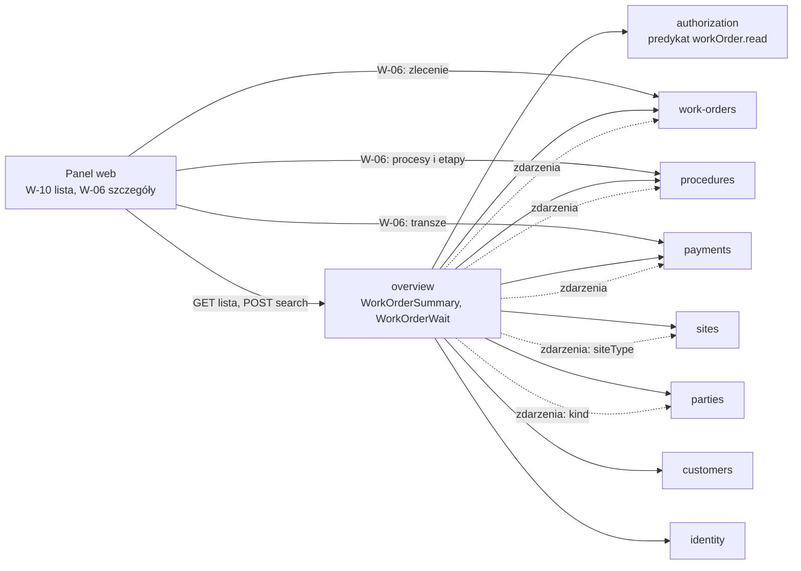
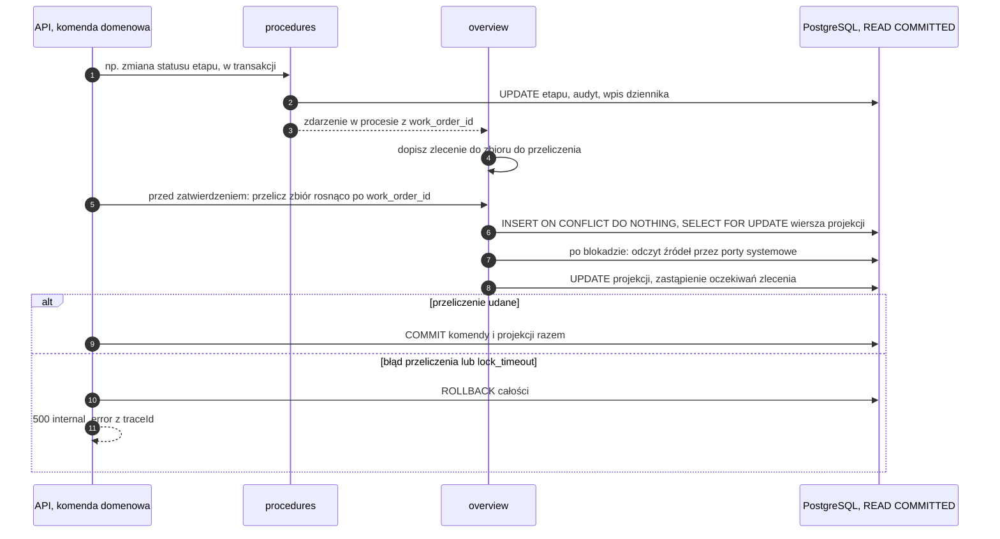
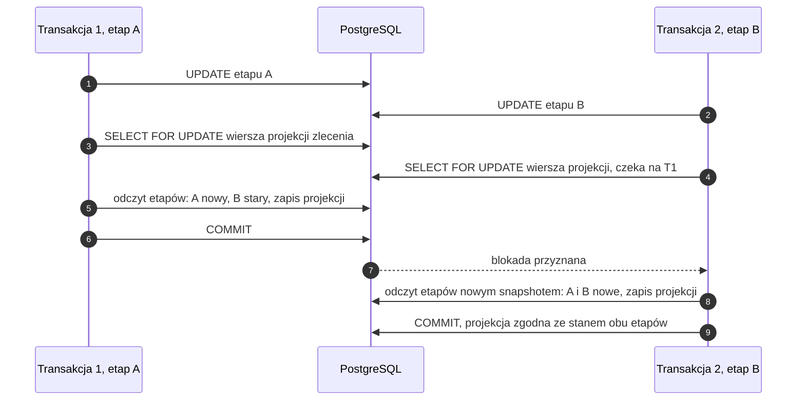
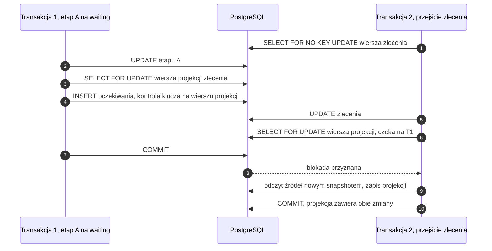

# ADR-0017: Model odczytu listy i podsumowania zlecenia — projekcja w module `overview` aktualizowana w transakcji zapisu

- **Status:** Proponowana (decyzja Konrada na `/adr` — EVM-069 AC6)
- **Data:** 2026-10-04
- **Decydent:** Konrad (akceptacja) · **Autor:** solution-architect
- **Powiązane:** EVM-069 (luka L3 i uwaga 5 z EVM-004, konsultacja W1 z EVM-010), EVM-017, EVM-018, EVM-034, EVM-038, EVM-056, EVM-060, EVM-062, EVM-072; ADR-0001, ADR-0003, ADR-0004, ADR-0008, ADR-0010, ADR-0013

## Spis treści
1. [Kontekst i problem](#kontekst-i-problem)
2. [Kryteria decyzji](#kryteria-decyzji)
3. [Rozważane opcje](#rozważane-opcje)
4. [Ocena](#ocena)
5. [Decyzja](#decyzja)
6. [Model projekcji](#model-projekcji)
7. [Aktualizacja, przebudowa i weryfikacja](#aktualizacja-przebudowa-i-weryfikacja)
8. [Definicje wyliczeń (AC2)](#definicje-wyliczeń-ac2)
9. [Kontrakt API (AC3)](#kontrakt-api-ac3)
10. [Wymagania bezpieczeństwa W1–W12](#wymagania-bezpieczeństwa-w1w12)
11. [Plan testów (AC4)](#plan-testów-ac4)
12. [Wpływ na backlog i model (AC5)](#wpływ-na-backlog-i-model-ac5)
13. [Konsekwencje](#konsekwencje)
14. [Plan wyjścia](#plan-wyjścia)
15. [Weryfikacja](#weryfikacja)
16. [Pytania do Konrada](#pytania-do-konrada)
17. [Źródła](#źródła)

## Kontekst i problem
Lista zleceń (W-10) i karta podsumowania zlecenia (W-06) pokazują dane trzech modułów: `work-orders` (numer, status, opiekun, klient, lokalizacja), `procedures` (etapy — „Czekamy na”, „Termin”) i `payments` (transze — „Płatność”, „Po terminie”, „Nieopłacone”). Lista musi po tych danych **filtrować i sortować** („Najpilniejsze”, „Najdłużej czekamy”, „Termin”, „Czekamy na OSD > 14 dni”) z paginacją kursorową (keyset), z polityką autoryzacji w zapytaniu (SR-AUTHZ-03) i z p95 < 300 ms przy 10 tys. syntetycznych zleceń (zasady wspólne M1).

Obecny model na to nie pozwala:
- **Reguła 2 ADR-0001:** moduł korzysta z innego modułu wyłącznie przez fasadę, zdarzenia i typy — nie robi joinów do cudzych tabel. Dlatego `work-orders` nie może filtrować ani sortować po kolumnach `procedures` i `payments`.
- **Kierunek zależności:** `procedures` i `payments` zależą od `work-orders`. Gdyby `work-orders` subskrybował ich zdarzenia, powstałby cykl.
- Luka L3 z EVM-004 (`flows/scenariusze-a-d.md`) i uwaga 5 EVM-004 zostawiły sposób dostarczenia tych danych do decyzji architekta. Konsultacja W1 (EVM-010) dała wstępną rekomendację (a). Ryzyko R8 (README M1): wariant (a) powiększa EVM-034 i EVM-056.

**Dlaczego teraz:** EVM-034 (faza 3) i EVM-056 (faza 6) zależą od tej decyzji. EVM-017 i EVM-072 budują listę w `work-orders` wcześniej, więc decyzja nie może łamać ich kontraktu.

**Założenia skali** (do szacunków — bez pomiaru): 10 tys. zleceń, z czego ok. 60% niezamkniętych; średnio ok. 20 etapów na zlecenie (limit 30 procesów × 30 etapów) i ok. 4 transze (limit 20); ok. jedno oczekiwanie na zlecenie niezamknięte; dziesiątki użytkowników; jedna VM z PostgreSQL 18 (ADR-0003, ADR-0011).

**Ograniczenia:** w `v1` kontrakt zmienia się tylko addytywnie (ADR-0004, oasdiff), w URL nie ma danych osobowych (SR-API-04), M1 działa bez modułu `sync` i bez triggerów `SyncChange`, bez nowych usług, zależności i kosztów.

**Poza zakresem decyzji:**
- kolumna „Postęp” W-10 (`breakpoint.wide`) i postęp procesu ([P-6], styleguide 1.2.0 § 3.23). Ta reguła liczenia czeka na decyzję Konrada z EVM-014: czy etapy „Nie dotyczy” wypadają z mianownika. ADR jej nie rozstrzyga. Gdy któraś historyjka weźmie kolumnę „Postęp”, projekcja może dostać liczniki etapów (zmiana *expand*);
- licznik wszystkich wyników na W-10 (README M1 → „Uwagi do potwierdzenia”, pkt 2) — projekcja go nie przesądza;
- pulpit (M3) i raporty (M4).

## Kryteria decyzji
| Kryterium | Waga (1–5) | Uzasadnienie |
|---|---|---|
| **K0. Sortowanie i filtrowanie po danych kilku modułów** | eliminujące | wymagają tego EVM-034 AC4 („Najdłużej czekamy”, „Termin”) i EVM-056 AC3 („Najpilniejsze”); wariant bez tej zdolności nie dostarcza historyjek |
| K1. Zgodność z ADR-0001 (reguła 2, brak cykli, własność tabel) | 5 | granice modułów egzekwuje dependency-cruiser; wyjątek wymaga adnotacji w ADR-0001 |
| K2. Autoryzacja warunkiem w zapytaniu (SR-AUTHZ-03) | 5 | wiersz spoza uprawnień nie może wpływać na wynik, kolejność, „+n”, sumy ani granice stron |
| K3. p95 < 300 ms przy 10 tys. syntetycznych zleceń | 4 | kryterium AC6 w EVM-034 i EVM-056; zapas na wzrost |
| K4. Spójność z zapisem | 4 | po udanej komendzie lista pokazuje stan po zmianie (bez okna niespójności) |
| K5. Brak danych osobowych (SR-DATA-01) | 4 | każda kopia danych to dodatkowe miejsce w inwentaryzacji RODO |
| K6. Możliwość przebudowy | 3 | po błędzie lub zmianie definicji stan musi dać się odtworzyć ze źródeł |
| K7. Wpływ na synchronizację w M2 | 3 | komendy z telefonu nie mogą ominąć mechanizmu; brak nowych danych na urządzeniu |
| K8. Prostota wdrożenia i utrzymania | 4 | mały zespół agentów, jeden akceptujący |
| K9. Testowalność | 4 | TDD, testy integracyjne z prawdziwą bazą (Testcontainers) |
| K10. Ewolucja M3/M4 (pulpit, raporty, rola Monter) | 3 | te same agregaty w pulpicie; polityka przypisań w M4 |

Skala ocen 1–5 (5 = najlepiej); suma ważona = Σ (waga × ocena), maksimum 195. K0 nie wchodzi do sumy: wariant, który go nie spełnia, odpada niezależnie od wyniku.

## Rozważane opcje
1. **(a) Projekcja w module odczytu `overview`.** Tabele `work_order_summaries` (wiersz na zlecenie) i `work_order_waits` (wiersz na oczekiwanie) zawierają wyłącznie identyfikatory, kody, daty i liczniki. Handlery zdarzeń w procesie przeliczają projekcję w tej samej transakcji co zmiana. Jest polecenie przebudowy i weryfikacji. Lista i wyszukiwanie czytają jedną tabelę modułu-właściciela.
2. **(b1) Widok SQL w schemacie odczytu.** Widok (np. `overview.work_order_list_v`) łączy i agreguje tabele `work_orders`, `procedures`, `payments` i `parties` przy każdym żądaniu. To wyjątek od reguły 2 ADR-0001: jeden autor pisze SQL do tabel czterech modułów. Wariant wymaga adnotacji w ADR-0001, a ze względu na uprawnienia — `security_invoker` i `security_barrier`.
3. **(b2) Zapytanie składane z fragmentów publikowanych przez moduły-właścicieli.** `procedures` publikuje podzapytanie „sygnały oczekiwań i terminów per zlecenie”, `payments` — „sygnały płatności per zlecenie”. `overview` składa z nich zapytanie listy w czasie żądania. Własność SQL zostaje w modułach, ale wykonane zapytanie przecina schematy i agreguje dane przy każdym żądaniu.
4. **(c) Składanie z fasad przez listy ID.** `procedures` i `payments` zwracają zbiory ID zleceń spełniających filtr (np. „czekamy na OSD > 14 dni”), a `work-orders` filtruje `id = ANY(…)`. Sortować można wyłącznie po polach `work-orders`.

## Ocena
| Kryterium (waga) | (a) | (b1) | (b2) | (c) |
|---|---|---|---|---|
| K0. Sortowanie między modułami (eliminujące) | tak | tak | tak | **nie** |
| K1. Zgodność z ADR-0001 (5) | 5 | 1 | 3 | 5 |
| K2. Polityka w zapytaniu (5) | 4 | 4 | 5 | 3 |
| K3. p95 < 300 ms (4) | 5 | 3 | 3 | 3 |
| K4. Spójność z zapisem (4) | 4 | 5 | 5 | 5 |
| K5. Brak danych osobowych (4) | 4 | 5 | 5 | 5 |
| K6. Przebudowa (3) | 4 | 5 | 5 | 5 |
| K7. Synchronizacja M2 (3) | 5 | 5 | 5 | 5 |
| K8. Prostota (4) | 3 | 4 | 2 | 4 |
| K9. Testowalność (4) | 4 | 3 | 3 | 4 |
| K10. Ewolucja M3/M4 (3) | 4 | 3 | 3 | 2 |
| **Suma ważona (maks. 195)** | **164** | **144** | **151** | 160 — **odpada (K0)** |

**Uzasadnienie ocen**
- **K1.**
  - (a) korzysta wyłącznie z fasad, portów i zdarzeń i ma własne tabele; żaden moduł nie zależy od `overview`, jak w regule 4 ADR-0001 (`sync`, `audit`, `timeline`).
  - (b1) łamie regułę 2: jeden widok czyta tabele czterech modułów, a migracja każdego z nich może zepsuć widok (sprzężenie migracji).
  - (b2) zostawia autorstwo SQL właścicielom, ale wykonuje zapytanie przez cztery schematy. Moduły muszą utrzymywać publiczne fragmenty SQL — nowy rodzaj API, którego ADR-0001 nie przewiduje.
  - (c) jest w pełni zgodny.
- **K2.**
  - (a) stosuje predykat polityki do kopii kolumn autoryzacyjnych (`deleted_at`, w M4 przypisania). Ryzyko ich rozjazdu ogranicza aktualizacja w tej samej transakcji, `verify` z alertem i obrona w głąb (W2). Stąd 4, a nie 5.
  - (b1) wymaga `security_invoker`. Bez tej opcji uprawnienia do czterech schematów skupiają się u właściciela widoku.
  - (b2) stosuje predykat bezpośrednio do kolumn źródłowych.
  - (c) wymaga, by każda fasada liczyła zbiór ID z polityką użytkownika, a składanie zachęca do odsiewania po pobraniu strony — tego zakazuje SR-AUTHZ-03.
- **K3.** Szacunek analityczny — tabela niżej.
- **K4.** (a) jest spójna w momencie zatwierdzenia transakcji. Rozjazd jest możliwy tylko przy błędzie w kodzie (brak handlera), a wykrywa go `verify`. Pozostałe warianty czytają źródła na żywo.
- **K5.** (a) przechowuje pseudonimowe identyfikatory (motyw 26 RODO — to nadal dane osobowe), daty i liczniki, bez nazw, pól swobodnych i kwot. To dodatkowe miejsce w inwentaryzacji (W1). Pozostałe warianty niczego nie kopiują.
- **K6.** (a) potrzebuje poleceń `rebuild` i `verify` (koszt wdrożenia); pozostałe nie mają stanu.
- **K7.** Wszystkie warianty działają tylko na serwerze, a komendy z telefonu przechodzą tą samą ścieżką domenową.
- **K8.** (a) to nowy moduł, handlery i przebudowa. (b2) wymaga mechanizmu składania fragmentów SQL — najbardziej nietypowe. (b1) i (c) są proste do napisania.
- **K9.** W (a) przeliczenie jest czystą funkcją stanu źródeł: testy jednostkowe plus porównanie „projekcja = przeliczenie”. (b1) i (b2) to logika w SQL, testowalna tylko na pełnej bazie.
- **K10.** W (a) pulpit (M3) korzysta z tej samej projekcji, a polityka Montera (M4) — z kopii przypisań. W (b) agregacje rosną z każdym nowym sygnałem. (c) nie obsłuży pulpitu z sortowaniem.

**Szacunek wydajności (analityczny, bez pomiaru; założenia skali — wyżej)**
| Ścieżka | (a) projekcja | (b1) / (b2) agregacja przy żądaniu | (c) listy ID |
|---|---|---|---|
| Odczyt strony listy | `work_order_summaries` ~10 tys. wierszy × ~150 B ≈ 1,5 MB + indeksy ≈ 1 MB — w całości w pamięci bufora; filtr, wyrażenie grupy i sortowanie top-N z `LIMIT 26`: rząd **5–15 ms**; filtr oczekiwań (`EXISTS` po indeksie na ~6 tys. wierszy): < 5 ms | „Najpilniejsze” wymaga agregatów dla wszystkich kandydatów przed `LIMIT` (~6 tys. zleceń → ~120 tys. etapów i ~24 tys. transz): agregacja haszująca rzędu **50–150 ms** na żądanie, liniowo z liczbą etapów; indeks nie pomaga przy sortowaniu po agregacie | filtr `= ANY` na zbiorze ID: < 10 ms; **sortowanie między modułami niemożliwe** |
| Wartości wyświetlane | ≤ 6 zapytań wsadowych po kluczu (≤ 100 ID, po jednym na moduł: tytuły, opiekunowie, klienci, lokalizacje, strony, sumy płatności): ~1 ms każde | jak (a) | jak (a) |
| Razem w bazie | **~15–30 ms**; z API i serializacją ~30–60 ms — zapas ≥ 5× do 300 ms | ~70–200 ms; prawdopodobnie < 300 ms przy 10 tys., ale z małym zapasem i wrażliwie na współbieżność | — |
| Koszt zapisu | na transakcję zmieniającą zlecenie: 1 blokada wiersza projekcji + ok. 8–10 krótkich zapytań po kluczu ≈ **3–6 ms** | brak | brak |
| Wzrost | liniowy; do ~100 tys. zleceń (~15 MB) przegląd nadal w pamięci (~50–100 ms); powyżej — kolumny grup bez `:today` z indeksem albo rewizja ADR | liniowy z liczbą etapów i transz | — |

Pomiar p95 to kryterium AC6 w EVM-034 i EVM-056 (plan testów niżej). Wersje i semantykę PostgreSQL 18 (READ COMMITTED, tryby blokad wierszy i kontrole kluczy obcych, porównanie wierszy, indeksy częściowe, opcje widoków) oraz reguły oasdiff zweryfikowano 2026-10-04 ([Źródła](#źródła)).

## Decyzja
Wybieramy **(a) — projekcję w module odczytu `overview` aktualizowaną w tej samej transakcji co zapis**. Wariant spełnia K0, ma najwyższą sumę ważoną i zachowuje regułę 2 ADR-0001 bez wyjątku. Wyższy koszt wdrożenia (ryzyko R8) rekompensuje przewidywalny czas odczytu i prostsze testy. **ADR-0001 nie dostaje adnotacji.** Planem wyjścia jest (b2).

Elementy decyzji:
1. **Rozdzielenie odczytów.**
   - Lista i wyszukiwanie (W-10) filtrują i sortują po danych kilku modułów, więc czytają projekcję.
   - Podsumowanie W-06 dotyczy jednego zlecenia i **nie korzysta z projekcji**. SPA składa kafle z zasobów zakotwiczonych w zleceniu (procesy z etapami — EVM-031/032, transze — EVM-053), zgodnie z zasadą wspólną M1 i EVM-018.
   - Wartości zależne od daty i bieżący etap procesu serwer liczy ze wstrzykiwanego zegara i zwraca jako pola tylko do odczytu tych zasobów ([Kontrakt](#kontrakt-api-ac3)).
   - Każdy kafel ma własne źródło danych, więc błąd jednego źródła daje „alert w kaflu”, a pozostałe kafle działają (EVM-034 AC8, EVM-056 AC8).
2. **Moduł `overview`** (schemat `overview`) zależy od `work-orders`, `procedures`, `payments`, `sites`, `parties`, `customers`, `identity` i `authorization` przez fasady, porty systemowe i zdarzenia. **Żaden moduł nie zależy od `overview`.** Jedyny klucz obcy poza schemat `overview` prowadzi z `work_order_summaries` do `work_orders` — zgodnie z kierunkiem zależności. `work_order_waits` wskazuje `work_order_summaries` ([Współbieżność](#aktualizacja-przebudowa-i-weryfikacja)).
3. **Projekcja przechowuje wyłącznie klucze filtrów i sortowań**: identyfikatory, kody, daty i liczniki ([Model projekcji](#model-projekcji)). Bez nazw, tytułów, pól swobodnych, danych kontaktowych, `search_text` i kwot. Wartości wyświetlane pobieramy przez fasady raz na stronę, stałą liczbą zapytań.
4. **Aktualizacja w tej samej transakcji.**
   - Przeliczenie obejmuje cały wiersz zlecenia ze stanu źródeł, bez przyrostów — jest więc idempotentne i niezależne od kolejności zdarzeń.
   - Działa pod blokadą wiersza projekcji. Wycofanie komendy wycofuje projekcję.
   - Komendy domenowe blokują wiersz `work_orders` w trybie `SELECT … FOR NO KEY UPDATE`, a nie `FOR UPDATE`. Z `FOR UPDATE` kontrola klucza obcego projekcji tworzyłaby cykl blokad ([Współbieżność](#aktualizacja-przebudowa-i-weryfikacja)).
5. **Przebudowa i weryfikacja.**
   - Polecenia CLI `rebuild` i `verify` w kontenerze `worker` używają tej samej funkcji przeliczenia co handlery.
   - Nocny `verify` działa jako zadanie pg-boss z metryką i alertem.
6. **Polityka w zapytaniu.** Predykat `workOrder.read` z modułu `authorization` działa na kolumnach projekcji w tym samym zapytaniu co widok, filtry, sortowanie i kursor.
7. **Synchronizacja M2.**
   - Projekcja istnieje tylko na serwerze: poza zakresem urządzenia, bez triggerów `SyncChange`.
   - Komendy z telefonu przechodzą tą samą ścieżką komend domenowych.
8. **Miejsce operacji.**
   - W EVM-017 i EVM-072 lista i wyszukiwanie powstają w `work-orders`.
   - **EVM-034 przenosi je do `overview` bez zmiany kontraktu:** ta sama ścieżka, `operationId`, tag i `x-evia-authz`; zmienia się tylko moduł, który je implementuje.
   - Odczyt pojedynczego zlecenia zostaje w `work-orders`.

Strzałki od panelu to wywołania API. Strzałki od `overview` oznaczają zależność: ciągła — fasada lub port systemowy (W5), przerywana — subskrypcja zdarzeń. Konwencja jak w [mapie modułów](../README.md#mapa-modułów-domenowych).

## Model projekcji
Schemat `overview`. Lista kolumn jest **zamknięta** (W1): nowa kolumna wymaga zmiany tego ADR lub historyjki z przeglądem `security-engineer` i aktualizacji klasyfikacji. Tekst występuje wyłącznie jako kod z ograniczeniem `CHECK`. Sygnały płatności dochodzą w EVM-056 jako zmiana *expand* (nowe kolumny z wartością domyślną + `rebuild`).

**`overview.work_order_summaries`** — wiersz na zlecenie (także usunięte miękko; tylko klucze)
| Kolumna | Typ | Źródło (port systemowy) | Do czego | Historyjka |
|---|---|---|---|---|
| `work_order_id` | `uuid` PK, FK → `work_orders.work_orders(id)` `ON DELETE CASCADE` | `work-orders` | kotwica, rozstrzygnięcie remisu (`id`) | EVM-034 |
| `number` | `text`, `CHECK` wzorca numeru z EVM-022 | `work-orders` | sortowanie „Numer” | EVM-034 |
| `status` | `text`, `CHECK` (`WorkOrderStatus`) | `work-orders` | filtr statusu, widoki, „niezamknięte” | EVM-034 |
| `created_at` | `timestamptz` | `work-orders` | sortowanie „Utworzono” | EVM-034 |
| `deleted_at` | `timestamptz` NULL | `work-orders` | **kolumna autoryzacyjna** (predykat polityki, widok „Usunięte” — EVM-060) | EVM-034 |
| `coordinator_user_id` | `uuid` NULL | `work-orders` (`WorkOrderAssignment`, `coordinator`) | widok „Moje”, filtr „Opiekun” | EVM-034 |
| `customer_id`, `site_id` | `uuid` | `work-orders` | wyszukiwanie (zbiory ID), filtry `customerId` i `siteId` (historia klienta, „Inne zlecenia w tej lokalizacji”) | EVM-034 |
| `site_type` | `text` NULL, `CHECK` formatu kodu | `sites` | filtr „Typ obiektu” (EVM-072 AC4) | EVM-034 |
| `source_template_id` | `uuid` NULL | `work-orders` | filtr „Szablon” (EVM-072 AC4) | EVM-034 |
| `waiting_count` | `integer` ≥ 0 | `procedures` | „+n” w kolumnie „Czekamy na” | EVM-034 |
| `longest_waiting_since`, `longest_waiting_on`, `longest_waiting_party_id` | `date` NULL, `text` NULL `CHECK` (`customer` / `party`), `uuid` NULL | `procedures` | sortowanie „Najdłużej czekamy”, grupa 2 „Najpilniejsze”, kolumna „Czekamy na” | EVM-034 |
| `next_due_date` | `date` NULL | `procedures` | kolumna i sortowanie „Termin”, grupy 1 i 3 „Najpilniejsze” | EVM-034 |
| `invoiced_count`, `paid_count` | `integer` ≥ 0 | `payments` | widok „Nieopłacone”, kolumna „Płatność” | EVM-056 |
| `earliest_invoiced_due_date` | `date` NULL | `payments` | widok „Po terminie”, grupa 1 „Najpilniejsze”, kolumna „Płatność” | EVM-056 |
| `recomputed_at` | `timestamptz` | `overview` | diagnostyka (`verify`) | EVM-034 |

**`overview.work_order_waits`** — wiersz na etap w stanie `waiting` (nieusunięty etap nieusuniętego procesu)
| Kolumna | Typ | Do czego |
|---|---|---|
| `stage_id` | `uuid` PK (bez klucza obcego — wiersz zastępuje przeliczenie) | identyfikacja oczekiwania |
| `work_order_id` | `uuid`, FK → `overview.work_order_summaries(work_order_id)` `ON DELETE CASCADE` — kontrola klucza trafia w wiersz projekcji, który przeliczenie już blokuje, a nie w wiersz zlecenia ([Współbieżność](#aktualizacja-przebudowa-i-weryfikacja)) | kotwica, `EXISTS` w filtrze |
| `waiting_on` | `text`, `CHECK` (`customer` / `party`) | filtr „klient / strona” |
| `party_id` | `uuid` NULL (`CHECK`: wymagany wtedy i tylko wtedy, gdy `waiting_on = party`) | obsługa zmiany rodzaju strony |
| `party_kind` | `text` NULL, `CHECK` formatu kodu `^[a-z][a-z0-9_]{1,63}$` (bez listy wartości — nowy `PartyKind` nie wymaga migracji `overview`) | filtr „rodzaj strony” |
| `waiting_since` | `date` | filtr „dłużej niż X dni” |

**Indeksy startowe:** `work_order_waits (waiting_on, party_kind, waiting_since)`, `work_order_waits (work_order_id)`, `work_order_waits (party_id)`; `work_order_summaries (customer_id)`, `(site_id)`, `(coordinator_user_id)`. Przy 10 tys. wierszy listę obsługuje przegląd tabeli w pamięci. Indeksy częściowe — tylko ze stałym predykatem (np. `WHERE deleted_at IS NULL`): predykat z parametrem (np. `:today`) nie pozwala użyć indeksu częściowego (PostgreSQL 18, § 11.8). Ostateczne indeksy wynikają z planów zapytań (`EXPLAIN (ANALYZE, BUFFERS)`) w teście wydajności EVM-034 i EVM-056.

**Zakaz kopiowania (W1):** `title`, `description`, `statusReason`, `blockedReason`, `notes`, numer faktury, kwoty, nazwy (klientów, stron, użytkowników, etapów), adresy, kontakty, `search_text`. Wartości zależne od daty („po terminie”, liczby dni) — nigdy zapisywane.

**Klasyfikacja (SR-DATA-01):** **WF**; pośrednio **DO-K** (`customer_id`, `site_id`), **DO-P** (`coordinator_user_id`), **DO-3** (`party_id`) oraz terminy i liczniki transz powiązane z klientem. To dane **pseudonimowe** (motyw 26 RODO), a nie dane bez znaczenia dla RODO. Brak pól swobodnych, `search_text` i projekcji na telefon. Usuwanie:
- purge zlecenia usuwa projekcję kaskadowo (łańcuch kluczy obcych `work_orders` → `work_order_summaries` → `work_order_waits`);
- soft delete jest kopiowany jako `deleted_at`;
- anonimizacja nie dotyczy, bo projekcja nie przechowuje wartości danych osobowych;
- retencja — jak `WorkOrder`.

Wiersz klasyfikacji: [`domain-model.md`](../domain-model.md#klasyfikacja-danych).

## Aktualizacja, przebudowa i weryfikacja
**Przeliczenie w transakcji zapisu**
1. Komenda domenowa dowolnego modułu publikuje zdarzenia w procesie, w tej samej transakcji co zmiana — to mechanizm handlerów z EVM-038.
2. Handlery `overview` subskrybują **wszystkie** zdarzenia zmian encji:
   - `WorkOrder` i `WorkOrderAssignment` — w tym soft delete, przywrócenie i purge;
   - `Procedure` i `ProcedureStage`;
   - `PaymentMilestone` — od EVM-056;
   - spośród zdarzeń `Site` tylko te ze zmianą `siteType`, a spośród zdarzeń `Party` — tylko ze zmianą `kind`.

   Handler niczego nie liczy. Dopisuje `work_order_id` do zbioru „do przeliczenia” w kontekście transakcji (rejestr działań przed zatwierdzeniem w `platform`, wprowadzany w EVM-034). Zdarzenia lokalizacji i stron mapuje na zlecenia przez własne tabele: `work_order_summaries.site_id` i `work_order_waits.party_id`.
3. **Przed zatwierdzeniem** `overview` przetwarza zbiór w kolejności rosnącej `work_order_id`. Dla każdego zlecenia:
   1. `INSERT … ON CONFLICT DO NOTHING`, potem `SELECT … FOR UPDATE` wiersza projekcji;
   2. **dopiero po uzyskaniu blokady** — odczyt stanu źródeł kolejnymi poleceniami przez porty systemowe (W5);
   3. obliczenie wiersza czystą funkcją;
   4. zapis: `UPDATE` wiersza i zastąpienie wierszy `work_order_waits` zlecenia.

   Zlecenia usuniętego trwale (purge) w tej samej transakcji nie przeliczamy — jego wiersze usuwa kaskada.
4. Błąd przeliczenia albo przekroczenie `lock_timeout` wycofuje całą transakcję (komendę i projekcję). Odpowiedź: `500 internal_error` z `traceId`, bez szczegółów SQL (W12); metryka `projection_recompute_failed_total`.

**Współbieżność (READ COMMITTED).** Dwie transakcje zmieniają dwa różne etapy tego samego zlecenia:
- druga czeka na blokadę wiersza projekcji;
- po zatwierdzeniu pierwszej każde kolejne polecenie drugiej dostaje nowy snapshot (PostgreSQL 18, § 13.2.1), więc jej odczyt źródeł widzi już obie zmiany.

Warunek poprawności: **źródła czytamy wyłącznie po uzyskaniu blokady** — bez buforowania odczytów sprzed niej. Projekcję blokujemy zawsze na końcu transakcji i w stałej kolejności.

**Blokady domenowe i klucze obce.** Przeliczenie czyta źródła bez blokad, ale zapis projekcji uruchamia kontrole kluczy obcych. `INSERT` po stronie odwołującej się blokuje wiersz nadrzędny w trybie `FOR KEY SHARE`. Ten tryb koliduje z `FOR UPDATE`, z `DELETE` i ze zmianą kolumn kluczowych wiersza nadrzędnego (PostgreSQL 18, § 13.3.2). Gdyby oczekiwania wskazywały `work_orders`, powstałby cykl blokad:
- komenda trzyma `SELECT … FOR UPDATE` zlecenia (np. przejście z EVM-030 albo transza z EVM-053) i przed zatwierdzeniem czeka na blokadę wiersza projekcji;
- równoległa zmiana etapu albo `rebuild` trzyma blokadę wiersza projekcji i przy wstawianiu oczekiwania czeka na `FOR KEY SHARE` tego samego zlecenia.

Wynikiem byłoby zakleszczenie (`40P01`) i `500` dla jednej z komend. Dlatego obowiązują trzy reguły:
1. **`work_order_waits` wskazuje `work_order_summaries`, a nie `work_orders`** ([Model projekcji](#model-projekcji)). Kontrola klucza przy zastępowaniu oczekiwań trafia w wiersz projekcji, który transakcja już blokuje, więc nie czeka na blokady domenowe. `UPDATE` wiersza projekcji nie zmienia `work_order_id`, więc nie sprawdza ponownie klucza do `work_orders`. Purge usuwa wiersze łańcuchowo: `work_orders` → `work_order_summaries` → `work_order_waits`.
2. **Komendy domenowe blokują wiersz `work_orders` w trybie `SELECT … FOR NO KEY UPDATE`** (Kysely `.forNoKeyUpdate()`), a nie `FOR UPDATE`:
   - tryb wyklucza się sam ze sobą, więc nadal serializuje przejścia zlecenia i komendy transz (EVM-053);
   - nie koliduje z `FOR KEY SHARE` z kontroli kluczy obcych;
   - zwykły `UPDATE` zlecenia bez zmiany kolumn kluczowych bierze ten sam tryb;
   - komenda, która ma się serializować z przejściami, bierze blokadę jawnie i nie polega na niejawnej blokadzie klucza obcego;
   - kolumn z unikalnym indeksem (`id`, `number` — nadawany przy utworzeniu, EVM-022) komendy nie zmieniają. Taka zmiana brałaby `FOR UPDATE` i wymaga przeglądu tej sekcji.
3. **Pierwszy `INSERT` wiersza `work_order_summaries`** sprawdza klucz do `work_orders` (`FOR KEY SHARE`):
   - w zwykłej pracy wiersz powstaje w transakcji utworzenia zlecenia, która sama trzyma nowy wiersz zlecenia;
   - poza nią wiersz wstawia tylko `rebuild` — gdy go brakuje (pusta projekcja po wdrożeniu EVM-034 albo rozjazd). Dzięki regule 2 ta kontrola nie czeka na komendy domenowe;
   - czeka tylko na purge tego zlecenia. Po jego zatwierdzeniu `rebuild` dostaje błąd klucza obcego (`23503`, bez cyklu blokad) i ponawia partię bez tego zlecenia.

Purge równoległy z przeliczeniem istniejącego wiersza też nie tworzy cyklu. Przeliczenie zapisuje tylko wiersze projekcji, które już blokuje, więc nie czeka na purge. Kaskada purge czeka na zatwierdzenie przeliczenia, a potem usuwa wiersze.

Przeplot z regułami 1 i 2 — komenda z blokadą wiersza zlecenia i równoległa zmiana etapu tego zlecenia (bez cyklu blokad):

**Funkcja przeliczenia** (czysta, testowana jednostkowo; dane z portów systemowych, W5):

| Kolumny wyniku | Reguła |
|---|---|
| wiersze `work_order_waits` | etapy w stanie `waiting` |
| `waiting_count` | liczba tych etapów |
| `longest_waiting_*` | oczekiwanie z najmniejszym `waitingSince`; remis: `Procedure.position`, potem `ProcedureStage.position`, potem `stage_id` |
| `next_due_date` | najmniejszy `dueDate` etapów [niezakończonych](#definicje-wyliczeń-ac2) |
| `invoiced_count` | liczba transz `invoiced` |
| `earliest_invoiced_due_date` | najmniejszy `dueDate` transz `invoiced` |
| `paid_count` | liczba transz `paid` |

Dane wejściowe:
- `work-orders`: klucze zlecenia i opiekun;
- `sites`: `siteType`;
- `procedures`: etapy nieusuniętych procesów — `stageId`, pozycje, `status`, `waitingOn`, `waitingOnPartyId`, `waitingSince`, `dueDate`;
- `parties`: `kind` stron, na które czekamy;
- `payments`: `status` i `dueDate` transz.

Zawsze pomijamy dzieci usunięte, a transze `cancelled` nie liczą się do sygnałów płatności (W3). Wynik nie zależy od roli wywołującego (W5, T8).

**Przebudowa i weryfikacja (W11)**
- **Gdzie i jak działa:**
  - polecenia CLI w kontenerze `worker` (dokładna składnia — EVM-034), uruchamiane jako `evia_app`;
  - **bez endpointu HTTP i bez funkcji w panelu**;
  - partie z limitem rozmiaru (start: 500 zleceń, konfiguracja), współbieżność 1;
  - te same blokady i ta sama funkcja przeliczenia co handlery, bez wyłączania systemu;
  - partia przerwana błędem klucza obcego (`23503` — purge zlecenia w trakcie przebudowy) jest ponawiana bez tego zlecenia ([Współbieżność](#aktualizacja-przebudowa-i-weryfikacja)).
- **`rebuild`** przelicza wszystkie zlecenia albo wskazane. Wypełnia też nowe kolumny po zmianie *expand*, np. sygnały płatności w EVM-056 (przed produkcją nie ma danych realnych).
- **`verify`** działa tylko do odczytu:
  - porównuje zapisany wiersz z przeliczonym;
  - raport zawiera **wyłącznie liczby i UUID** zleceń z rozbieżnością, z podziałem na grupy kolumn — bez kwot, dat i nazw;
  - **rozbieżność kolumn autoryzacyjnych** (`deleted_at`, w M4 przypisania) to **alert bezpieczeństwa** (ADR-0013), nie tylko metryka (W2).
- **Nocny `verify`:**
  - zadanie pg-boss z ładunkiem zawierającym wyłącznie identyfikatory;
  - metryka `projection_drift_total` z alertem dla wartości > 0.
- **Logi:** start i koniec z liczbami i `traceId`.
- **Po każdym odtworzeniu bazy z kopii** — `verify`, a przy rozbieżności `rebuild`. Rekomendacja do runbooka odtworzenia (EVM-062).

## Definicje wyliczeń (AC2)
**Pojęcia wspólne**
- **„Dziś” (`:today`)** — data w `Europe/Warsaw` ze wstrzykiwanego zegara (EVM-016):
  - przekazujemy ją do zapytania jako parametr — nigdy `now()` ani `current_date` w SQL i nigdy z żądania;
  - kolejne strony tej samej listy używają `asOf` z kursora (W8);
  - **niczego zależnego od daty nie zapisujemy**.
- **Liczba dni** = różnica dat (`date − date`, liczba całkowita), więc zmiana czasu (np. 2026-10-25) jej nie zmienia.
- **Etap zakończony:** `done`, `not_applicable`. **Etap niezakończony:** `todo`, `in_progress`, `waiting`, `blocked` — rekomendacja, [pytanie 2](#pytania-do-konrada). Pojęcie „otwarty” z tabeli przejść (`todo`, `in_progress`, `waiting`) zostaje bez zmian.
- **Liczone dzieci:** tylko nieusunięte etapy nieusuniętych procesów i nieusunięte transze. Transze `cancelled` pomijamy w sygnałach płatności (W3).
- **Zlecenie niezamknięte:** status inny niż `settled` i `cancelled` (słownik).
- **Oczekiwanie:** etap w stanie `waiting`. Dni oczekiwania: **N = `:today − waitingSince`**. Próg ostrzeżenia: **14 dni** (styleguide § 4.4) — stała w kodzie wspólna dla serwera i panelu, zmiana wraz ze styleguide'em; `triangle-alert` dla N > 14.
- **Etap po terminie:** niezakończony ∧ `dueDate < :today`. **Transza po terminie** (`isOverdue`, D5): `invoiced` ∧ `dueDate < :today`.

| # | Wyliczenie | Źródło | Reguła | Sprawdzenie na przykładach z AC |
|---|---|---|---|---|
| D1 | **Czekamy na [klient / rodzaj strony] dłużej niż X dni** (filtr) | `overview.work_order_waits` | zlecenie ma wiersz oczekiwania z `waiting_on = customer` (klient) albo `waiting_on = party` ∧ `party_kind = K` (rodzaj strony), oraz `waiting_since < :today − X` ⇔ N > X; X — liczba całkowita 1–365; bez rodzaju — dowolne oczekiwanie; bez X — dowolnie długie | EVM-034 AC2: dziś 2026-10-03, `waitingSince` 2026-09-18 → N = 15; X = 14: 15 > 14 — jest; X = 15: 15 > 15 — nie ma |
| D2 | **Widok „Czekamy na OSD > 14 dni”** | jak D1 | D1 z K = `distribution_system_operator`, X = 14, tylko zlecenia niezamknięte ([pytanie 7](#pytania-do-konrada)) | EVM-034 AC3 |
| D3 | **Kolumna „Czekamy na”** | projekcja (`longest_waiting_*`, `waiting_count`) + nazwa i rodzaj strony z fasady `parties` (wsadowo) | najdłuższe oczekiwanie: „[nazwa strony] ([rodzaj]) · od N dni” albo „klient · od N dni” (§ 4.4); `triangle-alert` dla N > 14; „+n”, gdzie n = `waiting_count − 1` (gdy n > 0); brak oczekiwań — „—” | EVM-034 AC1: OSD od 15 dni i klient od 3 dni → „Stoen Operator (OSD) · od 15 dni”, alert, „+1” |
| D4 | **Najdłużej czekamy** (sortowanie) | projekcja | `longest_waiting_since` rosnąco; zlecenia bez oczekiwań na końcu (klucz `'infinity'`); remis `id` | EVM-034 AC4 |
| D5 | **Termin** (kolumna i sortowanie) | projekcja (`next_due_date`) | najbliższy `dueDate` etapów niezakończonych; kolumna: data + `alarm-clock` i `color.text.error`, gdy data < `:today`; sortowanie rosnąco, puste na końcu (`'infinity'`), remis `id` | EVM-034 AC4 |
| D6 | **Po terminie** | projekcja + `:today` (lista); zasoby `procedures` i `payments` (W-06) | etap: niezakończony ∧ `dueDate < :today`; transza: `invoiced` ∧ `dueDate < :today` (`isOverdue`); **widok „Po terminie”** = zlecenia niezamknięte z `earliest_invoiced_due_date < :today` — wyłącznie transze (W-10, § 4.4, EVM-056 AC2); liczone w zapytaniu, niezapisywane | EVM-056 AC5: termin 2026-10-07 — dnia 2026-10-07 nie jest po terminie (7 < 7 — fałsz), dnia 2026-10-08 jest |
| D7 | **Nieopłacone** (widok) | projekcja | zlecenia niezamknięte z `invoiced_count > 0` (także po terminie); „Planowana” nie jest nieopłacona (słownik) | EVM-056 AC2 |
| D8 | **Kolumna „Płatność”** | projekcja (stan) + sumy z fasady `payments` (wsadowo, z polityką użytkownika, z tym samym `:today`) | pierwszy pasujący stan: 1) `earliest_invoiced_due_date < :today` → mocna odznaka „Po terminie” + suma kwot transz po terminie; 2) `invoiced_count > 0` → „Nieopłacone (n)”, n = `invoiced_count`, + suma kwot transz `invoiced`; 3) `paid_count > 0` → „Opłacone” ([pytanie 4](#pytania-do-konrada)); 4) „—”. Sumy w walucie transz; w v1 wyłącznie PLN — druga waluta to wyzwalacz rewizji | EVM-056 AC1: 3 600,00 zł po terminie → „Po terminie” 3 600,00 zł; jedna wystawiona 4 500,00 zł → „Nieopłacone (1)” 4 500,00 zł; wszystkie opłacone → „Opłacone”; bez wystawionych i opłaconych → „—” |
| D9 | **Najpilniejsze** (sortowanie) | projekcja + `:today` | pierwsza pasująca grupa, w grupie klucz rosnąco, remis `id`: **1)** niezamknięte ∧ (transza po terminie ∨ etap po terminie) — klucz: najstarszy termin po terminie (`LEAST` z `earliest_invoiced_due_date` i `next_due_date`, branych tylko gdy < `:today`); **2)** niezamknięte ∧ N najdłuższego oczekiwania > 14 — klucz `longest_waiting_since`; **3)** niezamknięte ∧ `next_due_date` ≥ `:today` — klucz `next_due_date`; **4)** pozostałe (także zamknięte) — klucz `'infinity'`. Krotka sortowania (grupa, data klucza, `id`) nie zawiera NULL — porównanie wierszy w kursorze działa poprawnie (PostgreSQL 18, § 9.25.5). Rola bez odczytu płatności: grupa 1 bez transz (W4) | EVM-056 AC3 ([pytanie 3](#pytania-do-konrada)) |
| D10 | **Kafel „Na jakim etapie”** (W-06) | zasoby `procedures` (procesy z etapami zlecenia) | procesy z ≥ 1 etapem niezakończonym, w kolejności `Procedure.position`; bieżący etap = pierwszy niezakończony wg `ProcedureStage.position` (pole `currentStageId`, liczy serwer); maks. 3 procesy, reszta jako „+ n procesów” | EVM-034 AC5: 9 procesów z etapami niezakończonymi → 3 + „+ 6 procesów” |
| D11 | **Kafel „Na kogo czekamy”** (W-06) | zasoby `procedures` | wszystkie etapy `waiting` od najdłuższego oczekiwania (remis: pozycja procesu, pozycja etapu); format § 4.4, alert dla N > 14 (pole `waitingDays`, liczy serwer); bez wiersza „klient: —”; brak oczekiwań — „Piłka po naszej stronie — nie czekamy na nikogo.” | EVM-034 AC5 |
| D12 | **Kafel „Terminy”** (W-06) | zasoby `procedures` | „Najbliższy:” — najmniejszy `dueDate` ≥ `:today` wśród etapów niezakończonych (z nazwą etapu); „Po terminie:” — etapy niezakończone z `dueDate < :today` od najstarszego terminu (pole `isOverdue` etapu), brak — „brak” | EVM-034 AC5 |
| D13 | **Kafel „Płatności”** (W-06) | zasoby `payments` (transze zlecenia) | „Nieopłacone: suma (liczba)” — transze `invoiced` (także po terminie); „Po terminie” + liczba dni od najstarszego terminu wśród transz po terminie (`:today − min dueDate`, pole `overdueDays` transzy); „Planowane: n” — transze `planned`; „Opłacone: x z y” — x = `paid`, y = wszystkie nieanulowane | EVM-056 AC4: 4 transze (1 wystawiona po terminie 3 600,00 zł, 3 planowane) → „Nieopłacone: 3 600,00 zł (1)”, „Po terminie” z dniami, „Planowane: 3”, „Opłacone: 0 z 4” |

**Zależność od decyzji z EVM-014 (bez rozstrzygania tutaj).** Styleguide 1.2.0 § 3.23 rekomenduje, by postęp procesu („n z m etapów”, [P-6]) nie liczył etapów „Nie dotyczy” w mianowniku. Decyzja należy do Konrada (demo EVM-014). Definicje D1–D13 nie zależą od niej: „Nie dotyczy” jest etapem zakończonym, więc nie wpływa na terminy, oczekiwania ani bieżący etap.

## Kontrakt API (AC3)
Wszystkie zmiany są **addytywne**. Kontrakt powstaje w EVM-034 i EVM-056 — tu opisujemy jego kształt. Nazwy pól i wartości są do potwierdzenia w kontrakcie, ale bez zmiany zasad.

**Operacje bez zmian identyfikacji.** `GET /api/v1/work-orders` (`listWorkOrders`, EVM-017) i `POST /api/v1/work-orders/search` (`searchWorkOrders`, EVM-072) — ta sama ścieżka, `operationId` i tag. Nie powstają nowe operacje, a W-06 nie dostaje zbiorczego endpointu podsumowania.

| Element | Zmiana | Reguła oasdiff (poziom) | Historyjka |
|---|---|---|---|
| `sort` (parametr `GET`, pole treści `search`) | nowe wartości: `longestWaitingSince`, `nextDueDate` (EVM-034), `urgency` (EVM-056); tylko kierunek rosnący (bez `-`) | `request-parameter-enum-value-added`, `request-property-enum-value-added` (info) | EVM-034, EVM-056 |
| `view` | nowe wartości: `waiting_on_dso_over_14_days` (EVM-034), `overdue_payments`, `unpaid` (EVM-056); `deleted` — EVM-060 | jw. (info) | EVM-034, EVM-056 |
| nowe filtry | `waitingOn` (`customer` / `party`), `waitingOnPartyKind` (`PartyKind`), `waitingLongerThanDays` (liczba całkowita 1–365) — opcjonalne | `new-optional-request-parameter`, `new-optional-request-property` (info) | EVM-034 |
| element listy | nowe pola tylko do odczytu: `waiting` (`{ waitingOn, party: { id, displayName, kind } \| null, since, days, otherCount } \| null`), `nextDueDate` (data \| null), `hasOverdueStage` (bool) — EVM-034; `payment` (`{ state, invoicedCount, invoicedTotal, overdueTotal }`) — EVM-056 | `response-optional-property-added` (info) | EVM-034, EVM-056 |
| zasoby W-06 | nowe pola tylko do odczytu: `ProcedureStage.isOverdue`, `ProcedureStage.waitingDays`, `Procedure.currentStageId` (EVM-034); `PaymentMilestone.isOverdue`, `PaymentMilestone.overdueDays` (EVM-056) | `response-optional-property-added` (info) | EVM-034, EVM-056 |
| enumy w odpowiedziach | `waiting.waitingOn`, `waiting.party.kind`, `payment.state` (`overdue`, `unpaid`, `paid`, `none`) — deklarowane jako **`x-extensible-enum`** | bez zgłoszenia przy dodaniu wartości (oasdiff ≥ 1.31); zwykły `enum` dałby `response-property-enum-value-added` (**error**) | EVM-034, EVM-056 |
| domyślne sortowanie API | **bez zmian** (EVM-017). Panel od EVM-056 wysyła `sort=urgency` jawnie (domyślne sortowanie W-10 to decyzja UI). Zmiana wartości domyślnej zmieniłaby znaczenie żądań starszych klientów | — | EVM-056 |

**Zasady kontraktu**
- **Brak zmian łamiących:** żadne pole ani kod błędu nie znika i nie zmienia znaczenia, a walidacja istniejących parametrów się nie zaostrza. oasdiff w CI (ADR-0004) jest bramką.
- **Konwencja `x-extensible-enum` dla enumów w odpowiedziach** — `api-guidelines.md` jej jeszcze nie opisuje. Wprowadza ją EVM-008 (uwaga przekazana z EVM-069). Jeśli EVM-008 tego nie zrobi, EVM-034 dopisuje ją addytywnie do `api-guidelines.md`. Enumy w żądaniach zostają zwykłym `enum`, bo dodanie wartości to poziom info.
- **Parametry w URL:** wyłącznie kody i liczby (`waitingOn`, `waitingOnPartyKind`, `waitingLongerThanDays`, `view`, `sort`) — bez ID stron i danych osobowych (SR-API-04, W7). Fraza wyszukiwania jest tylko w treści `POST`.
- **Kursor** wiąże `asOf` ([W8](#wymagania-bezpieczeństwa-w1w12)), więc zmiana dnia nie miesza stron.
- **`x-evia-authz`** operacji listy i wyszukiwania:
  - role, polityka `workOrder.read` i `channels: [web]` — bez zmian;
  - dochodzi reguła widoczności płatności (W4): pole `payment` jako `hiddenFields` dla ról bez odczytu płatności oraz ograniczenie wartości `view` i `sort` (proponowany klucz `restrictedParams` — kształt ustala EVM-056).

## Wymagania bezpieczeństwa W1–W12
Warunek przeglądu `security-engineer` (konsultacja planu EVM-069, APPROVE z warunkiem): bez tych punktów przegląd ADR (AC6) kończy się CHANGES REQUIRED. Każdy punkt trafia do planu technicznego EVM-034 albo EVM-056.

| # | Wymaganie | Źródła |
|---|---|---|
| W1 | **Klasyfikacja i zamknięta lista kolumn.** Lista kolumn jak w [Modelu projekcji](#model-projekcji); nowa kolumna wymaga przeglądu `security-engineer` i aktualizacji klasyfikacji. Zakaz kopiowania: `title`, `description`, `statusReason`, `blockedReason`, `notes`, numeru faktury, kwot, nazw, kontaktów, `search_text`. Wiersz w `domain-model.md` → „Klasyfikacja danych”: WF, pośrednio DO-K / DO-P / DO-3 (pseudonimowe ID, terminy i liczniki transz), pola swobodne — brak, `search_text` — nie, telefon — nie, usunięcie kaskadowo z purge, soft delete jako kopia `deleted_at`, anonimizacja nie dotyczy, retencja jak `WorkOrder`. W `rodo.md` (EVM-034 dla `ProcedureStage`, EVM-056 dla `PaymentMilestone`) w kolumnie „Gdzie” dochodzi miejsce „projekcja `overview` (serwer)” | SR-DATA-01, SR-DATA-02, V14.1.1, V14.1.2 |
| W2 | **Polityka w zapytaniu.** Predykat `workOrder.read` definiuje i rejestruje `authorization` (ADR-0001) jako budowniczy warunku na wskazanych kolumnach (v1: `deletedAt`; M4: przypisania). `overview` i `work-orders` go stosują, a nie kopiują logiki. Predykat zawsze łączymy przez AND z widokiem, filtrami i kursorem w jednym zapytaniu. Dla ról innych niż Administrator `deleted_at IS NULL`; Administrator widzi usunięte tylko w widoku „Usunięte” (EVM-060). Kolumny autoryzacyjne aktualizuje każda komenda, która je zmienia (soft delete, przywrócenie, purge, przypisanie). Ich rozbieżność wykryta przez `verify` to alert bezpieczeństwa. Obrona w głąb: wsadowe pobranie wartości wyświetlanych w kontekście użytkownika działa w trybie fail-closed — zlecenie niewidoczne dla fasady jest pomijane na stronie, a metryka `projection_authz_drift` rośnie. To uzupełnienie warunku w zapytaniu, nie zamiennik | SR-AUTHZ-03, SR-AUTHZ-02, V8.2.2, CWE-863 |
| W3 | **Niezmiennik agregatów.** Sygnały liczymy wyłącznie z dzieci nieusuniętych i nieanulowanych. Projekcja zakłada autoryzację na poziomie kotwicy (zlecenia). Polityka na poziomie procesu lub etapu albo ukrywanie pól per rola to **wyzwalacz rewizji ADR** i przeglądu security — wtedy „+n”, liczniki i grupy mogłyby ujawniać dzieci niewidoczne dla roli | V8.2.2 |
| W4 | **Sortowanie i filtry tylko po polach, które rola może czytać.** Wartości „Najpilniejsze” (składowa płatności), „Po terminie”, „Nieopłacone” i pole `payment` wymagają prawa odczytu płatności (`paymentMilestone.read`; v1: A, E, R — P6). Rola bez niego (od M4): widoki płatności → `403 forbidden`, pole `payment` ukryte, „Najpilniejsze” liczone bez sygnałów płatności (wariant wyrażenia ze stałych w kodzie). Reguła jest deklarowana w `x-evia-authz`. Kontrola działa w kodzie od EVM-056 i ma test jednostkowy z atrapą polityki; w v1 nie ma roli, która by ją uruchamiała. Chroni przed wyrocznią stanu płatności przez kolejność lub filtr (CWE-203) | api-guidelines, SR-AUTHZ-04, V8.2.3 |
| W5 | **Kontekst wykonania.** Przeliczenie (handlery, `rebuild`, `verify`) czyta przez **dedykowane porty systemowe** modułów źródłowych z minimalnym DTO (ID, kody, daty, pozycje — bez kwot, nazw i pól swobodnych), niezależnie od wywołującego użytkownika. Porty są niedostępne z warstwy `api` (kontrolerów) — reguła dependency-cruiser. Wartości wyświetlane pobieramy przez fasady z polityką użytkownika; o użytkownikach — tylko `id` i `displayName` | V8.2.1, CWE-269, SR-DATA-03 |
| W6 | **Wyszukiwanie po przeniesieniu do `overview`.** Projekcja nie ma kopii `search_text` ani tytułu. Frazę dopasowują fasady `work-orders` (numer, tytuł), `customers` i `sites` — każda zwraca zbiór ID. Zbiory przekazujemy parametrem tablicowym `= ANY($1::uuid[])` z górnym limitem rozmiaru (start: 10 000 ID na fasadę, konfiguracja). Przekroczenie → `400 validation_failed` z `errors[{ pointer: "/query", code: "too_broad" }]` (rekomendacja: od EVM-072, [uwaga](#wpływ-na-backlog-i-model-ac5)). Fraza tylko w treści żądania, nigdy w logach | SR-API-04, SR-INPUT-03, AB-16, AB-18 |
| W7 | **Wejście i kontrakt.** `sort`, `view`, `waitingOn` i `waitingOnPartyKind` z listy dozwolonych (słownik `PartyKind`); wartość spoza listy → `400 validation_failed` bez echa wartości (tylko `pointer` i `code`). `waitingLongerThanDays` — liczba całkowita 1–365 (`0`, `366`, `14a` → `400`); powtórzony parametr → `400 duplicate_parameter`, nieznany → `400 unknown_parameter`. Wyrażenie sortowania „Najpilniejsze” (`ORDER BY` i `CASE`) budujemy wyłącznie ze stałych w kodzie; `:today`, próg 14 dni i X są parametrami. „Dziś” i `asOf` nigdy nie pochodzą z żądania. Nowe pola wyliczane (`isOverdue`, `waitingDays`, `overdueDays`, `currentStageId`, `waiting`, `nextDueDate`, `hasOverdueStage`, `payment`) są `readOnly` i odrzucane na wejściu (`read_only_field`). W URL tylko kody i liczby, bez ID stron | SR-INPUT-01, SR-INPUT-03, SR-API-01, SR-AUTHZ-04, V2.2.1, V1.2.4 |
| W8 | **Kursor.** `asOf` (data „dziś” pierwszej strony) i grupa „Najpilniejsze” są wyłącznie w szyfrowanym i uwierzytelnionym kursorze (`platform/crypto`, api-guidelines). Kursor zawiera też ID użytkownika, skrót filtrów (m.in. `view`, `waitingOn`, rodzaj strony, X, status, skrót frazy) i czas wygaśnięcia, ale nie zawiera jawnie dat ani kwot klucza sortowania. Kursor zmieniony, wygasły, cudzy albo z innymi filtrami → `400 invalid_cursor` | api-guidelines, V8.2.2 |
| W9 | **Kanał.** Lista, wyszukiwanie i zasoby W-06 z polami płatności mają `channels: [web]`. Dopuszczenie `mobile` wymaga osobnej projekcji bez płatności i przeglądu security | SR-AUTHZ-12, SR-SYNC-04, AB-14 |
| W10 | **Baza.** Uprawnienia: `evia_app` — wyłącznie DML na schemacie `overview`; `evia_readonly` — brak dostępu (nadanie w M4 tylko po przeglądzie); właściciel — `evia_migrator`. Klucze obce z `ON DELETE CASCADE` w łańcuchu `work_orders` → `work_order_summaries` → `work_order_waits`, więc purge i ponowne zastosowanie rejestru usunięć po PITR (SR-PRIV-04) czyszczą projekcję. Brak triggerów `SyncChange` | SR-INFRA-03, SR-DATA-08, SR-PRIV-04 |
| W11 | **`rebuild` i `verify`.** Tylko CLI w kontenerze `worker`, bez endpointu HTTP i funkcji w panelu; uruchamiane jako `evia_app`. Te same blokady wiersza co handlery; partie z limitem, współbieżność 1. Log startu i końca z liczbami i `traceId`; raport rozbieżności — wyłącznie liczby i UUID (bez kwot, dat i nazw). Nocny `verify` z metryką i alertem; ładunek zadania pg-boss — tylko identyfikatory. Rekomendacja: `verify` po każdym odtworzeniu z kopii (runbook EVM-062) | SR-AUTHZ-11, SR-LOG-02, SR-LOG-03, SR-INFRA-11, V16.2.5 |
| W12 | **Dostępność.** Po przeniesieniu listy zostają limity (strona ≤ 100, 300 żądań/min, wyszukiwanie 60/min) i licznik masowego odczytu P10 (regresja EVM-017 AC5 i EVM-072 AC5). Rekomendacja: `statement_timeout` dla zapytań listy (start: 2 s) i `lock_timeout` dla blokady projekcji (start: 5 s). Błąd przeliczenia wycofuje komendę z `500 internal_error` i `traceId`, bez szczegółów SQL | SR-API-02, SR-API-01, P10, V15.1.3 |

**Zagrożenia** (różnica względem `threat-model.md`; bez nowego kontenera i przepływu zewnętrznego; po mitygacjach W1–W12 każde schodzi do Low, P1 × W2):

| Kategoria STRIDE | Zagrożenie | Skutek / ocena przed mitygacją | Mitygacja |
|---|---|---|---|
| I/E | rozjazd kolumn autoryzacyjnych projekcji | zlecenie usunięte lub nieprzypisane widoczne na liście; Medium | W2, W11 |
| I | agregaty przy polityce drobniejszej niż kotwica | ujawnienie dzieci niewidocznych dla roli | W3 |
| I | wyrocznia stanu płatności przez kolejność lub filtr (CWE-203) | — | W4 |
| T | zgubione aktualizacje przy równoległej przebudowie i zapisie; zmanipulowany kursor lub `asOf` | — | blokady, W8 |
| D | przeliczenie blokuje komendy; szeroka fraza → ogromny zbiór ID; „Najpilniejsze” bez indeksu | — | `lock_timeout`, W6, szacunek wydajności |
| I (RODO) | projekcja jako kolejne miejsce danych pseudonimowych | — | W1, W10 |

Nowe pozycje TM dopisuje EVM-034 (albo `/milestone close M1`).

## Plan testów (AC4)
Testy powstają w EVM-034 i EVM-056 (TDD, oznaczenia `EVM-034 AC#` / `EVM-056 AC#`). Poziomy wg ADR-0014 i ADR-0015: integracyjne backendu na prawdziwym PostgreSQL 18 (Testcontainers, kontener Linux), jednostkowe dla funkcji przeliczenia i budowy zapytań, smoke k6 na staging przed wydaniem. Pozycje 1–5 to testy wymienione w AC4 EVM-069; T1–T9 to testy z konsultacji `security-engineer`.

| # | Test | Przypadki i oczekiwany wynik | Historyjka |
|---|---|---|---|
| 1 | **Wydajność przy 10 tys. zleceń** (AC4) | Generator danych syntetycznych (z EVM-017) dostaje etapy, oczekiwania i transze w rozkładzie z założeń skali. Dla każdego sortowania (z EVM-017 „Numer” i „Utworzono” oraz `longestWaitingSince`, `nextDueDate`, `urgency`) i każdego widoku (z EVM-017 „Wszystkie niezamknięte” i „Moje” oraz OSD > 14 dni, `overdue_payments`, `unpaid`) oraz dla wyszukiwania po nazwisku i adresie: p95 < 300 ms z ≥ 50 powtórzeń po rozgrzaniu. Plan zapytania listy (`EXPLAIN (ANALYZE, BUFFERS)`) zapisany w raporcie testu. Przed wydaniem — smoke k6 na staging | EVM-034 AC6, EVM-056 AC6 |
| 2 | **Licznik zapytań — brak N+1** (AC4) | Ta sama liczba zapytań SQL dla strony z 1 i ze 100 wierszami: 1 zapytanie listy + ≤ 6 zapytań wsadowych (po jednym na moduł). Dla zapisu: liczba zapytań przeliczenia nie zależy od liczby etapów ani transz | EVM-034 AC6, EVM-056 AC6 |
| 3 | **Polityka w zapytaniu** (AC4) | Zlecenie usunięte miękko z najsilniejszym sygnałem (najstarsze oczekiwanie, najstarszy termin po terminie): wyniki, kolejność, „+n”, sumy i granice stron (60 zleceń, strony po 25) są **identyczne** jak bez tego zlecenia, dla A, E i R. Sprawdzone, że warunek jest w zapytaniu (zapytanie listy zawiera predykat; brak odsiewania po pobraniu) | EVM-034 AC6, EVM-056 AC6 |
| 4 | **Spójność po błędzie transakcji** (AC4) | Wymuszony błąd przeliczenia (atrapa portu) w komendzie zmiany etapu → etap, audyt, wpis dziennika i projekcja bez zmian; odpowiedź `500 internal_error` z `traceId`, bez SQL. Wymuszony błąd w komendzie po przeliczeniu → projekcja wycofana razem z komendą | EVM-034 |
| 5 | **Przebudowa i `verify`** (AC4) | `rebuild` na pustej i na rozjechanej projekcji (ręcznie zmienione wiersze w teście) → zgodność z przeliczeniem; `verify` zgłasza dokładnie zmienione UUID i licznik; rozbieżność `deleted_at` → zdarzenie alertu bezpieczeństwa; `rebuild` równolegle z komendami zmieniającymi etapy tych samych zleceń → po zakończeniu `verify` = 0 rozbieżności | EVM-034 |
| 6 | **Współbieżność** | Dwie równoległe transakcje zmieniają dwa różne etapy jednego zlecenia → projekcja odzwierciedla oba (bez zgubionej aktualizacji); transakcja wielu zleceń w odwrotnej kolejności niż równoległa → brak zakleszczenia (kolejność `work_order_id`); przekroczenie `lock_timeout` → wycofanie i `500`. **Blokada wiersza zlecenia** (przeplot sterowany krokami na dwóch połączeniach, nie losowe obciążenie): komenda trzymająca blokadę wiersza `work_orders` (przejście z EVM-030; w EVM-053 — komenda transzy) równolegle (a) ze zmianą etapu tego zlecenia na `waiting` i (b) z `rebuild` tego zlecenia, także przy brakującym wierszu projekcji → brak `40P01`, obie komendy zatwierdzone, projekcja zawiera obie zmiany (`verify` = 0). Purge zlecenia równolegle z przeliczeniem istniejącego wiersza → brak `40P01`, brak wierszy projekcji; z `rebuild` przy brakującym wierszu → `23503` i ponowienie partii bez zlecenia | EVM-034; komendy transz — EVM-053 |
| 7 | **Granice dat** | D1: dziś 2026-10-03, `waitingSince` 2026-09-18 → jest dla X = 14, nie ma dla X = 15. D6: termin 2026-10-07 → po terminie dopiero 2026-10-08. Zmiana czasu: zegar 2026-10-24T22:30Z (= 2026-10-25 00:30 CEST) i 2026-10-25T23:30Z (= 2026-10-26 00:30 CET) → „dziś” to odpowiednio 2026-10-25 i 2026-10-26, a liczby dni bez przesunięcia. Próg 14: N = 14 bez alertu, N = 15 z alertem | EVM-034 AC2, EVM-056 AC5 |
| 8 | **Projekcja = przeliczenie** (siatka bezpieczeństwa) | Po każdym teście integracyjnym zmieniającym zlecenie, etap, transzę, lokalizację lub stronę wspólna asercja porównuje projekcję dotkniętych zleceń z przeliczeniem — wykrywa brakujący handler | EVM-034, EVM-056 i kolejne |
| T1 | **Parzystość listy i odczytu pojedynczego** | Dla A, E i R lista (każde sortowanie i widok) daje ten sam zbiór ID co `GET` pojedynczego zlecenia; przypadki: usunięte zlecenie, usunięty etap, usunięta transza; widok „Usunięte” tylko dla Administratora (EVM-060) | EVM-034, EVM-056, EVM-060 |
| T2 | **Macierz ról** | Istniejące operacje × każda nowa wartość `sort` / `view` / filtra × {A, E, R, niezalogowany} × kanał (`mobile` → `403 channel_not_allowed`); zasoby W-06 z nowymi polami — przypadek IDOR przez kotwicę (`404`) | EVM-034, EVM-056 |
| T3 | **Walidacja brzegowa** | `waitingLongerThanDays` = 0, 366, `14a` → `400 validation_failed`; parametr powtórzony → `400 duplicate_parameter`; nieznany rodzaj strony i nieznany `sort` → `400` bez echa wartości; pole wyliczane w treści żądania → `read_only_field` | EVM-034, EVM-056 |
| T4 | **Kursor** | Zmieniony, wygasły, cudzy, z innym `view` lub X → `400 invalid_cursor`; kursor sprzed północy (`asOf` 2026-10-07) użyty 2026-10-08 → kolejna strona liczona z `asOf` kursora, bez powtórzeń i luk | EVM-034, EVM-056 |
| T5 | **Schemat i uprawnienia bazy** | Allow-lista kolumn `overview` (z `information_schema`) równa liście z ADR; kolumny tekstowe tylko z `CHECK`; brak triggerów (w tym `SyncChange`) na tabelach `overview`; `evia_app` — wyłącznie DML, `evia_readonly` — brak uprawnień | EVM-034 |
| T6 | **Purge kaskadowy** | Purge zlecenia (A ↑) usuwa wiersze projekcji i oczekiwań; ponowne zastosowanie rejestru usunięć po odtworzeniu (EVM-062) nie zostawia wierszy projekcji | EVM-034, EVM-062 |
| T7 | **Logi `rebuild` i `verify`** | Próbka logów i raportu: liczby, UUID i `traceId` — bez kwot, dat, nazw i fraz | EVM-034 |
| T8 | **Niezależność przeliczenia od roli** | Ta sama komenda wykonana przez A i przez E (oraz `rebuild` bez użytkownika) daje identyczny wiersz projekcji | EVM-034 |
| T9 | **Regresja limitów i P10** | Po przeniesieniu do `overview`: `limit` 101 → `400`, 61. wyszukiwanie w minucie → `429`, rekordy z listy i wyszukiwania wliczają się do licznika masowego odczytu (EVM-017 AC5, EVM-072 AC5) | EVM-034 |

## Wpływ na backlog i model (AC5)
| Dokument | Zmiana | Kiedy |
|---|---|---|
| [`domain-model.md`](../domain-model.md) → „Moduły i własność tabel” | wiersz modułu `overview` (schemat `overview`, projekcje `WorkOrderSummary` i `WorkOrderWait`, zależności), oznaczony „proponowany — ADR-0017” | **EVM-069** |
| `domain-model.md` → „Moduły i własność tabel” → „Zasady” | punkt o projekcji: ta sama transakcja, przeliczenie w całości, bez danych osobowych w wartościach, przebudowa, poza synchronizacją, uprawnienia ról bazy, W-06 bez projekcji; łańcuch kluczy obcych i blokady wiersza zlecenia w trybie `FOR NO KEY UPDATE` ([Współbieżność](#aktualizacja-przebudowa-i-weryfikacja)) | **EVM-069** |
| `domain-model.md` → „Gotowość offline” i „Klasyfikacja danych” | wiersz projekcji (poza urządzeniem; klasyfikacja W1) | **EVM-069** |
| `domain-model.md` → „Pola kontrolowane przez serwer”, `Procedure` (bieżący etap) | pola wyliczane z [kontraktu](#kontrakt-api-ac3); po decyzji o [pytaniu 2](#pytania-do-konrada) — „bieżący etap = pierwszy niezakończony”; usunięcie oznaczeń „proponowany” | EVM-034, EVM-056 |
| [EVM-034](../../backlog/M1/EVM-034-czekamy-na-lista-i-podsumowanie.md) → „Notatki techniczne” | zakres wg ADR: moduł `overview`, sygnały oczekiwań i terminów, przeniesienie listy i wyszukiwania, polecenia `rebuild` i `verify`, testy z AC4, W1–W12, dokumenty do aktualizacji; łańcuch kluczy obcych projekcji i przegląd istniejących blokad wiersza `work_orders` (np. z EVM-030) pod kątem trybu `FOR NO KEY UPDATE` | **EVM-069** |
| EVM-030 i EVM-053 → plan techniczny | blokada wiersza zlecenia (przejścia, komendy transz) w trybie `SELECT … FOR NO KEY UPDATE`, a nie `FOR UPDATE`; notatkę EVM-053 „np. `SELECT … FOR UPDATE`” czytamy zgodnie z tym ADR; EVM-053 dodaje do testu 6 przypadek komendy transzy | plan techniczny EVM-030 i EVM-053 (uwaga w EVM-069 → „Uwagi do rozważenia”) |
| [EVM-056](../../backlog/M1/EVM-056-platnosci-na-liscie-i-podsumowaniu.md) → „Notatki techniczne” | zakres wg ADR: sygnały płatności (expand + `rebuild`), „Najpilniejsze”, widoki, pole `payment`, W4, testy | **EVM-069** |
| ADR-0001 | **bez adnotacji** — rekomendacja (a) nie tworzy wyjątku od reguły 2 | — |
| [`docs/architecture/README.md`](../README.md#mapa-modułów-domenowych) → mapa modułów | węzeł `overview` i jego zależności | EVM-034 (gdy moduł powstaje) |
| `docs/security/rodo.md` → inwentaryzacja | miejsce „projekcja `overview` (serwer)” dla `ProcedureStage` i `PaymentMilestone` (W1) | EVM-034, EVM-056 |
| `docs/security/threat-model.md` | nowe pozycje TM (rozjazd kolumn autoryzacyjnych, wyrocznia przez sortowanie, agregaty przy polityce drobniejszej niż kotwica, przebudowa) | EVM-034 albo `/milestone close M1` |
| `api-guidelines.md` | konwencja `x-extensible-enum` dla enumów w odpowiedziach; szczegół błędu `too_broad` (W6) | EVM-008 (konwencja), EVM-072 lub EVM-034 (`too_broad`) |
| reguły dependency-cruiser | `overview` bez zależności przychodzących; porty systemowe niedostępne z warstwy `api` (W5) | EVM-034 |
| README M1 → ryzyko R8 | ewentualne wydzielenie z EVM-034 enablera „moduł `overview` i przeniesienie listy” (decyzja produktowa przy `/refine`) | po decyzji o [pytaniu 6](#pytania-do-konrada) |

## Konsekwencje
- **Pozytywne:**
  - lista i wyszukiwanie czytają jedną wąską tabelę z przewidywalnym czasem i stałą liczbą zapytań;
  - reguła 2 ADR-0001 zostaje bez wyjątku;
  - polityka działa w jednym zapytaniu;
  - te same sygnały posłużą pulpitowi (M3) i polityce Montera (M4, kopia przypisań);
  - W-06 nie zależy od projekcji, więc szczegóły zlecenia zawsze pokazują stan źródeł;
  - definicje wyliczeń są zapisane w jednym miejscu.
- **Negatywne / koszty:**
  - nowy moduł, handlery dla każdego zdarzenia zmieniającego sygnały, polecenia `rebuild` i `verify`, nocne zadanie;
  - EVM-034 rośnie o przeniesienie listy i wyszukiwania (R8);
  - każda komenda zmieniająca zlecenie, etap lub transzę kosztuje kilka milisekund więcej;
  - nowe miejsce danych pseudonimowych w inwentaryzacji RODO.
- **Ryzyka i mitygacje:**
  - *Rozjazd projekcji* (nowe zdarzenie bez handlera, błąd w funkcji przeliczenia) → handlery subskrybują wszystkie zdarzenia zmian encji, a nie wybrane pola; asercja „projekcja = przeliczenie” po każdym teście integracyjnym (test 8); nocny `verify` z alertem; `rebuild`.
  - *Rozjazd kolumn autoryzacyjnych* → W2 (alert bezpieczeństwa, fail-closed przy wartościach wyświetlanych).
  - *Rozmiar EVM-034 (R8)* → [pytanie 6](#pytania-do-konrada): wydzielenie enablera przy `/refine`.
  - *Brak konwencji `x-extensible-enum`* → oasdiff zablokowałby każdą nową wartość enumu w odpowiedzi; konwencja w EVM-008.
  - *Przeliczenie spowalnia zapis albo blokuje komendy* → `lock_timeout`, metryka czasu przeliczenia (`projection_recompute_duration`), blokada tylko na końcu transakcji.
  - *Zakleszczenia* → stała kolejność blokad projekcji, odczyt źródeł bez blokad, klucz obcy oczekiwań do wiersza projekcji i blokady wiersza zlecenia w trybie `FOR NO KEY UPDATE` (test 6). Tryb blokady sprawdzają przegląd kodu i test 6.
  - *Skala powyżej ~100 tys. zleceń* → kolumny grup niezależne od daty z indeksem albo rewizja ADR (miernik — p95 listy w Grafanie).
  - *Polityka drobniejsza niż kotwica (M4/M5)* → W3: wyzwalacz rewizji.

## Plan wyjścia
- **Do (b2) — główny plan wyjścia.** Moduły `procedures` i `payments` publikują fragmenty zapytań sygnałów. `overview` zastępuje odczyt projekcji zapytaniem złożonym, z tym samym kontraktem i tymi samymi definicjami. Potem migracja *contract* usuwa schemat `overview` i handlery. Koszt: dni, głównie testy wydajności i polityki. Kontrakt API się nie zmienia.
- **Do (b1)** — tylko z adnotacją w ADR-0001 i widokiem `security_invoker`, jeśli (b2) okaże się zbyt złożony.
- **Odwracalność:** decyzja jest lokalna w module `overview` — żaden moduł od niego nie zależy, a kontrakt jest niezależny od sposobu odczytu.

## Weryfikacja
- **AC6 EVM-034 i EVM-056:** p95 < 300 ms przy 10 tys. zleceń dla każdego sortowania i widoku; testy licznika zapytań i polityki zielone.
- **Pilotaż (A i B):**
  - `projection_drift_total` = 0 w nocnym `verify`;
  - zero alertów rozbieżności kolumn autoryzacyjnych;
  - p95 czasu przeliczenia w komendzie < 20 ms (metryka).
- **Przegląd decyzji przy `/milestone close M1`:** czy koszt utrzymania handlerów jest akceptowalny i czy pojawiła się polityka drobniejsza niż kotwica.

## Pytania do Konrada
Rekomendacje architekta. Decyzja zapada na `/adr` (EVM-069 AC6), a pytania powtarza historyjka EVM-069 → „Decyzje”.
1. **Wariant:** (a) — projekcja w module `overview`. *Rekomendacja: tak.*
2. **Etap „Zablokowany” w wyliczeniach** (bieżący etap, „Termin”, „Po terminie”) traktujemy jak niezakończony. *Rekomendacja: tak* — termin nadal obowiązuje, a zablokowany etap jest faktycznie bieżącym krokiem procesu. Konsekwencje:
   - „otwarty etap” w EVM-034 AC4 czytamy jako „niezakończony”;
   - reguła `Procedure` w `domain-model.md` zmienia się na „pierwszy niezakończony” (EVM-034).
3. **„Najpilniejsze” — grupy jak w D9:**
   - pierwsza grupa: transza **lub** etap po terminie;
   - druga: oczekiwanie > 14 dni (ten sam próg co `triangle-alert`, stała w kodzie);
   - trzecia: najbliższy termin etapu;
   - sygnały liczone tylko dla zleceń niezamkniętych.

   *Rekomendacja: tak.*
4. **Kolumna „Płatność”, gdy część transz jest opłacona, a reszta planowana** (bez wystawionych): „Opłacone”. *Rekomendacja: tak* — W-10 rezerwuje „—” dla zleceń bez wystawionych faktur, a takie zlecenie nie ma nic do ściągnięcia.
5. **Pomiar p95 przed decyzją.** *Rekomendacja: nie* — szacunek ma zapas ≥ 5×, a pomiar jest kryterium AC6 w EVM-034 i EVM-056.
6. **Miejsce listy.** W EVM-017 i EVM-072 lista zostaje w `work-orders`; EVM-034 przenosi listę i wyszukiwanie do `overview` bez zmiany kontraktu. *Rekomendacja: tak.* Ze względu na R8 warto przy `/refine` rozważyć wydzielenie z EVM-034 enablera „moduł `overview` i przeniesienie listy” (decyzja produktowa).
7. **Zapisane widoki „Czekamy na OSD > 14 dni”, „Po terminie” i „Nieopłacone”** pokazują tylko zlecenia niezamknięte. Filtr „Czekamy na … dłużej niż X dni” łączy się ze statusem wybranym w filtrach (domyślnie „niezamknięte”). *Rekomendacja: tak* — zamknięte zlecenie nie wymaga działania.

## Źródła
Zweryfikowane 2026-10-04:
- PostgreSQL 18 (bieżące wydanie 18.6, wsparcie do 2030-11-14): https://www.postgresql.org/support/versioning/
- PostgreSQL 18, § 13.2.1 *Read Committed Isolation Level* — każde polecenie dostaje nowy snapshot; `UPDATE`, `DELETE` i `SELECT FOR UPDATE` czekają na transakcję, która zmieniła wiersz, i ponownie oceniają `WHERE` na nowej wersji: https://www.postgresql.org/docs/18/transaction-iso.html
- PostgreSQL 18, § 13.3.2 *Row-Level Locks* (tabela 13.3 — `FOR KEY SHARE` koliduje tylko z `FOR UPDATE`; `FOR UPDATE` bierze też `DELETE` i `UPDATE` kolumn z unikalnym indeksem, `FOR NO KEY UPDATE` — pozostałe `UPDATE`) i § 13.3.4 *Deadlocks* (stała kolejność blokad): https://www.postgresql.org/docs/18/explicit-locking.html
- PostgreSQL 9.3, informacje o wydaniu — kontrole kluczy obcych blokują wiersz nadrzędny w trybie `KEY SHARE`, niekolidującym z `NO KEY UPDATE` (zachowanie obowiązuje do dziś): https://www.postgresql.org/docs/release/9.3.0/
- Kysely, `SelectQueryBuilder.forNoKeyUpdate()`: https://kysely-org.github.io/kysely-apidoc/interfaces/SelectQueryBuilder.html
- PostgreSQL 18, § 9.25.5 *Row Constructor Comparison* — porównanie od lewej, para z NULL daje wynik nieokreślony (stąd brak NULL w krotce kursora): https://www.postgresql.org/docs/18/functions-comparisons.html
- PostgreSQL 18, § 11.8 *Partial Indexes* — predykat z parametrem nie implikuje predykatu indeksu częściowego: https://www.postgresql.org/docs/18/indexes-partial.html
- PostgreSQL 18, `CREATE VIEW` — domyślnie uprawnienia właściciela widoku; `security_invoker`, `security_barrier` (ocena (b1)): https://www.postgresql.org/docs/18/sql-createview.html
- oasdiff 1.33.0 (wydanie 2026-10-01): https://github.com/oasdiff/oasdiff/releases ; reguły:
  - `request-parameter-enum-value-added` (info): https://www.oasdiff.com/checks/request-parameter-enum-value-added
  - `request-property-enum-value-added` (info): https://www.oasdiff.com/checks/request-property-enum-value-added
  - `response-property-enum-value-added` (error; mitygacja `x-extensible-enum`): https://www.oasdiff.com/checks/response-property-enum-value-added
  - `new-optional-request-parameter` (info): https://www.oasdiff.com/checks/new-optional-request-parameter
  - `response-optional-property-added` (info): https://www.oasdiff.com/checks/response-optional-property-added
  - `request-parameter-default-value-changed` (info): https://www.oasdiff.com/checks/request-parameter-default-value-changed
  - `x-extensible-enum` — dodawanie wartości w komunikatach do klienta: https://github.com/oasdiff/oasdiff/blob/main/docs/BREAKING-CHANGES.md
- RODO, motyw 26 (dane pseudonimowe pozostają danymi osobowymi): https://eur-lex.europa.eu/eli/reg/2016/679/oj
- OWASP ASVS 5.0 (V8.2.1–V8.2.3, V14.1, V16.2.5): https://owasp.org/www-project-application-security-verification-standard/
