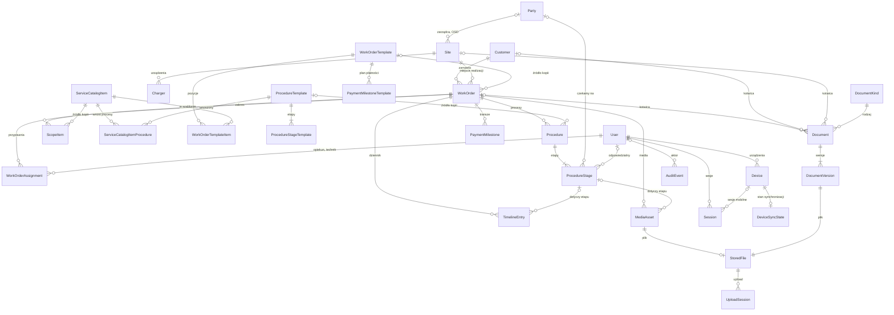
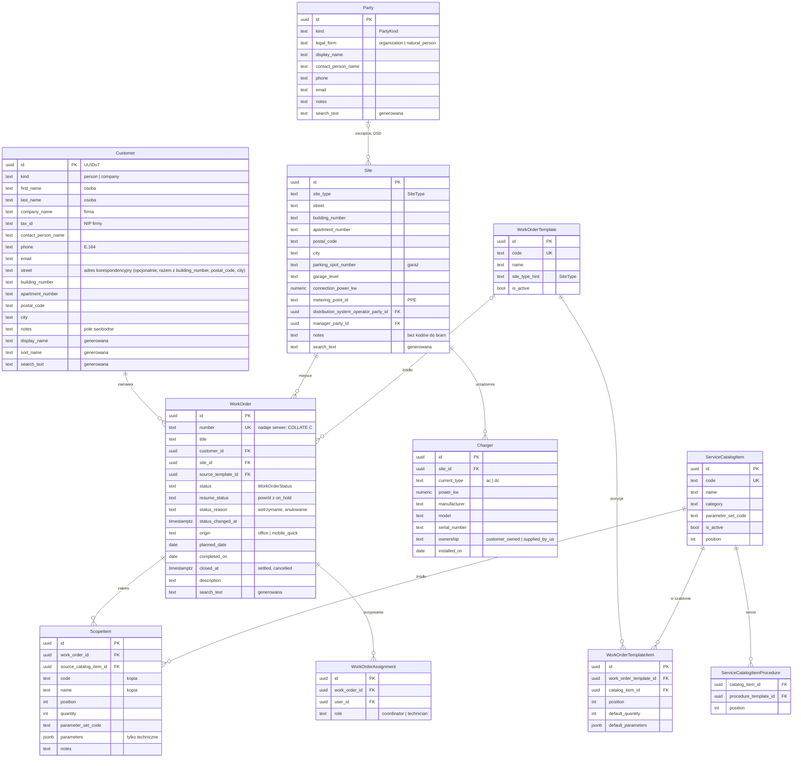
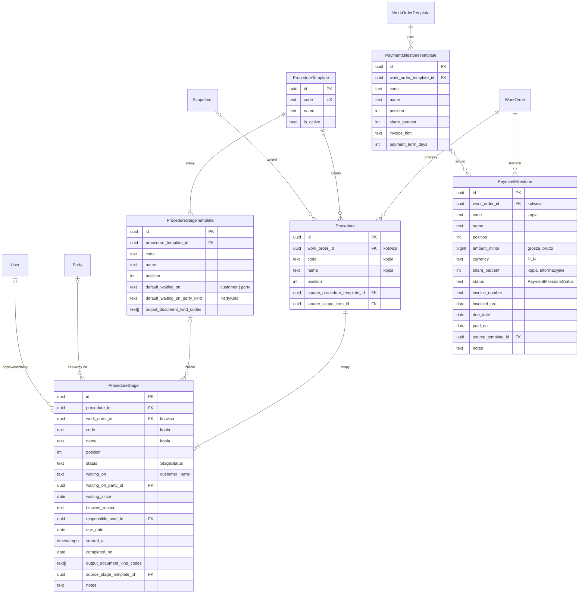
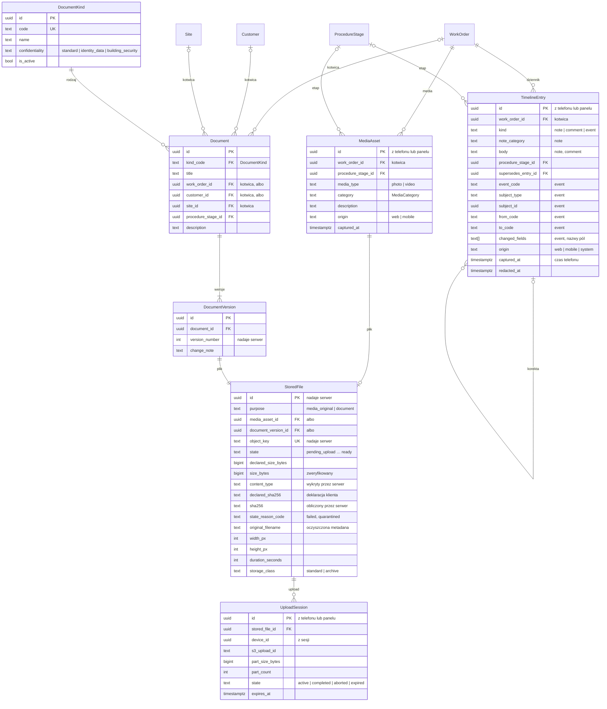
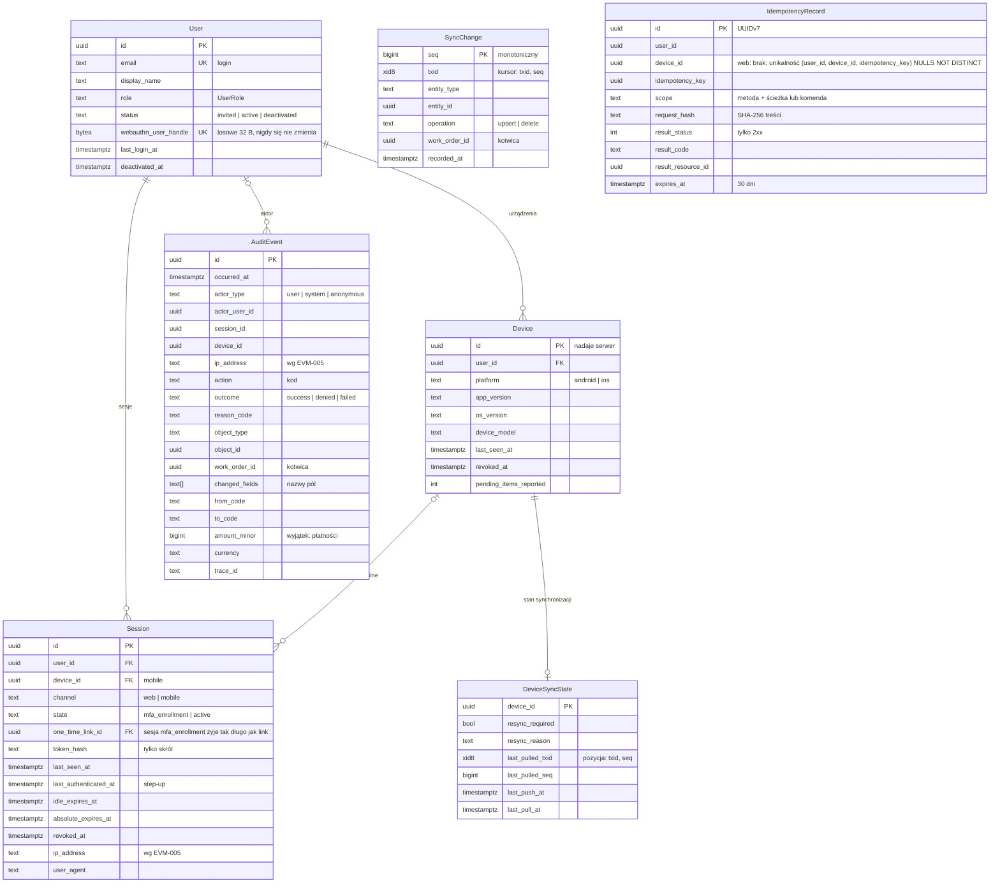
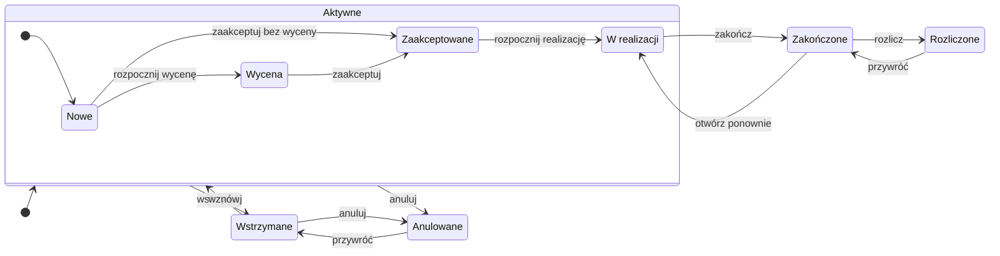
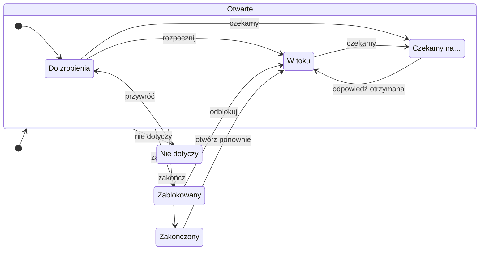
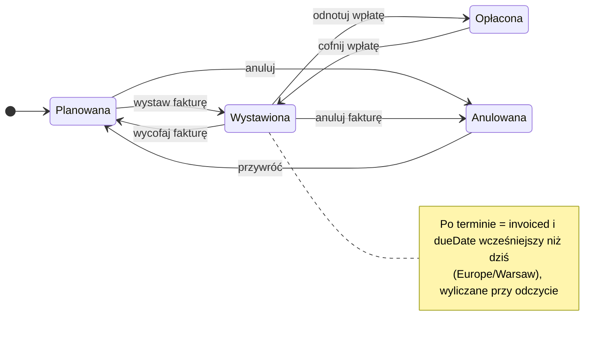

# Model domeny i danych v1

> Dokument żywy (EVM-002). Właściciel: `solution-architect`; znaczenie pojęć: `product-owner` (słownik w [`../product/domain.md`](../product/domain.md)). Stan: **model logiczny v1 — do akceptacji Konrada na demo EVM-002**. Pierwsze migracje i kontrakt API powstają w EVM-008 / M1 według zasad z tego dokumentu, [`api-guidelines.md`](api-guidelines.md) i [`offline-sync.md`](offline-sync.md). Dane startowe katalogu i szablonów: [`../product/service-catalog.md`](../product/service-catalog.md).

Dokument doprecyzowuje wyłącznie to, co ADR-y przekazały do EVM-002 (ADR-0001 — moduły i reguła 5, ADR-0003 — konwencje danych, ADR-0004 — konwencje API, ADR-0008 — zakres synchronizacji i mutacje edycyjne w MVP). **Nie zmienia żadnej decyzji ADR-0001…0015.** Polityki zarezerwowane dla EVM-005 (retencja, podstawy prawne, EXIF/GPS, zakres roli Tylko odczyt) i dla spike'a EVM-011 są oznaczone jako otwarte.

## Spis treści
1. [Decyzje modelu](#decyzje-modelu)
2. [Konwencje danych](#konwencje-danych)
3. [Moduły i własność tabel](#moduły-i-własność-tabel)
4. [ERD — przegląd](#erd--przegląd)
5. [ERD — obszary](#erd--obszary)
6. [Encje](#encje)
7. [Kompozycja zlecenia z szablonu](#kompozycja-zlecenia-z-szablonu)
8. [Trzy dzienniki](#trzy-dzienniki)
9. [Stany i przejścia](#stany-i-przejścia)
10. [Uprawnienia](#uprawnienia)
11. [Gotowość offline](#gotowość-offline)
12. [Klasyfikacja danych](#klasyfikacja-danych)
13. [Usuwanie danych](#usuwanie-danych)
14. [Walidacja scenariuszy A–F](#walidacja-scenariuszy-af)
15. [Punkty rozszerzeń M3–M7](#punkty-rozszerzeń-m3m7)
16. [Pytania na demo i sprawy otwarte](#pytania-na-demo-i-sprawy-otwarte)

## Decyzje modelu
| # | Decyzja | Dlaczego |
|---|---|---|
| D1 | **Kompozycja przez kopię (snapshot).** Katalog usług, szablony zleceń, szablony procesów i plan płatności to konfiguracja w module `catalog`. Utworzenie zlecenia kopiuje je do `ScopeItem`, `Procedure`, `ProcedureStage` i `PaymentMilestone` z odwołaniem do źródła (`source…Id`) i stabilnym `code`. | Zmiana szablonu nie zmienia istniejących zleceń; raporty filtrują po `code` i statusie, nie po „typie zlecenia”. Edytor szablonów (M4) działa bez zmiany modelu. |
| D2 | **Parametry techniczne** w `ScopeItem.parameters` (JSONB), walidowane schematem Zod z kodu wskazanym przez `parameterSetCode`. | ADR-0003: JSONB tylko dla parametrów technicznych. Nowa pozycja katalogu lub szablon nie wymaga kodu; nowy zestaw parametrów — tak. |
| D3 | **Jedna tabela dziennika** `TimelineEntry` z `kind` = `note` / `comment` / `event`, tylko do dopisywania; korekta = nowy wpis z `supersedesEntryId`. `Timeline` to widok (zapytanie), nie tabela. | Jeden kanał synchronizacji i jedna polityka (append-only, ADR-0008). |
| D4 | **Kontrahenci jako jedna encja** `Party` z `kind` (OSD to `kind = distribution_system_operator`, „Stoen” to dane). Nowy moduł `parties`. | Bez specjalnych przypadków dla OSD; raport „czekamy na OSD” to filtr. |
| D5 | **Status etapu płatności zapisany** (`planned` → `invoiced` → `paid`, `cancelled`); **„po terminie” jest wyliczane**. Kwoty w groszach (`amountMinor`, `bigint`) + `currency`. | Brak zadania cyklicznego zmieniającego dane; jedna prawda. |
| D6 | **Pliki:** `StoredFile` (obiekt w storage'u, stany z ADR-0009) współdzielony przez `MediaAsset` i `DocumentVersion`; `Document` + `DocumentVersion` od v1. | Jeden przepływ uploadu i skanu; wersjonowanie dokumentów w M3 bez przebudowy. |
| D7 | **Lokalizacja niezależna od klienta:** `WorkOrder` wskazuje `customerId` i `siteId`; `Site` obsługuje wiele zleceń w czasie. `Charger` przy `Site` z `currentType` (`ac` / `dc`) i `powerKw`. | Scenariusz D (kolejne zlecenie w tej samej lokalizacji) i F (DC) bez specjalnych przypadków. |
| D8 | **Numer zlecenia nadaje serwer**; identyfikatorem jest UUIDv7. Szybkie zlecenie z telefonu do synchronizacji „oczekuje na numer”. | Unikalny, czytelny numer bez koordynacji urządzeń. |
| D9 | **Schemat PostgreSQL per moduł** (decyzja delegowana z ADR-0001, reguła 5); klucze obce między modułami tylko zgodnie z kierunkiem zależności. | Widoczna własność, uprawnienia per schemat (np. audyt tylko `INSERT`/`SELECT`), zgodność z osobnym schematem pg-boss. |
| D10 | **Kolumny wspólne** i **kolumna kotwicy** `work_order_id` w każdej encji podrzędnej zlecenia. | Jedna polityka obiektowa i jeden filtr synchronizacji (CWE-639). |
| D11 | **Telefon w MVP tylko tworzy** (`CreateNote`, `CreateComment`, `CreateMediaAsset`, `CreateQuickWorkOrder`); `UpdateStageStatus` z `base_version` po MVP. | Brak konfliktów w MVP (ADR-0008, „mutacje edycyjne w MVP”). |
| D12 | **Macierz uprawnień encja × operacja × rola** z zasadą deny-by-default; zakres roli Tylko odczyt dla danych wrażliwych — decyzja w EVM-005 (AC3). | ADR-0001, baseline bezpieczeństwa. |

## Konwencje danych
Doprecyzowanie „Konwencji danych” z ADR-0003 i reguły 5 z ADR-0001.

**Identyfikatory i kolumny wspólne**
- Klucz główny `id uuid` w wersji 7 (RFC 9562): nadawany przez klienta (telefon, panel) przy tworzeniu albo przez bazę (`uuidv7()`). Serwer waliduje format, unikalność i uprawnienia — **UUID nie zastępuje autoryzacji** (ADR-0004, ADR-0008). Utworzenie z istniejącym `id` jest odrzucane (`id_conflict`), nigdy nie jest upsertem.
- Każda **tabela domenowa** ma kolumny: `id`, `created_at`, `created_by`, `updated_at`, `updated_by`, `version` (liczba całkowita od 1, zwiększana przy każdej zmianie, także serwerowej), `deleted_at`, `deleted_by` (soft delete). Kolumny `*_by` przechowują UUID użytkownika **bez klucza obcego** do `identity` (konta nie są usuwane, tylko dezaktywowane; moduły nie zależą przez to od `identity`). Tabele techniczne (`audit`, `sync`, `platform`, sesje i dane uwierzytelniające w `identity`) mają własne zestawy kolumn opisane przy encjach.
- `created_at` jest czasem serwera i źródłem prawdy dla kolejności oraz audytu — to `received_at` z ADR-0008. Czas z telefonu zapisujemy osobno jako `captured_at` (tylko metadana, walidowany zakres).
- **Kolumna kotwicy:** każda encja podrzędna zlecenia ma `work_order_id NOT NULL`, ustawiany przez serwer z rodzica i niezmienny. Spójność z rodzicem gwarantuje złożony klucz obcy, np. `(procedure_id, work_order_id) → procedures (id, work_order_id)`.

**Czas, daty, pieniądze, liczby**
- Momenty: `timestamptz` w UTC (prezentacja w `Europe/Warsaw`). Daty biznesowe (termin płatności, planowana data, data zakończenia etapu): `date` interpretowana w `Europe/Warsaw`; „dziś” liczymy w `Europe/Warsaw`.
- Kwoty: `amount_minor bigint` (grosze) + `currency char(3)` (ISO 4217, domyślnie `PLN`); nigdy liczby zmiennoprzecinkowe. W v1 kwota etapu płatności to **kwota brutto do zapłaty** (pytanie 2 na demo).
- Wielkości techniczne: `numeric(p, s)` (np. `power_kw numeric(7, 2)`); udziały procentowe w szablonach: liczba całkowita 0–100.

**Słowniki (enumy)**
- Kolumna `text` + ograniczenie `CHECK` z listą wartości (bez typów `ENUM` PostgreSQL — `ALTER TYPE` jest zakazany bez planu, ADR-0003). Nowa wartość = zastąpienie ograniczenia szerszym (`NOT VALID` + `VALIDATE`) — zmiana typu *expand*.
- Wartości `snake_case` po angielsku, identyczne w bazie i w API; etykiety polskie w UI. Klienci obsługują wartość nieznaną (ADR-0004), więc nowa wartość nie łamie starszych aplikacji.
- **Kody konfiguracji** (`code` w katalogu, szablonach, rodzajach dokumentów) są stabilne i niezmienne po utworzeniu: `^[a-z][a-z0-9_]{1,63}$`. Nazwy można zmieniać.

**JSONB** — wyłącznie `ScopeItem.parameters` i `WorkOrderTemplateItem.default_parameters` (parametry techniczne). Zasady:
- schemat Zod per `parameterSetCode` w kodzie; ścisły (bez dodatkowych pól), z limitem rozmiaru (16 KB); nieznany `parameterSetCode` jest odrzucany;
- **tylko wartości techniczne** (moc, długości, typy, liczby, wartości logiczne) — **nigdy dane osobowe ani identyfikatory osób lub punktów** (PPE, numery liczników, nazwiska, telefony, adresy, numery miejsc postojowych); te żyją w typowanych kolumnach `Customer` i `Site`;
- schemat zmienia się tylko addytywnie (nowe pola opcjonalne); zmiana łamiąca = nowy `parameterSetCode` (np. `charger_spec_v2`).

**Wyszukiwanie i sortowanie z polskimi znakami** (ADR-0003)
- Baza z kolacją ICU `pl-PL`: sortowanie nazw i adresów wg polskiego alfabetu (Ł po L, Ś po S).
- Kolumna generowana `search_text = f_unaccent(lower(…))` z indeksem GIN `pg_trgm` w: `Customer`, `Site`, `Party`, `WorkOrder` (pola w tabeli [klasyfikacji](#klasyfikacja-danych)). Wyszukiwanie zleceń po kliencie lub adresie łączy wyniki fasad `customers` i `sites` (lista identyfikatorów) z własnym `search_text` zlecenia — bez kopiowania danych osobowych do `work_orders`.
- Szczegóły API (fraza w treści żądania, limity, „Lodz” → „Łódź”): [`api-guidelines.md`](api-guidelines.md#filtrowanie-i-sortowanie-z-polskimi-znakami).

**Tekst** — wejście normalizowane do NFC i przycinane; pola swobodne są zwykłym tekstem (bez HTML i Markdown w MVP); limity długości w kontrakcie ([`api-guidelines.md`](api-guidelines.md#limity)). Telefony w formacie E.164, e-maile małymi literami.

**Nazewnictwo** — baza: `snake_case`, tabele w liczbie mnogiej (`work_orders.scope_items`); kod i API: `camelCase` pól, `PascalCase` encji wg słownika; Kysely z mapowaniem nazw.

**Minimalizacja (v1)** — model **nie ma pól** na PESEL, numer dokumentu tożsamości, datę urodzenia ani kody do bram i alarmów. Dodanie któregokolwiek wymaga przeglądu `security-engineer`, szyfrowania pola (`platform/crypto`, ADR-0003) i zawężonego dostępu.

**Migracje** — expand → migrate → contract (ADR-0003). Wszystkie rozszerzenia z [punktów rozszerzeń](#punkty-rozszerzeń-m3m7) są typu *expand* (nowa tabela, nowa kolumna opcjonalna, nowa wartość słownika).

## Moduły i własność tabel
Doprecyzowanie mapy modułów z ADR-0001 (zmiany: nowy moduł `parties`; `sites` nie zależy od `customers`). Kierunek zależności = kierunek kluczy obcych między schematami. Diagram: [`README.md`](README.md#mapa-modułów-domenowych).

| Moduł | Schemat | Encje (tabele) | Zależy od (publiczne API, klucze obce) |
|---|---|---|---|
| `platform` | `platform` | `IdempotencyRecord`; jądro: UUIDv7, czas, pieniądze, błędy, outbox, `crypto` | — |
| `identity` | `identity` | `User`, `Session`, `Device`; dane uwierzytelniające: hasła (`password_credentials`), klucze dostępu (`passkeys`), wyzwania WebAuthn (`webauthn_challenges`), linki jednorazowe — aktywacja, zaproszenie, reset (`one_time_links`), TOTP i kody odzyskiwania (EVM-023) | — |
| `authorization` | — (polityki w kodzie) | — | `identity` |
| `audit` | `audit` | `AuditEvent` | subskrybuje zdarzenia wszystkich modułów |
| `parties` | `parties` | `Party` | — |
| `customers` | `customers` | `Customer` | — |
| `sites` | `sites` | `Site`, `Charger` | `parties` |
| `catalog` | `catalog` | `ServiceCatalogItem`, `ServiceCatalogItemProcedure`, `WorkOrderTemplate`, `WorkOrderTemplateItem`, `ProcedureTemplate`, `ProcedureStageTemplate`, `PaymentMilestoneTemplate`, `DocumentKind` | `parties` (słownik `PartyKind`) |
| `work-orders` | `work_orders` | `WorkOrder`, `ScopeItem`, `WorkOrderAssignment` | `customers`, `sites`, `catalog`, `identity` |
| `procedures` | `procedures` | `Procedure`, `ProcedureStage` | `work-orders`, `catalog`, `parties`, `identity` |
| `payments` | `payments` | `PaymentMilestone` | `work-orders`, `catalog` |
| `timeline` | `timeline` | `TimelineEntry` | `work-orders`, `procedures`; subskrybuje zdarzenia `procedures`, `payments`, `media` |
| `media` | `media` | `MediaAsset`, `Document`, `DocumentVersion`, `StoredFile`, `UploadSession` | `work-orders`, `procedures`, `customers`, `sites`, `catalog`, `identity` |
| `sync` | `sync` | `SyncChange`, `DeviceSyncState` | `identity` i fasady modułów w zakresie synchronizacji |
| `overview` — **proponowany** ([ADR-0017](adr/0017-model-odczytu-listy-i-podsumowania-zlecenia.md), status „Zaakceptowana” 2026-10-04; powstaje w EVM-034) | `overview` | projekcje odczytu `WorkOrderSummary` (`work_order_summaries`) i `WorkOrderWait` (`work_order_waits`) — bez encji domenowych | `work-orders` (klucz obcy z `ON DELETE CASCADE`), `procedures`, `payments`, `sites`, `parties`, `customers`, `identity`, `authorization` — fasady, porty systemowe i zdarzenia; **żaden moduł nie zależy od `overview`** |
| pg-boss | `pgboss` | kolejka zadań (ADR-0010) | — |

**Zasady**
- Moduł korzysta z innego modułu wyłącznie przez fasadę; tabele innego schematu czyta tylko przez klucz obcy zgodny z kierunkiem zależności — nigdy przez zapytania z joinem do cudzych tabel (ADR-0001, reguła 2).
- **Utworzenie zlecenia z szablonu** wymaga zapisu w `work-orders`, `procedures` i `payments` w jednej transakcji, a `work-orders` nie może zależeć od `procedures` ani `payments`. Rozwiązanie: `work-orders` definiuje port `WorkOrderCompositionContributor`, a `procedures` i `payments` rejestrują jego implementacje (odwrócenie zależności, bez cykli).
- **Audyt i zdarzenia (EVM-016):** moduł domenowy nie importuje `audit` (reguła `no-module-imports-audit` w dependency-cruiser; wyjątek: korzeń kompozycji). Publikuje zdarzenia domenowe przez synchroniczny dispatcher w procesie z `platform/events` — `publish(tx, event, context)` w transakcji zmiany — a `audit` rejestruje handlery typów zdarzeń eksportowanych z `index.ts` publikującego modułu. Handler pisze tą samą transakcją; jego błąd cofa całą zmianę, a zdarzenie bez handlera jest błędem (fail closed). Kontekst (aktor, `sessionId`, `origin`, `traceId`, pełny IP wyłącznie w pamięci) przekazują jawnie przypadki użycia; adres do /24 i /48 skraca tylko `audit`. Tego samego mechanizmu użyje `timeline`. Kody akcji audytu to zamknięta lista w kodzie (`<obiekt>.<czas przeszły>`: `activation_link.issued`, `account.password_set`, `passkey.registered`, `account.activated`, `session.created`, `session.revoked`, `account.emergency_reset`), a `reason_code` — zamknięta lista kodów bez wolnego tekstu. Każdy moduł ma własne typy tabel (`IdentityTables`, `AuditTables`) i używa `db.$extendTables<…>()`; typ `Database` w `platform` nie zna tabel modułów.
- **Dziennik zmian synchronizacji** zapisuje w tej samej transakcji generyczny trigger na tabelach objętych synchronizacją (instalowany migracją), więc moduły domenowe nie zależą od `sync`. Alternatywa (port w `platform`) — do potwierdzenia w EVM-011.
- **Uprawnienia ról bazy per schemat** (ADR-0003): `evia_app` — DML na schematach domenowych; na `audit` wyłącznie `INSERT` i `SELECT` (bez `UPDATE`, `DELETE`, `TRUNCATE`) + trigger odrzucający zmiany; `evia_readonly` — tylko widoki uzgodnione w EVM-005; `evia_migrator` — właściciel schematów.
- **Projekcja listy zleceń — proponowana ([ADR-0017](adr/0017-model-odczytu-listy-i-podsumowania-zlecenia.md)).**
  - **Do czego:** lista i wyszukiwanie zleceń (W-10) filtrują i sortują po danych `work-orders`, `procedures` i `payments` z projekcji modułu `overview` — wiersz na zlecenie i wiersz na oczekiwanie.
  - **Zawartość:** wyłącznie identyfikatory, kody, daty i liczniki — bez nazw, tytułów, pól swobodnych, `search_text` i kwot (dane pseudonimowe — [klasyfikacja](#klasyfikacja-danych)).
  - **Aktualizacja:** handlery zdarzeń w procesie przeliczają projekcję w całości (nie przyrostami), w tej samej transakcji co zmiana, pod blokadą wiersza projekcji. Polecenia `rebuild` i `verify` działają jako CLI w kontenerze `worker`.
  - **Klucze obce i blokady:** łańcuch `work_orders` → `work_order_summaries` → `work_order_waits` z `ON DELETE CASCADE`. Komendy domenowe blokują wiersz `work_orders` w trybie `SELECT … FOR NO KEY UPDATE`, a nie `FOR UPDATE` — inaczej kontrola klucza obcego projekcji tworzy cykl blokad (ADR-0017 → „Współbieżność”).
  - **Daty:** wartości zależne od daty („po terminie”, dni oczekiwania) liczy zapytanie z parametrem „dziś” — projekcja ich nie przechowuje.
  - **Synchronizacja i uprawnienia:** poza synchronizacją (bez triggerów `SyncChange`); `evia_app` — DML, `evia_readonly` — brak dostępu.
  - **Szczegóły zlecenia (W-06)** nie korzystają z projekcji — kafle składa panel z zasobów zakotwiczonych w zleceniu.
  - Definicje wyliczeń: ADR-0017 → „Definicje wyliczeń (AC2)”.

## ERD — przegląd
Encje i relacje bez atrybutów. Linie przerywane w opisach = klucz opcjonalny. `SyncChange` i `IdempotencyRecord` nie mają kluczy obcych (przechowują wyłącznie identyfikatory) — patrz obszar 4.

## ERD — obszary
Kluczowe atrybuty; kolumny wspólne (`created_*`, `updated_*`, `version`, `deleted_*`) pominięte. `PK` — klucz główny, `FK` — obcy, `UK` — unikalny.

### Obszar 1 — klient, lokalizacja, zlecenie, zakres, katalog i szablony

### Obszar 2 — procesy, etapy, płatności

### Obszar 3 — dziennik, media, dokumenty

### Obszar 4 — użytkownicy, role, urządzenia, audyt, synchronizacja

## Encje
Każda encja: moduł-właściciel, nazwa polska (słownik), kluczowe atrybuty, reguły. Atrybuty wspólne i kolumna kotwicy — patrz [Konwencje danych](#konwencje-danych). Pola, które ustawia wyłącznie serwer, są oznaczone **(serwer)** i w API mają `readOnly` ([pola kontrolowane przez serwer](#pola-kontrolowane-przez-serwer)).

### `Customer`
- **Moduł:** `customers`. **Słownik:** klient — osoba lub firma zamawiająca usługę.
- **Atrybuty:** `kind` (`person` / `company`); osoba: `firstName`, `lastName`; firma: `companyName`, `taxId` (NIP), `contactPersonName`; wspólne: `phone` (E.164), `email`, opcjonalny adres korespondencyjny (`street`, `buildingNumber`, `apartmentNumber`, `postalCode`, `city`) — tylko gdy potrzebny do dokumentów formalnych; `notes`; generowane: `displayName`, `sortName` (nazwisko przed imieniem), `searchText`.
- **Reguły:** klient nie „posiada” lokalizacji — związek klient–lokalizacja wynika ze zleceń (D7). Soft delete tylko gdy nie ma niezamkniętych zleceń (zamknięte = `settled`, `cancelled`; inaczej `409 has_active_dependents`). Duplikaty (np. klient dodany z telefonu offline) scala biuro — funkcja scalania poza v1.

### `Site`
- **Moduł:** `sites`. **Słownik:** lokalizacja / obiekt — miejsce realizacji.
- **Atrybuty:** `siteType` (`SiteType`: `single_family_house`, `multi_family_garage`, `commercial`, `other`); adres (`street`, `buildingNumber`, `apartmentNumber`, `postalCode`, `city`); `parkingSpotNumber`, `garageLevel` (garaż); `connectionPowerKw` (moc przyłączeniowa); `meteringPointId` (PPE); `distributionSystemOperatorPartyId` (OSD — `Party` z `kind = distribution_system_operator`); `managerPartyId` (administracja / zarządca / wspólnota); `notes` (wskazówki dojazdu — UI ostrzega, by nie wpisywać kodów do bram ani alarmów); `searchText`.
- **Reguły:** niezależna od klienta; wiele zleceń w czasie (scenariusz D). Typ kontrahenta w polach `…PartyId` walidowany w aplikacji.

### `Charger`
- **Moduł:** `sites`. **Słownik:** wallbox / ładowarka AC / DC.
- **Atrybuty:** `siteId`, `currentType` (`ac` / `dc`), `powerKw`, `manufacturer`, `model`, `serialNumber` (opcjonalnie), `ownership` (`customer_owned` / `supplied_by_us`), `installedOn` (pusta = jeszcze nie zamontowana), `notes`.
- **Reguły:** opisuje urządzenie fizycznie obecne w lokalizacji; parametry planowanego urządzenia w zleceniu są w `ScopeItem.parameters` (`charger_spec`). Bez klucza do zlecenia (kierunek zależności) — powiązanie widać w dzienniku.

### `Party`
- **Moduł:** `parties`. **Słownik:** strona / kontrahent.
- **Atrybuty:** `kind` (`PartyKind`: `building_administration`, `property_manager`, `housing_community`, `designer`, `fire_safety_expert`, `technical_expert`, `distribution_system_operator`, `subcontractor`, `supplier`, `other`); `legalForm` (`organization` / `natural_person`); `displayName`; `contactPersonName`, `phone`, `email`; `notes`; `searchText`.
- **Reguły:** OSD to `kind`, nie osobna encja; nazwy OSD (np. operator w Warszawie) to dane, nie kod. Osoba fizyczna lub osoba kontaktowa = dane osobowe osób trzecich. Książka kontaktów z wieloma osobami (M3) — nowa tabela (*expand*).

### `WorkOrder`
- **Moduł:** `work-orders`. **Słownik:** zlecenie — jednostka pracy dla klienta w lokalizacji.
- **Atrybuty:** `number` **(serwer)** — kolumna `COLLATE "C"` (sortowanie i porównania keyset bajtowo, niezależnie od kolacji ICU bazy; format o stałej szerokości sortuje się poprawnie przy najwyżej 9999 zleceń na rok) — propozycja formatu `ZL-2026-0042` (rok wg daty utworzenia w `Europe/Warsaw`, licznik roczny bez luk; pytanie 7 na demo); `title` (krótki opis); `customerId`, `siteId`; `sourceTemplateId`; `status` **(serwer, tylko komendą przejścia)**; `resumeStatus` **(serwer)** — stan, do którego wraca wstrzymane lub przywrócone zlecenie; `statusReason` (powód wstrzymania lub anulowania); `statusChangedAt`, `closedAt` **(serwer)**; `origin` (`office` / `mobile_quick`); `plannedDate`; `completedOn`; `description`; `searchText` (numer i tytuł).
- **Reguły:** kotwica autoryzacji wszystkich encji podrzędnych. Zlecenie w stanie `settled` lub `cancelled` jest tylko do odczytu dla zakresu, procesów i płatności (zmiany wyłącznie po przywróceniu przez Administratora), ale **nadal przyjmuje wpisy dziennika, media i dokumenty** — dane z terenu docierające z opóźnieniem nie są odrzucane („nic nie ginie”). Postęp zlecenia niosą etapy procesów, nie status. Soft delete zlecenia (Administrator) — tylko bez transz w `invoiced`, jak przy anulowaniu (inaczej `409 has_active_dependents`); usunięcie nie może ukryć wystawionej faktury z pominięciem [korekty płatności](#paymentmilestone).

### `WorkOrderAssignment`
- **Moduł:** `work-orders`. **Słownik:** przypisanie do zlecenia (opiekun, technik).
- **Atrybuty:** `workOrderId`, `userId`, `role` (`coordinator` — opiekun, co najwyżej jeden aktywny; `technician`).
- **Reguły:** „aktywne” przypisanie to `deleted_at IS NULL` (kolumny wspólne; bez osobnej kolumny zakończenia), co najwyżej jedno aktywne `coordinator` na zlecenie (częściowy indeks unikalny). W v1 informacyjne (opiekun na liście zleceń, filtr „moje”); w M4 podstawa polityki roli Monter (tylko przypisane zlecenia) i zawężenia zakresu synchronizacji — bez migracji niszczącej.

### `ScopeItem`
- **Moduł:** `work-orders`. **Słownik:** pozycja zakresu — wystąpienie klocka usługi w zleceniu.
- **Atrybuty:** `sourceCatalogItemId`; kopie `code`, `name`, `parameterSetCode`; `position`; `quantity` (domyślnie 1); `parameters` (JSONB, [zasady](#konwencje-danych)); `notes`.
- **Reguły:** dowolna zmiana zakresu po utworzeniu (dodanie, usunięcie, zmiana parametrów). Dodanie pozycji proponuje procesy wnoszone przez pozycję katalogu (bez duplikatów po `code`); usunięcie pozycji nie usuwa procesów (decyduje użytkownik). Pozycja „inna usługa” (`custom_service`) pozwala opisać zakres spoza katalogu.

### `ServiceCatalogItem`
- **Moduł:** `catalog`. **Słownik:** katalog usług — klocek usługi.
- **Atrybuty:** `code` (stały), `name`, `category` (`equipment`, `installation`, `formal`, `engineering`, `acceptance`, `other`), `description`, `parameterSetCode`, `isActive`, `position`. Procesy wnoszone przez pozycję: `ServiceCatalogItemProcedure` (`catalogItemId`, `procedureTemplateId`, `position`).
- **Reguły:** konfiguracja; w MVP dane startowe z migracji danych ([`service-catalog.md`](../product/service-catalog.md)), edytor w M4 (Administrator). Wycofanie = `isActive = false`, nie usunięcie (zlecenia mają kopie).

### `WorkOrderTemplate`
- **Moduł:** `catalog`. **Słownik:** szablon zlecenia.
- **Atrybuty:** `code`, `name`, `description`, `siteTypeHint` (podpowiedź filtrowania w UI), `isActive`; pozycje `WorkOrderTemplateItem` (`catalogItemId`, `position`, `defaultQuantity`, `defaultParameters`); plan płatności `PaymentMilestoneTemplate` (`code`, `name`, `position`, `sharePercent`, `invoiceHint`, `paymentTermDays`).
- **Reguły:** suma `sharePercent` w planie = 100 (walidacja konfiguracji). Szablon jest tylko źródłem kopii (D1).

### `ProcedureTemplate`
- **Moduł:** `catalog`. **Słownik:** szablon procesu; etapy: `ProcedureStageTemplate` (szablon etapu).
- **Atrybuty:** `code`, `name`, `description`, `isActive`; etapy: `code`, `name`, `position`, `defaultWaitingOn` (`customer` / `party`), `defaultWaitingOnPartyKind` (`PartyKind`), `outputDocumentKindCodes` (dokumenty wynikowe).
- **Reguły:** domyślne „na kogo czekamy” to podpowiedź dla UI przy przejściu etapu w `waiting`, nie automatyka.

### `Procedure`
- **Moduł:** `procedures`. **Słownik:** proces — ścieżka formalna lub realizacyjna złożona z etapów.
- **Atrybuty:** kopie `code`, `name`; `position` w zleceniu; `sourceProcedureTemplateId`, `sourceScopeItemId` (opcjonalne — proces można dodać ręcznie).
- **Reguły:** w zleceniu co najwyżej jeden aktywny proces o danym `code`. Postęp procesu (etapy zakończone / wszystkie, bieżący etap = pierwszy otwarty wg `position`) jest wyliczany, nie zapisywany. Brak wymuszanej kolejności między procesami (bez silnika BPMN).

### `ProcedureStage`
- **Moduł:** `procedures`. **Słownik:** etap — krok procesu ze statusem, datami, odpowiedzialnym.
- **Atrybuty:** kopie `code`, `name`; `position`; `status` (`StageStatus`) **(serwer, tylko komendą przejścia)**; „na kogo czekamy”: `waitingOn` (`customer` / `party`), `waitingOnPartyId`, `waitingSince` (data biznesowa, domyślnie dziś, nie z przyszłości); `blockedReason`; `responsibleUserId`; `dueDate`; `startedAt` **(serwer)**; `completedOn` (domyślnie dziś, nie z przyszłości); `outputDocumentKindCodes`; `sourceStageTemplateId`; `notes`.
- **Reguły:** `waitingOn` wymagane wyłącznie w stanie `waiting` (gdy `party` — także `waitingOnPartyId`); w `todo` i `in_progress` „piłka jest po naszej stronie”. Zmiana strony, na którą czekamy, w stanie `waiting` ustawia nowe `waitingSince`. Raport „czekamy na OSD > 14 dni” = `status = waiting` ∧ `waitingOn = party` ∧ `Party.kind = distribution_system_operator` ∧ `waitingSince < dziś − 14` — bez odwołania do „typu zlecenia”.

### `PaymentMilestone`
- **Moduł:** `payments`. **Słownik:** etap płatności — transza do zapłaty.
- **Atrybuty:** kopie `code`, `name`, `sharePercent` (informacyjnie); `position`; `amountMinor` + `currency` (brutto do zapłaty; może być puste tylko w `planned`); `status` (`PaymentMilestoneStatus`) **(serwer, tylko komendą przejścia)**; `invoiceNumber`, `invoicedOn`, `dueDate` (domyślnie `invoicedOn + paymentTermDays`), `paidOn`; `sourceTemplateId`; `notes`; wyliczane `isOverdue`.
- **Reguły:** `isOverdue = status = invoiced ∧ dueDate < dziś (Europe/Warsaw)` — bez zadania cyklicznego. Zmiana kwoty: w `planned` — Edytor i Administrator; w `invoiced` i `paid` — tylko Administrator ze step-upem (korekta płatności); każda zmiana kwoty jest audytowana. Nie trafia na telefon.
- **Korekta płatności** (zagrożenie T7) — zmiana kwoty po wystawieniu, cofnięcie statusu (`invoiced → planned`, `paid → invoiced`), anulowanie wystawionej transzy (`invoiced → cancelled`), przywrócenie anulowanej (`cancelled → planned`) i soft delete transzy. Wykonuje ją **wyłącznie Administrator ze step-upem**, a żadna ścieżka dostępna dla Edytora ani dla Administratora bez step-upu nie prowadzi do tego samego skutku ([zasada ścieżek](#stany-i-przejścia)). Edytor, który pomylił się przy wystawieniu faktury lub odnotowaniu wpłaty, zgłasza korektę Administratorowi. Pozostałe dane faktury (`invoiceNumber`, `invoicedOn`, `dueDate`, `paidOn`) Edytor nadal poprawia edycją.

### `TimelineEntry`
- **Moduł:** `timeline`. **Słownik:** dziennik (wpisy, komentarze, zmiany). `Timeline` to widok (zapytanie po `workOrderId` w kolejności `createdAt`), nie tabela.
- **Atrybuty:** `kind`:
  - `note` — wpis (rozmowa, ustalenie): `noteCategory` (`phone_call`, `meeting`, `arrangement`, `site_visit`, `other`), `body`;
  - `comment` — komentarz użytkownika: `body`;
  - `event` — automatyczna zmiana **(serwer)**: `eventCode` (np. `work_order_status_changed`, `stage_status_changed`, `media_added`), `subjectType`, `subjectId`, `fromCode`, `toCode`, `changedFields` (nazwy pól) — **bez wartości danych osobowych i bez kwot** (np. „zmieniono dane klienta: telefon”, nie „telefon: X → Y”).
  - wspólne: `procedureStageId` (opcjonalnie), `supersedesEntryId` (korekta), `origin` (`web` / `mobile` / `system`), `capturedAt` (czas telefonu, metadana), `redactedAt`, `redactedBy` **(serwer)**.
- **Reguły:** tylko do dopisywania — treść nie jest edytowana; korekta = nowy wpis wskazujący poprzedni. Zmiany serwerowe dopuszczalne wyłącznie jako soft delete (Administrator) i **redakcja treści** z zachowaniem metadanych (wyjątek RODO, procedura w EVM-005). Kolejność wg czasu serwera.

### `MediaAsset`
- **Moduł:** `media`. **Słownik:** media — zdjęcie lub film z metadanymi.
- **Atrybuty:** `mediaType` (`photo` / `video`); `category` (`MediaCategory`: `site_survey`, `before_work`, `in_progress`, `completed_work`, `defect`, `measurement`, `other`); `description`; `procedureStageId`; `origin`; `capturedAt`; plik: `StoredFile` (stan, rozmiar, wymiary, czas trwania).
- **Reguły:** metadane tworzy klient (UUIDv7) przed uploadem; dopóki plik nie jest w stanie `ready`, w UI „przetwarzanie”. Na telefon trafia z podsumowaniem pliku (`fileState`, `sizeBytes`, `durationSeconds`, `widthPx`, `heightPx`) — [projekcja](offline-sync.md#zakres-synchronizacji-urządzenia); zmiana stanu pliku = `upsert` medium w dzienniku zmian. **Brak kolumn GPS i lokalizacji w v1** — polityka EXIF/GPS w EVM-005; ewentualne dodanie to *expand*. Edycja w panelu: tylko `category`, `description`, `procedureStageId` (Edytor); telefon w MVP nie edytuje.

### `Document`
- **Moduł:** `media`. **Słownik:** dokument — plik formalny z wersjami; wersja: `DocumentVersion`.
- **Atrybuty:** `kindCode` (`DocumentKind`, np. `power_of_attorney`, `connection_conditions`, `technical_assessment`, `fire_safety_opinion`); `title`; kotwica — dokładnie jedno z: `workOrderId`, `customerId`, `siteId` (ograniczenie `CHECK`); `procedureStageId` (tylko przy `workOrderId`); `description`. Wersja: `documentId`, `versionNumber` **(serwer)**, `changeNote`, plik `StoredFile`.
- **Reguły:** nowa wersja zamiast edycji pliku (append-only wersji). Rodzaj dokumentu niesie `confidentiality` (`standard` / `identity_data` — dane identyfikacyjne, np. pełnomocnictwo / `building_security` — projekt, ekspertyza, opinia ppoż) — podstawa polityk roli Tylko odczyt i telefonu (EVM-005).

### `StoredFile` i `UploadSession`
- **Moduł:** `media`. **Słownik:** plik (obiekt w storage'u) i sesja uploadu.
- **Atrybuty `StoredFile`:** `purpose` (`media_original` / `document`); właściciel — dokładnie jedno z `mediaAssetId`, `documentVersionId`; `objectKey` **(serwer)**; `state` **(serwer)**: `pending_upload → uploaded → scanning → clean → processing → ready`, `quarantined`, `failed` (ADR-0009); `declaredSizeBytes`, `sizeBytes` **(serwer, zweryfikowany)**; `declaredContentType`, `contentType` **(serwer, wykryty z zawartości)**; `declaredSha256` (deklaracja klienta w sesji uploadu), `sha256` **(serwer, obliczony z zawartości)**; `stateReasonCode` **(serwer)** — kod przyczyny stanu `failed` lub `quarantined` (`checksum_mismatch`, `processing_error`, `type_mismatch`, `malware_detected`), bez danych osobowych; `originalFilename` (oczyszczona metadana); `widthPx`, `heightPx`, `durationSeconds` **(serwer)**; `storageClass` (`standard` / `archive`).
- **Atrybuty `UploadSession`:** `storedFileId`, `deviceId` **(serwer, z sesji)**, `s3UploadId`, `partSizeBytes`, `partCount`, `state`, `expiresAt`.
- **Reguły (niezmienniki):** plik w stanie innym niż `clean` / `ready` nie jest pobieralny dla nikogo; `contentType` nadaje serwer; klucz obiektu nadaje serwer wg ADR-0009 z identyfikatorem rekordu pliku: `media/{rok}/{miesiąc}/{storedFileId}/original` i `documents/{rok}/{miesiąc}/{storedFileId}/original` — **bez danych osobowych, nazwy pliku i numeru zlecenia**; pochodne mają deterministyczne klucze obok oryginału. `StoredFile` nie ma własnych uprawnień — dostęp zawsze przez właściciela. Sesję uploadu może kontynuować wyłącznie jej twórca (użytkownik i urządzenie).
- **`clean` tylko przy zgodnym SHA-256:** serwer oblicza skrót złożonego obiektu podczas skanu (worker i tak czyta cały plik; alternatywa — sumy kontrolne S3, do sprawdzenia w EVM-011). Do `clean` przechodzi wyłącznie wtedy, gdy `sha256 = declaredSha256`, a skan i walidacja typu są pozytywne. Niezgodny skrót → `failed` z `stateReasonCode = checksum_mismatch`; telefon wysyła plik ponownie z lokalnej kopii (szczegóły przejścia — `media-pipeline.md`, EVM-011). Na tym niezmienniku opiera się reguła usuwania lokalnego oryginału na telefonie ([`offline-sync.md`](offline-sync.md#otwarte--evm-011), punkt 7).
- **Stan pliku na telefonie:** zmiana `state` (i podsumowania pliku) zapisuje w dzienniku zmian, w tej samej transakcji, `upsert` właściciela (`MediaAsset`, `DocumentVersion`). `StoredFile` nie jest synchronizowany osobno ([`offline-sync.md`](offline-sync.md#3-wersjonowanie-i-dziennik-zmian)). Przyczyna kwarantanny jest widoczna tylko w panelu (Administrator).

### `User`
- **Moduł:** `identity`. **Słownik:** użytkownik — konto pracownika.
- **Atrybuty:** `email` (login), `displayName`, `role` (`UserRole`), `status` (`invited` / `active` / `deactivated`), `lastLoginAt`, `deactivatedAt`; dane uwierzytelniające w osobnych tabelach modułu (ADR-0005).
- **Reguły:** konta nie są usuwane, tylko dezaktywowane (unieważnia wszystkie sesje i urządzenia); identyfikator pozostaje w polach `*_by`. Inni użytkownicy (i telefon) widzą tylko `id` i `displayName`.

### `UserRole`
- **Moduł:** `identity` (słownik), uprawnienia w `authorization`. **Słownik:** rola.
- **Wartości:** `administrator` (Administrator), `editor` (Edytor), `read_only` (Tylko odczyt). Jedna rola na konto w v1. Później (*expand*): `fitter` (Monter, M4), role partnerów i portalu klienta (M5).
- **Reguły:** MFA obowiązkowe dla `administrator` (ADR-0005). Uprawnienia ról: [macierz](#macierz-encja--operacja--rola).

### `Session`, `Device`, `DeviceSyncState`
- **Moduł:** `identity` (`Session`, `Device`), `sync` (`DeviceSyncState`). **Słownik:** sesja, urządzenie.
- **Atrybuty:** sesja — `userId`, `deviceId` (mobile), `channel`, `tokenHash` (tylko skrót), czasy wygaśnięcia, `lastAuthenticatedAt` (step-up), `revokedAt`, `ipAddress`, `userAgent`; urządzenie — **identyfikator nadaje serwer przy logowaniu mobilnym**, `platform`, `appVersion`, `osVersion`, `deviceModel`, `lastSeenAt`, `revokedAt`, `pendingItemsReported` (liczba niewysłanych elementów, ADR-0007); stan synchronizacji — `resyncRequired`, `resyncReason`, `lastPulledTxid` + `lastPulledSeq` (pozycja ostatniego pobrania, [kursor](offline-sync.md#3-wersjonowanie-i-dziennik-zmian)), `lastPushAt`, `lastPullAt`.
- **Reguły:** `userId` i `deviceId` w żądaniu pochodzą wyłącznie z sesji serwerowej — nigdy z nagłówka ani treści. Format `ipAddress` (skrócony lub pseudonimizowany) — EVM-005.

### `AuditEvent`
- **Moduł:** `audit`. **Słownik:** zdarzenie audytu.
- **Atrybuty:** `occurredAt`, `actorType` (`user` / `system` / `anonymous`), `actorUserId`, `sessionId`, `deviceId`, `ipAddress` (zapisywany jako prefiks `/24` albo `/48`, kolumna `ip_prefix`), `origin` (`web` / `cli` — polecenie na serwerze nie ma adresu IP), `userAgent`, `action` (kod, np. `work_order.cancelled`), `outcome` (`success` / `denied` / `failed`), `reasonCode`, `objectType`, `objectId`, `workOrderId`, `changedFields` (nazwy pól), `fromCode`, `toCode`, `traceId`; **wyjątek opisany:** `amountMinor` + `currency` dla zmian płatności.
- **Reguły:** tylko do dopisywania (uprawnienia bazy + trigger, ADR-0003); **bez wartości danych osobowych** — kopia w audycie byłaby nieusuwalna (RODO art. 17). Zakres audytu: ADR-0001 oraz [przejścia wrażliwe](#przejścia-audytowane).

### Dane uwierzytelniające (EVM-016)
- **Moduł:** `identity`; tabele techniczne bez kolumn wspólnych i bez soft delete (poświadczenia usuwamy twardo — w trybie awaryjnym).
- **`password_credentials`:** `user_id` (PK), skrót Argon2id w formacie PHC (19 MiB, 2 przebiegi, 1 wątek), `updated_at`.
- **`passkeys`:** `credential_id` (unikalny globalnie), `public_key`, `counter`, `transports`, `device_type` (`single_device` | `multi_device`), `backed_up`, `created_at`, `last_used_at`.
- **`webauthn_challenges`:** `user_id`, `session_id`, `purpose` (`passkey_registration`), `challenge_hash` (tylko SHA-256; wyzwanie ≥ 128 bitów), `expires_at` (TTL 5 min), `used_at` — zużywane atomowo (`UPDATE … WHERE used_at IS NULL AND expires_at > :now RETURNING`).
- **`one_time_links`:** `user_id`, `purpose` (dziś `account_activation` — cel, nie źródło; `password_reset` dopisze EVM-025 jako *expand*), `token_hash` (SHA-256 tokenu 256-bitowego; sam token tylko we fragmencie adresu `#…`), `issued_by` (`cli`; źródło), `issued_at`, `expires_at` (72 h), `used_at`, `superseded_at`. Link zużywa rejestracja klucza dostępu, nie samo ustawienie hasła; każde wydanie linku unieważnia wszystkie niezużyte linki aktywacyjne oraz sesje `mfa_enrollment` i wyzwania zbudowane na nich.
- **`sessions` (rozszerzenie):** `state` (`mfa_enrollment` | `active`), `one_time_link_id`, `revoke_reason` (`logout` | `rotated` | `emergency_reset` | `link_superseded`); adres IP w całości 30 dni (P9), `user_agent` do 512 znaków. Token CSRF nie ma kolumny — jest wyliczany z tokenu sesji.
- **`users` (rozszerzenie):** `email` zapisany znormalizowany (NFC, przycięty, małe litery; `CHECK (email = lower(email))`, zwykły `UNIQUE`), `webauthn_user_handle` (losowe 32 B — nie e-mail; zmiana psułaby logowanie kluczami).
- **`platform.security_alert_outbox`:** trwały rekord alertu zapisany w transakcji zmiany (`alert_code`, `occurred_at`, `trace_id`, `emitted_at`) — proces API emituje go do logów (pole `alert: "security"`) i oznacza jako wyemitowany; polecenie na serwerze nie widzi kolektora logów.

### `IdempotencyRecord` i `SyncChange`
- **Moduł:** `platform` (`IdempotencyRecord`), `sync` (`SyncChange`). **Słownik:** rekord idempotencji, zmiana w dzienniku zmian synchronizacji.
- **Atrybuty:** rekord idempotencji — klucz (`userId`, `deviceId`, `idempotencyKey` — unikalny razem, `deviceId` puste dla web; klucz główny to osobny `id`), `scope` (metoda + szablon ścieżki albo typ komendy synchronizacji), `requestHash` (SHA-256 treści), **wynik minimalny** (`resultStatus`, `resultCode`, `resultResourceId`) — nie pełna odpowiedź; rekord powstaje w transakcji operacji, tylko dla wyniku `2xx`, stanu „w toku” nie ma (równoległość rozstrzyga blokada doradcza transakcji); `expiresAt` (30 dni). Zmiana — `seq`, `txid` (`xid8`; pozycja w dzienniku i kursor to para (`txid`, `seq`), indeks (`txid`, `seq`) — [zasada 3](offline-sync.md#3-wersjonowanie-i-dziennik-zmian)), `entityType`, `entityId`, `operation` (`upsert` / `delete`), `workOrderId` (pusta dla encji bez kotwicy zlecenia — `Customer`, `Site`, `Charger`, `Party`, dokumenty klienta lub lokalizacji; filtr zakresu ocenia je przy odczycie, [zakres](offline-sync.md#zakres-synchronizacji-urządzenia)), `recordedAt`; retencja 90 dni.
- **Reguły:** tylko identyfikatory i kody, bez danych osobowych. Szczegóły: [`offline-sync.md`](offline-sync.md).

## Kompozycja zlecenia z szablonu
Przypadek użycia `CreateWorkOrder` w `work-orders` (panel) i komenda `CreateQuickWorkOrder` (telefon) — w jednej transakcji:
1. Walidacja: szablon aktywny; klient i lokalizacja istnieją i są dostępne dla użytkownika (albo tworzone w tej samej komendzie — tylko `INSERT` z nowym `id`).
2. `WorkOrder` w stanie `new`, numer z licznika rocznego, `sourceTemplateId`.
3. Dla każdej `WorkOrderTemplateItem` (wg `position`): `ScopeItem` z kopią `code`, `name`, `parameterSetCode`, `defaultParameters`, `defaultQuantity`.
4. Kontrybutor `procedures` (port `WorkOrderCompositionContributor`): dla każdej pozycji zakresu procesy wnoszone przez pozycję katalogu; proces o `code` już utworzonym w tym zleceniu jest pomijany; etapy kopiowane z `ProcedureStageTemplate` w stanie `todo`.
5. Kontrybutor `payments`: `PaymentMilestone` w stanie `planned` dla każdej pozycji planu płatności (kwota pusta, `sharePercent` skopiowany).
6. Wpis dziennika `event` (`work_order_created`), zdarzenie audytu, wiersze dziennika zmian synchronizacji.

Po utworzeniu wszystko jest edytowalne w zleceniu (dodawanie i usuwanie pozycji, procesów, etapów, transz). Zlecenie bez szablonu startuje puste i jest składane ręcznie tymi samymi operacjami.

## Trzy dzienniki
Trzy osobne dzienniki o różnych celach — **dziennik biznesowy nie zastępuje audytu**, a żaden z nich nie jest logiem operacyjnym (ADR-0013).

| Dziennik | Cel | Kto czyta | Treść | Zmienność | Retencja |
|---|---|---|---|---|---|
| **Dziennik zlecenia** (`TimelineEntry`) | historia pracy widoczna dla zespołu: wpisy, komentarze, automatyczne zmiany | role z dostępem do zlecenia; telefon (zakres) | treść wpisów i komentarzy (może zawierać dane osobowe); zdarzenia jako kody i nazwy pól | tylko dopisywanie; soft delete i redakcja przez Administratora | jak zlecenie — EVM-005 |
| **Dziennik audytu** (`AuditEvent`) | rozliczalność bezpieczeństwa: kto, co, kiedy, skąd, wynik | Administrator (step-up) | identyfikatory, kody akcji, nazwy pól; wyjątek: kwota i status płatności | niezmienny (uprawnienia bazy + trigger) | ≥ 2 lata — EVM-005 (ADR-0013) |
| **Dziennik zmian synchronizacji** (`SyncChange`) | techniczny kanał zmian dla urządzeń (kursor) | moduł `sync` | typ i identyfikator obiektu, operacja, kotwica | tylko dopisywanie; czyszczenie po retencji | 90 dni (ADR-0008) |

## Stany i przejścia
Zasady wspólne:
- **Przejście, którego nie ma w tabeli, jest zabronione** (`409 invalid_state_transition`). Status zmienia wyłącznie komenda przejścia z polityką i warunkiem — nigdy edycja pola (`PATCH` statusu jest odrzucany).
- Każde przejście zapisuje wpis dziennika `event` (kody stanów) i — dla przejść wrażliwych — zdarzenie audytu.
- Role: **A** — Administrator, **E** — Edytor, **R** — Tylko odczyt, **S** — system. Tylko odczyt nie wykonuje żadnych przejść. „Step-up” = ponowne uwierzytelnienie z MFA, jeśli ostatnie > 15 min temu (ADR-0005).
- **Ścieżki nie omijają ról ani step-upu.** Skutek zarezerwowany dla wyższego uprawnienia (Administrator, Administrator ze step-upem) nie może być osiągalny z niższym inną drogą: sekwencją przejść, edycją pola ani soft delete (własnym lub obiektu nadrzędnego). Testy macierzy ról generowane z tabel poniżej sprawdzają więc **ścieżki** w grafie przejść (z edycjami i soft delete), nie tylko pojedyncze krawędzie.
- Kolumna „Telefon”: czy przejście jest dostępne w aplikacji mobilnej (komendą synchronizacji). W MVP telefon nie zmienia stanów (D11).

### Zlecenie
`WorkOrderStatus`: `new` (Nowe), `quoting` (Wycena), `accepted` (Zaakceptowane), `in_progress` (W realizacji), `completed` (Zakończone), `settled` (Rozliczone), `on_hold` (Wstrzymane), `cancelled` (Anulowane). „Aktywne” = `new`, `quoting`, `accepted`, `in_progress`; „zamknięte” = `settled`, `cancelled`; „niezamknięte” = wszystkie poza zamkniętymi (aktywne oraz `on_hold` i `completed`) — definicje w słowniku.

| Z | Do | Warunek i skutki | Role | Telefon |
|---|---|---|---|---|
| `new` | `quoting` | — | A, E | nie |
| `new` | `accepted` | — (np. scenariusz A bez osobnej wyceny) | A, E | nie |
| `quoting` | `accepted` | — | A, E | nie |
| `accepted` | `in_progress` | — | A, E | nie |
| `active` (dowolny: `new`, `quoting`, `accepted`, `in_progress`) | `on_hold` | wymagany `statusReason`; serwer zapisuje `resumeStatus` = stan bieżący | A, E | nie |
| `on_hold` | `active` (`resumeStatus`) | wraca do stanu sprzed wstrzymania | A, E | nie |
| `active` (dowolny: `new`, `quoting`, `accepted`, `in_progress`) | `cancelled` | wymagany `statusReason`; brak transz w `invoiced` (najpierw opłać albo anuluj — korekta płatności, A ↑); transze `planned` → `cancelled` (skutek, aktor jak w komendzie); `resumeStatus` = stan bieżący; ustawia `closedAt`; **audyt** | A, E | nie |
| `on_hold` | `cancelled` | jak wyżej (`resumeStatus` bez zmian) | A, E | nie |
| `cancelled` | `on_hold` | przywrócenie do „Wstrzymane” — dalej świadome wznowienie; transze nie są przywracane automatycznie; czyści `closedAt`; **audyt** | A (step-up) | nie |
| `in_progress` | `completed` | ustawia `completedOn` (domyślnie dziś); UI ostrzega o otwartych etapach (bez blokady) | A, E | nie |
| `completed` | `in_progress` | ponowne otwarcie (poprawki); czyści `completedOn` | A, E | nie |
| `completed` | `settled` | wszystkie transze w `paid` lub `cancelled`; ustawia `closedAt` | A, E | nie |
| `settled` | `completed` | przywrócenie z „Rozliczone”; czyści `closedAt`; **audyt** | A (step-up) | nie |

### Etap procesu
`StageStatus`: `todo` (Do zrobienia), `in_progress` (W toku), `waiting` (Czekamy na…), `blocked` (Zablokowany), `done` (Zakończony), `not_applicable` (Nie dotyczy). „Otwarte” = `todo`, `in_progress`, `waiting`.

| Z | Do | Warunek i skutki | Role | Telefon |
|---|---|---|---|---|
| `todo` | `in_progress` | ustawia `startedAt` | A, E | nie w MVP; po MVP tak (`UpdateStageStatus` z `base_version`) |
| `todo` | `waiting` | wymagane `waitingOn` (i `waitingOnPartyId` dla `party`); `waitingSince` domyślnie dziś | A, E | nie |
| `in_progress` | `waiting` | jak wyżej | A, E | nie |
| `waiting` | `in_progress` | czyści `waitingOn`, `waitingOnPartyId`, `waitingSince` | A, E | nie |
| `open` (dowolny: `todo`, `in_progress`, `waiting`) | `done` | ustawia `completedOn` (domyślnie dziś, nie z przyszłości); czyści „na kogo czekamy” | A, E | nie w MVP; po MVP tak (z `base_version`) |
| `open` (dowolny: `todo`, `in_progress`, `waiting`) | `not_applicable` | — | A, E | nie |
| `open` (dowolny: `todo`, `in_progress`, `waiting`) | `blocked` | wymagany `blockedReason` | A, E | nie |
| `blocked` | `in_progress` | czyści `blockedReason` | A, E | nie |
| `done` | `in_progress` | ponowne otwarcie; czyści `completedOn` | A, E | nie |
| `not_applicable` | `todo` | — | A, E | nie |

Dodatkowo: przejścia etapów są zablokowane, gdy zlecenie jest w `settled` lub `cancelled`. Zmiana strony, na którą czekamy, w stanie `waiting` to edycja (nowe `waitingSince`), nie przejście.

### Etap płatności
`PaymentMilestoneStatus`: `planned` (Planowana), `invoiced` (Wystawiona), `paid` (Opłacona), `cancelled` (Anulowana). „Po terminie” nie jest stanem — jest wyliczane.

| Z | Do | Warunek i skutki | Role | Telefon |
|---|---|---|---|---|
| `planned` | `invoiced` | wymagane `amountMinor`, `invoiceNumber`, `invoicedOn`; `dueDate` domyślnie `invoicedOn + paymentTermDays`; **audyt** | A, E | nie |
| `invoiced` | `paid` | wymagane `paidOn` (nie z przyszłości); **audyt** | A, E | nie |
| `invoiced` | `planned` | wycofanie błędnie wystawionej faktury (korekta płatności); czyści dane faktury; **audyt** | A (step-up) | nie |
| `paid` | `invoiced` | cofnięcie błędnie odnotowanej wpłaty; czyści `paidOn`; **audyt** | A (step-up) | nie |
| `planned` | `cancelled` | wymagany powód; także skutek anulowania zlecenia; **audyt** | A, E; S (skutek anulowania zlecenia) | nie |
| `invoiced` | `cancelled` | anulowanie lub korekta faktury do zera; **audyt** | A (step-up) | nie |
| `cancelled` | `planned` | przywrócenie transzy; **audyt** | A (step-up) | nie |

Dodatkowo: zmiany płatności są zablokowane, gdy zlecenie jest w `settled` lub `cancelled` (poza skutkiem anulowania).

### Przejścia audytowane
Zawsze audytujemy: każde przejście etapu płatności i każdą zmianę kwoty, anulowanie zlecenia, przywrócenie zlecenia z `settled` i `cancelled`, soft delete, przywrócenie, trwałe usunięcie i redakcję każdej encji, pobranie oryginału mediów i dokumentu, eksport, a także zdarzenia z ADR-0001 i ADR-0005 (logowania, role, sesje, urządzenia).

## Uprawnienia
**Zasada deny-by-default:** brak wiersza lub komórki w macierzy = brak dostępu. Macierz jest źródłem dla `x-evia-authz` w kontrakcie (ADR-0004) i dla generowanych testów macierzy ról (Administrator / Edytor / Tylko odczyt / niezalogowany + przypadek IDOR). Polityki obiektowe działają przez [kotwicę autoryzacji](#kotwica-autoryzacji) — w API i w filtrze synchronizacji (ADR-0001, ADR-0008).

### Macierz encja × operacja × rola
Legenda: **A** — Administrator, **E** — Edytor, **R** — Tylko odczyt, **S** — system (worker, skutki komend), **T** — telefon (komenda synchronizacji, wymaga roli A lub E), **↑** — step-up, **„EVM-005”** — do decyzji w EVM-005 AC3 (bez przesądzania, że Tylko odczyt widzi wszystko), **—** — nikt.

| Encja | odczyt / lista | utworzenie | edycja | soft delete | przywrócenie | trwałe usunięcie / anonimizacja | przejścia stanów | pobranie pliku | eksport / masowe pobranie |
|---|---|---|---|---|---|---|---|---|---|
| `Customer`, `Site`, `Charger`, `Party` | A, E, R | A, E; T (`Customer`, `Site` w `CreateQuickWorkOrder`) | A, E | A | A | A ↑ | — | — | A ↑; E i R: EVM-005 |
| `WorkOrder` | A, E, R | A, E; T (`CreateQuickWorkOrder`) | A, E (pola niekontrolowane przez serwer) | A | A | A ↑ | [tabela](#zlecenie) | — | A ↑; E i R: EVM-005 |
| `WorkOrderAssignment` | A, E, R | A, E | A, E | A, E | A | — | — | — | — |
| `ScopeItem`, `Procedure`, `ProcedureStage` | A, E, R | A, E | A, E | A, E (edycja składu zlecenia) | A | A ↑ (z kotwicą) | etapy: [tabela](#etap-procesu) | — | — |
| `PaymentMilestone` | A, E; R: EVM-005 | A, E | A, E (kwota w `invoiced` i `paid`: A ↑) | A ↑ | A | A ↑ (z kotwicą) | [tabela](#etap-płatności) | — | A ↑; E i R: EVM-005 |
| `TimelineEntry` | A, E, R | `note`, `comment`: A, E, T; `event`: S | — (tylko dopisywanie; korekta = nowy wpis) | A | A | A ↑; redakcja treści: A ↑ | — | — | — |
| `MediaAsset` (metadane, miniatury) | A, E, R | A, E, T | A, E (`category`, `description`, `procedureStageId`) | A | A | A ↑ | — | oryginał: A, E; R: EVM-005 | eksport ZIP: A, E (limit ADR-0009); R: EVM-005 |
| `Document`, `DocumentVersion` | metadane: A, E, R | A, E (nowa wersja: A, E) | A, E (`title`, `description`, `procedureStageId`) | A | A | A ↑ | — | `standard`, `building_security`: A, E; `identity_data`: A, E; R: EVM-005 | A ↑; E i R: EVM-005 |
| `UploadSession` | twórca (ta sama para użytkownik + urządzenie) | A, E, T | twórca (`complete`, `abort`, nowe URL-e części) | — | — | S (wygaśnięcie) | S (stany pliku) | — | — |
| `StoredFile` | przez właściciela (`MediaAsset` / `DocumentVersion`) | S | S (stany, wyniki skanu i przetwarzania) | przez właściciela | przez właściciela | S (skutek purge właściciela) | S | przez właściciela | — |
| Konfiguracja (`ServiceCatalogItem`, szablony, `DocumentKind`) | A, E, R; T (pobieranie) | A ↑ (w MVP migracja danych) | A ↑ | — (wycofanie: `isActive`) | — | — | — | — | — |
| `User` | własny profil: wszyscy; lista (`id`, `displayName`): A, E, R; pełne dane: A | A ↑ (zaproszenie) | własne: `displayName`, hasło, MFA; rola i dezaktywacja: A ↑ | — (dezaktywacja) | A ↑ (reaktywacja) | anonimizacja: A ↑ (EVM-005) | — | — | — |
| `Session`, `Device` | własne: wszyscy; cudze: A | S (logowanie) | — | — | — | — | unieważnienie: własne — wszyscy; cudze — A ↑ | — | — |
| `AuditEvent` | A ↑ | S | — | — | — | — (retencja EVM-005) | — | — | A ↑ |
| `IdempotencyRecord`, `SyncChange`, `DeviceSyncState` | S | S | S | — | — | S (retencja) | — | — | — |

Uwagi:
- **Telefon (T)** wykonuje wyłącznie komendy z [`offline-sync.md`](offline-sync.md#komendy-mobilne-mvp); odczyt przez kanał zmian w [zakresie urządzenia](offline-sync.md#zakres-synchronizacji-urządzenia). Dostęp roli Tylko odczyt do aplikacji mobilnej — EVM-005.
- **Pola widoczne per rola** deklaruje `x-evia-authz` (np. jeśli EVM-005 ograniczy Tylko odczyt w płatnościach, kontrakt wskaże pola ukryte).
- **Obiekt soft-deleted** jest niewidoczny dla ról innych niż Administrator (odpowiedź `404`, tak jak dla obiektu spoza uprawnień).
- **Przypadki tylko dla Administratora (step-up):** odczyt audytu, trwałe usunięcie, przywrócenie z `settled` i `cancelled`, [korekty płatności](#paymentmilestone), zarządzanie użytkownikami, zmiany katalogu i szablonów, eksport.

### Kotwica autoryzacji
Każda encja podrzędna ma jednoznaczny łańcuch do kotwicy. Polityka obiektowa i filtr synchronizacji działają przez kotwicę; przy ścieżkach zagnieżdżonych serwer sprawdza, czy dziecko należy do rodzica z URL (CWE-639).

| Encja | Kotwica | Łańcuch |
|---|---|---|
| `WorkOrder` | sama | — |
| `ScopeItem`, `WorkOrderAssignment`, `Procedure`, `PaymentMilestone`, `TimelineEntry`, `MediaAsset` | `WorkOrder` | kolumna `work_order_id` |
| `ProcedureStage` | `WorkOrder` | `work_order_id` (spójny z `Procedure` złożonym kluczem) |
| `Document` | `WorkOrder` albo `Customer` albo `Site` | dokładnie jedna kolumna kotwicy |
| `DocumentVersion` | jak `Document` | `document_id` → kotwica dokumentu |
| `StoredFile` | jak właściciel | `media_asset_id` → `work_order_id` albo `document_version_id` → `document_id` → kotwica |
| `UploadSession` | jak plik + twórca | `stored_file_id` → … ; dodatkowo ta sama para użytkownik + urządzenie |
| `Customer`, `Site`, `Party`, `Charger` | same (`Charger` → `Site`) | w v1 dostęp wg roli; w M4 (Monter) — przez przypisane zlecenia |

### Pola kontrolowane przez serwer
Tylko do odczytu (`readOnly` w kontrakcie, odrzucane na wejściu — ochrona przed mass assignment, CWE-915): `number`, `status` (zmiana tylko komendą przejścia), `resumeStatus`, `closedAt`, `statusChangedAt`, `startedAt`, `created_*` / `updated_*` / `deleted_*`, `version`, `redactedAt` / `redactedBy`, `versionNumber`, `StoredFile.state`, `stateReasonCode`, `objectKey`, `contentType` wykryty przez serwer, zweryfikowany `sizeBytes`, `sha256` obliczony przez serwer, wymiary i czas trwania mediów, `TimelineEntry` z `kind = event`, `deviceId` i `userId` (z sesji), `work_order_id` encji podrzędnych.

## Gotowość offline
Zgodnie z [`offline-sync.md`](offline-sync.md) i ADR-0008. „ID z telefonu” — obiekt może powstać na urządzeniu z UUIDv7 nadanym na urządzeniu. Kierunek: **↓** — pobierany na telefon, **↑** — tworzony na telefonie, **—** — poza urządzeniem.

| Encja | ID z telefonu | Soft delete | `version` | Append-only | Kierunek | Uwagi |
|---|---|---|---|---|---|---|
| `Customer` | tak (tylko w `CreateQuickWorkOrder`) | tak (znacznik usunięcia) | tak | nie (edycja w biurze) | ↓ ↑ | projekcja pól: [zakres](offline-sync.md#zakres-synchronizacji-urządzenia); w zakresie, gdy wskazuje go zlecenie z zakresu; nowy z szybkiego zlecenia — oczekujący do wyniku komendy, należy do kolejki ([zasada 2](offline-sync.md#2-soft-delete-i-znaczniki-usunięcia)) |
| `Site`, `Charger` | `Site`: tak (w `CreateQuickWorkOrder`); `Charger`: nie | tak | tak | nie | ↓ (`Site` także ↑) | PPE nie trafia na telefon (rekomendacja); w zakresie, gdy wskazuje ją zlecenie z zakresu; nowa z szybkiego zlecenia — jak `Customer` |
| `Party` | nie | tak | tak | nie | ↓ (projekcja) | tylko pola potrzebne w terenie; w zakresie, gdy wskazuje ją lokalizacja lub etap zlecenia z zakresu |
| `WorkOrder` | tak (`CreateQuickWorkOrder`) | tak | tak | nie | ↓ ↑ | numer „oczekuje na numer” do synchronizacji; szybkie zlecenie jest oczekujące do wyniku `applied` / `duplicate` i należy do kolejki — nie usuwa go znacznik usunięcia, resync ani wyjście z zakresu ([zasada 2](offline-sync.md#2-soft-delete-i-znaczniki-usunięcia)); wejście do zakresu — z encjami powiązanymi w tej samej stronie zmian |
| `WorkOrderAssignment` | nie | tak | tak | nie | ↓ | — |
| `ScopeItem`, `Procedure`, `ProcedureStage` | nie (tworzy serwer z szablonu) | tak | tak | nie | ↓ | po MVP `UpdateStageStatus` z `base_version` (konflikt = `conflict`) |
| `PaymentMilestone` | nie | tak | tak | nie | — | minimalizacja (pytanie 3 na demo) |
| `TimelineEntry` | tak (`CreateNote`, `CreateComment`) | tak (Administrator) | tak (zmiany tylko serwerowe) | **tak** | ↓ ↑ | kolejność wg czasu serwera; wpis utworzony na urządzeniu jest oczekujący do wyniku `applied` / `duplicate` i należy do kolejki — nie usuwa go znacznik usunięcia, resync ani wyjście z zakresu; przy `rejected` → „Wymaga uwagi” ([zasada 2](offline-sync.md#2-soft-delete-i-znaczniki-usunięcia)) |
| `MediaAsset` | tak (`CreateMediaAsset`) | tak (Administrator) | tak | **tak** (metadane z telefonu niezmienne) | ↓ ↑ | metadane + podsumowanie pliku (`fileState`, rozmiar, wymiary, czas trwania) + miniatury na żądanie; oryginały poza urządzeniem po potwierdzeniu przez serwer (`clean` lub później); medium utworzone na urządzeniu jest oczekujące do wyniku `applied` / `duplicate` i razem z plikiem należy do kolejki — nie usuwa go znacznik usunięcia, resync ani wyjście z zakresu; przy `rejected` → „Wymaga uwagi” z plikiem ([zasada 2](offline-sync.md#2-soft-delete-i-znaczniki-usunięcia)) |
| `StoredFile`, `UploadSession` | `UploadSession`: tak; `StoredFile`: nie | — | — | — | ↑ sesja uploadu (kanał ADR-0009); ↓ stan pliku w projekcji `MediaAsset` | tylko własne sesje urządzenia; zmiana stanu pliku = `upsert` właściciela w dzienniku zmian; lokalny oryginał oczekujący (do `clean` lub później) należy do kolejki — nie usuwa go znacznik usunięcia, resync ani wyjście z zakresu |
| `Document`, `DocumentVersion` | nie (w MVP tylko panel) | tak | tak | wersje: tak | ↓ (metadane) | pliki tylko online, na żądanie |
| `ServiceCatalogItem`, `WorkOrderTemplate`, `ProcedureTemplate`, `DocumentKind` | nie | wycofanie (`isActive`) | tak | nie | ↓ | potrzebne do szybkiego zlecenia; bez `PaymentMilestoneTemplate` |
| `User` | nie | — (dezaktywacja) | tak | nie | ↓ (`id`, `displayName`) | dane innych użytkowników tylko nazwa wyświetlana |
| `Session`, `Device`, `DeviceSyncState` | nie | — | — | — | — (własne urządzenie: stan lokalny) | `deviceId` z sesji |
| `AuditEvent`, `IdempotencyRecord`, `SyncChange` | nie | — | — | **tak** | — | po stronie serwera |
| `WorkOrderSummary`, `WorkOrderWait` (projekcja `overview`, proponowana — ADR-0017) | nie | — (kopia `deleted_at` zlecenia) | — (przeliczana w całości) | nie | — | po stronie serwera; bez triggerów `SyncChange`; komendy z telefonu aktualizują ją tą samą ścieżką komend domenowych; telefon liczy „Czekamy na…” lokalnie wg definicji z ADR-0017 |

## Klasyfikacja danych
Wejście do EVM-005 (`threat-model.md`, `rodo.md`) — **do recenzji `security-engineer`**. Klasy: **DO-K** — dane osobowe klientów; **DO-3** — dane osobowe osób trzecich (kontrahenci, osoby kontaktowe); **DO-P** — dane osobowe pracowników; **WF** — wrażliwe dla firmy; **WEW** — wewnętrzne; **KONF** — konfiguracja; **SEK** — sekrety uwierzytelniające. Każde pole swobodne i każde medium traktujemy jako **mogące zawierać dane osobowe**. Retencja i podstawa prawna dla wszystkich wierszy: **EVM-005** (`rodo.md`), z wyjątkiem wartości technicznych przesądzonych w ADR (podane w kolumnie). **Potwierdzone przez `security-engineer` (SR-DATA-01):** `Customer` i `IdempotencyRecord` — EVM-020, 2026-10-07 (inwentaryzacja: [`rodo.md`](../security/rodo.md#inwentaryzacja-danych-osobowych)).

| Encja | Klasa | Pola z danymi osobowymi | Pola swobodne | `search_text` | Telefon (projekcja) | Usunięcie | Retencja / podstawa |
|---|---|---|---|---|---|---|---|
| `Customer` | DO-K; firma jednoosobowa — także DO-K; `search_text` — DO-K (poza API, logami i audytem) | imię, nazwisko, nazwa firmy, NIP, osoba kontaktowa, telefon, e-mail, adres korespondencyjny | `notes` | imię, nazwisko, nazwa firmy, NIP, telefon (cyfry), e-mail, miasto | `displayName`, `phone` (bez e-maila, NIP, adresu, notatek) | soft delete; anonimizacja (A ↑) | EVM-005 |
| `Site` | DO-K (adres domu, nr miejsca postojowego, PPE, moc przyłączeniowa) | adres, `parkingSpotNumber`, `garageLevel`, `meteringPointId`, `connectionPowerKw` | `notes` (zakaz kodów do bram — ostrzeżenie w UI) | ulica, numer, kod pocztowy, miasto, nr miejsca | wszystko poza `meteringPointId` | soft delete; anonimizacja (A ↑) | EVM-005 |
| `Charger` | DO-K pośrednio (urządzenie w domu osoby fizycznej) | `serialNumber` | `notes` | nie | tak | soft delete; purge z kotwicą | EVM-005 |
| `Party` | DO-3 dla `natural_person` i osób kontaktowych; organizacje — WEW | `displayName` (osoba fizyczna), `contactPersonName`, `phone`, `email` | `notes` | nazwa, osoba kontaktowa, telefon, e-mail | `displayName`, `kind`, `contactPersonName`, `phone` | soft delete; anonimizacja (A ↑) | EVM-005 |
| `WorkOrder` | DO-K pośrednio (przez klienta i lokalizację); WF | — (tylko identyfikatory) | `title`, `description`, `statusReason` | numer, tytuł | tak | soft delete; purge z dziećmi | EVM-005 |
| `WorkOrderAssignment` | DO-P (przypisanie pracownika) | `userId` | — | nie | tak | soft delete | EVM-005 |
| `ScopeItem` | WF; DO-K pośrednio (parametry instalacji klienta) — **bez identyfikatorów w JSONB** | — | `notes` | nie | tak | soft delete; purge z kotwicą | EVM-005 |
| `Procedure`, `ProcedureStage` | WF; DO-P (odpowiedzialny) | `responsibleUserId` | `blockedReason`, `notes` | nie | tak | soft delete; purge z kotwicą | EVM-005 |
| `PaymentMilestone` | WF; przy kliencie — osobie fizycznej także DO-K | kwota i numer faktury powiązane z osobą | `notes` | nie | **nie** | soft delete; purge z kotwicą | EVM-005 (przepisy podatkowe — do potwierdzenia) |
| `TimelineEntry` | DO-K / DO-3 / DO-P — może zawierać dane osobowe | autor (`created_by`) | `body` (wpisy, komentarze) | nie | tak | soft delete; **redakcja treści** z zachowaniem metadanych; purge z kotwicą | EVM-005 |
| `MediaAsset` | DO-K / DO-3 (twarze, tablice rejestracyjne, wnętrza posesji, EXIF/GPS w oryginale) | treść pliku, autor | `description` | nie | metadane i podsumowanie pliku (stan, rozmiar, wymiary, czas trwania); miniatury na żądanie (sandbox, wykluczone z backupu, kasowane przy unieważnieniu); **bez oryginałów** (poza własnymi do potwierdzenia przez serwer) | soft delete; purge (obiekt + wersje) | EVM-005 (polityka EXIF/GPS) |
| `StoredFile`, `UploadSession` | jak właściciel; `originalFilename` może zawierać dane osobowe | `originalFilename`, treść pliku | — | nie | tylko własne sesje uploadu; stan pliku w projekcji `MediaAsset` (bez `objectKey`, skrótów, `originalFilename` i przyczyny kwarantanny) | z właścicielem; obiekt w storage'u: wersje 30 dni (ADR-0009) | EVM-005; kwarantanna 30 dni, niedokończone uploady 7 dni (ADR-0009) |
| `Document`, `DocumentVersion` | DO-K i WF; `identity_data` (pełnomocnictwo: PESEL, nr dowodu, podpis); `building_security` (projekt, ekspertyza, opinia ppoż) | treść pliku, `originalFilename` | `title`, `description`, `changeNote` | nie | metadane; **bez plików** (tylko online, na żądanie) | soft delete; purge (obiekt + wersje) | EVM-005 (dokumentacja techniczna — do potwierdzenia) |
| `ServiceCatalogItem`, `WorkOrderTemplate`, `ProcedureTemplate`, pozostałe szablony, `DocumentKind` | KONF | — | `description` | nie | tak (bez planu płatności) | wycofanie (`isActive`) | bezterminowo (konfiguracja) |
| `User` | DO-P | e-mail, `displayName`, `lastLoginAt` | — | nie (lista filtrowana w pamięci) | `id`, `displayName` | dezaktywacja; anonimizacja po retencji (EVM-005) | EVM-005 |
| `Session`, `Device`, `DeviceSyncState` | DO-P; `tokenHash` — SEK | IP, user agent, model urządzenia, czasy aktywności | — | nie | własne urządzenie (stan lokalny) | usunięcie po wygaśnięciu (S) | EVM-005 |
| dane uwierzytelniające (hasła, TOTP, passkeys, kody odzyskiwania, tokeny) | SEK | powiązanie z kontem | — | nie | refresh token w Keychain / Keystore (ADR-0005) | usunięcie przy wygaśnięciu lub zmianie | ADR-0005 |
| `AuditEvent` | DO-P (aktor, IP, user agent); bez wartości danych osobowych | `actorUserId`, `ipAddress`, `userAgent` | — (tylko kody) | nie | **nie** | brak (tylko do dopisywania); po retencji — usunięcie partiami | ≥ 2 lata (ADR-0013), potwierdzenie EVM-005 |
| `IdempotencyRecord` | WEW; DO-P pośrednio (`userId`, `deviceId`) | — (skrót SHA-256 treści — nieodwracalny, bo treść zawiera losowy `id`; wynik minimalny) | — | nie | nie | usunięcie po retencji (S) | 30 dni (ADR-0004) |
| `SyncChange` | WEW (tylko identyfikatory i kody) | — | — | nie | nie (źródło kursora) | usunięcie po retencji (S) | 90 dni (ADR-0008) |
| `WorkOrderSummary`, `WorkOrderWait` (projekcja `overview`, proponowana — ADR-0017) | WF; pośrednio DO-K (`customerId`, `siteId`), DO-P (opiekun), DO-3 (`partyId`) — **dane pseudonimowe** (motyw 26 RODO); terminy i liczniki transz jak `PaymentMilestone`, **bez kwot** | — (tylko identyfikatory pseudonimowe, kody, daty, liczniki; zamknięta lista kolumn w ADR-0017, nowa kolumna — przegląd `security-engineer`) | brak | nie | **nie** (tylko serwer) | kaskadowo z purge zlecenia (klucz obcy `ON DELETE CASCADE`, także przy ponownym zastosowaniu rejestru usunięć po odtworzeniu); soft delete — kopia `deleted_at`; anonimizacja nie dotyczy (brak wartości danych osobowych) | jak `WorkOrder` (EVM-005) |

**Wyjątek audytu:** `AuditEvent` dla etapów płatności zawiera kwotę i kody statusów (rozliczalność finansowa) — świadomy, opisany wyjątek od zasady „bez wartości”; kwota nie identyfikuje osoby bez kotwicy.

## Usuwanie danych
| Rodzaj | Charakter | Kto | Skutek |
|---|---|---|---|
| **Soft delete** | biznesowy, odwracalny | wg [macierzy](#macierz-encja--operacja--rola) (głównie A) | `deleted_at` / `deleted_by`; obiekt niewidoczny dla ról innych niż Administrator (`404`); encje podrzędne niewidoczne przez kotwicę; na urządzenia trafia znacznik usunięcia (nie usuwa obiektów lokalnych oczekujących — [zasada 2](offline-sync.md#2-soft-delete-i-znaczniki-usunięcia)); audyt |
| **Przywrócenie** | odwrotność soft delete | A | czyści `deleted_*`; audyt; urządzenia dostają obiekt ponownie razem z bieżącym stanem encji powiązanych w tej samej stronie zmian ([wejście do zakresu](offline-sync.md#zakres-synchronizacji-urządzenia)) |
| **Trwałe usunięcie (purge)** | nieodwracalne | A ↑ | usunięcie wierszy (z encjami podrzędnymi przez kotwicę) i obiektów w storage'u; znacznik usunięcia w dzienniku zmian (tylko identyfikatory); audyt (bez wartości); stare wersje obiektów wygasają po 30 dniach (ADR-0009), kopie bazy po ≤ 37 dniach (ADR-0003, ADR-0011), snapshoty kopii mediów po 14 dniach od synchronizacji (ADR-0011) |
| **Anonimizacja** | nieodwracalna, zachowuje strukturę | A ↑ | pola z danymi osobowymi zastąpione wartościami neutralnymi (np. „Klient zanonimizowany”), `search_text` przeliczony; powiązania i statystyki zostają; audyt |
| **Redakcja treści** | wyjątek od append-only | A ↑ | `TimelineEntry.body` lub opis medium zastąpione znacznikiem, `redactedAt` / `redactedBy`; metadane i kolejność zostają; medium — trwałe usunięcie pliku przy zachowaniu rekordu; audyt |

Procedury (komu i kiedy, żądania z art. 15–17 RODO, retencja) — `rodo.md` (EVM-005); model ich nie blokuje: każda kopia danych osobowych jest w kolumnie, którą można zanonimizować lub zredagować, a audyt, dziennik zmian i rekordy idempotencji nie przechowują wartości.

## Walidacja scenariuszy A–F
Scenariusze z [`../product/domain.md`](../product/domain.md#scenariusze-walidujące-model); nazwy szablonów, pozycji i procesów — [`../product/service-catalog.md`](../product/service-catalog.md). Kryterium: żadna gałąź kodu nie zależy od „typu zlecenia” — różnice wynikają wyłącznie z danych (szablon, pozycje, procesy, transze).

| Scenariusz | Szablon | Pozycje zakresu | Procesy i etapy | Płatności | Media i dokumenty | Ocena |
|---|---|---|---|---|---|---|
| **A. Dom — sam montaż** | `house_installation_only` | `customer_charger`, `charger_installation`, `measurements_acceptance` | `customer_charger_check`, `charger_installation`, `measurements_acceptance` | 1 transza (100%) | zdjęcia z montażu; protokół uruchomienia i protokół pomiarów; `Charger` z `ownership = customer_owned` | bez specjalnych przypadków — ten sam przypadek użycia co B–D, mniej klocków |
| **B. Dom — pełny pakiet** | `house_full_package` | `connection_power_increase` (parametr: moc docelowa), `supply_installation` (`dedicatedCircuit = true`), `charger_supply`, `charger_installation`, `measurements_acceptance` | `dso_connection` (etapy czekające na OSD — `Party.kind = distribution_system_operator`; na klienta — pełnomocnictwo, umowa i opłata przyłączeniowa), `electrical_installation`, `charger_procurement`, `charger_installation`, `measurements_acceptance` | zaliczka + płatność końcowa | warunki przyłączenia i pełnomocnictwo jako `Document` przy etapach; zdjęcia | bez specjalnych przypadków — OSD to kontrahent, „czekamy na OSD” to filtr po `waitingOn` i `Party.kind` |
| **C. Garaż podziemny — pełny proces** | `garage_full_process` | `building_management_approval`, `technical_assessment`, `fire_safety_opinion`, `installation_design`, `dso_agreement`, `supply_installation` (`internalSupplyLine`), `charger_supply`, `charger_installation`, `measurements_acceptance` | 9 procesów w kolejności `position`: administracja → ekspertyza → opinia ppoż → projekt → OSD → zgoda (etapy procesu administracji) → instalacja → montaż → pomiary i odbiór | 4 transze etapowe | dużo zdjęć offline (`CreateMediaAsset`, append-only); ekspertyza, opinia ppoż, projekt jako `Document` (`building_security`); `Site.siteType = multi_family_garage`, `parkingSpotNumber`, `managerPartyId` | bez specjalnych przypadków — długi proces to więcej etapów, nie inny typ |
| **D. Garaż — sama instalacja** | `garage_installation_only`, później `garage_charger_installation` | pierwsze zlecenie: formalności + `supply_installation` + `measurements_acceptance`, bez urządzenia; drugie: `charger_supply` lub `customer_charger` + `charger_installation` | jak C bez montażu; w drugim zleceniu montaż | osobne plany płatności w obu zleceniach | dokumentacja lokalizacji (np. dokumentacja budynku) z kotwicą `siteId`; dokumenty i zdjęcia pierwszego zlecenia (projekt, protokół pomiarów) osiągalne przez wspólne `siteId` (historia lokalizacji — widok w UI, bez kopiowania) | bez specjalnych przypadków — drugie zlecenie wskazuje ten sam `siteId` (także dla innego klienta) |

### Scenariusz E — inwestycja deweloperska (M6)
| Rozszerzenie | Rodzaj zmiany | Uzasadnienie |
|---|---|---|
| moduł `investments`: tabele `Investment` (inwestycja, deweloper jako `Party`) i budynki / garaże | expand — nowe tabele | nowy agregat, nie zmienia istniejących |
| `Site.investmentId` (miejsce postojowe należące do inwestycji) | expand — nowa kolumna opcjonalna | istniejące lokalizacje bez inwestycji |
| `WorkOrder.investmentId` (zlecenia zbiorcze i montaże na zamówienie mieszkańców) | expand — nowa kolumna opcjonalna | zlecenia mieszkańców to zwykłe `WorkOrder` z innym `customerId` |
| `PartyKind = developer` | expand — nowa wartość słownika (klienci obsługują wartość nieznaną) | deweloper jako kontrahent lub klient |
| operacje masowe (utworzenie N zleceń z szablonu) | expand — nowy przypadek użycia na istniejącym `CreateWorkOrder` | ten sam algorytm kompozycji |
| raport postępu dla dewelopera | expand — nowy widok / zapytanie po `investmentId` i stanach etapów | dane już są w etapach i statusach |
| rozliczenia deweloper vs mieszkańcy: `PaymentMilestone.payerPartyId` | expand — nowa kolumna opcjonalna | domyślnie płaci klient zlecenia |

### Scenariusz F — stacja DC (M7)
| Rozszerzenie | Rodzaj zmiany | Uzasadnienie |
|---|---|---|
| `Charger.currentType = dc`, `powerKw` np. 150 | expand — brak zmiany schematu (wartości już dopuszczone) | D7 |
| `SiteType = public_charging_station` | expand — nowa wartość słownika | nowy typ obiektu |
| pozycje katalogu i szablony procesów DC (przyłącze dużej mocy, UDT, projekt, harmonogram) | expand — nowe dane konfiguracji | UDT to proces z etapami (słownik), nie kod |
| `PartyKind = technical_inspection_authority` (UDT), `subcontractor` już jest | expand — nowa wartość słownika | podwykonawcy jako kontrahenci |
| harmonogram: `ProcedureStage.plannedStartDate`, `plannedEndDate` | expand — nowe kolumny opcjonalne | dziś `dueDate` |
| podwykonawca odpowiedzialny za etap: `ProcedureStage.responsiblePartyId` | expand — nowa kolumna opcjonalna | dziś odpowiedzialny tylko użytkownik |
| materiały i budżet projektu | expand — nowy moduł z własnymi tabelami | poza rdzeniem zleceń |

## Punkty rozszerzeń M3–M7
| Kamień | Potrzeba | Rozszerzenie (wszystkie *expand*) |
|---|---|---|
| M3 | checklisty wymaganych dokumentów | już w modelu: `outputDocumentKindCodes` w szablonach i etapach |
| M3 | terminy i przypomnienia | `ProcedureStage.dueDate` jest; moduł `notifications` z własnymi tabelami |
| M3 | książka kontaktów | tabela osób kontaktowych przy `Party`; opcjonalnie powiązania `Site` ↔ `Party` z rolą |
| M3 | wersjonowanie dokumentów, pisma z szablonów | `DocumentVersion` jest; nowe `DocumentKind` i szablony pism (konfiguracja) |
| M4 | edytor katalogu, szablonów, procesów | dane już są konfiguracją; tylko UI i uprawnienia A ↑ |
| M4 | pola dodatkowe definiowane danymi | nowy walidator JSON Schema (nowa zależność — decyzja w M4) |
| M4 | rola Monter, dostęp partnerów | nowe wartości `UserRole`; polityki przez `WorkOrderAssignment` |
| M4 | raporty, eksport, polityki retencji | widoki dla `evia_readonly`; zadania retencji |
| M5 | system fakturowy (KSeF) | `PaymentMilestone.externalInvoiceId`; automatyczna zmiana statusu przez aktora S |
| M5 | e-mail, kalendarz, portal klienta | nowe moduły; `DocumentKind` dla korespondencji; nowe role |
| M6 | inwestycje | [scenariusz E](#scenariusz-e--inwestycja-deweloperska-m6) |
| M7 | DC, serwis i przeglądy | [scenariusz F](#scenariusz-f--stacja-dc-m7); przeglądy okresowe przy `Charger` (nowa tabela) |

## Pytania na demo i sprawy otwarte
**Pytania do Konrada (rekomendacje wpisane do modelu):**
1. Cykl statusów zlecenia i role przejść, w tym przywracanie z „Rozliczone” i „Anulowane” tylko przez Administratora — *rekomendacja: tak*. Także [korekty płatności](#paymentmilestone) po wystawieniu faktury (wycofanie lub anulowanie faktury, cofnięcie wpłaty, zmiana kwoty, usunięcie transzy) tylko przez Administratora ze step-upem — *rekomendacja: tak*; konsekwencja: Edytor, który się pomylił, prosi Administratora o korektę. Alternatywa: Edytor wycofuje fakturę sam, a wtedy zmiana kwoty i anulowanie wystawionej transzy przestają być zarezerwowane dla Administratora (zagrożenie T7).
2. Kwota etapu płatności = brutto do zapłaty — *rekomendacja: tak*; netto i VAT przy integracji z systemem fakturowym (M5).
3. Etapy płatności poza telefonem — *rekomendacja: tak* (minimalizacja danych na urządzeniu).
4. Telefon w MVP tylko dodaje (wpisy, komentarze, media, szybkie zlecenie), bez zmiany statusów — *rekomendacja: tak*.
5. Zakres offline: zlecenia niezamknięte (aktywne, wstrzymane, zakończone) + zamknięte w ostatnich 30 dniach — *rekomendacja: tak*, wartość ostateczna po EVM-011.
6. Dane startowe z [`service-catalog.md`](../product/service-catalog.md) — akceptacja lub poprawki.
7. Format numeru zlecenia `ZL-2026-0042` (licznik roczny) — *rekomendacja: tak*; alternatywa: inny prefiks lub licznik ciągły.

**Otwarte — EVM-005:** zakres roli Tylko odczyt (płatności, dokumenty `identity_data`, oryginały mediów, eksport, aplikacja mobilna); polityka EXIF/GPS; retencja i podstawy prawne (tabela klasyfikacji); format adresu IP w sesjach i audycie; procedury anonimizacji, redakcji i żądań osób; próg wykrywania masowego odczytu; widoki dla `evia_readonly`.

**Otwarte — EVM-011:** sprawy synchronizacji wymienione w [`offline-sync.md`](offline-sync.md#otwarte--evm-011).
