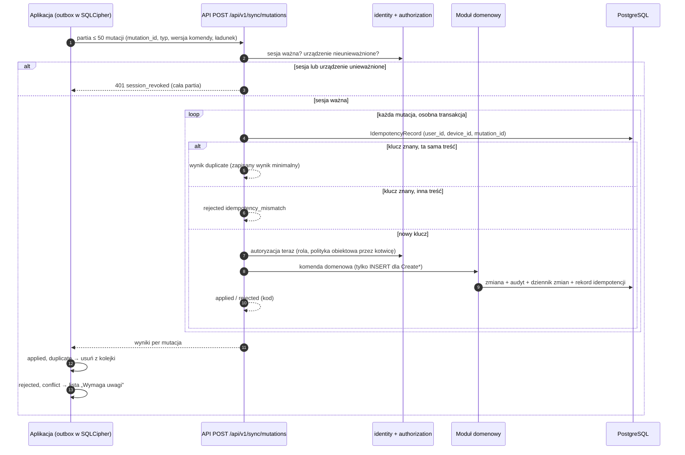
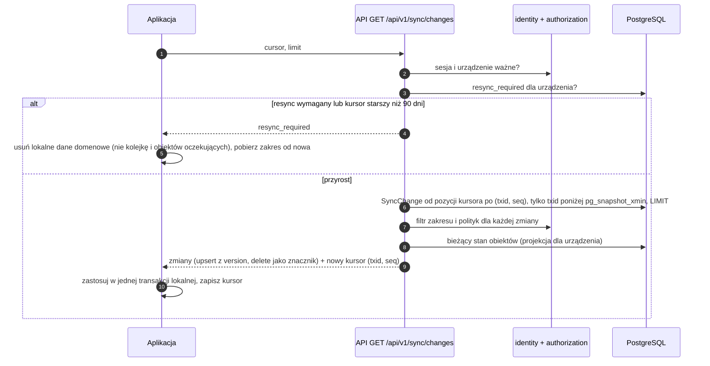

# Synchronizacja offline — szkic

> Dokument żywy. Właściciel: `solution-architect` (recenzja: `mobile-developer`, `security-engineer`). Stan: **szkic z EVM-002** — zasady, komendy mobilne MVP i zakres synchronizacji. Wnioski ze spike'a EVM-011 (Android — iOS odłożony, ADR-0015) i szczegóły protokołu z epików E10–E13 uzupełnią go przed M2. Decyzja: [ADR-0008](adr/0008-synchronizacja-offline.md) — ten dokument jej **nie zmienia**, tylko doprecyzowuje. Model encji i tabela gotowości offline: [`domain-model.md`](domain-model.md#gotowość-offline). Upload plików: [ADR-0009](adr/0009-storage-i-przetwarzanie-mediow.md) (dokument `media-pipeline.md` powstaje w EVM-011).

## Zakres
- **Dane i metadane** (wpisy, komentarze, metadane mediów, szybkie zlecenia, dane zleceń do przeglądania) — kolejka mutacji (push) i kanał zmian z kursorem (pull).
- **Pliki** (zdjęcia, filmy) — osobny kanał: sesja uploadu i S3 multipart z podpisanymi URL-ami (ADR-0009). Tu tylko zależności kolejki.
- **Poza zakresem szkicu:** schemat lokalnej bazy (EVM-009), UI listy „Wymaga uwagi” (E10–E13), wartości liczbowe do pomiaru w EVM-011.

## Zasady
### 1. Identyfikatory nadawane po stronie klienta
- Obiekty tworzone na telefonie dostają **UUIDv7 na urządzeniu**: `TimelineEntry` (`CreateNote`, `CreateComment`), `MediaAsset` (`CreateMediaAsset`), `UploadSession`, a w `CreateQuickWorkOrder` — `WorkOrder` oraz nowy `Customer` i nowa `Site`. Każda mutacja ma też własny `mutation_id` (UUIDv7).
- Serwer waliduje format (wersja 7, wariant RFC 9562), unikalność i **uprawnienia**. Identyfikator nie jest sekretem ani dowodem dostępu (CWE-639).
- **Komendy `Create*` wykonują wyłącznie `INSERT`.** Istniejący identyfikator — także cudzego lub usuniętego obiektu — daje `rejected: id_conflict`, **nigdy upsert** (CWE-915). Duplikat własnej mutacji rozpoznajemy po `mutation_id` (zasada 5), nie po istnieniu obiektu. Dotyczy zwłaszcza `CreateQuickWorkOrder` (trzy identyfikatory w jednej komendzie).
- Składnik czasu w UUIDv7 pochodzi z zegara telefonu — nie służy do kolejności ani audytu.

### 2. Soft delete i znaczniki usunięcia
- Usuwanie danych domenowych odbywa się wyłącznie na serwerze (soft delete, trwałe usunięcie, anonimizacja — [`domain-model.md`](domain-model.md#usuwanie-danych)); telefon w MVP niczego nie usuwa.
- Każde usunięcie trafia do dziennika zmian jako operacja `delete` (**znacznik usunięcia**): typ i identyfikator obiektu, kotwica — **bez danych osobowych**. Urządzenie usuwa lokalną kopię obiektu (i obiektów podrzędnych przez kotwicę) — **z wyjątkiem obiektów lokalnych oczekujących** (następny punkt).
- **Obiekty lokalne oczekujące należą do kolejki, nie do danych domenowych.** Są to obiekty utworzone na urządzeniu, których mutacja nie ma jeszcze wyniku `applied` lub `duplicate` (wpisy, komentarze, `MediaAsset`, szybkie zlecenie z nowym klientem i nową lokalizacją), oraz **pliki oryginałów** do potwierdzenia przez serwer (rekomendacja: stan `clean` lub późniejszy — [punkt 7](#otwarte--evm-011)). Znacznik usunięcia, resync (także kontrolny) i wyjście z zakresu **ich nie usuwają**. Pozostają widoczne w UI (oznaczone jako oczekujące) do wyniku mutacji; przy `rejected` trafiają **razem z plikiem** na listę „Wymaga uwagi”. Wyjątek: unieważnienie sesji lub urządzenia — otwarte ([punkt 1](#otwarte--evm-011)).
- Gdy obiekt nadrzędny zniknął z urządzenia (np. zlecenie usunięte w biurze albo poza zakresem), obiekt oczekujący zostaje na liście oczekujących — bez danych obiektu nadrzędnego. Po `rejected: target_unavailable` albo `forbidden` przechodzi na „Wymaga uwagi”. Sesja uploadu do usuniętego lub niedostępnego obiektu kończy się błędem (`404` / `403`): plik trafia na „Wymaga uwagi”, nie jest kasowany. Rozdzielenie repliki i obiektów oczekujących w lokalnej bazie — EVM-009.
- Mutacja z kolejki wskazująca usunięty obiekt docelowy daje `rejected: target_unavailable`; dane zostają na urządzeniu na liście **„Wymaga uwagi”** (ADR-0008).
- Retencja znaczników: 90 dni (jak dziennik zmian); starszy kursor → `resync_required`.

### 3. Wersjonowanie i dziennik zmian
- Każdy wiersz ma `version` (od 1, zwiększany przy każdej zmianie, także serwerowej). W pobieranych danych służy jako `base_version` dla przyszłych edycji z telefonu i jako `ETag` w API.
- **Dziennik zmian** `sync.change_log` (`SyncChange`): monotoniczny `seq`, `txid` (`xid8` = `pg_current_xact_id()`), `entity_type`, `entity_id`, `operation` (`upsert` / `delete`), `work_order_id` (kotwica do filtrowania zakresu; pusta dla [encji bez kotwicy zlecenia](#zakres-synchronizacji-urządzenia)), `recorded_at`. Zapis **w tej samej transakcji** co zmiana — generyczny trigger na tabelach objętych synchronizacją (moduły domenowe nie zależą od `sync`; alternatywa — otwarte dla EVM-011).
- **Kursor** — nieprzezroczysty token (szyfrowany i uwierzytelniony kluczem serwera) z **pozycją w dzienniku zmian: parą (`txid`, `seq`)** ostatniego odczytanego wiersza i czasem wydania (kursor starszy niż retencja → `resync_required`). Kursor jest powiązany z parą **użytkownik + urządzenie**; kursor innej pary jest odrzucany. Nie zawiera danych osobowych.
- **Bezpieczny horyzont i kolejność odczytu** (ADR-0008). Serwer czyta wyłącznie wiersze z `txid` < `pg_snapshot_xmin(pg_current_snapshot())`. Wszystkie transakcje o niższym `txid` są już zakończone, więc poniżej horyzontu nie pojawi się żaden nowy wiersz. Wiersze idą w kolejności (`txid`, `seq`) od pozycji kursora:
  `WHERE (txid, seq) > (:txid, :seq) AND txid < pg_snapshot_xmin(pg_current_snapshot()) ORDER BY txid, seq LIMIT :limit`, z indeksem (`txid`, `seq`).
  Nowy kursor to para z ostatniego **odczytanego** wiersza dziennika — także wtedy, gdy filtr zakresu i polityk nie przekazał go temu urządzeniu. Gdy poniżej horyzontu nie ma nowych wierszy, pozycja się nie zmienia. `seq` porządkuje zmiany w obrębie jednej transakcji i rozstrzyga remisy przy stronicowaniu.
- **Kursor z samym `seq` gubi zmiany.** `seq` nadaje sekwencja w chwili zapisu do dziennika, a `txid` — pierwszy zapis transakcji. Transakcja z niższym `txid` może dopisać do dziennika później (wyższy `seq`) i zatwierdzić się wcześniej niż transakcja z wyższym `txid` i niższym `seq`. Odczyt „po `seq` do pierwszego wiersza z `txid` ≥ horyzont” przesunąłby wtedy kursor za niezatwierdzony jeszcze wiersz, a zmiana (także znacznik usunięcia) zginęłaby po cichu do kontrolnego resyncu. Przypadek testowy — [scenariusz 6](#scenariusze-testowe-nic-nie-ginie-evm-011-e10e13).
- Długa transakcja zapisująca wstrzymuje horyzont: opóźnia pobieranie zmian, ale ich nie gubi ([punkt 5](#otwarte--evm-011)).
- Dla operacji `upsert` serwer zwraca **bieżący stan** obiektu w projekcji dla urządzenia (kilka zmian jednego obiektu na stronie = jeden stan), z `version`.
- **Stan pliku:** `StoredFile` nie jest synchronizowany osobno. Zmiana jego stanu (i podsumowania: rozmiar, wymiary, czas trwania) zapisuje w dzienniku zmian, w tej samej transakcji, `upsert` **właściciela** — `MediaAsset` albo `DocumentVersion` (jedna reguła dla obu). Na telefonie stan pliku niesie projekcja `MediaAsset` ([projekcja](#zakres-synchronizacji-urządzenia)); pliki dokumentów są dostępne tylko online. `version` właściciela się nie zmienia, bo stan pliku nie jest polem edytowalnym i nie blokuje edycji metadanych przez `If-Match`. Sposób zapisu — [punkt 5](#otwarte--evm-011).

### 4. Append-only dla danych z terenu
- Dane z terenu w MVP to wyłącznie **tworzenie**: wpisy, komentarze, media (metadane + plik), szybkie zlecenie. **Zero edycji pól współdzielonych** → w MVP konflikty nie występują.
- Korekta wpisu = nowy wpis z `supersedesEntryId` (w MVP tworzony w panelu). Kolejność w dzienniku zlecenia wg **czasu serwera** (`created_at`, w ADR-0008 `received_at`).
- `capturedAt` (zegar telefonu) to tylko metadana z walidowanym zakresem (propozycja: od 60 dni wstecz do 10 min w przód względem czasu serwera). Wartość spoza zakresu nie odrzuca mutacji — zapisujemy ją bez `capturedAt`, wynik `applied` z ostrzeżeniem `captured_at_out_of_range` (dane nie giną). Zakres — do potwierdzenia w EVM-011.
- **Po MVP:** `UpdateStageStatus` niesie `base_version`; gdy obiekt zmienił się w międzyczasie → `conflict` z aktualnym stanem, **bez cichego nadpisywania** (brak last-write-wins); decyzję podejmuje użytkownik.

### 5. Idempotencja mutacji
- `mutation_id` = **klucz idempotencji** (ADR-0004, ADR-0008). Rekord `IdempotencyRecord` jest powiązany z `user_id` + `device_id` **z sesji serwerowej** i z typem komendy; przechowuje skrót SHA-256 treści i **wynik minimalny** (status, kod, identyfikator zasobu) — nie pełną odpowiedź.
- Powtórka tej samej mutacji → `duplicate` z zapisanym wynikiem. Ten sam klucz z inną treścią → `rejected: idempotency_mismatch`. Mutacja z tym samym kluczem wciąż przetwarzana → `rejected: idempotency_in_progress` (klient ponawia później; w REST — `409`).
- Retencja kluczy: **30 dni** (dłużej niż 7 dni pracy offline bez ponownego uwierzytelnienia, ADR-0005).
- Każda mutacja w partii wykonuje się we **własnej transakcji** (komenda domenowa + rekord idempotencji + audyt + dziennik zmian).

## Tożsamość urządzenia i autoryzacja przy synchronizacji
- **Urządzenie rejestruje serwer przy logowaniu mobilnym** (ADR-0005); `user_id` i `device_id` pochodzą **wyłącznie z sesji serwerowej**, nigdy z nagłówka ani treści żądania. Nagłówki `X-Client-*` służą tylko kompatybilności (ADR-0004).
- Przy każdym żądaniu synchronizacji: sesja ważna i urządzenie nieunieważnione — inaczej **`401 session_revoked` dla całej partii** (ADR-0005, ADR-0008).
- **Autoryzacja w momencie synchronizacji**, nie utworzenia na telefonie: bieżąca rola i polityki obiektowe (ten sam silnik co API, przez [kotwicę](domain-model.md#kotwica-autoryzacji)). Utrata dostępu do obiektu → `rejected: forbidden` (dane na liście „Wymaga uwagi”) i flaga `resync_required` urządzenia.
- **Te same schematy i limity co API:** walidacja kontraktem (`additionalProperties: false`, limity długości), partia ≤ 50 mutacji, mutacja ≤ 64 KB, treść ≤ 1 MB, limity żądań ([`api-guidelines.md`](api-guidelines.md#limity)).
- Pobieranie zwraca wyłącznie obiekty w zakresie urządzenia, przefiltrowane politykami — przy każdym odczycie.

## Komendy mobilne MVP
Telefon w MVP **tylko tworzy** (zgodnie z M2: E11–E13). Kolejka `outbox` w szyfrowanej bazie: FIFO w obrębie obiektu, przetrwa zabicie aplikacji i restart telefonu.

| Komenda | Tworzy | Najważniejsze pola | Walidacja i autoryzacja | Możliwe `rejected` | Zależności w kolejce |
|---|---|---|---|---|---|
| `CreateNote` | `TimelineEntry` (`kind = note`) | `id`, `workOrderId`, `noteCategory`, `body`, `procedureStageId?`, `capturedAt` | rola A lub E; zlecenie dostępne i nieusunięte (także `settled` / `cancelled`); etap należy do zlecenia | `forbidden`, `target_unavailable`, `id_conflict`, `validation_failed`, `idempotency_mismatch` | po `CreateQuickWorkOrder` tego zlecenia |
| `CreateComment` | `TimelineEntry` (`kind = comment`) | `id`, `workOrderId`, `body`, `capturedAt` | jak wyżej | jak wyżej | jak wyżej |
| `CreateMediaAsset` | `MediaAsset` (metadane) | `id`, `workOrderId`, `mediaType`, `category`, `description?`, `procedureStageId?`, `capturedAt` | jak wyżej; plik deklarowany dopiero w sesji uploadu | jak wyżej | po `CreateQuickWorkOrder`; **przed** utworzeniem sesji uploadu (`POST …/media-assets/{id}/upload-sessions`, ADR-0009) |
| `CreateQuickWorkOrder` | `WorkOrder` (+ nowy `Customer`, nowa `Site`) z kompozycją wg szablonu | `workOrderId`, `templateId`, `title`, `customerId` **albo** `newCustomer` (`id`, `kind`, nazwa, `phone`), `siteId` **albo** `newSite` (`id`, `siteType`, adres, `parkingSpotNumber?`), `note?` | rola A lub E; szablon aktywny; istniejący klient i lokalizacja dostępne; nowe identyfikatory — tylko `INSERT`; numer nadaje serwer (do synchronizacji „oczekuje na numer”) | `id_conflict` (dowolny z identyfikatorów), `forbidden`, `template_unavailable`, `validation_failed`, `idempotency_mismatch` | pierwsza dla swojego zlecenia; wpisy i media do tego zlecenia czekają na jej wynik |
| `UpdateStageStatus` *(po MVP)* | zmiana `ProcedureStage.status` | `stageId`, `workOrderId`, `to`, `base_version`, pola przejścia | jak w tabeli przejść etapu ([`domain-model.md`](domain-model.md#etap-procesu)) | `conflict` (z aktualnym stanem), `invalid_state_transition`, `forbidden`, `target_unavailable` | — |

Wynik każdej mutacji: `applied` / `duplicate` / `conflict` / `rejected` (kod). **Odrzucone mutacje nie są usuwane** — trafiają na listę „Wymaga uwagi” (np. ponowne przypisanie wpisu do innego zlecenia), a Administrator widzi liczbę niewysłanych elementów urządzenia (ADR-0007).

## Polityka synchronizacji per encja
Skrót — pełna tabela: [`domain-model.md`](domain-model.md#gotowość-offline).

| Encja | Kierunek | Konflikty |
|---|---|---|
| `TimelineEntry`, `MediaAsset` | ↑ tworzenie, ↓ pobieranie | brak (append-only); usunięcie i redakcja tylko serwerowe → `delete` / `upsert` |
| `StoredFile`, `UploadSession` | ↑ sesja uploadu (ADR-0009); ↓ stan pliku tylko w projekcji `MediaAsset` | brak (stan pliku nadaje serwer) |
| `WorkOrder`, `Customer`, `Site` | ↑ tylko w `CreateQuickWorkOrder`, ↓ pobieranie | brak w MVP (telefon nie edytuje); edycje biura nadpisują stan lokalny |
| `ProcedureStage` | ↓ (po MVP ↑ `UpdateStageStatus`) | po MVP: `base_version` → `conflict`, bez last-write-wins |
| pozostałe w zakresie (`Party`, `Charger`, `ScopeItem`, `Procedure`, `WorkOrderAssignment`, `Document`, konfiguracja, `User`) | ↓ | brak (tylko odczyt na telefonie) |
| `PaymentMilestone`, `AuditEvent`, cudze `Session` i `Device` | — | poza urządzeniem |

## Zakres synchronizacji urządzenia
Delegowane z ADR-0008 („definicja zakresu w EVM-002”).

**Kto:** użytkownicy z rolą Administrator lub Edytor. Rola Tylko odczyt na telefonie — decyzja w EVM-005 (AC3).

**Które zlecenia:** nieusunięte zlecenia **niezamknięte** (aktywne `new`, `quoting`, `accepted`, `in_progress` oraz `on_hold` i `completed` — definicje w [`domain.md`](../product/domain.md#pojęcia-modelu-dodane-w-evm-002)) oraz **zamknięte** (`settled`, `cancelled`) z `closedAt` w ostatnich **N dniach** (propozycja N = 30; pomiar w EVM-011). W v1 każdy Edytor widzi wszystkie zlecenia; od M4 rola Monter — tylko przypisane (`WorkOrderAssignment`).

**Dane powiązane:** klient, lokalizacja (z ładowarkami), kontrahenci wskazani w lokalizacji i etapach, pozycje zakresu, procesy i etapy, przypisania, wpisy dziennika, metadane mediów (z podsumowaniem pliku) i dokumentów, użytkownicy wskazani w danych (tylko `id`, `displayName`). **Globalnie:** konfiguracja potrzebna do szybkiego zlecenia (`ServiceCatalogItem`, `ServiceCatalogItemProcedure`, `WorkOrderTemplate`, `WorkOrderTemplateItem`, `ProcedureTemplate`, `ProcedureStageTemplate`, `DocumentKind`).

**Encje bez kotwicy zlecenia:** `Customer`, `Site` (z `Charger`), `Party` oraz dokumenty z kotwicą klienta lub lokalizacji nie mają `work_order_id` (w dzienniku zmian ta kotwica jest pusta). Są w zakresie, gdy wskazuje je dowolne zlecenie z zakresu urządzenia: przez `customerId`, `siteId`, `Site.managerPartyId`, `Site.distributionSystemOperatorPartyId` albo `ProcedureStage.waitingOnPartyId`. Filtr ocenia to **przy każdym odczycie**, według tych samych reguł i polityk co dla zleceń. Zmiana takiej encji w biurze trafia więc na urządzenie tylko wtedy, gdy encja jest w zakresie.

**Wejście do zakresu:** obiekt wchodzi do zakresu urządzenia, gdy:
- biuro tworzy zlecenie dla istniejącego klienta lub lokalizacji, których nie ma na urządzeniu;
- Administrator wykonuje przywrócenie zlecenia albo encji powiązanej po soft delete;
- następuje ponowne otwarcie zlecenia zamkniętego ponad N dni temu (`settled → completed`, `cancelled → on_hold`);
- obiekt z zakresu zaczyna wskazywać nową encję (np. zmiana `siteId`, `waitingOnPartyId`, `managerPartyId`);
- rozszerza się dostęp (od M4 — przypisanie Montera).

Kanał zmian zawiera tylko obiekty zmienione, a w tych przypadkach encje powiązane często się nie zmieniły. Zasada: **serwer dostarcza w tej samej stronie zmian bieżący stan wszystkich encji powiązanych w zakresie** (klient, lokalizacja z ładowarkami, strony, pozycje zakresu, procesy i etapy, przypisania, wpisy, metadane mediów i dokumentów, nazwy użytkowników). Urządzenie stosuje stronę atomowo, w jednej transakcji lokalnej. Zlecenie nigdy nie pojawia się więc jako niepełny szkielet bez adresu i telefonu do klienta. Mechanizm — otwarte dla EVM-011 ([punkt 12](#otwarte--evm-011)).

**Poza urządzeniem (minimalizacja):** `PaymentMilestone` i `PaymentMilestoneTemplate`, `AuditEvent`, dane innych użytkowników poza nazwą wyświetlaną, cudze sesje i urządzenia, **pliki dokumentów i oryginały mediów** (nie są automatycznie przechowywane offline), PPE.

**Projekcja pól na telefonie**
| Encja | Pola na urządzeniu | Pola wyłączone |
|---|---|---|
| `Customer` | `id`, `kind`, `displayName`, `phone`, `version` | e-mail, NIP, adres korespondencyjny, `notes` |
| `Site` | `id`, `siteType`, adres, `parkingSpotNumber`, `garageLevel`, `connectionPowerKw`, `managerPartyId`, `distributionSystemOperatorPartyId`, `notes`, `version` | `meteringPointId` (PPE) — rekomendacja; decyzja EVM-005 |
| `Party` | `id`, `kind`, `displayName`, `contactPersonName`, `phone`, `version` | `email`, `notes`, `legalForm` |
| `WorkOrder` i encje podrzędne (bez płatności) | pola z modelu poza kolumnami technicznymi (`search_text`, `deleted_*`) | — |
| `MediaAsset` | metadane; **podsumowanie pliku**: `fileState`, `fileStateReasonCode` (tylko przy `failed`: `checksum_mismatch`, `processing_error`), `sizeBytes`, `durationSeconds`, `widthPx`, `heightPx`; **miniatury na żądanie** (gdy `fileState = ready`) — w sandboxie aplikacji, wykluczone z backupu urządzenia, kasowane przy unieważnieniu | oryginały (poza własnymi plikami do potwierdzenia przez serwer — [punkt 7](#otwarte--evm-011)); `objectKey`, skróty SHA-256, `originalFilename`; przyczyna kwarantanny (tylko panel) |
| `Document`, `DocumentVersion` | metadane (rodzaj, tytuł, numer wersji, data) | pliki — tylko online, na żądanie |
| `User` | `id`, `displayName` | e-mail, rola, czasy logowania |

**Wyjście z zakresu:** obiekt, który wypada z zakresu, jest **usuwany z urządzenia** razem z obiektami podrzędnymi. Przykłady: zlecenie zamknięte ponad N dni temu; klient, lokalizacja lub strona, których nie wskazuje już żadne zlecenie z zakresu. Zostają kolejka i obiekty lokalne oczekujące z plikami ([zasada 2](#2-soft-delete-i-znaczniki-usunięcia)). Mechanizm (reguła po stronie klienta z N z konfiguracji serwera albo zdarzenia „wyjście z zakresu” z serwera) — otwarte dla EVM-011.

## Wysyłanie (push) — sekwencja

## Pobieranie (pull) — sekwencja

## Resync, utrata dostępu i wyjście z zakresu
- **`resync_required`** ustawia serwer, gdy: zmieni się rola użytkownika lub polityka dostępu (od M4 — odpięcie od zlecenia), kursor jest starszy niż retencja dziennika zmian (90 dni), zmieni się reguła zakresu (np. wartość N), lokalna baza urządzenia została utracona (np. przywrócenie telefonu), a także okresowo jako kontrolny pełny resync (propozycja: co 7 dni, ADR-0008).
- Klient po `resync_required` usuwa lokalne dane domenowe (**nie kolejkę**) i pobiera zakres od nowa; obiekty bez dostępu znikają z urządzenia.
- **Kolejka obejmuje obiekty lokalne oczekujące i ich pliki** ([zasada 2](#2-soft-delete-i-znaczniki-usunięcia)): wpisy, komentarze, `MediaAsset` i szybkie zlecenie bez wyniku `applied` / `duplicate` oraz oryginały przed potwierdzeniem przez serwer. Resync (także kontrolny), znacznik usunięcia i wyjście z zakresu ich nie usuwają. Technik nadal widzi swoje szybkie zlecenie jako oczekujące i może dodawać do niego zdjęcia. Przy `rejected` obiekty trafiają z plikami na „Wymaga uwagi”.
- Dezaktywacja konta i unieważnienie urządzenia → `401 session_revoked`; aplikacja czyści dane zgodnie z ADR-0005 i ADR-0007 — **los niewysłanej kolejki (w tym obiektów oczekujących i plików) — otwarte (EVM-011, polityka EVM-005)**.

## Wersje komend i kompatybilność
- Każda mutacja ma `type` i `commandVersion` (liczba całkowita). Zmiany ładunku w ramach wersji tylko addytywne; zmiana łamiąca = nowa wersja komendy.
- Serwer obsługuje każdą wersję komendy, którą może wysłać wspierana aplikacja — także mutację utworzoną przez starszą wersję i czekającą w kolejce po aktualizacji aplikacji. Wersję komendy usuwamy dopiero, gdy `minSupportedVersion` jej nie obejmuje **i** minęło 30 dni (retencja kluczy).
- `426 client_version_unsupported` blokuje pracę online, ale **zachowuje kolejkę** (ADR-0004); po aktualizacji aplikacja wysyła kolejkę bez utraty danych (`sync-core` zachowuje serializację starszych wersji albo podnosi je do bieżącej).
- Nowe wartości słowników w pobieranych danych: klient obsługuje wartość nieznaną (ADR-0004).

## Limity i retencje
| Parametr | Wartość | Źródło |
|---|---|---|
| partia mutacji | ≤ 50 | ADR-0008 |
| rozmiar mutacji / treści żądania | ≤ 64 KB / ≤ 1 MB | ten dokument / ADR-0004 |
| strona zmian (`limit`) | domyślnie 200, maks. 500 (odpowiedź ≤ 1 MB) — do pomiaru w EVM-011 | ten dokument |
| retencja kluczy idempotencji | 30 dni | ADR-0004, ADR-0008 |
| retencja dziennika zmian i znaczników usunięcia | 90 dni | ADR-0008 |
| zamknięte zlecenia w zakresie | N = 30 dni (propozycja) | ten dokument, EVM-011 |
| praca offline bez ponownego uwierzytelnienia | 7 dni przeglądania; rejestracja mediów zawsze | ADR-0005, EVM-005 |
| limity żądań | jak API (300 żądań/min/użytkownik + limit per IP) | ADR-0004 |

## Zgodność z ADR-0008 (checklista)
| Element ADR-0008 | Gdzie |
|---|---|
| UUIDv7 nadawany na urządzeniu; nie zastępuje autoryzacji | zasada 1 |
| `mutation_id` = klucz idempotencji, powiązany z `user_id` + `device_id`; `duplicate`, `idempotency_mismatch`; retencja 30 dni | zasada 5 |
| `base_version` dla edycji, `conflict` bez last-write-wins; w MVP zero edycji | zasady 3–4, komendy |
| kursor nieprzezroczysty z `seq` i `xid8`, bezpieczny horyzont `pg_snapshot_xmin` | zasada 3 (kursor = para (`txid`, `seq`), odczyt tylko `txid` < `pg_snapshot_xmin` w kolejności (`txid`, `seq`)), sekwencja pull, scenariusz 6 |
| kursory filtrowane uprawnieniami; `resync_required` przy utracie dostępu | autoryzacja, resync |
| retencja dziennika zmian i znaczników 90 dni; starszy kursor → resync | zasady 2–3 |
| `401 session_revoked` dla całej partii; autoryzacja w momencie synchronizacji | autoryzacja, sekwencja push |
| odrzucone mutacje na liście „Wymaga uwagi”; `target_unavailable` | zasada 2, komendy |
| po `resync_required` klient usuwa dane domenowe, nie kolejkę | zasada 2 (obiekty lokalne oczekujące), resync |
| `captured_at` tylko metadana, kolejność wg czasu serwera | zasada 4 |
| partie do 50 mutacji | komendy, limity |

## Scenariusze testowe „nic nie ginie” (EVM-011, E10–E13)
Wymagania testowe dla spike'a i historyjek M2 (test `sync-core`, testy serwerowe na PostgreSQL w Testcontainers oraz E2E na Androidzie):
1. **Usunięcie zlecenia w biurze przy niewysłanych zdjęciach** (metadane w kolejce, pliki przed uploadem lub w trakcie). Zdjęcia z plikami trafiają na „Wymaga uwagi”, żaden plik nie znika.
2. **Resync przy niewysłanym szybkim zleceniu** (także kontrolny, co 7 dni) z nowym klientem i lokalizacją. Zlecenie zostaje widoczne jako oczekujące, technik dodaje kolejne zdjęcia, a po powrocie sieci wszystko trafia na serwer bez duplikatów.
3. **Wyjście z zakresu przy niewysłanych wpisach** (zlecenie zamknięte ponad N dni temu). Wpisy zostają do wyniku mutacji.
4. **Plik `quarantined` lub `failed` (`checksum_mismatch`).** Lokalny oryginał zostaje, a aplikacja pokazuje „Wymaga uwagi” albo „Ponów” ([punkt 7](#otwarte--evm-011)).
5. **Wejście do zakresu** ([punkt 12](#otwarte--evm-011)). Zlecenie od razu ma klienta, adres, etapy i wpisy w przypadkach:
   - nowe zlecenie dla istniejącego klienta i lokalizacji spoza urządzenia;
   - przywrócenie zlecenia po soft delete;
   - ponowne otwarcie zlecenia zamkniętego ponad N dni temu;
   - wskazanie w etapie strony spoza urządzenia.
6. **Kursor przy przeplocie transakcji** (test serwerowy, deterministyczny: dwa połączenia sterowane krok po kroku, bez opóźnień):
   1. T2 zaczyna pierwsza i dowolnym zapisem dostaje niższy `txid`;
   2. T1 zapisuje zmianę — niższy `seq`, wyższy `txid`;
   3. T2 zapisuje zmianę (wyższy `seq`) i zatwierdza się;
   4. pobranie;
   5. T1 zatwierdza się;
   6. kolejne pobranie.

   Oczekiwane: urządzenie dostaje obie zmiany, bez duplikatów — także przy `limit = 1`, kilku zmianach w jednej transakcji i znaczniku usunięcia. Test „opóźnionego commitu” (ADR-0008, ryzyko 4) tego przypadku nie wykrywa, bo transakcja z niższym `txid` musi dopisać do dziennika później.

## Otwarte — EVM-011
Do rozstrzygnięcia w spike'u EVM-011 (Android; iOS odłożony — ADR-0015) i w historyjkach E10–E13; wnioski wpisujemy tutaj.
1. **Los niewysłanej kolejki i listy „Wymaga uwagi” po unieważnieniu sesji lub urządzenia** — czyszczenie vs bezpieczne zachowanie do ponownego logowania tego samego użytkownika (ADR-0007, ryzyko c; polityka w EVM-005).
2. **Limit pracy offline 7 dni** (ADR-0005) — zachowanie aplikacji po przekroczeniu (ukrycie danych, dalsza rejestracja mediów); wartość ostateczna w EVM-005.
3. **Wartość N** (zamknięte zlecenia w zakresie; propozycja 30 dni) — pomiar rozmiaru i czasu pełnej synchronizacji na szyfrowanej bazie.
4. **Mechanizm wyjścia z zakresu** — reguła po stronie klienta (N i `closedAt`) czy zdarzenia z serwera.
5. **Zapis dziennika zmian** — generyczny trigger czy port w `platform`. Test poprawności kursora przy równoległych transakcjach obejmuje przeplot z [scenariusza 6](#scenariusze-testowe-nic-nie-ginie-evm-011-e10e13) (transakcja z niższym `txid` dopisuje do dziennika później). Do ustalenia: limit czasu transakcji (np. `idle_in_transaction_session_timeout`) i metryka opóźnienia horyzontu, bo długa transakcja zapisująca opóźnia pobieranie zmian.
6. **Zakres `capturedAt`** — dopuszczalne przesunięcie zegara telefonu.
7. **Pliki lokalne — kiedy usuwać własny oryginał z urządzenia.** *Rekomendacja do potwierdzenia w EVM-011:* usuwamy go **dopiero**, gdy projekcja `MediaAsset` pokaże `fileState` równe `clean`, `processing` lub `ready`. Niezmiennik: `clean` tylko przy zgodnym SHA-256 i pozytywnym skanie ([`domain-model.md`](domain-model.md#storedfile-i-uploadsession)). Nie usuwamy po `uploaded`, bo `complete` sprawdza tylko rozmiar (ADR-0009). Przy `quarantined` lub `failed` przed `clean` lokalna kopia zostaje:
   - `failed` z `checksum_mismatch` → „Ponów” (nowa sesja uploadu z lokalnego pliku);
   - `quarantined` → „Wymaga uwagi”;
   - `failed` z `processing_error` (po `clean`) nie dotyczy oryginału — przetwarzanie ponawia serwer.

   Do ustalenia: rozmiar i czyszczenie pamięci podręcznej miniatur, zachowanie przy braku miejsca na urządzeniu.
8. **Mutacja starsza niż retencja kluczy (30 dni)** — rozpoznanie własnego, już zapisanego obiektu przy `id_conflict` (np. porównanie twórcy i skrótu treści).
9. **Duplikaty klientów i lokalizacji z szybkich zleceń offline** — wyszukiwanie lokalne przed utworzeniem; scalanie w biurze poza v1.
10. **Rozmiar strony zmian i projekcji** — wartości `limit` i czas przyrostowej synchronizacji po dniu offline.
11. **Okresowy kontrolny resync** — częstotliwość (propozycja: co 7 dni).
12. **Mechanizm wejścia do zakresu** ([zasada](#zakres-synchronizacji-urządzenia)) — opcje: emisja zmian zależnych (operacja domenowa zapisuje w dzienniku `upsert` encji powiązanych), dociąganie brakujących referencji przez klienta (zlecenie albo referencja nieznana lokalnie → pobranie agregatu, zanim pokażemy go w UI) albo celowany resync zlecenia (serwer rozwija znacznik wejścia w bieżący stan agregatu przy odczycie strony, z filtrem polityk). *Rekomendacja wstępna:* rozwiązanie po stronie serwera (jedna strona, stan bieżący) oraz kontrola kompletności referencji na kliencie jako siatka bezpieczeństwa (brakująca referencja → dociągnięcie i sygnał w telemetrii). Do ustalenia: agregat większy niż `limit` strony. Testy: nowe zlecenie dla istniejącego klienta, przywrócenie po soft delete, ponowne otwarcie po N dniach, zmiana wskazania strony lub lokalizacji ([scenariusz 5](#scenariusze-testowe-nic-nie-ginie-evm-011-e10e13)).
