# M1 — MVP „Biuro” (wydanie 1.0): plan i indeks historyjek

> Dokument żywy (EVM-010, `/milestone plan M1`). Właściciel: `product-owner`; decyzje: Konrad. Stan: **plan zaakceptowany przez Konrada 2026-10-03** (demo EVM-010) — 57 historyjek `ready`; EVM-053 i EVM-058 w `draft` do `/refine`. EVM-073 (P3, dług narzędzia dokumentacji z EVM-013 — „Decyzje” 1) dopisana 2026-10-05 jako `draft` i **wstrzymana decyzją Konrada 2026-10-05** (EVM-075). Zakres: [`roadmap.md`](../../product/roadmap.md) → M1, epiki E1–E8. Wejścia: model domeny i API (EVM-002), makiety (EVM-004), wymagania bezpieczeństwa (EVM-005), konsultacje `solution-architect` i `security-engineer` (historyjka [EVM-010](../M0/EVM-010-backlog-m1-gotowy.md) → „Plan techniczny” → „Ustalenia z konsultacji”).

## Spis treści
1. [Cel M1](#cel-m1)
2. [Zasady planu](#zasady-planu)
3. [Historyjki — epik → historyjki](#historyjki--epik--historyjki) (AC1)
4. [Kolejność i fazy](#kolejność-i-fazy) (AC3)
5. [Punkt pilota](#punkt-pilota) (AC3)
6. [Pokrycie zakresu roadmapy](#pokrycie-zakresu-roadmapy) (AC1)
7. [Świadome przesunięcia](#świadome-przesunięcia)
8. [Przeniesione do E9](#przeniesione-do-e9)
9. [Ekrany → historyjki](#ekrany--historyjki)
10. [Scenariusze A–D → historyjki](#scenariusze-ad--historyjki)
11. [Wymagania bezpieczeństwa → historyjki](#wymagania-bezpieczeństwa--historyjki) (AC2)
12. [Zdolności przekrojowe](#zdolności-przekrojowe)
13. [Zasady wspólne dla historyjek M1](#zasady-wspólne-dla-historyjek-m1)
14. [Zależności zewnętrzne](#zależności-zewnętrzne)
15. [Decyzje dla Konrada](#decyzje-dla-konrada) (AC4)
16. [Ryzyka planu](#ryzyka-planu)
17. [Uwagi do potwierdzenia](#uwagi-do-potwierdzenia)
18. [Zmiany względem planu wstępnego](#zmiany-względem-planu-wstępnego)

## Cel M1
Firma prowadzi **wszystkie nowe zlecenia w panelu web**: klienci, lokalizacje, zlecenia z szablonów, procesy i etapy z „Czekamy na…”, dziennik, zdjęcia, filmy i dokumenty, płatności etapowe — na produkcji w UE, po security sign-off. Telefon tymczasowo dodaje zdjęcia przez przeglądarkę (aplikacja mobilna — M2).

## Zasady planu
- **Priorytety:** **P0** — fundament: enablery (styleguide, makiety, ADR, dane startowe) i logowanie (EVM-016, EVM-067); bez nich nie powstaje żaden ekran. **P1** — wymagane do wydania 1.0 i kryteriów wyjścia M1. **P2** — ważne, może przejść do M2/M3 bez utraty kryteriów wyjścia (decyzja 11). **P3** — dług techniczny bez wpływu na kryteria wyjścia (EVM-073): faza 7 albo wcześniej decyzją Konrada.
- **Rozmiar (INVEST):** ≤ 8 AC, ≤ 3 moduły backendu (+ panel); pionowe plasterki; operacje Administratora i P2 w osobnych historyjkach.
- **Ścieżka pionowa** korzysta z makiet EVM-004 i jednego ekranu z EVM-015 (W-13 — aktywacja konta z linku).
- **Status `ready`** ustawia orkiestrator po akceptacji Konrada dla historyjek z kompletem DoR — jak w M0 (np. EVM-008 jest `ready`, choć EVM-006 i EVM-007 nie są `done`). Punkt DoR „zależności `done`” orkiestrator sprawdza przed `/deliver`.
- **Numeracja:** EVM-014 … EVM-072, ciągła, bez luk; identyfikatory z planu wstępnego zachowane (konsultacje się do nich odwołują), nowe historyjki z podziałów dostały kolejne numery — [zmiany](#zmiany-względem-planu-wstępnego).

## Historyjki — epik → historyjki
Kolumna „Ekrany”: identyfikatory z [`docs/ux/flows/README.md`](../../ux/flows/README.md#ekrany).

### E00 Fundamenty (enablery M1)
| ID | Tytuł | Typ | Prio | `owner` | `depends_on` | Ekrany / uwagi |
|---|---|---|---|---|---|---|
| [EVM-014](EVM-014-styleguide-1-2-0.md) | Styleguide 1.2.0 — propozycje [P-1…P-13] i poprawki makiet z EVM-004 | enabler | P0 | ux-designer | EVM-004 | P-1…P-13; PO-2–PO-5 |
| [EVM-015](EVM-015-makiety-e1.md) | Makiety ekranów E1 — reset hasła, zaproszenie, konto, użytkownicy i dziennik audytu | enabler | P0 | ux-designer | EVM-014 | W-12, W-13, W-15, W-16, W-18 |
| [EVM-071](EVM-071-makiety-m1-klienci-lokalizacja-zlecenie.md) | Makiety ekranów M1 — klienci, lokalizacja, edycja zlecenia i prywatność | enabler | P0 | ux-designer | EVM-014 | W-14, W-19, W-20, W-06, W-10, W-11, W-09 (przeglądarka w telefonie) |
| [EVM-069](EVM-069-adr-model-odczytu-listy.md) | ADR — model odczytu listy i podsumowania zlecenia | enabler | P0 | solution-architect | EVM-002 | luka L3 (W-06, W-10) |
| [EVM-073](EVM-073-wyjatki-jakosci-docs-lifecycle.md) | Zniesienie wyjątków jakości w `tools/docs-lifecycle` | enabler | P3 | devops-engineer | EVM-013 | bez ekranów; dług z EVM-012 (EVM-013 → „Decyzje” 1); wymaga Node 26 lokalnie albo w chmurze |

### E1 Dostęp i użytkownicy
| ID | Tytuł | Typ | Prio | `owner` | `depends_on` | Ekrany / uwagi |
|---|---|---|---|---|---|---|
| [EVM-016](EVM-016-pierwszy-administrator.md) | Pierwszy Administrator — aktywacja konta hasłem i kluczem dostępu, wylogowanie | story | P0 | backend-developer | EVM-008, EVM-014, EVM-015 | W-13, W-03, W-10 (pusty); audyt, macierz ról |
| [EVM-067](EVM-067-logowanie-i-sesje.md) | Logowanie hasłem i kluczem dostępu, wygasanie i rotacja sesji | story | P0 | backend-developer | EVM-016 | W-01, W-02; P-11 |
| [EVM-029](EVM-029-step-up-i-dziennik-audytu.md) | Ponowne uwierzytelnienie (step-up) i dziennik audytu dla Administratora | story | P1 | backend-developer | EVM-015, EVM-067 | W-04, W-18 |
| [EVM-024](EVM-024-zaproszenie-uzytkownika.md) | Zaproszenie użytkownika i aktywacja konta | story | P1 | backend-developer | EVM-007, EVM-029 | W-16, W-13, W-03, W-04; e-mail |
| [EVM-023](EVM-023-totp-i-kody-odzyskiwania.md) | Kod z aplikacji (TOTP) i kody odzyskiwania | story | P1 | backend-developer | EVM-024 | W-02, W-03, W-04; P-4 |
| [EVM-025](EVM-025-reset-hasla.md) | Reset zapomnianego hasła | story | P1 | backend-developer | EVM-024 | W-01, W-12, W-02 |
| [EVM-026](EVM-026-ochrona-przed-zgadywaniem-hasel.md) | Ochrona przed zgadywaniem haseł i powiadomienia o bezpieczeństwie konta | story | P1 | backend-developer | EVM-024 | W-01, W-02 |
| [EVM-027](EVM-027-role-dezaktywacja-reset-mfa.md) | Role, dezaktywacja, sesje i reset MFA użytkownika | story | P1 | backend-developer | EVM-024 | W-16, W-04 |
| [EVM-028](EVM-028-konto-uzytkownika.md) | Konto — profil, hasło, drugi krok logowania i moje sesje | story | P1 | backend-developer | EVM-023 | W-15 (bez urządzeń) |

### E2 Klienci
| ID | Tytuł | Typ | Prio | `owner` | `depends_on` | Ekrany / uwagi |
|---|---|---|---|---|---|---|
| [EVM-020](EVM-020-klient-w-nowym-zleceniu.md) | Klient w nowym zleceniu — wyszukiwanie i dodanie | story | P1 | backend-developer | EVM-017 | W-05 „1. Klient”, „Dodaj klienta” |
| [EVM-039](EVM-039-klienci.md) | Klienci — lista, szczegóły, edycja i historia zleceń | story | P1 | backend-developer | EVM-022, EVM-071 | W-14 |
| [EVM-041](EVM-041-usuniecie-i-anonimizacja-klienta.md) | Usunięcie i anonimizacja klienta (Administrator) | story | P1 | backend-developer | EVM-039, EVM-040 | W-14, W-04 |

### E3 Zlecenia — rdzeń
| ID | Tytuł | Typ | Prio | `owner` | `depends_on` | Ekrany / uwagi |
|---|---|---|---|---|---|---|
| [EVM-017](EVM-017-lista-zlecen-widok-podstawowy.md) | Lista zleceń — widok podstawowy | story | P1 | backend-developer | EVM-067 | W-10 (bez klienta, „Czekamy na”, „Płatność”) |
| [EVM-019](EVM-019-katalog-i-szablony-dane-startowe.md) | Katalog usług i szablony — dane startowe i odczyt konfiguracji | enabler | P0 | backend-developer | EVM-008 | `service-catalog.md` |
| [EVM-021](EVM-021-lokalizacja-i-strony-w-nowym-zleceniu.md) | Lokalizacja i strony w nowym zleceniu | story | P1 | backend-developer | EVM-020 | W-05 „2. Lokalizacja”, „Dodaj stronę” |
| [EVM-022](EVM-022-nowe-zlecenie-z-szablonu.md) | Nowe zlecenie z szablonu | story | P1 | backend-developer | EVM-019, EVM-020, EVM-021 | W-05 → nagłówek W-06; P-3 |
| [EVM-018](EVM-018-szczegoly-zlecenia.md) | Szczegóły zlecenia — nagłówek, klient, lokalizacja i zakres | story | P1 | web-developer | EVM-022 | W-06 „Przegląd” |
| [EVM-072](EVM-072-wyszukiwanie-zlecen.md) | Wyszukiwanie zleceń, klient i lokalizacja na liście | story | P1 | backend-developer | EVM-018 | W-10, TopBar; PO-6 |
| [EVM-030](EVM-030-cykl-zycia-zlecenia.md) | Cykl życia zlecenia — zmiana statusu | story | P1 | backend-developer | EVM-018, EVM-029 | W-06 (menu przejść), W-04 |
| [EVM-035](EVM-035-edycja-danych-i-zakresu-zlecenia.md) | Edycja danych i zakresu zlecenia | story | P1 | backend-developer | EVM-038, EVM-071 | W-06 (luka L7) |
| [EVM-036](EVM-036-edycja-lokalizacji-inne-zlecenia.md) | Edycja lokalizacji i stron, inne zlecenia w tej lokalizacji | story | P1 | backend-developer | EVM-018, EVM-071 | W-20, W-06 karta „Lokalizacja” (D5) |
| [EVM-043](EVM-043-podpowiedz-lokalizacji-klienta.md) | Podpowiedź lokalizacji klienta w nowym zleceniu | story | P2 | web-developer | EVM-022 | W-05 (D4) |
| [EVM-060](EVM-060-usuniecie-i-przywrocenie-zlecenia.md) | Usunięcie i przywrócenie zlecenia (Administrator) | story | P2 | backend-developer | EVM-058 | W-06, W-10, W-04 |

### E4 Procesy i etapy
| ID | Tytuł | Typ | Prio | `owner` | `depends_on` | Ekrany / uwagi |
|---|---|---|---|---|---|---|
| [EVM-031](EVM-031-procesy-i-etapy.md) | Procesy i etapy w zleceniu — z szablonu, osoba odpowiedzialna i termin | story | P1 | backend-developer | EVM-030 | W-06 „Procesy”; P-2, P-6 |
| [EVM-032](EVM-032-status-etapu-czekamy-na.md) | Zmiana statusu etapu i „Czekamy na…” | story | P1 | backend-developer | EVM-031 | W-07 (z „Cofnij”) |
| [EVM-033](EVM-033-szybkie-dodanie-strony.md) | Szybkie dodanie strony przy etapie z podpowiedzią z lokalizacji | story | P1 | web-developer | EVM-032 | W-07 |
| [EVM-034](EVM-034-czekamy-na-lista-i-podsumowanie.md) | „Czekamy na…” na liście zleceń i w podsumowaniu zlecenia | story | P1 | backend-developer | EVM-032, EVM-069 | W-10, W-06 (kafle) |
| [EVM-042](EVM-042-reczne-procesy-i-etapy.md) | Ręczne dodanie i usunięcie procesu lub etapu | story | P2 | backend-developer | EVM-035 | W-06 |

### E5 Dziennik i komentarze
| ID | Tytuł | Typ | Prio | `owner` | `depends_on` | Ekrany / uwagi |
|---|---|---|---|---|---|---|
| [EVM-037](EVM-037-dziennik-wpisy-i-komentarze.md) | Dziennik zlecenia — wpisy i komentarze | story | P1 | backend-developer | EVM-031 | W-08 |
| [EVM-038](EVM-038-automatyczna-historia-zmian.md) | Automatyczna historia zmian w dzienniku | story | P1 | backend-developer | EVM-032, EVM-037 | W-08 (zdarzenia) |
| [EVM-040](EVM-040-usuniecie-i-redakcja-wpisu.md) | Usunięcie i redakcja wpisu w dzienniku (Administrator) | story | P1 | backend-developer | EVM-007, EVM-029, EVM-037 | W-08, W-04; rejestr usunięć |

### E6 Dokumenty i media (web)
| ID | Tytuł | Typ | Prio | `owner` | `depends_on` | Ekrany / uwagi |
|---|---|---|---|---|---|---|
| [EVM-044](EVM-044-zdjecia-upload-i-skan.md) | Zdjęcia w zleceniu — wysyłanie z panelu i skan bezpieczeństwa | story | P1 | backend-developer | EVM-007, EVM-011, EVM-038, EVM-071 | W-09 (Uploader; także przeglądarka w telefonie — decyzje 18, 19); P-7 |
| [EVM-068](EVM-068-miniatury-i-podglady.md) | Miniatury i podglądy zdjęć — przetwarzanie w izolacji | story | P1 | backend-developer | EVM-011, EVM-044 | W-09 (galeria) |
| [EVM-045](EVM-045-galeria-podglad-i-oryginal.md) | Galeria — podgląd i pobranie oryginału | story | P1 | backend-developer | EVM-068 | W-09 (Lightbox) |
| [EVM-046](EVM-046-filmy.md) | Filmy w zleceniu | story | P1 | backend-developer | EVM-011, EVM-045 | W-09 |
| [EVM-047](EVM-047-dokumenty-i-klasa-poufnosci.md) | Dokumenty z rodzajem i klasą poufności | story | P1 | backend-developer | EVM-045 | W-09 (B4, C5); `confidentialityOverride` |
| [EVM-048](EVM-048-metadane-mediow-i-dokumentow.md) | Kategorie, opis i przypisanie mediów i dokumentów do etapu | story | P1 | backend-developer | EVM-047 | W-09 |
| [EVM-049](EVM-049-kwarantanna-plikow.md) | Kwarantanna plików — „Wymaga uwagi”, alert i ponowny skan | story | P1 | backend-developer | EVM-024, EVM-044 | W-09, W-04 (C10) |
| [EVM-050](EVM-050-dokumenty-lokalizacji-i-klienta.md) | Dokumenty lokalizacji i klienta | story | P1 | backend-developer | EVM-036, EVM-047 | W-09, W-14 (C3, D7) |
| [EVM-051](EVM-051-usuniecie-medium-i-dokumentu.md) | Usunięcie medium lub dokumentu i trwałe usunięcie pliku (Administrator) | story | P1 | backend-developer | EVM-040, EVM-047 | W-09, W-04 |
| [EVM-052](EVM-052-eksport-zip.md) | Eksport ZIP zdjęć zlecenia (step-up) | story | P2 | backend-developer | EVM-024, EVM-045 | W-09, W-04 |

### E7 Płatności etapowe
| ID | Tytuł | Typ | Prio | `owner` | `depends_on` | Ekrany / uwagi |
|---|---|---|---|---|---|---|
| [EVM-053](EVM-053-plan-platnosci-i-transze.md) | Plan płatności z szablonu i transze w zleceniu | story | P1 | backend-developer | EVM-038 | W-06 „Płatności” |
| [EVM-054](EVM-054-faktura-wplata-anulowanie.md) | Wystawienie faktury, wpłata i anulowanie transzy planowanej | story | P1 | backend-developer | EVM-053 | W-06, W-11 |
| [EVM-055](EVM-055-zestawienie-nieoplaconych.md) | Zestawienie nieopłaconych i po terminie | story | P1 | backend-developer | EVM-054 | W-11 (A12) |
| [EVM-056](EVM-056-platnosci-na-liscie-i-podsumowaniu.md) | Płatności na liście zleceń i w podsumowaniu zlecenia | story | P1 | backend-developer | EVM-034, EVM-054, EVM-069 | W-10, W-06 |
| [EVM-057](EVM-057-korekty-platnosci.md) | Korekty płatności (Administrator ze step-upem) | story | P1 | backend-developer | EVM-029, EVM-054 | W-06, W-11, W-04 (C8) |
| [EVM-058](EVM-058-rozliczenie-i-anulowanie-a-platnosci.md) | Rozliczenie i anulowanie zlecenia a płatności | story | P1 | web-developer | EVM-054 | W-06 (A14) — dialogi z podsumowaniem; reguły serwera w EVM-053 i EVM-054 |
| [EVM-059](EVM-059-filtr-do-wystawienia.md) | Filtr „Do wystawienia” w Płatnościach | story | P2 | backend-developer | EVM-055, EVM-071 | W-11 |

### E8 Gotowość produkcyjna
| ID | Tytuł | Typ | Prio | `owner` | `depends_on` | Ekrany / uwagi |
|---|---|---|---|---|---|---|
| [EVM-061](EVM-061-srodowisko-produkcyjne.md) | Środowisko produkcyjne, wdrożenie i monitoring | enabler | P1 | devops-engineer | EVM-006, EVM-007 | decyzja 5 (plan GitHub) |
| [EVM-062](EVM-062-test-odtworzenia-i-rejestr-usuniec.md) | Test odtworzenia kopii produkcji i rejestr usunięć | enabler | P1 | devops-engineer | EVM-040, EVM-061 | SR-INFRA-07, SR-PRIV-04, RR-20 |
| [EVM-063](EVM-063-prywatnosc-i-pomoc.md) | Prywatność i pomoc w panelu — klauzule informacyjne | story | P1 | web-developer | EVM-067, EVM-071 | W-19, W-01 |
| [EVM-064](EVM-064-rodo-przed-startem.md) | RODO przed startem — umowy powierzenia, rejestr czynności, ćwiczenie naruszeń i runbooki | enabler | P1 | security-engineer | EVM-061 | SR-PRIV-06, SR-PRIV-07; transfery do USA, DPIA |
| [EVM-066](EVM-066-instrukcja-dla-biura.md) | Krótka instrukcja dla biura | story | P1 | product-owner | EVM-025, EVM-026, EVM-027, EVM-028, EVM-033, EVM-034, EVM-035, EVM-036, EVM-041, EVM-046, EVM-048, EVM-049, EVM-050, EVM-051, EVM-063, EVM-072 | instrukcja w panelu (odnośnik z W-19); zasady pracy na telefonie; zmiana polityki dokumentów |
| [EVM-065](EVM-065-pentest-i-sign-off-pilota.md) | Pentest i security sign-off pilota | enabler | P1 | security-engineer | EVM-062, EVM-063, EVM-064, EVM-066 | RR-10 (zakup za zgodą); bramka wdrożeń w trakcie pilota B |
| [EVM-070](EVM-070-security-sign-off-1-0.md) | Security sign-off wydania 1.0 | enabler | P1 | security-engineer | EVM-055, EVM-056, EVM-057, EVM-058, EVM-065 | po E7 |

**Liczby:** 60 historyjek — P0: 7, P1: 47, P2: 5, P3: 1.

## Kolejność i fazy
Fazy są sekwencyjne dla historyjek z kodem (jedna naraz — `CLAUDE.md`); prace koncepcyjne (UX, ADR, RODO) idą równolegle.

> **Rekomendacja (EVM-075, 2026-10-05):** pierwszym pionowym przyrostem produktu jest EVM-008 → EVM-016 → EVM-067 (jeszcze bez kodu produktu w repozytorium); zależność EVM-008 od EVM-007 (staging) i pakiety historyjek — [propozycje do decyzji Konrada](../../notes/propozycje-po-evm-075.md). Historyjki dostają ścieżkę `path` (lekka/pełna) przy `/deliver` — `docs/process/workflow.md` → „Ścieżki realizacji”.

| Faza | Historyjki (kolejność) | Efekt |
|---|---|---|
| **0 — przygotowanie** (równolegle z EVM-006–EVM-008) | EVM-014 → EVM-015, EVM-071; EVM-069 | styleguide 1.2.0, makiety, ADR modelu odczytu |
| **1 — przyrost pionowy** | EVM-016 → EVM-067 → EVM-017 → EVM-019 → EVM-020 → EVM-021 → EVM-022 → EVM-018 | **logowanie → lista zleceń → utworzenie zlecenia** → szczegóły |
| **2 — konta i bezpieczeństwo dostępu (E1)** | EVM-029 → EVM-024 → EVM-023 → EVM-025 → EVM-026 → EVM-027 → EVM-028 | zespół biura ma konta |
| **3 — prowadzenie zlecenia (E3, E4, E5, E2)** | EVM-072 → EVM-030 → EVM-031 → EVM-032 → EVM-033 → EVM-037 → EVM-038 → EVM-034 → EVM-035 → EVM-036 → EVM-039 → EVM-040 → EVM-041 | → **pilot próbny (A)** |
| **4 — dokumenty i media (E6)** | EVM-044 → EVM-068 → EVM-045 → EVM-047 → EVM-048 → EVM-049 → EVM-050 → EVM-051 → EVM-046 | zdjęcia, filmy, dokumenty |
| **5 — gotowość do realnych danych (E8)** | EVM-061 → EVM-062; EVM-063 → EVM-066; EVM-064 (koncepcyjnie od fazy 4); na końcu EVM-065 | → **pilot realny (B)** |
| **6 — płatności (E7) i wydanie 1.0** | EVM-053 → EVM-054 → EVM-055 → EVM-056 → EVM-057 → EVM-058 → EVM-070 | → **wydanie 1.0**; EVM-053 i EVM-054 na prod w jednym wydaniu ([Punkt pilota](#punkt-pilota)) |
| **7 — P2 i P3** (po P1, jeśli nie opóźnia 1.0) | EVM-042, EVM-043, EVM-052, EVM-059, EVM-060; EVM-073 (P3) | dodatki; EVM-052 i EVM-060 na prod najwcześniej z sign-off EVM-070 albo po osobnym przeglądzie security ([Punkt pilota](#punkt-pilota)); EVM-073 — dług narzędzia dokumentacji, wymaga Node 26 lokalnie albo w chmurze; **wstrzymany decyzją Konrada 2026-10-05** (EVM-075), wznowienie tylko jego decyzją; planowana historyjka P3 „Porządki walidatora dokumentacji” nie powstaje |

Graf zależności (strzałka: od zależności do historyjki zależnej; M0 — EVM-002, EVM-004, EVM-006, EVM-007, EVM-008, EVM-011, EVM-013):

```mermaid
flowchart TD
  M0["M0: EVM-002, 004, 006, 007, 008, 011, 013"]
  subgraph F0["Faza 0"]
    S014["014 Styleguide 1.2.0"]
    S015["015 Makiety E1"]
    S071["071 Makiety pozostałe"]
    S069["069 ADR model odczytu"]
  end
  subgraph F1["Faza 1 — przyrost pionowy"]
    S016["016 Pierwszy Administrator"]
    S067["067 Logowanie"]
    S017["017 Lista zleceń"]
    S019["019 Katalog i szablony"]
    S020["020 Klient"]
    S021["021 Lokalizacja i strony"]
    S022["022 Nowe zlecenie"]
    S018["018 Szczegóły zlecenia"]
  end
  subgraph F2["Faza 2 — konta"]
    S029["029 Step-up i audyt"]
    S024["024 Zaproszenia i e-mail"]
    S023["023 TOTP i kody"]
    S025["025 Reset hasła"]
    S026["026 Brute force"]
    S027["027 Role i dezaktywacja"]
    S028["028 Konto"]
  end
  subgraph F3["Faza 3 — prowadzenie zlecenia"]
    S072["072 Wyszukiwanie zleceń"]
    S030["030 Status zlecenia"]
    S031["031 Procesy i etapy"]
    S032["032 Status etapu"]
    S033["033 Szybka strona"]
    S037["037 Dziennik"]
    S038["038 Historia zmian"]
    S034["034 Czekamy na - lista"]
    S035["035 Edycja zakresu"]
    S036["036 Edycja lokalizacji"]
    S039["039 Klienci"]
    S040["040 Redakcja wpisu"]
    S041["041 Anonimizacja klienta"]
  end
  PA(["Pilot próbny A — staging"])
  subgraph F4["Faza 4 — media i dokumenty"]
    S044["044 Upload i skan"]
    S068["068 Miniatury"]
    S045["045 Galeria"]
    S046["046 Filmy"]
    S047["047 Dokumenty"]
    S048["048 Metadane"]
    S049["049 Kwarantanna"]
    S050["050 Dokumenty lokalizacji"]
    S051["051 Usuwanie plików"]
  end
  subgraph F5["Faza 5 — gotowość"]
    S061["061 Produkcja"]
    S062["062 Test odtworzenia"]
    S063["063 Prywatność"]
    S064["064 RODO"]
    S066["066 Instrukcja"]
    S065["065 Pentest i sign-off pilota"]
  end
  PB(["Pilot realny B — prod"])
  subgraph F6["Faza 6 — płatności"]
    S053["053 Transze"]
    S054["054 Faktura i wpłata"]
    S055["055 Nieopłacone"]
    S056["056 Płatność na liście"]
    S057["057 Korekty"]
    S058["058 Rozliczenie"]
    S070["070 Sign-off 1.0"]
  end
  R10(["Wydanie 1.0"])
  subgraph F7["Faza 7 — P2 i P3"]
    S042["042 Ręczne procesy"]
    S043["043 Podpowiedź lokalizacji"]
    S052["052 Eksport ZIP"]
    S059["059 Do wystawienia"]
    S060["060 Usunięcie zlecenia"]
    S073["073 Wyjątki jakości docs-lifecycle"]
  end
  M0 --> S014
  M0 --> S069
  M0 --> S016
  M0 --> S019
  M0 --> S024
  M0 --> S040
  M0 --> S044
  M0 --> S046
  M0 --> S068
  M0 --> S061
  M0 --> S073
  S014 --> S015
  S014 --> S071
  S014 --> S016
  S015 --> S016
  S016 --> S067
  S067 --> S017
  S017 --> S020
  S020 --> S021
  S019 --> S022
  S020 --> S022
  S021 --> S022
  S022 --> S018
  S018 --> S072
  S015 --> S029
  S067 --> S029
  S029 --> S024
  S024 --> S023
  S024 --> S025
  S024 --> S026
  S024 --> S027
  S023 --> S028
  S018 --> S030
  S029 --> S030
  S030 --> S031
  S031 --> S032
  S032 --> S033
  S032 --> S034
  S069 --> S034
  S038 --> S035
  S071 --> S035
  S018 --> S036
  S071 --> S036
  S031 --> S037
  S032 --> S038
  S037 --> S038
  S022 --> S039
  S071 --> S039
  S029 --> S040
  S037 --> S040
  S039 --> S041
  S040 --> S041
  S034 -.-> PA
  S041 -.-> PA
  S038 --> S044
  S071 --> S044
  S044 --> S068
  S068 --> S045
  S045 --> S046
  S045 --> S047
  S047 --> S048
  S024 --> S049
  S044 --> S049
  S036 --> S050
  S047 --> S050
  S040 --> S051
  S047 --> S051
  S040 --> S062
  S061 --> S062
  S067 --> S063
  S071 --> S063
  S061 --> S064
  S025 --> S066
  S026 --> S066
  S027 --> S066
  S028 --> S066
  S033 --> S066
  S034 --> S066
  S035 --> S066
  S036 --> S066
  S041 --> S066
  S046 --> S066
  S048 --> S066
  S049 --> S066
  S050 --> S066
  S051 --> S066
  S063 --> S066
  S072 --> S066
  S062 --> S065
  S063 --> S065
  S064 --> S065
  S066 --> S065
  S065 --> PB
  S038 --> S053
  S053 --> S054
  S054 --> S055
  S034 --> S056
  S054 --> S056
  S069 --> S056
  S029 --> S057
  S054 --> S057
  S054 --> S058
  S055 --> S070
  S056 --> S070
  S057 --> S070
  S058 --> S070
  S065 --> S070
  S070 --> R10
  S035 --> S042
  S022 --> S043
  S024 --> S052
  S045 --> S052
  S055 --> S059
  S071 --> S059
  S058 --> S060
```

## Punkt pilota
Roadmapa: „Pilot wewnętrzny możliwy po E1–E5”. Pilot z realnymi danymi wymaga produkcji (E8) i — zgodnie z decyzją Konrada do RR-10 — zewnętrznego pentestu. Rekomendacja (konsultacja `security-engineer`, pkt 2): **wariant B poprzedzony wariantem A** (decyzja 4).

| | **A — pilot próbny** | **B — pilot realny** |
|---|---|---|
| Kiedy | po fazach 0–3 (wszystkie historyjki P0 i P1 tych faz) | po fazach 4 i 5 — E1–E6 + EVM-061–EVM-066 z sign-off EVM-065; E7 (faza 6) dochodzi w trakcie pilota |
| Gdzie i na czym | **staging, wyłącznie dane syntetyczne** (SR-INFRA-08, SR-PRIV-08); **zakaz wpisywania realnych zleceń** | **prod, realne zlecenia** wybrane przez Konrada, równolegle z dotychczasowymi narzędziami |
| Kto | Konrad i min. 1 osoba z biura (konta testowe — adresy z listy dozwolonych, decyzja 15) | Konrad i biuro (konta prod; zaproszenia EVM-024) |
| Po co | sprawdzenie przepływów A–D (bez płatności) i ergonomii przed E6 | realna praca na zleceniach; UAT M1 na realnych zleceniach — tylko tutaj |
| Ograniczenia | brak zdjęć i dokumentów (E6), brak płatności (E7) | płatności poza systemem do końca fazy 6; **zlecenia założone przed EVM-053 nie mają transz** (bez backfillu — biuro dodaje je ręcznie „Dodaj transzę”); **telefon = panel w przeglądarce prywatnego telefonu** bez kontroli aplikacji M2 — zasady z instrukcji EVM-066 i RR z EVM-065 AC4 (decyzja 19) |

**Warunki wejścia pilota B** (sprawdza EVM-065, decyzja Konrada w „Decyzje” EVM-065):
1. Brak otwartych ustaleń Critical, High i Medium z pentestu i przeglądów (albo zaakceptowane RR); aktualny model zagrożeń; czyste skany i DAST na staging (SR-SUPPLY-07).
2. Test odtworzenia z ponownym zastosowaniem rejestru usunięć (EVM-062).
3. MFA wszystkich Administratorów, drugi Administrator albo konto awaryjne (RR-16; EVM-061 AC8, decyzja 7).
4. Klauzule informacyjne i formalności RODO (EVM-063, EVM-064 — SR-PRIV-05/06/07), podstawa transferów do USA (EVM-064 AC1), **uproszczona DPIA albo udokumentowana decyzja o jej zbędności** (EVM-064 AC8, art. 35 RODO), dane rejestrowe firmy i punkty `[PRAWNIK/IOD]` (decyzja 9).
5. Runbooki: awaryjny reset MFA Administratora (SR-AUTH-13), prawa osób (SR-PRIV-02), eksport danych osoby (SR-DATA-09).
6. Instrukcja dla biura w panelu, z zasadami SR-PRIV-10 i zasadami pracy na telefonie (EVM-066).
7. Retencja danych technicznych działa od pierwszego wydania (SR-DATA-07): sesje (EVM-028), kwarantanna (EVM-049), eksporty (EVM-052 — jeśli wdrożony).

**Wdrożenia prod w trakcie pilota B** (od sign-off EVM-065 do sign-off EVM-070; EVM-065 AC7). Na prod z realnymi danymi trafiają w tym czasie E7, poprawki z pentestu i ewentualnie P2, więc każde wdrożenie wymaga:
- digestu z zielonymi bramkami CI i DAST baseline na staging wykonanym dla tego digestu (SR-SUPPLY-07);
- APPROVE `security-engineer` dla wszystkich historyjek w wydaniu i braku otwartych ustaleń blocker ani major;
- przed pierwszym wdrożeniem historyjek E7 — delty modelu zagrożeń dla płatności (AB-17 — obejście korekt) i decyzji Konrada o reteście;
- zatwierdzenia digestu przez Konrada (SR-INFRA-13, kanał wg decyzji 5).

Pozycje P2 z nowymi operacjami wrażliwymi (EVM-052 — eksport ZIP, EVM-060 — usunięcie zlecenia) trafiają na prod najwcześniej z sign-off EVM-070 albo po osobnym przeglądzie `security-engineer`.

**Płatności na prod — integralność od pierwszego wydania E7.** Każda reguła płatności wchodzi z historyjką, w której jej stan staje się osiągalny, więc żadne wydanie E7 nie pozwala zamknąć zlecenia z nieopłaconą fakturą:
- EVM-053 — uczestnik przejść `payments`: rozliczenie tylko przy transzach opłaconych albo anulowanych, anulowanie zlecenia anuluje transze planowane w tej samej transakcji;
- EVM-054 — anulowanie zlecenia z transzą „Wystawiona” jest zablokowane (`422`);
- EVM-058 — tylko podsumowanie w dialogach i spójność UI.

EVM-053 trafia na prod w jednym wydaniu z EVM-054. Samo EVM-053 zablokowałoby rozliczanie nowych zleceń z transzami, bo transz nie da się jeszcze opłacić ani anulować.

**UI pokazuje tylko to, co system robi.** Ekran nie obiecuje funkcji, których jeszcze nie ma: do EVM-031 karta i podgląd szablonu w W-05 pokazują tylko zakres, do EVM-053 — bez transz i „Planu płatności” (EVM-022 AC1; EVM-031 i EVM-053 przywracają swoje części). Ta sama zasada dotyczy pozostałych sekcji, które rosną z epikami (W-06, W-10).

**Telefon w pilocie B (do aplikacji M2).** Technicy (rola Edytor) logują się do pełnego panelu w przeglądarce prywatnych telefonów. Kontrole aplikacji (SQLCipher, kontrola blokady ekranu, limit offline — P7, TM-01) tu nie działają, a sesja trwa do 60 min bezczynności (maks. 12 h). Kontrole kompensujące:
- zasady z instrukcji (EVM-066 AC2): blokada ekranu, „Wyloguj” po wysłaniu zdjęć, bez pobierania oryginałów i dokumentów na telefon, bez logowania na cudzych telefonach;
- w wariancie „galeria” (decyzja 18) także: automatyczna kopia zdjęć i filmów w chmurze (Zdjęcia Google, OneDrive, chmura producenta) wyłączona albo z wykluczonym folderem aparatu przed pierwszym zdjęciem do pracy, usuwanie zdjęć z galerii po potwierdzeniu „Wysłano” i opróżnianie kosza galerii, potwierdzenie Administratorowi usunięcia zdjęć z telefonu i chmury przy odejściu z firmy — to zastępuje w pilocie B kontrolę SR-MOB-02 (brak zapisu do galerii) z aplikacji M2;
- przepływ BYOD w modelu zagrożeń z nowym RR do akceptacji Konrada (EVM-065 AC4) i w DPIA (EVM-064 AC8);
- decyzje 18 (aparat a galeria) i 19 (pełny panel czy tylko wysyłanie).

**Wariant C** (realny pilot po E1–E5) jest dopuszczalny tylko z pentestem przed realnymi danymi, a E6 wymagałaby drugiego pentestu albo świadomej akceptacji ryzyka — niezalecany.

## Pokrycie zakresu roadmapy
Każda fraza z kolumny „Zakres” w [`roadmap.md`](../../product/roadmap.md) → M1.

| Epik | Fraza z roadmapy | Historyjki |
|---|---|---|
| E1 | logowanie | EVM-016, EVM-067 |
| E1 | reset hasła | EVM-025 |
| E1 | MFA (obowiązkowe dla Administratora) | EVM-016, EVM-023, EVM-028 (P1: MFA obowiązkowe dla wszystkich ról) |
| E1 | zaproszenia i dezaktywacja kont | EVM-024, EVM-027 |
| E1 | role Administrator / Edytor / Tylko odczyt | EVM-016 (model ról i macierz), EVM-027 (zmiana roli) |
| E1 | ochrona przed brute force | EVM-067 (limit per IP, jednakowe odpowiedzi), EVM-026 (opóźnienia, blokada) |
| E1 | dziennik audytu | EVM-016 (zapis), EVM-029 (przegląd) |
| E2 | osoba / firma, dane kontaktowe | EVM-020, EVM-039 |
| E2 | wyszukiwanie (polskie znaki) | EVM-020, EVM-039, EVM-072 |
| E2 | historia zleceń klienta | EVM-039 |
| E3 | tworzenie z szablonu | EVM-019, EVM-022 |
| E3 | lokalizacja (adres, typ obiektu, zarządca, OSD) | EVM-021, EVM-036 |
| E3 | zakres z katalogu (edytowalny) | EVM-022, EVM-035 |
| E3 | podstawowe parametry techniczne | EVM-018 (odczyt), EVM-035 (edycja) |
| E3 | status cyklu życia | EVM-030 |
| E3 | opiekun | EVM-022, EVM-035, EVM-017 (widok „Moje”) |
| E3 | lista z filtrami | EVM-017, EVM-072, EVM-034, EVM-056 |
| E3 | widok szczegółów | EVM-018 (+ sekcje z E4–E7) |
| E4 | etapy z szablonów | EVM-031 |
| E4 | statusy (w tym „czekamy na…”) | EVM-032, EVM-033 |
| E4 | daty, odpowiedzialny | EVM-031, EVM-032 |
| E4 | lista „czekamy na OSD / administrację dłużej niż X dni” | EVM-034 |
| E5 | wpisy (rozmowy, ustalenia), komentarze | EVM-037 (+ EVM-040 — usuwanie i redakcja) |
| E5 | automatyczna historia zmian | EVM-038 |
| E6 | upload zdjęć, filmów i PDF | EVM-044, EVM-046, EVM-047 |
| E6 | galeria z miniaturami | EVM-068 |
| E6 | kategorie | EVM-044, EVM-048 |
| E6 | podgląd i pobieranie | EVM-045, EVM-047, EVM-050 |
| E6 | bezpieczne linki | EVM-068, EVM-045 (podpisane URL-e, limity) |
| E6 | przypisanie do etapu | EVM-048 |
| E6 | (z makiet i wymagań) kwarantanna, usuwanie, eksport ZIP | EVM-049, EVM-051, EVM-052 (P2) |
| E7 | etapy płatności (kwota, nr faktury, termin, status) | EVM-053, EVM-054, EVM-057, EVM-058 |
| E7 | zestawienie nieopłaconych i po terminie | EVM-055, EVM-056 (+ EVM-059 — P2) |
| E8 | import istniejących danych (CSV/Excel, jeśli potrzebny) | **świadome przesunięcie** — decyzja 8 (rekomendacja: nie w M1) |
| E8 | test odtworzenia backupu | EVM-062 |
| E8 | monitoring i alerty | EVM-061 (+ alerty w EVM-016, EVM-017, EVM-026, EVM-027, EVM-039, EVM-045, EVM-049, EVM-052, EVM-062) |
| E8 | security sign-off z DAST | EVM-065, EVM-070 |
| E8 | dokumentacja RODO | EVM-063, EVM-064 |
| E8 | krótka instrukcja | EVM-066 |
| E8 | wdrożenie produkcyjne | EVM-061 |

**Kandydaci z decyzji EVM-004** — P1: szybkie dodanie strony (EVM-033), edycja lokalizacji i danych strony (EVM-036), „Inne zlecenia w tej lokalizacji” (EVM-036), edycja zakresu (EVM-035); P2: podpowiedź lokalizacji klienta (EVM-043), filtr „Do wystawienia” (EVM-059).

## Świadome przesunięcia
| Element | Dokąd | Uzasadnienie |
|---|---|---|
| Import danych z CSV / Excel | poza M1 (decyzja 8) | nowe zlecenia od startu pilota; import wymaga osobnej historyjki z przeglądem security (parser XLSX z limitami SR-FILE-04, podstawa prawna i retencja danych historycznych, pliki poza repozytorium) |
| Wersje dokumentów w UI | M3 | model ma `DocumentVersion` od v1; roadmapa M3 |
| Pełna historia lokalizacji (dokumenty i zdjęcia poprzednich zleceń) | M3 | SR-AUTHZ-08, AB-19 — wymaga przeglądu security; w M1 tylko metadane (EVM-036) i dokumenty z kotwicą lokalizacji (EVM-050) |
| Urządzenia i W-17 | E9 (M2) | M1 to tylko sesje web — [Przeniesione do E9](#przeniesione-do-e9) |
| Przypisanie techników i „Moje” na telefonie | M2 | PO-7 z EVM-004; w v1 każdy Edytor widzi wszystkie zlecenia (RR-13) |
| Baner „Zlecenie założone w terenie” | M2 (E13) | dotyczy zleceń z telefonu |
| „Poproś administratora o korektę płatności” | M3 | w MVP komentarz w dzienniku (C8) |
| Wartość zlecenia i podpowiedź kwot transz | M3 / M4 | w MVP kwoty wpisuje biuro |
| Częściowe wpłaty | poza MVP | decyzja P5 z EVM-002 |
| Eksport CSV / XLSX, edytor katalogu i szablonów, eksport audytu | M4 | roadmapa M4; eksport danych — Administrator ze step-upem |
| Szkice i filtry zapamiętywane po stronie serwera | później | uwaga 1 EVM-004; w M1 pamięć karty |
| Purge zleceń i retencja danych biznesowych | M4 | P4; do tego czasu procedura ręczna (EVM-064) |
| Ładowarka w lokalizacji (`Charger`) | M4 / M7 | luka L6; parametry urządzenia w pozycji zakresu |
| Zmiana adresu e-mail konta, ręczne odblokowanie konta | poza M1 | obejścia: nowe zaproszenie; upływ czasu albo reset hasła |
| Licznik wszystkich wyników na W-10 | do decyzji architekta | `api-guidelines.md` wyklucza liczniki całkowite na listach |

## Przeniesione do E9
M1 ma wyłącznie sesje web. Części wymagań dotyczące urządzeń mobilnych są w historyjkach oznaczone „od E9”. **Warunek bezpieczeństwa odroczenia:** M1 nie wystawia żadnej operacji z `channels: [mobile]` — pilnuje tego lint kontraktu (SR-AUTHZ-12) wprowadzony w EVM-016.

| Wymaganie | Część przeniesiona do E9 | Historyjki M1 do regresji w E9 |
|---|---|---|
| SR-SESS-04 | limit 2 aktywnych urządzeń mobilnych | EVM-028 |
| SR-SESS-06 | dezaktywacja → `401 device_wipe_required` urządzeń | EVM-027 |
| SR-SESS-07 | lista i unieważnianie urządzeń (W-17, W-15 — sekcja urządzeń) | EVM-027, EVM-028 |
| SR-AUTH-11 | reset hasła → sesje urządzeń w trybie „Wyloguj urządzenie” (`401 session_revoked`, kolejka zostaje) | EVM-025 |
| SR-AUTH-13 | reset MFA → urządzenia jak wyżej; „Zablokuj i wyczyść” utraconego telefonu | EVM-027 |
| SR-AUTHZ-09 | zmiana roli na Tylko odczyt → `pendingItemsReported` i czyszczenie urządzeń | EVM-027 |
| SR-AUTH-15 | e-mail i alert o logowaniu z nowego urządzenia mobilnego | EVM-026 |
| SR-AUTHZ-06, SR-AUTHZ-12 | odmowa kanału `mobile` dla Tylko odczyt w praktyce (reguła rola × kanał istnieje od EVM-016) | EVM-016 |

## Ekrany → historyjki
| Ekran | Historyjki |
|---|---|
| W-01 Logowanie | EVM-067, EVM-025 (prośba o link), EVM-026 (blokada), EVM-063 (stopka „Prywatność · Pomoc”) |
| W-02 Drugi krok | EVM-067, EVM-023 |
| W-03 Konfiguracja MFA | EVM-016 (Administrator — klucz dostępu), EVM-024 (zaproszeni), EVM-023 (kod z aplikacji, kody odzyskiwania) |
| W-04 Ponowne uwierzytelnienie | EVM-029 (mechanizm), EVM-024, EVM-027, EVM-030, EVM-040, EVM-041, EVM-049, EVM-051, EVM-052, EVM-057, EVM-060 |
| W-05 Nowe zlecenie | EVM-020, EVM-021, EVM-022, EVM-043 |
| W-06 Szczegóły zlecenia | EVM-022 (nagłówek), EVM-018, EVM-030, EVM-031, EVM-034, EVM-035, EVM-036, EVM-042, EVM-053, EVM-054, EVM-056, EVM-057, EVM-058, EVM-060 |
| W-07 Zmiana statusu etapu | EVM-032, EVM-033 |
| W-08 Dziennik | EVM-037, EVM-038, EVM-040 |
| W-09 Media i dokumenty | EVM-044, EVM-068, EVM-045, EVM-046, EVM-047, EVM-048, EVM-049, EVM-050, EVM-051, EVM-052; makieta w przeglądarce telefonu (`breakpoint.compact`) — EVM-071 |
| W-10 Lista zleceń | EVM-017, EVM-072, EVM-034, EVM-056, EVM-060 (filtr „Usunięte”) |
| W-11 Płatności — nieopłacone | EVM-054, EVM-055, EVM-057, EVM-059 |
| W-12 Reset hasła | makieta EVM-015; EVM-025 |
| W-13 Zaproszenie / aktywacja | makieta EVM-015; EVM-016, EVM-024 |
| W-14 Klienci | makieta EVM-071; EVM-039, EVM-041, EVM-050 |
| W-15 Konto | makieta EVM-015; EVM-028 |
| W-16 Użytkownicy | makieta EVM-015; EVM-024, EVM-027 |
| W-17 Urządzenia użytkowników | **przesunięcie do E9 (M2)** |
| W-18 Dziennik audytu | makieta EVM-015; EVM-029 |
| W-19 Prywatność i pomoc | makieta EVM-071; EVM-063, EVM-066 (instrukcja dla biura w panelu, odnośnik w „Pomoc”) |
| W-20 Edycja lokalizacji i strony | makieta EVM-071; EVM-036 |
| M-01 … M-11 (aplikacja mobilna) | M2 (E9–E14) |

## Scenariusze A–D → historyjki
Kroki z [`scenariusze-a-d.md`](../../ux/flows/scenariusze-a-d.md) (UAT M1). Każdy krok web wskazuje historyjkę P1 (EVM-019 — P0). **Kroki mobilne** (A1′, A6, A7, B2 — zdjęcia z oględzin, B10, C9, D8) to M2; w M1 zastępuje je wysyłanie zdjęć i filmów przez przeglądarkę w telefonie (EVM-044 AC4, EVM-046 AC8 — ten sam protokół; makieta W-09 compact — EVM-071; zdjęcia z galerii telefonu — decyzja 18) oraz wpis w panelu (EVM-037). A1″ — bez banera z telefonu (M2), ale uzupełnienie danych działa.

| Krok | Historyjki |
|---|---|
| A1, B1, C1, D1 | EVM-017 (W-10), EVM-020, EVM-021, EVM-019, EVM-022 |
| A1″ | EVM-036 (lokalizacja), EVM-039 (e-mail klienta), EVM-053 („Zmień kwotę”) |
| A2, A5, A10 | EVM-030 (A5 — także EVM-032, EVM-031; A10 — ostrzeżenie o etapach EVM-031) |
| A3, A4, A9 | EVM-032 (A4 — także EVM-037) |
| A8 | EVM-047, EVM-048 |
| A11, A13 | EVM-054 (A13 — w W-11: EVM-055) |
| A12 | EVM-055 |
| A14 | EVM-058 (baner — EVM-030) |
| B2 | EVM-030, EVM-037, EVM-047 („Oferta / wycena”), EVM-032; zdjęcia — EVM-044 |
| B3, B12 | EVM-054, EVM-030, EVM-055 |
| B4 | EVM-047, EVM-048, EVM-032 |
| B5 | EVM-032, EVM-033 |
| B6 | EVM-034 |
| B7 | EVM-037 |
| B8 | EVM-047, EVM-032, EVM-034 |
| B9 | EVM-055, EVM-054 |
| B11 | EVM-032 |
| B13 | EVM-058 |
| C2 | EVM-031, EVM-034 |
| C3 | EVM-032, EVM-033, EVM-047, EVM-050 |
| C4, C6 | EVM-032, EVM-033, EVM-034 |
| C5 | EVM-047 |
| C7 | EVM-053, EVM-054, EVM-055 |
| C8 | EVM-037 (komentarz), EVM-057, EVM-029 |
| C10 | EVM-049 |
| C11 | EVM-032, EVM-030, EVM-054, EVM-058 |
| D2 | EVM-032, EVM-044, EVM-047, EVM-048, EVM-050 |
| D3, D9 | EVM-030, EVM-054, EVM-058 (D9 — także EVM-032) |
| D4, D4′ | EVM-020, EVM-021 (istniejąca lokalizacja), EVM-022; wariant z podpowiedzią — EVM-043 (P2, niewymagany) |
| D5 | EVM-036 |
| D6 | EVM-018, EVM-036 (link), EVM-047 (pobranie projektu) |
| D7 | EVM-050 |

## Wymagania bezpieczeństwa → historyjki
Listy z [`requirements.md`](../../security/requirements.md#wymagania-do-wplecenia-w-ac--per-epik) → „Wymagania do wplecenia w AC — per epik”. Każde `SR-…` z listy epiku występuje w co najmniej jednej historyjce tego epiku — w AC (zachowanie widoczne dla użytkownika lub klienta API) albo w sekcji „Bezpieczeństwo i prywatność” (kontrole sprawdzane bramkami i przeglądem) — zgodnie z konsultacją `security-engineer`, pkt 9.

**E1 Dostęp i użytkownicy**
| SR | Historyjki |
|---|---|
| SR-AUTH-01, SR-AUTH-02 | EVM-016, EVM-024, EVM-025, EVM-028 |
| SR-AUTH-03 | EVM-028 |
| SR-AUTH-04 | EVM-016 |
| SR-AUTH-05 | EVM-067, EVM-026 |
| SR-AUTH-06 | EVM-016, EVM-067, EVM-024, EVM-023 |
| SR-AUTH-07, SR-CRYPTO-02 | EVM-023 |
| SR-AUTH-08 | EVM-023, EVM-028 |
| SR-AUTH-09 | EVM-016, EVM-067 |
| SR-AUTH-10 | EVM-023, EVM-028 |
| SR-AUTH-11 | EVM-025 (urządzenia — od E9) |
| SR-AUTH-12 | EVM-016, EVM-024 |
| SR-AUTH-13 | EVM-027 (urządzenia — od E9) |
| SR-AUTH-14 | EVM-016, EVM-067 |
| SR-AUTH-15 | EVM-023, EVM-025, EVM-026, EVM-028 |
| SR-SESS-01, SR-SESS-10 | EVM-016, EVM-067 |
| SR-SESS-02 | EVM-016, EVM-067, EVM-029, EVM-027 |
| SR-SESS-03 | EVM-067 |
| SR-SESS-04 | EVM-028 (urządzenia — od E9) |
| SR-SESS-05 | EVM-016 |
| SR-SESS-06 | EVM-027 (urządzenia — od E9) |
| SR-SESS-07 | EVM-027, EVM-028 |
| SR-SESS-08 | EVM-029, EVM-024, EVM-023, EVM-027 |
| SR-AUTHZ-01 | EVM-016, EVM-029 |
| SR-AUTHZ-05 | EVM-016 (macierz), EVM-067, EVM-029, EVM-024, EVM-023, EVM-025, EVM-026, EVM-027, EVM-028 |
| SR-AUTHZ-06 | EVM-016 |
| SR-AUTHZ-09 | EVM-027 |
| SR-AUTHZ-11 | EVM-029, EVM-024, EVM-027 |
| SR-AUTHZ-12 | EVM-016, EVM-029, EVM-027 |
| SR-INPUT-07 | EVM-024, EVM-025, EVM-026, EVM-027 |
| SR-API-02 | EVM-067, EVM-023, EVM-025, EVM-026 |
| SR-API-13 | EVM-016, EVM-024 |
| SR-WEB-05 | EVM-016, EVM-067 |
| SR-WEB-06 | EVM-067 |
| SR-DATA-01 | EVM-016, EVM-024 |
| SR-DATA-03 | EVM-016, EVM-029, EVM-027, EVM-028 |
| SR-DATA-07 | EVM-028 |
| SR-CRYPTO-01 | EVM-016 |
| SR-CRYPTO-03 | EVM-016, EVM-024, EVM-023, EVM-025 |
| SR-CRYPTO-05 | EVM-016, EVM-023, EVM-025, EVM-028 |
| SR-LOG-03 | EVM-016, EVM-067, EVM-029, EVM-024, EVM-023, EVM-025, EVM-026, EVM-027, EVM-028 |
| SR-LOG-04 | EVM-016, EVM-029 |
| SR-LOG-06 | EVM-016, EVM-067, EVM-026 |
| SR-LOG-07 | EVM-016, EVM-026, EVM-027 |
| SR-ERR-02 | EVM-016, EVM-024 |

**E2 Klienci**
| SR | Historyjki |
|---|---|
| SR-SESS-08 | EVM-041 |
| SR-AUTHZ-01, SR-INPUT-01, SR-INPUT-03, SR-INPUT-05, SR-WEB-03, SR-DATA-01, SR-DATA-03 | EVM-020, EVM-039 |
| SR-AUTHZ-02, SR-AUTHZ-05 | EVM-020, EVM-039, EVM-041 |
| SR-AUTHZ-03 | EVM-039 |
| SR-AUTHZ-04, SR-API-02, SR-API-04, SR-DATA-02 | EVM-020, EVM-039 |
| SR-DATA-08 | EVM-041 |

**E3 Zlecenia — rdzeń**
| SR | Historyjki |
|---|---|
| SR-SESS-08 | EVM-030, EVM-060 |
| SR-AUTHZ-01 | EVM-017, EVM-019, EVM-021, EVM-022, EVM-018, EVM-030 |
| SR-AUTHZ-02 | EVM-021, EVM-022, EVM-018, EVM-030, EVM-035, EVM-036 |
| SR-AUTHZ-03 | EVM-017, EVM-072, EVM-036, EVM-043 |
| SR-AUTHZ-04 | EVM-021, EVM-022, EVM-030, EVM-035, EVM-036 |
| SR-AUTHZ-05 | wszystkie historyjki E3 |
| SR-AUTHZ-08 | EVM-036 |
| SR-AUTHZ-10 | EVM-030, EVM-060 |
| SR-INPUT-01 | EVM-017, EVM-021, EVM-022, EVM-035 |
| SR-INPUT-02 | EVM-019, EVM-021, EVM-022, EVM-035, EVM-036 |
| SR-INPUT-03 | EVM-017, EVM-021, EVM-072 |
| SR-API-02 | EVM-017, EVM-021, EVM-072 |
| SR-API-04 | EVM-017, EVM-021, EVM-072 |
| SR-API-06 | EVM-022, EVM-030 |
| SR-API-07 | EVM-022, EVM-030, EVM-035, EVM-036 |
| SR-WEB-03 | EVM-021, EVM-018, EVM-036 |
| SR-DATA-01 | EVM-021, EVM-036 |
| SR-DATA-02 | EVM-021, EVM-035, EVM-036 |
| SR-DATA-03 | EVM-017, EVM-019, EVM-021, EVM-022, EVM-018, EVM-072 |
| SR-DATA-08 | EVM-060 |
| SR-LOG-03 | EVM-030, EVM-035, EVM-060 |

**E4 Procesy i etapy**
| SR | Historyjki |
|---|---|
| SR-AUTHZ-01 | EVM-031 |
| SR-AUTHZ-02 | EVM-031, EVM-032, EVM-042 |
| SR-AUTHZ-04 | EVM-031, EVM-032 |
| SR-AUTHZ-05 | EVM-031, EVM-032, EVM-033, EVM-034, EVM-042 |
| SR-INPUT-01 | EVM-031, EVM-032 |
| SR-INPUT-02 | EVM-031, EVM-032, EVM-033, EVM-042 |
| SR-API-07 | EVM-031, EVM-032, EVM-042 |
| SR-DATA-01 | EVM-031 |

**E5 Dziennik i komentarze**
| SR | Historyjki |
|---|---|
| SR-SESS-08, SR-DATA-08, SR-PRIV-03 | EVM-040 |
| SR-AUTHZ-01, SR-INPUT-05, SR-WEB-03 | EVM-037 |
| SR-AUTHZ-02 | EVM-037, EVM-040 |
| SR-AUTHZ-05 | EVM-037, EVM-038, EVM-040 |
| SR-INPUT-01, SR-DATA-01 | EVM-037, EVM-038 |
| SR-LOG-03 | EVM-038, EVM-040 |

**E6 Dokumenty i media (web)**
| SR | Historyjki |
|---|---|
| SR-SESS-08 | EVM-049, EVM-051, EVM-052 |
| SR-AUTHZ-01 | EVM-044 |
| SR-AUTHZ-02 | EVM-044, EVM-068, EVM-045, EVM-047, EVM-048, EVM-050, EVM-051 |
| SR-AUTHZ-04 | EVM-047, EVM-048 |
| SR-AUTHZ-05 | wszystkie historyjki E6 |
| SR-AUTHZ-06 | EVM-045, EVM-046, EVM-047, EVM-050, EVM-052 |
| SR-AUTHZ-07 | EVM-047, EVM-050 |
| SR-AUTHZ-08 | EVM-050 |
| SR-INPUT-01 | EVM-044, EVM-048 |
| SR-INPUT-04 | EVM-068, EVM-046 |
| SR-WEB-03 | EVM-047, EVM-048 |
| SR-WEB-04 | EVM-068, EVM-045 |
| SR-FILE-01, SR-FILE-03 | EVM-044, EVM-046, EVM-047 |
| SR-FILE-02 | EVM-044 |
| SR-FILE-04 | EVM-044, EVM-068, EVM-046 |
| SR-FILE-05 | EVM-044, EVM-046, EVM-049 |
| SR-FILE-06 | EVM-068, EVM-046 |
| SR-FILE-07 | EVM-068, EVM-045, EVM-047, EVM-050, EVM-052 |
| SR-FILE-08 | EVM-068, EVM-045, EVM-046 |
| SR-FILE-09 | EVM-052 |
| SR-FILE-10 | EVM-045 |
| SR-FILE-11 | EVM-051 (+ EVM-062 na prod) |
| SR-FILE-12 | EVM-046 |
| SR-DATA-01 | EVM-044, EVM-047, EVM-050 |
| SR-DATA-08 | EVM-051 |
| SR-CRYPTO-05 | EVM-044 |
| SR-LOG-03 | EVM-044, EVM-045, EVM-047, EVM-049, EVM-051 |
| SR-LOG-07 | EVM-045, EVM-049, EVM-052 |
| SR-ERR-01 | EVM-044, EVM-049 |
| SR-ERR-02 | EVM-044 |
| SR-INFRA-02 | EVM-044 |
| SR-INFRA-11 | EVM-044, EVM-068, EVM-046 |
| SR-PRIV-03 | EVM-051 |

**E7 Płatności etapowe**
| SR | Historyjki |
|---|---|
| SR-SESS-08 | EVM-057 |
| SR-AUTHZ-01, SR-INPUT-01, SR-DATA-01 | EVM-053 |
| SR-AUTHZ-02 | EVM-053, EVM-054 |
| SR-AUTHZ-03 | EVM-055, EVM-056, EVM-059 |
| SR-AUTHZ-04 | EVM-053 |
| SR-AUTHZ-05 | wszystkie historyjki E7 |
| SR-AUTHZ-06 | EVM-053, EVM-054, EVM-055 |
| SR-AUTHZ-10 | EVM-054, EVM-057, EVM-058 |
| SR-INPUT-02 | EVM-053, EVM-054 |
| SR-API-07 | EVM-053, EVM-054, EVM-057, EVM-058 |
| SR-LOG-03 | EVM-053, EVM-054, EVM-057 |

**E8 Gotowość produkcyjna**
| SR | Historyjki |
|---|---|
| SR-AUTH-13 | EVM-064, EVM-065 |
| SR-FILE-11 | EVM-062 |
| SR-DATA-04, SR-CRYPTO-04, SR-INFRA-09, SR-INFRA-14 | EVM-061 |
| SR-INFRA-13 | EVM-061, EVM-065 (wdrożenia w trakcie pilota B) |
| SR-DATA-07 | EVM-064, EVM-065 |
| SR-DATA-09, SR-PRIV-02 | EVM-064, EVM-065 |
| SR-LOG-07 | EVM-061, EVM-062 |
| SR-INFRA-07 | EVM-061, EVM-062, EVM-070 |
| SR-SUPPLY-07 | EVM-061, EVM-065, EVM-070 |
| SR-PRIV-01, SR-PRIV-06, SR-PRIV-07 | EVM-064 |
| SR-PRIV-04 | EVM-062 |
| SR-PRIV-05 | EVM-063 |
| SR-PRIV-09 | EVM-064, EVM-065, EVM-070 |
| SR-PRIV-10 | EVM-066, EVM-065 |

## Zdolności przekrojowe
Gdzie powstaje mechanizm używany przez kolejne historyjki (konsultacja `solution-architect`, W8). Kolejne historyjki korzystają z niego bez ponownego budowania.

| Zdolność | Wprowadza | Uwagi |
|---|---|---|
| błędy RFC 9457, `x-evia-authz` z lintem i deny-by-default, `meta/client-config`, kolacja ICU `pl-PL` bazy | EVM-008 (M0) | kolację sprawdzić w EVM-007 i EVM-008 — późniejsza zmiana locale bazy to dump i restore |
| generowana macierz ról (4 role × kanał) z przypadkiem IDOR i testem kompletności 100%, fikstury ról | EVM-016 | EVM-008 AC4 obejmuje tylko `401` (konsultacja `security-engineer`, pkt 3a) |
| dziennik audytu tylko do dopisywania (`evia_app` — `INSERT`/`SELECT`, trigger) | EVM-016 | |
| wstrzykiwany zegar `Europe/Warsaw` (pierwsze „dziś” i TTL) | EVM-016 | |
| sesja web, ciasteczko, CSRF; wygasanie i ostrzeżenie [P-11] | EVM-016, EVM-067 | |
| token linków jednorazowych wyłącznie we fragmencie URL (usuwany z paska adresu, wysyłany w `POST`, otwarcie go nie zużywa) | EVM-016 | EVM-024 (zaproszenie), EVM-025 (reset hasła) |
| paginacja kursorem; licznik masowego odczytu (P10); `sort` i filtry jako rozszerzalne enumy | EVM-017 | |
| `unaccent` / `f_unaccent` / `pg_trgm` / `search_text`; pierwsze UUIDv7 od klienta; `Idempotency-Key` i `IdempotencyRecord` | EVM-020 | |
| licznik numerów zleceń; port `WorkOrderCompositionContributor`; lista użytkowników (`id`, `displayName`) | EVM-022 | kontrybutorzy: `procedures` (EVM-031), `payments` (EVM-053) |
| step-up (`403 step_up_required`, 15 min, nowe ID sesji) i dialog W-04 | EVM-029 | architekt wskazał EVM-024; zmiana wg konsultacji `security-engineer` (pkt 3d) |
| worker pg-boss z outboxem; e-mail (TEM, tryb staging, Mailpit) | EVM-024 | |
| `ETag` / `If-Match`; port uczestnika przejść zlecenia | EVM-030 | uczestnik `payments` — EVM-053 (warunek rozliczenia, skutek `planned → cancelled` przy anulowaniu); EVM-054 dopisuje warunek anulowania (brak transz `invoiced`) — reguła wchodzi z historyjką, w której stan staje się osiągalny |
| kod `409 work_order_closed` (PO-8) | EVM-031 | dopisany addytywnie do katalogu `api-guidelines.md` |
| kod `409 last_active_administrator`; reguły `User` w `domain-model.md` | EVM-027 | |
| dziennik automatyczny (handlery zdarzeń w procesie) | EVM-038 | zdarzenia E6 i E7 dopisują ich historyjki |
| rejestr usunięć (port w `platform`, bucket z EVM-007) | EVM-040 | EVM-041, EVM-051, EVM-062 |
| storage mediów, sesje uploadu, skan ClamAV, CORS bucketu, lifecycle | EVM-044 | protokół z `media-pipeline.md` (EVM-011) |
| `media-processor` (izolacja), pochodne bez metadanych, URL-e miniatur | EVM-068 | |
| podpisane URL-e oryginałów i dokumentów, limity P10, audyt pobrań | EVM-045 | |
| `Document.confidentialityOverride` | EVM-047 | aktualizacja `domain-model.md` bez ADR |
| model odczytu listy i podsumowania (luka L3) | EVM-069 (ADR) → EVM-034 | EVM-056 korzysta |

## Zasady wspólne dla historyjek M1
Obowiązują każdą historyjkę M1 — nie powtarzamy ich w AC. Źródła: konsultacje `solution-architect` (C) i `security-engineer`, `domain-model.md`, `api-guidelines.md`, `requirements.md`, styleguide.

**Granice modułów**
- Kierunek zależności wg `domain-model.md` → „Moduły i własność tabel”. Odwrócenia tylko przez porty w module nadrzędnym: kompozycja zlecenia (EVM-022 → EVM-031, EVM-053), uczestnik przejść zlecenia (EVM-030 → EVM-053, EVM-054), blokada usunięcia klienta (`customers` → implementacja w `work-orders`, EVM-041).
- Podpowiedź OSD i zarządcy przy etapie składa panel z danych karty „Lokalizacja” (`procedures` nie zależy od `sites`). Licznik zleceń w lokalizacji i historia zleceń klienta korzystają z listy `work-orders` z filtrem `siteId` / `customerId` (ta sama polityka). W-06 składa SPA z endpointów zakotwiczonych w zleceniu.
- Audyt i wpis dziennika `event` w tej samej transakcji co zmiana (handlery w procesie). pg-boss tylko do pracy asynchronicznej; ładunki zadań — same ID.

**Model danych**
- Każda historyjka tworzy tylko tabele swojego modułu (expand). Słowniki: `text` + `CHECK`; kolumny wspólne; kotwica `work_order_id` ze złożonym kluczem obcym.
- Numer zlecenia — licznik roczny w tabeli (`UPDATE … RETURNING`), nie sekwencja PostgreSQL.
- Od startu produkcji z realnymi danymi każdy plan techniczny ma sekcję „dane istniejące” (backfill albo świadomy brak) i ściśle stosuje expand → migrate → contract. Do tego czasu — bez backfillu (staging z danymi syntetycznymi).

**Kontrakt API**
- Tylko zmiany addytywne (oasdiff). Filtry przez `GET` bez danych osobowych, fraza przez `POST …/search`.
- Tworzenie z panelu: `id` UUIDv7 od klienta + `Idempotency-Key`, z AC ponowienia. Edycje i przejścia: `If-Match` (`428` / `412`), przejścia wyłącznie przez `…/transitions`.
- Dialogi W-05 zapisują klienta, lokalizację i stronę osobnymi żądaniami; `CreateWorkOrder` przyjmuje istniejące ID (`newCustomer` / `newSite` — M2).
- Nowy kod błędu dopisuje addytywnie do katalogu `api-guidelines.md` pierwsza historyjka, która go zwraca.

**Offline-sync**
- M1 bez modułu `sync` i bez triggerów `SyncChange` (rozstrzyga EVM-011; w M2 urządzenie zaczyna od pełnego pobrania zakresu). Wszystkie encje od początku spełniają tabelę „Gotowość offline”. Twarde usunięcie wyłącznie przez purge z rejestrem usunięć. Upload z przeglądarki w telefonie korzysta z tego samego protokołu co aplikacja.

**Wydajność i testowalność**
- Listy: kursor, domyślnie 25, maks. 100; dane z innych modułów wsadowo raz na stronę (test z licznikiem zapytań); p95 < 300 ms przy 10 tys. syntetycznych zleceń; test „Lodz” → „Łódź” w każdej historyjce z wyszukiwaniem.
- „Dziś”, „po terminie”, „> X dni”, wygasanie sesji i linków — wstrzykiwany zegar `Europe/Warsaw`, AC z konkretnymi datami.
- Każdy endpoint z `x-evia-authz` — macierz ról (A / E / R / niezalogowany × kanał) i test IDOR (SR-AUTHZ-05). Testy współbieżności: numeracja, ostatni Administrator, idempotencja (`409 idempotency_in_progress`), zamknięcie zlecenia a równoległe zmiany transz (EVM-053, EVM-054).
- Usługi zewnętrzne za portami z atrapami (e-mail, Pwned Passwords, skaner, S3). Prawdziwy ClamAV z EICAR w CI (Testcontainers). E-maile: dev i testy — Mailpit; staging — tylko adresy z listy dozwolonych, reszta przechwytywana lokalnie; nigdy przez TEM na `example.com` ani `.test`. Media w testach — wyłącznie generowane syntetycznie. Klucze dostępu w E2E — Chromium i Edge (wirtualny uwierzytelniacz), Firefox — testy integracyjne.

**Bezpieczeństwo i dane**
- Deny-by-default; w M1 `channels` wyłącznie `[web]` (warunek „od E9”); step-up i funkcje administracyjne tylko w panelu.
- **Tokeny w linkach jednorazowych** (aktywacja, zaproszenie, reset hasła): token wyłącznie we fragmencie URL (`#…`), nigdy w ścieżce ani query; panel zaraz po wczytaniu usuwa go z paska adresu (`history.replaceState`) i wysyła w treści `POST`; samo otwarcie strony (GET) nie zużywa tokenu — skanery linków w poczcie go nie „spalą”; test: po otwarciu linku token nie występuje w logach Caddy i pino, w zdarzeniach i breadcrumbach Sentry ani w historii przeglądarki. Polecenia na serwerze wypisują linki wyłącznie na TTY, nigdy do logów kontenera (SR-API-04, SR-LOG-02; CWE-598, CWE-532; przegląd `security-engineer` EVM-010).
- Operacje wrażliwe audytowane bez wartości danych osobowych (wyjątek: kwota i status płatności). Pola notatek z ostrzeżeniem „Nie wpisuj PESEL…”; brak pól PESEL, numerów dokumentów i kodów do bram (SR-DATA-02).
- Nowe pole z danymi osobowymi → klasyfikacja w `domain-model.md` i inwentaryzacja w `rodo.md` (SR-DATA-01; `security-engineer` jako contributor).
- Dane wyłącznie syntetyczne: „Jan Przykładowy”, „Anna Testowa”, `example.com`, `*.test`, `ZL-2026-…`, `FV/TEST/…`.

**UI**
- Tylko komponenty i tokeny styleguide'u 1.2.0; WCAG 2.2 AA; pięć stanów (pusty, ładowanie, błąd z `429`, offline — baner § 4.10 i dane w pamięci karty, brak uprawnień — `404` bez danych zasobu albo `403` z `lock`); tytuł karty i URL bez danych osobowych; szkice tylko w pamięci karty; formy bezosobowe w mikrocopy.

## Zależności zewnętrzne
| Zależność | Potrzebna w | Stan (2026-10-03) | Decyzja |
|---|---|---|---|
| Konto Scaleway (storage mediów, kopie bazy, bucket rejestru usunięć, TEM, stan IaC) | EVM-007, EVM-024, EVM-040, EVM-044, EVM-061, EVM-062 | brak | 1 |
| Domena, DNS, adres nadawcy (SPF / DKIM / DMARC, CAA, DNSSEC) | EVM-007 (TLS staging), EVM-016 (RP ID kluczy dostępu), EVM-024 (e-mail) | do ustalenia | 2 |
| Plan GitHub (Environments, ruleset `main`) | EVM-006, EVM-007, EVM-061, EVM-062 | Free | 5 |
| Hetzner — staging i prod | EVM-007, EVM-061; RAM od EVM-044 | konto i puste projekty `evia-staging`, `evia-prod` | 14 |
| Grafana Cloud, Sentry (UE) | EVM-007, EVM-061 (alerty) | wg planu EVM-007 | — |
| Pwned Passwords (bezpłatne, k-anonimowość) | EVM-016, EVM-024, EVM-025, EVM-028 | publiczne API | — |
| Wykonawca pentestu (zakup) | EVM-065 (opcjonalnie EVM-070) | brak | 6 |
| Klucz sprzętowy konta awaryjnego (zakup, opcjonalnie) | EVM-061 AC8 | brak | 7 |
| Dane rejestrowe firmy, prawnik / IOD | EVM-063, EVM-064 | do uzupełnienia | 9 |
| Expo, Google Play | nie w M1 (M2 — E14; EVM-009 / EVM-011 wg ich planów) | brak | — |

## Decyzje dla Konrada
Każda pozycja: pytanie, rekomendacja, konsekwencja wyboru, historyjki i termin. Numeracja zgodna z planem wstępnym i konsultacjami (nowe pozycje — 14–17; z przeglądów EVM-010 — 18–19).

### Przed planem EVM-007 (najpilniejsze)
**1. Konto Scaleway**
- Pytanie: czy zakładamy konto Scaleway (storage mediów `pl-waw`, kopie bazy z object lock, bucket rejestru usunięć, e-mail TEM, stan IaC)?
- Rekomendacja: **tak, przed planem EVM-007** (ADR-0009, ADR-0011; koszty wg EVM-001).
- Konsekwencja „nie teraz”: EVM-007 nie powstanie w zaakceptowanej formie → EVM-008 → całe M1 stoi; alternatywa wymaga zmiany ADR-0009 i ADR-0011.
- Historyjki: EVM-007, EVM-024, EVM-040, EVM-044, EVM-061, EVM-062.

**2. Domena i adres nadawcy e-maili**
- Pytanie: jaka domena dla panelu (staging i prod) i adres nadawcy powiadomień?
- Rekomendacja: **subdomeny istniejącej domeny firmy** (osobne dla staging i prod) i adres nadawcy w tej domenie; MFA i blokada transferu u rejestratora, SPF, DKIM, DMARC `p=reject`, CAA, DNSSEC (SR-INFRA-12).
- Konsekwencja braku: brak TLS stagingu (EVM-007), kluczy dostępu (stała domena dla WebAuthn — EVM-016) i e-maili (EVM-024 i wszystkie zależne: EVM-023, EVM-025–EVM-028, EVM-049, EVM-052).
- Historyjki: EVM-007, EVM-016, EVM-024.

**5. Plan GitHub a wdrożenia**
- **Decyzja Konrada (2026-10-03):** zostajemy na **GitHub Free** (bez Pro). Skutek: przed planem EVM-007 ADR zmieniający ADR-0012 i SR-INFRA-13 / SR-INFRA-14 — wdrożenie wzorcem pull z weryfikacją na VM, zero sekretów prod w GitHubie, test odtworzenia poza GitHub Actions — oraz nowe RR do akceptacji (`/adr`).
- Pytanie: GitHub Pro (ok. 4 USD / mies.) czy GitHub Free z kontrolami kompensującymi?
- Kontekst: na Free w repozytorium prywatnym nie ma Environments ani rulesetów, więc każdy sekret CI jest sekretem repozytorium, który odczyta workflow z dowolnej gałęzi — także wypchniętej kluczem agentów. Dotyczy SR-INFRA-13, SR-INFRA-14 (kanał wdrożenia staging i prod — dlatego termin przed planem EVM-007), RR-20, SR-SUPPLY-05 i mitygacji RR-02 / RR-11; odwołanie do nowego ryzyka z planu EVM-006.
- Rekomendacja: **GitHub Pro przed planem EVM-007** — sekrety w środowiskach ograniczonych do `main`, ruleset `main`; ADR-0012 i wymagania bez zmian.
- Alternatywa (Free): zero sekretów prod w GitHubie; wdrożenie prod wzorcem pull z weryfikacją na VM (commit na `main` i zielony `ci-gate` sprawdzane tokenem tylko do odczytu trzymanym na VM; digest zatwierdza Konrad); test odtworzenia poza GitHub Actions (klucze tylko na VM lub w projekcie prod); K6 `main-integrity` (plan EVM-006) jako kontrola wykrywająca; **wymaga zmiany ADR-0012** (GitHub Pro to pozycja „nie usuwać bez nowego ADR”), **SR-INFRA-13** i nowego RR do akceptacji.
- Konsekwencja Free z sekretami prod w repozytorium: przejęta stacja agentów odczyta wszystkie kopie prod — wstępnie P2 × W3 = 6 High, czyli blocker sign-off.
- Historyjki: EVM-006, EVM-007, EVM-061, EVM-062.

### Przed demo EVM-016 i EVM-029
**3. Klucze dostępu Administratora**
- Rekomendacja: **Windows Hello na komputerze + klucz dostępu w telefonie, bez zakupu**; co najmniej dwa klucze na konto Administratora (drugi — EVM-028), kody odzyskiwania wydrukowane i w sejfie (od EVM-023), osobne konta na staging i prod.
- Konsekwencja jednego klucza bez kodów: utrata urządzenia = tryb awaryjny polecenia na serwerze (EVM-016 AC2).
- Historyjki: EVM-016, EVM-023, EVM-028, EVM-061.

**16. Kod odzyskiwania przy ponownym uwierzytelnieniu (W-04)**
- Rekomendacja: **niedostępny** (rekomendacja `security-engineer` i `ux-designer` z EVM-004).
- **Decyzja Konrada (2026-10-04, demo EVM-015):** przyjęta rekomendacja — kod odzyskiwania niedostępny w każdym ponownym uwierzytelnieniu (wariant S1 z EVM-015 odrzucony; ponowna ocena po pilocie, jeśli resety drugiego kroku okażą się częste).
- Konsekwencja „dostępny”: wydrukowane kody stają się drugą drogą do operacji wrażliwych (korekty, anonimizacja, zarządzanie użytkownikami).
- Historyjki: EVM-029.

### Teraz — z akceptacją planu M1
**4. Punkt pilota**
- **Decyzja Konrada (2026-10-03, demo EVM-010):** przyjęta rekomendacja.
- Rekomendacja: **wariant B poprzedzony A** — [Punkt pilota](#punkt-pilota): A po fazie 3 na staging (dane syntetyczne, zakaz realnych zleceń); B po fazach 4–5 na prod (pentest i sign-off EVM-065); E7 w trakcie pilota; UAT na realnych zleceniach tylko na prod.
- Konsekwencje: B — płatności poza systemem do końca fazy 6, zlecenia sprzed EVM-053 bez transz (biuro dodaje ręcznie), każde wdrożenie prod w trakcie pilota przechodzi bramkę z EVM-065 AC7 i wymaga zatwierdzenia digestu przez Konrada, telefon to panel w przeglądarce (decyzje 18 i 19); tylko A (realne użycie od 1.0) — dłużej podwójna praca; C — realny pilot po E1–E5 tylko z pentestem, a E6 wymaga drugiego pentestu albo akceptacji ryzyka.
- Historyjki: EVM-053, EVM-065, EVM-070.

**8. Import istniejących danych**
- **Decyzja Konrada (2026-10-03, demo EVM-010):** przyjęta rekomendacja.
- Rekomendacja: **nie w M1** — nowe zlecenia od startu pilota, bieżące kończą się w dotychczasowych narzędziach.
- Konsekwencja „tak”: osobna historyjka z przeglądem `security-engineer` (parser XLSX z limitami SR-FILE-04, podstawa prawna i retencja danych historycznych, pliki źródłowe poza repozytorium) — wydłuża M1.

**10. Ochrona ostatniego aktywnego Administratora**
- **Decyzja Konrada (2026-10-03, demo EVM-010):** przyjęta rekomendacja.
- Rekomendacja: **tak** — ostatniego aktywnego Administratora nie da się dezaktywować ani zmienić mu roli; Administrator nie dezaktywuje siebie i nie odbiera sobie roli; drugi krok Administratora resetuje tylko inny Administrator albo runbook.
- Konsekwencja „nie”: jedna pomyłka blokuje zarządzanie systemem do trybu awaryjnego przez SSH.
- Historyjki: EVM-027.

**11. Priorytety P2 i EVM-051**
- **Decyzja Konrada (2026-10-03, demo EVM-010):** przyjęta rekomendacja.
- Rekomendacja: P2 (EVM-042, EVM-043, EVM-052, EVM-059, EVM-060) realizujemy po P1, jeśli nie opóźniają 1.0 — przy zamknięciu M1 mogą przejść do M2 / M3; EVM-052 i EVM-060 (nowe operacje wrażliwe) trafiają na prod najwcześniej z sign-off EVM-070 albo po osobnym przeglądzie `security-engineer`; **EVM-051 podniesiona do P1** (trwałe usunięcie omyłkowego zdjęcia z danymi osobowymi przed realnymi danymi).
- Konsekwencja pominięcia P2: brak eksportu ZIP, filtra „Do wystawienia”, usuwania zleceń (zostaje anulowanie), ręcznych procesów (zostaje „Nie dotyczy”), podpowiedzi lokalizacji klienta.

**12. Makiety w dwóch historyjkach UX**
- **Decyzja Konrada (2026-10-03, demo EVM-010):** przyjęta rekomendacja.
- Rekomendacja: **tak — EVM-015 (E1) i EVM-071 (pozostałe)** zamiast jednej (plan wstępny). EVM-015 jest mała i odblokowuje aktywację pierwszego Administratora (W-13); EVM-071 idzie równolegle.
- Konsekwencja jednej historyjki: EVM-016 czeka na wszystkie makiety M1.

**13. Zmiany w roadmapie M1**
- **Decyzja Konrada (2026-10-03, demo EVM-010):** przyjęta rekomendacja.
- Rekomendacja: **akceptuj** zmiany w [`roadmap.md`](../../product/roadmap.md) (odnośnik do planu, fazy, pilot A → B, E7 po pilocie realnym, przesunięcia, najbliższe kroki).

**17. Dane zlecenia zamkniętego**
- **Decyzja Konrada (2026-10-03, demo EVM-010):** przyjęta rekomendacja.
- Pytanie: czy w zleceniu „Rozliczone” / „Anulowane” tytuł, opis, opiekun i planowana data mają być tylko do odczytu?
- Rekomendacja: **tak** (`409 work_order_closed`, jak zakres, procesy i płatności — PO-8); zmiana po przywróceniu przez Administratora.
- Konsekwencja „edytowalne”: rozliczone zlecenie można zmieniać bez przywrócenia (ślad tylko w dzienniku).
- Historyjki: EVM-035, EVM-071.

**18. Zdjęcia z telefonu w pilocie B — galeria czy aparat z przeglądarki**
- **Decyzja Konrada (2026-10-03, demo EVM-010):** przyjęta rekomendacja — wariant „galeria” **pod warunkiem zasady o kopii w chmurze** (EVM-066 AC2).
- Pytanie: czy technik robi zdjęcia i filmy aparatem systemowym i wybiera je w panelu z galerii (kopie zostają na telefonie do potwierdzenia „Wysłano”), czy aparatem uruchamianym z przeglądarki (bez kopii w galerii)?
- Rekomendacja (`product-owner`, `ux-designer`; ryzyko ocenia `security-engineer` w EVM-065 AC4 i DPIA): **galeria pod warunkiem przyjęcia zasady o kopii w chmurze** — zdjęcia przetrwają brak zasięgu, blokadę ekranu i wyładowanie karty z pamięci („nic nie ginie”). Zasada w instrukcji (EVM-066 AC2): przed pierwszym zdjęciem do pracy technik wyłącza automatyczną kopię zdjęć i filmów w chmurze (Zdjęcia Google, OneDrive, chmura producenta) albo wyklucza z niej folder aparatu; po „Wysłano 12 zdjęć — możesz je usunąć z telefonu.” usuwa zdjęcia z galerii i opróżnia kosz galerii; przy odejściu z firmy potwierdza Administratorowi usunięcie zdjęć z telefonu i chmury. Lokalizacja w aparacie wyłączona (P3); w miarę możliwości telefony firmowe.
- Jeśli Konrad nie przyjmuje tej zasady (np. technicy nie zgodzą się wyłączyć kopii na prywatnym telefonie): rekomendacja zmienia się na **aparat z przeglądarki** albo **telefony firmowe** (bez prywatnego konta w chmurze).
- Konsekwencja „galeria”: kopie zdjęć klientów na telefonie do czasu usunięcia i opróżnienia kosza. Bez wyłączonej automatycznej kopii (na większości telefonów z Androidem jest domyślnie włączona) zdjęcia posesji i garaży trafiają też na prywatne konta w chmurze u dostawców spoza UE — poza umowami powierzenia i rejestrem czynności, także po odejściu pracownika; usunięcie w galerii producenta nie usuwa kopii w Zdjęciach Google. Ocena `security-engineer`: bez zasady 6 High, z zasadą 4 Medium — do akceptacji jako RR (EVM-065 AC4) i w DPIA (EVM-064 AC8). Przestrzeganie zasady zależy od techników (bez MDM nie da się go sprawdzić technicznie).
- Konsekwencja „aparat z przeglądarki”: brak kopii na telefonie, ale zdjęcie ginie, gdy przeglądarka zostanie wyładowana przy otwarciu aparatu (częste na słabszych telefonach) albo karta zamknie się przed końcem wysyłania bez zasięgu — w garażu podziemnym realne; zdjęcia trzeba robić ponownie, a komunikaty w EVM-044 AC4 i EVM-046 AC8 zmieniają się na „zrób je ponownie”.
- Historyjki: EVM-044, EVM-046, EVM-066, EVM-071. Termin: przed makietą W-09 w telefonie (EVM-071 — faza 0).

**19. Panel w przeglądarce prywatnego telefonu w pilocie B (BYOD)**
- **Decyzja Konrada (2026-10-03, demo EVM-010):** przyjęta rekomendacja — nowe RR z kontrolami kompensującymi (EVM-065 AC4, EVM-064 AC8).
- Pytanie: czy do czasu aplikacji (M2) technicy mogą używać pełnego panelu w przeglądarce prywatnych telefonów — z kontrolami kompensującymi — czy ograniczamy telefon do samego wysyłania zdjęć albo do telefonów firmowych?
- Kontekst: kontrole aplikacji (SQLCipher, kontrola blokady ekranu, limit offline — P7, TM-01) w przeglądarce nie działają; kradzież odblokowanego telefonu z otwartą sesją daje dostęp Edytora do wszystkich zleceń i klientów (RR-13) do 60 min bezczynności (maks. 12 h); pobrany oryginał albo dokument może trafić do katalogu „Pobrane” i kopii w chmurze prywatnego konta (przegląd `security-engineer` EVM-010).
- Rekomendacja (`security-engineer`): **akceptacja nowego RR z kontrolami** — zasady w instrukcji (EVM-066 AC2: blokada ekranu, „Wyloguj” po wysłaniu, bez pobierania oryginałów i dokumentów na telefon, bez cudzych telefonów; w wariancie „galeria” z decyzji 18 — wyłączona automatyczna kopia zdjęć w chmurze i opróżniany kosz galerii), przepływ BYOD w modelu zagrożeń (EVM-065 AC4) i DPIA (EVM-064 AC8), ograniczenie zapisane w [Punkt pilota](#punkt-pilota).
- Konsekwencja „na telefonie tylko wysyłanie”: nowa historyjka (ograniczony widok rozpoznawany po urządzeniu — w przeglądarce niepewny i łatwy do obejścia), opóźnia fazę 4; mniejsza ekspozycja przy kradzieży telefonu.
- Konsekwencja „tylko telefony firmowe”: mniejsze ryzyko, ale technicy bez telefonu firmowego przekazują zdjęcia biuru inną drogą — podwójna praca w pilocie.
- Historyjki: EVM-044, EVM-065, EVM-066. Termin: z akceptacją planu (najpóźniej przed EVM-065).

### Przed EVM-024
**15. Adresy e-mail na staging (lista dozwolonych)**
- Rekomendacja: **wyłącznie aliasy skrzynki Konrada albo firmowej skrzynki testowej**; nigdy adresy klientów; pozostałe e-maile przechwytywane lokalnie.
- Konsekwencja braku listy: demo zaproszeń i resetu hasła tylko lokalnie (Mailpit).
- Historyjki: EVM-024, pilot A.

### Przed EVM-044
**14. RAM stagingu od E6**
- Kontekst: CX23 (4 GB) nie zmieści naraz `clamd` (1,2–2,4 GB), `media-processor` (limit 1,5 GB), PostgreSQL, API i workera.
- Rekomendacja: **CX33 (8 GB) dla stagingu od EVM-044** — ok. +13 zł / mies., ten sam rozmiar co prod.
- Alternatywa: swap, nierównoległe przeładowanie sygnatur, niższe limity wideo — ryzyko braku pamięci (OOM) i rozjazdu z prod.
- Historyjki: EVM-044, EVM-046, EVM-061.

### Na początku fazy 4 (czas na zamówienie)
**6. Pentest zewnętrzny (RR-10)**
- Pytanie: zgoda na zapytania ofertowe w zakresie z EVM-065 AC1 i na termin przed pilotem realnym.
- Rekomendacja: **zapytania ofertowe na początku fazy 4**; orientacyjnie 3–5 dni pracy testera, kilka–kilkanaście tys. zł (do wyceny); zakup — osobna zgoda po ofercie.
- Konsekwencja „bez pentestu”: realne dane na własnym kodzie bezpieczeństwa bez niezależnej weryfikacji — sprzeczne z decyzją do RR-10 z EVM-005.
- Historyjki: EVM-065 (opcjonalny retest płatności — EVM-070).

**7. Drugi Administrator albo konto awaryjne (RR-16)**
- Rekomendacja: **druga osoba** (wspólnik albo zaufany pracownik); jeśli nie ma — konto awaryjne z kluczem sprzętowym w sejfie (ok. 250–300 zł, zakup za osobną zgodą).
- Konsekwencja braku: utrata dostępu jedynego Administratora = tryb awaryjny przez SSH; warunek pilota realnego niespełniony.
- Historyjki: EVM-061, EVM-065.

**9. Dane rejestrowe firmy oraz prawnik / IOD**
- Rekomendacja: Konrad podaje dane administratora danych; punkty `[PRAWNIK/IOD]` w `rodo.md` konsultujemy przed EVM-063 i EVM-064 — w tym potrzebę DPIA (pkt 11; rekomendacja `rodo.md`: uproszczona DPIA przed startem produkcyjnym) i podstawę transferów do USA dla Sentry, Grafana Labs i GitHub (pkt 10).
- Konsekwencja braku: klauzule, rejestr czynności, DPIA i ocena transferów niekompletne — warunek pilota realnego niespełniony.
- Historyjki: EVM-063, EVM-064, EVM-065.

## Ryzyka planu
| # | Ryzyko | Mitygacja |
|---|---|---|
| R1 | M1 zależy od niezakończonego M0 (EVM-006–EVM-008, EVM-011) i kont (Scaleway, domena, plan GitHub) | decyzje 1, 2, 5 przed planem EVM-007; fazę 0 (UX, ADR) realizujemy równolegle |
| R2 | 59 historyjek a jedna osoba akceptująca | dema grupowane (np. faza 2 w 2–3 demach), decyzje pogrupowane wg terminu |
| R3 | historyjki E1 i E6 na granicy 8 AC | przy `/refine` dalszy podział zamiast dopisywania AC |
| R4 | EVM-017 powstaje przed modułami klientów i lokalizacji | klucze obce do `customers` i `sites` dodawane addytywnie (najpóźniej EVM-022); alternatywa — EVM-017 po EVM-021 (do potwierdzenia przez architekta) |
| R5 | e-mail (TEM, DNS) blokuje fazę 2 od EVM-024 | Mailpit w dev; obejścia (np. link pokazany Administratorowi) tylko po przeglądzie `security-engineer` i decyzji Konrada — zmieniają SR-AUTH-11, SR-AUTH-12 i AB-02 |
| R6 | czas oczekiwania na pentest i liczba ustaleń | zapytania na początku fazy 4 (decyzja 6); ustalenia jako historyjki `bug` |
| R7 | pilot B bez płatności — podwójna praca, zlecenia bez transz | krótka faza 6 zaraz po starcie pilota; instrukcja dla biura opisuje dodawanie transz |
| R8 | ADR EVM-069 w wariancie (a) zwiększa EVM-034 i EVM-056 (projekcja, przebudowa) | ADR w fazie 0; ewentualny podział EVM-034 przy `/refine` |
| R9 | pamięć stagingu w E6 | decyzja 14 (CX33) |
| R10 | własny kod bezpieczeństwa do czasu pentestu (RR-10) | do sign-off EVM-065 wyłącznie dane syntetyczne; pilot A tylko na staging |
| R11 | pilot B — panel w przeglądarce prywatnych telefonów bez kontroli aplikacji; utrata zdjęć przy wyładowaniu karty | decyzje 18 i 19; zasady w instrukcji (EVM-066 AC2); stan „Nie wysłano” z serwera (EVM-044 AC4); nowe RR (EVM-065 AC4) i DPIA (EVM-064 AC8) |
| R12 | wdrożenia prod w trakcie pilota B (E7, poprawki z pentestu, P2) bez pełnego sign-off | bramka z EVM-065 AC7; EVM-052 i EVM-060 na prod najwcześniej z sign-off EVM-070 |

## Uwagi do potwierdzenia
Sprawy dla `solution-architect` i `security-engineer` wskazane w historyjkach (pełna lista rozbieżności z ADR i modelem — [EVM-010](../M0/EVM-010-backlog-m1-gotowy.md) → „Uwagi do rozważenia”):
1. **EVM-017 przed EVM-020 / EVM-021** — tabela `work_orders` bez kluczy obcych do `customers` i `sites` do EVM-022 (zmiana addytywna) albo zmiana kolejności (R4).
2. **Licznik wyników na W-10** („6 zleceń” w makiecie) a `api-guidelines.md` („bez liczników całkowitych na listach”) — osobna operacja licznika z tą samą polityką czy rezygnacja (EVM-017 → „Poza zakresem”).
3. **„Nowa przeglądarka”** w powiadomieniach (EVM-026) — mechanizm rozpoznania w panelu bez odcisku przeglądarki.
4. **Usuwanie plików z kwarantanny po 30 dniach** (EVM-049) — retencja techniczna z lifecycle czy operacja z rejestru usunięć (rekomendacja PO: retencja techniczna).
5. **Step-up** wprowadza EVM-029 (nie EVM-024, jak w W8 architekta) — zgodnie z konsultacją `security-engineer` (pkt 3d).

## Zmiany względem planu wstępnego
Plan wstępny: historyjka EVM-010 → „Plan techniczny” → „Proponowany podział — wstępny”.

| Zmiana | Powód |
|---|---|
| EVM-016 podzielona: EVM-016 (pierwszy Administrator, wylogowanie, audyt, macierz ról) + **EVM-067** (logowanie, sesje) | konsultacja `solution-architect` W2, `security-engineer` pkt 3 |
| EVM-044 podzielona: EVM-044 (upload i skan) + **EVM-068** (przetwarzanie, miniatury) | konsultacja `solution-architect` W3 |
| EVM-065 podzielona: EVM-065 (pentest i sign-off pilota) + **EVM-070** (sign-off 1.0) | konsultacja `security-engineer` pkt 2b |
| EVM-015 podzielona: EVM-015 (makiety E1) + **EVM-071** (pozostałe makiety) | W-13 potrzebne już w EVM-016; decyzja 12 |
| nowa **EVM-069** — ADR modelu odczytu listy (L3) | konsultacja `solution-architect` W1 |
| nowa **EVM-072** — wyszukiwanie zleceń, klient i lokalizacja na liście (wydzielona z EVM-017) | wymaga modułów `customers` i `sites` (EVM-020, EVM-021) |
| step-up — właściciel EVM-029 (dziennik audytu) zamiast EVM-024 | konsultacja `security-engineer` pkt 3d |
| EVM-022 kończy się nagłówkiem W-06; EVM-018 po EVM-022 | szczegóły potrzebują danych z utworzenia |
| EVM-023 po EVM-024 | e-maile o zmianie MFA i użyciu kodu odzyskiwania (ADR-0005) |
| EVM-016 zależy od EVM-015 | ekran W-13 dla linku aktywacyjnego |
| EVM-051 P2 → P1, rozszerzona o trwałe usunięcie pliku i uzgadnianie storage'u (SR-FILE-11) | konsultacja `security-engineer` pkt 6f i 7 |
| zależności od EVM-038 (zdarzenia dziennika) w E6 i E7; od EVM-040 (rejestr usunięć) w EVM-041, EVM-051, EVM-062; od EVM-024 (e-mail) w EVM-023, EVM-025–EVM-028, EVM-049, EVM-052; od EVM-011 w EVM-044, EVM-068 i EVM-046 | konsultacja `solution-architect` W3, W4 i `security-engineer` pkt 4 |
| przeglądy EVM-010 (runda 1): EVM-044 zależy od EVM-071 (makieta W-09 w telefonie), EVM-066 zależy od EVM-063 i publikuje instrukcję w panelu (odnośnik z W-19 przeniesiony z EVM-063); nowe AC: EVM-044 AC4, EVM-046 AC8, EVM-052 AC7, EVM-064 AC8, EVM-065 AC7, EVM-066 AC6, EVM-071 AC5; zasada tokenów w linkach; decyzje 18 i 19 | przeglądy `ux-designer` i `security-engineer` |
| przegląd EVM-010 (runda 1): uczestnik przejść `payments` przeniesiony z EVM-058 do EVM-053 (warunek rozliczenia, skutek anulowania — AC6), blokada anulowania zlecenia z transzą „Wystawiona” — EVM-054 AC6; EVM-058 zostaje z dialogami z podsumowaniem i spójnością UI (`owner` → web-developer); EVM-053 i EVM-054 na prod w jednym wydaniu | przegląd `solution-architect` — w pilocie B faza 6 idzie na prod etapami, a stan „zlecenie zamknięte z nieopłaconą fakturą” byłby osiągalny przed EVM-058 |

