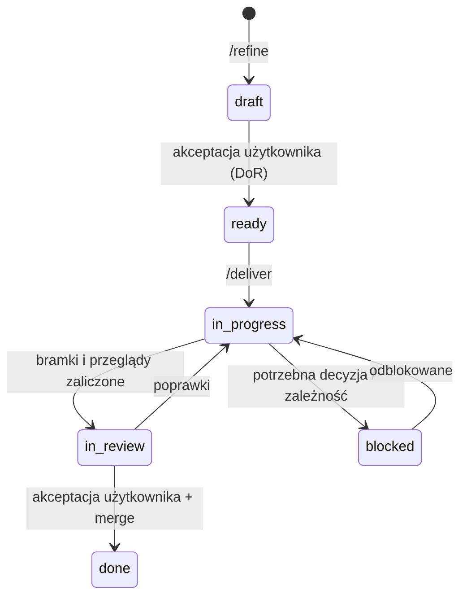
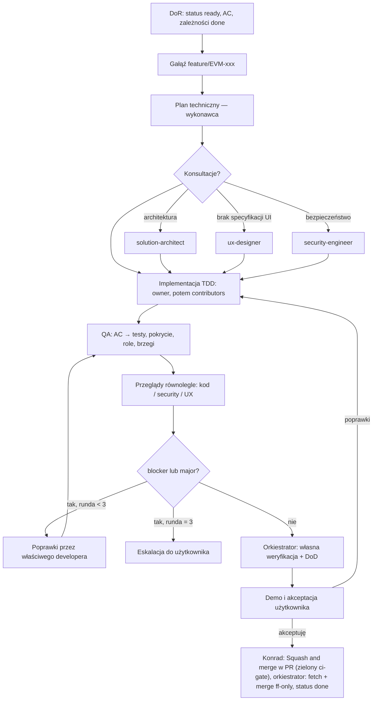

# Workflow pracy zespołu

## Zasady w skrócie
1. **Małe kroki:** pracujemy na historyjkach `EVM-###`, każda to pionowy przyrost z numerowanymi kryteriami akceptacji (AC).
2. **WIP:** jedna historyjka z kodem w toku naraz; prace koncepcyjne (dokumenty) mogą iść równolegle.
3. **Bramki:** DoR przed startem, automatyczne bramki CI, przeglądy, DoD, akceptacja użytkownika. Żadnej nie pomijamy.
4. **Człowiek decyduje:** Konrad akceptuje historyjki, ADR-y, przyrosty i wydania. Agenci przygotowują decyzje (warianty + rekomendacja).

## Hierarchia pracy
Kamień milowy `M#` → epik `E##` → historyjka `EVM-###` (story / enabler / spike / bug) → kroki w „Planie technicznym”.

## Cykl życia historyjki

Status trzymamy we frontmatter pliku historyjki (`docs/backlog/`) — to jedyne źródło prawdy; `/progress` liczy z niego postęp.

## Role (RACI)
| Czynność | Konrad | Orkiestrator | PO | Architekt | UX | Dev | QA | Security | DevOps | Reviewer |
|---|---|---|---|---|---|---|---|---|---|---|
| Historyjka i AC | **A** | R (koordynacja) | **R** | C | C | — | C | C | — | — |
| Decyzja architektoniczna (ADR) | **A** | C | C | **R** | C | C | C | C | C | — |
| Styleguide | **A** | C | C | C | **R** | C | — | — | — | — |
| Implementacja | I | A | — | C | C | **R** | — | C | C | — |
| Weryfikacja AC | I | A | C | — | — | — | **R** | — | — | — |
| Przeglądy | I | A | — | C | **R** (UI) | — | — | **R** | — | **R** |
| Akceptacja przyrostu | **A/R** | R (demo) | C | — | — | — | — | — | — | — |
| Wydanie produkcyjne | **A** | R | — | — | — | — | C | **R** (sign-off) | **R** | — |

R — wykonuje, A — zatwierdza, C — konsultowany, I — informowany.

## Cykl realizacji historyjki (`/deliver EVM-###`)

Środkową część (plan → poprawki) wykonuje deterministycznie workflow `.claude/workflows/deliver-story.js`; gotowość i demo prowadzi orkiestrator ze skilla `/deliver`. **Scalenie do `main` wykonuje Konrad** — „Squash and merge” w PR na GitHubie przy zielonym `ci-gate`, z tytułem PR w formacie Conventional Commit z ID (D2, EVM-006); orkiestrator wypycha gałąź za zgodą Konrada, a po scaleniu tylko `git fetch` + `git merge --ff-only origin/main` (`docs/process/conventions.md` → „Git”, `docs/ops/github-i-ci.md`).

### Kto przegląda
- `code-reviewer` — każda zmiana kodu.
- `security-engineer` — uwierzytelnianie, autoryzacja, dane osobowe, pliki i media, nowe endpointy, zależności, infrastruktura, dane na urządzeniu.
- `ux-designer` — każda zmiana UI.
- Dokumenty (ADR, styleguide, model zagrożeń) — recenzenci wskazani w historyjce (np. architekt + security dla stacku, web + mobile developer dla styleguide'u).

Recenzentów wpisuje `product-owner` we frontmatter (`reviewers`) podczas refinementu.

### Klasyfikacja ustaleń
- **blocker** — błąd, utrata danych, luka bezpieczeństwa (Critical/High), niespełnione AC, brak testów dla AC, widoczne złamanie styleguide'u. Naprawa obowiązkowa.
- **major** — istotne ryzyko (w tym security Medium), naprawa przed merge.
- **minor / nit** — do decyzji; trafiają do „Uwag do rozważenia” i ewentualnie do backlogu.

## Kiedy agent się zatrzymuje i eskaluje
- AC niejasne lub sprzeczne; potrzebna decyzja biznesowa.
- Zmiana wykracza poza historyjkę (nowy zakres → `/refine`).
- Potrzebna nowa zależność, usługa płatna, zmiana architektury lub kontraktu API (→ architekt / ADR).
- Kompromis bezpieczeństwa lub prywatności.
- Trzecia runda poprawek bez zielonych bramek.
Pytania zawsze z **rekomendowaną odpowiedzią** i konsekwencją wyboru.

## Delegowanie przez orkiestratora
Agenci nie widzą rozmowy. W poleceniu podawaj: ID i ścieżkę historyjki, gałąź, cel kroku, ograniczenia, wcześniejsze ustalenia i decyzje, oczekiwany raport. Niezależne zadania uruchamiaj równolegle; zadania zapisujące te same pliki — sekwencyjnie (albo w osobnych worktree).

## Modele i effort agentów
Model i głębokość rozumowania (`effort`) każdego agenta ustawia frontmatter w `.claude/agents/*.md`. Wartości są jawne (bez `inherit`), więc model i effort sesji orkiestratora nie przechodzą na agentów. Tabela opisuje frontmatter; zgodność obu sprawdza test w `tools/repo-policy` (EVM-074).

| Agent | Model | Effort | Dlaczego |
|---|---|---|---|
| `product-owner` | `sonnet` | `medium` | historyjki i backlog według szablonu |
| `ux-designer` | `sonnet` | `medium` | specyfikacje i makiety według styleguide'u |
| `backend-developer` · `web-developer` · `mobile-developer` · `devops-engineer` | `sonnet` | `medium` | implementacja w TDD; trudniejsza historyjka — `model: opus` w historyjce |
| `qa-engineer` | `sonnet` | `medium` | macierz AC → testy, uruchamianie testów |
| `code-reviewer` | `sonnet` | `high` | niezależny przegląd każdej zmiany |
| `solution-architect` | `opus` | `high` | ADR i architektura — rzadko, duży wpływ |
| `security-engineer` | `opus` | `high` | ocena ryzyka zmian wrażliwych |

- **Model realizacji historyjki** — pole `model` we frontmatter historyjki: `sonnet` albo `opus`; brak pola = modele z tabeli. `/deliver` przekazuje je do workflow `deliver-story`, a ten — tylko wykonawcom (plan, implementacja, poprawki); QA, przeglądy i konsultacje pracują na modelach z tabeli. `opus` proponuje `product-owner` w `/refine`, gdy historyjka wprowadza nowy moduł albo wzorzec architektoniczny, dotyczy uwierzytelniania, uprawnień, synchronizacji offline, migracji danych lub złożonej logiki domenowej, albo gdy realizacja na `sonnet` utknęła. Decyzję zatwierdza Konrad razem z AC.
- **Sesja orkiestratora** — model i effort wybiera Konrad w ustawieniach sesji Claude Code. Rekomendacja: `sonnet` dla `/deliver` i `/progress`; `opus` dla `/refine` złożonych historyjek, `/adr` i `/milestone`; effort `high`, a `max` tylko dla wyjątkowo trudnych problemów.
- **Doraźnie** — orkiestrator może wywołać agenta na innym modelu (parametr `model` narzędzia Agent), np. tańszy przegląd w lżejszej realizacji; zapisuje to w „Decyzjach” historyjki.
- **Zmiana modelu lub effortu agenta** — frontmatter i ta tabela w jednej zmianie.

## Raport agenta (format standardowy)
```
Wynik: DONE | DONE z uwagami | BLOCKED
Podsumowanie: 2–4 zdania
Zmiany: pliki dodane / zmienione
Kryteria akceptacji: AC → status → dowód (test / plik / zrzut)
Testy i jakość: uruchomione komendy, wyniki, pokrycie (globalne i zmienionego kodu)
Ryzyka / dług techniczny
Otwarte pytania do użytkownika: pytanie + rekomendacja + konsekwencja
Następne kroki
```

## Rytm kamienia milowego
`/milestone plan M#` → seria `/refine` i `/deliver` → pilot / UAT → `/milestone close M#` (sign-off, wydanie za zgodą, retrospektywa → poprawki w agentach i procesie).
