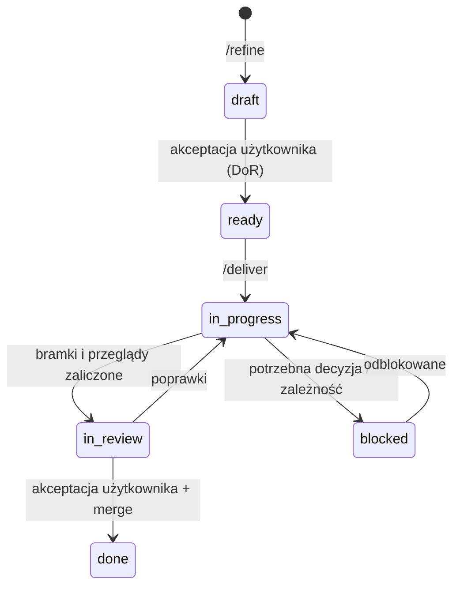
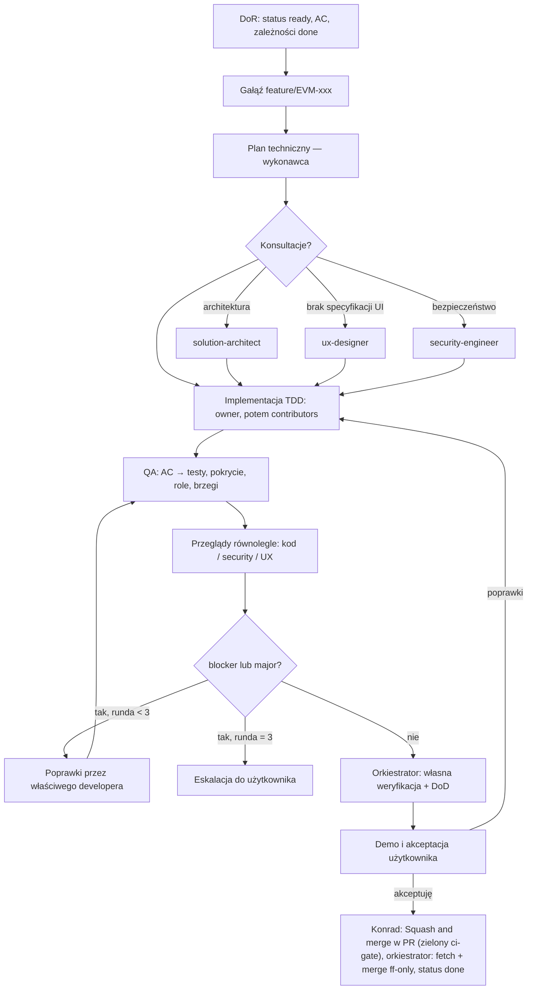

# Workflow pracy zespołu

## Zasady w skrócie
1. **Małe kroki:** pracujemy na historyjkach `EVM-###`, każda to pionowy przyrost z numerowanymi kryteriami akceptacji (AC).
2. **WIP:** jedna historyjka z kodem w toku naraz; prace koncepcyjne (dokumenty) mogą iść równolegle.
3. **Bramki:** DoR przed startem, automatyczne bramki CI, przeglądy, DoD, akceptacja użytkownika. Żadnej nie pomijamy.
4. **Człowiek decyduje:** Konrad akceptuje historyjki, ADR-y, przyrosty i wydania. Agenci przygotowują decyzje (warianty + rekomendacja).
5. **Proporcjonalność:** proces ma kosztować tyle, ile wynosi ryzyko — domyślnie ścieżka lekka, pełna tylko dla obszarów ryzyka („Ścieżki realizacji”); koszt mierzymy („Pomiar kosztu”).

## Hierarchia pracy
Kamień milowy `M#` → epik `E##` → historyjka `EVM-###` (story / enabler / spike / bug) → kroki w „Planie technicznym”.

## Cykl życia historyjki

Status trzymamy we frontmatter pliku historyjki (`docs/backlog/`) — to jedyne źródło prawdy; `/progress` liczy z niego postęp.

## Zespół agentów
| Agent | Kiedy |
|---|---|
| `product-owner` | pomysł → historyjka z AC, podział na małe przyrosty, priorytety, roadmapa, słownik domeny |
| `solution-architect` | wybór technologii (ADR), architektura, model danych, kontrakty API, offline-sync, media; przegląd planów zmieniających architekturę |
| `ux-designer` | styleguide i design tokens, przepływy i makiety, specyfikacja UI historyjek, przegląd UX/a11y |
| `backend-developer` | API, logika domenowa, baza i migracje, auth, pliki, zadania w tle (TDD) |
| `web-developer` | panel web wg styleguide'u, a11y, testy komponentów i E2E (TDD) |
| `mobile-developer` | aplikacja iOS/Android, offline-first, aparat, upload w tle (TDD) |
| `qa-engineer` | weryfikacja AC (macierz AC → testy), testy E2E / uprawnień / brzegowe, pokrycie |
| `security-engineer` | model zagrożeń, wymagania (ASVS L2, MASVS, RODO), przeglądy bezpieczeństwa, sign-off wydań |
| `devops-engineer` | repo, CI/CD i bramki, IaC, środowiska w UE, backupy, monitoring, dystrybucja aplikacji mobilnej |
| `code-reviewer` | niezależny przegląd kodu każdej zmiany (tylko raportuje) |

Główna sesja jest orkiestratorem (Tech Lead) i nie wykonuje pracy specjalistów; drobne zmiany (literówki, statusy, dziennik historyjki) może robić sama. Model i `effort` agentów: „Modele i effort agentów” poniżej.

## Role (RACI)
| Czynność | Konrad | Orkiestrator | PO | Architekt | UX | Dev | QA | Security | DevOps | Reviewer |
|---|---|---|---|---|---|---|---|---|---|---|
| Historyjka i AC | **A** | R (koordynacja) | **R** | C | C | — | C | C | — | — |
| Decyzja architektoniczna (ADR) | **A** | C | C | **R** | C | C | C | C | C | — |
| Styleguide | **A** | C | C | C | **R** | C | — | — | — | — |
| Implementacja | I | A | — | C | C | **R** | — | C | C | — |
| Weryfikacja AC | I | A | C | — | — | — | **R** | — | — | — |
| Przeglądy | I | A | — | C | **R** (UI) | — | — | **R** | — | **R** |
| Akceptacja przyrostu | **A/R** | R (demo) | C | — | — | — | — | — | — | — |
| Wydanie produkcyjne | **A** | R | — | — | — | — | C | **R** (sign-off) | **R** | — |

R — wykonuje, A — zatwierdza, C — konsultowany, I — informowany.

## Ścieżki realizacji
Ścieżkę wyznacza pole `path` we frontmatter historyjki: `product-owner` proponuje ją w `/refine`, a Konrad zatwierdza razem z AC. Brak pola = `pelna`; dla takiej historyjki `/deliver` proponuje ścieżkę z uzasadnieniem i po odpowiedzi Konrada zapisuje ją we frontmatter.

| | LEKKA (domyślna) | PEŁNA |
|---|---|---|
| Kiedy | wszystko, co nie należy do obszarów ryzyka | uwierzytelnianie, uprawnienia, dane osobowe, płatności, synchronizacja offline, migracje danych, infrastruktura produkcyjna |
| Wykonawca | `owner` w TDD (ewentualni `contributors` po kolei); plan tylko w głowie lub w `.scratch/` | `owner` i `contributors`; plan zapisany w `.scratch/` |
| Konsultacje | brak | architekt / UX / security wg potrzeby i ryzyka |
| QA | orkiestrator: macierz AC → testy, bramka lokalna, `npm run docs:check` | `qa-engineer` w każdej rundzie |
| Przegląd | jeden recenzent (zwykle `code-reviewer`) | recenzenci z `reviewers` |
| Poprawki | najwyżej 1 runda blocker/major, bez ponownego przeglądu; poprawki sprawdza orkiestrator | do 3 rund; ponownie przeglądają tylko recenzenci, którzy zgłosili blocker/major |
| Minor / nit | „Notatki” historyjki; nie wywołują poprawek ani przeglądu | jak w lekkiej |
| Rozmiar | ≤ 6 AC | ≤ 8 AC, ≤ 3 moduły |

- **Eskalacja ścieżki:** gdy w trakcie lekkiej wychodzi obszar ryzyka (np. dotyka danych osobowych), wykonawca zatrzymuje się, a orkiestrator pyta Konrada o zmianę na `pelna` (rekomendacja i konsekwencja kosztowa w pytaniu).
- **Konsultacje proporcjonalne do ryzyka:** konsultant dostaje wąskie pytanie o ryzyko, które faktycznie występuje w historyjce, i zwraca najwyżej kilka punktów. Konsultacja nie dodaje AC; ustalenia Low w narzędziach wewnętrznych (CI, walidatory, skrypty) trafiają do „Notatek”, a AC rozszerza tylko ustalenie Medium lub wyższe albo zmiana zakresu zatwierdzona przez Konrada. Historyjka, która po konsultacjach przekracza limit AC, jest dzielona.
- **Co zostaje poza plikiem historyjki:** plany, zapisy konsultacji i raporty agentów (raport QA zostaje w `docs/qa/<EVM-ID>/` tylko w ścieżce pełnej); „Dziennik” ma jedną linię na zdarzenie.

## Cykl realizacji historyjki (`/deliver EVM-###`)

Diagram pokazuje ścieżkę pełną; lekka pomija plan, konsultacje i agenta QA („Ścieżki realizacji”). Środkową część (plan → poprawki) wykonuje deterministycznie workflow `.claude/workflows/deliver-story.js`; gotowość i demo prowadzi orkiestrator ze skilla `/deliver`. **Scalenie do `main` wykonuje Konrad** — „Squash and merge” w PR na GitHubie przy zielonym `ci-gate`, z tytułem PR w formacie Conventional Commit z ID (D2, EVM-006); orkiestrator wypycha gałąź za zgodą Konrada, a po scaleniu tylko `git fetch` + `git merge --ff-only origin/main` (`docs/process/conventions.md` → „Git”, `docs/ops/github-i-ci.md`).

### Kto przegląda
Ścieżka lekka: jeden recenzent (zwykle `code-reviewer`). Ścieżka pełna:
- `code-reviewer` — każda zmiana kodu.
- `security-engineer` — uwierzytelnianie, autoryzacja, dane osobowe, pliki i media, nowe endpointy, zależności, infrastruktura, dane na urządzeniu.
- `ux-designer` — każda zmiana UI.
- Dokumenty (ADR, styleguide, model zagrożeń) — recenzenci wskazani w historyjce (np. architekt + security dla stacku, web + mobile developer dla styleguide'u).

Recenzentów wpisuje `product-owner` we frontmatter (`reviewers`) podczas refinementu.

### Klasyfikacja ustaleń
- **blocker** — błąd, utrata danych, luka bezpieczeństwa (Critical/High), niespełnione AC, brak testów dla AC, widoczne złamanie styleguide'u. Naprawa obowiązkowa.
- **major** — istotne ryzyko (w tym security Medium), naprawa przed merge.
- **minor / nit** — do decyzji; trafiają do „Notatek” historyjki i ewentualnie do backlogu; nie wywołują poprawek ani ponownego przeglądu.

## Kiedy agent się zatrzymuje i eskaluje
- AC niejasne lub sprzeczne; potrzebna decyzja biznesowa.
- Zmiana wykracza poza historyjkę (nowy zakres → `/refine`).
- Potrzebna nowa zależność, usługa płatna, zmiana architektury lub kontraktu API (→ architekt / ADR).
- Kompromis bezpieczeństwa lub prywatności.
- Trzecia runda poprawek bez zielonych bramek.
Pytania zawsze z **rekomendowaną odpowiedzią** i konsekwencją wyboru.

## Delegowanie przez orkiestratora
Agenci nie widzą rozmowy. W poleceniu podawaj: ID i ścieżkę historyjki, gałąź, cel kroku, ograniczenia, wcześniejsze ustalenia i decyzje, oczekiwany raport. Niezależne zadania uruchamiaj równolegle; zadania zapisujące te same pliki — sekwencyjnie (albo w osobnych worktree).

## Modele i effort agentów
Model i głębokość rozumowania (`effort`) każdego agenta ustawia frontmatter w `.claude/agents/*.md`. Wartości są jawne (bez `inherit`), więc model i effort sesji orkiestratora nie przechodzą na agentów. Tabela opisuje frontmatter; zgodność obu sprawdza test w `tools/repo-policy` (EVM-074).

| Agent | Model | Effort | Dlaczego |
|---|---|---|---|
| `product-owner` | `sonnet` | `medium` | historyjki i backlog według szablonu |
| `ux-designer` | `sonnet` | `medium` | specyfikacje i makiety według styleguide'u |
| `backend-developer` · `web-developer` · `mobile-developer` · `devops-engineer` | `sonnet` | `medium` | implementacja w TDD; trudniejsza historyjka — `model: opus` w historyjce |
| `qa-engineer` | `sonnet` | `medium` | macierz AC → testy, uruchamianie testów |
| `code-reviewer` | `sonnet` | `high` | niezależny przegląd każdej zmiany |
| `solution-architect` | `opus` | `high` | ADR i architektura — rzadko, duży wpływ |
| `security-engineer` | `opus` | `high` | ocena ryzyka zmian wrażliwych |

- **Model realizacji historyjki** — pole `model` we frontmatter historyjki: `sonnet` (domyślnie w szablonie) albo `opus`; brak pola = modele z tabeli. `/deliver` przekazuje je do workflow `deliver-story`:
  - dostają je wykonawcy — `owner`, `contributors` i poprawiający (plan, implementacja, poprawki), niezależnie od roli;
  - `opus` podnosi też przeglądy; `sonnet` ich nie obniża; QA i konsultacje zostają przy modelach z tabeli;
  - pole nie zmienia effortu — effort zawsze pochodzi z definicji agenta.
- **Kiedy `opus`** — proponuje go `product-owner` w `/refine`, gdy historyjka wprowadza nowy moduł albo wzorzec architektoniczny, dotyczy uwierzytelniania, uprawnień, synchronizacji offline, migracji danych lub złożonej logiki domenowej, albo gdy realizacja na `sonnet` utknęła; decyzję zatwierdza Konrad razem z AC. Gdy wśród wykonawców jest `solution-architect` albo `security-engineer`, pole ma wartość `opus` albo go nie ma — `sonnet` obniżyłby ich model (pilnuje tego test w `tools/repo-policy`).
- **Sesja orkiestratora** — model i effort wybiera Konrad w ustawieniach sesji Claude Code. Rekomendacja: `sonnet` dla `/deliver` i `/progress`; `opus` dla `/refine` złożonych historyjek, `/adr` i `/milestone`; effort `high`, a `max` tylko dla wyjątkowo trudnych problemów (w EVM-013 sam orkiestrator na `max` kosztował ok. $18 z $59).
- **Doraźnie** — orkiestrator może wywołać agenta na innym modelu (parametr `model` narzędzia Agent), np. tańszy przegląd w lżejszej realizacji; zapisuje to w „Decyzjach” historyjki.
- **Zmiana modelu lub effortu agenta** — frontmatter i ta tabela w jednej zmianie. Zmiennej `CLAUDE_CODE_SUBAGENT_MODEL` nie ustawiamy (w starszych wersjach Claude Code nadpisywała frontmatter); faktyczny model i effort uruchomionych agentów pokazuje `/tasks`.

## Raport agenta (format standardowy)
```
Wynik: DONE | DONE z uwagami | BLOCKED
Podsumowanie: 2–4 zdania
Zmiany: pliki dodane / zmienione
Kryteria akceptacji: AC → status → dowód (test / plik / zrzut)
Testy i jakość: uruchomione komendy, wyniki, pokrycie (globalne i zmienionego kodu)
Ryzyka / dług techniczny
Otwarte pytania do użytkownika: pytanie + rekomendacja + konsekwencja
Następne kroki
```

## Pomiar kosztu
Koszt historyjki mierzymy, żeby porównywać historyjki ze sobą i z punktem odniesienia.

- **Baseline — EVM-013** (ścieżka pełna w dawnym kształcie, 8 AC, plik historyjki ok. 85 KB): ok. $59 — orkiestrator (opus, effort max) ok. $18, implementacja (opus) ok. $15, plan ok. $7, przegląd security (sonnet) ok. $9, reszta konsultacje i QA. Ok. 95% kosztu to wczytywany kontekst (cache): agent pracuje na 200–270 tys. tokenów i robi 20–130 wywołań.
- **Cele (hipoteza, korekta po trzech pomiarach):** ścieżka lekka ≤ $12, pełna ≤ $30.
- **Wpis „Koszt” w „Dzienniku”** dopisuje orkiestrator w kroku demo (dane z `/cost` lub `/usage` i `/tasks`): `YYYY-MM-DD — Koszt: $X (orkiestrator $a, wykonawcy $b, przeglądy $c, reszta $d); wywołania agentów N; rundy poprawek R; ścieżka lekka|pelna; model; plik historyjki NN KB; vs baseline ±%`. Gdy rozbicia nie da się odczytać — podaj sumę i zaznacz brak rozbicia.
- **Porównujemy:** koszt łączny i na AC, liczbę wywołań, rozmiar kontekstu, rundy. Trzy kolejne historyjki ponad celem to powód do przeglądu procesu (retrospektywa `/milestone close` albo wcześniej decyzją Konrada).

## Rytm kamienia milowego
`/milestone plan M#` → seria `/refine` i `/deliver` → pilot / UAT → `/milestone close M#` (sign-off, wydanie za zgodą, retrospektywa → poprawki w agentach i procesie).
