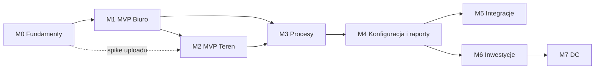

# Roadmapa EVia Manager

> Dokument żywy. Właściciel: `product-owner`, decyzje: Konrad. Szczegółowo planujemy tylko najbliższy kamień milowy (`/milestone plan M#`); dalsze są kierunkowe i korygujemy je po każdym zamknięciu (`/milestone close M#`).

## Zasady planowania
- **Now / Next / Later** — szczegóły tylko dla „Now”.
- Każdy kamień milowy kończy się **działającym, wdrożonym przyrostem**, demo i retrospektywą.
- **MVP = najmniejszy zakres, od którego firma realnie pracuje w systemie** zamiast arkuszy i komunikatorów; reszta powstaje równolegle z używaniem.
- **Najpierw ryzyko:** najtrudniejsze technicznie elementy (upload w tle bez zasięgu) sprawdzamy spike'iem już w M0, choć funkcja produkcyjna powstaje w M2.

## Przegląd
| Kamień | Nazwa | Wydanie | Efekt dla firmy | Horyzont |
|---|---|---|---|---|
| **M0** | Fundamenty | — | decyzje (stack, styleguide, bezpieczeństwo), CI, staging, szkielet aplikacji | Now |
| **M1** | **MVP „Biuro”** | 1.0 | wszystkie nowe zlecenia, etapy, płatności i dokumentacja w panelu web | Now |
| **M2** | **MVP „Teren”** | 1.1 | aplikacja mobilna: zdjęcia i filmy offline z automatycznym uploadem | Now / Next |
| M3 | Procesy | 1.2 | szablony procesów, terminy i przypomnienia, kontakty, dokumenty, pulpit | Next |
| M4 | Konfiguracja i raporty | 1.3 | konfiguracja bez programisty, rola Monter, raporty i eksport | Next |
| M5 | Integracje | 2.x | fakturowanie (KSeF), e-mail, kalendarz, formularz www, portal klienta | Later |
| M6 | Inwestycje deweloperskie | 2.x | zlecenia zbiorcze, operacje masowe, raporty dla dewelopera | Later |
| M7 | DC i duże projekty | 3.x | projekty stacji DC, UDT, harmonogramy, podwykonawcy, serwis | Later |

## M0 — Fundamenty (Now)
**Cel:** podjąć kluczowe decyzje i zbudować „chodzący szkielet”, żeby każda kolejna historyjka była małym pionowym przyrostem.

| ID | Pozycja | Wykonawca | Zależy od |
|---|---|---|---|
| EVM-001 | Architektura i stack technologiczny (ADR) | solution-architect | — |
| EVM-002 | Model domeny v1 i wytyczne API | solution-architect + product-owner | 001 |
| EVM-003 | Styleguide v1 i design tokens | ux-designer | — |
| EVM-004 | Przepływy UX i makiety MVP | ux-designer | 002, 003 |
| EVM-005 | Model zagrożeń v1, wymagania bezpieczeństwa, RODO | security-engineer | 001 |
| EVM-006 | Repozytorium, monorepo i CI z bramkami jakości | devops-engineer | 001 |
| EVM-007 | Staging w UE, wdrożenia, backupy, monitoring | devops-engineer | 006 |
| EVM-008 | Chodzący szkielet: API + panel web | backend-developer + web-developer | 003, 006, 007 |
| EVM-009 | Chodzący szkielet: aplikacja mobilna | mobile-developer | 003, 006, 008 |
| EVM-010 | Backlog M1 gotowy do realizacji | product-owner | 002, 004, 005 |
| EVM-011 | Spike: kolejka offline i upload w tle | mobile-developer | 001 |
| EVM-012 | Polityka cyklu życia dokumentacji + walidator | product-owner + devops-engineer | 001 |
| EVM-013 | Walidator dokumentacji jako bramka CI | devops-engineer | 006, 012 |
| EVM-074 | Model i effort agentów, model realizacji historyjki | devops-engineer | — |

**Kryteria wyjścia:** ADR-y stacku i hostingu zaakceptowane; styleguide v1 zaakceptowany; model zagrożeń i wymagania bezpieczeństwa opisane; CI z bramkami (lint, typy, testy, pokrycie, skany) blokuje merge; szkielet web + API wdrożony automatycznie na staging; szkielet mobile instalowalny na telefonach testowych z Androidem; spike potwierdza wykonalność uploadu w tle na Androidzie (iOS odłożony — ADR-0015); historyjki M1 w statusie `ready`.

## M1 — MVP „Biuro” (wydanie 1.0)
**Cel:** firma prowadzi wszystkie nowe zlecenia w panelu web. Telefon może tymczasowo dodawać zdjęcia przez przeglądarkę (online).

| Epik | Zakres |
|---|---|
| E1 Dostęp i użytkownicy | logowanie, reset hasła, MFA (obowiązkowe dla Administratora), zaproszenia i dezaktywacja kont, role Administrator / Edytor / Tylko odczyt, ochrona przed brute force, dziennik audytu |
| E2 Klienci | osoba / firma, dane kontaktowe, wyszukiwanie (polskie znaki), historia zleceń klienta |
| E3 Zlecenia — rdzeń | tworzenie z szablonu, lokalizacja (adres, typ obiektu, zarządca, OSD), zakres z katalogu (edytowalny), podstawowe parametry techniczne, status cyklu życia, opiekun, lista z filtrami, widok szczegółów |
| E4 Procesy i etapy | etapy z szablonów, statusy (w tym „czekamy na…”), daty, odpowiedzialny; lista „czekamy na OSD / administrację dłużej niż X dni” |
| E5 Dziennik i komentarze | wpisy (rozmowy, ustalenia), komentarze, automatyczna historia zmian |
| E6 Dokumenty i media (web) | upload zdjęć, filmów i PDF, galeria z miniaturami, kategorie, podgląd i pobieranie, bezpieczne linki, przypisanie do etapu |
| E7 Płatności etapowe | etapy płatności (kwota, nr faktury, termin, status), zestawienie nieopłaconych i po terminie |
| E8 Gotowość produkcyjna | import istniejących danych (CSV/Excel, jeśli potrzebny), test odtworzenia backupu, monitoring i alerty, security sign-off z DAST, dokumentacja RODO, krótka instrukcja, wdrożenie produkcyjne |

**Plan szczegółowy:** [`docs/backlog/M1/README.md`](../backlog/M1/README.md) — 59 historyjek EVM-014 … EVM-072 (EVM-010, `/milestone plan M1`; zmiany w tej sekcji **zaakceptowane przez Konrada 2026-10-03** — decyzja 13 w planie). Kolejność w fazach:

0. przygotowanie — styleguide 1.2.0, makiety ekranów „bez makiety”, ADR modelu odczytu listy (równolegle z EVM-006–EVM-008);
1. przyrost pionowy — logowanie → lista zleceń → utworzenie zlecenia → szczegóły;
2. konta i bezpieczeństwo dostępu (E1);
3. prowadzenie zlecenia (E3, E4, E5, E2) → **pilot próbny**;
4. dokumenty i media (E6);
5. gotowość do realnych danych (E8: produkcja, test odtworzenia, RODO z DPIA, instrukcja w panelu, pentest i sign-off) → **pilot realny**;
6. płatności (E7) i sign-off → **wydanie 1.0**;
7. pozycje P2 (jeśli nie opóźniają 1.0).

**Pilot wewnętrzny** (rekomendacja — decyzja 4 w planie): **pilot próbny** po E1–E5 na staging, wyłącznie na danych syntetycznych (zakaz wpisywania realnych zleceń); **pilot realny** na produkcji po E6 i części E8 z zewnętrznym pentestem i security sign-off (RR-10) — wybrane zlecenia, równolegle z dotychczasowymi narzędziami; płatności (E7) dochodzą w trakcie pilota, a zlecenia założone przed nimi dostają transze ręcznie; każde wdrożenie prod w trakcie pilota przechodzi bramkę bezpieczeństwa i wymaga zatwierdzenia wersji przez Konrada; telefon to panel w przeglądarce (zdjęcia z galerii, zasady pracy na prywatnym telefonie w instrukcji — decyzje 18 i 19 w planie).

**Uwagi do E8** (decyzje w planie): plan GitHub (Pro albo Free z kontrolami kompensującymi — decyzja przed planem EVM-007, wpływa na wdrożenia staging i prod oraz test odtworzenia); pentest zewnętrzny przed pilotem realnym — zakup za osobną zgodą; uproszczona DPIA i ocena transferów do USA przed pilotem realnym; import danych z CSV / Excel — rekomendacja: nie w M1 (świadome przesunięcie).
**Kryteria wyjścia:** historyjki P1 `done`; UAT — Konrad (i min. 1 osoba z biura) prowadzi w systemie po jednym realnym zleceniu ze scenariuszy A–D (`domain.md`) bez obejść; security sign-off (brak otwartych Critical/High/Medium, MFA, czysty DAST baseline); backup odtworzony testowo; progi pokrycia spełnione; E2E dla kluczowych ścieżek.

## M2 — MVP „Teren”: aplikacja mobilna (wydanie 1.1)
**Cel:** technik dokumentuje zlecenie zdjęciami, filmami i wpisami także bez zasięgu; wszystko trafia automatycznie do archiwum zlecenia. Start równolegle z drugą połową M1, gdy API zleceń i mediów (E3, E6) jest stabilne.

> **iOS odłożony (decyzja Konrada 2026-10-03, ADR-0015):** pilotaż aplikacji mobilnej tylko na Androidzie — bez buildów iOS i testów iOS. Kod pozostaje zgodny z iOS (Expo). Decyzja o iOS (testy uploadu w tle na iPhonie, dystrybucja) zapada przed planowaniem wydania iOS; konto Apple Developer jest niepotrzebne do tego czasu.

| Epik | Zakres |
|---|---|
| E9 Dostęp mobilny | te same konta i MFA, bezpieczne przechowywanie sesji, zdalne wylogowanie urządzenia, opcjonalnie biometria |
| E10 Zlecenia offline | lista i szczegóły zleceń (wg uprawnień) dostępne bez sieci, wyszukiwanie |
| E11 Zdjęcia i filmy | aparat w aplikacji, kategoria i opis, trwała kolejka, automatyczny wznawialny upload w tle, opcja „filmy tylko przez Wi-Fi”, status każdego pliku, brak duplikatów |
| E12 Wpisy offline | wpisy i komentarze bez zasięgu z późniejszą synchronizacją |
| E13 Nowe zlecenie z telefonu | szybkie zlecenie (klient + adres + szablon) uzupełniane potem w biurze |
| E14 Dystrybucja i utrzymanie | kanał dystrybucji wewnętrznej Android (iOS odłożony — patrz adnotacja wyżej), wymuszanie minimalnej wersji, raportowanie błędów bez danych osobowych, opcjonalnie push |

**Kryteria wyjścia:** **test terenowy** — w garażu podziemnym bez zasięgu technik wykonuje min. 30 zdjęć i 3 filmy oraz dodaje 2 wpisy; po wyjściu na zasięg wszystko trafia do właściwego zlecenia automatycznie, bez duplikatów i strat, także po wymuszonym zamknięciu aplikacji w trakcie uploadu; weryfikacja MASVS i security sign-off; aplikacja zainstalowana na telefonach firmowych z Androidem (pilotaż; iOS po osobnej decyzji).

## Next
- **M3 Procesy:** szablony procesów z checklistami wymaganych dokumentów (OSD, administracja, ekspertyza, ppoż, projekt), terminy i przypomnienia (np. brak odpowiedzi administracji > 14 dni), widok „Moje zadania”, książka kontaktów (administracje, projektanci, rzeczoznawcy, OSD), wersjonowanie dokumentów, generowanie pism z szablonów (np. pełnomocnictwo, wnioski), powiadomienia e-mail/push, pulpit (lejek zleceń, czas w etapach, nieopłacone).
- **M4 Konfiguracja i raporty:** panel administracyjny katalogu usług, szablonów, procesów, statusów i pól dodatkowych; rola „Monter” (tylko przypisane zlecenia) i dostęp partnerów; raporty i eksport (CSV/XLSX), KPI; wyszukiwanie pełnotekstowe; polityki retencji i archiwizacji.

## Later
- **M5 Integracje:** system fakturowy z KSeF (automatyczny status płatności), e-mail (wysyłka z szablonów, archiwum korespondencji), kalendarz montaży, formularz ze strony www → nowe zapytanie, portal klienta (status, przesyłanie dokumentów, akceptacje).
- **M6 Inwestycje deweloperskie:** inwestycja → budynki / garaże → miejsca postojowe; zlecenia zbiorcze, operacje masowe, harmonogram, raport postępu dla dewelopera; rozliczenia deweloper vs mieszkańcy.
- **M7 DC i duże projekty:** projekty stacji DC (przyłącze dużej mocy, UDT, harmonogram, podwykonawcy, materiały, budżet), serwis i przeglądy okresowe, ewentualnie integracja z monitoringiem ładowarek (OCPP).

## Ryzyka
| Ryzyko | Mitygacja |
|---|---|
| Zbyt sztywny albo zbyt luźny model zleceń | kompozycja (katalog + szablony + etapy), walidacja na scenariuszach A–F w EVM-002 |
| Ograniczenia uploadu w tle (zwłaszcza iOS) | spike EVM-011 (Android) przed wyborem ostatecznego podejścia, test terenowy w M2; iOS odłożony (ADR-0015) — weryfikacja uploadu w tle na iOS przed planowaniem wydania iOS |
| Wyciek danych klientów (RODO) | ASVS L2, model zagrożeń, przegląd bezpieczeństwa w każdej historyjce, MFA, audyt |
| Wąskie gardło akceptacji (jedna osoba) | małe przyrosty, zwięzłe demo, pytania z rekomendowaną odpowiedzią, grupowanie decyzji |
| Rozjazd ze styleguide'em | tokeny jako kod, reguły lint, przegląd UX jako bramka |
| Koszty storage'u mediów | kompresja, cykl życia plików (tańsze klasy storage'u), alerty budżetowe |
| Przeinżynierowanie przez agentów | YAGNI, ADR dla nowych zależności, code review |
| Utrata kontekstu między sesjami | dokumentacja w repo, dziennik w historyjkach, ADR-y, `CLAUDE.md` |

## Czego potrzebujemy od Ciebie (wejścia do M0)
1. Materiały marki: logo, kolory, fonty lub adres strony www (EVM-003).
2. Telefony: iOS / Android, modele, czy firmowe czy prywatne (EVM-001, EVM-009). _Ustalone: flota mieszana; pilotaż tylko na Androidzie, iOS odłożony (ADR-0015) — potrzebne konto Google Play; konto Apple Developer dopiero po decyzji o iOS._
3. Liczba użytkowników teraz i za rok; kto z czego korzysta.
4. Obecne narzędzia i dane do ewentualnej migracji (Excel, dysk, komunikatory).
5. Hosting: preferencje, miesięczny budżet, domena (EVM-001, EVM-007).
6. Repozytorium: GitHub (konto / organizacja) lub inne (EVM-006).
7. System fakturowy (pod przyszłą integrację) i wymagany okres przechowywania dokumentacji.
8. Czy w przyszłości dostęp mają mieć klienci lub partnerzy zewnętrzni (wpływa na model uprawnień).

## Plan działań — najbliższe kroki
1. Przegląd tego planu, agentów i workflow; poprawki przez rozmowę z orkiestratorem.
2. Restart Claude Code (załadowanie agentów), potem `/progress`.
3. Równolegle (prace koncepcyjne): `/deliver EVM-001` (stack) i `/deliver EVM-003` (styleguide).
4. Po akceptacji ADR stacku: EVM-002, EVM-005, EVM-006, EVM-011 → EVM-007 → EVM-008 → EVM-009; EVM-004 po 002 i 003.
5. EVM-010 (`/milestone plan M1`) → `/milestone close M0` → start M1.
6. Decyzje do planu M1 ([`docs/backlog/M1/README.md`](../backlog/M1/README.md) → „Decyzje dla Konrada”): najpierw 1 (Scaleway), 2 (domena) i 5 (plan GitHub) — przed planem EVM-007; z akceptacją planu — 4, 8, 10–13, 17.
7. Faza 0 M1 (EVM-014, EVM-015, EVM-071, EVM-069) równolegle z dokończeniem EVM-006–EVM-008; potem przyrost pionowy od EVM-016.
