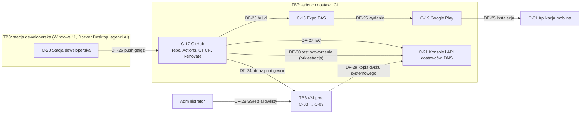

# Model zagrożeń EVia Manager — v1

> Dokument żywy (EVM-005). Właściciel: `security-engineer`. Wersja **v1 (M0), 2026-10-03** — ryzyka rezydualne i polityki **zaakceptowane przez Konrada 2026-10-03** na demo EVM-005. Wejścia: C4 L2, mapa modułów i ADR-0001…0015 ([`../architecture/README.md`](../architecture/README.md)), model domeny z EVM-002 ([`../architecture/domain-model.md`](../architecture/domain-model.md), [`../architecture/offline-sync.md`](../architecture/offline-sync.md), [`../architecture/api-guidelines.md`](../architecture/api-guidelines.md)). Wymagania `SR-…`: [`requirements.md`](requirements.md); polityki P1–P12: [`policies.md`](policies.md); RODO: [`rodo.md`](rodo.md); baseline: [`README.md`](README.md).

## Spis treści
1. [Zakres i metoda](#1-zakres-i-metoda)
2. [Aktywa](#2-aktywa)
3. [Aktorzy zagrożeń](#3-aktorzy-zagrożeń)
4. [Granice, elementy i przepływy](#4-granice-elementy-i-przepływy)
5. [Analiza STRIDE](#5-analiza-stride)
6. [Przypadki nadużyć](#6-przypadki-nadużyć)
7. [Podsumowanie ryzyka](#7-podsumowanie-ryzyka)
8. [Ryzyka rezydualne do akceptacji (AC6)](#8-ryzyka-rezydualne-do-akceptacji-ac6)
9. [Aktualizacja modelu](#9-aktualizacja-modelu)
10. [Źródła](#10-źródła)

## 1. Zakres i metoda
- **Zakres v1:** cały system z C4 L2 (panel web, aplikacja mobilna Android — iOS odłożony wg ADR-0015, API, worker, baza, przetwarzanie mediów, dostawcy) oraz łańcuch dostaw i stacja deweloperska z agentami AI. Poza zakresem: integracje M5+ (tylko zasady — AB-12), komputery biura i telefony jako całe urządzenia (tylko wymagania wobec nich — P7, `rodo.md`).
- **Metoda:** STRIDE (S — podszycie, T — modyfikacja, R — wyparcie się, I — ujawnienie informacji, D — odmowa usługi, E — podniesienie uprawnień) dla **każdego elementu i każdego przepływu** z C4 L2 (identyfikatory 1:1 z diagramu) oraz elementów i przepływów spoza diagramu (Pwned Passwords, Let's Encrypt, łańcuch dostaw, stacja deweloperska). Do tego przypadki nadużyć `AB-xx` — scenariusze z perspektywy napastnika, które przecinają kilka elementów.
- **Ryzyko bazowe** = przed wdrożeniem mitygacji z kolumny „Mitygacje”; **ryzyko rezydualne** = po wdrożeniu mitygacji i rekomendacji z [`policies.md`](policies.md). Mitygacje to decyzje z ADR i wymagania `SR-…` z [`requirements.md`](requirements.md) (każde ma moduł, epik i sposób weryfikacji).

**Skala ryzyka 3 × 3**
| Wartość | Prawdopodobieństwo (P) w ciągu roku | Wpływ (W) |
|---|---|---|
| 1 | mało prawdopodobne — wymaga kilku warunków naraz lub ukierunkowanego ataku z dużym nakładem | ograniczony — pojedyncze rekordy bez danych wrażliwych, przestój < 1 h, łatwo odwracalne |
| 2 | możliwe — znany wzorzec ataku lub zdarzenie spotykane w małych firmach | znaczący — dane osobowe wielu osób lub dokumenty, naruszenie do zgłoszenia UODO, przestój do 1 dnia, utrata części danych z terenu |
| 3 | prawdopodobne — ataki masowe i automatyczne albo częste zdarzenia (np. zgubiony telefon) | poważny — masowy wyciek archiwum lub dokumentów `identity_data`, przejęcie systemu albo kont administracyjnych, trwała utrata danych, przestój > 1 dnia |

| Wynik P × W | Ocena | Klasyfikacja ustalenia w przeglądzie |
|---|---|---|
| 1–2 | **Low** | minor (backlog) |
| 3–4 | **Medium** | major (naprawa przed wydaniem albo ryzyko zaakceptowane przez Konrada i zapisane) |
| 6 | **High** | blocker |
| 9 | **Critical** | blocker |

## 2. Aktywa
Klasy danych z klasyfikacji EVM-002 ([`domain-model.md` → „Klasyfikacja danych”](../architecture/domain-model.md#klasyfikacja-danych)) oraz aktywa niebędące danymi.

| ID | Aktywo | Klasa | Gdzie | Dlaczego ważne |
|---|---|---|---|---|
| A-01 | Dane osobowe klientów (imię i nazwisko, telefon, e-mail, adres, PPE, miejsce postojowe, notatki) | DO-K | baza, telefon (projekcja), backupy | RODO; zaufanie klientów |
| A-02 | Dane osób trzecich (osoby kontaktowe stron, osoby i tablice rejestracyjne na zdjęciach) | DO-3 | baza, media | RODO; brak relacji umownej |
| A-03 | Dane pracowników (konta, sesje, IP, urządzenia, przypisania, autorstwo) | DO-P | baza, audyt, logi | RODO; BYOD |
| A-04 | Media i dokumenty — oryginały zdjęć i filmów (wnętrza posesji, garaże), dokumenty `identity_data` (PESEL, nr dowodu, podpis), `building_security` (projekty, ekspertyzy, opinie ppoż) | DO-K, DO-3, WF | Scaleway, Storage Box, telefon (oczekujące) | największy wolumen danych osobowych; bezpieczeństwo budynków |
| A-05 | Dane wrażliwe dla firmy (płatności, zakres i parametry, statusy, katalog) | WF, KONF | baza | rozliczenia, konkurencja |
| A-06 | Konta i sesje (hasła, sekrety TOTP, passkeys, kody odzyskiwania, tokeny) | SEK | baza (skróty, szyfrowane), Keystore | przejęcie konta = dostęp do wszystkiego w roli |
| A-07 | Klucze i sekrety infrastruktury (LUKS, pgBackRest, `rclone crypt`, `platform/crypto`, klucze S3, klucz uploadu aplikacji, SSH, tokeny CI i dostawców) | SEK | VM, sekrety CI, EAS, menedżer sekretów | jeden klucz = dostęp do całej klasy danych |
| A-08 | Kopie zapasowe (PITR bazy, kopia mediów) | wszystkie | Scaleway (object lock), Storage Box | odtworzenie po ransomware |
| A-09 | Dostępność i „nic nie ginie” (praca biura, kolejka offline) | — | VM, telefony | ciągłość pracy, dane z terenu |
| A-10 | Integralność audytu, płatności i statusów | WF, DO-P | baza | rozliczalność, oszustwa |
| A-11 | Kod, obrazy, aplikacja mobilna i łańcuch dostaw | WEW | GitHub, GHCR, EAS, Google Play | złośliwa wersja = dostęp do wszystkich danych |
| A-12 | Domena, DNS i certyfikaty | WEW | rejestrator, Let's Encrypt | podszycie pod panel, przechwycenie poczty |

## 3. Aktorzy zagrożeń
| ID | Aktor | Motywacja i możliwości |
|---|---|---|
| TA-1 | Napastnik zewnętrzny, w tym phishing | masowe ataki na logowanie (credential stuffing), skanowanie podatności, phishing pracowników (fałszywe zaproszenia, strony logowania, przechwycenie TOTP w czasie rzeczywistym) |
| TA-2 | Złodziej lub znalazca telefonu | dostęp fizyczny do telefonu (często po pierwszym odblokowaniu), czasem znajomość PIN-u podpatrzonego przez ramię |
| TA-3 | Były pracownik | zna system i procesy; może mieć aktywną sesję, telefon z danymi, zapisane hasło lub kopie plików |
| TA-4 | Insider z rolą Edytor albo Tylko odczyt | legalny dostęp; ciekawość, sprzedaż danych, zemsta; masowe przeglądanie i pobieranie |
| TA-5 | Skompromitowany dostawca lub zależność | złośliwy pakiet npm, przejęta akcja GitHub lub narzędzie CI (wzorzec CVE-2026-33634 — Trivy, marzec 2026), obraz kontenera, dostęp dostawcy chmury lub organów państwa (CLOUD Act) |
| TA-6 | Nadawca złośliwego pliku | klient lub strona przekazuje plik (e-mail → biuro → upload), plik z telefonu z zainfekowanym systemem; exploit w parserze obrazów, wideo, PDF, Office |
| TA-7 | Przejęta stacja deweloperska albo agent AI w trybie bypass | dostęp do kodu, tokenów CLI (GitHub, EAS), Dockera; może wypchnąć złośliwy kod lub wysłać sekrety na zewnątrz |

## 4. Granice, elementy i przepływy
Elementy `C-01…C-14` i przepływy `DF-01…DF-19` odpowiadają 1:1 węzłom i krawędziom C4 L2 ([`../architecture/README.md` → „C4 — poziom 2”](../architecture/README.md#c4--poziom-2-kontenery-granice-zaufania-i-przepływy-danych)). `C-15…C-21` i `DF-20…DF-30` uzupełniają diagram o C4 L1 (Pwned Passwords), certyfikaty, łańcuch dostaw (TB7), stację deweloperską (TB8) i test odtworzenia kopii.

**Granice zaufania**
| ID | Granica | Źródło |
|---|---|---|
| TB1 | Urządzenie mobilne (niezaufane) | C4 L2 |
| TB2 | Przeglądarka (niezaufana) | C4 L2 |
| TB3 | VM prod Hetzner — sieć wewnętrzna Docker, firewall 80/443 | C4 L2 |
| TB4 | Piaskownica bez sieci (`media-processor`, `clamd`) | C4 L2 |
| TB5 | Dostawcy zewnętrzni z UE (Scaleway, Hetzner Storage Box) | C4 L2 |
| TB6 | Dostawcy spoza UE z regionem UE (Sentry, Grafana) oraz usługi spoza UE bez danych osobowych (Pwned Passwords, Let's Encrypt) | C4 L2, C4 L1 |
| TB7 | Łańcuch dostaw i CI — GitHub (repozytorium, Actions, GHCR, Renovate), Expo EAS, Google Play, konsole i API dostawców (ADR-0012) | ten dokument |
| TB8 | Stacja deweloperska z agentami AI — Windows 11, Docker Desktop, Claude Code (ADR-0015) | ten dokument |

**Elementy**
| ID | Element (węzeł C4) | Granica | Dane | Decyzje |
|---|---|---|---|---|
| C-01 | Aplikacja mobilna (`mobile`) — Expo/React Native, baza SQLCipher, kolejka mutacji i uploadu | TB1 | projekcja DO-K, DO-3, DO-P; media oczekujące; refresh token | ADR-0005, 0007, 0008 |
| C-02 | Panel web SPA (`spa`) — React + Vite | TB2 | wszystkie klasy wg roli | ADR-0005, 0006 |
| C-03 | Reverse proxy Caddy (`proxy`) | TB3 | ruch TLS, logi dostępowe (IP) | ADR-0011 |
| C-04 | API NestJS (`api`) — uwierzytelnianie, autoryzacja, audyt | TB3 | wszystkie | ADR-0001, 0002, 0004, 0005 |
| C-05 | Worker pg-boss (`worker`) | TB3 | identyfikatory zadań, pliki w obróbce, e-maile | ADR-0009, 0010 |
| C-06 | PostgreSQL 18 na wolumenie LUKS (`db`) | TB3 | wszystkie dane, audyt, kolejka, dziennik zmian | ADR-0003 |
| C-07 | freshclam (`fresh`) | TB3 | sygnatury AV | ADR-0009 |
| C-08 | media-processor (`proc`) — sharp + ffmpeg | TB4 | pliki w obróbce | ADR-0009 |
| C-09 | clamd ClamAV (`clamd`) | TB4 | pliki w skanie | ADR-0009 |
| C-10 | Scaleway Object Storage `pl-waw` (`s3`) | TB5 | media, dokumenty, kopie bazy | ADR-0009, 0011 |
| C-11 | Scaleway TEM (`tem`) | TB5 | e-maile do pracowników | ADR-0005, 0011 |
| C-12 | Hetzner Storage Box FI (`box`) | TB5 | kopia mediów (szyfrogram) | ADR-0009, 0011 |
| C-13 | Sentry UE (`sentry`) | TB6 | telemetria po redakcji | ADR-0013 |
| C-14 | Grafana Cloud UE (`grafana`) | TB6 | logi i metryki po redakcji | ADR-0013 |
| C-15 | Pwned Passwords (C4 L1) | TB6 | 5 znaków skrótu SHA-1 hasła | ADR-0005 |
| C-16 | Let's Encrypt (ACME) | TB6 | nazwy domen | ADR-0011 |
| C-17 | GitHub — repozytorium, Actions, GHCR, Renovate | TB7 | kod, dane syntetyczne, sekrety CI | ADR-0012 |
| C-18 | Expo EAS (Build, Submit) | TB7 | kod mobilny, klucz uploadu | ADR-0007, 0012 |
| C-19 | Google Play (ścieżka testów wewnętrznych, Play App Signing) | TB7 | aplikacja, e-maile testerów | ADR-0007, 0012 |
| C-20 | Stacja deweloperska Konrada z agentami AI | TB8 | kod, syntetyczne sekrety dev, tokeny CLI | ADR-0015 |
| C-21 | Konsole i API dostawców (Hetzner, Scaleway), DNS i rejestrator, stan OpenTofu | TB7 | konfiguracja infrastruktury, kopie dysku systemowego VM | ADR-0011 |

**Przepływy**
| ID | Z → do (krawędź C4) | Dane | Ochrona | Decyzje |
|---|---|---|---|---|
| DF-01 | `spa` → `proxy`: HTTPS `/api`, ciasteczko sesji | DO | TLS, `__Host-` cookie, CSRF | ADR-0005, 0006 |
| DF-02 | `mobile` → `proxy`: HTTPS `/api`, token, mutacje i kursory | DO | TLS, token nieprzezroczysty, idempotencja | ADR-0005, 0008 |
| DF-03 | `proxy` → `api` | DO | sieć wewnętrzna Docker | ADR-0011 |
| DF-04 | `api` → `db`: SQL, rola `evia_app` | DO | sieć wewnętrzna, role bazy | ADR-0003 |
| DF-05 | `worker` → `db`: zadania z samymi ID | DO (ID) | jak wyżej | ADR-0010 |
| DF-06 | `api` → `s3`: multipart create/complete, podpisy | metadane | TLS, klucz API | ADR-0009 |
| DF-07 | `mobile` → `s3`: `PUT` części, `GET` podpisane URL-e | M | TLS, URL części 60 min | ADR-0009 |
| DF-08 | `spa` → `s3`: `PUT` części, `GET` podpisane URL-e | M | TLS, URL pobrania ≤ 5 min | ADR-0009 |
| DF-09 | `worker` → `s3`: oryginał do skanu, zapis pochodnych | M | TLS, klucz workera | ADR-0009 |
| DF-10 | `worker` → `proc`: plik przez gniazdo Unix | M | gniazdo, wolumen współdzielony | ADR-0009 |
| DF-11 | `worker` → `clamd`: INSTREAM przez gniazdo Unix | M | gniazdo | ADR-0009 |
| DF-12 | `fresh` → `clamd`: sygnatury, wolumen tylko do odczytu | sygnatury | wolumen `:ro` | ADR-0009 |
| DF-13 | `worker` → `tem`: e-mail | DO-P | TLS | ADR-0005 |
| DF-14 | `db` → `s3`: pgBackRest WAL i backupy, szyfrowane | DO | szyfrowanie pgBackRest + SSE, object lock | ADR-0003, 0011 |
| DF-15 | `worker` → `box`: `rclone sync` nocą, szyfrowane | M | `rclone crypt`, SFTP | ADR-0009, 0011 |
| DF-16 | `api` → `sentry`: błędy | T | TLS, scrubbing | ADR-0013 |
| DF-17 | `mobile` → `sentry`: błędy | T | TLS, scrubbing | ADR-0013 |
| DF-18 | `spa` → `sentry`: błędy | T | TLS, scrubbing | ADR-0013 |
| DF-19 | `worker` → `grafana`: logi i metryki przez Alloy | T | TLS, redakcja | ADR-0013 |
| DF-20 | `api` → Pwned Passwords | prefiks skrótu | TLS, k-anonimowość | ADR-0005 |
| DF-21 | `proxy` ↔ Let's Encrypt (ACME) | nazwy domen | ACME | ADR-0011 |
| DF-22 | `fresh` → mirrory ClamAV | sygnatury | TLS, podpis CVD | ADR-0009 |
| DF-23 | `tem` → skrzynki pracowników (zaproszenia, reset, alerty) | DO-P, linki | TLS, SPF/DKIM/DMARC | ADR-0005 |
| DF-24 | GitHub Actions → GHCR → VM (wdrożenie staging i prod) | obrazy, digesty, poświadczenia kanału wdrożenia, sekrety środowisk | digest, środowiska ograniczone do `main`, kanał wg SR-INFRA-14 (pull albo SSH z regułą tymczasową — otwarta decyzja EVM-007) | ADR-0011, 0012 |
| DF-25 | GitHub → EAS → Google Play → telefony | aplikacja, klucze podpisu | Play App Signing, MFA | ADR-0007, 0012 |
| DF-26 | Stacja deweloperska → GitHub (push gałęzi, PR) | kod | ruleset `main`, gitleaks | ADR-0012, 0015 |
| DF-27 | CI (OpenTofu) → API dostawców | konfiguracja, tokeny IaC | sekrety CI, szyfrowany stan | ADR-0011 |
| DF-28 | Administrator → VM (SSH, tunel do bazy) | dostęp administracyjny | allowlista IP, klucze | ADR-0003, 0011 |
| DF-29 | VM → Hetzner Backups (dysk systemowy) | system, konfiguracja, plik klucza LUKS | u dostawcy VM | ADR-0003, 0011 |
| DF-30 | GitHub Actions (test odtworzenia: harmonogram i przed wydaniem) → API Hetzner → tymczasowa VM w projekcie prod → kopie bazy, rejestr usunięć i próbka kopii mediów (odczyt) | sekrety odczytu kopii; dane prod wyłącznie na tymczasowej VM, do CI tylko wynik bez danych | środowisko ograniczone do `main`, klucze tylko do odczytu, VM bez portów przychodzących i usuwana po teście (SR-INFRA-07, RR-20) | ADR-0003, 0011, 0012 |

## 5. Analiza STRIDE
Kolumny: P, W — ryzyko bazowe; „Rezyd.” — ryzyko rezydualne po mitygacjach (P × W = wynik, ocena); `RR` — ryzyko rezydualne do akceptacji w [rozdziale 8](#8-ryzyka-rezydualne-do-akceptacji-ac6).

| TM | Element / przepływ | STRIDE | Zagrożenie | P | W | Ryzyko | Mitygacje (ADR · SR) | Rezyd. | RR |
|---|---|---|---|---|---|---|---|---|---|
| TM-01 | C-01 | I | Kradzież lub zgubienie telefonu: odczyt bazy offline, miniatur i mediów oczekujących (także narzędziami śledczymi w stanie po pierwszym odblokowaniu) | 3 | 2 | 6 High | ADR-0007 SQLCipher + Keystore, ADR-0005 limit offline · SR-MOB-01, SR-MOB-03, SR-MOB-04, SR-MOB-05, SR-MOB-06, SR-SYNC-04 | 2×2=4 Medium | RR-07, RR-08 |
| TM-02 | C-01 | S | Użycie skradzionych tokenów, sekretu instalacji lub telefonu po unieważnieniu (replay żądań, podszycie pod zarejestrowane urządzenie) | 2 | 2 | 4 Medium | ADR-0005 tokeny nieprzezroczyste · SR-SESS-09, SR-SYNC-01, SR-SYNC-03, SR-MOB-04 (sekret instalacji działa tylko przy pełnym logowaniu z hasłem i MFA) | 1×2=2 Low | — |
| TM-03 | C-01 | T | Zmodyfikowana aplikacja albo telefon z rootem omija kontrole po stronie klienta | 1 | 2 | 2 Low | ADR-0001 autoryzacja tylko na serwerze · SR-AUTHZ-01, SR-SYNC-02, SR-MOB-11 | 1×2=2 Low | — |
| TM-04 | C-01 | I | Wyciek przez kopię zapasową telefonu, galerię, logi systemowe, zrzuty ekranu lub powiadomienia | 2 | 2 | 4 Medium | ADR-0007 · SR-MOB-02, SR-MOB-08, SR-LOG-08 | 1×2=2 Low | — |
| TM-05 | C-01 | E | Deep link lub intencja innej aplikacji wywołuje akcję bez wiedzy użytkownika | 1 | 2 | 2 Low | ADR-0007 · SR-MOB-07 | 1×1=1 Low | — |
| TM-06 | C-01 | D | Utrata niewysłanych zdjęć i wpisów (czyszczenie przy unieważnieniu, fałszywe wykrycie ponownego użycia refresh tokenu przy wyścigu odświeżeń albo utraconej odpowiedzi, nowy `deviceId` po ponownym logowaniu — zaległe mutacje jako `id_conflict` i upload od nowa, brak miejsca, usunięcie oryginału przed potwierdzeniem) | 2 | 2 | 4 Medium | ADR-0007, 0008 · SR-MOB-04 (P2: tryby unieważnienia, ten sam `deviceId`), SR-SESS-09 (jeden proces odświeżania, okno tolerancji), SR-SYNC-03, SR-SYNC-08 | 1×2=2 Low | — |
| TM-07 | C-01 | R | Technik zaprzecza wykonaniu zdjęcia albo manipuluje czasem telefonu | 2 | 1 | 2 Low | ADR-0008 czas serwera · SR-SYNC-05, SR-LOG-03 | 1×1=1 Low | — |
| TM-08 | C-02 | E | XSS przez treść wpisu, opis, nazwę pliku lub dane strony → działania w sesji ofiary | 2 | 3 | 6 High | ADR-0006 CSP · SR-WEB-01, SR-WEB-03, SR-WEB-04, SR-INPUT-05 | 1×3=3 Medium | RR-10 |
| TM-09 | C-02 | S | CSRF i clickjacking | 2 | 2 | 4 Medium | ADR-0005 `SameSite=Strict` + token · SR-SESS-10, SR-WEB-01 | 1×2=2 Low | — |
| TM-10 | C-02 | I | Dane w przeglądarce współdzielonego komputera biura (niewylogowana sesja, cache, magazyny) | 2 | 2 | 4 Medium | SR-SESS-03, SR-SESS-05, SR-WEB-05, SR-API-03 | 1×2=2 Low | — |
| TM-11 | C-02 | T | Przejęty komputer biura lub złośliwe rozszerzenie przeglądarki (kradzież sesji, keylogger) | 2 | 3 | 6 High | SR-AUTH-06 (passkey), SR-SESS-03, SR-SESS-08, SR-LOG-07; środki organizacyjne z `rodo.md` | 1×3=3 Medium | RR-17 |
| TM-12 | C-03 | I | Słaba konfiguracja TLS, brak HSTS, atak downgrade | 1 | 2 | 2 Low | ADR-0011 · SR-COMM-01, SR-WEB-02, SR-API-10 | 1×1=1 Low | — |
| TM-13 | C-03 | D | Zalew żądań, slowloris, nadużycie uploadu | 2 | 2 | 4 Medium | ochrona DDoS Hetzner, limity Caddy · SR-API-02, SR-INFRA-11 | 1×2=2 Low | — |
| TM-14 | C-03 | T | Request smuggling, sfałszowany `X-Forwarded-For` (obejście limitów per IP, fałszywe IP w audycie) | 2 | 1 | 2 Low | SR-API-09, SR-API-11 | 1×1=1 Low | — |
| TM-15 | C-03 | I | Ujawnienie `.git`, map źródeł, listingu katalogów, wersji serwera | 2 | 1 | 2 Low | SR-INFRA-06, SR-API-12 | 1×1=1 Low | — |
| TM-16 | C-04 | S | Credential stuffing, brute force i enumeracja kont | 3 | 3 | 9 Critical | ADR-0005 · SR-AUTH-02, SR-AUTH-05, SR-AUTH-06, SR-LOG-07 | 1×3=3 Medium | RR-17 |
| TM-17 | C-04 | E | IDOR/BOLA: UUID z klienta, obiekt innej kotwicy w ścieżce zagnieżdżonej (T1 z EVM-002) | 3 | 3 | 9 Critical | ADR-0001, 0004 · SR-AUTHZ-02, SR-AUTHZ-03, SR-AUTHZ-05 | 1×3=3 Medium | RR-10 |
| TM-18 | C-04 | E | Endpoint bez polityki, BOPLA, mass assignment, obejście ról sekwencją przejść lub soft delete | 2 | 3 | 6 High | ADR-0001, 0004 · SR-AUTHZ-01, SR-AUTHZ-04, SR-AUTHZ-05, SR-AUTHZ-10, SR-API-07 | 1×3=3 Medium | RR-10 |
| TM-19 | C-04 | T | Wstrzyknięcia: SQL przez sortowanie, filtr lub `LIKE`, prototype pollution, HTTP parameter pollution (T8) | 2 | 3 | 6 High | ADR-0002, 0003 · SR-INPUT-01, SR-INPUT-03, SR-INPUT-06 | 1×3=3 Medium | RR-10 |
| TM-20 | C-04 | I | Dane w komunikatach błędów, nagłówkach, URL i logach (T5) | 2 | 2 | 4 Medium | ADR-0004 · SR-API-01, SR-API-03, SR-API-04, SR-LOG-02 | 1×2=2 Low | — |
| TM-21 | C-04 | R | Brak rozliczalności: kto zmienił kwotę, pobrał dokument, unieważnił urządzenie | 2 | 2 | 4 Medium | ADR-0001 · SR-LOG-03, SR-LOG-04 | 1×1=1 Low | — |
| TM-22 | C-04 | D | Kosztowne operacje (trigramy, duże strony, eksporty, zalew kluczy idempotencji) | 2 | 2 | 4 Medium | ADR-0004 · SR-API-02, SR-INFRA-11, SR-FILE-09, SR-FILE-10 | 1×2=2 Low | — |
| TM-23 | C-04 | S | Przejęcie sesji (kradzież ciasteczka lub tokenu), session fixation | 2 | 3 | 6 High | ADR-0005 · SR-SESS-01, SR-SESS-02, SR-SESS-09 | 1×3=3 Medium | RR-17 |
| TM-24 | C-04 | E | Edytor lub Tylko odczyt wykonuje operację Administratora; operacja wrażliwa bez step-upu | 2 | 3 | 6 High | ADR-0005 · SR-AUTHZ-01, SR-AUTHZ-06, SR-AUTHZ-11, SR-SESS-08 | 1×3=3 Medium | RR-10 |
| TM-25 | C-05 | T | Zadanie wykonane dla obiektu bez uprawnień lub powtórzone ze skutkiem ubocznym | 1 | 2 | 2 Low | ADR-0010 (ID w ładunku, zadania idempotentne) · SR-API-06 | 1×1=1 Low | — |
| TM-26 | C-05 | I | Dane osobowe w tabelach kolejki, DLQ i logach zadań | 2 | 2 | 4 Medium | ADR-0010 · SR-LOG-02 | 1×1=1 Low | — |
| TM-27 | C-05 | E | Exploit w kodzie workera czytającym nagłówki plików → dostęp do bazy i kluczy S3 | 1 | 3 | 3 Medium | ADR-0009 (parsowanie w piaskownicy) · SR-FILE-06, SR-INFRA-03 | 1×3=3 Medium | RR-19 |
| TM-28 | C-05 | D | Zatrute lub bardzo długie zadania blokują kolejkę | 2 | 1 | 2 Low | ADR-0010 limity współbieżności, DLQ · SR-INFRA-11, SR-LOG-07 | 1×1=1 Low | — |
| TM-29 | C-06 | I | Wyciek bazy: publiczny port, dostęp z sieci, kopia wolumenu u dostawcy | 2 | 3 | 6 High | ADR-0003, 0011 · SR-INFRA-01, SR-DATA-04 | 1×3=3 Medium | RR-05 |
| TM-30 | C-06 | T | Modyfikacja lub usunięcie audytu (aplikacja, napastnik z rolą `evia_app`) | 2 | 2 | 4 Medium | ADR-0003 role + trigger · SR-LOG-04 | 1×2=2 Low | — |
| TM-31 | C-06 | E | Nadmierne uprawnienia ról bazy (DDL w `evia_app`, dane w `evia_readonly`) | 2 | 3 | 6 High | ADR-0003 · SR-INFRA-03 (P12) | 1×2=2 Low | — |
| TM-32 | C-06 | D | Utrata danych: awaria, błąd migracji, uszkodzenie | 2 | 3 | 6 High | ADR-0003 PITR, ADR-0011 · SR-INFRA-07 | 1×2=2 Low | — |
| TM-33 | C-07 | T | Podmienione sygnatury (przejęty mirror) → fałszywe negatywy | 1 | 2 | 2 Low | podpisane bazy CVD, TLS · SR-FILE-05, SR-INFRA-01 | 1×1=1 Low | — |
| TM-34 | C-07 | D | Przestarzałe sygnatury przepuszczają nowe złośliwe pliki | 2 | 2 | 4 Medium | ADR-0009 alert > 24 h · P5, SR-LOG-07 | 1×2=2 Low | — |
| TM-35 | C-08 | E | Exploit w libvips lub ffmpeg (złośliwy obraz lub film) | 2 | 3 | 6 High | ADR-0009 piaskownica · SR-FILE-06, SR-INPUT-04, SR-SUPPLY-02 | 1×2=2 Low | — |
| TM-36 | C-08 | D | Bomba dekompresyjna, gigantyczna rozdzielczość, bardzo długi film | 2 | 1 | 2 Low | ADR-0009 limity · SR-FILE-04 | 1×1=1 Low | — |
| TM-37 | C-09 | E | Exploit w parserach ClamAV | 2 | 2 | 4 Medium | ADR-0009 piaskownica · SR-FILE-06, SR-SUPPLY-02 | 1×2=2 Low | — |
| TM-38 | C-09 | I | Obejście skanu: plik ponad limit, zagnieżdżone archiwum, nowe malware bez sygnatur | 2 | 2 | 4 Medium | P5 · SR-FILE-03, SR-FILE-05, SR-FILE-07, SR-FILE-12, SR-WEB-04 | 1×2=2 Low | — |
| TM-39 | C-10 | I | Publiczny bucket albo błędna polityka bucketu | 2 | 3 | 6 High | ADR-0009 · SR-INFRA-02 (bramka po wdrożeniu) | 1×3=3 Medium | RR-18 |
| TM-40 | C-10 | I | Dostęp dostawcy lub organów do treści (SSE-ONE — klucze po stronie dostawcy) | 1 | 3 | 3 Medium | ADR-0009, 0011 (spółka z UE, DPA) · SR-PRIV-06 | 1×3=3 Medium | RR-18 |
| TM-41 | C-10 | T | Usunięcie lub nadpisanie obiektów kluczem API/workera (ransomware) | 2 | 3 | 6 High | ADR-0009 wersjonowanie, object lock, kopia w Storage Box · SR-INFRA-03, SR-INFRA-07 | 1×2=2 Low | — |
| TM-42 | C-10 | S | Wyciek kluczy S3 (VM, logi, repozytorium) → dostęp do całego bucketu | 1 | 3 | 3 Medium | SR-INFRA-05, SR-LOG-02, SR-SUPPLY-07 (gitleaks) | 1×3=3 Medium | RR-19 |
| TM-43 | C-11 | S | Podszycie pod e-maile systemu (brak SPF/DKIM/DMARC) | 2 | 2 | 4 Medium | SR-INFRA-12 | 1×2=2 Low | — |
| TM-44 | C-11 | I | Przechwycenie linku resetu lub zaproszenia z e-maila | 2 | 2 | 4 Medium | ADR-0005 TTL, jednorazowość · SR-AUTH-11, SR-AUTH-12, SR-AUTH-06 | 1×2=2 Low | — |
| TM-45 | C-12 | I | Dostęp do kopii mediów (dostawca, wyciek poświadczeń SFTP) | 1 | 3 | 3 Medium | ADR-0009 `rclone crypt` (dostawca widzi szyfrogram) · SR-DATA-04 | 1×1=1 Low | — |
| TM-46 | C-12 | T | Usunięcie kopii z przejętej VM (poświadczenia SFTP na VM) | 2 | 2 | 4 Medium | ADR-0011 snapshoty zarządzane poza VM · SR-INFRA-07 | 1×2=2 Low | — |
| TM-47 | C-13 | I | Dane osobowe w raportach błędów (wartości w wyjątkach, breadcrumbs, nagłówki) | 2 | 2 | 4 Medium | ADR-0013 scrubbing · SR-PRIV-09, SR-LOG-02 | 1×2=2 Low | RR-15 |
| TM-48 | C-13 | I | Dostęp organów USA do telemetrii (CLOUD Act) | 1 | 1 | 1 Low | ADR-0011, 0013 (region UE, redakcja, DPA + SCC/DPF) · SR-PRIV-06 | 1×1=1 Low | RR-01 |
| TM-49 | C-14 | I | Dane osobowe i pełne IP w logach wysyłanych do Grafana | 2 | 2 | 4 Medium | ADR-0013 · SR-LOG-02 (P9) | 1×2=2 Low | RR-15 |
| TM-50 | C-14 | R | Przejęte konto Grafana — wyłączenie alertów, usunięcie śladów | 1 | 2 | 2 Low | SR-INFRA-09 (MFA), audyt w bazie niezależny (SR-LOG-04) | 1×1=1 Low | — |
| TM-51 | C-15 | I | Ujawnienie hasła przez zapytanie do Pwned Passwords | 1 | 2 | 2 Low | ADR-0005 k-anonimowość · SR-AUTH-02 | 1×1=1 Low | — |
| TM-52 | C-15 | D | Niedostępność Pwned Passwords — brak sprawdzenia haseł z wycieków | 2 | 1 | 2 Low | ADR-0005 fallback lokalny · SR-ERR-02 | 2×1=2 Low | — |
| TM-53 | C-16 | S | Certyfikat dla naszej domeny wystawiony napastnikowi (przejęty DNS lub rejestrator) → MITM, fałszywy panel | 1 | 3 | 3 Medium | SR-INFRA-12 (CAA, DNSSEC, monitoring CT, MFA u rejestratora) · P8 | 1×3=3 Medium | RR-06 |
| TM-54 | C-17 | T | Złośliwa zmiana w `main` (przejęte konto, agent, obejście rulesetu; na GitHub Free — bezpośredni push lub scalenie przy czerwonym CI) | 2 | 3 | 6 High | ADR-0012 ruleset bez obejść; na Free (ADR-0016) kontrole K1–K7 z `main-integrity` (K6) · SR-SUPPLY-05, SR-SUPPLY-07 | 1×3=3 Medium | RR-11, RR-21 |
| TM-55 | C-17 | E | Przejęta akcja lub narzędzie CI kradnie sekrety (wzorzec CVE-2026-33634) | 2 | 3 | 6 High | ADR-0012 SHA akcji, karencja Renovate · SR-SUPPLY-04, SR-SUPPLY-01 | 1×3=3 Medium | RR-04 |
| TM-56 | C-17 | I | Sekrety w repozytorium, historii lub logach CI | 2 | 3 | 6 High | ADR-0012, 0015 · SR-INFRA-05, SR-SUPPLY-07 (gitleaks pre-commit i CI) | 1×2=2 Low | — |
| TM-57 | C-17 | T | Podmiana obrazu w GHCR przed wdrożeniem | 1 | 3 | 3 Medium | ADR-0012 wdrożenie po digeście · SR-SUPPLY-03, SR-SUPPLY-04 | 1×2=2 Low | — |
| TM-58 | C-18 | T | Przejęte konto Expo lub klucz uploadu → złośliwy build dla techników | 1 | 3 | 3 Medium | ADR-0012 MFA, Play App Signing · SR-SUPPLY-08, SR-MOB-11 | 1×3=3 Medium | RR-12 |
| TM-59 | C-19 | S | Fałszywa aplikacja lub instalacja spoza Google Play (link w phishingu) | 1 | 2 | 2 Low | P7 (instalacja tylko z Google Play) · SR-PRIV-10 | 1×2=2 Low | — |
| TM-60 | C-20 | I | Agent AI w trybie bypass czyta tokeny i sekrety z hosta i wysyła je na zewnątrz albo wykonuje destrukcyjne operacje (R1) | 2 | 3 | 6 High | ADR-0015 (sekrety poza repo, `deny`) · SR-SUPPLY-09 | 1×3=3 Medium | RR-02 |
| TM-61 | C-20 | E | Gniazdo Dockera w kontenerze testowym = kontrola nad maszyną Dockera (R2) | 1 | 3 | 3 Medium | ADR-0015 · SR-SUPPLY-09 | 1×3=3 Medium | RR-03 |
| TM-62 | C-20 | T | Złośliwy pakiet npm uruchamia skrypt instalacyjny na hoście Windows | 2 | 3 | 6 High | ADR-0015 pnpm 11 · SR-SUPPLY-01, SR-SUPPLY-06 | 1×3=3 Medium | RR-04 |
| TM-63 | C-21 | E | Przejęcie konta konsoli albo tokenu API dostawcy → usunięcie infrastruktury, dostęp do danych | 1 | 3 | 3 Medium | ADR-0011 MFA, tokeny tylko w CI, kopie u drugiego dostawcy · SR-INFRA-09, SR-INFRA-05, SR-INFRA-07 | 1×3=3 Medium | RR-06 |
| TM-64 | C-21 | I | Wyciek stanu OpenTofu z atrybutami wrażliwymi | 1 | 2 | 2 Low | ADR-0011 szyfrowany stan · SR-INFRA-05 | 1×1=1 Low | — |
| TM-65 | TB3 (VM) | E | Przejęcie roota na VM (luka w usłudze lub obrazie) → baza, klucze S3, pgBackRest, `rclone` | 1 | 3 | 3 Medium | ADR-0011 ekspozycja 80/443 · SR-INFRA-01, SR-INFRA-10, SR-COMM-05, SR-SUPPLY-02 | 1×3=3 Medium | RR-19 |
| TM-66 | TB3 (VM) | D | Awaria jedynej VM albo niedostępność jedynego Administratora w czasie incydentu | 2 | 2 | 4 Medium | ADR-0011 RTO ≤ 8 h, IaC · SR-INFRA-07, SR-AUTH-13 (P1) | 2×2=4 Medium | RR-16 |
| TM-67 | DF-01 | I | Podsłuch lub modyfikacja ruchu w sieci biura | 1 | 2 | 2 Low | SR-COMM-01, SR-WEB-02 | 1×1=1 Low | — |
| TM-68 | DF-02 | I | MITM w sieci publicznej (fałszywe Wi-Fi, certyfikat CA dodany przez użytkownika) | 2 | 2 | 4 Medium | ADR-0007 · SR-COMM-04 (P8) | 1×2=2 Low | — |
| TM-69 | DF-02 | S | Replay partii mutacji, podszycie pod urządzenie (T9) | 2 | 2 | 4 Medium | ADR-0008 · SR-SYNC-01, SR-SYNC-03, SR-API-05 | 1×1=1 Low | — |
| TM-70 | DF-03 | T | Ruch omijający proxy (API dostępne bezpośrednio z sieci) | 1 | 2 | 2 Low | ADR-0011 · SR-INFRA-01, SR-API-09 | 1×1=1 Low | — |
| TM-71 | DF-04 | I | Przechwycenie ruchu SQL na hoście (sieć Docker bez TLS) | 1 | 2 | 2 Low | SR-COMM-03 | 1×2=2 Low | — |
| TM-72 | DF-05 | I | Dane osobowe w ładunkach zadań | 2 | 1 | 2 Low | ADR-0010 · SR-LOG-02 | 1×1=1 Low | — |
| TM-73 | DF-06 | E | Podpis wystawiony dla obiektu bez uprawnień, zbyt długi TTL, podpis bez ograniczenia klucza i rozmiaru | 2 | 3 | 6 High | ADR-0009 · SR-FILE-02, SR-FILE-07, SR-AUTHZ-02 | 1×3=3 Medium | RR-10 |
| TM-74 | DF-07 | T | Przechwycony URL części (60 min) użyty do wgrania podmienionej treści | 1 | 2 | 2 Low | ADR-0009 · SR-FILE-02, SR-FILE-05 (`clean` tylko przy zgodnym SHA-256) | 1×1=1 Low | — |
| TM-75 | DF-08 | I | Wyciek podpisanego URL-a pobrania (historia, czat, nagłówek Referer) | 2 | 2 | 4 Medium | ADR-0009 TTL ≤ 5 min · SR-FILE-07, SR-API-03, SR-WEB-08 | 1×2=2 Low | — |
| TM-76 | DF-09 | T | Podmiana oryginału między skanem a przetwarzaniem, zapis pochodnej pod cudzy klucz | 1 | 2 | 2 Low | deterministyczne klucze, zapis tylko przez workera · SR-FILE-05, SR-INFRA-03 | 1×1=1 Low | — |
| TM-77 | DF-10 | E | Wyjście poza zadanie przez wolumen współdzielony (dostęp do plików innych zadań) | 1 | 2 | 2 Low | SR-FILE-06 (katalog roboczy per zadanie) | 1×1=1 Low | — |
| TM-78 | DF-11 | T | Wynik skanu zignorowany przy błędzie (fail-open) | 1 | 2 | 2 Low | SR-ERR-01, SR-FILE-05 | 1×1=1 Low | — |
| TM-79 | DF-12 | T | Zatrute sygnatury przez wolumen | 1 | 1 | 1 Low | wolumen `:ro` dla `clamd`, podpis CVD · SR-FILE-06 | 1×1=1 Low | — |
| TM-80 | DF-13 | I | Dane osobowe w treści e-maili, wysyłka na zły adres | 2 | 1 | 2 Low | SR-INPUT-07 | 1×1=1 Low | — |
| TM-81 | DF-14 | I | Kopie bazy odczytane albo usunięte | 1 | 3 | 3 Medium | ADR-0003, 0011 szyfrowanie + object lock compliance · SR-INFRA-07, SR-DATA-04 | 1×2=2 Low | — |
| TM-82 | DF-15 | I | Kopia mediów przechwycona w drodze lub u dostawcy | 1 | 2 | 2 Low | ADR-0009 `rclone crypt` · SR-COMM-02 | 1×1=1 Low | — |
| TM-83 | DF-16 | I | Nagłówki, treści żądań lub wartości pól w zdarzeniach API wysyłanych do Sentry | 2 | 2 | 4 Medium | ADR-0013 · SR-PRIV-09 | 1×2=2 Low | RR-15 |
| TM-84 | DF-17 | I | Zrzuty ekranu, breadcrumbs z danymi klientów, identyfikatory urządzenia z aplikacji | 2 | 2 | 4 Medium | ADR-0007, 0013 · SR-LOG-08, SR-PRIV-09 | 1×2=2 Low | RR-15 |
| TM-85 | DF-18 | I | URL-e, treści formularzy i replay sesji z panelu | 2 | 2 | 4 Medium | ADR-0013 · SR-PRIV-09 | 1×2=2 Low | RR-15 |
| TM-86 | DF-19 | I | Dane osobowe w logach i etykietach metryk | 2 | 2 | 4 Medium | ADR-0013 · SR-LOG-02 (P9) | 1×2=2 Low | RR-15 |
| TM-87 | DF-20 | I | Metadane zapytań do Pwned Passwords (czas, IP serwera) | 1 | 1 | 1 Low | ADR-0005 dopełnienie odpowiedzi · SR-AUTH-02 | 1×1=1 Low | — |
| TM-88 | DF-21 | D | Nieodnowiony certyfikat — panel i aplikacja bez połączenia | 2 | 2 | 4 Medium | ADR-0013 alert < 14 dni · SR-COMM-01 | 1×2=2 Low | — |
| TM-89 | DF-22 | D | Blokada mirrorów ClamAV (limity CDN) | 2 | 1 | 2 Low | ADR-0009 alert wieku sygnatur · P5, SR-FILE-05, SR-LOG-07 | 2×1=2 Low | — |
| TM-90 | DF-23 | S | Phishing podszywający się pod zaproszenie lub reset (fałszywa strona logowania, przechwycenie TOTP) | 2 | 3 | 6 High | SR-INFRA-12, SR-AUTH-06 (passkey), SR-AUTHZ-12, SR-WEB-06, SR-PRIV-10, SR-API-02, SR-FILE-10 (P10) — ścieżki jak AB-02 | 2×2=4 Medium | RR-17 |
| TM-91 | DF-24 | E | Wdrożenie prod wyzwolone przez nieuprawnioną osobę lub token; obraz niesprawdzony na staging | 1 | 3 | 3 Medium | ADR-0012 · SR-INFRA-13, SR-INFRA-14, SR-SUPPLY-05 | 1×3=3 Medium | RR-11 |
| TM-92 | DF-25 | T | Złośliwa wersja aplikacji w kanale dystrybucji | 1 | 3 | 3 Medium | ADR-0012 · SR-SUPPLY-08 | 1×3=3 Medium | RR-12 |
| TM-93 | DF-26 | T | Wypchnięcie złośliwych zmian lub sekretów ze stacji deweloperskiej | 2 | 2 | 4 Medium | ADR-0012, 0015 · SR-SUPPLY-05, SR-SUPPLY-07, SR-SUPPLY-09 | 1×2=2 Low | — |
| TM-94 | DF-27 | E | Token IaC (pełne uprawnienia projektu Hetzner) użyty poza IaC | 1 | 3 | 3 Medium | ADR-0011 · SR-INFRA-05, SR-SUPPLY-04 | 1×3=3 Medium | RR-06 |
| TM-95 | DF-28 | S | Przejęty klucz SSH administratora albo brute force SSH | 1 | 3 | 3 Medium | ADR-0011 · SR-COMM-05, SR-INFRA-09 | 1×3=3 Medium | RR-19 |
| TM-96 | DF-29 | I | Kopia dysku systemowego zawiera plik klucza LUKS i sekrety VM | 1 | 3 | 3 Medium | ADR-0003 (ryzyko opisane) · SR-INFRA-05 | 1×3=3 Medium | RR-05 |
| TM-97 | DF-24 | S | Podszycie pod kanał wdrożenia: skradziony klucz SSH wdrożeniowy, klucz zapisu manifestu albo token GHCR (z sekretów CI, przez przejętą akcję lub ze stacji deweloperskiej) pozwala wdrożyć dowolny obraz z pominięciem `workflow_dispatch` i warunku `github.actor` | 2 | 3 | 6 High | ADR-0012 · SR-INFRA-14 (poświadczenia tylko w środowiskach ograniczonych do `main`; VM przyjmuje wyłącznie digesty z manifestu albo polecenia wymuszonego), SR-INFRA-13, SR-SUPPLY-04, SR-LOG-07 (e-mail o wdrożeniu) | 1×3=3 Medium | RR-11 |
| TM-98 | DF-24 | I | Klucz wdrożeniowy z powłoką lub w grupie `docker` (= root na VM) ujawnia bazę, klucze S3, pgBackRest, `rclone` i `platform/crypto` | 2 | 3 | 6 High | SR-INFRA-14 (pull — w CI brak klucza SSH; SSH — użytkownik bez powłoki i grupy `docker`, polecenie wymuszone), SR-INFRA-05 | 1×3=3 Medium | RR-19 |
| TM-99 | DF-24 | E | Kanał wdrożenia poszerza ekspozycję: port 22 otwarty na zakresy IP GitHub Actions (dostępne dla każdego runnera GitHub, także cudzego) albo pozostawiona reguła tymczasowa; token Hetzner z pełnymi uprawnieniami projektu w każdym jobie wdrożenia (np. do reguł firewalla) | 2 | 3 | 6 High | ADR-0011 · SR-INFRA-14 (zakaz zakresów GitHub Actions; pull — bez portu 22 i tokenu Hetzner; SSH — reguła tylko dla IP runnera usuwana w `if: always()` z alertem), SR-INFRA-01, SR-COMM-05, bramki 5 i 10 | 1×3=3 Medium (wariant pull: 1×1=1 Low) | RR-06 |
| TM-100 | DF-30 | I | Kradzież sekretów testu odtworzenia (klucz odczytu kopii bazy i rejestru usunięć, hasło szyfrowania pgBackRest, klucz `rclone crypt`, token Hetzner) przez przejętą akcję lub zmieniony workflow → odczyt wszystkich kopii, czyli wszystkich danych prod | 2 | 3 | 6 High | ADR-0011, 0012 · SR-INFRA-07 (środowisko ograniczone do `main`, klucze tylko do odczytu, token projektu bez VM prod — RR-20), SR-SUPPLY-04, SR-SUPPLY-05 | 1×3=3 Medium | RR-20 |
| TM-101 | DF-30 | I | Dane prod poza projektem prod: odtworzenie na runnerze GitHub (podmiot z USA) albo na staging, pozostawiona tymczasowa VM z odtworzoną bazą, dane w logach lub artefaktach CI | 2 | 2 | 4 Medium | ADR-0011 (odtworzenie na tymczasowej VM w projekcie prod) · SR-INFRA-07 (CI tylko orkiestruje, VM bez portów przychodzących, usuwana w `if: always()`, alert > 24 h, wynik bez danych), SR-INFRA-08 | 1×2=2 Low | — |
| TM-102 | DF-30 | D | Comiesięczny test niszczy kopie prod (scenariusz z usuwaniem obiektów wykonywany na prod) albo zmienia konfigurację bucketu kopii | 1 | 3 | 3 Medium | ADR-0011 (scenariusz z usuwaniem w runbooku i corocznym ćwiczeniu DR) · SR-INFRA-07 (na prod kontrola nieniszcząca na obiekcie kontrolnym, pełny scenariusz na staging) | 1×1=1 Low | — |

## 6. Przypadki nadużyć
Każdy przypadek: aktor, scenariusz, warunki, wpływ, ocena, mitygacje, wykrywanie (alerty z ADR-0013) i weryfikacja (rodzaj testu, epik). Odwołania `T1–T9` — zagrożenia z konsultacji EVM-002, `R1–R3` — ryzyka z ADR-0015.

### AB-01 — Przejęcie konta przez credential stuffing i brute force
- **Aktor:** TA-1. **Cel:** A-06, A-01.
- **Scenariusz:** automat próbuje par e-mail/hasło z wycieków i popularnych haseł na `/api/v1/auth/login`, rozpraszając próby po adresach IP.
- **Warunki:** pracownik używa hasła z innego serwisu; brak MFA na koncie.
- **Wpływ:** dostęp do wszystkich zleceń, klientów i mediów w roli ofiary (Edytor widzi wszystko do M4).
- **Ocena:** P3 × W3 = 9 Critical → rezydualnie 1 × 3 = 3 Medium (RR-17).
- **Mitygacje:** SR-AUTH-02, SR-AUTH-05, SR-AUTH-06 (MFA dla wszystkich — P1), SR-AUTH-15, SR-LOG-07.
- **Wykrywanie:** alert „skok nieudanych logowań (per konto i IP)”, „blokady kont”.
- **Weryfikacja:** testy integracyjne limitów, blokady i braku enumeracji (E1); ZAP (E8).

### AB-02 — Phishing: fałszywa strona logowania, przechwycenie TOTP, podszyte zaproszenie
- **Aktor:** TA-1. **Cel:** A-06.
- **Scenariusz:** e-mail „Zaproszenie do EVia Manager” albo „Reset hasła” prowadzi do kopii panelu, która w czasie rzeczywistym przekazuje hasło i kod TOTP do prawdziwego panelu (atak typu AiTM). Wariant: napastnik zbiera hasło i kod TOTP Administratora (panel wymaga od niego passkey) i od razu loguje się nimi w kanale mobilnym — dostaje refresh token na 30 dni.
- **Warunki:** domena podobna do naszej, brak SPF/DKIM/DMARC, logowanie kodem TOTP zamiast passkey; kanał `mobile` z dostępem do operacji panelu.
- **Wpływ:** przejęcie sesji ofiary w granicach jej roli i kanału. Bez SR-AUTHZ-12 Administrator w aplikacji = cały system: operacje Administratora przez 30 dni, a przez pierwsze 15 min także ze step-upem (np. zaproszenie własnego konta Administratora).
- **Ocena:** P2 × W3 = 6 High → rezydualnie 2 × 2 = 4 Medium (RR-17) — najwyższa z ocen ścieżek:
  - Administrator w panelu (passkey): 1 × 3 = 3 Medium — passkey jest związany z originem, więc przekazanie w czasie rzeczywistym nie działa; zostaje przejęty komputer biura (TM-11).
  - Administrator w aplikacji (hasło + TOTP): 2 × 2 = 4 Medium — TOTP nie chroni przed AiTM, ale kanał `mobile` nie ma funkcji administracyjnych, step-upu, eksportów ani oryginałów (SR-AUTHZ-12); skutek jak przejęcie telefonu technika: zakres urządzenia do 30 dni albo do unieważnienia po alercie. Bez SR-AUTHZ-12: 2 × 3 = 6 High.
  - Edytor (panel, aplikacja) i Tylko odczyt (panel), hasło + TOTP: 2 × 2 = 4 Medium — uprawnienia roli bez funkcji administracyjnych; eksport danych tylko Administrator, masowe pobranie ograniczają limity i alerty P10 (jak AB-08).
- **Mitygacje:** SR-AUTH-06 (passkey obowiązkowy dla Administratora w panelu — odporny na phishing), SR-AUTHZ-12 (funkcje administracyjne i operacje ze step-upem tylko w kanale `web`), SR-INFRA-12 (DMARC `p=reject`), SR-WEB-06, SR-SESS-08 (step-up dla operacji wrażliwych), SR-API-02 i SR-FILE-10 (limity P10), SR-PRIV-10 (instrukcja). Opcja: wariant F z P1 (Administrator tylko w panelu) zamyka ścieżkę mobilną Administratora także przy błędzie w oznaczeniu kanałów.
- **Wykrywanie:** alert „logowanie Administratora z nowego urządzenia”, e-mail o logowaniu z nowego urządzenia (SR-AUTH-15), alerty masowego odczytu i pobrań (P10).
- **Weryfikacja:** przegląd konfiguracji DNS i poczty (EVM-007), test wymuszenia passkey dla Administratora (E1), lint `channels` i macierz ról z wymiarem kanału — operacja administracyjna tokenem mobilnym Administratora → `403 channel_not_allowed` (EVM-008, E1, E9).

### AB-03 — Były pracownik z aktywną sesją lub urządzeniem
- **Aktor:** TA-3. **Cel:** A-01, A-04.
- **Scenariusz:** po odejściu pracownik loguje się z zapamiętanej sesji w przeglądarce domowej albo używa prywatnego telefonu (BYOD) z danymi offline i kolejką.
- **Warunki:** konto nie zostało dezaktywowane albo urządzenie nie zostało unieważnione; telefon offline.
- **Wpływ:** wgląd w dane klientów po zakończeniu współpracy; wysyłanie zmian.
- **Ocena:** P2 × W3 = 6 High → 1 × 2 = 2 Low.
- **Mitygacje:** SR-SESS-06 (dezaktywacja unieważnia wszystko natychmiast; urządzenia dostają `401 device_wipe_required`), SR-SESS-07, SR-MOB-04 („Zablokuj i wyczyść”), SR-MOB-05 (7 dni offline), SR-SYNC-01; procedura odejścia pracownika w P7.
- **Wykrywanie:** lista urządzeń z ostatnim kontaktem i liczbą niewysłanych elementów; audyt `user.deactivated`, `device.revoked`.
- **Weryfikacja:** integracyjne (żądanie po dezaktywacji → `401 session_revoked` z sesji web, `401 device_wipe_required` z urządzenia), E2E Android (czyszczenie po sygnale) — E1, E9.

### AB-04 — Kradzież telefonu z danymi offline
- **Aktor:** TA-2. **Cel:** A-01, A-04.
- **Scenariusz:** telefon technika zostaje skradziony w samochodzie; złodziej zna PIN albo używa narzędzi śledczych na telefonie w stanie po pierwszym odblokowaniu i wyłącza sieć, żeby sygnał czyszczenia nie dotarł.
- **Warunki:** telefon włączony od ostatniego odblokowania; brak blokady ekranu albo słaby PIN; nieaktualny system.
- **Wpływ:** dane niezamkniętych zleceń z projekcji (imię i nazwisko, telefon, adres klienta, notatki zlecenia, miniatury) i zdjęcia oczekujące na wysłanie.
- **Ocena:** P3 × W2 = 6 High → 2 × 2 = 4 Medium (RR-07, RR-08).
- **Mitygacje:** SR-MOB-01, SR-MOB-03, SR-MOB-04, SR-MOB-05, SR-MOB-06 (blokada ekranu wymagana przy logowaniu i sprawdzana przy każdym uruchomieniu i wznowieniu; poziom poprawek — na start ostrzeżenie, blokada po spisie floty — P7), SR-SYNC-04 (projekcja bez płatności, PPE, e-maili, dokumentów i oryginałów).
- **Wykrywanie:** zgłoszenie pracownika (P7: od razu); urządzenie bez kontaktu > 7 dni na liście urządzeń.
- **Weryfikacja:** E2E Android (unieważnienie, czyszczenie, ukrycie po 7 dniach), przegląd MASVS (E9, E10).

### AB-05 — Złośliwy plik w uploadzie
- **Aktor:** TA-6. **Cel:** A-09, A-04, A-07.
- **Scenariusz:** biuro wgrywa „projekt.pdf” od strony trzeciej, który jest plikiem HTML albo zawiera exploit na parser; film z telefonu z zainfekowanym systemem; obraz-bomba (bardzo duża rozdzielczość).
- **Warunki:** typ ustalany po rozszerzeniu; parser poza piaskownicą; serwowanie z originu aplikacji.
- **Wpływ:** wykonanie kodu na serwerze, XSS w kontekście panelu, zarażenie komputera pobierającego, przestój workera.
- **Ocena:** P2 × W3 = 6 High → 1 × 2 = 2 Low.
- **Mitygacje:** SR-FILE-01, SR-FILE-03, SR-FILE-04, SR-FILE-05 (P5), SR-FILE-06, SR-FILE-07, SR-FILE-12, SR-WEB-04.
- **Wykrywanie:** alert „plik w kwarantannie”, metryka liczby plików w kwarantannie i błędów przetwarzania.
- **Weryfikacja:** integracyjne i E2E z plikiem EICAR, plikiem o podmienionym rozszerzeniu i obrazem-bombą (E6, E11).

### AB-06 — IDOR na zleceniach i mediach (T1)
- **Aktor:** TA-4 albo TA-1 z przejętym kontem. **Cel:** A-01, A-04.
- **Scenariusz:** użytkownik podmienia identyfikator w URL (`/work-orders/{A}/media-assets/{B z innego zlecenia}`) albo odgaduje UUIDv7 (część czasowa jest przewidywalna).
- **Warunki:** kontrola tylko na poziomie roli; brak sprawdzenia, czy dziecko należy do rodzica z URL.
- **Wpływ:** od M4 (Monter, partnerzy) — dostęp do cudzych zleceń; w MVP — obejście przyszłych ograniczeń i ról (np. Tylko odczyt do oryginałów).
- **Ocena:** P3 × W3 = 9 Critical → 1 × 3 = 3 Medium (RR-10).
- **Mitygacje:** SR-AUTHZ-02, SR-AUTHZ-03, SR-AUTHZ-05 (przypadek IDOR generowany dla każdej operacji), SR-FILE-07, SR-SYNC-02.
- **Wykrywanie:** metryka `404`/`403` z polityk per użytkownik (SR-LOG-06).
- **Weryfikacja:** macierz ról z przypadkiem IDOR (bramka CI) — EVM-008 i każda historyjka z endpointem.

### AB-07 — Wyciek podpisanego URL-a
- **Aktor:** TA-1, TA-4. **Cel:** A-04.
- **Scenariusz:** pracownik wkleja link do zdjęcia w komunikatorze; URL trafia do historii przeglądarki, logów proxy firmy lub nagłówka Referer.
- **Warunki:** długi TTL, podpis bez związania z obiektem, logowanie query stringów.
- **Wpływ:** pojedynczy plik dostępny dla osoby postronnej.
- **Ocena:** P2 × W2 = 4 Medium → 1 × 2 = 2 Low.
- **Mitygacje:** SR-FILE-07 (TTL ≤ 5 min, podpis per obiekt, audyt pobrań oryginałów), SR-WEB-08 (`Referrer-Policy: no-referrer`), SR-LOG-02 (bez query z podpisami).
- **Wykrywanie:** audyt pobrań oryginałów i dokumentów.
- **Weryfikacja:** integracyjne — URL po 5 min zwraca `403` (E6).

### AB-08 — Masowe pobranie archiwum przez insidera (T6)
- **Aktor:** TA-4 (Edytor przed odejściem). **Cel:** A-01, A-04.
- **Scenariusz:** pracownik przegląda wszystkie zlecenia i pobiera oryginały zdjęć oraz dokumenty, żeby założyć konkurencyjną firmę albo sprzedać bazę klientów.
- **Warunki:** każdy Edytor widzi wszystkie zlecenia (do M4); brak limitów i alertów.
- **Wpływ:** masowy wyciek danych klientów i dokumentacji.
- **Ocena:** P2 × W3 = 6 High → 2 × 2 = 4 Medium (RR-13).
- **Mitygacje:** SR-FILE-09 (eksport ZIP mediów z limitami, step-upem i e-mailem do Administratorów; eksport danych tylko Administrator — P6), SR-FILE-10 (limity podpisanych URL-i — P10), SR-API-02 (limit masowego odczytu — P10), SR-AUTHZ-06, SR-LOG-03.
- **Wykrywanie:** alert „masowe pobrania” i „masowy odczyt” (P10), e-mail o każdym eksporcie.
- **Weryfikacja:** integracyjne (limity i alerty), alerty testowe w EVM-007, E6.

### AB-09 — Replay kolejki offline i podszycie pod urządzenie (T9)
- **Aktor:** TA-1, TA-2, TA-3. **Cel:** A-10, A-09.
- **Scenariusz:** napastnik przechwytuje partię mutacji i wysyła ją ponownie albo z innego urządzenia; po unieważnieniu urządzenia próbuje dosłać kolejkę; używa sekretu instalacji wyciągniętego z telefonu, żeby podpiąć się pod zarejestrowane urządzenie.
- **Warunki:** brak idempotencji powiązanej z urządzeniem; `deviceId` z nagłówka.
- **Wpływ:** duplikaty, wpisy w cudzym imieniu, zapis po odwołaniu dostępu.
- **Ocena:** P2 × W2 = 4 Medium → 1 × 1 = 1 Low.
- **Mitygacje:** SR-SYNC-01, SR-SYNC-03, SR-API-05, SR-SESS-09 (wykrycie ponownego użycia refresh tokenu; okno tolerancji 30 s tylko dla bezpośrednio poprzedniego tokenu, dopóki żaden następnik nie został użyty), SR-MOB-04 (sekret instalacji przypina sesję do `deviceId` wyłącznie przy pełnym logowaniu z hasłem i MFA; na serwerze tylko skrót).
- **Wykrywanie:** alert „ponowne użycie refresh tokenu”; metryka `idempotency_mismatch`.
- **Weryfikacja:** testy `sync-core` i serwera (powtórzona partia, partia po unieważnieniu, logowanie z niezgodnym sekretem instalacji → nowe urządzenie) — EVM-011, E9, E11–E13.

### AB-10 — Publiczny bucket
- **Aktor:** TA-1 (skanery bucketów). **Cel:** A-04, A-08.
- **Scenariusz:** zmiana IaC albo ręczna zmiana w konsoli ustawia publiczny odczyt lub politykę dopuszczającą obce klucze.
- **Warunki:** brak testu po wdrożeniu; zmiany ręczne w konsoli.
- **Wpływ:** całe archiwum mediów i dokumentów publicznie dostępne.
- **Ocena:** P2 × W3 = 6 High → 1 × 3 = 3 Medium (RR-18).
- **Mitygacje:** SR-INFRA-02 (test „anonimowy `GET` = 403” jako bramka po każdej zmianie IaC i wdrożeniu), SR-INFRA-03, SR-INFRA-09; klucze z nazw obiektów bez danych (SR-FILE-02).
- **Wykrywanie:** wynik bramki wdrożenia; skan konfiguracji IaC (Trivy).
- **Weryfikacja:** test wdrożenia (EVM-007), E6.

### AB-11 — Podatna lub złośliwa zależność
- **Aktor:** TA-5. **Cel:** A-11, A-07, A-01.
- **Scenariusz:** pakiet npm z podatnością (np. w parserze) albo przejęty pakiet ze skryptem instalacyjnym kradnącym tokeny; nowa wersja zależności z backdoorem.
- **Warunki:** automatyczne aktualizacje bez karencji, skrypty instalacyjne dozwolone dla wszystkich, brak SCA.
- **Wpływ:** wykonanie kodu w CI, na stacji deweloperskiej lub na produkcji.
- **Ocena:** P2 × W3 = 6 High → 1 × 3 = 3 Medium (RR-04).
- **Mitygacje:** SR-SUPPLY-01, SR-SUPPLY-02, SR-SUPPLY-03, SR-SUPPLY-06, SR-SUPPLY-07 (OSV-Scanner, w tym pakiety złośliwe `MAL-`).
- **Wykrywanie:** nocny skan zależności i wdrożonych obrazów; Renovate.
- **Weryfikacja:** bramka CI — celowo dodana podatna zależność daje czerwony check (EVM-006).

### AB-12 — SSRF z integracji (M5 — zasady na przyszłość)
- **Aktor:** TA-1, TA-6. **Cel:** A-07, C-21.
- **Scenariusz:** przyszła integracja (webhook systemu fakturowego, import z URL, podgląd linku) pobiera adres podany przez użytkownika i trafia w adres wewnętrzny (metadane chmury, panel administracyjny, baza).
- **Warunki:** adres docelowy z danych użytkownika, podążanie za przekierowaniami, brak listy dozwolonych hostów.
- **Wpływ:** odczyt poświadczeń, skanowanie sieci wewnętrznej.
- **Ocena:** P2 × W3 = 6 High (gdyby integracja powstała bez zasad) → 1 × 2 = 2 Low (z SR-API-13).
- **Mitygacje:** SR-API-13 (lista dozwolonych hostów, bez przekierowań, adres nigdy z danych użytkownika), SR-INFRA-01 (ograniczony ruch wychodzący).
- **Wykrywanie:** odrzucone żądania wychodzące w logach.
- **Weryfikacja:** przegląd `security-engineer` każdej integracji M5; testy jednostkowe listy hostów.

### AB-13 — Mass assignment i nadpisanie przez identyfikator z klienta (T2)
- **Aktor:** TA-4. **Cel:** A-10, A-05.
- **Scenariusz:** żądanie `PATCH` z polem `status`, `number`, `version` albo `work_order_id`; `CreateNote` z `id` istniejącego cudzego wpisu w nadziei na upsert.
- **Warunki:** schematy nieścisłe, upsert po `id`.
- **Wpływ:** zmiana statusów i powiązań z pominięciem reguł; nadpisanie cudzych danych.
- **Ocena:** P2 × W2 = 4 Medium → 1 × 2 = 2 Low.
- **Mitygacje:** SR-AUTHZ-04, SR-INPUT-01, SR-SYNC-03 (`Create*` tylko `INSERT`, `id_conflict`).
- **Wykrywanie:** metryka `read_only_field` i `id_conflict`.
- **Weryfikacja:** testy kontraktowe i integracyjne (E3, E11–E13).

### AB-14 — Nadmiar danych na telefonach BYOD (T3)
- **Aktor:** TA-2, TA-3. **Cel:** A-01, A-05.
- **Scenariusz:** prywatny telefon technika zawiera płatności, PPE, e-maile i NIP-y klientów oraz pliki dokumentów — dostępne po kradzieży lub odejściu.
- **Warunki:** synchronizacja „wszystkiego” bez projekcji pól.
- **Wpływ:** wyciek większej ilości danych niż potrzebna w terenie.
- **Ocena:** P2 × W2 = 4 Medium → 1 × 2 = 2 Low (RR-08).
- **Mitygacje:** SR-SYNC-04 (projekcja i zakres z EVM-002, bez płatności — P6), SR-AUTHZ-06 (Tylko odczyt bez aplikacji), SR-MOB-05.
- **Wykrywanie:** — (zapobieganie).
- **Weryfikacja:** integracyjne (zawartość strony zmian dla urządzenia), E10.

### AB-15 — Niemożność usunięcia danych: append-only a art. 17 RODO (T4)
- **Aktor:** — (ryzyko zgodności). **Cel:** A-01, A-02.
- **Scenariusz:** klient żąda usunięcia danych, a wpisy dziennika, audyt i dziennik zmian są tylko do dopisywania; kopie zapasowe są niezmienne przez 37 dni.
- **Warunki:** wartości danych osobowych w audycie i dziennikach technicznych; brak procedury.
- **Wpływ:** naruszenie art. 17, skarga do UODO.
- **Ocena:** P2 × W2 = 4 Medium → 1 × 1 = 1 Low (RR-14 dla kopii zapasowych).
- **Mitygacje:** SR-DATA-08, SR-PRIV-02, SR-PRIV-03 (redakcja i purge), SR-PRIV-04 (rejestr usunięć po odtworzeniu), SR-LOG-03 (audyt bez wartości).
- **Wykrywanie:** rejestr żądań osób (poza repozytorium).
- **Weryfikacja:** ćwiczenie procedury przed produkcją (E8); integracyjne redakcji (E5).

### AB-16 — Dane osobowe w URL (T5)
- **Aktor:** TA-1, TA-4. **Cel:** A-01.
- **Scenariusz:** wyszukiwanie `?q=Kowalski` albo `?phone=…` trafia do logów proxy, historii przeglądarki, Sentry i Grafana.
- **Warunki:** parametry wyszukiwania w query.
- **Wpływ:** dane osobowe w systemach z dłuższą lub mniej kontrolowaną retencją.
- **Ocena:** P2 × W2 = 4 Medium → 1 × 1 = 1 Low.
- **Mitygacje:** SR-API-04 (`POST …/search`, lint nazw parametrów), SR-LOG-02, SR-PRIV-09.
- **Wykrywanie:** przegląd próbek logów przed wydaniem.
- **Weryfikacja:** bramka lint kontraktu (EVM-008), E2, E3.

### AB-17 — Oszustwo na płatnościach (T7)
- **Aktor:** TA-4. **Cel:** A-10, A-05.
- **Scenariusz:** Edytor oznacza transzę jako opłaconą bez wpłaty, zmienia kwotę po wystawieniu faktury albo ukrywa transze przez soft delete zlecenia.
- **Warunki:** zmiana statusu edycją pola; ścieżki omijające rolę; audyt bez kwot.
- **Wpływ:** zafałszowane zestawienia nieopłaconych, ukrycie należności.
- **Ocena:** P2 × W2 = 4 Medium → 1 × 2 = 2 Low.
- **Mitygacje:** SR-API-07 (tylko komendy przejść), SR-AUTHZ-10 (korekty i soft delete zlecenia z transzami — Administrator ze step-upem), SR-LOG-03 (audyt z kwotą przed i po), SR-AUTHZ-05 (testy ścieżek).
- **Wykrywanie:** audyt `payment_milestone.*`; przegląd zestawień przez Administratora.
- **Weryfikacja:** macierz ról ze ścieżkami przejść (E7).

### AB-18 — Wstrzyknięcia przez sortowanie i `LIKE`, DoS przez trigramy (T8)
- **Aktor:** TA-1 z kontem, TA-4. **Cel:** A-01, A-09.
- **Scenariusz:** `sort=name;DROP…`, fraza `%%%%%` lub bardzo długa fraza w wyszukiwaniu trigramowym; regex z katastrofalnym backtrackingiem.
- **Warunki:** sortowanie budowane z parametru, brak escapowania, brak limitów długości.
- **Wpływ:** odczyt lub modyfikacja danych, przeciążenie bazy.
- **Ocena:** P2 × W3 = 6 High → 1 × 3 = 3 Medium (RR-10).
- **Mitygacje:** SR-INPUT-03, SR-INPUT-08, SR-API-02 (fraza 3–100 znaków, osobny limit wyszukiwania).
- **Wykrywanie:** metryka czasu zapytań (p95), alert p95 > 1 s.
- **Weryfikacja:** SAST (bramka), integracyjne z frazami brzegowymi, Schemathesis (E2, E3).

### AB-19 — IDOR przez historię lokalizacji (`siteId`, uwaga 5 z EVM-002)
- **Aktor:** TA-4. **Cel:** A-04.
- **Scenariusz:** w drugim zleceniu w tej samej lokalizacji (np. dla nowego właściciela miejsca postojowego) panel pokazuje dokumenty i zdjęcia poprzedniego klienta, w tym pełnomocnictwo z PESEL.
- **Warunki:** autoryzacja przez `siteId` zamiast kotwicy zlecenia źródłowego.
- **Wpływ:** ujawnienie danych poprzedniego klienta, w tym `identity_data`.
- **Ocena:** P2 × W3 = 6 High → 1 × 2 = 2 Low.
- **Mitygacje:** SR-AUTHZ-08 (kotwica zlecenia źródłowego, bez `identity_data`, tylko panel, przegląd security przy `/refine`).
- **Wykrywanie:** —.
- **Weryfikacja:** macierz ról z przypadkiem „IDOR przez `siteId`” (E3/E6).

### AB-20 — Skan dowodu jako dokument `other` lub zdjęcie dokumentu tożsamości (uwaga 8)
- **Aktor:** pracownik (błąd), TA-4. **Cel:** A-04.
- **Scenariusz:** skan dowodu osobistego wgrany jako „Inny dokument” (`standard`) albo zdjęcie dowodu zrobione w aplikacji; dokument jest dostępny dla roli Tylko odczyt.
- **Warunki:** poufność tylko per rodzaj dokumentu.
- **Wpływ:** PESEL i numer dowodu dostępne szerzej, niż potrzeba.
- **Ocena:** P2 × W2 = 4 Medium → 2 × 1 = 2 Low.
- **Mitygacje:** SR-AUTHZ-07 (podniesienie klasy pojedynczego dokumentu, nigdy obniżenie — P6), SR-PRIV-10 (nie fotografujemy dokumentów tożsamości), SR-DATA-08 (purge pliku przez Administratora).
- **Wykrywanie:** pytanie UI przy rodzaju `other`; przegląd dokumentów `other` przez Administratora.
- **Weryfikacja:** integracyjne i macierz ról (E6).

### AB-21 — Ransomware i usunięcie backupów z przejętej VM
- **Aktor:** TA-1. **Cel:** A-08, A-09.
- **Scenariusz:** napastnik z rootem na VM szyfruje bazę, kasuje obiekty w bucketach kluczami z VM i próbuje usunąć kopie pgBackRest i Storage Box.
- **Warunki:** klucz z VM może usuwać wersje; snapshoty zarządzane z VM; brak testu odtworzenia.
- **Wpływ:** trwała utrata danych; okup.
- **Ocena:** P2 × W3 = 6 High → 1 × 2 = 2 Low (dostępność); poufność — RR-19.
- **Mitygacje:** SR-INFRA-07 (object lock compliance 37 dni, snapshoty poza VM; na prod co miesiąc nieniszcząca kontrola niezmienności, pełny scenariusz „backup usunięty z przejętej VM” co miesiąc na staging i w corocznym ćwiczeniu DR na prod), SR-INFRA-03, SR-INFRA-01, SR-INFRA-10, SR-PRIV-04 (rejestr usunięć poza bazą — po odtworzeniu usunięte dane nie wracają).
- **Wykrywanie:** alert „brak udanego backupu / WAL starszy niż 15 min”, nieudany test odtworzenia.
- **Weryfikacja:** test niezmienności backupu i odtworzenia — scenariusz z usuwaniem na staging (EVM-007), na prod nieniszcząco co miesiąc i przed każdym wydaniem (E8), coroczne ćwiczenie DR.

### AB-22 — Utrata MFA Administratora
- **Aktor:** — (zdarzenie). **Cel:** A-06, A-09.
- **Scenariusz:** jedyny Administrator gubi telefon z TOTP i nie ma kodów odzyskiwania; nikt nie może zarządzać kontami ani unieważnić urządzenia skradzionego innemu pracownikowi.
- **Warunki:** jeden Administrator, kody odzyskiwania niezapisane.
- **Wpływ:** brak zarządzania systemem do czasu odzyskania; opóźniona reakcja na incydent.
- **Ocena:** P2 × W2 = 4 Medium → 1 × 2 = 2 Low przy dwóch Administratorach (RR-16, gdy Administrator jest jeden).
- **Mitygacje:** SR-AUTH-08, SR-AUTH-13 (procedura P1: drugi Administrator albo klucz awaryjny, runbook).
- **Wykrywanie:** —.
- **Weryfikacja:** ćwiczenie runbooka odzyskiwania (E8).

### AB-23 — Wyciek danych do telemetrii
- **Aktor:** — (błąd), TA-5. **Cel:** A-01, A-03.
- **Scenariusz:** wyjątek walidacji zawiera numer telefonu klienta; breadcrumb z URL zawiera identyfikator i frazę; log z pełnym IP i e-mailem trafia do Grafana Cloud.
- **Warunki:** brak redakcji, domyślne ustawienia SDK.
- **Wpływ:** dane osobowe u podmiotu z USA (region UE), dłuższa retencja.
- **Ocena:** P2 × W2 = 4 Medium → 1 × 2 = 2 Low (RR-15, RR-01).
- **Mitygacje:** SR-PRIV-09, SR-LOG-02, SR-LOG-08, SR-API-01 (błędy bez wartości), SR-API-04.
- **Wykrywanie:** przegląd próbek zdarzeń i logów przed każdym wydaniem.
- **Weryfikacja:** testy jednostkowe redakcji (EVM-008), checklista wydania (E8, E14).

### AB-24 — Agent AI w trybie bypass i przejęta stacja deweloperska (R1)
- **Aktor:** TA-7. **Cel:** A-07, A-11.
- **Scenariusz:** agent działający bez potwierdzeń (prompt injection z zależności, dokumentu albo strony) odczytuje tokeny CLI z profilu użytkownika (GitHub, EAS) poleceniem powłoki i wysyła je na zewnątrz albo wypycha zmianę do gałęzi i scala PR.
- **Warunki:** sekrety na hoście dostępne dla procesu agenta; token Konrada z prawem scalania i wyzwalania workflowów.
- **Wpływ:** złośliwa zmiana w `main`, wdrożenie, kradzież kluczy podpisu.
- **Ocena:** P2 × W3 = 6 High → 1 × 3 = 3 Medium (RR-02).
- **Mitygacje:** SR-SUPPLY-09 (sekrety usług poza repo, `deny`, tokeny agentów bez uprawnień administracyjnych i `actions: write`), SR-SUPPLY-05 (ruleset), SR-INFRA-13; propozycja: osobna tożsamość GitHub dla agentów (GitHub App tylko w tym repozytorium) i wymagana akceptacja PR przez Konrada (RR-02, RR-11).
- **Wykrywanie:** e-mail o każdym wdrożeniu prod; powiadomienia GitHub o scaleniach.
- **Weryfikacja:** przegląd konfiguracji (EVM-006).

### AB-25 — Gniazdo Dockera w kontenerze testowym (R2)
- **Aktor:** TA-7, TA-5 (złośliwa zależność w testach). **Cel:** C-20.
- **Scenariusz:** testy integracyjne z Testcontainers wymagają gniazda Dockera; kod w kontenerze uruchamia kontener z montażem katalogu domowego hosta.
- **Warunki:** gniazdo zamontowane w `backend-tests` albo dodane do reguł `allow`.
- **Wpływ:** pełna kontrola nad maszyną Dockera i współdzielonymi katalogami hosta.
- **Ocena:** P1 × W3 = 3 Medium → 1 × 3 = 3 Medium (RR-03).
- **Mitygacje:** SR-SUPPLY-09 (gniazdo nigdy w `backend-tests` ani `allow`; lokalnie usługi Compose, Testcontainers tylko w CI; ewentualnie socket-proxy za zgodą Konrada).
- **Wykrywanie:** przegląd `compose.yaml` (CODEOWNERS).
- **Weryfikacja:** przegląd konfiguracji (EVM-006).

### AB-26 — Obraz lub narzędzie bez weryfikacji podpisu (R3, wzorzec CVE-2026-33634)
- **Aktor:** TA-5. **Cel:** A-07, A-11.
- **Scenariusz:** jak w marcu 2026 (Trivy): przejęte konto opiekuna przepisuje tagi akcji i publikuje złośliwą wersję binarki; workflow z akcją po tagu kradnie sekrety CI; obraz bazowy po tagu zostaje podmieniony.
- **Warunki:** akcje i narzędzia po tagu, sekrety dostępne w jobie skanu, brak karencji.
- **Wpływ:** kradzież sekretów CI (wdrożenie, IaC), złośliwy obraz na produkcji.
- **Ocena:** P2 × W3 = 6 High → 1 × 3 = 3 Medium (RR-04).
- **Mitygacje:** SR-SUPPLY-04 (SHA, suma kontrolna lub digest, joby skanów bez sekretów), SR-SUPPLY-01 (karencja), SR-SUPPLY-03; propozycja: weryfikacja podpisów (cosign) — [`requirements.md` → „Propozycje”](requirements.md#propozycje-poza-adr-0012--do-decyzji-architekta-i-konrada).
- **Wykrywanie:** Renovate (nowa wersja), komunikaty bezpieczeństwa dostawców narzędzi.
- **Weryfikacja:** przegląd workflowów (EVM-006).

### AB-27 — Nieautoryzowane wdrożenie produkcyjne
- **Aktor:** TA-1 (przejęte konto Konrada), TA-7. **Cel:** A-11, A-01.
- **Scenariusz:** z przejętego konta lub tokenu Konrada napastnik scala złośliwy PR i wyzwala `workflow_dispatch` wdrożenia prod — warunek `github.actor` jest spełniony.
- **Warunki:** jedno konto z pełnymi prawami; brak wymaganej akceptacji drugiej tożsamości (GitHub Pro nie ma wymaganych recenzentów środowiska w repo prywatnym).
- **Wpływ:** złośliwy kod na produkcji.
- **Ocena:** P1 × W3 = 3 Medium → 1 × 3 = 3 Medium (RR-11).
- **Mitygacje:** SR-INFRA-13, SR-INFRA-14 (poświadczenia kanału wdrożenia tylko w środowiskach ograniczonych do `main`), SR-SUPPLY-05, SR-INFRA-09 (MFA), SR-SUPPLY-09; propozycja RR-11.
- **Wykrywanie:** e-mail o każdym wdrożeniu prod (SR-LOG-07).
- **Weryfikacja:** test — wdrożenie z innej gałęzi lub konta odrzucone (EVM-007).

## 7. Podsumowanie ryzyka
| Ocena | Bazowe — TM | Bazowe — AB | Rezydualne — TM | Rezydualne — AB |
|---|---|---|---|---|
| Critical | 2 | 2 | 0 | 0 |
| High | 24 | 13 | 0 | 0 |
| Medium | 47 | 12 | 35 | 12 |
| Low | 29 | 0 | 67 | 15 |
| **Razem** | **102** | **27** | **102** | **27** |

- Po mitygacjach **nie zostaje żadne ryzyko High ani Critical**. Ryzyka Medium wynikają z wpływu W3, którego nie da się obniżyć mitygacjami (prawdopodobieństwo już minimalne), albo z cech zaakceptowanych w ADR — wszystkie są w [rozdziale 8](#8-ryzyka-rezydualne-do-akceptacji-ac6).
- Największe ryzyka bazowe (Critical): credential stuffing (TM-16, AB-01) i IDOR (TM-17, AB-06) — dlatego MFA dla wszystkich (P1) i generowana macierz ról z przypadkiem IDOR są wymaganiami od pierwszego endpointu (EVM-008, E1).
- Mitygacje zależne od decyzji Konrada (polityki P1–P12): TM-01, TM-11, TM-16, TM-38, TM-90, AB-01, AB-02, AB-04, AB-08 — przy innym wyborze ich ryzyko rezydualne rośnie (konsekwencje opisane w [`policies.md`](policies.md)).

## 8. Ryzyka rezydualne do akceptacji (AC6)
Każde ryzyko: opis, źródło, ryzyko po mitygacjach, rekomendacja (akceptacja albo dodatkowa mitygacja z kosztem), konsekwencja innego wyboru i pole decyzji Konrada. Lista obejmuje każde `TM`/`AB` z ryzykiem rezydualnym co najmniej Medium oraz ryzyka wskazane w ADR.

### RR-01 — CLOUD Act i podprocesorzy z USA
- **Opis:** Sentry i Grafana Labs (telemetria po redakcji, regiony UE), GitHub, Expo, Google (kod, dane syntetyczne, e-maile testerów) to podmioty z USA. Organy USA mogą zażądać od nich danych; błąd redakcji może ujawnić fragment danych osobowych.
- **Źródło:** ADR-0011, ADR-0013; TM-48, AB-23.
- **Ryzyko po mitygacjach:** P1 × W2 = 2 Low (dane klientów tylko u spółek z UE; do USA trafia telemetria po redakcji).
- **Rekomendacja:** **akceptuj** — regiony UE, DPA z SCC/DPF (weryfikacja przed produkcją, SR-PRIV-06), redakcja (SR-PRIV-09).
- **Konsekwencja innego wyboru:** samodzielnie hostowane GlitchTip i Grafana (plan wyjścia ADR-0013): +30–40 zł/mies. i więcej pracy utrzymaniowej; GitHub i Expo zostają.
- **Decyzja Konrada:** przyjęta rekomendacja (2026-10-03, demo EVM-005).

### RR-02 — Agenci AI w trybie bypass i sekrety na stacji deweloperskiej (R1)
- **Opis:** w trybie bypass liczą się tylko reguły `deny`, a te nie blokują poleceń powłoki — agent może odczytać tokeny CLI zapisane w profilu użytkownika (GitHub, EAS) i wysłać je na zewnątrz. Kontener testowy nie jest granicą wobec hosta.
- **Źródło:** ADR-0015 (R1); TM-60, AB-24.
- **Ryzyko po mitygacjach:** P1 × W3 = 3 Medium.
- **Rekomendacja:** **akceptuj z dodatkową mitygacją — wariant (a), koszt 0 zł, ok. 2 h konfiguracji w EVM-006:** agenci działają jako **GitHub App** zainstalowana wyłącznie w tym repozytorium. Token instalacyjny (ważny 1 h, generowany na stacji z klucza prywatnego aplikacji) ma `contents: write`, `pull_requests: write` i `metadata: read`, bez `actions` i `administration`; `workflows: write` tylko wtedy, gdy agenci mają zmieniać `.github/workflows` — wówczas sekrety wyłącznie w środowiskach ograniczonych do `main`, więc workflow z gałęzi ich nie dostanie. Klucz prywatny aplikacji poza katalogiem repozytorium (ADR-0015), rotowany wg SR-CRYPTO-04. Ruleset `main`: wymagana 1 akceptacja, odrzucanie akceptacji po nowym pushu, wymagana akceptacja ostatniego pushu, bez listy obejść; w ustawieniach repozytorium wyłączone „Allow GitHub Actions to create and approve pull requests” (workflow z gałęzi nie zaakceptuje PR). Osobisty token Konrada z pełnymi uprawnieniami nie jest zapisany w CLI na stacji agentów — akceptacje, scalanie i `workflow_dispatch` Konrad wykonuje w przeglądarce (passkey); tryb bypass tylko bez sekretów produkcyjnych na hoście.
- **Akceptacja własnego PR:** przy wymaganej akceptacji i braku listy obejść Konrad nie zaakceptuje własnego PR, więc **wszystkie PR-y zakłada tożsamość agentów** (także zmiany przygotowane przez Konrada); Renovate używa tokenu aplikacji, bo PR-y tworzone tokenem `GITHUB_TOKEN` nie uruchamiają wymaganych checków.
- **Konsekwencja innego wyboru:**
  - (b) konto maszynowe jako collaborator z **classic PAT** (`repo`, ewentualnie `workflow`) — tokenu fine-grained nie da się użyć w repozytorium, w którym konto jest tylko collaboratorem (dokumentacja GitHub, „Managing your personal access tokens”), a repozytorium jest na koncie osobistym (GitHub Pro); zakres szerszy niż w (a): pełne uprawnienia collaboratora, w tym akcje (`workflow_dispatch`, ponowne uruchomienia) — odstępstwo od SR-SUPPLY-09 („bez `actions: write`”), wdrożenie prod blokuje dopiero warunek `github.actor`; rola collaboratora nie pozwala zmienić rulesetu; 0 zł, druga tożsamość z własnym MFA;
  - (c) organizacja na GitHub Team (dopuszczona w ADR-0012) z kontem maszynowym jako członkiem i tokenem fine-grained `contents` + `pull_requests` — ok. +4 USD/mies. za miejsce konta maszynowego, przeniesienie repozytorium do organizacji;
  - bez osobnej tożsamości: agent z tokenem Konrada może scalić PR i wyzwolić wdrożenie prod (warunek `github.actor` spełniony) — RR-11 rośnie do P2 × W3 = 6 High.
- **Decyzja Konrada:** przyjęta rekomendacja (2026-10-03, demo EVM-005).

### RR-03 — Gniazdo Dockera (R2)
- **Opis:** dostęp do gniazda Dockera daje kontrolę nad maszyną Dockera i katalogami hosta; Testcontainers lokalnie by go wymagał.
- **Źródło:** ADR-0015 (R2); TM-61, AB-25.
- **Ryzyko po mitygacjach:** P1 × W3 = 3 Medium (gniazdo nigdy w `backend-tests` ani w `allow`; lokalnie usługi Compose, Testcontainers tylko w CI).
- **Rekomendacja:** **akceptuj** przy zasadach z ADR-0015; ewentualny `docker-socket-proxy` wyłącznie po osobnej decyzji Konrada.
- **Konsekwencja innego wyboru:** gniazdo w kontenerze testowym = złośliwa zależność w testach przejmuje host (P2 × W3 = 6 High).
- **Decyzja Konrada:** przyjęta rekomendacja (2026-10-03, demo EVM-005).

### RR-04 — Łańcuch dostaw: obrazy i narzędzia CI bez weryfikacji podpisu, złośliwe pakiety (R3)
- **Opis:** digesty i SHA chronią przed podmianą istniejącej wersji, ale nie przed złośliwą nową wersją wydaną przez przejęte konto opiekuna (CVE-2026-33634: przepisane tagi `trivy-action`, złośliwa binarka Trivy v0.69.4). Karencja Renovate (3 dni) i pnpm `minimumReleaseAge` zmniejszają, ale nie eliminują ryzyka.
- **Źródło:** ADR-0012, ADR-0015 (R3); TM-55, TM-62, AB-11, AB-26.
- **Ryzyko po mitygacjach:** P1 × W3 = 3 Medium.
- **Rekomendacja:** **akceptuj** z SR-SUPPLY-01…07; weryfikację podpisów (cosign) i analizę workflowów rozważyć w EVM-006 jako propozycję (nowe narzędzia — decyzja architekta i Konrada).
- **Konsekwencja innego wyboru:** wdrożenie weryfikacji podpisów teraz — ok. 0,5–1 dnia pracy w EVM-006, nowe narzędzie; brak karencji — wyższe P (2 × 3 = 6 High).
- **Decyzja Konrada:** przyjęta rekomendacja (2026-10-03, demo EVM-005).

### RR-05 — Klucz LUKS na VM i w kopii dysku systemowego
- **Opis:** plik klucza LUKS musi być dostępny przy starcie VM, więc leży na dysku systemowym — a ten jest w Hetzner Backups (7 dni). LUKS chroni przed wyciekiem samego wolumenu, nie przed dostawcą z dostępem do obu ani przed rootem na VM.
- **Źródło:** ADR-0003, ADR-0011; TM-29, TM-96.
- **Ryzyko po mitygacjach:** P1 × W3 = 3 Medium.
- **Rekomendacja:** **akceptuj** (dostawca z UE, DPA, ISO 27001, MFA na konsoli). Opcja: klucz LUKS pobierany przy starcie z menedżera sekretów u innego dostawcy (np. Scaleway Secret Manager, koszt < 1 zł/mies., 1–2 dni pracy w EVM-007) — kopia dysku przestaje zawierać klucz.
- **Konsekwencja innego wyboru:** opcja dodaje zależność startu VM od drugiego dostawcy (dłuższe odtworzenie przy jego awarii).
- **Decyzja Konrada:** przyjęta rekomendacja (2026-10-03, demo EVM-005).

### RR-06 — Konta i tokeny dostawców: Hetzner bez drobnoziarnistego IAM, rejestrator i DNS
- **Opis:** token API Hetzner ma pełne uprawnienia w projekcie, a każdy job, który go używa (IaC, ewentualnie kanał wdrożenia i test odtworzenia), jest miejscem jego ekspozycji; przejęcie konta rejestratora lub DNS pozwala wystawić certyfikat i podszyć się pod panel.
- **Źródło:** ADR-0011; TM-53, TM-63, TM-94, TM-99.
- **Ryzyko po mitygacjach:** P1 × W3 = 3 Medium.
- **Rekomendacja:** **akceptuj** — token tylko w sekretach środowiska CI dla jobów IaC (kanał wdrożenia bez tokenu — wzorzec pull z SR-INFRA-14; test odtworzenia — token osobnego projektu bez VM prod, RR-20), osobne projekty dla staging i prod, MFA (SR-INFRA-09), CAA, DNSSEC, monitoring CT i blokada transferu (SR-INFRA-12), kopie u drugiego dostawcy z object lock (SR-INFRA-07).
- **Konsekwencja innego wyboru:** wariant B z ADR-0011 (Scaleway z IAM) — ok. +280 zł/mies.; wzorzec „push przez SSH” z SR-INFRA-14 — token z pełnymi uprawnieniami projektu prod w każdym jobie wdrożenia (więcej uruchomień z tokenem; ocena bez zmian dzięki środowisku ograniczonemu do `main` i warunkowi `github.actor`).
- **Decyzja Konrada:** przyjęta rekomendacja (2026-10-03, demo EVM-005).

### RR-07 — Klucze lokalnej bazy dostępne po pierwszym odblokowaniu
- **Opis:** żeby upload działał w tle przy zablokowanym ekranie, klucz SQLCipher i refresh token są dostępne po pierwszym odblokowaniu telefonu od startu (ADR-0007). Skradziony telefon w tym stanie może zostać odczytany narzędziami śledczymi.
- **Źródło:** ADR-0007; TM-01, AB-04.
- **Ryzyko po mitygacjach:** P2 × W2 = 4 Medium.
- **Rekomendacja:** **akceptuj** — minimalna projekcja danych (SR-SYNC-04), 7 dni offline (SR-MOB-05), blokada ekranu wymagana przy logowaniu i sprawdzana przy każdym uruchomieniu i wznowieniu (SR-MOB-06), poziom poprawek wg P7 (na start ostrzeżenie, blokada po spisie floty — do tego czasu telefony bez poprawek są łatwiejsze do odczytu narzędziami śledczymi; ponowna ocena po spisie floty), zdalne czyszczenie (SR-MOB-04), zgłoszenie utraty od razu (P7).
- **Konsekwencja innego wyboru:** klasa „tylko po odblokowaniu” — upload w tle przy zablokowanym ekranie przestaje działać (sprzeczne z celem M2).
- **Decyzja Konrada:** przyjęta rekomendacja (2026-10-03, demo EVM-005).

### RR-08 — BYOD bez MDM
- **Opis:** prywatne telefony bez zarządzania (MDM): nie wymusimy szyfrowania, aktualizacji ani zdalnego wymazania całego urządzenia; czyszczenie danych firmowych działa tylko, gdy aplikacja połączy się z serwerem.
- **Źródło:** decyzja 4 z EVM-001; TM-01, AB-04, AB-14.
- **Ryzyko po mitygacjach:** P2 × W2 = 4 Medium.
- **Rekomendacja:** **akceptuj** z P7 (blokada ekranu sprawdzana przez aplikację przy logowaniu, uruchomieniu i wznowieniu; poziom poprawek — ostrzeżenie, blokada po spisie floty; instalacja tylko z Google Play, procedura utraty i odejścia, regulamin BYOD). Ponowna ocena po spisie floty: jeśli tryb „tylko ostrzegaj” zostanie na stałe, ryzyko dla telefonów bez poprawek rośnie.
- **Konsekwencja innego wyboru:** MDM (np. Android Enterprise z profilem służbowym) — koszt licencji EMM i wdrożenia, większa ingerencja w prywatne telefony; albo tylko telefony firmowe.
- **Decyzja Konrada:** przyjęta rekomendacja (2026-10-03, demo EVM-005).

### RR-09 — iOS bez weryfikacji MASVS
- **Opis:** iOS jest odłożony (ADR-0015) — zachowania specyficzne dla iOS (Keychain, klasy ochrony plików, ATS, wykluczenie z iCloud, upload w tle) nie są testowane.
- **Źródło:** ADR-0015; tabela MASVS w [`requirements.md`](requirements.md#masvs-210--24-kontrole).
- **Ryzyko po mitygacjach:** P1 × W2 = 2 Low (dopóki nie ma buildów iOS, ryzyko jest teoretyczne).
- **Rekomendacja:** **akceptuj z warunkiem:** żadne wydanie iOS bez weryfikacji MASVS na iOS (osobny przegląd i sign-off).
- **Konsekwencja innego wyboru:** wydanie iOS bez weryfikacji — ryzyko nieznane (np. dane w kopii iCloud).
- **Decyzja Konrada:** przyjęta rekomendacja (2026-10-03, demo EVM-005).

### RR-10 — Własny kod bezpieczeństwa (identity, autoryzacja, pliki) przed zewnętrznym pentestem
- **Opis:** logowanie, MFA, sesje, polityki obiektowe i obsługa plików to własny kod (ADR-0005). Testy, przeglądy i DAST nie zastąpią niezależnego testu penetracyjnego; zostaje ryzyko błędu klasy IDOR, XSS lub obejścia autoryzacji.
- **Źródło:** ADR-0005, baseline; TM-08, TM-17, TM-18, TM-19, TM-24, TM-73, AB-06, AB-18.
- **Ryzyko po mitygacjach:** P1 × W3 = 3 Medium.
- **Rekomendacja:** **dodatkowa mitygacja:** zewnętrzny pentest przed produkcją z realnymi danymi (E8), zakres: `identity`, autoryzacja i IDOR, upload i pobieranie, synchronizacja — orientacyjnie 3–5 dni pracy testera, kilka–kilkanaście tys. zł jednorazowo (do wyceny); do tego czasu dane wyłącznie syntetyczne.
- **Konsekwencja innego wyboru:** start bez pentestu — opieramy się na testach, przeglądach i DAST; błąd wykryty dopiero przez napastnika lub w incydencie.
- **Decyzja Konrada:** przyjęta rekomendacja (2026-10-03, demo EVM-005). Pentest przed produkcją z realnymi danymi trafia do planu (E8); zamówienie i koszt wymagają osobnej zgody Konrada.

### RR-11 — Wdrożenie prod wyzwalane z konta Konrada
- **Opis:** GitHub Pro nie ma wymaganych recenzentów środowiska w repozytorium prywatnym; wdrożenie prod wyzwala `workflow_dispatch` z warunkiem `github.actor` = Konrad — przejęcie konta lub tokenu Konrada wystarcza.
- **Źródło:** ADR-0012; TM-54, TM-91, TM-97, AB-27.
- **Ryzyko po mitygacjach:** P1 × W3 = 3 Medium.
- **Rekomendacja:** **akceptuj z dodatkową mitygacją z RR-02** (tożsamość agentów jako GitHub App bez `actions` i `administration` + wymagana akceptacja PR przez Konrada, koszt 0 zł) oraz MFA z passkey na koncie GitHub, poświadczenia kanału wdrożenia wyłącznie w środowiskach ograniczonych do `main` (SR-INFRA-14) i e-mail o każdym wdrożeniu.
- **Konsekwencja innego wyboru:** GitHub Enterprise (wymagani recenzenci środowiska) — wielokrotność budżetu; bez dodatkowej mitygacji — agent z tokenem Konrada spełnia warunek wdrożenia; wariant (b) z RR-02 — token agentów obejmuje akcje, wdrożenie prod blokuje tylko warunek `github.actor`.
- **Decyzja Konrada:** przyjęta rekomendacja (2026-10-03, demo EVM-005).

### RR-12 — EAS bez raportu SOC 2 (build i klucze podpisu u dostawcy)
- **Opis:** Expo (plan Free) przechowuje klucz uploadu i buduje aplikację; raport SOC 2 Type 2 jest dopiero w planie Production. Przejęcie konta Expo pozwala zbudować złośliwą wersję dla techników.
- **Źródło:** ADR-0012; TM-58, TM-92.
- **Ryzyko po mitygacjach:** P1 × W3 = 3 Medium.
- **Rekomendacja:** **akceptuj** — Play App Signing (klucz wydania u Google, klucz uploadu do zresetowania), MFA, minimum osób, ręczna promocja wydania przez Konrada w Play Console (SR-SUPPLY-08).
- **Konsekwencja innego wyboru:** `eas build --local` na runnerze GitHub (plan wyjścia ADR-0012) — klucz uploadu w sekretach CI zamiast EAS; więcej konfiguracji i minut CI.
- **Decyzja Konrada:** przyjęta rekomendacja (2026-10-03, demo EVM-005).

### RR-13 — Każdy Edytor widzi wszystkie zlecenia do M4 (insider)
- **Opis:** do roli Monter (M4) Edytor ma dostęp do wszystkich zleceń, klientów i mediów; insider może masowo przeglądać i pobierać dane w granicach limitów.
- **Źródło:** `offline-sync.md` (zakres), `domain-model.md` (macierz); AB-08.
- **Ryzyko po mitygacjach:** P2 × W2 = 4 Medium.
- **Rekomendacja:** **akceptuj do M4** — eksport danych tylko Administrator ze step-upem, eksport ZIP mediów z limitami i powiadomieniem Administratorów (P6, P10), limity i alerty masowego odczytu i pobrań (P10), audyt pobrań, procedura odejścia pracownika.
- **Konsekwencja innego wyboru:** przyspieszenie roli Monter (przypisane zlecenia) do M1/M2 — dodatkowe historyjki i ograniczenie elastyczności pracy biura.
- **Decyzja Konrada:** przyjęta rekomendacja (2026-10-03, demo EVM-005).

### RR-14 — Kopie zapasowe a art. 17 RODO (≤ 37 dni)
- **Opis:** dane trwale usunięte lub zanonimizowane pozostają w niezmiennych kopiach bazy do 37 dni, w starszych wersjach obiektów do 30 dni i w snapshotach Storage Boxa do 14 dni.
- **Źródło:** ADR-0003, ADR-0009, ADR-0011; AB-15.
- **Ryzyko po mitygacjach:** P1 × W1 = 1 Low.
- **Rekomendacja:** **akceptuj** — kopie poza bieżącym użyciem, szyfrowane; rejestr usunięć **poza odtwarzaną bazą** (osobny bucket, klucz aplikacji tylko do zapisu) stosowany ponownie po odtworzeniu bazy i mediów z kopii (SR-PRIV-04); informacja w klauzuli (`rodo.md`) `[PRAWNIK/IOD]`.
- **Konsekwencja innego wyboru:** krótsza niezmienność kopii — słabsza ochrona przed ransomware (AB-21); rejestr w tej samej bazie — odtworzenie PITR cofa go razem z danymi, więc usunięcia i anonimizacje wykonane po punkcie odtworzenia wracają (ryzyko rośnie do P2 × W2 = 4 Medium).
- **Decyzja Konrada:** przyjęta rekomendacja (2026-10-03, demo EVM-005).

### RR-15 — Skuteczność redakcji telemetrii
- **Opis:** redakcja w loggerze i scrubbing Sentry opierają się na listach pól i wzorcach — nowe pole lub nietypowy komunikat może przejść.
- **Źródło:** ADR-0013; TM-47, TM-49, TM-83, TM-84, TM-85, TM-86, AB-23.
- **Ryzyko po mitygacjach:** P1 × W2 = 2 Low.
- **Rekomendacja:** **akceptuj** — testy redakcji, błędy bez wartości (SR-API-01), przegląd próbek przed każdym wydaniem (SR-PRIV-09), krótka retencja (14 i 30 dni).
- **Konsekwencja innego wyboru:** samodzielnie hostowana telemetria (RR-01) albo brak Sentry na mobile — gorsza diagnostyka problemów z terenu.
- **Decyzja Konrada:** przyjęta rekomendacja (2026-10-03, demo EVM-005).

### RR-16 — Pojedyncza VM i jeden administrator
- **Opis:** jedna VM (dostępność 99,5%, RTO ≤ 8 h) i jedna osoba z pełnymi uprawnieniami: urlop lub niedostępność Konrada w czasie incydentu wydłuża reakcję; utrata MFA jedynego Administratora blokuje zarządzanie.
- **Źródło:** ADR-0001, ADR-0011; TM-66, AB-22.
- **Ryzyko po mitygacjach:** P2 × W2 = 4 Medium.
- **Rekomendacja:** **akceptuj z dodatkową mitygacją (P1):** drugie konto Administratora (druga osoba albo konto awaryjne z kluczem sprzętowym w sejfie, ok. 250–300 zł jednorazowo), runbooki odtworzenia (EVM-007), coroczne ćwiczenie DR.
- **Konsekwencja innego wyboru:** bez drugiego Administratora utrata MFA = P2 × W2 = 4 bez procedury awaryjnej; wariant HA (druga VM, replikacja) — znaczny wzrost kosztu i złożoności.
- **Decyzja Konrada:** przyjęta rekomendacja (2026-10-03, demo EVM-005). Drugie konto Administratora albo konto awaryjne z kluczem sprzętowym — zakup klucza wymaga osobnej zgody Konrada.

### RR-17 — Przejęcie konta przez phishing i przejęte urządzenia biura
- **Opis:** TOTP nie jest odporny na phishing w czasie rzeczywistym (AiTM); przejęty komputer biura może przechwycić sesję. Passkey chroni konto Administratora w panelu, a ograniczenie kanału `mobile` (SR-AUTHZ-12) sprawia, że hasło i kod TOTP przechwycone dla logowania mobilnego — także Administratora — dają najwyżej dostęp technika do zakresu urządzenia. Konta logujące się kodem TOTP (Edytor i Tylko odczyt w panelu, wszyscy w aplikacji) pozostają podatne na AiTM w granicach swojej roli.
- **Źródło:** ADR-0005; TM-11, TM-16, TM-23, TM-90, AB-01, AB-02.
- **Ryzyko po mitygacjach:** P2 × W2 = 4 Medium (ścieżki TOTP; Administrator w panelu — 1 × 3 = 3 Medium; rozbicie w AB-02).
- **Rekomendacja:** **akceptuj** z P1 (MFA dla wszystkich, passkey obowiązkowy dla Administratora w panelu, funkcje administracyjne i step-up wyłącznie w panelu — SR-AUTHZ-12), limitami i alertami P10, alertem o logowaniu Administratora z nowego urządzenia, DMARC i środkami organizacyjnymi dla komputerów biura (`rodo.md`).
- **Konsekwencja innego wyboru:**
  - bez SR-AUTHZ-12 (kanał `mobile` z operacjami panelu): przechwycone hasło i TOTP Administratora dają refresh token na 30 dni z pełnymi uprawnieniami, przez pierwsze 15 min także ze step-upem — 2 × 3 = 6 High;
  - wariant F z P1 (Administrator tylko w panelu, osobne konto Edytora do terenu): ścieżka mobilna Administratora zamknięta także przy błędzie w oznaczeniu kanałów; ryzyko bez zmian (4 Medium — ścieżki TOTP kont Edytora), druga tożsamość tej samej osoby;
  - wariant C z P1 (passkeys obowiązkowe dla wszystkich w panelu): ścieżki panelu 1 × 2 = 2 Low; ryzyko zostaje 4 Medium do passkeys natywnych w aplikacji (E9); każdy pracownik biura potrzebuje Windows Hello lub klucza;
  - MFA tylko dla Administratora — P3 × W3 = 9 Critical dla credential stuffing.
- **Decyzja Konrada:** przyjęta rekomendacja (2026-10-03, demo EVM-005).

### RR-18 — Archiwum mediów u jednego dostawcy: klucze SSE i konfiguracja bucketu
- **Opis:** SSE-ONE oznacza klucze zarządzane przez Scaleway — dostawca (lub organy francuskie na podstawie prawa UE) technicznie może odczytać pliki; błąd konfiguracji bucketu ujawniłby całe archiwum.
- **Źródło:** ADR-0009, ADR-0011; TM-39, TM-40, AB-10.
- **Ryzyko po mitygacjach:** P1 × W3 = 3 Medium.
- **Rekomendacja:** **akceptuj** — spółka z UE, DPA, test „anonimowy `GET` = 403” jako bramka (SR-INFRA-02), najmniejsze uprawnienia kluczy.
- **Konsekwencja innego wyboru:** szyfrowanie po stronie klienta (SSE-C lub aplikacyjne) — niezgodne z podpisanymi URL-ami dla telefonów i przeglądarki (ADR-0009), wymaga przebudowy przepływu mediów.
- **Decyzja Konrada:** przyjęta rekomendacja (2026-10-03, demo EVM-005).

### RR-19 — Przejęcie VM produkcyjnej daje dostęp do wszystkich danych i kluczy
- **Opis:** API, worker, baza i klucze (S3, pgBackRest, `rclone`, `platform/crypto`) są na jednej VM; root na VM czyta bazę i może podpisać URL do dowolnego obiektu. Kopie są chronione przed usunięciem (AB-21), ale nie przed odczytem. Kanał wdrożenia (DF-24) daje to samo, jeśli klucz wdrożeniowy ma powłokę lub dostęp do Dockera albo pozwala wdrożyć dowolny obraz (TM-97, TM-98).
- **Źródło:** ADR-0001, ADR-0011; TM-27, TM-42, TM-65, TM-95, TM-97, TM-98, AB-21.
- **Ryzyko po mitygacjach:** P1 × W3 = 3 Medium.
- **Rekomendacja:** **akceptuj** — minimalna ekspozycja (80/443, SSH z allowlisty), kanał wdrożenia wg SR-INFRA-14 (rekomendacja: wzorzec pull — w CI nie ma klucza SSH do VM), automatyczne łatki, piaskownica dla parserów, alerty; pentest przed produkcją (RR-10).
- **Konsekwencja innego wyboru:** rozdzielenie na kilka VM lub usługi zarządzane z osobnymi tożsamościami — wyższy koszt (wariant B ADR-0011 ok. +280 zł/mies.) i złożoność.
- **Decyzja Konrada:** przyjęta rekomendacja (2026-10-03, demo EVM-005).

### RR-20 — Test odtworzenia kopii prod orkiestrowany z CI
- **Opis:** test odtworzenia bazy „automatycznie co miesiąc i przed każdym wydaniem na tymczasowej VM w projekcie prod” (ADR-0003, ADR-0011) uruchamia GitHub Actions. Job potrzebuje tokenu Hetzner do utworzenia VM, klucza odczytu kopii bazy i rejestru usunięć, hasła szyfrowania pgBackRest oraz dostępu do próbki kopii mediów (subkonto Storage Box, klucz `rclone crypt`). Kto przejmie te sekrety, odczyta wszystkie kopie, czyli wszystkie dane prod. ADR-0012 opisuje sekrety prod tylko dla wdrożenia (`workflow_dispatch` Konrada) — job uruchamiany harmonogramem to nowy przepływ (DF-30). Dane nie trafiają na runner: odtworzenie wyłącznie na tymczasowej VM w UE.
- **Źródło:** ADR-0003, ADR-0011, ADR-0012; TM-100, TM-101, TM-102.
- **Ryzyko po mitygacjach:** P1 × W3 = 3 Medium.
- **Rekomendacja:** **akceptuj — wariant B:** osobne środowisko GitHub `prod-restore-test` z deployment branches ograniczonymi do `main`, uruchamiane harmonogramem i przed wydaniem (zgodnie z „automatycznie” w ADR-0003 i ADR-0011); token Hetzner dedykowanego projektu testów odtworzenia na koncie prod (dane prod, lokalizacja UE; token bez dostępu do VM prod — czy to „projekt prod” w rozumieniu ADR-0011, rozstrzyga `solution-architect`); klucz Scaleway tylko do odczytu bucketu kopii bazy i rejestru usunięć (aplikacja IAM + polityka bucketu); subkonto Storage Box tylko do odczytu; job bez akcji zewnętrznych poza przypiętymi do SHA, bez artefaktów; VM bez portów przychodzących, usuwana w `if: always()`, alert przy VM starszej niż 24 h; w logach CI wynik bez danych; e-mail o każdym uruchomieniu. Koszt: tymczasowa VM przez kilka godzin w miesiącu — poniżej 1 zł/mies.
- **Konsekwencja innego wyboru:**
  - wariant A — miesięczny `workflow_dispatch` uruchamiany przez Konrada w środowisku `production` (warunek `github.actor`), z przypomnieniem e-mail i alertem „brak testu odtworzenia > 35 dni”: sekrety używane tylko na żądanie Konrada, bez nowego środowiska; test zależy od pamięci Konrada i odbiega od „automatycznie” w ADR-0003 i ADR-0011 (adnotacja ADR); ryzyko bez zmiany oceny;
  - token projektu prod zamiast dedykowanego projektu — przejęty job może też usunąć VM prod albo odczytać jej kopie dysku (z plikiem klucza LUKS — RR-05); ocena bez zmian (W3 już przy odczycie kopii), ale skutek obejmuje też dostępność prod;
  - odtwarzanie na runnerze GitHub — dane osobowe u podmiotu z USA, sprzeczne z `rodo.md` i ADR-0011 — niedopuszczalne.
- **Decyzja Konrada:** przyjęta rekomendacja (2026-10-03, demo EVM-005).

### RR-21 — GitHub Free: brak egzekwowanej ochrony `main`, środowisk i sekretów per gałąź
- **Opis:** repozytorium prywatne na GitHub Free (decyzja Konrada 2026-10-03) nie ma rulesetów, gałęzi chronionych, sekretów środowisk ani ograniczenia gałęzi wdrożeń. Bezpośredni push na `main` (kluczem wdrożeniowym agentów albo z konta Konrada) i scalenie PR przy czerwonym CI są technicznie możliwe; każdy sekret repozytorium jest czytelny dla workflowu uruchomionego z dowolnej gałęzi.
- **Źródło:** ADR-0016 (Zaakceptowana 2026-10-04), EVM-006 (ponowna ocena `security-engineer`, sekcja C konsultacji); TM-54, TM-55, AB-24, AB-27; RR-02, RR-11.
- **Ryzyko bazowe:** TM-54 bez rulesetu P2 × W3 = 6 High.
- **Ryzyko po mitygacjach:** P1 × W3 = 3 Medium — po K1–K7 (`docs/ops/github-i-ci.md`), w tym `main-integrity` (A1; osobny workflow bez `concurrency`) sprawdzającym po każdym pushu na `main` i co noc okno 30 najnowszych commitów `main` przez API przebiegów, przeglądzie widoku Activity przy każdym scaleniu i co tydzień (A8) i **bez sekretów z prawem zapisu w repozytorium**. W M0 faktyczny wpływ W2 (brak wdrożeń i danych produkcyjnych).
- **Zakres K6:** K6 wykrywa **obejście proceduralne** — bezpośredni push, scalenie przy czerwonym `ci-gate` albo przez kogoś innego, force push — także commit, który nie uruchomił workflowu (okno kroczące, przebieg nocny). **Obejście złośliwe** może K6 ominąć: osoba z prawem zapisu (także agent z kluczem wdrożeniowym) podnosi w workflowie gałęzi `permissions: contents: write` i wypycha commit na `main` tokenem `GITHUB_TOKEN` — push nie uruchamia workflowów, a jeśli ten sam commit zmienia `tools/main-integrity/**` albo workflowy, kolejne przebiegi K6 działają na zmienionym kodzie (log K6 wypisuje commity zmieniające `.github/`, `tools/main-integrity/`, `tools/scan/`). Takie obejście wykrywa wyłącznie widok Activity (wpis „Direct push” od `github-actions[bot]`) — stąd przegląd co tydzień, nie tylko przy scaleniu (EVM-006, przegląd `security-engineer`).
- **`RENOVATE_TOKEN` jako sekret repozytorium na Free:** P2 × W3 = 6 High — jeden push gałęzi ze zmienionym workflowem wystarcza, by wykraść PAT działający jako Konrad; nim można scalić PR, który przejdzie K6 i w widoku Activity wygląda jak scalenie Konrada (wykrycie praktycznie niemożliwe). **Nie akceptować bez mitygacji** — pytanie Q1 do rozstrzygnięcia przed dodaniem sekretu (`renovate.yml` działa dopiero po ustawieniu zmiennej `RENOVATE_ENABLED`).
- **Rekomendacja:** **akceptuj w M0** z K1–K7 i bez sekretów z prawem zapisu; przegląd przed planem EVM-007 (sekrety wdrożeniowe) i przy każdym warunku powrotu do planu płatnego z ADR-0016.
- **Konsekwencja innego wyboru:** GitHub Pro (≈ 15,50 zł/mies.) — ruleset bez listy obejść, wymagany check `ci-gate`; ryzyko wraca do oceny z RR-11.
- **Decyzja Konrada:** przyjęta rekomendacja (2026-10-04, demo EVM-006, razem z ADR-0016) — akceptacja w M0 z K1–K7, bez sekretów repozytorium z prawem zapisu. **`RENOVATE_TOKEN` (Q1): nie dodajemy** — Renovate wyłączony (`RENOVATE_ENABLED` nieustawione) do czasu mitygacji; źródłem informacji o podatnościach są alerty Dependabot i nocne OSV / `pnpm audit`.

**Ponowna ocena RR-02 i RR-11 przy GitHub Free (EVM-006, `security-engineer`; decyzje Konrada 2026-10-04, demo EVM-006):**
- **RR-02:** wariant (a) — GitHub App z wymaganą akceptacją PR — jest na Free niewykonalny (bez rulesetu nie ma wymuszonej akceptacji; token aplikacji pozwala na to samo co klucz wdrożeniowy). Ryzyko 3 Medium utrzymane wyłącznie przy K4 (agenci bez tokenów z prawem scalania, push wykonuje orkiestrator) i warunkach RR-21. Powrót do wariantu (a) — przy planie płatnym.
  - **`gh` orkiestratora a K4** (decyzja Konrada 2026-10-03; ocena `security-engineer`, EVM-006): **P1 × W2 = 2 Low — K4 i ocena RR-02 bez zmian.** Fine-grained PAT tylko do tego repozytorium (Pull requests RW, Actions R, Contents R, Metadata R; 30 dni; Windows keyring), **bez `Contents: write`** — nie wypchnie ani nie scali PR (push gałęzi daje już klucz wdrożeniowy, scala wyłącznie Konrad — K2). Skutek wycieku: do 30 dni odczyt prywatnego repozytorium i logów Actions (w M0 bez danych klientów i sekretów prod) oraz manipulacja PR-ami (tytuł, opis, gałąź bazowa, zamknięcie) — wykrywa K2 (Konrad czyta tytuł i opis przy scaleniu) i K6 (format tytułu). Główna ścieżka wycieku: `gh auth token` i `gh auth status --show-token` (`-t`) wypisują token do kontekstu agenta, czyli go kompromitują (`docs/ops/rotacja-sekretow.md`).
  - **Rekomendacja — przyjęta (Konrad, 2026-10-04):** reguły `deny` w `.claude/settings.json` dla `gh auth token` i `gh auth status --show-token` / `-t` w formach `gh`, `gh.exe` i z pełną ścieżką `C:\Program Files\GitHub CLI\gh.exe` (na stacji `gh` jest poza `PATH` powłoki agentów, więc wywołania idą przez pełną ścieżkę); wprowadza orkiestrator za zgodą Konrada (plik objęty regułą `ask`), z testem w `tools/repo-policy`. Reguły dopasowujące tekst polecenia chronią przed przypadkowym wypisaniem, nie przed celowym obejściem (RR-02: tryb bypass, odczyt magazynu poświadczeń z powłoki) — granicą są zakres tokenu, 30 dni i unieważnienie wg `docs/ops/rotacja-sekretow.md`.
  - **Wprowadzone 2026-10-04** (`devops-engineer`, monit reguły `ask` potwierdzony przez Konrada), test `tools/repo-policy` (`EVM-006 AC1 (K4, RR-02)`): `Bash(*gh* auth token*)`, `Bash(*gh* auth status *-t*)`, `Bash(*gh* auth git-credential*)` (pomocnik poświadczeń wypisuje `password=<token>`; decyzja Konrada 2026-10-04) oraz te same wzorce jako `PowerShell(…)` — narzędzie PowerShell nie podlega regułom `Bash`. `*` w dowolnym miejscu obejmuje `gh`, `gh.exe` i pełną ścieżkę (w cudzysłowie albo ze znakami ucieczki); `-t` obejmuje też `--show-token`. Skutek uboczny: odrzucane jest także polecenie, które tylko cytuje te słowa (`grep`, `echo`, treść commita lub PR w linii poleceń) — agenci używają narzędzia Grep i plików z treścią (`git commit -F`, `gh pr create --body-file`).
- **RR-11:** w M0 bez zmian (brak wdrożeń). SR-INFRA-13 i SR-INFRA-14 (sekrety środowisk ograniczonych do `main`) są na Free niewykonalne — decyzja o mechanizmie wdrożeń w osobnym ADR przed planem EVM-007.
- **RR-03:** kontrola opiera się na regule `ask` dla `compose*.yaml` w `.claude/settings.json` i na testach `tools/repo-policy` (Docker wyłącznie przez `docker compose -f compose.yaml run --rm …`, bez gniazda Dockera). Testy sprawdzają wersję z indeksu git (to, co trafi do commita), nie kopię roboczą — zdjęcie reguły lokalnie wymaga decyzji Konrada zapisanej w „Decyzjach” historyjki, z zakresem czasowym i przywróceniem (precedens: EVM-006, 2026-10-03).

## 9. Aktualizacja modelu
- **Kiedy:** przy `/milestone close` każdego kamienia milowego; przy nowej integracji, roli lub kanale (np. Monter, portal klienta, iOS); przy zmianie architektury (nowy ADR); po incydencie bezpieczeństwa; przy zmianie dostawcy.
- **Kto:** `security-engineer`; przegląd `solution-architect` i `devops-engineer`; akceptacja nowych ryzyk rezydualnych — Konrad.
- **Jak:** nowe elementy i przepływy dostają identyfikatory `C-xx` / `DF-xx` (bez zmiany istniejących); każde nowe zagrożenie z ryzykiem rezydualnym ≥ Medium dostaje `RR-xx`; zmiany w „Dzienniku” historyjki, która je wprowadza.
- **Następna aktualizacja:** zamknięcie M0 (wnioski z EVM-006, EVM-007, EVM-011), potem M1 przed sign-off wydania 1.0.

## 10. Źródła
Zweryfikowane 2026-10-03.
- OWASP Threat Modeling i STRIDE: https://owasp.org/www-community/Threat_Modeling_Process
- OWASP ASVS 5.0.0 (CSV, wydanie `v5.0.0_release`): https://github.com/OWASP/ASVS/releases/tag/v5.0.0_release
- OWASP MASVS 2.1.0: https://github.com/OWASP/masvs/releases/tag/v2.1.0
- CVE-2026-33634 — kompromitacja łańcucha dostaw Trivy (marzec 2026; `trivy-action` < 0.35.0, `setup-trivy` < 0.2.6, Trivy v0.69.4): https://github.com/aquasecurity/trivy/security/advisories/GHSA-69fq-xp46-6x23 , https://www.microsoft.com/en-us/security/blog/2026/03/24/detecting-investigating-defending-against-trivy-supply-chain-compromise/
- ClamAV — limity skanowania (`MaxFileSize` wewnętrznie ≤ 2 GB, opcje ≤ 4 GB): https://manpages.debian.org/unstable/clamav-daemon/clamd.conf.5.en.html
