# 01 — Logowanie z MFA

> Dokument żywy (EVM-004) · przepływ AC2 nr 1 · kanały: web i mobile · ekrany: W-01, W-02, W-03, W-04, M-01, M-02 · indeks: [README.md](README.md)
> Źródła: ADR-0005, polityki P1, P2, P6, P7 ([`policies.md`](../../security/policies.md)), SR-AUTH-01, -05, -06, -08, SR-SESS-03, -04, -08, SR-MOB-04 – -06, -08, -09, -13, SR-AUTHZ-12.

## Przepływ

```mermaid
flowchart TD
  subgraph web["Panel web"]
    A1["W-01 e-mail i hasło"] -->|"Zaloguj się"| A2{"Odpowiedź serwera"}
    A2 -->|"złe dane albo konto nieaktywne"| A1e["W-01 jeden komunikat: Nieprawidłowy e-mail lub hasło"]
    A2 -->|"429 albo blokada konta"| A1w["W-01 Zbyt wiele prób, czas z Retry-After"]
    A2 -->|"MFA skonfigurowane"| A3["W-02 Drugi krok"]
    A2 -->|"403 mfa_enrollment_required"| A4["W-03 Konfiguracja MFA"]
    A3 -->|"passkey albo kod TOTP"| A5["W-10 Lista zleceń albo adres z linku"]
    A3 -->|"kod odzyskiwania"| A6["W-02 Pozostało n kodów, wysłaliśmy e-mail"]
    A6 --> A5
    A4 -->|"metoda potwierdzona, kody zapisane"| A5
    A5 -.->|"operacja wrażliwa, 403 step_up_required"| A7{{"W-04 Ponowne uwierzytelnienie"}}
    A7 -->|"Potwierdź"| A8["operacja wysłana ponownie"]
    A7 -->|"Anuluj"| A9["brak operacji, dane formularza zostają"]
  end
  subgraph mob["Aplikacja mobilna"]
    B1["M-01 e-mail i hasło"] -->|"hasło poprawne, kod z aplikacji skonfigurowany"| B2["M-01 kod z aplikacji uwierzytelniającej"]
    B1 -->|"hasło poprawne, konto bez kodu z aplikacji albo bez drugiego kroku"| B14["M-02 Dodaj kod z aplikacji w panelu na komputerze"]
    B14 -->|"Wróć do logowania"| B1
    B2 --> B3{"Kontrole urządzenia i konta"}
    B3 -->|"brak blokady ekranu"| B4["M-02 Włącz blokadę ekranu"]
    B3 -->|"403 channel_not_allowed"| B5["M-02 Aplikacja niedostępna dla roli"]
    B3 -->|"limit urządzeń"| B6["M-02 Limit urządzeń, wylogowanie w panelu"]
    B3 -->|"426 client_version_unsupported"| B7["M-02 Aktualizacja wymagana, kolejka zachowana"]
    B3 -->|"401 device_wipe_required"| B11["M-02 Dane firmowe usunięte"]
    B3 -->|"inne konto na tej instalacji"| B8["M-01 dialog: usuń dane poprzedniego konta"]
    B8 -->|"Usuń dane i zaloguj się"| B9
    B3 -->|"wszystko w porządku"| B9["M-05 Lista zleceń, ewentualnie ostrzeżenie o poprawkach"]
    B9 -.->|"401 session_revoked"| B10["M-02 Wylogowano telefon, kolejka zachowana"]
    B9 -.->|"401 device_wipe_required"| B11
    B9 -.->|"7 dni bez połączenia albo wyłączona blokada"| B12["M-02 Dane ukryte, aparat i kolejka działają"]
    B9 -.->|"powrót po 5 min w tle"| B13["M-02 Odblokuj aplikację"]
    B10 --> B1
    B11 --> B1
  end
```


## W-01 Logowanie
- **Cel:** zalogować się do panelu hasłem, bez ujawniania, czy konto istnieje.
- **Główna akcja:** „Zaloguj się”.
- **Hierarchia treści:** 1) logo „EVia Manager”, 2) tytuł „Zaloguj się”, 3) komunikat (tylko po błędzie lub po wygaśnięciu sesji), 4) e-mail, hasło, 5) „Zaloguj się”, 6) „Nie pamiętasz hasła?”, 7) stopka: „Prywatność” (klauzula informacyjna), „Pomoc”.

**Makieta (expanded; ten sam układ na `breakpoint.compact`)**
```text
┌───────────────────────────────────────────────────────────────┐
│                     (tło color.bg.brand)                      │
│          ┌─────────────────────────────────────────┐          │
│          │  EVia Manager                           │          │
│          │                                         │          │
│          │  Zaloguj się                            │          │
│          │                                         │          │
│          │  ┃‹circle-alert› Nieprawidłowy e-mail   │ ← tylko po błędzie
│          │  ┃ lub hasło.                           │          │
│          │                                         │          │
│          │  E-mail                                 │          │
│          │  [anna.testowa@example.com__________]   │          │
│          │  Hasło                                  │          │
│          │  [••••••••••••••••••••••••]  [Pokaż]    │          │
│          │                                         │          │
│          │  [[            Zaloguj się           ]] │          │
│          │  Nie pamiętasz hasła?                   │ ← link   │
│          └─────────────────────────────────────────┘          │
│                     Prywatność · Pomoc                        │
└───────────────────────────────────────────────────────────────┘

 „Nie pamiętasz hasła?” → w tej samej karcie:
 │  Zresetuj hasło                                  │
 │  E-mail  [__________________________]            │
 │  [[ Wyślij link ]]   [Wróć do logowania]         │
 │  po wysłaniu (zawsze ten sam tekst):             │
 │  ┃‹info› Jeśli konto o tym adresie istnieje,     │
 │  ┃ wyślemy na nie link do ustawienia nowego      │
 │  ┃ hasła. Link jest ważny 30 minut.              │
```

**Stany**
| Stan | Zachowanie |
|---|---|
| Pusty | Pola puste, fokus na „E-mail”. Brak „Zapamiętaj mnie” (P1 — bez zapamiętywania urządzenia w MVP). |
| Ładowanie | „Zaloguj się” w stanie ładowania (`loader-circle`, `aria-busy`, szerokość stała); pola pozostają wypełnione. |
| Błąd | Złe dane, nieistniejące albo nieaktywne konto — **jeden komunikat** „Nieprawidłowy e-mail lub hasło.” (e-mail zostaje, hasło czyszczone). Blokada konta i `429` — **ten sam komunikat dla konta istniejącego i nieistniejącego**: „Zbyt wiele prób logowania. Spróbuj ponownie za 15 min.” (czas z `Retry-After`; SR-AUTH-05, CWE-204). Błąd serwera — § 6.4 z kodem pomocniczym. Po wygaśnięciu sesji: komunikat informacyjny § 6.4 „Sesja wygasła…” (szkic wróci tylko po zalogowaniu tej samej osoby w tej karcie). |
| Offline | Baner § 4.10: „Brak połączenia. Logowanie wymaga połączenia z internetem.”; „Zaloguj się” wyłączony z podpowiedzią „Zalogujesz się po powrocie połączenia.”; wpisany e-mail zostaje. |
| Brak uprawnień | nd. przed zalogowaniem — każda rola loguje się do panelu (także Tylko odczyt); stan konta (zablokowane, dezaktywowane) nie jest ujawniany. |

**Role**
| Akcja | Komenda / operacja | A | E | R |
|---|---|---|---|---|
| Zaloguj się (hasło) | logowanie web (ADR-0005), potem drugi krok W-02 albo W-03 | tak | tak | tak |
| Wyślij link resetu hasła | prośba o reset (SR-AUTH-11); odpowiedź zawsze ta sama | tak | tak | tak |

- **Responsywność:** karta w kolumnie `size.form.max-width` na środku; `breakpoint.compact` — karta na całą szerokość z marginesem siatki, stopka pod kartą.
- **Komponenty i tokeny:** Card (§ 3.8) `color.bg.surface`, `radius.card`, `space.inset.lg` na tle `color.bg.brand`; logo i stopka `color.text.on-brand` (4,96:1 — § 2.1.4); tytuł `text.heading-2`; TextField (§ 3.2) wariant e-mail i hasło (pokaż / ukryj), etykiety `text.label`; Button primary (§ 3.1) `size.control.height.web.lg`; link `color.text.link`; InlineAlert (§ 3.19) `color.feedback.error.*` / `color.feedback.info.*`; Banner offline (§ 4.10); odstępy `space.stack.md`, `space.stack.lg`.
- **Mikrocopy:** „Zaloguj się” · „E-mail” · „Hasło” · „Pokaż” / „Ukryj” · „Nie pamiętasz hasła?” · „Nieprawidłowy e-mail lub hasło.” · „Zbyt wiele prób logowania. Spróbuj ponownie za 15 min.” · „Zresetuj hasło” · „Wyślij link” · „Jeśli konto o tym adresie istnieje, wyślemy na nie link do ustawienia nowego hasła. Link jest ważny 30 minut.” · „Prywatność” · „Pomoc”.
- **Dostępność:** `autocomplete="username"` i `autocomplete="current-password"`; wklejanie i menedżery haseł działają, brak CAPTCHA i testów poznawczych (WCAG 3.3.8, SR-AUTH-01); przycisk „Pokaż” z `aria-pressed` i nazwą „Pokaż hasło”; błąd w `role="alert"` z przeniesieniem fokusu na komunikat; tytuł karty „Logowanie · EVia Manager”.

## W-02 Drugi krok
- **Cel:** potwierdzić tożsamość drugim czynnikiem dozwolonym dla roli.
- **Główna akcja:** „Użyj klucza dostępu” (passkey) albo „Potwierdź” (kod TOTP).
- **Hierarchia treści:** 1) tytuł „Potwierdź logowanie”, 2) metoda podstawowa (lista metod i kolejność **z serwera**, wg roli i zarejestrowanych czynników), 3) „Użyj innej metody” (gdy jest więcej niż jedna), 4) link drugorzędny „Nie masz dostępu do metody? Użyj kodu odzyskiwania”.

**Makieta**
```text
┌─────────────────────────────────────────────┐
│  Potwierdź logowanie                        │
│                                             │
│  Administrator — tylko klucz dostępu:       │
│  Użyj Windows Hello, klucza bezpieczeństwa  │
│  albo klucza dostępu w telefonie.           │
│  [[  ‹key-round› Użyj klucza dostępu  ]]    │
│                                             │
│  Edytor / Tylko odczyt z TOTP:              │
│  Kod z aplikacji uwierzytelniającej         │
│  [______]                         [P-4]     │
│  [[ Potwierdź ]]                            │
│  Użyj innej metody                          │ ← tylko gdy są dwie
│                                             │
│  Nie masz dostępu do metody?                │
│  Użyj kodu odzyskiwania                     │ ← link drugorzędny
│                                             │
│  [Wróć do logowania]                        │
└─────────────────────────────────────────────┘

 Po użyciu kodu odzyskiwania (krok pośredni przed wejściem do panelu):
 │ ┃‹triangle-alert› Zalogowano kodem odzyskiwania       │
 │ ┃ Pozostało 9 kodów. Wysłaliśmy e-mail z informacją   │
 │ ┃ o tym logowaniu.                                    │
 │ ┃ (A) Zarejestruj nowy klucz dostępu — bez niego      │
 │ ┃ kolejne logowanie znów wymaga kodu.                 │
 │ [[ Dodaj klucz dostępu ]] (A)   [Przejdź dalej]       │
```

**Stany**
| Stan | Zachowanie |
|---|---|
| Pusty | Metoda podstawowa z serwera; fokus na przycisku passkey albo na polu kodu. |
| Ładowanie | Passkey — przycisk w stanie ładowania i tekst „Postępuj zgodnie z instrukcją systemu.”; TOTP — „Potwierdź” w stanie ładowania. |
| Błąd | Passkey anulowany lub nieudany: „Nie udało się użyć klucza dostępu. Spróbuj ponownie albo użyj innej metody.”; zły kod: „Kod jest nieprawidłowy lub wygasł. Wpisz nowy kod z aplikacji.”; `429` / blokada — jak W-01 (ten sam komunikat); minął czas na drugi krok: „Logowanie trwało zbyt długo. Zaloguj się ponownie. [Wróć do logowania]”. |
| Offline | Baner § 4.10; przyciski wyłączone z podpowiedzią; wpisany kod zostaje. |
| Brak uprawnień | nd. — każda rola ma drugi krok; konto bez MFA trafia na W-03 (`403 mfa_enrollment_required`). |

**Role**
| Element | Operacja | A | E | R |
|---|---|---|---|---|
| Klucz dostępu (passkey) | drugi krok WebAuthn | tak — **jedyna metoda w panelu** | tak, jeśli zarejestrowany | tak, jeśli zarejestrowany |
| Kod TOTP | drugi krok TOTP | nie w panelu (TOTP Administratora działa tylko w aplikacji mobilnej — P1) | tak | tak |
| Kod odzyskiwania | drugi krok kodem jednorazowym (SR-AUTH-08) | tak; po użyciu zachęta do rejestracji nowego klucza | tak | tak |

- **Responsywność:** jak W-01.
- **Komponenty i tokeny:** Card (§ 3.8); Button primary (§ 3.1) z ikoną `key-round`; TextField „kod jednorazowy” i „kod odzyskiwania” [P-4] (`text.numeric-lg`, `text.mono`); link `color.text.link`; InlineAlert (§ 3.19) `color.feedback.warning.*` po użyciu kodu odzyskiwania, `color.feedback.error.*` przy błędzie; `space.stack.md`.
- **Mikrocopy:** „Potwierdź logowanie” · „Użyj klucza dostępu” · „Kod z aplikacji uwierzytelniającej” · „Potwierdź” · „Użyj innej metody” · „Nie masz dostępu do metody? Użyj kodu odzyskiwania” · „Kod odzyskiwania” · „Zalogowano kodem odzyskiwania. Pozostało 9 kodów. Wysłaliśmy e-mail z informacją o tym logowaniu.” · (A) „Zarejestruj nowy klucz dostępu — bez niego kolejne logowanie znów wymaga kodu.” · „Dodaj klucz dostępu” · „Przejdź dalej”.
- **Dostępność:** `autocomplete="one-time-code"`, `inputmode="numeric"`; bez automatycznego wysłania po wpisaniu 6 cyfr (WCAG 3.2.2); kod można wkleić; passkey nie wymaga przepisywania (WCAG 3.3.8); liczba pozostałych kodów jako tekst w `role="status"`.

## W-03 Konfiguracja MFA
- **Cel:** skonfigurować obowiązkowy drugi czynnik przy pierwszym logowaniu (`403 mfa_enrollment_required`) — konto bez MFA nie widzi nawigacji ani danych (P1, SR-AUTH-06). Administrator i Edytor od razu wiedzą, że **aplikacja na telefonie wymaga kodu z aplikacji uwierzytelniającej** (P1, SR-AUTH-14 — klucz dostępu działa tylko w panelu), i mogą go dodać obok klucza dostępu.
- **Główna akcja:** w kroku 2 „Dodaj klucz dostępu” albo „Potwierdź kod”; w kroku 3 „Zakończ konfigurację”.
- **Hierarchia treści:** pełnoekranowy stan blokujący [P-5]: 1) „Skonfiguruj drugi krok logowania” + „Krok 1 z 3”, 2) wybór metody (z informacją o telefonie — A, E), 3) rejestracja i potwierdzenie (przy kluczu dostępu — opcjonalnie kod z aplikacji do telefonu), 4) kody odzyskiwania i podsumowanie metod, 5) „Wyloguj” (tertiary).

**Makieta**
```text
┌───────────────────────────────────────────────────────────────┐
│ (bez Sidebar i TopBar)                                [Wyloguj]│
│  Skonfiguruj drugi krok logowania            Krok 1 z 3       │
│  Logowanie do EVia Manager wymaga drugiego kroku.             │
│                                                               │
│  Edytor / Tylko odczyt — wybierz metodę:                      │
│  (•) Klucz dostępu — Windows Hello, klucz bezpieczeństwa      │
│      albo telefon (zalecane w panelu)                         │
│  ( ) Kod z aplikacji uwierzytelniającej                       │
│  ┃‹info› Aplikacja EVia Manager na telefonie wymaga kodu      │ ← tylko Edytor
│  ┃ z aplikacji uwierzytelniającej — klucz dostępu działa      │
│  ┃ tylko w panelu. Wybierz kod albo dodaj go w kroku 2        │
│  ┃ obok klucza dostępu.                                       │
│                                                               │
│  Administrator:                                               │
│  Klucz dostępu jest obowiązkowy.                              │
│  Kod z aplikacji uwierzytelniającej możesz dodać w kroku 2 —  │
│  służy tylko do logowania w aplikacji na telefonie.           │
│                                               [[ Dalej ]]     │
├───────────────────────────────────────────────────────────────┤
│  Krok 2 z 3 — klucz dostępu (wariant passkey)                 │
│  [[ ‹key-round› Dodaj klucz dostępu ]]                        │
│  po dodaniu: ‹circle-check› Klucz dostępu dodany.             │
│                                                               │
│  Kod z aplikacji — do aplikacji na telefonie                  │ ← A, E (bez R)
│  Bez niego nie zalogujesz się w aplikacji na telefonie.       │
│  Możesz go dodać teraz albo później: Konto → Drugi krok       │
│  logowania.                                                   │
│  [Dodaj kod z aplikacji]   → rozwija kroki wariantu TOTP      │
│              (QR, kod, „Potwierdź kod”, [Nie dodawaj kodu])   │
│                                               [[ Dalej ]]     │ ← po dodaniu klucza
├───────────────────────────────────────────────────────────────┤
│  Krok 2 z 3 — kod z aplikacji (wariant TOTP)                  │
│  1. Zeskanuj kod QR w aplikacji uwierzytelniającej.           │
│     ┌───────┐                                                 │
│     │ (QR)  │  Nie możesz zeskanować? Pokaż klucz do wpisania │
│     └───────┘                                                 │
│  2. Wpisz kod z aplikacji:  [______]  [P-4]                   │
│                                    [[ Potwierdź kod ]]        │
│  Metoda zacznie działać dopiero po potwierdzeniu kodu.        │
├───────────────────────────────────────────────────────────────┤
│  Krok 3 z 3 — kody odzyskiwania                               │
│  Te 10 kodów pozwoli Ci się zalogować, gdy stracisz dostęp    │
│  do metody. Każdy kod działa raz. Pokazujemy je tylko teraz.  │
│   ┌──────────────────────────────────────────┐                │
│   │ (10 kodów — text.mono, w dwóch kolumnach)│                │
│   └──────────────────────────────────────────┘                │
│   [Kopiuj kody]  [Drukuj kody]                                │
│  ┃‹triangle-alert› Zapisz kody poza telefonem — nie           │
│  ┃ przechowuj ich w telefonie z aplikacją uwierzytelniającą.  │
│                                                               │
│  Metody logowania: klucz dostępu · kod z aplikacji: nie       │
│  ┃‹info› Aplikacja na telefonie będzie wymagać kodu           │ ← A, E bez kodu
│  ┃ z aplikacji uwierzytelniającej. Dodasz go w Konto →        │
│  ┃ Drugi krok logowania.                                      │
│  [ ] Kody są zapisane w bezpiecznym miejscu                   │
│                               [[ Zakończ konfigurację ]]      │
└───────────────────────────────────────────────────────────────┘
```

**Stany**
| Stan | Zachowanie |
|---|---|
| Pusty | Krok 1; dla Administratora od razu passkey (bez wyboru). Brak nawigacji i danych — jedyne akcje to konfiguracja i „Wyloguj”. Informacja o telefonie: Edytor — w kroku 1 i 2; Administrator — w kroku 1 i 2 (TOTP opcjonalny); Tylko odczyt — bez informacji (nie ma dostępu do aplikacji — P6). |
| Ładowanie | Rejestracja passkey — przycisk w stanie ładowania z tekstem „Postępuj zgodnie z instrukcją systemu.”; generowanie kodu QR i kodów — Skeleton w ich kształcie. |
| Błąd | Rejestracja passkey przerwana: „Nie udało się dodać klucza dostępu. Spróbuj ponownie.”; zły kod TOTP: „Kod jest nieprawidłowy. Sprawdź, czy czas w telefonie jest ustawiony automatycznie, i wpisz nowy kod.” (TOTP nieaktywne do skutku); „Dalej” przy rozwiniętym, niepotwierdzonym kodzie z aplikacji (wariant passkey) — komunikat pod polem kodu „Kod z aplikacji nie jest potwierdzony i nie zadziała w aplikacji na telefonie. Potwierdź kod albo wybierz „Nie dodawaj kodu”.” („Nie dodawaj kodu” zwija blok; w kroku 3 podsumowanie „kod z aplikacji: nie”); „Zakończ konfigurację” bez zaznaczenia: „Potwierdź, że kody są zapisane.” (podsumowanie błędów § 4.1). |
| Offline | Baner § 4.10; postęp kroków zostaje w pamięci karty; kody z kroku 3 po odświeżeniu nie są pokazywane ponownie — generujemy nowe (stare przestają działać). |
| Brak uprawnień | Stan sam w sobie jest odpowiedzią `403 mfa_enrollment_required`: każda próba wejścia na inny adres wraca do W-03. |

**Role**
| Element | Operacja | A | E | R |
|---|---|---|---|---|
| Rejestracja klucza dostępu | rejestracja WebAuthn (ADR-0005) | tak — **obowiązkowa** | tak (zalecana w panelu) | tak (zalecana) |
| Konfiguracja TOTP | rejestracja sekretu TOTP, aktywna po potwierdzeniu kodem (SR-AUTH-07) | opcjonalnie, w kroku 2 po kluczu dostępu — „tylko do aplikacji na telefonie” | tak — jako jedyna metoda albo druga obok klucza dostępu (krok 2); **wymagana do aplikacji na telefonie** (P1, SR-AUTH-14) | tak — bez informacji o telefonie (brak dostępu do aplikacji — P6) |
| Kody odzyskiwania | wygenerowanie 10 kodów (SR-AUTH-08) | tak | tak | tak |

**Kod z aplikacji do telefonu — kiedy i gdzie** (telefon nie konfiguruje drugiego kroku: samo hasło nie może dodać metody logowania, inaczej wystarczałoby do obejścia MFA)
| Sytuacja | Gdzie dodać kod z aplikacji |
|---|---|
| Pierwsze logowanie (zaproszenie, reset MFA przez administratora) | W-03 — krok 2 (wariant TOTP albo „Dodaj kod z aplikacji” po kluczu dostępu) |
| Konto z samym kluczem dostępu, potrzebna aplikacja na telefonie | panel: Konto → Drugi krok logowania ([W-15](README.md#ekrany), pełne ponowne uwierzytelnienie — SR-AUTH-10); telefon pokazuje stan [M-02 „Dodaj kod z aplikacji uwierzytelniającej”](#m-02-stany-urządzenia) |

- **Responsywność:** kolumna `size.form.max-width`; kroki jeden pod drugim; `breakpoint.compact` — kody w jednej kolumnie.
- **Komponenty i tokeny:** EmptyState „blokujący” [P-5] (tło `color.bg.canvas`, tytuł `text.heading-2`); radio (§ 3.4) w `fieldset` z legendą; TextField „kod jednorazowy” [P-4]; Button primary / secondary / tertiary (§ 3.1) — „Dodaj kod z aplikacji” secondary, „Nie dodawaj kodu” tertiary; Checkbox (§ 3.4); InlineAlert (§ 3.19) `color.feedback.warning.*` (kody), `color.feedback.info.*` (informacja o telefonie); ikona `circle-check` `color.icon.success`; kody `text.mono` w Card (§ 3.8); `space.stack.lg` między krokami.
- **Mikrocopy:** „Skonfiguruj drugi krok logowania” · „Krok 1 z 3” · „Klucz dostępu jest obowiązkowy.” · „Kod z aplikacji uwierzytelniającej możesz dodać w kroku 2 — służy tylko do logowania w aplikacji na telefonie.” · „Aplikacja EVia Manager na telefonie wymaga kodu z aplikacji uwierzytelniającej — klucz dostępu działa tylko w panelu. Wybierz kod albo dodaj go w kroku 2 obok klucza dostępu.” · „Klucz dostępu dodany.” · „Kod z aplikacji — do aplikacji na telefonie” · „Bez niego nie zalogujesz się w aplikacji na telefonie. Możesz go dodać teraz albo później: Konto → Drugi krok logowania.” · „Dodaj kod z aplikacji” · „Nie dodawaj kodu” · „Metoda zacznie działać dopiero po potwierdzeniu kodu.” · „Pokazujemy je tylko teraz.” · „Zapisz kody poza telefonem — nie przechowuj ich w telefonie z aplikacją uwierzytelniającą.” · „Metody logowania: klucz dostępu · kod z aplikacji: nie” · „Aplikacja na telefonie będzie wymagać kodu z aplikacji uwierzytelniającej. Dodasz go w Konto → Drugi krok logowania.” · „Kody są zapisane w bezpiecznym miejscu” · „Zakończ konfigurację” · po zakończeniu (toast): „Drugi krok logowania jest skonfigurowany.”
- **Dostępność:** postęp „Krok 2 z 3” w nagłówku i w tytule karty („Konfiguracja logowania · EVia Manager”); kod QR ma alternatywę tekstową („Pokaż klucz do wpisania”); kody czytelne dla czytnika jako lista; fokus po zmianie kroku na nagłówek kroku; „Dodaj kod z aplikacji” z `aria-expanded`, po rozwinięciu fokus na nagłówku bloku; informacja o telefonie jest tekstem przy wyborze metody (nie tylko podpowiedzią).

## W-04 Ponowne uwierzytelnienie
- **Cel:** potwierdzić tożsamość przed operacją wrażliwą (step-up — ostatnie uwierzytelnienie ponad 15 min temu; lista operacji: P2), tylko w panelu.
- **Główna akcja:** „Użyj klucza dostępu” (Administrator) albo „Potwierdź” (kod TOTP — Edytor).
- **Hierarchia treści:** 1) tytuł nazywający operację, 2) podsumowanie operacji (obiekt, skutek), 3) metoda, 4) „Anuluj”.
- **Kiedy:** po zatwierdzeniu operacji, gdy serwer odpowie `403 step_up_required`; po sukcesie operacja jest wysyłana ponownie automatycznie (ten sam klucz idempotencji). Dane formularza operacji pozostają w pamięci karty.

**Makieta (dialog `size.dialog.width.sm`)**
```text
┌──────────────────────────────────────────────┐
│ Potwierdź tożsamość, aby skorygować płatność │
│                                          [x] │
│ Wycofanie faktury FV/TEST/0007/2026          │
│ Transza „Zaliczka” · ZL-2026-0042 · 3 600,00 zł│
│                                              │
│ Administrator:                               │
│ [[ ‹key-round› Użyj klucza dostępu ]]        │
│                                              │
│ Edytor (np. eksport ZIP):                    │
│ Klucz dostępu albo kod z aplikacji           │
│ [______]                     [P-4]           │
│                                              │
│                        [Anuluj] [[Potwierdź]]│
└──────────────────────────────────────────────┘
```
Przykładowe tytuły: „Potwierdź tożsamość, aby skorygować płatność” · „…, aby przywrócić zlecenie” · „…, aby wyeksportować zdjęcia (ZIP)” · „…, aby ponownie przeskanować plik” · „…, aby zmienić rolę użytkownika”.

**Stany**
| Stan | Zachowanie |
|---|---|
| Pusty | Fokus na przycisku metody; „Anuluj” zawsze dostępny. |
| Ładowanie | Przycisk metody w stanie ładowania; dialog nie zamyka się do wyniku. |
| Błąd | Passkey anulowany lub zły kod: komunikaty jak W-02 w dialogu (`role="alert"`), dialog zostaje; błąd samej operacji po potwierdzeniu — alert w miejscu operacji (§ 4.9). |
| Offline | Alert w dialogu „Brak połączenia. Potwierdzenie wymaga połączenia z internetem.”; przyciski wyłączone. |
| Brak uprawnień | Operacji ze step-upem rola nie ma → dialog się nie pojawia: Edytor przy operacjach tylko dla Administratora ma przycisk wyłączony z podpowiedzią (§ 4.13), Tylko odczyt nie widzi akcji. **W-04 nie występuje w aplikacji mobilnej** (SR-AUTHZ-12). |

**Role**
| Element | Operacja | A | E | R |
|---|---|---|---|---|
| Klucz dostępu | step-up WebAuthn (SR-SESS-08) | tak — **jedyna metoda** | tak | — |
| Kod TOTP | step-up TOTP | nie | tak | — |
| Kod odzyskiwania | — | **niedostępny przy step-upie** (rekomendacja; potwierdzenie w E1 — „Uwagi do rozważenia” EVM-004) | niedostępny | — |
| Anuluj | brak operacji | tak | tak | — |

- **Responsywność:** dialog `size.dialog.width.sm`; `breakpoint.compact` — dialog na pełną szerokość.
- **Komponenty i tokeny:** Dialog (§ 3.13) `radius.dialog`, `elevation.dialog`, `layer.dialog`, scrim `color.bg.scrim`; tytuł `text.heading-3`; podsumowanie `text.body`, kwota `text.numeric`; Button primary / tertiary (§ 3.1); TextField „kod jednorazowy” [P-4]; InlineAlert `color.feedback.error.*`.
- **Mikrocopy:** tytuł „Potwierdź tożsamość, aby [operacja]” · „Użyj klucza dostępu” · „Klucz dostępu albo kod z aplikacji” · „Potwierdź” · „Anuluj”.
- **Dostępność:** pułapka fokusu, Esc = „Anuluj” (brak operacji), fokus wraca do przycisku operacji; tytuł dialogu jako `aria-labelledby`; dialog nie nakłada się na inny dialog — formularz operacji chowa się na czas W-04 i wraca z danymi (§ 3.13 „bez dialogu na dialogu”).

## M-01 Logowanie w aplikacji
- **Cel:** zalogować telefon (hasło + kod TOTP) i zarejestrować urządzenie albo wrócić do tego samego urządzenia (P2).
- **Główna akcja:** „Zaloguj się”, potem „Potwierdź”.
- **Hierarchia treści:** 1) logo, 2) e-mail, hasło, 3) „Zaloguj się”, 4) „Nie pamiętasz hasła?”, 5) „Prywatność”. Krok 2: kod TOTP.

**Makieta (compact)**
```text
┌──────────────────────────────────┐
│ (tło color.bg.brand; FLAG_SECURE)│
│  EVia Manager                    │
│  Zaloguj się                     │
│  E-mail                          │
│  [jan.przykladowy@example.com__] │
│  Hasło                           │
│  [•••••••••••••••••••]  [Pokaż]  │
│                                  │
│  Nie pamiętasz hasła?            │ ← otwiera panel w przeglądarce
│  Prywatność                      │
├──────────────────────────────────┤
│ [[        Zaloguj się         ]] │ size.touch-target.field
└──────────────────────────────────┘
 Krok 2:
│  Kod z aplikacji uwierzytelniającej │
│  [______]               [P-4]       │
│ [[          Potwierdź          ]]   │

 Inne konto na tej instalacji (dialog, SR-MOB-13):
│ Usunąć dane poprzedniego konta?                    │
│ Na tym telefonie są dane innego konta, w tym       │
│ 3 niewysłane elementy. Zalogowanie się usunie je   │
│ na stałe.                                          │
│ [[ Usuń dane i zaloguj się ]] (danger)  [Anuluj]   │
```

**Stany**
| Stan | Zachowanie |
|---|---|
| Pusty | Pola puste; klawiatura `email`; brak „Zapamiętaj mnie” (sesję utrzymuje refresh token — P2). |
| Ładowanie | Przycisk w stanie ładowania; po kroku 2 krótkie „Przygotowujemy dane…” i Skeleton listy (pierwsza synchronizacja). |
| Błąd | Jak W-01 i W-02 (jeden komunikat dla złych danych, ten sam dla blokady i `429` z czasem z `Retry-After`). Konto bez kodu z aplikacji uwierzytelniającej (tylko klucz dostępu) albo bez drugiego kroku (`403 mfa_enrollment_required`, np. po resecie MFA) → [M-02](#m-02-stany-urządzenia) „Dodaj kod z aplikacji uwierzytelniającej” / „Skonfiguruj drugi krok logowania” z drogą do panelu (Konto → Drugi krok logowania); **tylko po poprawnym haśle** — przed sprawdzeniem hasła zawsze jeden komunikat o złych danych (bez ujawniania stanu konta); telefon nie konfiguruje drugiego kroku (samo hasło nie może dodać metody). Kod odpowiedzi dla konta z samym kluczem dostępu — do ustalenia (`security-engineer`, `solution-architect`; „Uwagi do rozważenia” EVM-004). |
| Offline | Logowanie wymaga połączenia: baner § 5.4 „Brak zasięgu. Zalogujesz się, gdy wróci połączenie.”; przycisk wyłączony. Elementy w kolejce poprzedniej sesji tego konta zostają zaszyfrowane (M-02). |
| Brak uprawnień | Rola Tylko odczyt → M-02 „Aplikacja niedostępna dla Twojej roli” (`403 channel_not_allowed`); pozostałe stany po kontrolach → M-02. |

**Role**
| Akcja | Komenda / operacja | A | E | R |
|---|---|---|---|---|
| Logowanie (hasło + TOTP) | logowanie mobilne z `deviceId` i sekretem instalacji (P2, SR-MOB-04); konto bez TOTP → M-02 „Dodaj kod z aplikacji uwierzytelniającej” | tak (jak Edytor; TOTP — P1) | tak (TOTP wymagany — klucz dostępu działa tylko w panelu) | nie — `403 channel_not_allowed` (także gdy konto nie ma TOTP) |
| Usuń dane poprzedniego konta | czyszczenie lokalne + nowe urządzenie (SR-MOB-13) | tak | tak | — |

- **Responsywność:** jedna kolumna; pola i przycisk główny w strefie kciuka; obsługa powiększenia czcionki do 200 % (przewijanie, akcja główna przyklejona).
- **Komponenty i tokeny:** tło `color.bg.brand`, tekst `color.text.on-brand`; TextField (§ 3.2) `text.label-lg`, `size.control.height.mobile.md`; TextField „kod jednorazowy” [P-4]; Button primary `size.touch-target.field`; AlertDialog (§ 3.13) z Button danger; Banner (§ 3.19).
- **Mikrocopy:** „Zaloguj się” · „Kod z aplikacji uwierzytelniającej” · „Potwierdź” · „Nie pamiętasz hasła?” · „Usunąć dane poprzedniego konta?” · „Usuń dane i zaloguj się” · „Prywatność”.
- **Dostępność:** `FLAG_SECURE` na ekranie logowania i kodu (SR-MOB-08 — brak zrzutów ekranu i podglądu w przełączniku aplikacji); pola maskowane z „Pokaż”; autouzupełnianie systemowe (Android Autofill) dla e-maila, hasła i kodu; etykiety TalkBack.

## M-02 Stany urządzenia
- **Cel:** jasno pokazać, dlaczego aplikacja jest zablokowana albo dane są ukryte, co się stało z niewysłanymi elementami i jak wyjść z sytuacji (P2, P6, P7).
- **Główna akcja:** zależna od stanu (tabela niżej) — zawsze jedna akcja primary w dolnym pasku.
- **Hierarchia treści:** 1) ikona i tytuł, 2) co się stało, 3) co z niewysłanymi elementami, 4) akcja główna, 5) akcja drugorzędna (np. „Wyloguj”, „Zobacz kolejkę”).

**Makieta (wzór stanu blokującego [P-5])**
```text
┌──────────────────────────────────┐
│ EVia Manager                     │ (bez BottomNav)
│                                  │
│        ‹log-out› (size.icon.2xl) │
│  Wylogowano ten telefon          │
│  Dane zleceń usunęliśmy          │
│  z telefonu. Niewysłane elementy │
│  (5) są zaszyfrowane w telefonie │
│  — wyślemy je, gdy zalogujesz    │
│  się ponownie na to samo konto.  │
│                                  │
├──────────────────────────────────┤
│ [[        Zaloguj się         ]] │
└──────────────────────────────────┘

 Wzór trybu ukrytych danych [P-13] (aparat i kolejka działają):
│ ⟨Offline · 5⟩                                         │
│ ┃‹eye-off› Dane zleceń są ukryte — telefon nie łączył │
│ ┃ się z serwerem od 7 dni. Aparat i kolejka działają. │
│ ┃ [Zaloguj się ponownie]                              │
```

**Stany urządzenia** (każdy wiersz to wariant ekranu; teksty to mikrocopy)
| Stan | Wyzwalacz | Treść | Akcja główna / drugorzędna | Co widać |
|---|---|---|---|---|
| Brak blokady ekranu — przy logowaniu | `isDeviceSecure = false` (SR-MOB-06) | „Włącz blokadę ekranu. Aplikacja przechowuje dane klientów. Włącz w telefonie PIN, wzór, hasło albo odcisk palca, a potem wróć.” | „Otwórz ustawienia” / — | nic (logowanie odrzucone) |
| Brak blokady ekranu — w trakcie sesji | wyłączona blokada przy uruchomieniu lub wznowieniu | tryb ukrytych danych [P-13]: „Dane zleceń są ukryte — telefon nie ma blokady ekranu. Aparat i kolejka działają.” | „Otwórz ustawienia” | aparat i Kolejka bez nazw, adresów, telefonów i miniatur |
| Konto bez drugiego kroku | `403 mfa_enrollment_required` po poprawnym haśle — np. po resecie MFA przez administratora (SR-AUTH-13) | „Skonfiguruj drugi krok logowania. Zrobisz to w panelu na komputerze — po zalogowaniu panel Cię poprowadzi. Wybierz kod z aplikacji uwierzytelniającej (sam albo obok klucza dostępu) — bez niego nie zalogujesz się na telefonie.” + gdy są: „Niewysłane elementy (5) są zaszyfrowane w telefonie — wyślemy je po zalogowaniu.” | „Wróć do logowania” | nic |
| Brak kodu z aplikacji uwierzytelniającej | po poprawnym haśle — konto ma tylko klucz dostępu (P1, SR-AUTH-14: aplikacja — hasło + TOTP); kod odpowiedzi do ustalenia (propozycja robocza `403 totp_not_configured`) | „Dodaj kod z aplikacji uwierzytelniającej. Aplikacja na telefonie wymaga kodu z aplikacji uwierzytelniającej — klucz dostępu działa tylko w panelu. Dodasz go w panelu na komputerze: Konto → Drugi krok logowania. Potem zaloguj się tutaj ponownie.” + gdy są: „Niewysłane elementy (5) są zaszyfrowane w telefonie — wyślemy je po zalogowaniu.” | „Wróć do logowania” | nic |
| Rola Tylko odczyt | `403 channel_not_allowed` (P6, SR-AUTHZ-12) — Tylko odczyt widzi ten stan zamiast dwóch stanów wyżej, bo nie konfiguruje kodu do telefonu (kolejność kontroli — „Uwagi do rozważenia” EVM-004) | „Aplikacja jest niedostępna dla Twojej roli. Z kontem „Tylko odczyt” korzystasz w panelu na komputerze. Jeśli potrzebujesz aplikacji w terenie, poproś administratora o zmianę roli.” | „Wróć do logowania” | nic |
| Limit urządzeń | logowanie trzeciego aktywnego telefonu (SR-SESS-04) | „Masz już 2 aktywne telefony. Wyloguj jeden z nich w panelu na komputerze (Konto → Urządzenia) albo poproś administratora. Z tego telefonu nie można wylogować innych urządzeń.” | „Spróbuj ponownie” / „Wróć do logowania” | nic |
| Aktualizacja wymagana | `426 client_version_unsupported` (SR-MOB-09) | „Zaktualizuj aplikację. Ta wersja nie jest już obsługiwana. Niewysłane elementy (5) są bezpieczne w telefonie — wyślemy je po aktualizacji.” | „Otwórz Google Play” / „Zobacz kolejkę” | Kolejka (tylko podgląd) |
| Wylogowano telefon | `401 session_revoked` — „Wyloguj urządzenie”, reset hasła lub MFA, zmiana roli A ↔ E, 30 dni bez kontaktu (P2) | „Wylogowano ten telefon. Dane zleceń usunęliśmy z telefonu. Niewysłane elementy (5) są zaszyfrowane w telefonie — wyślemy je, gdy zalogujesz się ponownie na to samo konto.” | „Zaloguj się” | nic (kolejka zaszyfrowana, niewidoczna do zalogowania) |
| Dane firmowe usunięte | `401 device_wipe_required` — „Zablokuj i wyczyść”, dezaktywacja, zmiana roli na Tylko odczyt (P2) | „Dane firmowe usunięte z telefonu. Administrator zablokował ten telefon. Usunęliśmy wszystkie dane firmowe, także niewysłane elementy.” | „Zaloguj się” (nowe urządzenie) | nic |
| 7 dni bez połączenia | brak udanego kontaktu z serwerem przez 7 dni (SR-MOB-05) | tryb ukrytych danych [P-13]: „Dane zleceń są ukryte — telefon nie łączył się z serwerem od 7 dni. Połącz się z internetem i zaloguj ponownie. Aparat i kolejka działają.” | „Zaloguj się ponownie” (aktywny online) | aparat i Kolejka bez nazw, adresów, telefonów i miniatur |
| Blokada aplikacji | powrót po 5 min w tle (P7 pkt 2; bramka UI) | „Odblokuj aplikację” + systemowy monit biometrii lub PIN-u | „Odblokuj” | nic (zawartość zasłonięta) |
| Ostrzeżenie o poprawkach (nieblokujące) | poziom poprawek starszy niż 6 miesięcy; powyżej 12 — wyraźne (P7, tryb „tylko ostrzegaj”) | Banner na M-05: „Telefon nie ma aktualnych poprawek bezpieczeństwa (ostatnie: 8 miesięcy temu). Zainstaluj aktualizację systemu.”; powyżej 12 miesięcy: „…Administrator widzi ten stan na liście urządzeń.” | „Rozumiem” (ukrywa do następnego uruchomienia) | wszystko |

**Stany ekranu**
| Stan | Zachowanie |
|---|---|
| Pusty | nd. — każdy wariant jest komunikatem z akcją. |
| Ładowanie | „Sprawdzamy telefon…” przy kontrolach po logowaniu i wznowieniu; przyciski w stanie ładowania. |
| Błąd | Nieudane otwarcie ustawień lub sklepu: „Nie udało się otworzyć [ustawień / Google Play]. Otwórz je ręcznie.” |
| Offline | Warianty `401`, `403` i `426` wymagają odpowiedzi serwera — offline pokazujemy tylko tryb ukrytych danych i blokadę aplikacji; SyncIndicator „Offline”. |
| Brak uprawnień | Wariant „Rola Tylko odczyt”. |

**Role**
| Element | Operacja | A | E | R |
|---|---|---|---|---|
| Warianty urządzenia | reguły P2 / P7 w `sync-core` i `identity` | jak Edytor | tak | tylko „Rola Tylko odczyt” |
| Unieważnianie innych urządzeń | tylko w panelu (W-15 / W-17, SR-AUTHZ-12) | nie z telefonu | nie z telefonu | — |

- **Responsywność:** jedna kolumna, treść przewijana, akcja w dolnym pasku; pozioma orientacja — ten sam układ.
- **Komponenty i tokeny:** EmptyState „blokujący” [P-5] (ikona `size.icon.2xl` `color.icon.secondary`, tytuł `text.heading-2`, opis `text.body` `color.text.secondary`, tło `color.bg.canvas`); tryb ukrytych danych [P-13] — Banner (§ 3.19) `color.feedback.warning.*`, ikona `eye-off`; Banner poprawek `color.feedback.warning.*` / `color.feedback.error.*`; Button primary `size.touch-target.field`; SyncIndicator (§ 5.4). Ikony: `lock` (blokada ekranu), `key-round` (drugi krok i kod z aplikacji), `smartphone` (limit urządzeń), `download` (aktualizacja), `log-out` (wylogowano), `shield-off` (dane usunięte), `eye-off` (dane ukryte), `ban` (rola).
- **Mikrocopy:** w tabeli „Stany urządzenia”.
- **Dostępność:** tytuł stanu ogłaszany jako pierwszy element (fokus na nagłówku); liczba niewysłanych elementów jako tekst, nie tylko ikona; brak ograniczeń orientacji.
