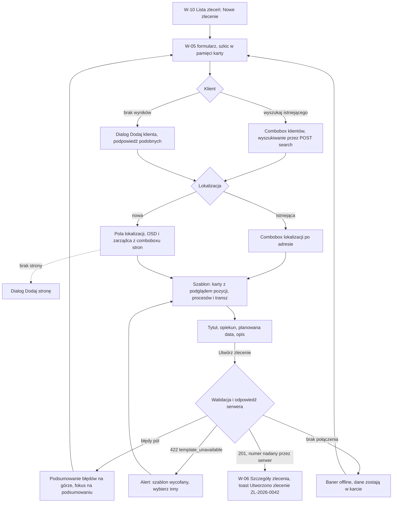

# 02 — Utworzenie zlecenia z szablonu

> Dokument żywy (EVM-004) · przepływ AC2 nr 2 · kanał: web · ekran: W-05 (+ dialogi „Dodaj klienta”, „Dodaj stronę”) · indeks: [README.md](README.md)
> Źródła: `domain-model.md` → „Kompozycja zlecenia z szablonu”, encje `Customer`, `Site`, `Party`, `WorkOrder`; szablony i słowniki: [`service-catalog.md`](../../product/service-catalog.md) § 5 i § 7; szybkie zlecenie z telefonu: [10-mobile-szybkie-zlecenie.md](10-mobile-szybkie-zlecenie.md).

## Przepływ


## W-05 Nowe zlecenie
- **Cel:** założyć zlecenie z szablonu w jednym formularzu — klient, lokalizacja, szablon (zakres, procesy z etapami, plan płatności) — bez przepisywania danych, które system już zna (WCAG 3.3.7).
- **Główna akcja:** „Utwórz zlecenie”.
- **Hierarchia treści:** 1) tytuł „Nowe zlecenie” + informacja o szkicu i numerze, 2) Klient, 3) Lokalizacja, 4) Szablon z podglądem, 5) Dane zlecenia (tytuł, opiekun, planowana data, opis), 6) „Utwórz zlecenie” / „Anuluj”.

**Makieta (expanded: formularz + podgląd szablonu po prawej)**
```text
Zlecenia / Nowe zlecenie
┌──────────────────────────────────────────────────┬──────────────────────────────────┐
│ Nowe zlecenie                                    │ Podgląd szablonu                 │
│ Numer zlecenia nadamy po zapisie.                │ Garaż — pełny proces             │
│                   Szkic w tej karcie · 14:05 ‹info›│ Typ obiektu: garaż w budynku     │
│                                                  │ wielorodzinnym                   │
│ 1. Klient                                        │                                  │
│ Klient                                           │ Zakres (9 pozycji)               │
│ [Szukaj: nazwisko, firma, telefon… ‹search› ▾]   │ · Zgody administracji / wspólnoty│
│   Brak wyników dla „Przykł”. [Dodaj klienta]     │ · Ekspertyza techniczna          │
│                                                  │ · Opinia ppoż                    │
│ 2. Lokalizacja                                   │ · Projekt instalacji             │
│ (•) Istniejąca lokalizacja   ( ) Nowa lokalizacja│ · Uzgodnienia z OSD              │
│ Lokalizacja [Szukaj adresu… ‹search› ▾]          │ · Instalacja zasilająca          │
│ ── albo nowa: ──                                 │ · Dostawa ładowarki (z oferty)   │
│ Typ obiektu [Garaż w budynku wielorodzinnym ▾]   │ · Montaż i uruchomienie          │
│ Ulica [ul. Testowa______]  Nr budynku [7__]      │ · Pomiary i odbiór               │
│ Nr lokalu (opcjonalnie) [__]                     │                                  │
│ Kod pocztowy [00-001]  Miasto [Warszawa______]   │ Procesy (9)                      │
│ Nr miejsca postojowego [15_]  Poziom [−1_]       │ · Uzgodnienia z OSD — 7 etapów   │
│ OSD [Szukaj strony… ▾]          [+ Dodaj stronę] │ · Zgody administracji — 4 etapy  │
│ Zarządca / administracja (opcjonalnie)           │   …                              │
│ [Szukaj strony… ▾]              [+ Dodaj stronę] │                                  │
│ Moc przyłączeniowa (opcjonalnie) [____] kW       │ Plan płatności                   │
│ PPE (opcjonalnie) [________]                     │ Zaliczka 20% · Po uzyskaniu zgód │
│ Notatki do lokalizacji (opcjonalnie)             │ 30% · Po wykonaniu instalacji 30%│
│ [____________________________________________]   │ · Płatność końcowa 20%           │
│ Nie wpisuj PESEL, numerów dokumentów ani kodów   │ Kwoty transz wpiszesz w zleceniu.│
│ do bram i alarmów. Notatki zobaczą technicy      │                                  │
│ w aplikacji.                                     │                                  │
│                                                  │                                  │
│ 3. Szablon                                [P-3]  │                                  │
│ Szablony dla typu: garaż w budynku               │                                  │
│ wielorodzinnym.                [Pokaż wszystkie] │                                  │
│ ┌(•) Garaż — pełny proces ─────────────────────┐ │                                  │
│ │ 9 pozycji · 9 procesów · 4 transze           │ │                                  │
│ └──────────────────────────────────────────────┘ │                                  │
│ ┌( ) Garaż — sama instalacja ──────────────────┐ │                                  │
│ │ 7 pozycji · 7 procesów · 3 transze           │ │                                  │
│ └──────────────────────────────────────────────┘ │                                  │
│ ┌( ) Garaż — montaż ładowarki ─────────────────┐ │                                  │
│ │ 2 pozycje · 2 procesy · 1 transza            │ │                                  │
│ └──────────────────────────────────────────────┘ │                                  │
│ ( ) Puste zlecenie (bez szablonu)                │                                  │
│                                                  │                                  │
│ 4. Zlecenie                                      │                                  │
│ Tytuł [Garaż — pełny proces______________]       │                                  │
│ Opiekun [Anna Testowa ▾]                         │                                  │
│ Planowana data (opcjonalnie) [__.__.____ ‹calendar›]                                │
│ Opis (opcjonalnie) [__________________________]  │                                  │
│                                                  │                                  │
│ [Anuluj]                     [[ Utwórz zlecenie ]]│                                  │
└──────────────────────────────────────────────────┴──────────────────────────────────┘

 Dialog „Dodaj klienta” (size.dialog.width.md):
 │ Dodaj klienta                                            [x] │
 │ Rodzaj  (•) Osoba  ( ) Firma                                 │
 │ Imię [Jan_______]   Nazwisko [Przykładowy______]             │
 │ (Firma: Nazwa firmy, NIP (opcjonalnie), Osoba kontaktowa)    │
 │ Telefon [+48 600 000 001]   E-mail (opcjonalnie) [________]  │
 │ ▸ Adres korespondencyjny (opcjonalnie — do dokumentów)       │
 │ Notatki (opcjonalnie) [__________________________]           │
 │ Nie wpisuj PESEL, numerów dokumentów ani kodów do bram       │
 │ i alarmów.                                                   │
 │ ┃‹info› Podobny klient: Jan Przykładowy · +48 600 000 001    │
 │ ┃ [Wybierz tego klienta]                                     │
 │                                  [Anuluj] [[ Dodaj klienta ]]│

 Dialog „Dodaj stronę” (size.dialog.width.md):
 │ Dodaj stronę                                             [x] │
 │ Rodzaj strony [OSD ▾]  (podpowiedź z pola, z którego otwarto)│
 │ Forma  (•) Firma lub instytucja  ( ) Osoba fizyczna          │
 │ Nazwa [Stoen Operator______________]                         │
 │ Osoba kontaktowa (opcjonalnie) [__________]                  │
 │ Telefon (opcjonalnie) [__________]  E-mail (opcjonalnie) [__]│
 │ Notatki (opcjonalnie) [__________________________]           │
 │ Nie wpisuj PESEL, numerów dokumentów ani kodów do bram       │
 │ i alarmów.                                                   │
 │                                  [Anuluj] [[ Dodaj stronę ]] │
```

**Stany**
| Stan | Zachowanie |
|---|---|
| Pusty | Formularz pusty; „Opiekun” domyślnie = zalogowana osoba; szablony przefiltrowane po wybranym typie obiektu (`siteTypeHint`), „Pokaż wszystkie” zdejmuje filtr. Brak aktywnych szablonów: „Brak aktywnych szablonów. Utwórz puste zlecenie i dodaj pozycje w zleceniu.” |
| Ładowanie | Szablony i podgląd — Skeleton kart; opcje comboboxów — Skeleton 3 wierszy (§ 3.3); „Utwórz zlecenie” w stanie ładowania, formularz zablokowany do odpowiedzi. |
| Błąd | Walidacja: podsumowanie błędów na górze (lista linków do pól), fokus na podsumowaniu, komunikaty pod polami (§ 4.1, § 6.4: „Podaj adres lokalizacji.”, „Wybierz szablon albo „Puste zlecenie”.”); `422 template_unavailable`: alert przy sekcji „Szablon” — „Szablon „…” został wycofany. Wybierz inny szablon.”; błąd sieci lub serwera: „Nie udało się utworzyć zlecenia. Spróbuj ponownie — nie utworzymy go dwa razy.” (ponowienie z tym samym kluczem idempotencji); wpisane dane zostają. |
| Offline | Baner § 4.10: „Brak połączenia. Wpisane dane zostają w tej karcie — zapisz je, gdy połączenie wróci.”; „Utwórz zlecenie” wyłączony z podpowiedzią; comboboxy pokazują „Wyszukiwanie wymaga połączenia.” |
| Brak uprawnień | Tylko odczyt: brak przycisku „Nowe zlecenie” na W-10; wejście z linku → `403`: EmptyState z `lock` „Nie możesz tworzyć zleceń. Poproś administratora o uprawnienia. [Wróć do listy]”. Klient lub lokalizacja usunięte w trakcie wypełniania → `404` przy zapisie: komunikat przy polu „Nie znaleziono wybranego klienta. Wybierz innego.” |

**Szkic (M1 z konsultacji security, styleguide § 4.1)**
- Autozapis co kilka sekund wyłącznie **w pamięci karty**: „Szkic w tej karcie · 14:05”, podpowiedź przy ikonie `info`: „Szkic znika po zamknięciu karty lub wylogowaniu.”
- Odrzucany przy wylogowaniu, zamknięciu karty i zalogowaniu innej osoby; po wygaśnięciu sesji przywracany tylko po ponownym zalogowaniu tej samej osoby w tej samej karcie.
- „Anuluj” przy wypełnionym formularzu: dialog „Odrzucić nowe zlecenie? Wpisane dane znikną.” [Odrzuć zmiany] (danger) [Wróć do formularza].

**Role**
| Akcja | Komenda / operacja (`domain-model.md`) | A | E | R |
|---|---|---|---|---|
| Utwórz zlecenie | `CreateWorkOrder` — kompozycja z szablonu (`WorkOrder` `new`, `ScopeItem`, `Procedure`, `ProcedureStage` `todo`, `PaymentMilestone` `planned`) | tak | tak | ukryte |
| Dodaj klienta | utworzenie `Customer` | tak | tak | ukryte |
| Nowa lokalizacja | utworzenie `Site` | tak | tak | ukryte |
| Dodaj stronę | utworzenie `Party` | tak | tak | ukryte |
| Opiekun | `WorkOrderAssignment` (`coordinator`) | tak | tak | ukryte |

- **Responsywność:** `breakpoint.expanded` / `breakpoint.wide` — formularz w kolumnie `size.form.max-width`, podgląd szablonu przyklejony po prawej (`elevation.sticky`); `breakpoint.medium` — podgląd pod wybraną kartą szablonu (Disclosure „Pokaż szczegóły szablonu” [P-2]); `breakpoint.compact` — jedna kolumna, pola jedno pod drugim, przycisk główny na pełną szerokość.
- **Komponenty i tokeny:** Breadcrumbs (§ 3.17); nagłówki sekcji `text.heading-4`, odstęp grup `space.stack.lg`; Combobox (§ 3.3) z akcją „Dodaj klienta” / „Dodaj stronę” w stanie „brak wyników”; radio (§ 3.4) w `fieldset`; TextField (§ 3.2) — telefon, e-mail, liczba z sufiksem „kW” (`text.numeric`), wieloliniowe (notatki); DatePicker (§ 3.5); Select (§ 3.3) — typ obiektu, rodzaj strony, opiekun; SelectableCard [P-3]; Card (§ 3.8) — podgląd szablonu; Dialog (§ 3.13) `size.dialog.width.md`; InlineAlert (§ 3.19) `color.feedback.info.*` (podobny klient), `color.feedback.error.*` (podsumowanie błędów); Button primary / tertiary (§ 3.1); tekst szkicu `text.body-sm` `color.text.secondary`; podpowiedzi `color.text.tertiary`.
- **Mikrocopy:** „Nowe zlecenie” · „Numer zlecenia nadamy po zapisie.” · „Szkic w tej karcie · 14:05” · „Szkic znika po zamknięciu karty lub wylogowaniu.” · „Szukaj: nazwisko, firma, telefon…” · „Brak wyników dla „…”. [Dodaj klienta]” · „Istniejąca lokalizacja” / „Nowa lokalizacja” · „Nie wpisuj PESEL, numerów dokumentów ani kodów do bram i alarmów. Notatki zobaczą technicy w aplikacji.” · „Szablony dla typu: …” · „Pokaż wszystkie” · „Puste zlecenie (bez szablonu)” · „Kwoty transz wpiszesz w zleceniu.” · „Utwórz zlecenie” · toast po zapisie: „Utworzono zlecenie ZL-2026-0042.”
- **Dostępność:** sekcje jako `fieldset` z legendą („1. Klient”…); karty szablonów jako grupa radio (strzałki zmieniają wybór, podgląd ogłaszany `aria-live="polite"`); combobox z obsługą klawiatury (§ 3.3); podsumowanie błędów z linkami do pól; skróty (OSD, PPE) z rozwinięciem w podpowiedzi (§ 6.2); notatki to zwykły tekst — w podglądzie aktywne tylko linki `https:`, `tel:`, `mailto:` (SR-WEB-03); tytuł karty „Nowe zlecenie · EVia Manager”.
