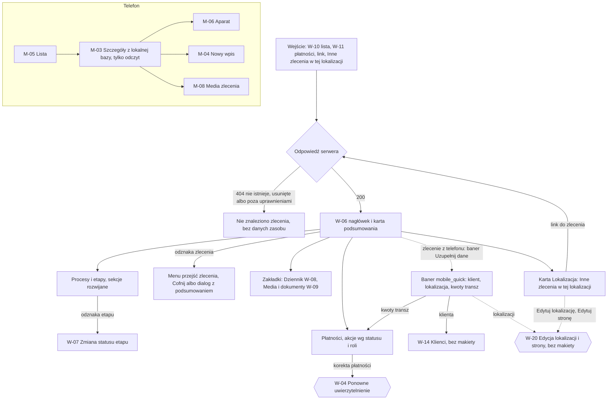

# 03 — Szczegóły zlecenia: „status na pierwszy rzut oka”

> Dokument żywy (EVM-004) · przepływ AC2 nr 3 · kanały: web i mobile · ekrany: W-06, M-03 (+ dialog W-20 — bez makiety, pola z W-05) · indeks: [README.md](README.md)
> Źródła: styleguide § 1 pkt 1 i 5, § 4.4; `domain-model.md` → `WorkOrder`, `Procedure`, `ProcedureStage`, `PaymentMilestone`, „Stany i przejścia”, „Macierz encja × operacja × rola”; projekcja na telefonie: `offline-sync.md` → „Zakres synchronizacji urządzenia”; P6, SR-AUTHZ-08, SR-SYNC-04.

## Przepływ


## W-06 Szczegóły zlecenia
- **Cel:** w kilka sekund odpowiedzieć: na jakim etapie jest zlecenie, na kogo czekamy i od kiedy, co jest po terminie, co nieopłacone — szczegóły procesów po rozwinięciu (styleguide § 1 pkt 1 i 5).
- **Główna akcja:** zależna od stanu zlecenia — najczęściej zmiana statusu etapu z odznaki (W-07); w nagłówku jedna akcja główna nie występuje (odznaka zlecenia jako menu przejść).
- **Hierarchia treści:** 1) nagłówek: numer, tytuł, odznaka statusu zlecenia, klient, lokalizacja, opiekun; 2) **karta podsumowania**: bieżące etapy · na kogo czekamy · terminy · płatności; 3) zakładki: **Przegląd** (procesy i etapy, płatności, zakres) · Dziennik ([W-08](05-wpis-i-komentarz.md#w-08-dziennik)) · Media i dokumenty ([W-09](06-galeria-i-upload.md#w-09-media-i-dokumenty)); 4) kolumna boczna: Klient, Lokalizacja (z „Inne zlecenia w tej lokalizacji”), Opiekun.

**Makieta (expanded, zakładka „Przegląd”)**
```text
Zlecenia / ZL-2026-0042
┌──────────────────────────────────────────────────────────────────────────────────────────┐
│ ZL-2026-0042 · Garaż — pełny proces                       «W realizacji ▾»          ⋮    │
│ Jan Przykładowy · ul. Testowa 7, 00-001 Warszawa · miejsce nr 15, poziom −1              │
│ Opiekun: Anna Testowa · Utworzono 01.09.2026                                             │
├──────────────────────────────────────────────────────────────────────────────────────────┤
│ Podsumowanie                                                                             │
│ ┌ Na jakim etapie ────────┐┌ Na kogo czekamy ─────────────┐┌ Terminy ─────┐┌ Płatności ──────────┐│
│ │ Uzgodnienia z OSD:      ││ ‹triangle-alert› Stoen        ││ Najbliższy:  ││ Nieopłacone:        ││
│ │  Warunki przyłączenia   ││ Operator (OSD) · od 15 dni    ││ 20.10.2026 — ││ 3 600,00 zł (1)     ││
│ │  «Czekamy na…»          ││ Wspólnota Mieszkaniowa        ││ Zgoda admin. ││ «Po terminie» 5 dni ││
│ │ Zgody administracji:    ││ „Zielony Dziedziniec”         ││ Po terminie: ││ Planowane: 3        ││
│ │  Zgoda administracji    ││ (Wspólnota / spółdzielnia)    ││ brak         ││ Opłacone: 0 z 4     ││
│ │  «Czekamy na…»          ││ · od 3 dni                    ││              ││                     ││
│ │ + 7 procesów            ││                               ││              ││                     ││
│ └─────────────────────────┘└───────────────────────────────┘└──────────────┘└─────────────────────┘│
├───────────────────────────────────────────────────────────────┬──────────────────────────┤
│ [Przegląd] [Dziennik (12)] [Media i dokumenty (48)]           │ Klient                   │
│                                                               │ Jan Przykładowy          │
│ Procesy i etapy (9)                        [Rozwiń wszystkie] │ +48 600 000 001          │
│ ▾ Uzgodnienia z OSD        2 z 7 etapów § 3.23                │ jan.przykladowy@example.com│
│    1 Pełnomocnictwo od klienta     «Zakończony»  02.09.2026   │ [Przejdź do klienta]     │
│    2 Wniosek do OSD                «Zakończony»  05.09.2026   │                          │
│    3 Warunki przyłączenia i        «Czekamy na… ▾»          ⋮ │ Lokalizacja   [Edytuj]   │
│      projekt umowy                 Czekamy na: Stoen Operator │ Garaż w budynku          │
│                                    (OSD) · od 15 dni ‹triangle-alert›                    │
│                                    Osoba odpowiedzialna:       │ wielorodzinnym           │
│                                    Anna Testowa                │                          │
│    4 Umowa z OSD podpisana…        «Do zrobienia ▾»         ⋮ │ ul. Testowa 7, 00-001    │
│    5 Prace sieciowe po stronie OSD «Do zrobienia ▾»         ⋮ │ Warszawa                 │
│    6 Zgłoszenie gotowości…         «Do zrobienia ▾»         ⋮ │ Miejsce nr 15, poziom −1 │
│    7 Wymiana licznika…             «Do zrobienia ▾»         ⋮ │ OSD: Stoen Operator    ⋮ │
│ ▸ Zgody administracji / wspólnoty  2 z 4 etapów  «Czekamy na…» Wspólnota … · od 3 dni  │
│ ▸ Ekspertyza techniczna            3 z 3 etapów  ‹circle-check› Wszystkie zakończone    │
│ ▸ Opinia ppoż                      2 z 2 etapów  ‹circle-check› Wszystkie zakończone    │
│ ▸ Projekt instalacji               1 z 2 etapów  «Czekamy na…» Projektant … · od 8 dni  │
│ ▸ … (4 kolejne)                                              │ Zarządca: Wspólnota … ⋮  │
│                                                               │ Moc przyłączeniowa: 40 kW│
│ Płatności                Nieopłacone 3 600,00 zł · Opłacone 0,00 zł                     │
│ Transza                Kwota        Status          Nr faktury       Termin             │
│ Zaliczka (20%)         3 600,00 zł  «Po terminie»   FV/TEST/0007/2026 08.09.2026 (5 dni) │
│                                     [Odnotuj wpłatę]                               ⋮    │
│ Po uzyskaniu zgód (30%)  —          «Planowana»     —                —                  │
│                                     [Wystaw fakturę]                               ⋮    │
│ Po wykonaniu instalacji (30%) —     «Planowana»     —                —            ⋮     │
│ Płatność końcowa (20%)   —          «Planowana»     —                —            ⋮     │
│ [+ Dodaj transzę]                                             │ PPE: PL-TEST-0001        │
│                                                               │ Notatki: wjazd od ul.    │
│ Zakres (9 pozycji)                       [Edytuj zakres]      │ Fikcyjnej, klucz u       │
│ · Dostawa ładowarki (z oferty) — AC, 11 kW, 3 fazy            │ administratora           │
│ · Instalacja zasilająca — obwód dedykowany, z WLZ             │                          │
│ · …                                                           │ Inne zlecenia w tej      │
│                                                               │ lokalizacji (1)          │
│                                                               │ ZL-2026-0017 · Garaż —   │
│                                                               │ sama instalacja          │
│                                                               │ «Rozliczone» 12.03.2026  │
└───────────────────────────────────────────────────────────────┴──────────────────────────┘
```

**Nagłówek — menu przejść zlecenia** (odznaka `«W realizacji ▾»`, ActionMenu — § 3.20; tylko przejścia z tabeli „Zlecenie” w `domain-model.md`)
| Ze stanu | Pozycje menu | Po wykonaniu |
|---|---|---|
| Nowe | „Rozpocznij wycenę”, „Zaakceptuj bez wyceny”, „Wstrzymaj…”, „Anuluj zlecenie…” | toast bez „Cofnij” (brak przejścia odwrotnego); „Wstrzymaj” — toast z „Cofnij” (wznowienie) |
| Wycena | „Zaakceptuj”, „Wstrzymaj…”, „Anuluj zlecenie…” | jw. |
| Zaakceptowane | „Rozpocznij realizację”, „Wstrzymaj…”, „Anuluj zlecenie…” | jw. |
| W realizacji | „Zakończ”, „Wstrzymaj…”, „Anuluj zlecenie…” | „Zakończ” — dialog z ostrzeżeniem o otwartych etapach (bez blokady), potem toast z „Cofnij” (ponowne otwarcie) |
| Wstrzymane | „Wznów”, „Anuluj zlecenie…” | „Wznów” — toast z „Cofnij” (wstrzymanie z tym samym powodem) |
| Zakończone | „Rozlicz…”, „Otwórz ponownie” | „Rozlicz…” — dialog z podsumowaniem; wyłączone, gdy któraś transza nie jest opłacona ani anulowana („Rozliczysz, gdy wszystkie transze będą opłacone albo anulowane.”); „Otwórz ponownie” — toast z „Cofnij” |
| Rozliczone, Anulowane | „Przywróć zlecenie…” | Administrator ↑ (W-04); Edytor — wyłączone z podpowiedzią „Przywrócić zlecenie może tylko administrator.” |

- **„Anuluj zlecenie…”** — dialog z podsumowaniem (§ 4.11): wymagany powód; skutek „Planowane transze (3) zostaną anulowane. Przywrócić zlecenie może tylko administrator.”; gdy jest transza wystawiona — dialog blokuje: „Najpierw odnotuj wpłatę albo poproś administratora o anulowanie faktury.” (`422 transition_condition_not_met`).
- **„Rozlicz…”** — dialog z podsumowaniem: liczba transz opłaconych i anulowanych, suma wpłat; „Cofnąć rozliczenie może tylko administrator.”
- **„Wstrzymaj…”** — dialog z wymaganym powodem; po wykonaniu toast „Wstrzymano zlecenie. [Cofnij]”.
- **Zlecenie Rozliczone / Anulowane:** Banner (§ 3.19, `color.feedback.info.*`): „Zlecenie jest rozliczone — zakres, procesy i płatności są tylko do odczytu. Wpisy, zdjęcia i dokumenty nadal możesz dodawać.”; odznaki etapów i akcje płatności wyłączone z podpowiedzią.
- **Menu `⋮` nagłówka:** „Edytuj dane zlecenia” (tytuł, opis, opiekun, planowana data — edycja pól, `If-Match`), „Usuń zlecenie” (Administrator; Edytor — wyłączone z podpowiedzią „Usunąć zlecenie może tylko administrator.”; z transzą wystawioną — `409 has_active_dependents`: „Nie można usunąć zlecenia z wystawioną fakturą.”; z transzą opłaconą — Administrator ↑, SR-AUTHZ-10).

**Baner „Zlecenie założone w terenie”** (`origin = mobile_quick`, [przepływ 10](10-mobile-szybkie-zlecenie.md)) — Banner (§ 3.19, `color.feedback.info.*`, ikona `info`) nad kartą podsumowania, z odnośnikiem do każdej akcji uzupełnienia. Widoczny, dopóki zlecenie ma status „Nowe” (wyliczane, bez nowego pola; po pierwszym przejściu zlecenia znika). Odnośniki tylko dla A i E — Tylko odczyt widzi sam pierwszy wiersz.
```text
┃‹info› Zlecenie założone w terenie (Piotr Testowy, 03.10.2026).
┃ Uzupełnij dane: klienta · [lokalizacji] · kwoty transz ↓
┃                 └ link     └ przycisk     └ link do sekcji
```

Trzy odnośniki robią trzy różne rzeczy, więc mają **trzy różne komponenty i nazwy dostępne** (WCAG 4.1.2, 2.4.4) — użytkownik czytnika i klawiatury wie przed aktywacją, czy przejdzie na inną stronę, otworzy dialog, czy przewinie stronę:

| Odnośnik | Komponent | Prowadzi do | Nazwa dostępna i fokus | Co biuro uzupełnia |
|---|---|---|---|---|
| klienta | **Link** — nawigacja (`color.text.link`, podkreślony; `href` do szczegółów klienta) | W-14 — szczegóły klienta (jak „Przejdź do klienta”; bez makiety — przy refinemencie E2) | „Uzupełnij dane klienta — przejdź do klienta”; po przejściu fokus na nagłówku W-14 (zwykła nawigacja), „wstecz” wraca do W-06 | e-mail, NIP, osoba kontaktowa, adres korespondencyjny, notatki |
| lokalizacji | **Button tertiary** (§ 3.1) z `aria-haspopup="dialog"` — wygląda jak przycisk tekstowy, bez podkreślenia | W-20 „Edytuj lokalizację” (dialog z karty „Lokalizacja” — niżej) | „Uzupełnij dane lokalizacji” (otwiera dialog); fokus w dialogu na pierwszym polu, po zamknięciu wraca do przycisku | poziom garażu, OSD, zarządca, moc przyłączeniowa, PPE, notatki |
| kwoty transz | **Link do sekcji na tej stronie** (`href="#platnosci"`, podkreślony, ikona `arrow-down` `size.icon.sm`) | przewinięcie do sekcji „Płatności” (`scroll-padding` równe wysokości przyklejonych pasków — WCAG 2.4.11), fokus na „Zmień kwotę” pierwszej transzy „Planowana” bez kwoty ([akcje płatności](08-nieoplacone.md#akcje-płatności--status--rola)) | „Uzupełnij kwoty transz — przejdź do sekcji Płatności” | kwoty transz |

Kontrast odnośników na `color.feedback.info.bg` — 6,20:1 (styleguide § 2.1.4).

**Karta „Lokalizacja” — edycja lokalizacji i stron (W-20, dialog; bez makiety — przy refinemencie E3 / E4)**
- **„Edytuj”** w nagłówku karty (nazwa dostępna „Edytuj lokalizację”) otwiera dialog (§ 3.13, `size.dialog.width.md`) z polami sekcji „2. Lokalizacja” z [W-05](02-nowe-zlecenie-z-szablonu.md#w-05-nowe-zlecenie), wypełnionymi bieżącymi danymi: typ obiektu, adres, nr miejsca i poziom, OSD i zarządca (combobox stron z „Dodaj stronę”), moc przyłączeniowa, PPE, notatki z podpowiedzią „Nie wpisuj PESEL…”. Nad polami InlineAlert (§ 3.19, `color.feedback.info.*`): „Zmiana dotyczy wszystkich zleceń w tej lokalizacji (2).” — licznik tą samą polityką co lista (SR-AUTHZ-03); lokalizacja bywa wspólna dla zleceń różnych klientów (scenariusz D4′).
- **„Edytuj stronę”** z menu `⋮` przy OSD i zarządcy — dialog z polami „Dodaj stronę” z W-05 (nazwa, osoba kontaktowa, telefon, e-mail, notatki) i informacją „Strona jest wspólna — zmiana będzie widoczna we wszystkich lokalizacjach i zleceniach z tą stroną.”
- Zapis z `If-Match` (`412` — § 6.4, wpisane dane zostają); toast „Zapisano zmiany lokalizacji.” / „Zapisano zmiany strony.”; technicy zobaczą zmianę w aplikacji po synchronizacji (projekcja M-03).

**Karta podsumowania — reguły** (wszystko wyliczane z danych, bez nowych pól)
- **Na jakim etapie:** dla każdego procesu z otwartym etapem — bieżący etap (pierwszy otwarty wg `position`) z odznaką; maksymalnie 3 procesy, reszta jako „+ 7 procesów” (przewija do sekcji).
- **Na kogo czekamy:** wszystkie etapy w stanie `waiting`, sortowane od najdłuższego oczekiwania; format z § 4.4 („Czekamy na: Stoen Operator (OSD) · od 15 dni”, „Czekamy na: klient · od 3 dni”); powyżej 14 dni — `triangle-alert` + `color.text.warning`. Kafel pokazuje tylko faktyczne oczekiwania — bez pustych wierszy dla klienta czy stron (PO-3). Brak oczekiwań — „Piłka po naszej stronie — nie czekamy na nikogo.”
- **Terminy:** najbliższy `dueDate` otwartego etapu; etapy po terminie — `alarm-clock` + `color.text.error` (§ 4.2).
- **Płatności:** nieopłacone (liczba i suma transz `invoiced`), „Po terminie” (mocna odznaka i liczba dni), planowane, opłacone „x z y”.

**Stany**
| Stan | Zachowanie |
|---|---|
| Pusty | Zlecenie bez szablonu: „Zlecenie nie ma jeszcze procesów. [Edytuj zakres]” i „Brak transz. [Dodaj transzę]”; bez innych zleceń w lokalizacji — sekcja ukryta. |
| Ładowanie | Najpierw nagłówek (Skeleton tekstu), potem karta podsumowania (Skeleton czterech kafli) i sekcje (§ 4.12); zakładki doczytywane po wybraniu. |
| Błąd | Nie wczytano zlecenia — EmptyState `circle-alert` „Nie udało się wczytać zlecenia. [Spróbuj ponownie]”; nie wczytano sekcji — alert w sekcji z „Spróbuj ponownie”, pozostałe sekcje działają; `412 version_conflict` przy edycji — komunikat konfliktu edycji z § 6.4; `429` — wzór z README. |
| Offline | Baner § 4.10; dane widoczne z pamięci karty z banerem „Dane mogą być nieaktualne (z 14:05)”; akcje zmieniające dane wyłączone z podpowiedzią „Zmienisz po powrocie połączenia.” |
| Brak uprawnień | `404` — EmptyState „Nie znaleziono zlecenia. Mogło zostać usunięte albo nie masz do niego dostępu. [Wróć do listy]”, bez danych z listy; tytuł karty „Nie znaleziono · EVia Manager”. Tylko odczyt — wszystkie sekcje (z płatnościami) bez akcji: odznaki statyczne, brak `⋮`, „Dodaj transzę”, „Edytuj zakres”, „Edytuj” w karcie „Lokalizacja” i odnośników w banerze „Zlecenie założone w terenie”. Edytor — akcje Administratora wyłączone z podpowiedzią. |

**Role**
| Akcja | Komenda / przejście | A | E | R |
|---|---|---|---|---|
| Podgląd wszystkich sekcji (z płatnościami) | odczyt `WorkOrder` i encji podrzędnych | tak | tak | tak |
| Przejścia zlecenia (bez przywrócenia) | tabela „Zlecenie”: `new→quoting`, `new→accepted`, `quoting→accepted`, `accepted→in_progress`, `active→on_hold`, `on_hold→active`, `active/on_hold→cancelled`, `in_progress→completed`, `completed→in_progress`, `completed→settled` | tak | tak | ukryte |
| Przywróć zlecenie | `settled→completed`, `cancelled→on_hold` | tak ↑ | wyłączone | ukryte |
| Edytuj dane zlecenia | edycja `WorkOrder` (pola niekontrolowane przez serwer) | tak | tak | ukryte |
| Usuń zlecenie | soft delete `WorkOrder` (z transzą `paid` — A ↑, SR-AUTHZ-10) | tak (↑ przy transzy opłaconej) | wyłączone | ukryte |
| Zmień status etapu | W-07 — tabela „Etap procesu” | tak | tak | ukryte (odznaki statyczne) |
| Akcje płatności | [W-11 — tabela akcji płatności](08-nieoplacone.md#akcje-płatności--status--rola) | wg tabeli | wg tabeli | ukryte |
| Edytuj zakres, dodaj / usuń proces lub etap | edycja `ScopeItem`, `Procedure`, `ProcedureStage` (szczegóły przy refinemencie E3 / E4) | tak | tak | ukryte |
| Edytuj lokalizację | edycja `Site` (`If-Match`) — W-20 z karty „Lokalizacja” albo z banera `mobile_quick`; „Zmiana dotyczy wszystkich zleceń w tej lokalizacji (n).” | tak | tak | ukryte |
| Edytuj stronę (OSD, zarządca) | edycja `Party` (`If-Match`) — W-20 z menu `⋮` przy stronie; „Strona jest wspólna — zmiana będzie widoczna we wszystkich lokalizacjach i zleceniach z tą stroną.” | tak | tak | ukryte |
| Dodaj stronę (w W-20) | utworzenie `Party` (jak W-05) | tak | tak | ukryte |
| Inne zlecenia w tej lokalizacji | odczyt listy zleceń z filtrem `siteId` tą samą polityką co lista (SR-AUTHZ-03, SR-AUTHZ-08) | tak | tak | tak |

**„Inne zlecenia w tej lokalizacji” (SR-AUTHZ-08, SR-AUTHZ-03)**
- Wiersz: **tylko** numer, tytuł, odznaka statusu i data zamknięcia (`closedAt`) — bez nazwy i kontaktu klienta innego zlecenia i bez miniatur.
- Licznik „(1)” liczony tą samą polityką co lista zleceń (nie widać zleceń poza uprawnieniami).
- Kliknięcie otwiera W-06 innego zlecenia przez zwykłą autoryzację — zlecenie niedostępne → `404` „Nie znaleziono zlecenia”.
- Tylko panel; na telefonie sekcji nie ma. Pełna „historia lokalizacji” (dokumenty i zdjęcia poprzednich zleceń) — kandydat do backlogu (EVM-010).

- **Responsywność:** `breakpoint.wide` — kolumna boczna szersza, tabela płatności ze wszystkimi kolumnami; `breakpoint.expanded` — jak makieta (treść 8 kolumn siatki + boczna 4); `breakpoint.medium` — jedna kolumna: nagłówek, podsumowanie (kafle 2 × 2), karty Klient i Lokalizacja pod podsumowaniem, tabela płatności bez kolumny „Nr faktury” (w szczegółach wiersza); `breakpoint.compact` — kafle podsumowania jeden pod drugim, zakładki przewijane poziomo, płatności jako lista kart (§ 3.6), etapy jako lista prosta.
- **Komponenty i tokeny:** Breadcrumbs, Tabs (§ 3.17); nagłówek `text.heading-1` (numer i tytuł), metadane `text.body-sm` `color.text.secondary`; StatusBadge (§ 3.9) — statyczna i jako przycisk, wariant mocny „Rozliczone”, „Po terminie”, tokeny `color.status.order.*`, `color.status.stage.*`, `color.status.payment.*`; ActionMenu (§ 3.20); Card (§ 3.8) — karta podsumowania (`space.inset.lg`, `radius.card`, `color.border.default`), karty boczne; Disclosure (§ 3.21); ProcedureProgress (§ 3.23, `color.progress.*`); DataTable (§ 3.6) — płatności, kwoty `text.numeric` do prawej, sumy `text.numeric-lg`; List (§ 3.6) — etapy; Banner / InlineAlert (§ 3.19) — także baner „Zlecenie założone w terenie” `color.feedback.info.*` z odnośnikami: Link `color.text.link`, Button tertiary z `aria-haspopup="dialog"`, link do sekcji (tabela odnośników wyżej); Button tertiary (§ 3.1) „Edytuj” w nagłówku karty „Lokalizacja”; Dialog (§ 3.13) — anulowanie, rozliczenie, wstrzymanie, W-20 (`size.dialog.width.md`, pola i Combobox z W-05); Toast (§ 3.14) z „Cofnij”; ikony `triangle-alert` `color.icon.warning`, `alarm-clock` `color.icon.error`, `circle-check` `color.icon.success`; odznaka wartości nieznanej (§ 3.9.1, `color.status.unknown.*`) — zawsze statyczna, akcje zależne od statusu wyłączone z podpowiedzią; odstępy `space.stack.md`, `space.inline.md`.
- **Mikrocopy:** „Podsumowanie” · „Na jakim etapie” · „Na kogo czekamy” · „Czekamy na: Stoen Operator (OSD) · od 15 dni” · „Piłka po naszej stronie — nie czekamy na nikogo.” · „Terminy” · „Najbliższy:” · „Po terminie:” · „Płatności” · „Nieopłacone:” · „Opłacone: 0 z 4” · „Procesy i etapy (9)” · „2 z 7 etapów” · „Wszystkie zakończone” · „Osoba odpowiedzialna: Anna Testowa” · „Rozwiń wszystkie” · „Inne zlecenia w tej lokalizacji (1)” · „Przejdź do klienta” · „Edytuj” (karta „Lokalizacja”) · „Edytuj lokalizację” · „Edytuj stronę” · „Zmiana dotyczy wszystkich zleceń w tej lokalizacji (2).” · „Strona jest wspólna — zmiana będzie widoczna we wszystkich lokalizacjach i zleceniach z tą stroną.” · „Zlecenie założone w terenie (Piotr Testowy, 03.10.2026).” · „Uzupełnij dane: klienta · lokalizacji · kwoty transz” · toasty: „Wstrzymano zlecenie. [Cofnij]”, „Zakończono zlecenie. [Cofnij]”, „Zapisano zmiany lokalizacji.”, „Zapisano zmiany strony.”
- **Dostępność:** nagłówki sekcji w hierarchii (h1 numer i tytuł, h2 sekcje, h3 procesy); karta podsumowania jako region z nazwą „Podsumowanie zlecenia”; odznaki z pełną nazwą dostępną („Status zlecenia: W realizacji, zmień status”); rozwinięcia `aria-expanded`; tabela płatności z `aria-sort` i nagłówkami wierszy; liczby dni jako tekst, nie tylko ikona; tytuł karty „ZL-2026-0042 · EVia Manager” (bez nazwiska i adresu); odnośniki banera — trzy komponenty z różnymi nazwami dostępnymi (tabela odnośników banera); nagłówki sekcji procesów z nazwą dostępną „Uzgodnienia z OSD, 2 z 7 etapów, czekamy na Stoen Operator (OSD) od 15 dni” (§ 3.21); `⋮` przy stronie z nazwą „Akcje strony: Stoen Operator (OSD)”; po zapisie W-20 fokus wraca do przycisku, który otworzył dialog.

## M-03 Szczegóły zlecenia
- **Cel:** w terenie, także bez zasięgu, zobaczyć, co robimy w tym zleceniu, gdzie i z kim — i od razu dodać zdjęcie albo wpis.
- **Główna akcja:** „Zrób zdjęcie” (dolny pasek, `size.touch-target.field`).
- **Hierarchia treści:** 1) numer (albo „Oczekuje na numer” — § 4.15), tytuł, odznaka zlecenia; 2) klient (nazwa, telefon) i adres (`text.body-lg`) z miejscem postojowym i wskazówkami dojazdu (`Site.notes`); 3) na kogo czekamy i bieżące etapy (tylko podgląd) + „Status etapu zmienisz w panelu.”; 4) procesy (rozwijane, tylko podgląd); 5) media (liczniki) → M-08; 6) dziennik (ostatnie wpisy) + „Dodaj wpis”; 7) dokumenty — tylko metadane.

**Makieta (compact)**
```text
┌──────────────────────────────────┐
│ ← ZL-2026-0042    ⟨Offline · 5⟩  │
├──────────────────────────────────┤
│ Garaż — pełny proces             │
│ «W realizacji»                   │
│                                  │
│ Jan Przykładowy                  │
│ [‹phone› +48 600 000 001]        │ ← link tel:
│ ul. Testowa 7, 00-001 Warszawa   │ text.body-lg
│ Miejsce nr 15, poziom −1         │
│ Wskazówki: wjazd od ul. Fikcyjnej│
│                                  │
│ Na kogo czekamy                  │
│ «Czekamy na…» Stoen Operator     │
│ (OSD) · od 15 dni ‹triangle-alert›│
│ ┃‹info› Status etapu zmienisz    │
│ ┃ w panelu.                      │
│                                  │
│ Procesy                   § 3.21 │
│ ▸ Uzgodnienia z OSD  2 z 7 § 3.23│
│ ▸ Zgody administracji 2 z 4      │
│ ▸ Instalacja zasilająca 0 z 3    │
│                                  │
│ Media                            │
│ 48 zdjęć · 3 niewysłane    [›]   │ → M-08
│                                  │
│ Dziennik                         │
│ dziś, 9:30 · Anna Testowa        │
│ Rozmowa telefoniczna: klient     │
│ potwierdził termin montażu.      │
│ [Pokaż cały dziennik]            │
│                                  │
│ Dokumenty (tylko informacja)     │
│ Projekt instalacji · wersja 2 ·  │
│ 12.09.2026                       │
├──────────────────────────────────┤
│ [Dodaj wpis] [[‹camera› Zrób zdjęcie]]│
├──────────────────────────────────┤
│ Zlecenia  Dodaj  Kolejka  Więcej │
└──────────────────────────────────┘
```

**Co M-03 pokazuje, a czego nie** (projekcja `offline-sync.md`, SR-SYNC-04, SR-AUTHZ-12 — w razie rozbieżności SR-AUTHZ-12 ma pierwszeństwo)
| Pokazuje | Nie pokazuje |
|---|---|
| numer, tytuł, status, opis, planowana data, opiekun i technicy (nazwy) | płatności (żadnych kwot ani statusów transz) i PPE |
| klient: nazwa i telefon | e-mail, NIP, adres korespondencyjny i notatki klienta |
| lokalizacja: typ, adres, miejsce postojowe, poziom, moc przyłączeniowa, wskazówki (`Site.notes`), OSD i zarządca (nazwa, osoba kontaktowa, telefon) | e-mail i notatki stron |
| procesy, etapy, „na kogo czekamy” — tylko podgląd | zmiany statusów (telefon tylko dodaje — D11) |
| dokumenty — rodzaj, tytuł, numer wersji, data (bez „Otwórz” i bez pobierania) | pliki dokumentów, oryginały mediów, przyczyna kwarantanny |
| media — liczniki i miniatury na żądanie (M-08) | „Inne zlecenia w tej lokalizacji” i historia lokalizacji (tylko panel) |

**Stany**
| Stan | Zachowanie |
|---|---|
| Pusty | Brak procesów (szybkie zlecenie przed uzupełnieniem w biurze): „Biuro uzupełni procesy po synchronizacji. Możesz już dodawać zdjęcia i wpisy.” Brak mediów: „To zlecenie nie ma jeszcze zdjęć. [Zrób zdjęcie]”. |
| Ładowanie | Dane z lokalnej bazy od razu; miniatury — Skeleton kafli do czasu pobrania (tylko online). |
| Błąd | Lokalny odczyt nieudany: „Nie udało się otworzyć zlecenia. [Spróbuj ponownie]”; zlecenie usunięte w biurze albo poza zakresem — „Nie znaleziono zlecenia. Twoje niewysłane zdjęcia i wpisy z tego zlecenia są w Kolejce. [Przejdź do kolejki]” (elementy oczekujące → „Wymaga uwagi”, § 4.16). |
| Offline | SyncIndicator „Offline · 5” + baner § 5.4; wszystko z lokalnej bazy; miniatury niepobrane — kafel z ikoną typu i „Podgląd po połączeniu”; zapisy idą do kolejki („Zapisano w telefonie”). |
| Brak uprawnień | Tylko odczyt nie ma dostępu do aplikacji (M-02). Utrata dostępu po synchronizacji (`rejected: forbidden`, `resync_required`) — zlecenie znika z listy, elementy oczekujące zostają w Kolejce („Wymaga uwagi”). Tryb ukrytych danych (§ 4.18) — ekran niedostępny (EmptyState, dane nie są renderowane): „Dane zleceń są ukryte… Aparat i kolejka działają.” |

**Role**
| Akcja | Komenda (`offline-sync.md`) | A | E | R |
|---|---|---|---|---|
| Podgląd zlecenia | kanał zmian (projekcja) | tak | tak | brak dostępu (M-02) |
| Zrób zdjęcie / nagraj film | `CreateMediaAsset` + sesja uploadu | tak | tak | — |
| Dodaj wpis / komentarz | `CreateNote` / `CreateComment` | tak | tak | — |
| Zmiana statusu etapu, płatności, edycja danych | — (tylko panel; telefon tylko dodaje) | nie | nie | — |

- **Responsywność:** jedna kolumna; obsługa powiększenia czcionki do 200 % (adres i telefon zawijane, nie skracane); pozioma orientacja — ten sam porządek, dolny pasek akcji zostaje.
- **Komponenty i tokeny:** AppBar z SyncIndicator (§ 3.18, § 5.4; stan „Wymaga uwagi” — § 4.16); StatusBadge (§ 3.9; wartość nieznana — § 3.9.1, podpowiedź „Zaktualizuj aplikację, aby zobaczyć szczegóły.”); odznaka „Oczekuje na numer” (§ 4.15); Card (§ 3.8) `space.inset.md`, odstęp `space.stack.sm`; adres `text.body-lg`, treść `text.body` (minimum mobile); link `tel:` jako Button tertiary z ikoną `phone` (`size.touch-target.min`); InlineAlert (§ 3.19) `color.feedback.info.*`; Disclosure (§ 3.21); ProcedureProgress (§ 3.23); tryb ukrytych danych (§ 4.18); Timeline (§ 3.10) — skrót dziennika; Button primary `size.touch-target.field` + secondary w dolnym pasku `elevation.bottom-bar`; BottomNav (§ 3.18).
- **Mikrocopy:** „Status etapu zmienisz w panelu.” · „Na kogo czekamy” · „Wskazówki:” · „48 zdjęć · 3 niewysłane” · „Pokaż cały dziennik” · „Dokumenty (tylko informacja)” · „Zrób zdjęcie” · „Dodaj wpis” · „Biuro uzupełni procesy po synchronizacji. Możesz już dodawać zdjęcia i wpisy.”
- **Dostępność:** cele dotyku ≥ `size.touch-target.min`; telefon klienta jako przycisk z nazwą „Zadzwoń: Jan Przykładowy”; odznaki ze statusem w nazwie dostępnej; brak gestów jako jedynej drogi (rozwinięcie procesu przyciskiem); kontrast tekstu ≥ 7:1 (§ 5.3).
