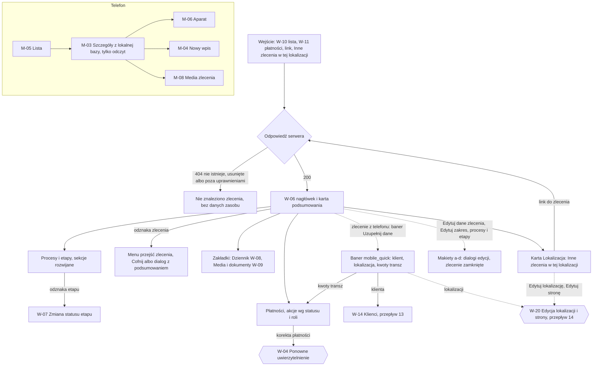
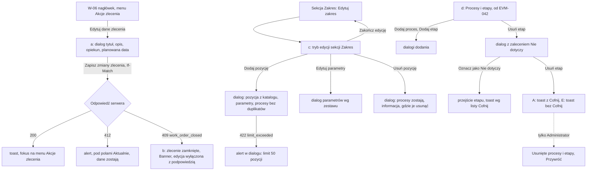

# 03 — Szczegóły zlecenia: „status na pierwszy rzut oka”

> Dokument żywy (EVM-004; edycja zlecenia, zakresu, procesów i etapów oraz zlecenie zamknięte — EVM-071, 2026-10-05) · przepływ AC2 nr 3 · kanały: web i mobile · ekrany: W-06 (z dialogami edycji — [makiety (a)–(d)](#w-06--edycja-zlecenia-evm-071)), M-03; dialog W-20 — [przepływ 14](14-edycja-lokalizacji-i-strony.md#w-20-edycja-lokalizacji-i-strony) · indeks: [README.md](README.md)
> Źródła: styleguide § 1 pkt 1 i 5, § 4.4; `domain-model.md` → `WorkOrder`, `ScopeItem`, `Procedure`, `ProcedureStage`, `PaymentMilestone`, „Stany i przejścia”, „Macierz encja × operacja × rola”; projekcja na telefonie: `offline-sync.md` → „Zakres synchronizacji urządzenia”; P6, SR-AUTHZ-08, SR-SYNC-04. Od EVM-071: decyzja 17 (README M1 → „Decyzje dla Konrada”), katalog i zestawy parametrów ([`service-catalog.md`](../../product/service-catalog.md) § 2–4), historyjki EVM-035, EVM-042, EVM-053, EVM-060; SR-AUTHZ-02, -04, -10, SR-DATA-02, SR-INPUT-01, -02, SR-API-07; konsultacja `security-engineer` w EVM-071 (S6, B1, B2).

## Przepływ


## W-06 Szczegóły zlecenia
- **Cel:** w kilka sekund odpowiedzieć: na jakim etapie jest zlecenie, na kogo czekamy i od kiedy, co jest po terminie, co nieopłacone — szczegóły procesów po rozwinięciu (styleguide § 1 pkt 1 i 5).
- **Główna akcja:** zależna od stanu zlecenia — najczęściej zmiana statusu etapu z odznaki (W-07); w nagłówku jedna akcja główna nie występuje (odznaka zlecenia jako menu przejść).
- **Hierarchia treści:** 1) nagłówek: numer, tytuł, odznaka statusu zlecenia, klient, lokalizacja, opiekun; 2) **karta podsumowania**: bieżące etapy · na kogo czekamy · terminy · płatności; 3) zakładki: **Przegląd** (procesy i etapy, płatności, zakres) · Dziennik ([W-08](05-wpis-i-komentarz.md#w-08-dziennik)) · Media i dokumenty ([W-09](06-galeria-i-upload.md#w-09-media-i-dokumenty)); 4) kolumna boczna: Klient, Lokalizacja (z „Inne zlecenia w tej lokalizacji”), Opiekun.

**Makieta (expanded, zakładka „Przegląd”)**
```text
Zlecenia / ZL-2026-0042
┌──────────────────────────────────────────────────────────────────────────────────────────┐
│ ZL-2026-0042 · Garaż — pełny proces                       «W realizacji ▾»          ⋮    │
│ Jan Przykładowy · ul. Testowa 7, 00-001 Warszawa · miejsce nr 15, poziom −1              │
│ Opiekun: Anna Testowa · Utworzono 01.09.2026                                             │
├──────────────────────────────────────────────────────────────────────────────────────────┤
│ Podsumowanie                                                                             │
│ ┌ Na jakim etapie ────────┐┌ Na kogo czekamy ─────────────┐┌ Terminy ─────┐┌ Płatności ──────────┐│
│ │ Uzgodnienia z OSD:      ││ ‹triangle-alert› Stoen        ││ Najbliższy:  ││ Nieopłacone:        ││
│ │  Warunki przyłączenia   ││ Operator (OSD) · od 15 dni    ││ 20.10.2026 — ││ 3 600,00 zł (1)     ││
│ │  «Czekamy na…»          ││ Wspólnota Mieszkaniowa        ││ Zgoda admin. ││ «Po terminie» 5 dni ││
│ │ Zgody administracji:    ││ „Zielony Dziedziniec”         ││ Po terminie: ││ Planowane: 3        ││
│ │  Zgoda administracji    ││ (Wspólnota / spółdzielnia)    ││ brak         ││ Opłacone: 0 z 4     ││
│ │  «Czekamy na…»          ││ · od 3 dni                    ││              ││                     ││
│ │ + 7 procesów            ││                               ││              ││                     ││
│ └─────────────────────────┘└───────────────────────────────┘└──────────────┘└─────────────────────┘│
├───────────────────────────────────────────────────────────────┬──────────────────────────┤
│ [Przegląd] [Dziennik (12)] [Media i dokumenty (48)]           │ Klient                   │
│                                                               │ Jan Przykładowy          │
│ Procesy i etapy (9)                        [Rozwiń wszystkie] │ +48 600 000 001          │
│ ▾ Uzgodnienia z OSD        2 z 7 etapów § 3.23                │ jan.przykladowy@example.com│
│    1 Pełnomocnictwo od klienta     «Zakończony»  02.09.2026   │ [Przejdź do klienta]     │
│    2 Wniosek do OSD                «Zakończony»  05.09.2026   │                          │
│    3 Warunki przyłączenia i        «Czekamy na… ▾»          ⋮ │ Lokalizacja   [Edytuj]   │
│      projekt umowy                 Czekamy na: Stoen Operator │ Garaż w budynku          │
│                                    (OSD) · od 15 dni ‹triangle-alert›                    │
│                                    Osoba odpowiedzialna:       │ wielorodzinnym           │
│                                    Anna Testowa                │                          │
│    4 Umowa z OSD podpisana…        «Do zrobienia ▾»         ⋮ │ ul. Testowa 7, 00-001    │
│    5 Prace sieciowe po stronie OSD «Do zrobienia ▾»         ⋮ │ Warszawa                 │
│    6 Zgłoszenie gotowości…         «Do zrobienia ▾»         ⋮ │ Miejsce nr 15, poziom −1 │
│    7 Wymiana licznika…             «Do zrobienia ▾»         ⋮ │ OSD: Stoen Operator    ⋮ │
│ ▸ Zgody administracji / wspólnoty  2 z 4 etapów  «Czekamy na…» Wspólnota … · od 3 dni  │
│ ▸ Ekspertyza techniczna            3 z 3 etapów  ‹circle-check› Wszystkie zakończone    │
│ ▸ Opinia ppoż                      2 z 2 etapów  ‹circle-check› Wszystkie zakończone    │
│ ▸ Projekt instalacji               1 z 2 etapów  «Czekamy na…» Projektant … · od 8 dni  │
│ ▸ … (4 kolejne)                                              │ Zarządca: Wspólnota … ⋮  │
│                                                               │ Moc przyłączeniowa: 40 kW│
│ Płatności                Nieopłacone 3 600,00 zł · Opłacone 0,00 zł                     │
│ Transza                Kwota        Status          Nr faktury       Termin             │
│ Zaliczka (20%)         3 600,00 zł  «Po terminie»   FV/TEST/0007/2026 08.09.2026 (5 dni) │
│                                     [Odnotuj wpłatę]                               ⋮    │
│ Po uzyskaniu zgód (30%)  —          «Planowana»     —                —                  │
│                                     [Wystaw fakturę]                               ⋮    │
│ Po wykonaniu instalacji (30%) —     «Planowana»     —                —            ⋮     │
│ Płatność końcowa (20%)   —          «Planowana»     —                —            ⋮     │
│ [+ Dodaj transzę]                                             │ PPE: PL-TEST-0001        │
│                                                               │ Notatki: wjazd od ul.    │
│ Zakres (9 pozycji)                       [Edytuj zakres]      │ Fikcyjnej, klucz u       │
│ · Dostawa ładowarki (z oferty) — AC, 11 kW, 3 fazy            │ administratora           │
│ · Instalacja zasilająca — obwód dedykowany, z WLZ             │                          │
│ · …                                                           │ Inne zlecenia w tej      │
│                                                               │ lokalizacji (1)          │
│                                                               │ ZL-2026-0017 · Garaż —   │
│                                                               │ sama instalacja          │
│                                                               │ «Rozliczone» 12.03.2026  │
└───────────────────────────────────────────────────────────────┴──────────────────────────┘
```

**Nagłówek — menu przejść zlecenia** (odznaka `«W realizacji ▾»`, ActionMenu — § 3.20; tylko przejścia z tabeli „Zlecenie” w `domain-model.md`)
| Ze stanu | Pozycje menu | Po wykonaniu |
|---|---|---|
| Nowe | „Rozpocznij wycenę”, „Zaakceptuj bez wyceny”, „Wstrzymaj…”, „Anuluj zlecenie…” | toast bez „Cofnij” (brak przejścia odwrotnego); „Wstrzymaj” — toast z „Cofnij” (wznowienie) |
| Wycena | „Zaakceptuj”, „Wstrzymaj…”, „Anuluj zlecenie…” | jw. |
| Zaakceptowane | „Rozpocznij realizację”, „Wstrzymaj…”, „Anuluj zlecenie…” | jw. |
| W realizacji | „Zakończ”, „Wstrzymaj…”, „Anuluj zlecenie…” | „Zakończ” — dialog z ostrzeżeniem o otwartych etapach (bez blokady), potem toast z „Cofnij” (ponowne otwarcie) |
| Wstrzymane | „Wznów”, „Anuluj zlecenie…” | „Wznów” — toast z „Cofnij” (wstrzymanie z tym samym powodem) |
| Zakończone | „Rozlicz…”, „Otwórz ponownie” | „Rozlicz…” — dialog z podsumowaniem; wyłączone, gdy któraś transza nie jest opłacona ani anulowana („Rozliczysz, gdy wszystkie transze będą opłacone albo anulowane.”); „Otwórz ponownie” — toast z „Cofnij” |
| Rozliczone, Anulowane | „Przywróć zlecenie…” | Administrator ↑ (W-04); Edytor — wyłączone z podpowiedzią „Przywrócić zlecenie może tylko administrator.” |

- **„Anuluj zlecenie…”** — dialog z podsumowaniem (§ 4.11): wymagany powód; skutek „Planowane transze (3) zostaną anulowane. Przywrócić zlecenie może tylko administrator.”; gdy jest transza wystawiona — dialog blokuje: „Najpierw odnotuj wpłatę albo poproś administratora o anulowanie faktury.” (`422 transition_condition_not_met`).
- **„Rozlicz…”** — dialog z podsumowaniem: liczba transz opłaconych i anulowanych, suma wpłat; „Cofnąć rozliczenie może tylko administrator.”
- **„Wstrzymaj…”** — dialog z wymaganym powodem; po wykonaniu toast „Wstrzymano zlecenie. [Cofnij]”.
- **Zlecenie Rozliczone / Anulowane** (decyzja 17): Banner (§ 3.19, `color.feedback.info.*`): „Zlecenie jest rozliczone — dane zlecenia, zakres, procesy i płatności są tylko do odczytu. Wpisy, zdjęcia, filmy i dokumenty nadal możesz dodawać.”; edycja danych zlecenia, zakresu, procesów i płatności wyłączona z podpowiedzią — makieta [W-06 (b)](#w-06-b-zlecenie-rozliczone-albo-anulowane).
- **Menu `⋮` nagłówka** („Akcje zlecenia: ZL-2026-0042”): „Edytuj dane zlecenia…” (tytuł, opis, opiekun, planowana data — dialog [W-06 (a)](#w-06-a-edytuj-dane-zlecenia), `If-Match`); **od EVM-060** także „Usuń zlecenie” w grupie niszczącej (Administrator; Edytor — wyłączone z podpowiedzią „Usunąć zlecenie może tylko administrator.”; z transzą wystawioną — `409 has_active_dependents`: „Nie można usunąć zlecenia z wystawioną fakturą.”; z transzą opłaconą — Administrator ↑, SR-AUTHZ-10). Przed EVM-060 menu ma jedną pozycję (README M1 — „UI pokazuje tylko to, co system robi”).

**Baner „Zlecenie założone w terenie”** (`origin = mobile_quick`, [przepływ 10](10-mobile-szybkie-zlecenie.md)) — Banner (§ 3.19, `color.feedback.info.*`, ikona `info`) nad kartą podsumowania, z odnośnikiem do każdej akcji uzupełnienia. Widoczny, dopóki zlecenie ma status „Nowe” (wyliczane, bez nowego pola; po pierwszym przejściu zlecenia znika). Odnośniki tylko dla A i E — Tylko odczyt widzi sam pierwszy wiersz.
```text
┃‹info› Zlecenie założone w terenie (Piotr Testowy, 03.10.2026).
┃ Uzupełnij dane: klienta · [lokalizacji] · kwoty transz ↓
┃                 └ link     └ przycisk     └ link do sekcji
```

Trzy odnośniki robią trzy różne rzeczy, więc mają **trzy różne komponenty i nazwy dostępne** (WCAG 4.1.2, 2.4.4) — użytkownik czytnika i klawiatury wie przed aktywacją, czy przejdzie na inną stronę, otworzy dialog, czy przewinie stronę:

| Odnośnik | Komponent | Prowadzi do | Nazwa dostępna i fokus | Co biuro uzupełnia |
|---|---|---|---|---|
| klienta | **Link** — nawigacja (`color.text.link`, podkreślony; `href` do szczegółów klienta) | [W-14](13-klienci.md#szczegóły-klienta) — szczegóły klienta (jak „Przejdź do klienta”) | „Uzupełnij dane klienta — przejdź do klienta”; po przejściu fokus na nagłówku W-14 (zwykła nawigacja), „wstecz” wraca do W-06 | e-mail, NIP, osoba kontaktowa, adres korespondencyjny, notatki |
| lokalizacji | **Button tertiary** (§ 3.1) z `aria-haspopup="dialog"` — wygląda jak przycisk tekstowy, bez podkreślenia | W-20 „Edytuj lokalizację” ([przepływ 14](14-edycja-lokalizacji-i-strony.md#dialog-edytuj-lokalizację)) | „Uzupełnij dane lokalizacji” (otwiera dialog); fokus w dialogu na pierwszym polu, po zamknięciu wraca do przycisku | poziom garażu, OSD, zarządca, moc przyłączeniowa, PPE, notatki |
| kwoty transz | **Link do sekcji na tej stronie** (`href="#platnosci"`, podkreślony, ikona `arrow-down` `size.icon.sm`) | przewinięcie do sekcji „Płatności” na tej stronie (mechanizm — niżej) | „Uzupełnij kwoty transz — przejdź do sekcji Płatności”; fokus na wyzwalaczu `⋮` pierwszej transzy „Planowana” bez kwoty („Akcje transzy: Po uzyskaniu zgód (30%)”), a gdy takiej transzy nie ma — na nagłówku sekcji „Płatności” | kwoty transz — „Zmień kwotę” z menu `⋮` transzy ([akcje płatności](08-nieoplacone.md#akcje-płatności--status--rola)) |

Kontrast odnośników na `color.feedback.info.bg` — 6,20:1 (styleguide § 2.1.4).

**Odnośnik „kwoty transz” — cel fokusu i mechanizm**
- **Dlaczego nie „Zmień kwotę”:** to pozycja menu `⋮` transzy (ActionMenu, § 3.20). Przy zamkniętym menu pozycji nie ma w drzewie dokumentu, więc nie może przyjąć fokusu. Sam `href="#platnosci"` przenosi tylko punkt startu nawigacji sekwencyjnej — nie ustawia fokusu na kontrolce.
- **Cel fokusu (w tej kolejności):**
  1. wyzwalacz `⋮` pierwszej wg kolejności w tabeli transzy „Planowana” bez kwoty — nazwa „Akcje transzy: Po uzyskaniu zgód (30%)”. Menu zostaje zamknięte. Enter albo Spacja otwiera je z fokusem na pierwszej pozycji — w menu transzy „Planowana” to „Zmień kwotę”, bo „Anuluj transzę…” i „Usuń transzę…” stoją na końcu, w osobnej grupie (§ 3.20);
  2. gdy takiej transzy nie ma — nagłówek sekcji „Płatności” (h2, `id="platnosci"`, `tabindex="-1"`). Tak jest, gdy wszystkie kwoty są już wpisane albo zlecenie nie ma transz; baner jest widoczny do końca statusu „Nowe”, więc odnośnik musi działać także wtedy. Z nagłówka Tab prowadzi do akcji sekcji („Dodaj transzę”, akcje transz).
- **Mechanizm:**
  - element `<a href="#platnosci">` — semantyka odnośnika na tej stronie i zapas: bez obsługi zdarzenia przeglądarka przewija do kotwicy;
  - obsługa aktywacji (kliknięcie, Enter): `preventDefault()`, potem przewinięcie nagłówka sekcji do widoku — `scroll-padding-top` kontenera przewijania równe wysokości przyklejonych pasków (WCAG 2.4.11); przewijanie płynne tylko bez `prefers-reduced-motion` (§ 2.9);
  - na koniec `focus()` na celu, z `preventScroll`, gdy cel jest już w widoku pod nagłówkiem; w przeciwnym razie bez tej opcji — przewinięcie przy fokusie też uwzględnia `scroll-padding`;
  - adres URL bez zmian i bez wpisu w historii — „wstecz” wraca do poprzedniej strony, jak wszędzie w W-06.
- **Widoczny fokus:** wyzwalacz `⋮` — stany IconButton (§ 3.1, `color.focus.ring`); nagłówek — pierścień `color.focus.ring` przy `:focus-visible` (aktywacja z klawiatury).
- **Responsywność:** na `breakpoint.compact` płatności to lista kart (§ 3.6). Celem jest `⋮` karty transzy, a menu otwiera się jako BottomSheet (§ 3.20).

**Karta „Lokalizacja” — edycja lokalizacji i stron (W-20 — makieta: [przepływ 14](14-edycja-lokalizacji-i-strony.md#w-20-edycja-lokalizacji-i-strony))**
- **„Edytuj”** w nagłówku karty (nazwa dostępna „Edytuj lokalizację”) otwiera dialog „Edytuj lokalizację” z polami sekcji „2. Lokalizacja” z [W-05](02-nowe-zlecenie-z-szablonu.md#w-05-nowe-zlecenie) i InlineAlert „Zmiana dotyczy wszystkich zleceń w tej lokalizacji (2).”; „Dodaj stronę” to widok w tym samym dialogu.
- **„Edytuj stronę…”** z menu `⋮` przy OSD i zarządcy („Akcje strony: Stoen Operator (OSD)”) — dialog „Edytuj stronę” z informacją o stronie wspólnej.
- Edycja lokalizacji i strony działa także w zleceniu „Rozliczone” / „Anulowane” — to nie są dane zlecenia ([14 → zasada 3](14-edycja-lokalizacji-i-strony.md#zasady-wspólne-przepływu-14)). Tylko odczyt — „Edytuj” i `⋮` stron ukryte.

**Karta podsumowania — reguły** (wszystko wyliczane z danych, bez nowych pól)
- **Na jakim etapie:** dla każdego procesu z otwartym etapem — bieżący etap (pierwszy otwarty wg `position`) z odznaką; maksymalnie 3 procesy, reszta jako „+ 7 procesów” (przewija do sekcji).
- **Na kogo czekamy:** wszystkie etapy w stanie `waiting`, sortowane od najdłuższego oczekiwania; format z § 4.4 („Czekamy na: Stoen Operator (OSD) · od 15 dni”, „Czekamy na: klient · od 3 dni”); powyżej 14 dni — `triangle-alert` + `color.text.warning`. Kafel pokazuje tylko faktyczne oczekiwania — bez pustych wierszy dla klienta czy stron (PO-3). Brak oczekiwań — „Piłka po naszej stronie — nie czekamy na nikogo.”
- **Terminy:** najbliższy `dueDate` otwartego etapu; etapy po terminie — `alarm-clock` + `color.text.error` (§ 4.2).
- **Płatności:** nieopłacone (liczba i suma transz `invoiced`), „Po terminie” (mocna odznaka i liczba dni), planowane, opłacone „x z y”.

**Stany**
| Stan | Zachowanie |
|---|---|
| Pusty | Zlecenie bez szablonu: w sekcji „Zakres” — „Zlecenie nie ma jeszcze pozycji zakresu.” (akcją jest „Edytuj zakres” w nagłówku sekcji — bez drugiego przycisku o tej samej nazwie); w sekcji „Procesy i etapy” — „Zlecenie nie ma jeszcze procesów. Procesy dochodzą razem z pozycjami zakresu.” (od EVM-042 także „Dodaj proces…” w nagłówku sekcji); „Brak transz. [Dodaj transzę]”; bez innych zleceń w lokalizacji — sekcja ukryta. |
| Ładowanie | Najpierw nagłówek (Skeleton tekstu), potem karta podsumowania (Skeleton czterech kafli) i sekcje (§ 4.12); zakładki doczytywane po wybraniu. |
| Błąd | Nie wczytano zlecenia — EmptyState `circle-alert` „Nie udało się wczytać zlecenia. [Spróbuj ponownie]”; nie wczytano sekcji — alert w sekcji z „Spróbuj ponownie”, pozostałe sekcje działają; `412 version_conflict` w dialogach edycji — zasada wspólna 16 ([W-06 (a)](#w-06-a-edytuj-dane-zlecenia)); **`412` przy przejściu zlecenia** (EVM-030 AC5, EVM-058 AC6) — InlineAlert błędu (`role="alert"`) „To zlecenie zmieniono w międzyczasie. Sprawdź jego aktualny stan i wybierz operację ponownie.”: przy pozycji menu odznaki bez dialogu — pod odznaką zlecenia z „Odśwież zlecenie” (Button tertiary; odświeża nagłówek i menu przejść, fokus na odznace — jak W-07); w dialogach „Wstrzymaj…”, „Anuluj zlecenie…”, „Rozlicz…”, „Zakończ” i „Przywróć zlecenie…” — nad treścią dialogu, a panel sam odświeża podsumowanie (nowy `ETag`), wpisany powód zostaje, fokus zostaje na przycisku operacji; `429` — wzór z README. |
| Offline | Baner § 4.10; dane widoczne z pamięci karty z banerem „Dane mogą być nieaktualne (z 14:05)”; akcje zmieniające dane wyłączone z podpowiedzią „Zmienisz po powrocie połączenia.” |
| Brak uprawnień | `404` — EmptyState „Nie znaleziono zlecenia. Mogło zostać usunięte albo nie masz do niego dostępu. [Wróć do listy]”, bez danych z listy; tytuł karty „Nie znaleziono · EVia Manager”. Tylko odczyt — wszystkie sekcje (z płatnościami) bez akcji: odznaki statyczne, brak `⋮`, „Dodaj transzę”, „Edytuj zakres”, „Edytuj” w karcie „Lokalizacja” i odnośników w banerze „Zlecenie założone w terenie”. Edytor — akcje Administratora wyłączone z podpowiedzią. |

**Role**
| Akcja | Komenda / przejście | A | E | R |
|---|---|---|---|---|
| Podgląd wszystkich sekcji (z płatnościami) | odczyt `WorkOrder` i encji podrzędnych | tak | tak | tak |
| Przejścia zlecenia (bez przywrócenia) | tabela „Zlecenie”: `new→quoting`, `new→accepted`, `quoting→accepted`, `accepted→in_progress`, `active→on_hold`, `on_hold→active`, `active/on_hold→cancelled`, `in_progress→completed`, `completed→in_progress`, `completed→settled` | tak | tak | ukryte |
| Przywróć zlecenie | `settled→completed`, `cancelled→on_hold` | tak ↑ | wyłączone | ukryte |
| Edytuj dane zlecenia | edycja `WorkOrder` (pola niekontrolowane przez serwer; zlecenie zamknięte — `409 work_order_closed`) — [W-06 (a)](#w-06-a-edytuj-dane-zlecenia) | tak | tak | ukryte |
| Usuń zlecenie (od EVM-060) | soft delete `WorkOrder` (z transzą `paid` — A ↑, SR-AUTHZ-10) | tak (↑ przy transzy opłaconej) | wyłączone | ukryte |
| Zmień status etapu | W-07 — tabela „Etap procesu” | tak | tak | ukryte (odznaki statyczne) |
| Akcje płatności, „Dodaj transzę”, „Zmień kwotę” | [W-11 — tabela akcji płatności](08-nieoplacone.md#akcje-płatności--status--rola), [dialogi transz](08-nieoplacone.md#dialogi-dodaj-transzę-i-zmień-kwotę) | wg tabeli | wg tabeli | ukryte |
| Edytuj zakres (dodaj pozycję, edytuj parametry, usuń pozycję) | edycja `ScopeItem` — [W-06 (c)](#w-06-c-edytuj-zakres) | tak | tak | ukryte |
| Dodaj / usuń proces lub etap (od EVM-042) | utworzenie i soft delete `Procedure`, `ProcedureStage` — [W-06 (d)](#w-06-d-procesy-i-etapy--dodanie-usunięcie-przywrócenie) | tak | tak | ukryte |
| Przywróć proces lub etap (od EVM-042) | przywrócenie `Procedure`, `ProcedureStage` | tak | — (sekcja niewidoczna) | — |
| Edytuj lokalizację | edycja `Site` (`If-Match`) — [W-20](14-edycja-lokalizacji-i-strony.md#dialog-edytuj-lokalizację) z karty „Lokalizacja” albo (od E13) z banera `mobile_quick`; „Zmiana dotyczy wszystkich zleceń w tej lokalizacji (n).” | tak | tak | ukryte |
| Edytuj stronę (OSD, zarządca) | edycja `Party` (`If-Match`) — [W-20](14-edycja-lokalizacji-i-strony.md#dialog-edytuj-stronę) z menu `⋮` przy stronie; „Strona jest wspólna — zmiana będzie widoczna we wszystkich lokalizacjach i zleceniach z tą stroną.” | tak | tak | ukryte |
| Dodaj stronę (w W-20) | utworzenie `Party` (jak W-05) | tak | tak | ukryte |
| Inne zlecenia w tej lokalizacji | odczyt listy zleceń z filtrem `siteId` tą samą polityką co lista (SR-AUTHZ-03, SR-AUTHZ-08) | tak | tak | tak |

**„Inne zlecenia w tej lokalizacji” (SR-AUTHZ-08, SR-AUTHZ-03)**
- Wiersz: **tylko** numer, tytuł, odznaka statusu i data zamknięcia (`closedAt`) — bez nazwy i kontaktu klienta innego zlecenia i bez miniatur.
- Licznik „(1)” liczony tą samą polityką co lista zleceń (nie widać zleceń poza uprawnieniami).
- Kliknięcie otwiera W-06 innego zlecenia przez zwykłą autoryzację — zlecenie niedostępne → `404` „Nie znaleziono zlecenia”.
- Tylko panel; na telefonie sekcji nie ma. Pełna „historia lokalizacji” (dokumenty i zdjęcia poprzednich zleceń) — kandydat do backlogu (EVM-010).

- **Responsywność:** `breakpoint.wide` — kolumna boczna szersza, tabela płatności ze wszystkimi kolumnami; `breakpoint.expanded` — jak makieta (treść 8 kolumn siatki + boczna 4); `breakpoint.medium` — jedna kolumna: nagłówek, podsumowanie (kafle 2 × 2), karty Klient i Lokalizacja pod podsumowaniem, tabela płatności bez kolumny „Nr faktury” (w szczegółach wiersza); `breakpoint.compact` — kafle podsumowania jeden pod drugim, zakładki przewijane poziomo, płatności jako lista kart (§ 3.6), etapy jako lista prosta.
- **Komponenty i tokeny:** Breadcrumbs, Tabs (§ 3.17); nagłówek `text.heading-1` (numer i tytuł), metadane `text.body-sm` `color.text.secondary`; StatusBadge (§ 3.9) — statyczna i jako przycisk, wariant mocny „Rozliczone”, „Po terminie”, tokeny `color.status.order.*`, `color.status.stage.*`, `color.status.payment.*`; ActionMenu (§ 3.20); Card (§ 3.8) — karta podsumowania (`space.inset.lg`, `radius.card`, `color.border.default`), karty boczne; Disclosure (§ 3.21); ProcedureProgress (§ 3.23, `color.progress.*`); DataTable (§ 3.6) — płatności, kwoty `text.numeric` do prawej, sumy `text.numeric-lg`; List (§ 3.6) — etapy; Banner / InlineAlert (§ 3.19) — także baner „Zlecenie założone w terenie” `color.feedback.info.*` z odnośnikami: Link `color.text.link`, Button tertiary z `aria-haspopup="dialog"`, link do sekcji (tabela odnośników wyżej); Button tertiary (§ 3.1) „Edytuj” w nagłówku karty „Lokalizacja”; Dialog (§ 3.13) — anulowanie, rozliczenie, wstrzymanie, W-20 (`size.dialog.width.md`, pola i Combobox z W-05); Toast (§ 3.14) z „Cofnij”; ikony `triangle-alert` `color.icon.warning`, `alarm-clock` `color.icon.error`, `circle-check` `color.icon.success`; odznaka wartości nieznanej (§ 3.9.1, `color.status.unknown.*`) — zawsze statyczna, akcje zależne od statusu wyłączone z podpowiedzią; odstępy `space.stack.md`, `space.inline.md`.
- **Mikrocopy:** „Podsumowanie” · „Na jakim etapie” · „Na kogo czekamy” · „Czekamy na: Stoen Operator (OSD) · od 15 dni” · „Piłka po naszej stronie — nie czekamy na nikogo.” · „Terminy” · „Najbliższy:” · „Po terminie:” · „Płatności” · „Nieopłacone:” · „Opłacone: 0 z 4” · „Procesy i etapy (9)” · „2 z 7 etapów” · „Wszystkie zakończone” · „Osoba odpowiedzialna: Anna Testowa” · „Rozwiń wszystkie” · „Inne zlecenia w tej lokalizacji (1)” · „Przejdź do klienta” · „Edytuj” (karta „Lokalizacja”) · „Edytuj lokalizację” · „Edytuj stronę” · „Zmiana dotyczy wszystkich zleceń w tej lokalizacji (2).” · „Strona jest wspólna — zmiana będzie widoczna we wszystkich lokalizacjach i zleceniach z tą stroną.” · „Zlecenie założone w terenie (Piotr Testowy, 03.10.2026).” · „Uzupełnij dane: klienta · lokalizacji · kwoty transz” · toasty: „Wstrzymano zlecenie. [Cofnij]”, „Zakończono zlecenie. [Cofnij]”, „Zapisano zmiany lokalizacji.”, „Zapisano zmiany strony.” · `412` przejścia zlecenia: „To zlecenie zmieniono w międzyczasie. Sprawdź jego aktualny stan i wybierz operację ponownie.” · „Odśwież zlecenie”
- **Dostępność:** nagłówki sekcji w hierarchii (h1 numer i tytuł, h2 sekcje, h3 procesy); karta podsumowania jako region z nazwą „Podsumowanie zlecenia”; odznaki z pełną nazwą dostępną („Status zlecenia: W realizacji, zmień status”); rozwinięcia `aria-expanded`; tabela płatności z `aria-sort` i nagłówkami wierszy; liczby dni jako tekst, nie tylko ikona; tytuł karty „ZL-2026-0042 · EVia Manager” (bez nazwiska i adresu); odnośniki banera — trzy komponenty z różnymi nazwami dostępnymi (tabela odnośników banera); nagłówki sekcji procesów z nazwą dostępną „Uzgodnienia z OSD, 2 z 7 etapów, czekamy na Stoen Operator (OSD) od 15 dni” (§ 3.21); `⋮` przy stronie z nazwą „Akcje strony: Stoen Operator (OSD)”; po zapisie W-20 fokus wraca do przycisku, który otworzył dialog.

### W-06 — edycja zlecenia (EVM-071)
Makiety (a)–(d) uzupełniają W-06 o edycję danych zlecenia i zakresu (EVM-035), procesy i etapy (EVM-042) oraz stan zlecenia zamkniętego (decyzja 17). Dialogi transz („Dodaj transzę”, „Zmień kwotę”) są w [08](08-nieoplacone.md#dialogi-dodaj-transzę-i-zmień-kwotę), obok wspólnej tabeli akcji płatności. Funkcje późniejszych historyjek mają warianty „przed / od EVM-0xx” (README M1 — „UI pokazuje tylko to, co system robi”). Wspólne dla (a)–(d): konflikt `412` — [README → zasada wspólna 16](README.md#bezpieczeństwo-i-prywatność-w-ui); zamknięcie dialogu z niezapisanymi zmianami — zasada 17; trzy stany wyzwalacza `⋮` — zasada 20; egzekwowanie zawsze po stronie serwera, UI tylko odzwierciedla reguły.



### W-06 (a) Edytuj dane zlecenia
- **Cel:** poprawić tytuł, opis, opiekuna i planowaną datę zlecenia (EVM-035 AC1).
- **Główna akcja:** „Zapisz zmiany zlecenia” (primary w dialogu).
- **Hierarchia treści:** 1) tytuł dialogu i numer zlecenia, 2) Tytuł z podpowiedzią, 3) Opis z ostrzeżeniem, 4) Opiekun, 5) Planowana data, 6) akcje.
- **Wejście:** menu `⋮` nagłówka „Akcje zlecenia: ZL-2026-0042” → „Edytuj dane zlecenia…”.

```text
 Dialog „Edytuj dane zlecenia” (size.dialog.width.md):
 │ Edytuj dane zlecenia                                              [x]
 │ ZL-2026-0042
 │ Tytuł [Garaż — pełny proces____________________________]
 │ Bez nazwisk i adresów — klienta i lokalizację wskazujesz osobno.
 │ Opis (opcjonalnie)
 │ [Trasa kabla przez szacht B, rozdzielnica na poziomie −1.__________]
 │ Nie wpisuj PESEL, numerów dokumentów ani kodów do bram i alarmów.
 │ Opiekun [Anna Testowa ▾]
 │ Planowana data (opcjonalnie) [20.10.2026 ‹calendar›]
 │                                   [Anuluj]  [[ Zapisz zmiany zlecenia ]]

 Po 412 — nad polami InlineAlert błędu, pod zmienionymi polami „Aktualnie: …”:
 │ ┃‹circle-alert› To zlecenie zmieniono w międzyczasie. Twoje zmiany
 │ ┃ zachowaliśmy — sprawdź aktualne wartości i zapisz ponownie.
 │ Planowana data (opcjonalnie) [20.10.2026 ‹calendar›]
 │ Aktualnie: 27.10.2026                            ← zwykły tekst, text.body-sm
```

| Pole | Kontrolka | Reguły |
|---|---|---|
| Tytuł | TextField (§ 3.2) | wymagany, limit długości z planu EVM-035; podpowiedź „Bez nazwisk i adresów — klienta i lokalizację wskazujesz osobno.” — tytuł trafia do list, W-11, wyszukiwania i na telefon (ustalenie B1) |
| Opis (opcjonalnie) | TextArea (§ 3.2) | zwykły tekst; podpowiedź z zasady wspólnej 8 (SR-DATA-02, B1) |
| Opiekun | Combobox osób (§ 3.3) — lista `id`, `displayName` | wymagany jak w W-05; czy może zostać pusty — plan EVM-035 (wtedy opcja „Bez opiekuna” na początku listy) |
| Planowana data (opcjonalnie) | DatePicker (§ 3.5) | `DD.MM.RRRR`; pole można wyczyścić |

- **Zapis:** `PATCH` z `If-Match`; toast „Zapisano zmiany zlecenia.”; w dzienniku zlecenia wpis zdarzenia z nazwami zmienionych pól, bez wartości („Zmiana danych zlecenia: tytuł, planowana data” — EVM-035 AC7, § 4.5).
- **Konflikt `412`** — „To zlecenie zmieniono w międzyczasie. Twoje zmiany zachowaliśmy — sprawdź aktualne wartości i zapisz ponownie.” (zasada wspólna 16; brzmienie EVM-035 AC1 „Ktoś zmienił…” — EVM-071 → „Uwagi do rozważenia”).
- **Zlecenie zamknięte w trakcie edycji** (`409 work_order_closed`): alert w dialogu „Zlecenie jest już rozliczone — dane zmienisz po przywróceniu zlecenia.” (albo „Zlecenie jest już anulowane — …”; Edytor: „…przez administratora.”), „Zapisz zmiany zlecenia” wyłączony, dane zostają do „Anuluj”.

| Moment | Fokus |
|---|---|
| otwarcie | pole „Tytuł” |
| „Anuluj”, `x`, Esc | wyzwalacz `⋮` „Akcje zlecenia: ZL-2026-0042” |
| sukces | wyzwalacz `⋮` „Akcje zlecenia: …”; wynik ogłasza toast (`role="status"`) |
| `412`, `409`, błąd | alert (`role="alert"`), potem pierwsze pole z „Aktualnie: …” |

**Stany**
| Stan | Zachowanie |
|---|---|
| Pusty | nd. — dialog edytuje istniejące zlecenie; puste pola opcjonalne bez wartości. |
| Ładowanie | Pola z danymi nagłówka od razu (bez dodatkowego odczytu); opiekunowie — Skeleton 3 wierszy w comboboxie; zapis — przycisk w stanie ładowania. |
| Błąd | Walidacja pod polami + podsumowanie (§ 4.1): „Podaj tytuł zlecenia.”, „Wybierz opiekuna.”; `412`, `409` — wyżej; `429` — wzór z README; błąd serwera — § 6.4 („Nie udało się zapisać zmian zlecenia…”). |
| Offline | Pozycja „Edytuj dane zlecenia…” (wyzwalacz `⋮`) wyłączona z podpowiedzią „Zmienisz po powrocie połączenia.”; otwarty dialog — dane w pamięci karty, „Zapisz zmiany zlecenia” wyłączony z podpowiedzią „Zapiszesz po powrocie połączenia.” |
| Brak uprawnień | Tylko odczyt — brak wyzwalacza `⋮` (`403` przy żądaniu spoza UI); zlecenie zamknięte — [W-06 (b)](#w-06-b-zlecenie-rozliczone-albo-anulowane); pola kontrolowane przez serwer (`number`, `status`) nie są w dialogu (`400` `read_only_field` — EVM-035 AC8). |

**Role**
| Akcja | Operacja | A | E | R |
|---|---|---|---|---|
| Edytuj dane zlecenia | `PATCH` `WorkOrder` (`title`, `description`, opiekun, `plannedDate`) z `If-Match` | tak | tak | ukryte (`403`) |
| — w zleceniu „Rozliczone” / „Anulowane” | `409 work_order_closed` (decyzja 17) | wyłączone | wyłączone | ukryte |

- **Responsywność:** `breakpoint.medium` i szersze — dialog `size.dialog.width.md`; `breakpoint.compact` — dialog pełnoekranowy (§ 3.13), przyciski na dole na pełną szerokość, combobox jako arkusz dolny.
- **Komponenty i tokeny:** Dialog (§ 3.13) `size.dialog.width.md`, tytuł `text.heading-3`, numer `text.body-sm` `color.text.secondary`; TextField, TextArea (§ 3.2) z podpowiedziami `color.text.tertiary`; Combobox (§ 3.3); DatePicker (§ 3.5); InlineAlert (§ 3.19) `color.feedback.error.*`; „Aktualnie: …” `text.body-sm` `color.text.secondary`; Button primary / tertiary (§ 3.1); Toast (§ 3.14).
- **Mikrocopy:** „Edytuj dane zlecenia…” · „Edytuj dane zlecenia” · „Tytuł” · „Bez nazwisk i adresów — klienta i lokalizację wskazujesz osobno.” · „Opis (opcjonalnie)” · „Opiekun” · „Planowana data (opcjonalnie)” · „Zapisz zmiany zlecenia” · „Zapisano zmiany zlecenia.” · „To zlecenie zmieniono w międzyczasie. Twoje zmiany zachowaliśmy — sprawdź aktualne wartości i zapisz ponownie.” · „Aktualnie: …” · „Zlecenie jest już rozliczone — dane zmienisz po przywróceniu zlecenia.” (albo „…już anulowane — …”) · „Podaj tytuł zlecenia.” · „Wybierz opiekuna.”
- **Dostępność:** pułapka fokusu, `aria-labelledby` (tytuł), fokus wg tabeli; podpowiedzi i „Aktualnie: …” w `aria-describedby` pól (najpierw błąd, potem podpowiedź); Esc = „Anuluj” (przy zmianach — zasada wspólna 17).

### W-06 (b) Zlecenie rozliczone albo anulowane
- **Cel:** od razu pokazać, że zlecenie jest zamknięte, co jest tylko do odczytu i co nadal działa (decyzja 17; EVM-035 AC6, EVM-042 AC4, EVM-053 AC5).
- **Główna akcja:** brak nowej — dla Administratora „Przywróć zlecenie…” z menu statusu (tabela przejść wyżej, W-04).
- **Hierarchia treści:** 1) nagłówek z odznaką «Rozliczone» / «Anulowane», 2) Banner pod nagłówkiem, 3) sekcje jak zwykle — akcje edycji wyłączone z podpowiedzią, akcje dodawania wpisów, mediów i dokumentów dostępne.

```text
 ZL-2026-0017 · Garaż — sama instalacja                «Rozliczone ▾»            ⋮ (wyłączony)
 ┃‹info› Zlecenie jest rozliczone — dane zlecenia, zakres, procesy i płatności są tylko
 ┃ do odczytu. Wpisy, zdjęcia, filmy i dokumenty nadal możesz dodawać.
 ┃ (A) Zmienisz je po przywróceniu zlecenia — menu statusu zlecenia.
 ┃ (E) Przywrócić zlecenie może tylko administrator.

 Zakres (7 pozycji)                                   [Edytuj zakres] (wyłączony)
 Procesy i etapy (7)                                  [Dodaj proces…] (wyłączony, od EVM-042)
   Wymiana licznika…   «Zakończony» (statyczna, wyłączona)     ⋮ (wyłączony)
 Płatności             akcje i „Dodaj transzę” wyłączone
 [Dziennik (12)] [Media i dokumenty (31)]  ← dostępne: wpis, komentarz, zdjęcia, filmy, dokumenty
 Karta „Lokalizacja”: [Edytuj] i ⋮ stron — dostępne (lokalizacja nie jest daną zlecenia)
```

**Banner — warianty** (§ 3.19, `color.feedback.info.*`, ikona `info`; pierwsze zdanie dla wszystkich ról, drugie wg roli)
| Status | Pierwsze zdanie | A | E | R |
|---|---|---|---|---|
| Rozliczone | „Zlecenie jest rozliczone — dane zlecenia, zakres, procesy i płatności są tylko do odczytu. Wpisy, zdjęcia, filmy i dokumenty nadal możesz dodawać.” | „Zmienisz je po przywróceniu zlecenia — menu statusu zlecenia.” | „Przywrócić zlecenie może tylko administrator.” | pierwsze zdanie bez części o dodawaniu: „Zlecenie jest rozliczone — dane zlecenia, zakres, procesy i płatności są tylko do odczytu.” |
| Anulowane | „Zlecenie jest anulowane — …” (dalej jak wyżej) | jw. | jw. | jw. („…jest anulowane — …”) |

**Elementy W-06 w zleceniu zamkniętym** (podpowiedź = „Zlecenie jest rozliczone” albo „…anulowane” + obszar; Administrator — „…po przywróceniu zlecenia.”; Edytor — z dopiskiem „przez administratora”, przy płatnościach — „Przywrócić zlecenie może tylko administrator.”)
| Element | A | E | R |
|---|---|---|---|
| Wyzwalacz `⋮` „Akcje zlecenia” (przed EVM-060 — tylko „Edytuj dane zlecenia…”) | wyłączony z podpowiedzią „Zlecenie jest rozliczone — dane zmienisz po przywróceniu zlecenia.”; od EVM-060 — menu aktywne: „Edytuj dane zlecenia…” wyłączone z tą podpowiedzią, „Usuń zlecenie” wg tabeli „Role” | wyłączony z podpowiedzią „Zlecenie jest rozliczone — dane zmienisz po przywróceniu zlecenia przez administratora.” (rozstrzygnięcie 2) | brak wyzwalacza |
| Odznaka zlecenia `«Rozliczone ▾»` | „Przywróć zlecenie…” ↑ | „Przywróć zlecenie…” wyłączone: „Przywrócić zlecenie może tylko administrator.” | statyczna |
| „Edytuj zakres” | wyłączony: „Zlecenie jest rozliczone — zakres zmienisz po przywróceniu zlecenia.” | jw. + „przez administratora” | ukryty |
| „Dodaj proces…”, wyzwalacze `⋮` procesów i etapów (od EVM-042) | wyłączone: „…procesy zmienisz po przywróceniu zlecenia.” | jw. + „przez administratora” | ukryte |
| Odznaki etapów (W-07) | wyłączone: „Zlecenie jest rozliczone — status etapu zmienisz po przywróceniu zlecenia.” ([04](04-aktualizacja-etapu.md#w-07-zmiana-statusu-etapu)) | wyłączone: „Zlecenie jest rozliczone — status etapu zmienisz po przywróceniu zlecenia przez administratora.” | statyczne |
| „Usunięte procesy i etapy (n)” (od EVM-042) | widoczne, „Przywróć” wyłączone z podpowiedzią jak procesy | — | — |
| Akcje płatności, „Dodaj transzę”, „Zmień kwotę” | wyłączone: „Zlecenie jest rozliczone — płatności są tylko do odczytu. Zmienisz je po przywróceniu zlecenia.” ([08](08-nieoplacone.md#akcje-płatności--status--rola)) | wyłączone: „Zlecenie jest rozliczone — płatności są tylko do odczytu. Przywrócić zlecenie może tylko administrator.” | ukryte |
| Dziennik (W-08) — wpis, komentarz | dostępne | dostępne | podgląd |
| Media i dokumenty (W-09) — zdjęcia, filmy, dokumenty, także z przeglądarki telefonu | dostępne (`domain-model.md` → `WorkOrder`: „nic nie ginie”) | dostępne | podgląd |
| Karta „Lokalizacja” — „Edytuj”, „Edytuj stronę…” | dostępne ([14 → zasada 3](14-edycja-lokalizacji-i-strony.md#zasady-wspólne-przepływu-14)) | dostępne | ukryte |
| „Przejdź do klienta” | dostępne | dostępne | dostępne |

**Stany**
| Stan | Zachowanie |
|---|---|
| Pusty | nd. — stan zamknięcia wynika ze statusu zlecenia; puste sekcje jak w W-06. |
| Ładowanie | Banner pojawia się razem z nagłówkiem (status jest w pierwszej odpowiedzi); przyciski edycji od początku wyłączone — bez mignięcia stanu aktywnego. |
| Błąd | Zlecenie zamknięte w innej karcie w trakcie edycji: odpowiedź `409 work_order_closed` → alert w miejscu operacji (dialog, tryb edycji zakresu) z treścią podpowiedzi, potem odświeżenie W-06 z Bannerem; dane z dialogu zostają do „Anuluj”. `412` przy „Przywróć zlecenie…” — jak przejścia zlecenia ([W-06 → „Stany” → „Błąd”](#w-06-szczegóły-zlecenia)). `429` przy operacjach dostępnych w zleceniu zamkniętym (wpis i komentarz — [W-08](05-wpis-i-komentarz.md#w-08-dziennik), zdjęcia, filmy i dokumenty — [W-09](06-galeria-i-upload.md#w-09-media-i-dokumenty)) — wzór z README: „Zbyt wiele zapytań. Spróbuj ponownie za 1 min.” (czas z `Retry-After`), wpisane dane zostają. |
| Offline | Banner zamknięcia zostaje; dodatkowo baner § 4.10; akcje dodawania (wpis, zdjęcia) wyłączone z podpowiedzią „…po powrocie połączenia.” |
| Brak uprawnień | Tylko odczyt — Banner bez części o dodawaniu; akcje ukryte jak w otwartym zleceniu. Edytor — „Przywróć zlecenie…” wyłączone z podpowiedzią. |

**Role**
| Akcja | Operacja | A | E | R |
|---|---|---|---|---|
| Edycja danych zlecenia, zakresu, procesów, etapów i płatności | `409 work_order_closed` (decyzja 17) | wyłączone z podpowiedzią | wyłączone z podpowiedzią | ukryte |
| Przywróć zlecenie | `settled→completed`, `cancelled→on_hold` | tak ↑ | wyłączone | ukryte |
| Wpis, komentarz, media, dokumenty | `CreateNote`, utworzenie `MediaAsset`, `Document` | tak | tak | — |
| Edycja lokalizacji i strony | edycja `Site`, `Party` | tak | tak | ukryte |

- **Responsywność:** Banner na pełną szerokość treści pod nagłówkiem; `breakpoint.compact` — Banner nad zakładkami, tekst zawijany, bez skracania.
- **Komponenty i tokeny:** Banner (§ 3.19) `color.feedback.info.*`, ikona `info`, obrys `border-width.indicator`; StatusBadge (§ 3.9) mocna „Rozliczone” (`color.status.order.settled.*`), „Anulowane” (`color.status.order.cancelled.*`); przyciski wyłączone — stany § 3.1 (`aria-disabled`, podpowiedź); ActionMenu (§ 3.20) — wyzwalacz wyłączony.
- **Mikrocopy:** teksty Bannera z tabeli · „Zlecenie jest rozliczone — dane zmienisz po przywróceniu zlecenia.” · „…zakres zmienisz po przywróceniu zlecenia.” · „…procesy zmienisz po przywróceniu zlecenia.” · „…status etapu zmienisz po przywróceniu zlecenia.” · „…płatności są tylko do odczytu. Zmienisz je po przywróceniu zlecenia.” · „…przez administratora.” · „Przywrócić zlecenie może tylko administrator.”
- **Dostępność:** Banner jako region z nazwą „Stan zlecenia” — ogłaszany przy wczytaniu strony, bez `role="alert"`; wyłączone przyciski i wyzwalacze osiągalne klawiaturą (`aria-disabled`) z podpowiedzią czytaną przez czytnik; podpowiedzi nie ujawniają danych spoza widoku.

### W-06 (c) Edytuj zakres
- **Cel:** dopasować zakres do tego, co faktycznie robimy — dodać pozycję z katalogu z jej procesami, poprawić parametry, usunąć zbędną pozycję albo opisać usługę spoza katalogu (EVM-035 AC2–AC5; luka L7).
- **Główna akcja:** „Dodaj pozycję…” w trybie edycji; w dialogach — „Dodaj pozycję”, „Zapisz parametry”, „Usuń pozycję” (danger).
- **Hierarchia treści:** 1) nagłówek sekcji „Zakres — edycja (n pozycji)” z „Dodaj pozycję…” i „Zakończ edycję”, 2) zdanie o zapisie, 3) lista pozycji z parametrami i menu `⋮`.
- **Tryb edycji sekcji, nie duży dialog** (rozstrzygnięcie 6): „Edytuj zakres” przełącza sekcję „Zakres” w tryb edycji, a „Dodaj pozycję…” i „Edytuj parametry…” to dialogi — bez dialogu na dialogu (§ 3.13). Każda operacja zapisuje się od razu osobnym żądaniem (`If-Match`, toast). „Zakończ edycję” wraca do widoku; fokus wraca na „Edytuj zakres”.

```text
 Widok (zakładka „Przegląd”, zlecenie ZL-2026-0051 „Dom — sam montaż”):
 Zakres (3 pozycje)                                              [Edytuj zakres]
 · Ładowarka klienta — AC, 11 kW, 3 fazy
 · Montaż i uruchomienie ładowarki — na ścianie, bez równoważenia obciążenia
 · Pomiary i odbiór

 Tryb edycji (fokus na nagłówku „Zakres — edycja”):
 Zakres — edycja (3 pozycje)            [‹plus› Dodaj pozycję…]  [Zakończ edycję]
 Każda zmiana zapisuje się od razu.
 Ładowarka klienta                                                             ⋮
   AC · 11 kW · 3 fazy · gniazdo
 Montaż i uruchomienie ładowarki                                               ⋮
   na ścianie · równoważenie obciążenia: nie · łączność: Wi-Fi
 Pomiary i odbiór                                                              ⋮
   bez parametrów
 Menu „Akcje pozycji: Ładowarka klienta”:
 │ Edytuj parametry…                 ← pozycja bez zestawu parametrów: „Edytuj notatki…”;
 │ ─────────────────────                „Inna usługa”: „Edytuj opis…”
 │ Usuń pozycję…                     ← grupa niszcząca

 Dialog „Dodaj pozycję” (size.dialog.width.lg) — wariant A z EVM-002, brak gotowego zasilania:
 │ Dodaj pozycję zakresu                                                [x]
 │ ZL-2026-0051 · Dom — sam montaż
 │ Pozycja z katalogu [Instalacja zasilająca (obwód dedykowany lub istniejący) ▾]
 │   grupy: Urządzenia · Instalacja i montaż · Formalności i uzgodnienia ·
 │   Projekt i ekspertyzy · Pomiary i odbiór · Inne
 │ Parametry techniczne
 │ Parametry to dane techniczne — nie wpisuj PPE, numerów liczników ani nazwisk.
 │ Obwód dedykowany          (•) Tak  ( ) Nie
 │ Zasilanie z WLZ budynku   ( ) Tak  (•) Nie
 │ Długość kabla (opcjonalnie)                 [18__] m
 │ Przekrój kabla (opcjonalnie)                [6___] mm²
 │ Wyłącznik różnicowoprądowy (opcjonalnie)    [Typ A EV ▾]
 │ Zabezpieczenie nadprądowe (opcjonalnie)     [32__] A
 │ Notatki do pozycji (opcjonalnie) [______________________________]
 │ Nie wpisuj PESEL, numerów dokumentów ani kodów do bram i alarmów.
 │ Procesy z tą pozycją
 │ [x] Instalacja zasilająca — 3 etapy „Do zrobienia”
 │                                              [Anuluj]  [[ Dodaj pozycję ]]

 Przykład duplikatu — zlecenie „Dom — pełny pakiet” + pozycja „Uzgodnienia z OSD”:
 │ Procesy z tą pozycją
 │ ‹circle-check› Uzgodnienia z OSD — już jest w zleceniu, nie dodamy drugiego.

 „Inna usługa (opis w zleceniu)” — pozycja bez parametrów i procesów:
 │ Pozycja z katalogu [Inna usługa (opis w zleceniu) ▾]
 │ Opis usługi [Wymiana zabezpieczenia w rozdzielnicy garażowej__________]
 │ Nie wpisuj PESEL, numerów dokumentów ani kodów do bram i alarmów.
 │ Ta pozycja nie wnosi procesów. Etapy dodasz w „Procesy i etapy”.   ← od EVM-042

 AlertDialog „Usuń pozycję…” (size.dialog.width.sm, wariant danger):
 │ Usunąć pozycję „Instalacja zasilająca”?
 │ Pozycja zniknie z zakresu zlecenia.
 │ Procesy dodane z tą pozycją zostają: Instalacja zasilająca (3 etapy).
 │ przed EVM-042: Zbędne etapy oznacz jako „Nie dotyczy” w menu statusu etapu.
 │ od EVM-042:    Usuniesz je w sekcji „Procesy i etapy” → menu procesu → „Usuń proces…”.
 │                                              [Anuluj]  [Usuń pozycję]  ← danger
```

**Dodaj pozycję — zasady** (EVM-035 AC2, AC4, AC5; `domain-model.md` → `ScopeItem`)
- **Katalog:** Combobox z grupami wg kategorii (`service-catalog.md` § 1–2), tylko pozycje aktywne. Po wyborze dialog pokazuje parametry z zestawu pozycji z wartościami domyślnymi; pozycja bez zestawu — tylko „Notatki do pozycji (opcjonalnie)”. Ilość — domyślnie 1, bez pola w M1.
- **Parametry jako kontrolki typowane** (ustalenie B2; SR-INPUT-01, -02): tak / nie — radio; wartości z listy — Select z etykietami polskimi; liczby — TextField liczba z jednostką w sufiksie („m”, „mm²”, „A”, „kW”). Nad parametrami podpowiedź „Parametry to dane techniczne — nie wpisuj PPE, numerów liczników ani nazwisk.” (EVM-035 AC4). Wyjątek do planu EVM-035: zestaw `charger_spec` ma w katalogu pola tekstowe „Producent” i „Model” — rekomendacja: krótkie pole z limitem długości i tą samą podpowiedzią (EVM-071 → „Uwagi do rozważenia”).
- **Etykiety zestawu `supply_circuit`** (wg `service-catalog.md` § 3): „Obwód dedykowany” · „Zasilanie z WLZ budynku” (WLZ z rozwinięciem w podpowiedzi — § 6.2) · „Długość kabla” (m) · „Przekrój kabla” (mm²) · „Wyłącznik różnicowoprądowy” („Typ A”, „Typ A EV”, „Typ B”) · „Zabezpieczenie nadprądowe” (A).
- **Procesy z tą pozycją:** pola wyboru dla procesów wnoszonych przez pozycję (`ServiceCatalogItemProcedure`), domyślnie zaznaczone, z liczbą etapów. Proces o kodzie już aktywnym w zleceniu nie jest proponowany — wiersz informacyjny z `circle-check` „[nazwa] — już jest w zleceniu, nie dodamy drugiego.” (bez duplikatów po `code`). Pozycja i zaznaczone procesy zapisują się w jednej transakcji (EVM-035 AC2).
- **„Inna usługa”** (`custom_service`, ustalenie B2): pole „Opis usługi” (wymagane, TextArea) — zapis w typowanej kolumnie `ScopeItem.notes`, nie w parametrach JSONB; z podpowiedzią z zasady wspólnej 8. Pozycja nie ma parametrów ani procesów.
- **Limit 50 pozycji** (EVM-035 AC5): przy 50 pozycjach „Dodaj pozycję…” wyłączony z podpowiedzią „Zlecenie ma już 50 pozycji zakresu — to limit.”; wyścig — `422 limit_exceeded`: alert w dialogu „Nie dodano pozycji — zlecenie ma już 50 pozycji zakresu. Usuń zbędną pozycję albo opisz zakres w notatkach istniejącej.”
- **Sukces:** toast „Dodano pozycję „Instalacja zasilająca” i proces „Instalacja zasilająca”.” (bez procesów — „Dodano pozycję „…”.”); nowa pozycja na końcu listy, nowe procesy w „Procesy i etapy” z etapami „Do zrobienia”.

**Edytuj parametry / notatki / opis** — dialog (`size.dialog.width.md`) z tymi samymi kontrolkami co przy dodawaniu, wypełnionymi bieżącymi wartościami; „Zapisz parametry” (primary); `PATCH` z `If-Match`; toast „Zapisano parametry pozycji „…”.”; `412` — „Tę pozycję zmieniono w międzyczasie. Twoje zmiany zachowaliśmy — sprawdź aktualne wartości i zapisz ponownie.” Walidacja schematem zestawu (EVM-035 AC4): komunikat pod polem — „Podaj liczbę, np. 18.”, „Wartość spoza zakresu — dozwolone [min]–[max].” (granice ze schematu); `400 validation_failed` z polem nieznanym albo > 16 KB — alert „Nie zapisano parametrów — dane nie pasują do zestawu. Odśwież zlecenie i spróbuj ponownie.”

**Usuń pozycję** — AlertDialog z podsumowaniem (§ 4.11) dla A i E: pozycji usuniętej nie przywraca się w UI M1 (można ją dodać ponownie), więc operacja ma potwierdzenie, a toast „Usunięto pozycję „Instalacja zasilająca”.” jest bez „Cofnij”. Procesy zostają z informacją, gdzie je usunąć (EVM-035 AC3) — warianty „przed EVM-042” i „od EVM-042” w makiecie.

| Moment | Fokus |
|---|---|
| „Edytuj zakres” | nagłówek „Zakres — edycja” (`tabindex="-1"`) |
| otwarcie „Dodaj pozycję” | combobox „Pozycja z katalogu” |
| otwarcie „Edytuj parametry / notatki / opis” | pierwsza kontrolka |
| otwarcie „Usuń pozycję” | „Anuluj” (§ 4.11) |
| „Anuluj” / sukces w dialogu | wyzwalacz, który otworzył dialog („Dodaj pozycję…” albo `⋮` „Akcje pozycji: …”); po usunięciu — `⋮` następnej pozycji, a gdy jej nie ma — nagłówek sekcji |
| „Zakończ edycję” | „Edytuj zakres” |

**Stany**
| Stan | Zachowanie |
|---|---|
| Pusty | Zakres bez pozycji — „Zlecenie nie ma jeszcze pozycji zakresu.”, w trybie edycji „Dodaj pozycję…” jako jedyna akcja; katalog bez wyników — „Brak pozycji dla „…”.” |
| Ładowanie | Katalog i schemat zestawu — Skeleton 3 wierszy w comboboxie i Skeleton pól parametrów; zapis — przycisk w stanie ładowania; lista pozycji po operacji odświeżana bez przeładowania strony. |
| Błąd | Walidacja parametrów i `400` — wyżej; `422 limit_exceeded` — wyżej; `412` — zasada wspólna 16; `409 work_order_closed` — [W-06 (b)](#w-06-b-zlecenie-rozliczone-albo-anulowane); `429` — wzór z README; błąd serwera — § 6.4 („Nie udało się dodać pozycji. Spróbuj ponownie — nie dodamy jej dwa razy.”, ponowienie z tym samym `Idempotency-Key`). |
| Offline | Tryb edycji zostaje; „Dodaj pozycję…” i wyzwalacze `⋮` pozycji wyłączone z podpowiedzią „Zmienisz po powrocie połączenia.”; otwarty dialog — dane w pamięci karty, przycisk operacji wyłączony. |
| Brak uprawnień | Tylko odczyt — „Edytuj zakres” ukryty (`403` przy żądaniu spoza UI); pozycja innego zlecenia ścieżką tego zlecenia — `404` (EVM-035 AC8): alert „Nie znaleziono pozycji. Odśwież zlecenie.”; zlecenie zamknięte — „Edytuj zakres” wyłączony (b). |

**Role**
| Akcja | Operacja | A | E | R |
|---|---|---|---|---|
| Dodaj pozycję (z procesami) | utworzenie `ScopeItem` (+ `Procedure` z etapami `todo` przez port kompozycji, jedna transakcja); UUIDv7 + `Idempotency-Key` | tak | tak | ukryte (`403`) |
| Edytuj parametry, notatki, opis | edycja `ScopeItem` (`parameters` wg schematu, `notes`; `If-Match`) | tak | tak | ukryte |
| Usuń pozycję | soft delete `ScopeItem` (procesy zostają) | tak | tak | ukryte |
| — w zleceniu zamkniętym | `409 work_order_closed` | wyłączone | wyłączone | ukryte |

- **Responsywność:** `breakpoint.expanded` i szersze — tryb edycji w sekcji „Zakres”, dialog „Dodaj pozycję” `size.dialog.width.lg` (parametry w dwóch kolumnach), „Edytuj parametry” `size.dialog.width.md`; `breakpoint.medium` — parametry w jednej kolumnie; `breakpoint.compact` — dialogi pełnoekranowe, „Dodaj pozycję…” i „Zakończ edycję” jeden pod drugim na pełną szerokość, menu `⋮` jako BottomSheet.
- **Komponenty i tokeny:** nagłówek sekcji `text.heading-2`, „Każda zmiana zapisuje się od razu.” `text.body-sm` `color.text.secondary`; List (§ 3.6) pozycji — nazwa `text.label`, parametry `text.body-sm` `color.text.secondary`, separator `color.border.subtle`; Button secondary (§ 3.1) z ikoną `plus` „Dodaj pozycję…”, tertiary „Zakończ edycję”; ActionMenu (§ 3.20) — „Akcje pozycji: …”, grupa niszcząca `color.action.danger.text-subtle`; Dialog (§ 3.13) `size.dialog.width.lg` / `size.dialog.width.md`; AlertDialog `size.dialog.width.sm` (danger); Combobox z grupami i Select (§ 3.3); radio, Checkbox (§ 3.4) w `fieldset`; TextField liczba z sufiksem (§ 3.2, `text.numeric`); TextArea (§ 3.2); ikona `circle-check` `color.icon.success` przy procesie już obecnym; InlineAlert (§ 3.19) `color.feedback.error.*`; Toast (§ 3.14); Skeleton (§ 3.16); odstępy `space.stack.md`, `space.stack.lg` (grupy).
- **Mikrocopy:** „Edytuj zakres” · „Zakres — edycja (3 pozycje)” · „Każda zmiana zapisuje się od razu.” · „Dodaj pozycję…” · „Zakończ edycję” · „Dodaj pozycję zakresu” · „Pozycja z katalogu” · „Parametry techniczne” · „Parametry to dane techniczne — nie wpisuj PPE, numerów liczników ani nazwisk.” · etykiety parametrów · „Notatki do pozycji (opcjonalnie)” · „Procesy z tą pozycją” · „— już jest w zleceniu, nie dodamy drugiego.” · „Opis usługi” · „Ta pozycja nie wnosi procesów.” · „Dodaj pozycję” · „Dodano pozycję „…” i proces „…”.” · „Edytuj parametry…” / „Edytuj notatki…” / „Edytuj opis…” · „Zapisz parametry” · „Usuń pozycję…” · „Usunąć pozycję „…”?” · „Pozycja zniknie z zakresu zlecenia.” · „Procesy dodane z tą pozycją zostają: …” · „Usuń pozycję” · „Usunięto pozycję „…”.” · „Zlecenie ma już 50 pozycji zakresu — to limit.” · liczebniki wg § 6.3 („1 pozycja”, „3 pozycje”, „9 pozycji”; „3 etapy”, „5 etapów”).
- **Dostępność:** tryb edycji ogłaszany przez przeniesienie fokusu na nagłówek „Zakres — edycja”; „Edytuj zakres” bez `aria-expanded` (przełącza tryb, znika na czas edycji — jak „Zmień hasło” w W-15); wyzwalacze `⋮` z nazwą „Akcje pozycji: Ładowarka klienta”; grupa „Procesy z tą pozycją” w `fieldset` z legendą, wiersz duplikatu jako tekst (nie wyłączone pole wyboru); jednostki w nazwie dostępnej pól („Długość kabla, metry”); WLZ z rozwinięciem (`abbr`); po dodaniu procesów ogłoszenie w toaście.

### W-06 (d) Procesy i etapy — dodanie, usunięcie, przywrócenie
Wariant **„od EVM-042”** (P2). Przed EVM-042 sekcja „Procesy i etapy” jest jak w makiecie W-06 — bez „Dodaj proces…”, menu `⋮` procesów, „Usuń etap…” i „Usunięte procesy i etapy”; zbędny etap oznacza się „Nie dotyczy” (W-07).
- **Cel:** dopasować ścieżkę formalną do nietypowej sytuacji bez zmiany szablonów — dodać proces albo etap i usunąć zbędny, zalecając „Nie dotyczy”, które zachowuje historię (EVM-042).
- **Główna akcja:** „Dodaj proces…” w nagłówku sekcji; „Dodaj etap…”, „Usuń proces…”, „Usuń etap…” w menu `⋮`; w dialogach — „Dodaj proces”, „Dodaj etap”, „Usuń proces”, „Usuń etap”.
- **Hierarchia treści:** 1) nagłówek „Procesy i etapy (n)” z „Dodaj proces…” i „Rozwiń wszystkie”, 2) procesy (Disclosure) z `⋮` obok nagłówka, 3) etapy z odznaką i `⋮`, 4) „Usunięte procesy i etapy (n)” — tylko A, na końcu sekcji.

```text
 Procesy i etapy (9)                        [‹plus› Dodaj proces…]  [Rozwiń wszystkie]
 ▾ Uzgodnienia z OSD        2 z 7 etapów § 3.23                                    ⋮
    1 Pełnomocnictwo od klienta       «Zakończony»   02.09.2026                    ⋮
    …
    5 Prace sieciowe po stronie OSD   «Do zrobienia ▾»                             ⋮
 ▸ Zgody administracji / wspólnoty    2 z 4 etapów  «Czekamy na…» …                ⋮
 …
 ▸ Usunięte procesy i etapy (2)                                   ← tylko Administrator
   po rozwinięciu (przykład: etap dodany ręcznie przez „Dodaj etap…”, potem usunięty):
   Korekta wniosku do OSD · etap procesu Uzgodnienia z OSD               [Przywróć]
   Opinia ppoż · proces, 2 etapy                                          [Przywróć]

 Menu procesu „Akcje procesu: Uzgodnienia z OSD” (obok nagłówka Disclosure, nie w nim):
 │ Dodaj etap…
 │ ─────────────
 │ Usuń proces…                      ← grupa niszcząca
 Menu etapu „Akcje etapu: Prace sieciowe po stronie OSD”:
 │ Edytuj etap…                      ← termin, osoba odpowiedzialna, notatki (W-07)
 │ ─────────────
 │ Usuń etap…                        ← grupa niszcząca

 Dialog „Dodaj proces” (size.dialog.width.md):
 │ Dodaj proces                                                         [x]
 │ ZL-2026-0058 · Garaż — montaż ładowarki
 │ Proces [Opinia ppoż ▾]
 │   szablony procesów; aktywne w zleceniu — wyłączone z dopiskiem „już jest w zleceniu”
 │ Miejsce na liście [Na końcu ▾]       albo „Po: [nazwa procesu]”
 │ Proces dostanie etapy z szablonu w stanie „Do zrobienia”: 2 etapy.
 │                                                 [Anuluj]  [[ Dodaj proces ]]

 Dialog „Dodaj etap” (size.dialog.width.md):
 │ Dodaj etap                                                           [x]
 │ Uzgodnienia z OSD · ZL-2026-0042
 │ Nazwa etapu [Uzgodnienie terminu wyłączenia zasilania_______]
 │ Miejsce w procesie [Po: 5 Prace sieciowe po stronie OSD ▾]
 │ Termin (opcjonalnie) [__.__.____ ‹calendar›]
 │ Osoba odpowiedzialna (opcjonalnie) [Wybierz… ▾]
 │ Etap dostanie status „Do zrobienia” i wejdzie do postępu procesu.
 │                                                 [Anuluj]  [[ Dodaj etap ]]

 AlertDialog „Usuń etap…” (size.dialog.width.md, wariant danger):
 │ Usunąć etap „Prace sieciowe po stronie OSD”?                         [x]
 │ Uzgodnienia z OSD · ZL-2026-0042
 │ Jeśli etap nie dotyczy tego zlecenia, oznacz go jako „Nie dotyczy” —
 │ zostanie w historii zlecenia i nie będzie liczony do postępu.
 │ Usunięty etap zniknie z procesu.
 │ (E) Przywrócić go może tylko administrator.
 │ (A) Przywrócisz go w „Usunięte procesy i etapy”.
 │         [Anuluj]  [Oznacz jako „Nie dotyczy”]  [Usuń etap]  ← danger

 AlertDialog „Usuń proces…” (size.dialog.width.sm, wariant danger):
 │ Usunąć proces „Opinia ppoż”?                                         [x]
 │ ZL-2026-0058 · Garaż — montaż ładowarki
 │ Proces zniknie razem z etapami (2).
 │ Jeśli proces nie dotyczy zlecenia, możesz zamiast tego oznaczyć jego
 │ etapy jako „Nie dotyczy” — zostaną w historii zlecenia.
 │ (E) Przywrócić go może tylko administrator.
 │ (A) Przywrócisz go w „Usunięte procesy i etapy”.
 │                                             [Anuluj]  [Usuń proces]  ← danger
```

**Zasady** (EVM-042; `domain-model.md` → `Procedure`, `ProcedureStage`; rozstrzygnięcie 7)
- **Dodaj proces…** — Select szablonów procesów; proces o kodzie już aktywnym w zleceniu jest wyłączony z dopiskiem „już jest w zleceniu” (co najwyżej jeden aktywny proces o danym kodzie). Wyścig — `409`: alert w dialogu „Nie dodano procesu — w zleceniu jest już aktywny proces „Opinia ppoż”.” Toast „Dodano proces „Opinia ppoż”.”; nowy proces rozwinięty.
- **Dodaj etap…** — nazwa (wymagana), miejsce w procesie (domyślnie na końcu), termin i osoba odpowiedzialna (opcjonalnie); status „Do zrobienia”, etap wchodzi do postępu (§ 3.23). Toast „Dodano etap „…”.”
- **Limity** (EVM-042 AC4): przy 30 procesach „Dodaj proces…” i przy 30 etapach procesu „Dodaj etap…” wyłączone z podpowiedzią „Zlecenie ma już 30 procesów — to limit.” / „Proces ma już 30 etapów — to limit.”; wyścig — `422 limit_exceeded` z tą samą treścią w alercie dialogu.
- **Usuń etap…** — AlertDialog dla obu ról z zaleceniem „Nie dotyczy”. Przyciski: „Anuluj” (tertiary, fokus), „Oznacz jako „Nie dotyczy”” (secondary — przejście etapu wg [W-07](04-aktualizacja-etapu.md#w-07-zmiana-statusu-etapu); „Cofnij” w toaście tylko przy `todo → not_applicable` — [lista „Cofnij”](04-aktualizacja-etapu.md#cofnij--lista-przejść)), „Usuń etap” (danger). Etap w statusie bez przejścia do „Nie dotyczy” („Zakończony”, „Zablokowany”) — dialog bez drugiego przycisku i bez zalecenia; etap już „Nie dotyczy” — zamiast zalecenia zdanie „Etap ma już status „Nie dotyczy” i zostaje w historii — usuwaj go tylko, gdy dodano go przez pomyłkę.”
- **Usuń proces…** — AlertDialog z liczbą etapów i zaleceniem tekstowym („Nie dotyczy” dla etapów); bez przycisku przejścia (dotyczy wielu etapów).
- **Po usunięciu:** Administrator — toast „Usunięto etap „…”. [Cofnij]” („Cofnij” = przywrócenie, ta sama rola bez step-upu — § 4.11); Edytor — toast „Usunięto etap „…”.” bez „Cofnij”, a dialog uprzedza: „Przywrócić go może tylko administrator.” (EVM-042 AC3, AC6).
- **„Usunięte procesy i etapy (n)”** — Disclosure (§ 3.21) tylko dla Administratora, na końcu sekcji; wiersz: nazwa, rodzaj (proces z liczbą etapów albo etap z nazwą procesu) i „Przywróć” (Button tertiary). Etap usuniętego procesu — „Przywróć” wyłączone z podpowiedzią „Najpierw przywróć proces „…”.”; przywrócenie procesu o kodzie już aktywnym — `409`: „Nie przywrócono procesu — w zleceniu jest już aktywny proces „…”.” Toast „Przywrócono etap „…”.”
- **`⋮` procesu stoi obok nagłówka Disclosure, nie w nim** — bez zagnieżdżonych kontrolek (nagłówek Disclosure jest przyciskiem — § 3.21).

| Moment | Fokus |
|---|---|
| otwarcie „Dodaj proces” / „Dodaj etap” | pierwsze pole („Proces” / „Nazwa etapu”) |
| otwarcie „Usuń etap” / „Usuń proces” | „Anuluj” |
| „Anuluj” | wyzwalacz, który otworzył dialog |
| sukces „Dodaj proces” | nagłówek nowego procesu (Disclosure) |
| sukces „Dodaj etap” | odznaka statusu nowego etapu |
| „Oznacz jako „Nie dotyczy”” | odznaka statusu etapu (teraz «Nie dotyczy ▾») |
| sukces „Usuń etap” / „Usuń proces” | `⋮` następnego etapu albo procesu; gdy go nie ma — nagłówek procesu albo sekcji |
| „Przywróć” | nagłówek przywróconego procesu albo odznaka przywróconego etapu |

**Stany**
| Stan | Zachowanie |
|---|---|
| Pusty | Zlecenie bez procesów — „Zlecenie nie ma jeszcze procesów. Procesy dochodzą razem z pozycjami zakresu.” z „Dodaj proces…” w nagłówku sekcji; proces bez etapów — „Proces nie ma etapów.” (§ 3.21) z „Dodaj etap…” w menu procesu; „Usunięte procesy i etapy” bez pozycji — sekcja niewidoczna. |
| Ładowanie | Szablony procesów — Skeleton 3 wierszy w Select; zapis — przycisk dialogu w stanie ładowania; „Oznacz jako „Nie dotyczy”” — przycisk w stanie ładowania, odznaka bez optymistycznej zmiany (W-07). |
| Błąd | `409` (proces o kodzie aktywnym), `422 limit_exceeded` — wyżej; `412` — zasada wspólna 16 („Ten etap zmieniono w międzyczasie…”, „Ten proces zmieniono w międzyczasie…”); `409 work_order_closed` — (b); `429` — wzór z README; błąd serwera — § 6.4, ponowienie z tym samym `Idempotency-Key`. |
| Offline | „Dodaj proces…”, wyzwalacze `⋮` procesów i etapów oraz „Przywróć” wyłączone z podpowiedzią „Zmienisz po powrocie połączenia.” (EVM-042 AC7); otwarty dialog — dane w pamięci karty, przycisk operacji wyłączony. |
| Brak uprawnień | Tylko odczyt — bez „Dodaj proces…”, wyzwalaczy `⋮` i sekcji „Usunięte…” (`403` przy żądaniu spoza UI); Edytor — bez sekcji „Usunięte procesy i etapy”, toast bez „Cofnij”; etap innego zlecenia ścieżką tego zlecenia — `404` (EVM-042 AC6): alert „Nie znaleziono etapu. Odśwież zlecenie.” |

**Role**
| Akcja | Operacja | A | E | R |
|---|---|---|---|---|
| Dodaj proces | utworzenie `Procedure` z etapami `todo` (UUIDv7 + `Idempotency-Key`; aktywny kod — `409`; 31. proces — `422`) | tak | tak | ukryte (`403`) |
| Dodaj etap | utworzenie `ProcedureStage` (`todo`; 31. etap — `422`) | tak | tak | ukryte |
| Oznacz jako „Nie dotyczy” | przejście etapu `→ not_applicable` (W-07) | tak | tak | ukryte |
| Usuń proces, Usuń etap | soft delete `Procedure`, `ProcedureStage`; audyt, wpis w dzienniku bez wartości (EVM-042 AC5) | tak | tak | ukryte |
| Przywróć proces lub etap | przywrócenie (bez step-upu) | tak | — (sekcja niewidoczna; `403`) | — |
| — w zleceniu zamkniętym | `409 work_order_closed` | wyłączone | wyłączone | ukryte |

- **Responsywność:** `breakpoint.medium` i szersze — dialogi `size.dialog.width.md` (AlertDialog „Usuń proces…” — `size.dialog.width.sm`); `breakpoint.compact` — etapy jako lista prosta (jak W-06), `⋮` procesów i etapów jako BottomSheet (§ 3.20), dialogi pełnoekranowe z przyciskami jeden pod drugim (akcja niszcząca oddzielona od „Oznacz jako „Nie dotyczy”” — § 5.1).
- **Komponenty i tokeny:** Disclosure (§ 3.21) procesów i „Usunięte procesy i etapy” (nagłówek `text.heading-4`, podsumowanie `text.body-sm` `color.text.secondary`); ProcedureProgress (§ 3.23, `color.progress.*`); StatusBadge (§ 3.9) `color.status.stage.*`; ActionMenu (§ 3.20) — wyzwalacz IconButton `ellipsis-vertical`, grupa niszcząca `color.action.danger.text-subtle`; Button secondary z ikoną `plus` „Dodaj proces…”, tertiary „Rozwiń wszystkie”, „Przywróć” (ikona `undo-2`); Dialog (§ 3.13) `size.dialog.width.md`, AlertDialog `size.dialog.width.md` / `size.dialog.width.sm` (danger); Select, Combobox (§ 3.3); TextField (§ 3.2); DatePicker (§ 3.5); InlineAlert (§ 3.19) `color.feedback.error.*`; Toast (§ 3.14) z „Cofnij”; odstępy `space.stack.sm` (etapy), `space.stack.md` (procesy), separator `color.border.subtle`.
- **Mikrocopy:** „Dodaj proces…” · „Dodaj proces” · „Proces” · „już jest w zleceniu” · „Miejsce na liście” · „Na końcu” · „Po: …” · „Proces dostanie etapy z szablonu w stanie „Do zrobienia”: 2 etapy.” · „Dodaj etap…” · „Dodaj etap” · „Nazwa etapu” · „Miejsce w procesie” · „Termin (opcjonalnie)” · „Osoba odpowiedzialna (opcjonalnie)” · „Etap dostanie status „Do zrobienia” i wejdzie do postępu procesu.” · „Usuń etap…” · „Usunąć etap „…”?” · „Jeśli etap nie dotyczy tego zlecenia, oznacz go jako „Nie dotyczy” — zostanie w historii zlecenia i nie będzie liczony do postępu.” · „Usunięty etap zniknie z procesu.” · „Przywrócić go może tylko administrator.” · „Przywrócisz go w „Usunięte procesy i etapy”.” · „Oznacz jako „Nie dotyczy”” · „Usuń etap” · „Usuń proces…” · „Usunąć proces „…”?” · „Proces zniknie razem z etapami (2).” · „Usuń proces” · „Usunięto etap „…”.” · „Usunięto proces „…”.” · „Usunięte procesy i etapy (2)” · „Przywróć” · „Przywrócono etap „…”.” · „Najpierw przywróć proces „…”.” · „Zlecenie ma już 30 procesów — to limit.” · „Proces ma już 30 etapów — to limit.”
- **Dostępność:** wyzwalacze `⋮` z obiektem („Akcje procesu: Uzgodnienia z OSD”, „Akcje etapu: Prace sieciowe po stronie OSD”) poza przyciskiem nagłówka Disclosure; „Przywróć” w wierszach z nazwą dostępną zaczynającą się od etykiety, z obiektem: „Przywróć etap: Korekta wniosku do OSD, proces Uzgodnienia z OSD”, „Przywróć proces: Opinia ppoż” (WCAG 2.4.6, 2.5.3); AlertDialogi — `role="alertdialog"`, fokus na „Anuluj”; trzy przyciski w dialogu usunięcia etapu z różnymi nazwami; wynik ogłasza toast (`role="status"`); zmiana postępu procesu nie jest ogłaszana osobno (§ 3.23).

## M-03 Szczegóły zlecenia
- **Cel:** w terenie, także bez zasięgu, zobaczyć, co robimy w tym zleceniu, gdzie i z kim — i od razu dodać zdjęcie albo wpis.
- **Główna akcja:** „Zrób zdjęcie” (dolny pasek, `size.touch-target.field`).
- **Hierarchia treści:** 1) numer (albo „Oczekuje na numer” — § 4.15), tytuł, odznaka zlecenia; 2) klient (nazwa, telefon) i adres (`text.body-lg`) z miejscem postojowym i wskazówkami dojazdu (`Site.notes`); 3) na kogo czekamy i bieżące etapy (tylko podgląd) + „Status etapu zmienisz w panelu.”; 4) procesy (rozwijane, tylko podgląd); 5) media (liczniki) → M-08; 6) dziennik (ostatnie wpisy) + „Dodaj wpis”; 7) dokumenty — tylko metadane.

**Makieta (compact)**
```text
┌──────────────────────────────────┐
│ ← ZL-2026-0042    ⟨Offline · 5⟩  │
├──────────────────────────────────┤
│ Garaż — pełny proces             │
│ «W realizacji»                   │
│                                  │
│ Jan Przykładowy                  │
│ [‹phone› +48 600 000 001]        │ ← link tel:
│ ul. Testowa 7, 00-001 Warszawa   │ text.body-lg
│ Miejsce nr 15, poziom −1         │
│ Wskazówki: wjazd od ul. Fikcyjnej│
│                                  │
│ Na kogo czekamy                  │
│ «Czekamy na…» Stoen Operator     │
│ (OSD) · od 15 dni ‹triangle-alert›│
│ ┃‹info› Status etapu zmienisz    │
│ ┃ w panelu.                      │
│                                  │
│ Procesy                   § 3.21 │
│ ▸ Uzgodnienia z OSD  2 z 7 § 3.23│
│ ▸ Zgody administracji 2 z 4      │
│ ▸ Instalacja zasilająca 0 z 3    │
│                                  │
│ Media                            │
│ 48 zdjęć · 3 niewysłane    [›]   │ → M-08
│                                  │
│ Dziennik                         │
│ dziś, 9:30 · Anna Testowa        │
│ Rozmowa telefoniczna: klient     │
│ potwierdził termin montażu.      │
│ [Pokaż cały dziennik]            │
│                                  │
│ Dokumenty (tylko informacja)     │
│ Projekt instalacji · wersja 2 ·  │
│ 12.09.2026                       │
├──────────────────────────────────┤
│ [Dodaj wpis] [[‹camera› Zrób zdjęcie]]│
├──────────────────────────────────┤
│ Zlecenia  Dodaj  Kolejka  Więcej │
└──────────────────────────────────┘
```

**Co M-03 pokazuje, a czego nie** (projekcja `offline-sync.md`, SR-SYNC-04, SR-AUTHZ-12 — w razie rozbieżności SR-AUTHZ-12 ma pierwszeństwo)
| Pokazuje | Nie pokazuje |
|---|---|
| numer, tytuł, status, opis, planowana data, opiekun i technicy (nazwy) | płatności (żadnych kwot ani statusów transz) i PPE |
| klient: nazwa i telefon | e-mail, NIP, adres korespondencyjny i notatki klienta |
| lokalizacja: typ, adres, miejsce postojowe, poziom, moc przyłączeniowa, wskazówki (`Site.notes`), OSD i zarządca (nazwa, osoba kontaktowa, telefon) | e-mail i notatki stron |
| procesy, etapy, „na kogo czekamy” — tylko podgląd | zmiany statusów (telefon tylko dodaje — D11) |
| dokumenty — rodzaj, tytuł, numer wersji, data (bez „Otwórz” i bez pobierania) | pliki dokumentów, oryginały mediów, przyczyna kwarantanny |
| media — liczniki i miniatury na żądanie (M-08) | „Inne zlecenia w tej lokalizacji” i historia lokalizacji (tylko panel) |

**Stany**
| Stan | Zachowanie |
|---|---|
| Pusty | Brak procesów (szybkie zlecenie przed uzupełnieniem w biurze): „Biuro uzupełni procesy po synchronizacji. Możesz już dodawać zdjęcia i wpisy.” Brak mediów: „To zlecenie nie ma jeszcze zdjęć. [Zrób zdjęcie]”. |
| Ładowanie | Dane z lokalnej bazy od razu; miniatury — Skeleton kafli do czasu pobrania (tylko online). |
| Błąd | Lokalny odczyt nieudany: „Nie udało się otworzyć zlecenia. [Spróbuj ponownie]”; zlecenie usunięte w biurze albo poza zakresem — „Nie znaleziono zlecenia. Twoje niewysłane zdjęcia i wpisy z tego zlecenia są w Kolejce. [Przejdź do kolejki]” (elementy oczekujące → „Wymaga uwagi”, § 4.16). |
| Offline | SyncIndicator „Offline · 5” + baner § 5.4; wszystko z lokalnej bazy; miniatury niepobrane — kafel z ikoną typu i „Podgląd po połączeniu”; zapisy idą do kolejki („Zapisano w telefonie”). |
| Brak uprawnień | Tylko odczyt nie ma dostępu do aplikacji (M-02). Utrata dostępu po synchronizacji (`rejected: forbidden`, `resync_required`) — zlecenie znika z listy, elementy oczekujące zostają w Kolejce („Wymaga uwagi”). Tryb ukrytych danych (§ 4.18) — ekran niedostępny (EmptyState, dane nie są renderowane): „Dane zleceń są ukryte… Aparat i kolejka działają.” |

**Role**
| Akcja | Komenda (`offline-sync.md`) | A | E | R |
|---|---|---|---|---|
| Podgląd zlecenia | kanał zmian (projekcja) | tak | tak | brak dostępu (M-02) |
| Zrób zdjęcie / nagraj film | `CreateMediaAsset` + sesja uploadu | tak | tak | — |
| Dodaj wpis / komentarz | `CreateNote` / `CreateComment` | tak | tak | — |
| Zmiana statusu etapu, płatności, edycja danych | — (tylko panel; telefon tylko dodaje) | nie | nie | — |

- **Responsywność:** jedna kolumna; obsługa powiększenia czcionki do 200 % (adres i telefon zawijane, nie skracane); pozioma orientacja — ten sam porządek, dolny pasek akcji zostaje.
- **Komponenty i tokeny:** AppBar z SyncIndicator (§ 3.18, § 5.4; stan „Wymaga uwagi” — § 4.16); StatusBadge (§ 3.9; wartość nieznana — § 3.9.1, podpowiedź „Zaktualizuj aplikację, aby zobaczyć szczegóły.”); odznaka „Oczekuje na numer” (§ 4.15); Card (§ 3.8) `space.inset.md`, odstęp `space.stack.sm`; adres `text.body-lg`, treść `text.body` (minimum mobile); link `tel:` jako Button tertiary z ikoną `phone` (`size.touch-target.min`); InlineAlert (§ 3.19) `color.feedback.info.*`; Disclosure (§ 3.21); ProcedureProgress (§ 3.23); tryb ukrytych danych (§ 4.18); Timeline (§ 3.10) — skrót dziennika; Button primary `size.touch-target.field` + secondary w dolnym pasku `elevation.bottom-bar`; BottomNav (§ 3.18).
- **Mikrocopy:** „Status etapu zmienisz w panelu.” · „Na kogo czekamy” · „Wskazówki:” · „48 zdjęć · 3 niewysłane” · „Pokaż cały dziennik” · „Dokumenty (tylko informacja)” · „Zrób zdjęcie” · „Dodaj wpis” · „Biuro uzupełni procesy po synchronizacji. Możesz już dodawać zdjęcia i wpisy.”
- **Dostępność:** cele dotyku ≥ `size.touch-target.min`; telefon klienta jako przycisk z nazwą „Zadzwoń: Jan Przykładowy”; odznaki ze statusem w nazwie dostępnej; brak gestów jako jedynej drogi (rozwinięcie procesu przyciskiem); kontrast tekstu ≥ 7:1 (§ 5.3).
