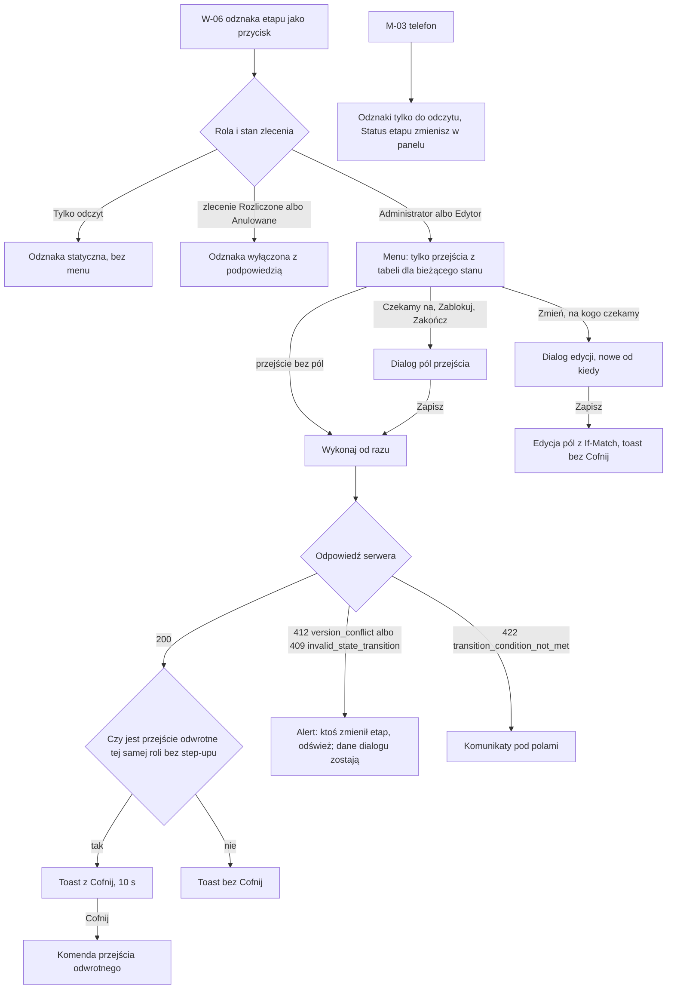

# 04 — Aktualizacja etapu

> Dokument żywy (EVM-004) · przepływ AC2 nr 4 · kanał: web (na telefonie tylko informacja) · ekran: W-07 (menu przejść i dialogi pól) · indeks: [README.md](README.md)
> Źródła: `domain-model.md` → „Stany i przejścia” (tabele „Etap procesu” i „Zlecenie”), `ProcedureStage`; styleguide § 3.9, § 4.4, § 4.11; SR-API-07, SR-AUTHZ-10 (konsultacja `security-engineer`, M2).

## Przepływ


## W-07 Zmiana statusu etapu
- **Cel:** zmienić status etapu jednym, przewidywalnym ruchem, podając tylko pola wymagane przez przejście — tak, żeby „na kogo czekamy i od kiedy” było zawsze aktualne.
- **Główna akcja:** wybór przejścia z menu odznaki (np. „Czekamy na…”), w dialogu — „Zapisz”.
- **Hierarchia treści:** 1) odznaka bieżącego statusu z `chevron-down`; 2) menu — tylko przejścia dozwolone z bieżącego stanu (tabela „Etap procesu”), w kolejności częstości; 3) dialog pól przejścia; 4) toast z wynikiem (z „Cofnij” albo bez — [lista](#cofnij--lista-przejść)).

**Makieta**
```text
 Etap: 3 Warunki przyłączenia i projekt umowy    «W toku ▾»
                                                 ┌──────────────────────────────┐
                                                 │ Czekamy na…                  │
                                                 │ Zakończ…                     │
                                                 │ Nie dotyczy                  │
                                                 │ ──────────────────────────── │
                                                 │ Zablokuj…                    │
                                                 └──────────────────────────────┘
                                                   ActionMenu [P-1]

 Dialog „Czekamy na…” (size.dialog.width.md):
┌──────────────────────────────────────────────────────────┐
│ Na kogo czekamy?                                     [x] │
│ Etap: Warunki przyłączenia i projekt umowy               │
│ (Uzgodnienia z OSD · ZL-2026-0042)                       │
│                                                          │
│ Czekamy na                                               │
│ ( ) Klienta                                              │
│ (•) Stronę                                               │
│ Strona [Stoen Operator (OSD) ▾]                          │
│   Podpowiedzi z lokalizacji:                             │
│   · Stoen Operator (OSD)                    ‹check›      │
│   · Wspólnota Mieszkaniowa „Zielony Dziedziniec”         │
│     (Wspólnota / spółdzielnia)                           │
│   [+ Dodaj stronę]                                       │
│ Od kiedy [03.10.2026 ‹calendar›]                         │
│ Nie później niż dziś.                                    │
│                                                          │
│                           [Anuluj]  [[ Zapisz ]]         │
└──────────────────────────────────────────────────────────┘

 Dialog „Zablokuj…”:            Dialog „Zakończ…”:
 │ Dlaczego etap jest            │ Data zakończenia
 │ zablokowany?                  │ [03.10.2026 ‹calendar›]
 │ Powód [_________________]     │ Nie później niż dziś.
 │ Nie wpisuj PESEL, numerów     │       [Anuluj] [[ Zakończ etap ]]
 │ dokumentów ani kodów do bram  │
 │ i alarmów.                    │
 │     [Anuluj] [[ Zablokuj etap ]]

 Toast po zapisie (§ 3.14, 10 s):
 ┌──────────────────────────────────────────────────────────┐
 │ ‹circle-check› Etap „Warunki przyłączenia…”: Czekamy na  │
 │ Stoen Operator (OSD).                          [Cofnij]  │
 └──────────────────────────────────────────────────────────┘
```

**Menu przejść wg bieżącego statusu** (tylko przejścia z tabeli „Etap procesu”; role A, E)
| Bieżący status | Pozycje menu (przejście) | Pola w dialogu |
|---|---|---|
| Do zrobienia | Rozpocznij (`todo → in_progress`) · Czekamy na… (`todo → waiting`) · Zakończ… (`todo → done`) · Nie dotyczy (`todo → not_applicable`) · Zablokuj… (`todo → blocked`) | Czekamy na… — na kogo (klient / strona), strona, od kiedy; Zakończ… — data; Zablokuj… — powód |
| W toku | Czekamy na… (`in_progress → waiting`) · Zakończ… (`in_progress → done`) · Nie dotyczy (`in_progress → not_applicable`) · Zablokuj… (`in_progress → blocked`) | jw. |
| Czekamy na… | Odpowiedź otrzymana (`waiting → in_progress`) · Zmień, na kogo czekamy… (edycja, nie przejście) · Zakończ… (`waiting → done`) · Nie dotyczy (`waiting → not_applicable`) · Zablokuj… (`waiting → blocked`) | Zmień, na kogo czekamy… — jak „Czekamy na…”, z informacją „Licznik dni zacznie się od nowa.” |
| Zablokowany | Odblokuj (`blocked → in_progress`) | — |
| Zakończony | Otwórz ponownie (`done → in_progress`) | — |
| Nie dotyczy | Przywróć (`not_applicable → todo`) | — |

- **Podpowiedzi „na kogo czekamy”:** domyślnie wybrane wg szablonu etapu (`defaultWaitingOn`, `defaultWaitingOnPartyKind`) — np. dla „Warunki przyłączenia i projekt umowy” strona rodzaju OSD; na górze listy strony z lokalizacji (OSD i zarządca), potem wyszukiwanie wszystkich stron; „Dodaj stronę” otwiera ten sam formularz co w [W-05](02-nowe-zlecenie-z-szablonu.md#w-05-nowe-zlecenie) (w miejscu dialogu, bez dialogu na dialogu — po zapisie strony wracamy do „Na kogo czekamy?” z nową stroną wybraną).
- **Od kiedy:** domyślnie dziś (`Europe/Warsaw`), nie z przyszłości; zmiana strony w stanie „Czekamy na…” ustawia nowe „od kiedy” (to edycja, nie przejście — `domain-model.md`).
- **Ostrzeżenie przy zakończeniu zlecenia** z otwartymi etapami — w nagłówku W-06 (bez blokady).

## Cofnij — lista przejść
Zasada (styleguide § 4.11, M2 z konsultacji security): **„Cofnij” wywołuje wyłącznie przejście z tabeli, które prowadzi dokładnie do poprzedniego stanu i jest dostępne tej samej roli bez step-upu** — z parametrami, które użytkownik mógłby podać ręcznie. Nigdy przywracanie pól ani `PATCH` statusu (SR-API-07, SR-AUTHZ-10). Cofnięcie, którego serwer nie przyjmie (`412`, `409`), kończy się alertem „Nie udało się cofnąć — ktoś zmienił etap w międzyczasie. [Odśwież]”.

**Etap procesu**
| Wykonane przejście | „Cofnij” | Przejście odwrotne i parametry |
|---|---|---|
| `todo → in_progress` | **brak** | brak przejścia do `todo` |
| `todo → waiting` | **brak** | brak przejścia do `todo` |
| `todo → done`, `todo → blocked` | **brak** | przejście odwrotne prowadzi do `in_progress`, nie do `todo` |
| `todo → not_applicable` | tak | `not_applicable → todo` |
| `in_progress → waiting` | tak | `waiting → in_progress` |
| `in_progress → done` | tak | `done → in_progress` |
| `in_progress → blocked` | tak | `blocked → in_progress` |
| `in_progress → not_applicable` | **brak** | `not_applicable → todo` nie wraca do `in_progress` |
| `waiting → in_progress` | tak | `in_progress → waiting` z poprzednimi `waitingOn`, `waitingOnPartyId`, `waitingSince` (licznik dni zachowany) |
| `waiting → done`, `waiting → not_applicable`, `waiting → blocked` | **brak** | przejście odwrotne nie wraca do `waiting` |
| `blocked → in_progress` | tak | `in_progress → blocked` z poprzednim `blockedReason` |
| `done → in_progress` | tak | `in_progress → done` z poprzednim `completedOn` |
| `not_applicable → todo` | tak | `todo → not_applicable` |
| zmiana strony w stanie `waiting` (edycja pól) | **brak** | to nie jest przejście — toast „Zmieniono, na kogo czekamy.” |

**Zlecenie** (nagłówek W-06)
| Wykonane przejście | „Cofnij” | Przejście odwrotne i parametry |
|---|---|---|
| `new → quoting`, `new → accepted`, `quoting → accepted`, `accepted → in_progress` | **brak** | brak przejścia odwrotnego |
| `active → on_hold` | tak | `on_hold → active` (powrót do `resumeStatus`) |
| `on_hold → active` | tak | `active → on_hold` z poprzednim `statusReason` |
| `in_progress → completed` | tak | `completed → in_progress` |
| `completed → in_progress` | tak | `in_progress → completed` z poprzednim `completedOn` |
| `active → cancelled`, `on_hold → cancelled` | **brak — dialog z podsumowaniem przed operacją** | przywrócenie (`cancelled → on_hold`) wymaga Administratora ze step-upem |
| `completed → settled` | **brak — dialog z podsumowaniem przed operacją** | przywrócenie (`settled → completed`) wymaga Administratora ze step-upem |
| `settled → completed`, `cancelled → on_hold` (Administrator ↑) | **brak** | odwrócenie to rozliczenie albo anulowanie — operacje z własnym dialogiem |

**Etap płatności:** żadne przejście nie ma „Cofnij” — każde ma dialog z podsumowaniem, bo odwrócenie wymaga Administratora ze step-upem albo samo jest korektą płatności ([08-nieoplacone.md](08-nieoplacone.md#akcje-płatności--status--rola)).

**Soft delete** (Administrator — medium, dokument, wpis, zlecenie): toast „Usunięto … [Cofnij]” — „Cofnij” = przywrócenie (Administrator, bez step-upu).

**Stany**
| Stan | Zachowanie |
|---|---|
| Pusty | Etap bez dozwolonych przejść nie występuje (każdy stan ma co najmniej jedno); proces bez etapów — „Proces nie ma etapów.” w W-06. |
| Ładowanie | Pozycja menu / „Zapisz” w stanie ładowania; odznaka pokazuje stary status do odpowiedzi (bez optymistycznej zmiany). |
| Błąd | `412 version_conflict` / `409 invalid_state_transition`: alert w dialogu (albo pod odznaką przy przejściu bez dialogu) „Ktoś zmienił ten etap w międzyczasie (teraz: «Zakończony»). [Odśwież etap]” — wpisane pola zostają; `422 transition_condition_not_met` — komunikat pod polem („Wybierz stronę, na którą czekamy.”, „Data nie może być późniejsza niż dziś.”); błąd serwera — § 6.4. |
| Offline | Baner § 4.10; odznaki wyłączone z podpowiedzią „Status zmienisz po powrocie połączenia.”; otwarty dialog zachowuje dane w pamięci karty. |
| Brak uprawnień | Tylko odczyt — odznaki statyczne (bez `chevron-down`, bez menu). Zlecenie Rozliczone / Anulowane — odznaki wyłączone z podpowiedzią „Zlecenie jest rozliczone — status etapu zmienisz po przywróceniu zlecenia przez administratora.” Etap usunięty w międzyczasie — `404`: alert „Nie znaleziono etapu. Mógł zostać usunięty. [Odśwież zlecenie]”. Telefon — tylko odczyt: „Status etapu zmienisz w panelu.” (M-03). |

**Role**
| Akcja | Przejście / operacja | A | E | R |
|---|---|---|---|---|
| Przejścia etapu | tabela „Etap procesu” (wszystkie: A, E) | tak | tak | ukryte |
| Zmień, na kogo czekamy | edycja `waitingOn`, `waitingOnPartyId`, `waitingSince` (`If-Match`) | tak | tak | ukryte |
| Dodaj stronę (z dialogu) | utworzenie `Party` | tak | tak | ukryte |
| Edytuj etap (termin, odpowiedzialny, notatki — menu `⋮` etapu) | edycja `ProcedureStage` | tak | tak | ukryte |
| Cofnij | przejście odwrotne z listy wyżej | tak | tak | — |
| Telefon | — (MVP: `UpdateStageStatus` dopiero po MVP) | nie | nie | — |

- **Responsywność:** menu pod odznaką (`elevation.dropdown`); `breakpoint.compact` — menu jako arkusz od dołu, dialog na pełną szerokość z przyciskami na dole.
- **Komponenty i tokeny:** StatusBadge jako przycisk (§ 3.9: `chevron-down`, fokus `color.focus.ring`, wyłączona — bez `chevron-down` z podpowiedzią), tokeny `color.status.stage.*`; ActionMenu [P-1]; Dialog (§ 3.13) `size.dialog.width.md`; radio (§ 3.4); Combobox (§ 3.3) z grupą „Podpowiedzi z lokalizacji”; DatePicker (§ 3.5) z blokadą dat z przyszłości; TextArea (§ 3.2); Toast z akcją (§ 3.14, 10 s, `size.toast.max-width`); InlineAlert (§ 3.19) `color.feedback.error.*`; rozwinięcie „Czekamy na: …” (§ 4.4) `text.body-sm`, `text.numeric`, `color.text.warning` + `triangle-alert` powyżej 14 dni.
- **Mikrocopy:** pozycje menu z tabeli · „Na kogo czekamy?” · „Klienta” / „Stronę” · „Podpowiedzi z lokalizacji” · „Od kiedy” · „Nie później niż dziś.” · „Licznik dni zacznie się od nowa.” · „Dlaczego etap jest zablokowany?” · „Zablokuj etap” · „Data zakończenia” · „Zakończ etap” · toasty: „Etap „…”: Czekamy na Stoen Operator (OSD). [Cofnij]”, „Zmieniono status etapu na W toku.” · „Status etapu zmienisz w panelu.”
- **Dostępność:** odznaka-przycisk z nazwą „Status etapu Warunki przyłączenia i projekt umowy: W toku. Zmień status”; menu z klawiatury (strzałki, Enter, Esc), fokus wraca na odznakę; po zapisie fokus zostaje na odznace, nowy status ogłaszany przez toast (`role="status"`); „Cofnij” osiągalny klawiaturą, toast nie znika, gdy ma fokus (§ 3.14); data z klawiatury i z kalendarza (§ 3.5).
