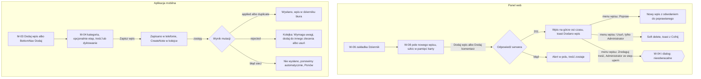

# 05 — Wpis i komentarz

> Dokument żywy (EVM-004) · przepływ AC2 nr 5 · kanały: web i mobile · ekrany: W-08, M-04 · indeks: [README.md](README.md)
> Źródła: `domain-model.md` → `TimelineEntry` (wpis `note` z kategorią, komentarz `comment`, zdarzenie `event`; tylko dopisywanie, korekta = nowy wpis), „Trzy dzienniki”; komendy `CreateNote`, `CreateComment` (`offline-sync.md`); styleguide § 3.10, § 4.5; SR-INPUT-05, SR-WEB-03, SR-DATA-02.

## Przepływ


## W-08 Dziennik
- **Cel:** zapisać ustalenie, rozmowę albo komentarz przy zleceniu i odczytać historię zlecenia w jednym miejscu — wpisy biura i terenu oraz automatyczne zmiany.
- **Główna akcja:** „Dodaj wpis” (albo „Dodaj komentarz”).
- **Hierarchia treści:** 1) pole nowego wpisu (rodzaj, kategoria, etap, treść); 2) filtr typów i etapu; 3) oś czasu od najnowszych, grupowana po dniach.

**Makieta (zakładka „Dziennik” w W-06, expanded)**
```text
[Przegląd] [Dziennik (12)] [Media i dokumenty (48)]
┌──────────────────────────────────────────────────────────────────────────┐
│ Nowy wpis                                     Szkic w tej karcie · 14:05 │
│ (•) Wpis   ( ) Komentarz                                                 │
│ Kategoria {Rozmowa telefoniczna} {✓ Ustalenie} {Spotkanie}               │
│           {Wizyta na miejscu} {Inne}                                     │
│ Etap (opcjonalnie) [Warunki przyłączenia i projekt umowy ▾]              │
│ Treść                                                                    │
│ [Uzgodniono z klientem podpisanie pełnomocnictwa w biurze w piątek.___]  │
│ Nie wpisuj PESEL, numerów dokumentów ani kodów do bram i alarmów.        │
│                                                     [[ Dodaj wpis ]]     │
└──────────────────────────────────────────────────────────────────────────┘
 Pokaż: {✓ Wszystko} {Wpisy} {Komentarze} {Zmiany statusów} {Media i dokumenty}
        {Płatności}    Etap [Wszystkie ▾]                         12 pozycji
 ── Dziś ──────────────────────────────────────────────────────────────────
 ‹pencil›  Anna Testowa · dziś, 14:10 · Ustalenie                        ⋮
           Uzgodniono z klientem podpisanie pełnomocnictwa w biurze
           w piątek.  · Etap: Pełnomocnictwo od klienta
 «‹hourglass›» Anna Testowa · dziś, 11:02                                  
           Zmiana statusu etapu „Warunki przyłączenia i projekt umowy”:
           «Czekamy na…» · Czekamy na: Stoen Operator (OSD)
 ‹image›   Piotr Testowy · dziś, 9:41 · z telefonu (zrobione 9:12)
           Dodano 12 zdjęć · W trakcie prac   ▣ ▣ ▣ ▣ +8
 ── Wczoraj ───────────────────────────────────────────────────────────────
 ‹message-square-text› Marta Fikcyjna · wczoraj, 16:20                    ⋮
           Proszę o potwierdzenie terminu montażu z administracją.
 ‹pencil›  Piotr Testowy · wczoraj, 9:30 · Wizyta na miejscu · z telefonu ⋮
           Poprawka wpisu z wczoraj, 9:05: Trasa kabla przez szacht B.
 ‹pencil›  Piotr Testowy · wczoraj, 9:05 · Wizyta na miejscu              
           Zastąpiony poprawką z wczoraj, 9:30  [Pokaż treść]
 ── 02.10.2026 ────────────────────────────────────────────────────────────
 ‹file-text› Anna Testowa · 02.10.2026, 10:00
           Zmiana statusu transzy „Zaliczka”: «Wystawiona»
 [Pokaż starsze]

 Menu ⋮ wpisu: Popraw wpis · Usuń wpis (A) · Zredaguj treść… (A ↑)
```

**Typy wpisów na osi czasu**
| Typ | Znacznik | Treść | Źródło |
|---|---|---|---|
| Wpis | `pencil` + kategoria | autor, czas, kategoria, treść, opcjonalnie etap | `note` |
| Komentarz | `message-square-text` | autor, czas, treść | `comment` |
| Zmiana statusu (zlecenie, etap, transza) | odznaka kompaktowa statusu | autor w nagłówku wpisu; treść bezosobowa: „Zmiana statusu etapu „…”: «[status]»” + rozwinięcie „Czekamy na: …” (§ 4.5, § 6.1); **bez kwot i wartości danych osobowych** | `event` |
| Media i dokumenty | `image` / `file-text` | autor w nagłówku wpisu; „Dodano 12 zdjęć · [kategoria]” + miniatury (tylko pliki `ready`); dokument — „Dodano dokument” + rodzaj i tytuł | `event` |
| Poprawka | jak wpis | „Poprawka wpisu z [czas]: …”; poprawiany wpis zwinięty z napisem „Zastąpiony poprawką z [czas]” i „Pokaż treść” | `supersedesEntryId` |
| Z telefonu | dopisek „z telefonu (zrobione 9:12)” | kolejność wg czasu serwera, czas z telefonu tylko jako informacja (SR-SYNC-05) | `origin = mobile`, `capturedAt` |
| Zredagowany | `eye-off` | „Treść usunięta przez administratora 03.10.2026.” | `redactedAt` |

**Stany**
| Stan | Zachowanie |
|---|---|
| Pusty | „Brak wpisów. Dodaj pierwszą notatkę.” (§ 3.10); brak wyników filtra — „Brak wpisów tego typu. [Pokaż wszystko]”. |
| Ładowanie | Skeleton 3 wpisów osi czasu (§ 3.16); „Pokaż starsze” — Skeleton pod listą, pozycja przewijania zachowana. |
| Błąd | Nie wczytano dziennika — alert w zakładce z „Spróbuj ponownie”; nie dodano wpisu — alert przy polu „Nie udało się dodać wpisu. Spróbuj ponownie — nie dodamy go dwa razy.”, treść zostaje (ponowienie z tym samym kluczem idempotencji); treść za długa — komunikat pod polem z limitem znaków. |
| Offline | Baner § 4.10; „Dodaj wpis” wyłączony z podpowiedzią „Dodasz wpis po powrocie połączenia.”; treść zostaje w pamięci karty (panel nie ma kolejki offline). |
| Brak uprawnień | Tylko odczyt — oś czasu i filtry bez pola nowego wpisu i bez menu `⋮`. Edytor — „Usuń wpis” i „Zredaguj treść…” wyłączone z podpowiedzią „Usunąć wpis może tylko administrator.” Wpis usunięty w międzyczasie — znika z listy po odświeżeniu (Administrator widzi go z oznaczeniem „Usunięty”). |

**Role**
| Akcja | Komenda / operacja | A | E | R |
|---|---|---|---|---|
| Podgląd dziennika i filtrów | odczyt `TimelineEntry` (widok `Timeline`) | tak | tak | tak |
| Dodaj wpis | utworzenie `TimelineEntry` `note` (`noteCategory`, `body`, `procedureStageId?`) | tak | tak | ukryte |
| Dodaj komentarz | utworzenie `TimelineEntry` `comment` | tak | tak | ukryte |
| Popraw wpis | nowy `TimelineEntry` z `supersedesEntryId` (wpisy i komentarze; zdarzeń nie poprawiamy) | tak | tak | ukryte |
| Usuń wpis | soft delete `TimelineEntry`; „Cofnij” = przywrócenie (A) | tak | wyłączone | ukryte |
| Zredaguj treść | redakcja treści (A ↑, nieodwracalna — dialog § 4.11) | tak ↑ | wyłączone | ukryte |

- **Responsywność:** `breakpoint.expanded` — pole wpisu nad osią w kolumnie treści; `breakpoint.medium` — jak expanded, chipy kategorii zawijane; `breakpoint.compact` — pole wpisu zwinięte do przycisku „Dodaj wpis” (rozwija formularz), filtry w arkuszu „Filtry” (§ 3.7).
- **Komponenty i tokeny:** Timeline, TimelineEntry (§ 3.10) — znacznik `size.timeline-marker`, linia `color.border.default` `border-width.strong`, autor `text.label`, czas `text.caption` `color.text.secondary`, treść `text.body`, odstęp `space.stack.md`; StatusBadge kompaktowa (§ 3.9); radio (§ 3.4); FilterChip (§ 3.7) — kategorie i typy; Select (§ 3.3) — etap; TextArea (§ 3.2) z podpowiedzią `color.text.tertiary`; Thumbnail (§ 3.11) `size.thumbnail.sm`; ActionMenu (§ 3.20) — menu `⋮` wpisu; Button primary (§ 3.1); Dialog (§ 3.13) — redakcja; Toast (§ 3.14).
- **Mikrocopy:** „Nowy wpis” · „Wpis” / „Komentarz” · „Kategoria” · kategorie: „Rozmowa telefoniczna”, „Spotkanie”, „Ustalenie”, „Wizyta na miejscu”, „Inne” · „Etap (opcjonalnie)” · „Nie wpisuj PESEL, numerów dokumentów ani kodów do bram i alarmów.” · „Dodaj wpis” / „Dodaj komentarz” · „Pokaż:” · „Poprawka wpisu z …” · „Zastąpiony poprawką z …” · „z telefonu (zrobione 9:12)” · „Popraw wpis” · „Usuń wpis” · „Zredaguj treść…” · dialog redakcji: „Zredagować treść wpisu? Treść zostanie zastąpiona znacznikiem — tej operacji nie można cofnąć.” [Zredaguj treść] (danger) [Anuluj] · toasty: „Dodano wpis.”, „Usunięto wpis. [Cofnij]”.
- **Dostępność:** oś czasu jako lista (`ol`) z nagłówkami dni; każdy wpis ma nazwę dostępną z typem, autorem i pełną datą (czas względny w tekście, pełna data w podpowiedzi — § 6.3); treść wpisów renderowana jako zwykły tekst — aktywne tylko linki `https:`, `tel:`, `mailto:` (SR-WEB-03, SR-INPUT-05); nowy wpis ogłaszany `role="status"`; „Pokaż starsze” zachowuje fokus.

## M-04 Nowy wpis
- **Cel:** w terenie, jedną ręką i bez zasięgu, zapisać ustalenie albo komentarz do zlecenia — z minimum pisania (kategoria z chipów, dyktowanie).
- **Główna akcja:** „Zapisz wpis” (dolny pasek, `size.touch-target.field`).
- **Hierarchia treści:** 1) zlecenie (numer i tytuł), 2) wpis / komentarz, 3) kategoria (chipy), 4) etap (opcjonalnie), 5) treść z dyktowaniem, 6) „Zapisz wpis”.

**Makieta (compact)**
```text
┌──────────────────────────────────┐
│ ✕ Nowy wpis       ⟨Offline · 5⟩  │
├──────────────────────────────────┤
│ ZL-2026-0042 · Garaż — pełny     │
│ proces                           │
│                                  │
│ {✓ Wpis}  {Komentarz}            │
│                                  │
│ Kategoria                        │
│ {Rozmowa telefoniczna}           │
│ {✓ Wizyta na miejscu}            │
│ {Ustalenie} {Spotkanie} {Inne}   │
│                                  │
│ Etap (opcjonalnie)               │
│ [Wybierz etap ▾]                 │ → arkusz dolny
│                                  │
│ Treść                            │
│ [Trasa kabla przez szacht B,    ]│
│ [potrzebny przepust w stropie.  ]│
│ ‹mic› Możesz dyktować — mikrofon │
│ na klawiaturze.                  │
│ Nie wpisuj PESEL, numerów        │
│ dokumentów ani kodów do bram     │
│ i alarmów.                       │
│ Szkic zapisany w telefonie · 14:05│
├──────────────────────────────────┤
│ [[        Zapisz wpis         ]] │
└──────────────────────────────────┘

 Po zapisie (toast nad BottomNav): „Zapisano w telefonie. Wyślemy, gdy wróci zasięg.”
 Wpis w dzienniku M-03 do czasu wysłania:
 │ ‹clock› Czeka na wysłanie · Piotr Testowy · 14:06 │
```

**Stany wpisu z telefonu** (§ 3.10, § 5.4)
| Stan | Znacznik | Akcja |
|---|---|---|
| W kolejce | `clock` „Czeka na wysłanie” (`color.sync.queued.*`) | — (wpis należy do kolejki; usuwanie tylko z ekranu Kolejka, z dialogiem) |
| Wysyłanie | `cloud-upload` „Wysyłanie” | — |
| Wysłano | `cloud-check` „Wysłano” (znacznik znika po chwili) | — |
| Błąd sieci lub serwera | `cloud-alert` „Nie wysłano — ponowimy automatycznie” | „Ponów” |
| Czeka na zlecenie | `clock` „Wyślemy po utworzeniu zlecenia” (szybkie zlecenie bez numeru) | — |
| Odrzucony (`rejected`: zlecenie usunięte, brak dostępu, błąd walidacji) | „Wymaga uwagi” (§ 4.16: `triangle-alert`, `color.sync.error.*`) + „Przejdź do kolejki” | „Dodaj do innego zlecenia” (nowa komenda `CreateNote`) · „Usuń z telefonu” (dialog) |

**Stany**
| Stan | Zachowanie |
|---|---|
| Pusty | Wejście z BottomNav „Dodaj → Wpis” bez kontekstu — najpierw arkusz „Do którego zlecenia?” (ostatnio otwierane i wyszukiwanie lokalne, jak w [M-06](09-mobile-zdjecia-filmy-offline.md#m-06-aparat)); kategoria domyślnie ostatnio używana. |
| Ładowanie | nd. — zapis lokalny jest natychmiastowy (bez oczekiwania na sieć). |
| Błąd | Pusta treść: „Wpisz treść wpisu albo użyj dyktowania.”; brak miejsca w telefonie: „Brak miejsca w telefonie. Zwolnij miejsce — wpis zostaje w szkicu.”; błędy wysyłki — tabela wyżej. |
| Offline | Normalna praca: zapis do kolejki, SyncIndicator „Offline · n”, toast „Zapisano w telefonie. Wyślemy, gdy wróci zasięg.” |
| Brak uprawnień | Tylko odczyt — brak dostępu do aplikacji (M-02). Utrata dostępu do zlecenia przed wysłaniem — `rejected: forbidden` → „Wymaga uwagi”. Tryb ukrytych danych (§ 4.18) — wpisy niedostępne (EmptyState; dane zleceń nie są renderowane); dostępne pozostają aparat i Kolejka. |

**Role**
| Akcja | Komenda (`offline-sync.md`) | A | E | R |
|---|---|---|---|---|
| Zapisz wpis | `CreateNote` (`noteCategory`, `body`, `procedureStageId?`, `capturedAt`) | tak | tak | brak dostępu (M-02) |
| Zapisz komentarz | `CreateComment` | tak | tak | — |
| Popraw, usuń, zredaguj | — (tylko panel; telefon tylko dodaje) | nie | nie | — |

- **Responsywność:** jedna kolumna; przy otwartej klawiaturze dolny pasek przyklejony nad klawiaturą; powiększenie czcionki do 200 % — chipy zawijane.
- **Komponenty i tokeny:** AppBar z SyncIndicator (§ 3.18, § 5.4); FilterChip (§ 3.7) jako wybór pojedynczy — wysokość `size.touch-target.min`, odstęp `space.inline.sm`; Select jako BottomSheet (§ 3.3, § 3.13) `radius.sheet`; TextArea (§ 3.2) `text.body`, etykiety `text.label-lg`; Button primary `size.touch-target.field` w dolnym pasku `elevation.bottom-bar`; Toast (§ 3.14); znaczniki stanu `color.sync.queued.*`, `color.sync.in-progress.*`, `color.sync.done.*`, `color.sync.error.*`; „Wymaga uwagi” (§ 4.16); tryb ukrytych danych (§ 4.18).
- **Mikrocopy:** „Nowy wpis” · „Wpis” / „Komentarz” · „Kategoria” · „Etap (opcjonalnie)” · „Możesz dyktować — mikrofon na klawiaturze.” · „Nie wpisuj PESEL, numerów dokumentów ani kodów do bram i alarmów.” · „Szkic zapisany w telefonie · 14:05” · „Zapisz wpis” · „Zapisano w telefonie. Wyślemy, gdy wróci zasięg.” · „Czeka na wysłanie” · „Wyślemy po utworzeniu zlecenia”.
- **Dostępność:** chipy jako grupa radio z etykietą „Kategoria”; dyktowanie systemowe (bez własnego nagrywania); cele dotyku ≥ `size.touch-target.min`, odstęp `space.inline.sm`; zapis potwierdzony ogłoszeniem dostępności; zamknięcie `✕` z niezapisaną treścią — treść zostaje w szkicu (bez pytania), szkic wraca przy ponownym otwarciu.
