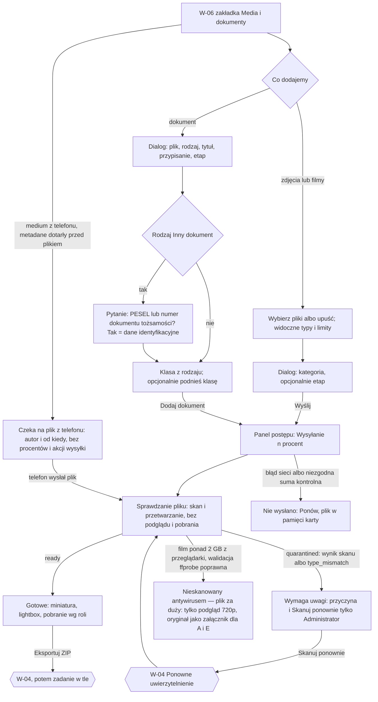
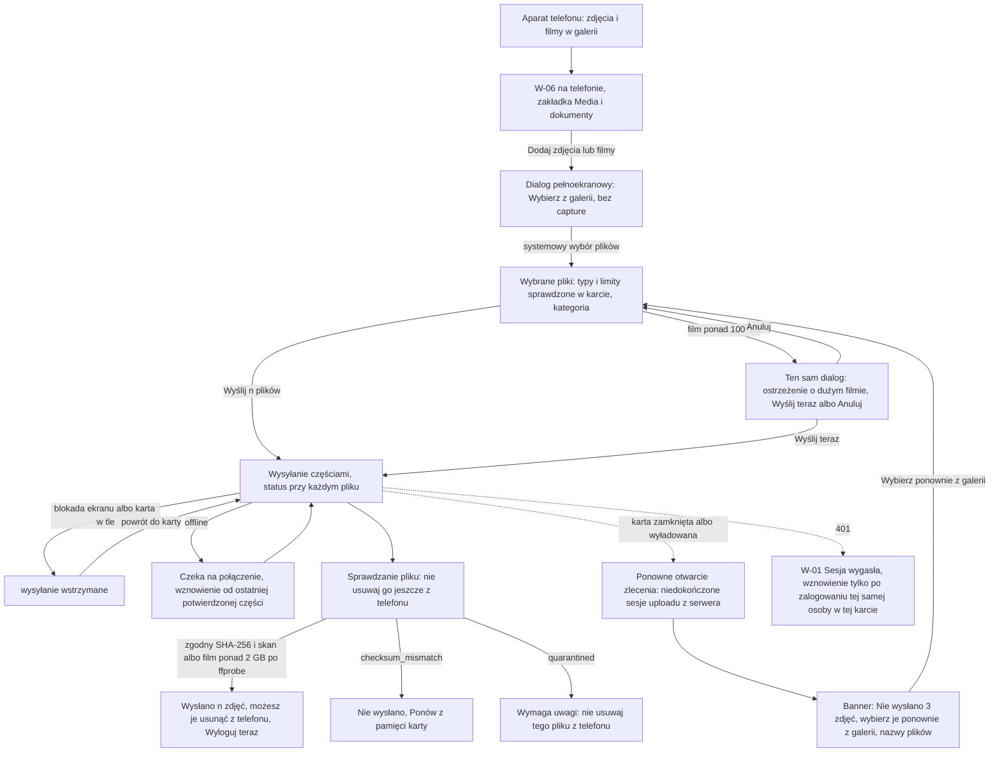

# 06 — Galeria i upload

> Dokument żywy (EVM-004; W-09 w przeglądarce telefonu — EVM-071, 2026-10-05) · przepływ AC2 nr 6 · kanał: web · ekran: W-09 (zakładka „Media i dokumenty” w W-06, z dialogami uploadu i lightboxem; także [w przeglądarce telefonu](#w-09-w-przeglądarce-telefonu) — `breakpoint.compact`) · indeks: [README.md](README.md)
> Źródła: ADR-0009; `domain-model.md` → `MediaAsset`, `Document`, `DocumentVersion`, `StoredFile` (stany `pending_upload → uploaded → scanning → clean → processing → ready`, `quarantined`, `failed`); polityki P3, P5, P6; SR-FILE-01, -08, -09, -10, -12, SR-AUTHZ-06, -07; konsultacja `security-engineer` EVM-004 (M4, przepływ 06). Galeria na telefonie: [09-mobile-zdjecia-filmy-offline.md](09-mobile-zdjecia-filmy-offline.md) (M-08). Od EVM-071: decyzje 18 i 19 (README M1 → „Decyzje dla Konrada”), historyjki EVM-044 (AC4), EVM-046 (AC8), EVM-066 (AC2); polityki P7, P11; SR-WEB-05, SR-FILE-03, -05, SR-CRYPTO-05, SR-SESS-05; konsultacja `security-engineer` w EVM-071 (S5, A3, A4, B7, B8).

## Przepływ


## W-09 Media i dokumenty
- **Cel:** dodać zdjęcia, filmy i dokumenty do zlecenia, widzieć stan każdego pliku i przeglądać galerię — z dostępem do plików zgodnym z rolą i klasą poufności.
- **Główna akcja:** „Wybierz pliki” (media) / „Dodaj dokument”.
- **Hierarchia treści:** 1) liczniki i filtry; 2) Uploader z listą typów i limitów; 3) panel postępu (gdy coś się wysyła z tej karty); 4) galeria zdjęć i filmów (grupowanie po kategorii albo etapie); 5) dokumenty zlecenia; 6) dokumenty lokalizacji i klienta.
- **Liczniki:** „46 zdjęć · 2 filmy” i licznik zakładki „Media i dokumenty (48)” obejmują **wszystkie** media zlecenia, także te, których plik jeszcze nie dotarł z telefonu; ich liczbę podajemy osobno: „w tym 3 czekają na plik z telefonu”. Panel postępu („Wysyłanie · 3 z 5”) liczy wyłącznie pliki wysyłane z tej karty.

**Makieta (zakładka w W-06, expanded)**
```text
[Przegląd] [Dziennik (12)] [Media i dokumenty (48)]
┌──────────────────────────────────────────────────────────────────────────────┐
│ Zdjęcia i filmy · 46 zdjęć · 2 filmy                 [Eksportuj zdjęcia (ZIP)]│
│ w tym 3 czekają na plik z telefonu                                           │
│ Grupuj: (•) Kategoria ( ) Etap    Pokaż: {✓ Wszystkie} {Wymaga uwagi (1)}     │
│ ┌──────────────────────────────────────────────────────────────────────────┐ │
│ │ ‹cloud-upload› Upuść zdjęcia lub filmy tutaj albo  [Wybierz pliki]       │ │
│ │ Zdjęcia: JPEG, HEIC, PNG, WebP do 50 MB · Filmy: MP4, MOV (H.264, HEVC)  │ │
│ │ do 4 GB i 30 min                                                         │ │
│ └──────────────────────────────────────────────────────────────────────────┘ │
│ Wysyłanie · 3 z 5 · nie zamykaj karty do końca wysyłania                     │
│  ▣ IMG_0412.jpg   ████████░░ 80%                         [Wstrzymaj]         │
│  ▣ IMG_0413.jpg   ‹scan-search› Sprawdzanie pliku   § 4.14                    │
│  ▣ IMG_0414.jpg   ‹cloud-alert› Nie wysłano — przerwane połączenie [Ponów]   │
│                                                                              │
│ W trakcie prac (24)                                                          │
│  ┌────┐ ┌────┐ ┌────┐ ┌────┐ ┌────┐ ┌────┐                                   │
│  │img │ │img │ │img │ │▶ 0:42│ │img │ │ ⚠  │ ← Wymaga uwagi (§ 4.14)        │
│  └────┘ └────┘ └────┘ └────┘ └────┘ └────┘   pod kaflem: ‹triangle-alert›    │
│                                              „Wymaga uwagi” (nie sama ikona) │
│  ┌────┐ ‹clock› Czeka na plik z telefonu · Piotr Testowy · od 14:05  § 4.14  │
│  │ ▶  │ (metadane już są, film czeka w kolejce telefonu — bez procentów)     │
│  └────┘                                                                      │
│ Stan przed pracami (12)  ...                                                 │
├──────────────────────────────────────────────────────────────────────────────┤
│ Dokumenty zlecenia (5)                                    [+ Dodaj dokument] │
│ Rodzaj              Tytuł                 Etap            Wersja  Klasa       ⋮│
│ Warunki przyłączenia  Warunki — Stoen…    Warunki przył.  1   Standardowy     ⋮│
│ Pełnomocnictwo      Pełnomocnictwo OSD    Pełnomocnictwo  1   ‹lock› Dane     ⋮│
│                                                              identyfikacyjne  │
│ Projekt instalacji  Projekt WLZ           Projekt otrzym. 2   ‹lock› Bezpie-  ⋮│
│                                                              czeństwo budynku │
├──────────────────────────────────────────────────────────────────────────────┤
│ Dokumenty lokalizacji (1) · Dokumenty klienta (0)                            │
│ Dokumentacja budynku   Dokumentacja od administracji   —   1  ‹lock› Bezp. b.⋮│
└──────────────────────────────────────────────────────────────────────────────┘

 Dialog „Dodaj 5 plików” (media):         Lightbox (pełny ekran, § 3.11):
 │ Kategoria [W trakcie prac ▾]           │ [‹arrow-left› Poprzednie] [Następne ›]   [x]
 │ Etap (opcjonalnie) [Montaż ładowarki ▾]│ (podgląd 1600 / film 720p)   [− ] [+ ] (zoom)
 │ Opis (opcjonalnie) [__________]        │ W trakcie prac · Etap: Montaż ładowarki
 │ Nie wpisuj PESEL, numerów…             │ Piotr Testowy · zrobione 02.10.2026, 9:12 · z telefonu
 │          [Anuluj] [[ Wyślij 5 plików ]]│ Opis: Trasa kabla w szachcie B.
                                          │ [Edytuj opis] [Pobierz oryginał] [Usuń] (A)  ⋮
                                          │ (bez panelu EXIF / GPS, bez „Kopiuj link”)

 Dialog „Dodaj dokument” (size.dialog.width.md):
 │ Plik [Wybierz plik]  projekt-wlz.pdf · 2,4 MB                               │
 │ Dokumenty: PDF, DOCX, XLSX, JPG, PNG do 100 MB                              │
 │ Rodzaj dokumentu [Inny dokument ▾]                                          │
 │ Czy dokument zawiera PESEL lub numer dokumentu tożsamości?                 │
 │ ( ) Nie   (•) Tak → klasa „Dane identyfikacyjne”                           │
 │ Tytuł [Oświadczenie klienta______]                                          │
 │ Przypisz do  (•) Zlecenia  ( ) Lokalizacji  ( ) Klienta                     │
 │ Etap (opcjonalnie) [Pełnomocnictwo od klienta ▾]                            │
 │ Klasa poufności: z rodzaju — Standardowy                                    │
 │ Podnieś klasę [Dane identyfikacyjne ▾]   (tylko klasy wyższe niż z rodzaju) │
 │ Opis (opcjonalnie) [__________]                                             │
 │                                        [Anuluj] [[ Dodaj dokument ]]        │

 Pobierz oryginał (Administrator, Edytor) — dialog potwierdzenia:
 │ Pobrać oryginał?                                                            │
 │ Plik może zawierać metadane, np. lokalizację. Do udostępnienia poza firmą   │
 │ użyj podglądu.                                                              │
 │ [Anuluj]  [Pobierz podgląd]  [[ Pobierz oryginał ]]                         │

 Film > 2 GB z przeglądarki (SR-FILE-12) — znacznik przy miniaturze, w lightboxie
 (pod metadanymi) i w dialogu pobrania, nad treścią:
 │ ‹info› Nieskanowany antywirusem — plik za duży                              │
 │ Pobrać oryginał?  (dalej jak wyżej; podgląd tylko 720p)                     │
```

**Stany pliku** (`StoredFile.state` → UI; znaczniki — styleguide § 4.14, wysyłanie — § 5.4)
| Stan pliku | UI | Podgląd / pobranie |
|---|---|---|
| wybór pliku niezgodny z listą (typ, rozmiar, czas filmu) | komunikat przy pliku (§ 6.4): „Plik „projekt.dwg” ma nieobsługiwany format. Dodaj plik PDF, DOCX, XLSX, JPG lub PNG.”, „Film jest dłuższy niż 30 min.” | — |
| wysyłanie z tej karty (`pending_upload`, sesja uploadu tej karty) | „Wysyłanie 45%” + pasek (`color.sync.progress.*`), „Wstrzymaj” — postęp zna tylko karta, która wysyła (panel postępu) | brak |
| plik z telefonu jeszcze nie dotarł (`origin = mobile`; medium bez pliku albo `pending_upload` — `CreateMediaAsset` zastosowane przed plikiem, np. film czeka na Wi-Fi albo telefon znów stracił zasięg) | znacznik (§ 4.14) „Czeka na plik z telefonu · Piotr Testowy · od 14:05” — `clock`, `color.sync.queued.*`; czas wg § 6.3 („od 14:05”, „od wczoraj, 9:30”, „od 3 dni”); kafel bez miniatury (ikona typu pliku); **bez procentów, paska i akcji wysyłki** (wysyłką steruje telefon autora); metadane edytowalne wg roli | brak |
| medium z panelu bez pliku poza kartą, która je wysyła (`origin = web`, `pending_upload` — wysyłanie w innej karcie albo przerwane) | „Czeka na plik · Anna Testowa · od 14:05” — jak wyżej, bez procentów | brak |
| błąd wysyłki / `failed` (`checksum_mismatch`) | „Nie wysłano — [powód]” + „Ponów” (plik jest w pamięci karty do jej zamknięcia) | brak |
| `uploaded`, `scanning`, `clean`, `processing` | „Sprawdzanie pliku” (§ 4.14) — `scan-search`, `color.sync.queued.*` | **brak podglądu i pobrania** |
| `ready` | miniatura, lightbox | wg roli (tabela „Role”) |
| `quarantined` (wynik skanu albo `type_mismatch`) | „Wymaga uwagi” (§ 4.14, wygląd jak § 4.16) — `triangle-alert`, `color.sync.error.*`. Administrator: przyczyna (np. „Skan wykrył zagrożenie”, „Typ pliku niezgodny z rozszerzeniem”) i „Skanuj ponownie” ↑; Edytor i Tylko odczyt: „Plik zatrzymany przez skan bezpieczeństwa. Administrator został powiadomiony.” bez przyczyny i bez akcji | brak; **brak zwolnienia bez skanu** (P5 pkt 5) |
| `failed` (`processing_error`, po `clean`) | „Nie udało się przygotować podglądu. Spróbujemy ponownie.” | Administrator i Edytor — oryginał; Tylko odczyt — brak |
| film > 2 GB z przeglądarki (SR-FILE-12), **po pozytywnej walidacji ffprobe** — wcześniej „Sprawdzanie pliku”, niezgodność → `quarantined` (`type_mismatch`) | znacznik „Nieskanowany antywirusem — plik za duży” (§ 4.14: `info`, `color.feedback.info.*`) przy miniaturze, w lightboxie i przy „Pobierz oryginał” (pozycja menu i dialog); bez „Skanuj ponownie” | tylko podgląd 720p; oryginał wyłącznie jako załącznik (Administrator, Edytor; Tylko odczyt — brak, P6) |

**Klasa poufności dokumentu** (M4 z konsultacji security; P6, SR-AUTHZ-07, AB-20)
- Klasa z rodzaju dokumentu (`DocumentKind.confidentiality`, `service-catalog.md` § 6): **Standardowy** (`standard`) < **Bezpieczeństwo budynku** (`building_security`) < **Dane identyfikacyjne** (`identity_data`).
- Rodzaj **„Inny dokument”** (`other`) — obowiązkowe pytanie „Czy dokument zawiera PESEL lub numer dokumentu tożsamości?”; „Tak” ustawia „Dane identyfikacyjne”.
- **„Podnieś klasę”** (Administrator, Edytor; przy dodawaniu i w menu `⋮` dokumentu): kontrolka oferuje **wyłącznie klasy wyższe** niż klasa rodzaju; obniżenie poniżej klasy rodzaju nie jest możliwe; zmiana audytowana. Pole w modelu: `Document.confidentialityOverride` (P6 — zmiana *expand* do wprowadzenia przez `solution-architect` przed E6; „Uwagi do rozważenia” EVM-004).
- Wiersz dokumentu pokazuje klasę etykietą; klasy ograniczone dla roli Tylko odczyt mają ikonę `lock`.

**Stany ekranu**
| Stan | Zachowanie |
|---|---|
| Pusty | „To zlecenie nie ma jeszcze zdjęć. Dodaj zdjęcia z komputera albo zrób je w aplikacji na telefonie. [Wybierz pliki]”; dokumenty: „Brak dokumentów. [Dodaj dokument]”; brak wyników filtra — „Brak plików wymagających uwagi. [Pokaż wszystkie]”. |
| Ładowanie | Skeleton kafli galerii (`size.thumbnail.md`) i wierszy tabeli dokumentów; miniatury doczytywane leniwie (`color.bg.skeleton` w kształcie kafla). |
| Błąd | Nie wczytano galerii — alert w sekcji z „Spróbuj ponownie”; miniatura się nie wczytała — `image` + „Nie można wyświetlić” (§ 3.11); `429` przy pobieraniu (limit podpisanych linków, SR-FILE-10): „Pobrano dużo plików w krótkim czasie. Spróbuj ponownie za 5 min.”; eksport ZIP ponad limit: „Kolejny eksport możliwy za 10 min (maks. 5 dziennie).” |
| Offline | Baner § 4.10; wysyłanie wstrzymane („Wysyłanie wznowimy po powrocie połączenia — nie zamykaj karty.”), pliki w pamięci karty; przy próbie zamknięcia karty z niewysłanymi plikami — systemowe ostrzeżenie przeglądarki; galeria z pamięci karty. |
| Brak uprawnień | Tylko odczyt: miniatury, podglądy (1600, wideo 720p) i dokumenty `standard` (pobranie z audytem); dokumenty „Bezpieczeństwo budynku” i „Dane identyfikacyjne” — wiersz z `lock` i „Plik dostępny dla administratora i edytora” (`403` w kontekście), bez „Pobierz”; brak Uploadera, „Dodaj dokument”, „Pobierz oryginał”, eksportu i `⋮`. Edytor: „Usuń” wyłączone z podpowiedzią „Usunąć plik może tylko administrator.”; „Skanuj ponownie” niedostępne. Plik usunięty w międzyczasie — `404`: „Nie znaleziono pliku. Mógł zostać usunięty.” |

**Role**
| Akcja | Operacja (`domain-model.md`) | A | E | R |
|---|---|---|---|---|
| Podgląd galerii, miniatur, podglądów 1600 i wideo 720p | odczyt `MediaAsset` | tak | tak | tak |
| Wybierz pliki / upuść (media) | utworzenie `MediaAsset` + sesja uploadu | tak | tak | ukryte |
| Edytuj kategorię, opis, etap medium | edycja `MediaAsset` (`category`, `description`, `procedureStageId`) | tak | tak | ukryte |
| Pobierz oryginał medium (z ostrzeżeniem o metadanych) | pobranie oryginału (audyt, P3) | tak | tak | ukryte |
| Pobierz podgląd (do udostępnienia poza firmą) | pobranie pochodnej | tak | tak | ukryte |
| Usuń medium / dokument (także medium „Czeka na plik z telefonu”, np. gdy technik usunął plik w telefonie albo telefon zaginął — późniejsza wysyłka pliku kończy się na telefonie stanem „Wymaga uwagi”, `offline-sync.md` zasada 2) | soft delete; „Cofnij” = przywrócenie | tak | wyłączone | ukryte |
| Eksportuj zdjęcia (ZIP) | eksport ZIP mediów (zadanie w tle, limity — SR-FILE-09) | tak ↑ | tak ↑ | ukryte |
| Dodaj dokument / nowa wersja | utworzenie `Document` / `DocumentVersion` | tak | tak | ukryte |
| Podnieś klasę dokumentu | `confidentialityOverride` (tylko w górę, audyt) | tak | tak | ukryte |
| Pobierz dokument `standard` | pobranie pliku (audyt) | tak | tak | tak |
| Pobierz dokument `building_security` / `identity_data` | pobranie pliku (audyt) | tak | tak | nie — `lock` |
| Przyczyna kwarantanny, „Skanuj ponownie” | ponowny skan (P5 pkt 5) | tak ↑ | nie (bez przyczyny) | nie (bez przyczyny) |
| Kopiuj link do pliku, masowe pobranie oryginałów | — | nie ma w UI | nie ma w UI | nie ma w UI |

- **Responsywność:** `breakpoint.wide` / `breakpoint.expanded` — galeria auto-fill do `size.thumbnail.lg`, tabela dokumentów z kolumną „Klasa”; `breakpoint.medium` — kafle `size.thumbnail.md`, tabela bez kolumny „Etap” (w szczegółach wiersza); `breakpoint.compact` — galeria 3 kolumny, dokumenty jako lista kart, Uploader jako przycisk „Wybierz pliki” (bez strefy upuszczania).
- **Komponenty i tokeny:** Uploader i UploadQueueItem (§ 3.12) — strefa upuszczania (`color.bg.selected` + przerywany `color.border.selected` przy przeciąganiu), „Wybierz pliki” (WCAG 2.5.7), pasek postępu `size.progress-bar.height`, `color.sync.progress.*`, stany `color.sync.*`; Gallery, Thumbnail, Lightbox (§ 3.11) — `radius.thumbnail`, `space.inline.xs`; znaczniki stanu pliku (§ 4.14 — `color.sync.queued.*`, `color.sync.error.*`, `color.feedback.info.*`; pod miniaturą, nigdy sama ikona); DataTable (§ 3.6) — dokumenty; Dialog (§ 3.13) — dodawanie, pobranie oryginału; Select (§ 3.3) — kategoria, rodzaj, etap, „Podnieś klasę”; radio (§ 3.4); FilterChip (§ 3.7); ActionMenu (§ 3.20) — menu `⋮` dokumentu i lightboxa; Button primary / secondary / tertiary (§ 3.1); InlineAlert (§ 3.19); ikony `cloud-upload`, `scan-search`, `clock` („Czeka na plik z telefonu”), `triangle-alert`, `lock`, `image`, `file-text`, `info`.
- **Mikrocopy:** „Upuść zdjęcia lub filmy tutaj albo [Wybierz pliki]” · limity jak w makiecie · „Wysyłanie · 3 z 5 · nie zamykaj karty do końca wysyłania” · „w tym 3 czekają na plik z telefonu” · „Czeka na plik z telefonu · Piotr Testowy · od 14:05” · „Czeka na plik · Anna Testowa · od 14:05” · „Sprawdzanie pliku” · „Wymaga uwagi” · „Plik zatrzymany przez skan bezpieczeństwa. Administrator został powiadomiony.” · „Skanuj ponownie” · „Nieskanowany antywirusem — plik za duży” · „Pobrać oryginał? Plik może zawierać metadane, np. lokalizację. Do udostępnienia poza firmą użyj podglądu.” · „Czy dokument zawiera PESEL lub numer dokumentu tożsamości?” · „Podnieś klasę” · „Plik dostępny dla administratora i edytora” · eksport: „Przygotowujemy plik ZIP. Link pokażemy tutaj, gdy będzie gotowy — będzie ważny 24 godziny i zadziała raz.”
- **Dostępność:** „Wybierz pliki” zawsze obok strefy upuszczania (WCAG 2.5.7); postęp zbiorczo `aria-live="polite"` („Wysłano 3 z 5”), bez ogłaszania każdego procentu; miniatury z tekstem alternatywnym z metadanych (kategoria, etap, data — § 3.11); kafel bez pliku z nazwą „Film, W trakcie prac, czeka na plik z telefonu, Piotr Testowy, od 14:05” (stan w nazwie, nie tylko ikona); duży film z nazwą „Film, W trakcie prac, nieskanowany antywirusem — plik za duży” — także w lightboxie i przy „Pobierz oryginał”; lightbox: przyciski „Poprzednie / Następne”, zoom przyciskami, Esc zamyka, fokus wraca do miniatury; film z napisem czasu trwania i kontrolkami klawiatury; klasa poufności jako tekst (nie tylko ikona).

## W-09 w przeglądarce telefonu
W pilocie M1 Edytor (technik) wysyła zdjęcia i filmy z **panelu w przeglądarce prywatnego telefonu z Androidem** — przejściowo, do aplikacji M2 (EVM-044 AC4, EVM-046 AC8; w UAT M1 zastępuje kroki terenowe A6, B10 i C9 ze [scenariuszy](scenariusze-a-d.md)). Zdjęcia robi aparat systemowy, a panel wybiera je z galerii (decyzja 18), więc kopie zostają w telefonie do potwierdzenia „Wysłano” — „nic nie ginie” przy braku zasięgu, blokadzie ekranu i wyładowaniu karty. Panel na prywatnym telefonie działa z kontrolami kompensującymi (decyzja 19, [README → zasada wspólna 19](README.md#bezpieczeństwo-i-prywatność-w-ui)).

To ten sam ekran W-09 w szerokości `breakpoint.compact`: Uploader web (§ 3.12) z jednym przyciskiem zamiast strefy upuszczania. Zakaz „Z galerii” z § 3.12 i P3 pkt 1 dotyczy aplikacji mobilnej (ADR-0007) — w panelu wybór z galerii jest systemowym wyborem plików (rozstrzygnięcie 14 w EVM-071; [README → „Zgodność z politykami”](README.md#zgodność-z-politykami), P3).

- **Cel:** wysłać z telefonu zdjęcia i filmy z pracy do właściwego zlecenia, widzieć stan każdego pliku i wiedzieć, kiedy można je bezpiecznie usunąć z telefonu.
- **Główna akcja:** „Dodaj zdjęcia lub filmy” (dolny pasek, `size.touch-target.field`) → „Wybierz z galerii” → „Wyślij 13 plików”.
- **Hierarchia treści:** 1) Banner „Nie wysłano …” nad zakładkami (gdy dotyczy), 2) zakładki W-06, 3) panel wysyłania z listą plików (gdy coś się wysyła z tej karty) i wynik, 4) galeria (3 kolumny) i dokumenty jako lista kart, 5) dolny pasek z akcją główną.

### Przepływ w przeglądarce telefonu


### Makieta (compact)
```text
 1. Zakładka „Media i dokumenty” (W-06 na telefonie):
┌───────────────────────────────────
│ ‹menu›  ZL-2026-0042            ‹search›
│ Garaż — pełny proces  «W realizacji»
│ ┃‹cloud-alert› Nie wysłano 3 zdjęć —
│ ┃ wybierz je ponownie z galerii.
│ ┃ IMG_0412.jpg · IMG_0413.jpg ·
│ ┃ IMG_0414.jpg
│ ┃ Nie masz już tych plików? Poproś
│ ┃ administratora o usunięcie pustych
│ ┃ pozycji.
│ ┃ [Wybierz ponownie z galerii]
│ [Przegląd] [Dziennik] [Media i dokumenty]
│ Zdjęcia i filmy · 46 zdjęć · 2 filmy
│ ┌────┐ ┌────┐ ┌────┐
│ │img │ │img │ │▶   │      galeria § 3.11, 3 kolumny
│ └────┘ └────┘ └────┘
├───────────────────────────────────
│ [[ ‹images› Dodaj zdjęcia lub filmy ]]   ← size.touch-target.field
└───────────────────────────────────

 2. Dialog pełnoekranowy (§ 3.13) — źródło:
┌───────────────────────────────────
│ [x]  Dodaj zdjęcia lub filmy
│ ZL-2026-0042
│ Zdjęcia i filmy rób aparatem
│ telefonu, a potem wybierz je tutaj
│ z galerii.
│ ┃‹info› Przed zdjęciami do pracy:
│ ┃ lokalizacja w aparacie wyłączona,
│ ┃ automatyczna kopia zdjęć w chmurze
│ ┃ wyłączona.
│ Zdjęcia: JPEG, HEIC, PNG, WebP do
│ 50 MB · Filmy: MP4, MOV (H.264, HEVC)
│ do 4 GB i 30 min
├───────────────────────────────────
│ [Anuluj]  [[ ‹images› Wybierz z galerii ]]
└───────────────────────────────────

 3. Ten sam dialog — wybrane pliki:
┌───────────────────────────────────
│ [x]  Dodaj zdjęcia lub filmy
│ Wybrano 13 plików · 648 MB
│ ┌──┐ IMG_0401.jpg · 4,1 MB
│ └──┘ [Usuń z wyboru]
│ ┌──┐ IMG_0402.jpg · 3,8 MB
│ └──┘ [Usuń z wyboru]
│ …
│ ┌──┐ VID_0415.mp4 · 600 MB · 4:02
│ └──┘ ‹info› Duży plik
│      [Usuń z wyboru]
│ Pominięto 1 plik: „plan.svg” ma
│ nieobsługiwany format.
│ Kategoria [W trakcie prac ▾]
│ Etap (opcjonalnie) [Wybierz… ▾]  ← od EVM-048
│ Opis (opcjonalnie) [______________]
│ Nie wpisuj PESEL, numerów dokumentów
│ ani kodów do bram i alarmów.
├───────────────────────────────────
│ [Anuluj]       [[ Wyślij 13 plików ]]
└───────────────────────────────────

 4. Ten sam dialog — duży film (po „Wyślij 13 plików”, gdy jest film ponad 100 MB):
┌───────────────────────────────────
│ [x]  Dodaj zdjęcia lub filmy
│ ┃‹triangle-alert› Film ma 600 MB.
│ ┃ Przez sieć komórkową wysyłanie
│ ┃ zużyje pakiet danych i może potrwać
│ ┃ długo — najlepiej wyślij przez Wi-Fi.
│ VID_0415.mp4
│ Razem z filmem wyślemy 12 zdjęć.
├───────────────────────────────────
│ [Anuluj]          [[ Wyślij teraz ]]
└───────────────────────────────────

 5. Wysyłanie — panel w zakładce (status przy każdym pliku):
│ Wysyłanie · 5 z 13
│ Nie zamykaj karty do końca wysyłania.
│ Po zablokowaniu ekranu wysyłanie się
│ zatrzyma i wznowi po powrocie.
│ ┌──┐ IMG_0401.jpg
│ └──┘ ‹cloud-check› Wysłano
│ ┌──┐ IMG_0402.jpg
│ └──┘ ‹scan-search› Sprawdzanie pliku —
│      nie usuwaj go jeszcze z telefonu
│ ┌──┐ IMG_0403.jpg
│ └──┘ ‹cloud-upload› Wysyłanie 45%
│      ███████░░░░░░░░░   [Wstrzymaj]
│ ┌──┐ IMG_0404.jpg
│ └──┘ ‹clock› W kolejce
│ ┌──┐ IMG_0405.jpg
│ └──┘ ‹cloud-alert› Nie wysłano — plik
│      uszkodzony w transmisji
│      [‹rotate-ccw› Ponów]
│ ┌──┐ IMG_0406.jpg
│ └──┘ ‹triangle-alert› Wymaga uwagi —
│      nie usuwaj tego pliku z telefonu.
│      Administrator został powiadomiony.

 6. Wynik — InlineAlert nad listą (lista zwinięta w „Wysłane pliki (12)”):
│ ┃‹circle-check› Wysłano 12 zdjęć —
│ ┃ możesz je usunąć z telefonu.
│ ┃ Potem opróżnij kosz galerii.
│ ┃ [Wyloguj teraz]
│ ▸ Wysłane pliki (12)
 Wynik częściowy:
│ ┃‹triangle-alert› Wysłano 11 z 12 zdjęć.
│ ┃ Usuń z telefonu tylko pliki
│ ┃ oznaczone „Wysłano”.
 Sprawdzanie trwa długo (próg z planu EVM-044, propozycja: 2 min):
│ ┃‹info› Sprawdzanie plików trwa dłużej
│ ┃ niż zwykle — nie usuwaj ich jeszcze
│ ┃ z telefonu.
```

**Status pliku w panelu wysyłania** (§ 3.12, § 5.4, § 4.14; ustalenie A3 — „Wysłano” oznacza potwierdzenie serwera, nie koniec przesyłania)
| Stan (w karcie / na serwerze) | Etykieta przy pliku | Ikona i tokeny | Liczy się do „Wysłano n …” | Akcja |
|---|---|---|---|---|
| wybrany, czeka na swoją kolej | „W kolejce” | `clock`, `color.sync.queued.*` | nie | — |
| wysyłanie części (`pending_upload`, sesja tej karty) | „Wysyłanie 45%” + pasek | `cloud-upload`, `color.sync.in-progress.*`, pasek `color.sync.progress.*` | nie | „Wstrzymaj” / „Wznów” |
| brak połączenia w trakcie | „Czeka na połączenie” | `wifi-off`, `color.sync.offline.*` | nie | — (wznowienie od ostatniej potwierdzonej części) |
| `uploaded`, `scanning` | „Sprawdzanie pliku — nie usuwaj go jeszcze z telefonu” | `scan-search`, `color.sync.queued.*` | nie | — |
| `clean`, `processing` | „Wysłano · przygotowujemy podgląd” | `cloud-check`, `color.sync.done.*` | **tak** | — |
| `ready` | „Wysłano” | `cloud-check`, `color.sync.done.*`, pasek `color.sync.progress.fill-done` | **tak** | — |
| `failed` (`processing_error`, po `clean`) | „Wysłano · podgląd niedostępny” | `cloud-check`, `color.sync.done.*` | **tak** | — |
| film ponad 2 GB po poprawnej walidacji ffprobe (SR-FILE-12) | „Wysłano · nieskanowany antywirusem — plik za duży” | `cloud-check` + znacznik `info` `color.feedback.info.*` (§ 4.14) | **tak** (bez tego film ponad 2 GB nigdy nie dostałby „Wysłano” — A3) | — |
| `failed` (`checksum_mismatch`) | „Nie wysłano — plik uszkodzony w transmisji” (EVM-044 AC5) | `cloud-alert`, `color.sync.error.*`, `color.sync.progress.fill-error` | nie | „Ponów” (plik w pamięci karty) |
| błąd sieci po ponowieniach | „Nie wysłano — przerwane połączenie” | jw. | nie | „Ponów” |
| `429` | „Nie wysłano — zbyt wiele zapytań. Wznowimy za 1 min.” (czas z `Retry-After`) | jw. | nie | automatycznie po czasie; „Ponów” wyłączone do tego czasu |
| `quarantined` | „Wymaga uwagi — nie usuwaj tego pliku z telefonu. Administrator został powiadomiony.” | `triangle-alert`, `color.sync.error.*` (§ 4.16) | nie | — (bez przyczyny — P5 pkt 4) |

- Komunikat „Wysłano 12 zdjęć — możesz je usunąć z telefonu.” pojawia się **dopiero, gdy wszystkie pliki z tej wysyłki mają stan liczony do „Wysłano”** — czyli serwer potwierdził zgodny SHA-256 i skan (SR-FILE-05, SR-CRYPTO-05, ASVS V5.4.3; A3). Inaczej technik usunąłby oryginał, zanim wyjdzie `checksum_mismatch`.
- Gdy część plików ma stan końcowy inny niż „Wysłano” („Nie wysłano”, „Wymaga uwagi”) — wynik częściowy: „Wysłano 11 z 12 zdjęć. Usuń z telefonu tylko pliki oznaczone „Wysłano”.” (ton ostrzeżenia, bez „Wyloguj teraz”).
- Gdy sprawdzanie trwa dłużej niż próg — „Sprawdzanie plików trwa dłużej niż zwykle — nie usuwaj ich jeszcze z telefonu.” (ton informacyjny); stan pliku panel odczytuje z serwera.
- Galeria zlecenia pokazuje te same pliki znacznikami z § 4.14 (np. `clean` — „Sprawdzanie pliku” do gotowego podglądu). Etykieta w panelu wysyłania mówi, czy plik **bezpiecznie dotarł**; znacznik w galerii — czy jest **gotowy do podglądu**.

**Liczebniki i odmiana** (§ 6.3, `Intl.PluralRules('pl')`; formy bezosobowe — § 6.1)
| Komunikat | one | few | many |
|---|---|---|---|
| „Wysłano … — możesz je usunąć z telefonu.” | „Wysłano 1 zdjęcie” | „Wysłano 3 zdjęcia” | „Wysłano 12 zdjęć” |
| film (EVM-046 AC8) | „Wysłano film — możesz go usunąć z telefonu.” | „Wysłano 2 filmy — możesz je usunąć z telefonu.” | „Wysłano 5 filmów — …” |
| zdjęcia i filmy razem | „Wysłano 12 zdjęć i 1 film — możesz je usunąć z telefonu.” (każda część osobno wg kategorii) | | |
| „Nie wysłano … — wybierz je ponownie z galerii.” | „Nie wysłano 1 zdjęcia” | „Nie wysłano 3 zdjęć” | „Nie wysłano 12 zdjęć” |
| film | „Nie wysłano filmu „VID_0415.mp4” — wybierz go ponownie z galerii.” | „Nie wysłano 2 filmów — wybierz je ponownie z galerii.” | „Nie wysłano 5 filmów — …” |
| zdjęcia i filmy razem | „Nie wysłano 1 pliku” | „Nie wysłano 3 plików” | „Nie wysłano 5 plików” (+ „— wybierz je ponownie z galerii.”) |
| licznik wyboru | „Wybrano 1 plik” | „Wybrano 3 pliki” | „Wybrano 13 plików” |
| przycisk | „Wyślij 1 plik” | „Wyślij 3 pliki” | „Wyślij 13 plików” |

**Zasady**
1. **Źródło: galeria** (decyzja 18; EVM-044 AC4 — „Wybierz z galerii”). `input type="file"` z `multiple` i `accept` zawężonym do typów z SR-FILE-01 — **bez atrybutu `capture`**; panel nie uruchamia aparatu przeglądarki (P11: `camera=()`). „Zrób zdjęcie” nie występuje — wariant „aparat z przeglądarki” z decyzji 18 odrzucono (rozstrzygnięcie 9). Systemowy wybór plików może sam zaproponować aparat; zasada „rób zdjęcia aparatem telefonu” jest w instrukcji (EVM-066 AC2) i w dialogu (makieta 2). Typ i tak weryfikuje serwer z zawartości (SR-FILE-03).
2. **Sprawdzenie w karcie przed wysłaniem:** typ, rozmiar i czas filmu — plik niezgodny jest pomijany z komunikatem (§ 6.4: „Pominięto 1 plik: „plan.svg” ma nieobsługiwany format.”, „Film jest dłuższy niż 30 min.”).
3. **Ostrzeżenie o dużym filmie** — próg **100 MB** (propozycja z EVM-046 AC8, przyjęta w makiecie), zależny od rozmiaru, nie od wykrytej sieci (przeglądarka nie rozpoznaje jej wiarygodnie). Krok w tym samym dialogu pełnoekranowym (§ 3.13 — bez dialogu na dialogu): „Wyślij teraz” wysyła wszystko; „Anuluj” wraca do listy wybranych plików bez zmian — można usunąć film z wyboru („Usuń z wyboru: VID_0415.mp4”) i wysłać same zdjęcia albo zamknąć dialog i wrócić przez Wi-Fi.
4. **Blokada ekranu i karta w tle:** przeglądarka wstrzymuje wysyłanie; po powrocie do karty panel wznawia je od ostatniej potwierdzonej części (EVM-044 AC4) i ogłasza „Wznowiono wysyłanie.” (`role="status"`). Postęp i pliki są tylko w pamięci tej karty.
5. **Karta zamknięta albo wyładowana z pamięci:** po ponownym otwarciu zlecenia panel pyta serwer o **niedokończone sesje uploadu tej osoby w tym zleceniu** i pokazuje Banner (§ 3.19, `color.feedback.warning.*`, ikona `cloud-alert`) nad zakładkami W-06: „Nie wysłano 3 zdjęć — wybierz je ponownie z galerii.” z nazwami plików (`originalFilename` widzi tylko twórca sesji — S5) i przyciskiem secondary „Wybierz ponownie z galerii” (inna nazwa niż akcja główna „Dodaj zdjęcia lub filmy”). Stan „Nie wysłano” pochodzi **wyłącznie z serwera** (SR-WEB-05; B7). Pozostali użytkownicy widzą te media w galerii jako „Czeka na plik · [autor] · od [czas]” (§ 4.14).
6. **Ponowny wybór z galerii:** pliki, których nazwa i rozmiar pasują do niewysłanych, kontynuują to samo medium (serwer potwierdza zadeklarowany SHA-256 — bez duplikatów; mechanizm — plan EVM-044); pozostałe wybrane pliki przechodzą zwykły krok „Wybrane pliki”. Gdy plików już nie ma — Edytor prosi administratora o usunięcie pustych pozycji (Edytor nie usuwa mediów); Administrator widzi zdanie „Nie masz już tych plików? Usuń puste pozycje w galerii zlecenia.”
7. **Bez magazynów przeglądarki** (B7; SR-WEB-05, ASVS V14.3.3): plików, uchwytów do plików ani postępu nie zapisujemy w IndexedDB, OPFS, Cache Storage, Service Worker ani Background Fetch. Lokalne podglądy `blob:` (P11 `img-src blob:`) tylko w pamięci karty, zwalniane (`revokeObjectURL`) po wysłaniu albo „Usuń z wyboru”; HEIC bez podglądu w przeglądarce — ikona typu pliku.
8. **Sesja wygasła (`401`) w trakcie wysyłania** (B8; zasady wspólne 6 i 15): karta przechodzi do W-01 z komunikatem „Sesja wygasła. Zaloguj się ponownie w tej karcie — wysyłanie wznowimy, jeśli zalogujesz się na to samo konto.” Wysyłanie wznawia się **tylko po zalogowaniu tej samej osoby w tej samej karcie**; zalogowanie innej osoby odrzuca pliki z pamięci karty. Banner „Nie wysłano” widzi tylko twórca sesji uploadu (EVM-044 AC6).
9. **Po sukcesie** — w InlineAlert przypomnienie „Potem opróżnij kosz galerii.” i Button tertiary „Wyloguj teraz” (EVM-066 AC2; S5) — tylko gdy z tej karty nic się już nie wysyła. „Wyloguj teraz” działa jak „Wyloguj” (SR-SESS-05).
10. **Pobieranie na telefonie** (ustalenie A4, decyzja 19): na `breakpoint.compact` dialog „Pobierz oryginał” ma nad przyciskami zdanie „Na telefonie nie pobieraj oryginałów — plik trafi do „Pobrane” i może trafić do kopii w chmurze.”, a „Pobierz” przy dokumentach zlecenia, lokalizacji i klienta otwiera AlertDialog „Pobrać dokument na telefon?” z treścią „Na telefonie nie pobieraj oryginałów ani dokumentów — plik trafi do „Pobrane” i może trafić do kopii w chmurze.” — [Anuluj] (fokus) [Pobierz dokument]. To samo w W-14 → „Dokumenty klienta” ([13](13-klienci.md#szczegóły-klienta)). Warunek to szerokość widoku, nie rozpoznanie urządzenia.
11. **Zlecenie „Rozliczone” / „Anulowane”** — wysyłanie działa bez zmian (decyzja 17, [W-06 (b)](03-szczegoly-zlecenia.md#w-06-b-zlecenie-rozliczone-albo-anulowane)).

| Moment | Fokus |
|---|---|
| „Dodaj zdjęcia lub filmy” | tytuł dialogu, potem „Wybierz z galerii” |
| powrót z wyboru plików | nagłówek „Wybrano 13 plików” (ogłaszany) |
| krok „Duży film” | treść ostrzeżenia (`tabindex="-1"`), Tab — „Wyślij teraz” |
| „Anuluj” w kroku „Duży film” | „Usuń z wyboru: VID_0415.mp4” |
| „Anuluj” / `x` w dialogu | „Dodaj zdjęcia lub filmy” |
| „Wyślij …” | nagłówek panelu „Wysyłanie · 0 z 13” |
| koniec wysyłania | InlineAlert wyniku (`tabindex="-1"`), Tab — „Wyloguj teraz” |
| „Wybierz ponownie z galerii” | jak „Dodaj zdjęcia lub filmy” po wyborze plików |

**Stany**
| Stan | Zachowanie |
|---|---|
| Pusty | Zlecenie bez mediów — „To zlecenie nie ma jeszcze zdjęć. Zrób je aparatem telefonu i dodaj z galerii.” z akcją główną w dolnym pasku (bez drugiego przycisku o tej samej nazwie); wybór bez plików (zamknięty systemowy wybór) — dialog wraca do kroku „źródło” bez komunikatu; wszystkie wybrane pliki odrzucone — „Żaden plik nie pasuje do dozwolonych typów i limitów.” |
| Ładowanie | Galeria — Skeleton kafli (`size.thumbnail.md`); lokalne podglądy wybranych plików — Skeleton miniatury do wczytania; „Wyślij …” w stanie ładowania do utworzenia mediów i sesji uploadu; sprawdzanie Bannera „Nie wysłano” nie blokuje widoku (Banner pojawia się po odpowiedzi). |
| Błąd | Statusy plików z tabeli wyżej; utworzenie mediów nieudane — alert w dialogu „Nie udało się rozpocząć wysyłania. Spróbuj ponownie — nie dodamy plików dwa razy.” (ten sam `Idempotency-Key`); **`429`** — przy pliku (tabela) albo w dialogu „Zbyt wiele zapytań. Spróbuj ponownie za 1 min.” (czas z `Retry-After`); `401` — zasada 8; pobranie — `429` jak W-09 („Pobrano dużo plików w krótkim czasie…”). |
| Offline | Baner § 4.10: „Brak połączenia. Wysyłanie wznowimy po powrocie połączenia — nie zamykaj karty.”; pliki w trakcie — „Czeka na połączenie”; „Dodaj zdjęcia lub filmy” wyłączony z podpowiedzią „Zdjęcia zostają w galerii telefonu — dodasz je po powrocie połączenia.”; przy próbie zamknięcia karty z niewysłanymi plikami — ostrzeżenie przeglądarki. |
| Brak uprawnień | Tylko odczyt — brak dolnego paska i „Dodaj zdjęcia lub filmy” (`403` przy żądaniu spoza UI), galeria i dokumenty wg W-09; Banner „Nie wysłano” tylko dla twórcy sesji uploadu (cudza sesja albo inne zlecenie — `404`, Banner się nie pojawia); zlecenie niedostępne — `404` W-06. |

**Role**
| Akcja | Operacja | A | E | R |
|---|---|---|---|---|
| Dodaj zdjęcia lub filmy, wysyłanie | utworzenie `MediaAsset` (UUIDv7) + sesja uploadu, części przez podpisane URL-e (EVM-044, EVM-046) | tak | tak | ukryte (`403`) |
| Banner „Nie wysłano” | odczyt niedokończonych sesji uploadu z filtrem twórcy w zapytaniu (`channels: [web]`; odpowiedź: `mediaAssetId`, `originalFilename`, rozmiar) | tak — własne sesje | tak — własne sesje | — |
| Ponowny wybór z galerii | kontynuacja sesji uploadu tylko przez jej twórcę (EVM-044 AC6) | tak | tak | — |
| Usunięcie pustej pozycji („Czeka na plik”) | soft delete `MediaAsset` (W-09) | tak | wyłączone — prośba do administratora | — |
| Pobierz oryginał / dokument na compact | jak W-09, z ostrzeżeniem A4 | tak | tak | dokumenty `standard` (z ostrzeżeniem) |

- **Responsywność:** tylko `breakpoint.compact` (pionowo i poziomo, powiększenie czcionki do 200 % — nazwy plików i komunikaty zawijane, nie skracane); dialog pełnoekranowy (§ 3.13), przyciski w dolnym pasku dialogu — akcja główna po prawej na `size.touch-target.field`; dolny pasek zakładki z akcją główną na pełną szerokość (strefa kciuka — § 5.2); od `breakpoint.medium` — Uploader ze strefą upuszczania (makieta W-09 wyżej).
- **Komponenty i tokeny:** Uploader i UploadQueueItem (§ 3.12) — miniatura `size.thumbnail.sm`, stany `color.sync.*`, pasek `size.progress-bar.height`, `color.sync.progress.*`; znaczniki § 4.14; Banner / InlineAlert (§ 3.19) — `color.feedback.warning.*` („Nie wysłano”, wynik częściowy, duży film), `color.feedback.success.*` (wynik), `color.feedback.info.*` (przypomnienie przed zdjęciami, długie sprawdzanie); Dialog pełnoekranowy (§ 3.13); Select (§ 3.3) kategoria i etap jako arkusz dolny; TextArea (§ 3.2) opis; Button primary `size.touch-target.field` w dolnym pasku (`elevation.bottom-bar`), secondary „Wybierz ponownie z galerii”, tertiary „Usuń z wyboru”, „Wstrzymaj”, „Ponów” (ikona `rotate-ccw`), „Wyloguj teraz” — wszystkie ≥ `size.touch-target.min`, odstęp `space.stack.sm`; Gallery (§ 3.11) 3 kolumny; Disclosure (§ 3.21) „Wysłane pliki (n)”; AlertDialog (§ 3.13) pobrania; ikony `images`, `cloud-upload`, `cloud-check`, `cloud-alert`, `scan-search`, `clock`, `wifi-off`, `triangle-alert`, `rotate-ccw`, `info`; nazwy plików i komunikaty `text.body`, metadane plików (rozmiar, czas filmu) `text.body-sm` `color.text.secondary`.
- **Mikrocopy:** „Dodaj zdjęcia lub filmy” · „Zdjęcia i filmy rób aparatem telefonu, a potem wybierz je tutaj z galerii.” · „Przed zdjęciami do pracy: lokalizacja w aparacie wyłączona, automatyczna kopia zdjęć w chmurze wyłączona.” · „Wybierz z galerii” · „Wybrano 13 plików · 648 MB” · „Usuń z wyboru” · „Duży plik” · „Pominięto 1 plik: „plan.svg” ma nieobsługiwany format.” · „Kategoria” · „Wyślij 13 plików” · „Film ma 600 MB. Przez sieć komórkową wysyłanie zużyje pakiet danych i może potrwać długo — najlepiej wyślij przez Wi-Fi.” · „Razem z filmem wyślemy 12 zdjęć.” · „Wyślij teraz” · „Anuluj” · „Wysyłanie · 5 z 13” · „Nie zamykaj karty do końca wysyłania. Po zablokowaniu ekranu wysyłanie się zatrzyma i wznowi po powrocie.” · „Wznowiono wysyłanie.” · etykiety statusów z tabeli · „Wstrzymaj” / „Wznów” · „Ponów” · „Wysłano 12 zdjęć — możesz je usunąć z telefonu.” · „Potem opróżnij kosz galerii.” · „Wyloguj teraz” · „Wysłano 11 z 12 zdjęć. Usuń z telefonu tylko pliki oznaczone „Wysłano”.” · „Sprawdzanie plików trwa dłużej niż zwykle — nie usuwaj ich jeszcze z telefonu.” · „Wysłane pliki (12)” · „Nie wysłano 3 zdjęć — wybierz je ponownie z galerii.” · „Wybierz ponownie z galerii” · „Nie masz już tych plików? Poproś administratora o usunięcie pustych pozycji.” · „Brak połączenia. Wysyłanie wznowimy po powrocie połączenia — nie zamykaj karty.” · „Zdjęcia zostają w galerii telefonu — dodasz je po powrocie połączenia.” · „Sesja wygasła. Zaloguj się ponownie w tej karcie — wysyłanie wznowimy, jeśli zalogujesz się na to samo konto.” · „Pobrać dokument na telefon?” · „Na telefonie nie pobieraj oryginałów ani dokumentów — plik trafi do „Pobrane” i może trafić do kopii w chmurze.” · „Pobierz dokument” — wszystkie bez form zależnych od płci (§ 6.1).
- **Dostępność:** cele dotyku ≥ `size.touch-target.min`, akcja główna `size.touch-target.field`, akcje przy pliku oddzielone `space.stack.sm`; przyciski powtarzane przy plikach z nazwą dostępną zaczynającą się od etykiety, z obiektem — „Ponów: IMG_0405.jpg”, „Usuń z wyboru: VID_0415.mp4”, „Wstrzymaj: IMG_0403.jpg” (WCAG 2.4.6, 2.5.3); status pliku tekstem obok ikony (ikona `aria-hidden`); postęp ogłaszany zbiorczo `aria-live="polite"` co kilka sekund („Wysłano 5 z 13”), bez każdego procentu (§ 5.4); wynik i Banner „Nie wysłano” z nazwą regionu („Wynik wysyłania”, „Niewysłane pliki”), bez `role="alert"`; dialog pełnoekranowy z pułapką fokusu, tytułem w `aria-labelledby` i fokusem wg tabeli; systemowe „wstecz” w dialogu = „Anuluj”; obsługa powiększenia do 200 % i obu orientacji (WCAG 1.3.4, 1.4.4); kontrast tekstu ≥ 7:1 (§ 5.3).
