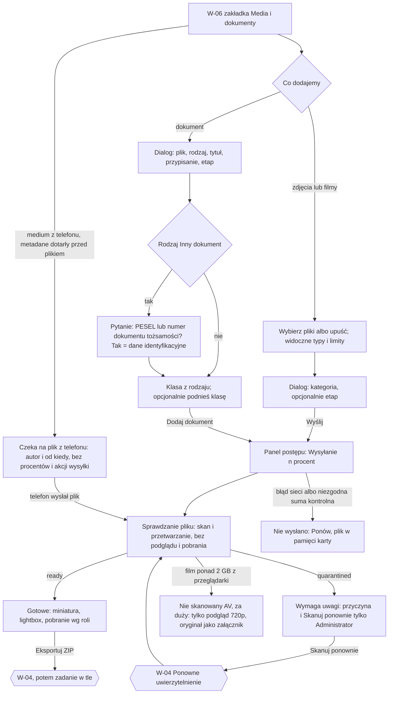

# 06 — Galeria i upload

> Dokument żywy (EVM-004) · przepływ AC2 nr 6 · kanał: web · ekran: W-09 (zakładka „Media i dokumenty” w W-06, z dialogami uploadu i lightboxem) · indeks: [README.md](README.md)
> Źródła: ADR-0009; `domain-model.md` → `MediaAsset`, `Document`, `DocumentVersion`, `StoredFile` (stany `pending_upload → uploaded → scanning → clean → processing → ready`, `quarantined`, `failed`); polityki P3, P5, P6; SR-FILE-01, -08, -09, -10, -12, SR-AUTHZ-06, -07; konsultacja `security-engineer` EVM-004 (M4, przepływ 06). Galeria na telefonie: [09-mobile-zdjecia-filmy-offline.md](09-mobile-zdjecia-filmy-offline.md) (M-08).

## Przepływ


## W-09 Media i dokumenty
- **Cel:** dodać zdjęcia, filmy i dokumenty do zlecenia, widzieć stan każdego pliku i przeglądać galerię — z dostępem do plików zgodnym z rolą i klasą poufności.
- **Główna akcja:** „Wybierz pliki” (media) / „Dodaj dokument”.
- **Hierarchia treści:** 1) liczniki i filtry; 2) Uploader z listą typów i limitów; 3) panel postępu (gdy coś się wysyła z tej karty); 4) galeria zdjęć i filmów (grupowanie po kategorii albo etapie); 5) dokumenty zlecenia; 6) dokumenty lokalizacji i klienta.
- **Liczniki:** „46 zdjęć · 2 filmy” i licznik zakładki „Media i dokumenty (48)” obejmują **wszystkie** media zlecenia, także te, których plik jeszcze nie dotarł z telefonu; ich liczbę podajemy osobno: „w tym 3 czekają na plik z telefonu”. Panel postępu („Wysyłanie · 3 z 5”) liczy wyłącznie pliki wysyłane z tej karty.

**Makieta (zakładka w W-06, expanded)**
```text
[Przegląd] [Dziennik (12)] [Media i dokumenty (48)]
┌──────────────────────────────────────────────────────────────────────────────┐
│ Zdjęcia i filmy · 46 zdjęć · 2 filmy                 [Eksportuj zdjęcia (ZIP)]│
│ w tym 3 czekają na plik z telefonu                                           │
│ Grupuj: (•) Kategoria ( ) Etap    Pokaż: {✓ Wszystkie} {Wymaga uwagi (1)}     │
│ ┌──────────────────────────────────────────────────────────────────────────┐ │
│ │ ‹cloud-upload› Upuść zdjęcia lub filmy tutaj albo  [Wybierz pliki]       │ │
│ │ Zdjęcia: JPEG, HEIC, PNG, WebP do 50 MB · Filmy: MP4, MOV (H.264, HEVC)  │ │
│ │ do 4 GB i 30 min                                                         │ │
│ └──────────────────────────────────────────────────────────────────────────┘ │
│ Wysyłanie · 3 z 5 · nie zamykaj karty do końca wysyłania                     │
│  ▣ IMG_0412.jpg   ████████░░ 80%                         [Wstrzymaj]         │
│  ▣ IMG_0413.jpg   ‹scan-search› Sprawdzanie pliku   [P-7]                     │
│  ▣ IMG_0414.jpg   ‹cloud-alert› Nie wysłano — przerwane połączenie [Ponów]   │
│                                                                              │
│ W trakcie prac (24)                                                          │
│  ┌────┐ ┌────┐ ┌────┐ ┌────┐ ┌────┐ ┌────┐                                   │
│  │img │ │img │ │img │ │▶ 0:42│ │img │ │ ⚠  │ ← Wymaga uwagi [P-7]           │
│  └────┘ └────┘ └────┘ └────┘ └────┘ └────┘                                   │
│  ┌────┐ ‹clock› Czeka na plik z telefonu · Piotr Testowy · od 14:05  [P-7]   │
│  │ ▶  │ (metadane już są, film czeka w kolejce telefonu — bez procentów)     │
│  └────┘                                                                      │
│ Stan przed pracami (12)  ...                                                 │
├──────────────────────────────────────────────────────────────────────────────┤
│ Dokumenty zlecenia (5)                                    [+ Dodaj dokument] │
│ Rodzaj              Tytuł                 Etap            Wersja  Klasa       ⋮│
│ Warunki przyłączenia  Warunki — Stoen…    Warunki przył.  1   Standardowy     ⋮│
│ Pełnomocnictwo      Pełnomocnictwo OSD    Pełnomocnictwo  1   ‹lock› Dane     ⋮│
│                                                              identyfikacyjne  │
│ Projekt instalacji  Projekt WLZ           Projekt otrzym. 2   ‹lock› Bezpie-  ⋮│
│                                                              czeństwo budynku │
├──────────────────────────────────────────────────────────────────────────────┤
│ Dokumenty lokalizacji (1) · Dokumenty klienta (0)                            │
│ Dokumentacja budynku   Dokumentacja od administracji   —   1  ‹lock› Bezp. b.⋮│
└──────────────────────────────────────────────────────────────────────────────┘

 Dialog „Dodaj 5 plików” (media):         Lightbox (pełny ekran, § 3.11):
 │ Kategoria [W trakcie prac ▾]           │ [‹arrow-left› Poprzednie] [Następne ›]   [x]
 │ Etap (opcjonalnie) [Montaż ładowarki ▾]│ (podgląd 1600 / film 720p)   [− ] [+ ] (zoom)
 │ Opis (opcjonalnie) [__________]        │ W trakcie prac · Etap: Montaż ładowarki
 │ Nie wpisuj PESEL, numerów…             │ Piotr Testowy · zrobione 02.10.2026, 9:12 · z telefonu
 │          [Anuluj] [[ Wyślij 5 plików ]]│ Opis: Trasa kabla w szachcie B.
                                          │ [Edytuj opis] [Pobierz oryginał] [Usuń] (A)  ⋮
                                          │ (bez panelu EXIF / GPS, bez „Kopiuj link”)

 Dialog „Dodaj dokument” (size.dialog.width.md):
 │ Plik [Wybierz plik]  projekt-wlz.pdf · 2,4 MB                               │
 │ Dokumenty: PDF, DOCX, XLSX, JPG, PNG do 100 MB                              │
 │ Rodzaj dokumentu [Inny dokument ▾]                                          │
 │ Czy dokument zawiera PESEL lub numer dokumentu tożsamości?                 │
 │ ( ) Nie   (•) Tak → klasa „Dane identyfikacyjne”                           │
 │ Tytuł [Oświadczenie klienta______]                                          │
 │ Przypisz do  (•) Zlecenia  ( ) Lokalizacji  ( ) Klienta                     │
 │ Etap (opcjonalnie) [Pełnomocnictwo od klienta ▾]                            │
 │ Klasa poufności: z rodzaju — Standardowy                                    │
 │ Podnieś klasę [Dane identyfikacyjne ▾]   (tylko klasy wyższe niż z rodzaju) │
 │ Opis (opcjonalnie) [__________]                                             │
 │                                        [Anuluj] [[ Dodaj dokument ]]        │

 Pobierz oryginał (Administrator, Edytor) — dialog potwierdzenia:
 │ Pobrać oryginał?                                                            │
 │ Plik może zawierać metadane, np. lokalizację. Do udostępnienia poza firmą   │
 │ użyj podglądu.                                                              │
 │ [Anuluj]  [Pobierz podgląd]  [[ Pobierz oryginał ]]                         │
```

**Stany pliku** (`StoredFile.state` → UI; znaczniki [P-7] i § 5.4)
| Stan pliku | UI | Podgląd / pobranie |
|---|---|---|
| wybór pliku niezgodny z listą (typ, rozmiar, czas filmu) | komunikat przy pliku (§ 6.4): „Plik „projekt.dwg” ma nieobsługiwany format. Dodaj plik PDF, DOCX, XLSX, JPG lub PNG.”, „Film jest dłuższy niż 30 min.” | — |
| wysyłanie z tej karty (`pending_upload`, sesja uploadu tej karty) | „Wysyłanie 45%” + pasek (`color.sync.progress.*`), „Wstrzymaj” — postęp zna tylko karta, która wysyła (panel postępu) | brak |
| plik z telefonu jeszcze nie dotarł (`origin = mobile`; medium bez pliku albo `pending_upload` — `CreateMediaAsset` zastosowane przed plikiem, np. film czeka na Wi-Fi albo telefon znów stracił zasięg) | znacznik [P-7] „Czeka na plik z telefonu · Piotr Testowy · od 14:05” — `clock`, `color.sync.queued.*`; czas wg § 6.3 („od 14:05”, „od wczoraj, 9:30”, „od 3 dni”); kafel bez miniatury (ikona typu pliku); **bez procentów, paska i akcji wysyłki** (wysyłką steruje telefon autora); metadane edytowalne wg roli | brak |
| medium z panelu bez pliku poza kartą, która je wysyła (`origin = web`, `pending_upload` — wysyłanie w innej karcie albo przerwane) | „Czeka na plik · Anna Testowa · od 14:05” — jak wyżej, bez procentów | brak |
| błąd wysyłki / `failed` (`checksum_mismatch`) | „Nie wysłano — [powód]” + „Ponów” (plik jest w pamięci karty do jej zamknięcia) | brak |
| `uploaded`, `scanning`, `clean`, `processing` | „Sprawdzanie pliku” [P-7] — `scan-search`, `color.sync.queued.*` | **brak podglądu i pobrania** |
| `ready` | miniatura, lightbox | wg roli (tabela „Role”) |
| `quarantined` | „Wymaga uwagi” [P-7] — `triangle-alert`, `color.feedback.warning.*`. Administrator: przyczyna (np. „Skan wykrył zagrożenie”, „Typ pliku niezgodny z rozszerzeniem”) i „Skanuj ponownie” ↑; Edytor i Tylko odczyt: „Plik zatrzymany przez skan bezpieczeństwa. Administrator został powiadomiony.” bez przyczyny i bez akcji | brak; **brak zwolnienia bez skanu** (P5 pkt 5) |
| `failed` (`processing_error`, po `clean`) | „Nie udało się przygotować podglądu. Spróbujemy ponownie.” | Administrator i Edytor — oryginał; Tylko odczyt — brak |
| film > 2 GB z przeglądarki (SR-FILE-12) | znacznik „Nie skanowany AV — za duży” [P-7] (`info`, `color.feedback.info.*`) | tylko podgląd 720p; oryginał wyłącznie jako załącznik (Administrator, Edytor) |

**Klasa poufności dokumentu** (M4 z konsultacji security; P6, SR-AUTHZ-07, AB-20)
- Klasa z rodzaju dokumentu (`DocumentKind.confidentiality`, `service-catalog.md` § 6): **Standardowy** (`standard`) < **Bezpieczeństwo budynku** (`building_security`) < **Dane identyfikacyjne** (`identity_data`).
- Rodzaj **„Inny dokument”** (`other`) — obowiązkowe pytanie „Czy dokument zawiera PESEL lub numer dokumentu tożsamości?”; „Tak” ustawia „Dane identyfikacyjne”.
- **„Podnieś klasę”** (Administrator, Edytor; przy dodawaniu i w menu `⋮` dokumentu): kontrolka oferuje **wyłącznie klasy wyższe** niż klasa rodzaju; obniżenie poniżej klasy rodzaju nie jest możliwe; zmiana audytowana. Pole w modelu: `Document.confidentialityOverride` (P6 — zmiana *expand* do wprowadzenia przez `solution-architect` przed E6; „Uwagi do rozważenia” EVM-004).
- Wiersz dokumentu pokazuje klasę etykietą; klasy ograniczone dla roli Tylko odczyt mają ikonę `lock`.

**Stany ekranu**
| Stan | Zachowanie |
|---|---|
| Pusty | „To zlecenie nie ma jeszcze zdjęć. Dodaj zdjęcia z komputera albo zrób je w aplikacji na telefonie. [Wybierz pliki]”; dokumenty: „Brak dokumentów. [Dodaj dokument]”; brak wyników filtra — „Brak plików wymagających uwagi. [Pokaż wszystkie]”. |
| Ładowanie | Skeleton kafli galerii (`size.thumbnail.md`) i wierszy tabeli dokumentów; miniatury doczytywane leniwie (`color.bg.skeleton` w kształcie kafla). |
| Błąd | Nie wczytano galerii — alert w sekcji z „Spróbuj ponownie”; miniatura się nie wczytała — `image` + „Nie można wyświetlić” (§ 3.11); `429` przy pobieraniu (limit podpisanych linków, SR-FILE-10): „Pobrano dużo plików w krótkim czasie. Spróbuj ponownie za 5 min.”; eksport ZIP ponad limit: „Kolejny eksport możliwy za 10 min (maks. 5 dziennie).” |
| Offline | Baner § 4.10; wysyłanie wstrzymane („Wysyłanie wznowimy po powrocie połączenia — nie zamykaj karty.”), pliki w pamięci karty; przy próbie zamknięcia karty z niewysłanymi plikami — systemowe ostrzeżenie przeglądarki; galeria z pamięci karty. |
| Brak uprawnień | Tylko odczyt: miniatury, podglądy (1600, wideo 720p) i dokumenty `standard` (pobranie z audytem); dokumenty „Bezpieczeństwo budynku” i „Dane identyfikacyjne” — wiersz z `lock` i „Plik dostępny dla administratora i edytora” (`403` w kontekście), bez „Pobierz”; brak Uploadera, „Dodaj dokument”, „Pobierz oryginał”, eksportu i `⋮`. Edytor: „Usuń” wyłączone z podpowiedzią „Usunąć plik może tylko administrator.”; „Skanuj ponownie” niedostępne. Plik usunięty w międzyczasie — `404`: „Nie znaleziono pliku. Mógł zostać usunięty.” |

**Role**
| Akcja | Operacja (`domain-model.md`) | A | E | R |
|---|---|---|---|---|
| Podgląd galerii, miniatur, podglądów 1600 i wideo 720p | odczyt `MediaAsset` | tak | tak | tak |
| Wybierz pliki / upuść (media) | utworzenie `MediaAsset` + sesja uploadu | tak | tak | ukryte |
| Edytuj kategorię, opis, etap medium | edycja `MediaAsset` (`category`, `description`, `procedureStageId`) | tak | tak | ukryte |
| Pobierz oryginał medium (z ostrzeżeniem o metadanych) | pobranie oryginału (audyt, P3) | tak | tak | ukryte |
| Pobierz podgląd (do udostępnienia poza firmą) | pobranie pochodnej | tak | tak | ukryte |
| Usuń medium / dokument (także medium „Czeka na plik z telefonu”, np. gdy technik usunął plik w telefonie albo telefon zaginął — późniejsza wysyłka pliku kończy się na telefonie stanem „Wymaga uwagi”, `offline-sync.md` zasada 2) | soft delete; „Cofnij” = przywrócenie | tak | wyłączone | ukryte |
| Eksportuj zdjęcia (ZIP) | eksport ZIP mediów (zadanie w tle, limity — SR-FILE-09) | tak ↑ | tak ↑ | ukryte |
| Dodaj dokument / nowa wersja | utworzenie `Document` / `DocumentVersion` | tak | tak | ukryte |
| Podnieś klasę dokumentu | `confidentialityOverride` (tylko w górę, audyt) | tak | tak | ukryte |
| Pobierz dokument `standard` | pobranie pliku (audyt) | tak | tak | tak |
| Pobierz dokument `building_security` / `identity_data` | pobranie pliku (audyt) | tak | tak | nie — `lock` |
| Przyczyna kwarantanny, „Skanuj ponownie” | ponowny skan (P5 pkt 5) | tak ↑ | nie (bez przyczyny) | nie (bez przyczyny) |
| Kopiuj link do pliku, masowe pobranie oryginałów | — | nie ma w UI | nie ma w UI | nie ma w UI |

- **Responsywność:** `breakpoint.wide` / `breakpoint.expanded` — galeria auto-fill do `size.thumbnail.lg`, tabela dokumentów z kolumną „Klasa”; `breakpoint.medium` — kafle `size.thumbnail.md`, tabela bez kolumny „Etap” (w szczegółach wiersza); `breakpoint.compact` — galeria 3 kolumny, dokumenty jako lista kart, Uploader jako przycisk „Wybierz pliki” (bez strefy upuszczania).
- **Komponenty i tokeny:** Uploader i UploadQueueItem (§ 3.12) — strefa upuszczania (`color.bg.selected` + przerywany `color.border.selected` przy przeciąganiu), „Wybierz pliki” (WCAG 2.5.7), pasek postępu `size.progress-bar.height`, `color.sync.progress.*`, stany `color.sync.*`; Gallery, Thumbnail, Lightbox (§ 3.11) — `radius.thumbnail`, `space.inline.xs`; znaczniki pliku [P-7]; DataTable (§ 3.6) — dokumenty; Dialog (§ 3.13) — dodawanie, pobranie oryginału; Select (§ 3.3) — kategoria, rodzaj, etap, „Podnieś klasę”; radio (§ 3.4); FilterChip (§ 3.7); ActionMenu [P-1]; Button primary / secondary / tertiary (§ 3.1); InlineAlert (§ 3.19); ikony `cloud-upload`, `scan-search`, `clock` („Czeka na plik z telefonu” [P-7]), `triangle-alert`, `lock`, `image`, `file-text`, `info`.
- **Mikrocopy:** „Upuść zdjęcia lub filmy tutaj albo [Wybierz pliki]” · limity jak w makiecie · „Wysyłanie · 3 z 5 · nie zamykaj karty do końca wysyłania” · „w tym 3 czekają na plik z telefonu” · „Czeka na plik z telefonu · Piotr Testowy · od 14:05” · „Czeka na plik · Anna Testowa · od 14:05” · „Sprawdzanie pliku” · „Wymaga uwagi” · „Plik zatrzymany przez skan bezpieczeństwa. Administrator został powiadomiony.” · „Skanuj ponownie” · „Nie skanowany AV — za duży” · „Pobrać oryginał? Plik może zawierać metadane, np. lokalizację. Do udostępnienia poza firmą użyj podglądu.” · „Czy dokument zawiera PESEL lub numer dokumentu tożsamości?” · „Podnieś klasę” · „Plik dostępny dla administratora i edytora” · eksport: „Przygotowujemy plik ZIP. Link pokażemy tutaj, gdy będzie gotowy — będzie ważny 24 godziny i zadziała raz.”
- **Dostępność:** „Wybierz pliki” zawsze obok strefy upuszczania (WCAG 2.5.7); postęp zbiorczo `aria-live="polite"` („Wysłano 3 z 5”), bez ogłaszania każdego procentu; miniatury z tekstem alternatywnym z metadanych (kategoria, etap, data — § 3.11); kafel bez pliku z nazwą „Film, W trakcie prac, czeka na plik z telefonu, Piotr Testowy, od 14:05” (stan w nazwie, nie tylko ikona); lightbox: przyciski „Poprzednie / Następne”, zoom przyciskami, Esc zamyka, fokus wraca do miniatury; film z napisem czasu trwania i kontrolkami klawiatury; klasa poufności jako tekst (nie tylko ikona).
