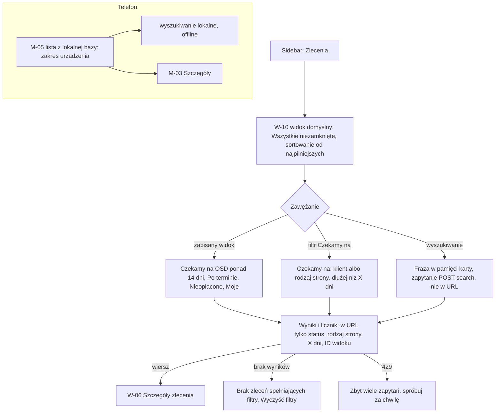

# 07 — Lista zleceń z filtrami

> Dokument żywy (EVM-004; lokalizacja na liście i „Więcej filtrów” — EVM-071, 2026-10-05) · przepływ AC2 nr 7 · kanały: web i mobile · ekrany: W-10, M-05 · indeks: [README.md](README.md)
> Źródła: styleguide § 3.6, § 3.7, § 4.2, § 4.3; `domain-model.md` → `ProcedureStage` (reguła „czekamy na OSD > 14 dni”), „Zakres synchronizacji urządzenia” w `offline-sync.md`; `api-guidelines.md` (paginacja kursorowa, `limit` maks. 100, wyszukiwanie `POST …/search`); SR-API-04, SR-WEB-05, SR-AUTHZ-03, AB-16. Od EVM-071: uwaga PO-6 z EVM-004 (miasto i ulica pod nazwą klienta), historyjka EVM-072 (AC1, AC4, AC8), SR-API-02 (wyszukiwanie 60 / min); konsultacja `security-engineer` w EVM-071 (A1).

## Przepływ


## W-10 Lista zleceń
- **Cel:** od razu zobaczyć, co wymaga działania — gdzie czekamy (zwłaszcza na OSD dłużej niż X dni), co jest po terminie i co nieopłacone — i przejść do zlecenia.
- **Główna akcja:** wybór zlecenia (cały wiersz jest linkiem); akcja główna strony — „Nowe zlecenie” (A, E).
- **Hierarchia treści:** 1) tytuł „Zlecenia” + „Nowe zlecenie”; 2) zapisane widoki; 3) pasek filtrów z wyszukiwaniem i aktywnymi chipami; 4) licznik wyników; 5) tabela z kolumnami priorytetowymi; 6) paginacja.

**Makieta (expanded)**
```text
Zlecenia                                                         [[ + Nowe zlecenie ]]
Widoki: {Wszystkie niezamknięte} {✓ Czekamy na OSD > 14 dni} {Po terminie} {Nieopłacone} {Moje}
┌────────────────────────────────────────────────────────────────────────────────────────┐
│ [Szukaj: numer, tytuł, klient, adres… ‹search›]   Status [Niezamknięte ▾]               │
│ Czekamy na [strona: OSD ▾] dłużej niż [14] dni     Opiekun [Wszyscy ▾]  [Więcej filtrów]│
│ Aktywne: {Czekamy na: OSD > 14 dni ✕} {Status: niezamknięte ✕}   Wyczyść filtry          │
└────────────────────────────────────────────────────────────────────────────────────────┘
 6 zleceń                                       Sortuj: Najpilniejsze ▾   Na stronie [25 ▾]
┌──────────────────────┬───────────────┬───────────────┬──────────────────────────┬────────────┬──────────────────┐
│ Zlecenie             │ Klient        │ Status        │ Czekamy na               │ Termin     │ Płatność         │
├──────────────────────┼───────────────┼───────────────┼──────────────────────────┼────────────┼──────────────────┤
│ ZL-2026-0042         │ Jan           │ «W realizacji»│ Stoen Operator (OSD)     │ ‹alarm-clock›│ «Po terminie»  │
│ Garaż — pełny proces │ Przykładowy   │               │ · od 15 dni ‹triangle-alert› +1 │ 30.09.2026 │ 3 600,00 zł    │
│                      │ ul. Testowa 7,│               │                          │            │                  │
│                      │ Warszawa      │               │                          │            │                  │
├──────────────────────┼───────────────┼───────────────┼──────────────────────────┼────────────┼──────────────────┤
│ ZL-2026-0038         │ Firma Testowa │ «W realizacji»│ Stoen Operator (OSD)     │ 15.10.2026 │ Nieopłacone (1)  │
│ Dom — pełny pakiet   │ sp. z o.o.    │               │ · od 22 dni ‹triangle-alert│            │ 4 500,00 zł      │
│                      │ ul. Próbna 5, │               │                          │            │                  │
│                      │ Warszawa      │               │                          │            │                  │
├──────────────────────┼───────────────┼───────────────┼──────────────────────────┼────────────┼──────────────────┤
│ …                    │               │               │                          │            │                  │
└──────────────────────┴───────────────┴───────────────┴──────────────────────────┴────────────┴──────────────────┘
                                                        ‹ Poprzednia   Następna ›
```

**Zapisane widoki i filtry**
| Widok / filtr | Definicja (bez nowych pól — wyliczane z modelu) | W adresie URL |
|---|---|---|
| Wszystkie niezamknięte (domyślny) | status ≠ `settled`, `cancelled` | ID widoku |
| **Czekamy na OSD > 14 dni** | zlecenie ma etap: `status = waiting` ∧ `waitingOn = party` ∧ `Party.kind = distribution_system_operator` ∧ `waitingSince` < dziś − 14 (`Europe/Warsaw`) — reguła z `domain-model.md` | ID widoku |
| **Czekamy na: [klient / rodzaj strony] dłużej niż [X] dni** | jak wyżej z wybranym `waitingOn` (klient albo strona danego rodzaju — etykiety § 6.2) i liczbą dni X (domyślnie 14) | rodzaj strony, X |
| Po terminie | zlecenie ma transzę z `isOverdue` (§ 4.4) | ID widoku |
| Nieopłacone | zlecenie ma transzę w stanie `invoiced` (także po terminie) | ID widoku |
| Moje | opiekun = zalogowana osoba (`WorkOrderAssignment` `coordinator`) | ID widoku (bez identyfikatora osoby) |
| Status | wielokrotny wybór z § 4.4 | status |
| Opiekun (w pasku filtrów) | opiekun zlecenia — wybór osoby po identyfikatorze | **nie** — w pamięci karty |
| Typ obiektu, szablon (w „Więcej filtrów” — [niżej](#w-10-lokalizacja-na-liście-i-więcej-filtrów-evm-071)) | `Site.siteType`, `WorkOrder.sourceTemplateId` (EVM-072 AC4) | **nie** — w pamięci karty |
| Wyszukiwanie (numer, tytuł, klient, adres) | `POST …/work-orders/search` z frazą w treści | **nie** — w pamięci karty, także nie w tytule karty |

- **Sortowanie domyślne „Najpilniejsze”** (§ 4.2): najpierw zlecenia z płatnością po terminie i etapem po terminie, potem najdłuższe oczekiwanie powyżej progu, potem najbliższy termin rosnąco. Inne: „Najdłużej czekamy”, „Termin”, „Numer”.
- **Kolumna „Czekamy na”:** najdłuższe oczekiwanie w zleceniu wg § 4.4 + „+n” dla kolejnych; powyżej 14 dni — `triangle-alert` i `color.text.warning`.
- **Kolumna „Płatność”:** „Po terminie” (mocna odznaka + kwota) > „Nieopłacone (n)” + suma > „Opłacone” > „—” (brak wystawionych).
- **Zapamiętywanie** filtrów i sortowania per użytkownik — poza magazynami przeglądarki (§ 4.3): do decyzji o preferencjach po stronie serwera tylko pamięć karty + URL w zakresie z tabeli.
- **Bez eksportu CSV / XLSX w MVP** (eksport danych — Administrator ze step-upem, M4).

### W-10: lokalizacja na liście i „Więcej filtrów” (EVM-071)
**Kolumna „Klient” z lokalizacją** (PO-6; EVM-072 AC1)
- Pod nazwą klienta druga linia z lokalizacją zlecenia: ulica z numerem i miasto, w kolejności z § 6.3, bez kodu pocztowego i miejsca postojowego — „ul. Testowa 7, Warszawa” (`text.body-sm`, `color.text.secondary`). Dane pobierane wsadowo raz na stronę (EVM-072 AC1).
- Na `breakpoint.wide` lokalizacja przechodzi do osobnej kolumny „Lokalizacja” (miasto i ulica), a kolumna „Klient” ma jedną linię — bez powtórzenia. Na `breakpoint.medium` klient i lokalizacja są pod tytułem zlecenia; na `breakpoint.compact` — na karcie, pod tytułem.
- **Klient usunięty** (dla Edytora i Tylko odczyt — ustalenie A1, [README → zasada wspólna 18](README.md#bezpieczeństwo-i-prywatność-w-ui)): w kolumnie „Klient” — „Klient usunięty” (`color.text.secondary`), bez linku i bez danych; lokalizacja zostaje (to nie są dane klienta). Wyszukiwanie po nazwisku takiego klienta nie znajduje zlecenia (warunek na serwerze). Administrator widzi nazwę klienta ze znacznikiem „Usunięty”.
- Wyszukiwanie (pole na liście i w TopBar) obejmuje numer, tytuł, klienta i adres — `POST /api/v1/work-orders/search`, fraza od 3 znaków, poza URL, tytułem karty i logami (EVM-072 AC2).

**„Więcej filtrów”** (§ 3.7 — panel „Więcej filtrów”; EVM-072 AC4)
```text
 [Więcej filtrów (2) ▾]   ← liczba aktywnych filtrów z panelu na przycisku
 ┌─ Więcej filtrów ─────────────────────────────────────────────
 │ Typ obiektu [Garaż w budynku wielorodzinnym ▾]
 │ Szablon     [Garaż — pełny proces ▾]
 │                                          [Wyczyść te filtry]
 └──────────────────────────────────────────────────────────────
 Aktywne: {Status: niezamknięte ✕} {Typ obiektu: Garaż w budynku wielorodzinnym ✕}
          {Szablon: Garaż — pełny proces ✕}   Wyczyść filtry
```
- „Opiekun” zostaje w pasku filtrów (filtr częsty); w panelu są „Typ obiektu” (Select — etykiety `SiteType`, `service-catalog.md` § 7) i „Szablon” (Select — szablony zleceń, także wycofane, bo zlecenia je mają). Rozstrzygnięcie 10 w EVM-071.
- Panel rozwija się pod paskiem filtrów (przycisk z `aria-expanded`), bez dialogu; wybór działa od razu (§ 3.7 — bez „Zastosuj” na web). Przycisk pokazuje liczbę aktywnych filtrów z panelu: „Więcej filtrów (2)”.
- Każdy aktywny filtr ma chip z „✕” w wierszu „Aktywne”; „Wyczyść te filtry” czyści tylko filtry z panelu, „Wyczyść filtry” — wszystkie.
- Filtry z panelu są w pamięci karty, nie w URL (EVM-072 AC4) — razem z frazą i opiekunem.
- Na `breakpoint.compact` panel jest częścią arkusza filtrów z „Pokaż wyniki (6)”.

**Stany wyszukiwania i panelu** (uzupełniają tabelę „Stany” niżej): offline — pole wyszukiwania wyłączone z podpowiedzią „Wyszukasz po powrocie połączenia.” (EVM-072 AC8); `429` wyszukiwania (60 / min — SR-API-02) — „Zbyt wiele zapytań. Spróbuj ponownie za 1 min.”, fraza i filtry zostają; brak wyników z filtrami panelu — „Brak zleceń spełniających filtry. [Wyczyść filtry]”; lista szablonów nie wczytana — Select z komunikatem „Nie udało się wczytać szablonów. [Spróbuj ponownie]”, pozostałe filtry działają.

**Role:** filtry z panelu i lokalizacja w kolumnie „Klient” — A, E, R jak lista (odczyt listy `WorkOrder` tą samą polityką — SR-AUTHZ-03; EVM-072 AC7).

**Stany**
| Stan | Zachowanie |
|---|---|
| Pusty | Brak zleceń w systemie: „Nie masz jeszcze zleceń. [Nowe zlecenie]” (Tylko odczyt — bez przycisku); brak wyników filtrów: „Brak zleceń spełniających filtry. [Wyczyść filtry]”; widok „Czekamy na OSD > 14 dni” bez wyników: „Nie czekamy na OSD dłużej niż 14 dni. Dobra wiadomość.” |
| Ładowanie | Skeleton wierszy tabeli (§ 3.16); filtry pozostają aktywne (§ 3.7); po 10 s komunikat „Ładowanie trwa dłużej niż zwykle…”. |
| Błąd | Nie wczytano listy — EmptyState `circle-alert` „Nie udało się wczytać zleceń. [Spróbuj ponownie]”; `429` — „Zbyt wiele zapytań. Spróbuj ponownie za 1 min.” (czas z `Retry-After`), filtry zostają; kursor nieważny (`400 invalid_cursor`) — powrót na pierwszą stronę z komunikatem „Lista się zmieniła — wróciliśmy na początek.” |
| Offline | Baner § 4.10; ostatnio wczytana strona z pamięci karty z banerem „Dane mogą być nieaktualne (z 14:05)”; filtry i paginacja wyłączone z podpowiedzią; pole wyszukiwania wyłączone z podpowiedzią „Wyszukasz po powrocie połączenia.” (EVM-072 AC8). |
| Brak uprawnień | Lista filtrowana tą samą polityką co odczyt zlecenia (SR-AUTHZ-03) — zlecenia spoza uprawnień nie istnieją w wynikach ani w licznikach. Tylko odczyt — bez „Nowe zlecenie”. Zapisany widok spoza uprawnień (np. link od Administratora) — „Nie znaleziono widoku. [Pokaż wszystkie zlecenia]”. Klient usunięty — w kolumnie „Klient” „Klient usunięty” dla E i R (wyżej). |

**Role**
| Akcja | Operacja | A | E | R |
|---|---|---|---|---|
| Lista, filtry, widoki, wyszukiwanie | odczyt listy `WorkOrder` (`GET` z filtrami bez danych osobowych, `POST …/search` z frazą) | tak | tak | tak |
| Nowe zlecenie | W-05 (`CreateWorkOrder`) | tak | tak | ukryte |
| Eksport listy | — (poza MVP) | nie ma w UI | nie ma w UI | nie ma w UI |

- **Responsywność:** `breakpoint.wide` — dodatkowe kolumny „Lokalizacja” (miasto i ulica — wtedy bez drugiej linii w kolumnie „Klient”), „Opiekun”, „Postęp” (ProcedureProgress kompaktowy, § 3.23 — suma etapów procesów zlecenia); `breakpoint.expanded` — 6 kolumn priorytetowych (makieta), lokalizacja jako druga linia w kolumnie „Klient”; `breakpoint.medium` — Sidebar zwinięty, kolumny „Zlecenie”, „Status”, „Czekamy na”, „Płatność” (klient i lokalizacja pod tytułem zlecenia); `breakpoint.compact` — lista kart (§ 3.6, § 3.8) z tymi samymi danymi priorytetowymi (klient i „ul. Testowa 7, Warszawa” pod tytułem), filtry i „Więcej filtrów” w arkuszu z „Pokaż wyniki (6)”, zapisane widoki przewijane poziomo.
- **Komponenty i tokeny:** DataTable (§ 3.6) — nagłówek `color.bg.surface-subtle` + `text.label`, przyklejony (`elevation.sticky`, `layer.sticky`), wiersz `size.control.height.web.lg`, tekst `text.body-sm`, lokalizacja `text.body-sm` `color.text.secondary`, liczby `text.numeric` do prawej, `aria-sort`; FilterBar, FilterChip, SearchField, zapisane widoki, panel „Więcej filtrów” (§ 3.7) — chipy `size.control.height.web.sm`, `radius.pill`, panel `color.bg.surface-subtle`, `space.inset.md`; Select (§ 3.3); TextField liczba (§ 3.2); StatusBadge (§ 3.9) z `color.status.order.*`, `color.status.payment.overdue.*`; odznaka wartości nieznanej (§ 3.9.1, `color.status.unknown.*`); ikony `triangle-alert` `color.icon.warning`, `alarm-clock` `color.icon.error`; Card (§ 3.8) na compact; Button primary (§ 3.1); EmptyState (§ 3.15); Skeleton (§ 3.16).
- **Mikrocopy:** „Zlecenia” · „Nowe zlecenie” · nazwy widoków z tabeli · „Szukaj: numer, tytuł, klient, adres…” · „Czekamy na” · „dłużej niż” · „dni” · „Więcej filtrów” · „Więcej filtrów (2)” · „Typ obiektu” · „Szablon” · „Wyczyść te filtry” · „Wyczyść filtry” · „Lokalizacja” · „Klient usunięty” · „Wyszukasz po powrocie połączenia.” · licznik „6 zleceń” (odmiana § 6.3) · „Najpilniejsze” · „Na stronie” · „Nie czekamy na OSD dłużej niż 14 dni. Dobra wiadomość.”
- **Dostępność:** wiersz jako link z nazwą „ZL-2026-0042, Garaż — pełny proces, Jan Przykładowy, ul. Testowa 7, Warszawa, W realizacji, czekamy na Stoen Operator (OSD) od 15 dni, płatność po terminie”; „Więcej filtrów (2)” z `aria-expanded` i `aria-controls`, nazwa dostępna = widoczna etykieta, opis w `aria-describedby` („Aktywne filtry w panelu: 2”); zmiana liczby wyników ogłaszana `aria-live="polite"`; filtry z etykietami; chipy aktywnych filtrów z przyciskiem „Usuń filtr …”; tytuł karty „Zlecenia · EVia Manager” — bez frazy wyszukiwania i nazw (zasady wspólne pkt 1).

## M-05 Lista zleceń
- **Cel:** w terenie, bez zasięgu, szybko znaleźć zlecenie (po adresie, nazwisku, numerze) i wejść w nie, widząc, co jest niewysłane.
- **Główna akcja:** wybór zlecenia (cała karta).
- **Hierarchia treści:** 1) wyszukiwanie lokalne; 2) chipy „Wszystkie”, „Moje”, „Czekamy na…”; 3) karty: numer (albo „Oczekuje na numer” — § 4.15), tytuł, status, adres (`text.body-lg`), „Czekamy na: …”, licznik niewysłanych; 4) informacja o zakresie urządzenia.

**Makieta (compact)**
```text
┌──────────────────────────────────┐
│ Zlecenia        ⟨Zsynchr. 14:05⟩ │
├──────────────────────────────────┤
│ [Szukaj: adres, nazwisko, numer ]│
│ {✓ Wszystkie} {Moje} {Czekamy na…}│
│                                  │
│ ┌──────────────────────────────┐ │
│ │ ZL-2026-0042  «W realizacji» │ │
│ │ Garaż — pełny proces         │ │
│ │ ul. Testowa 7, Warszawa      │ │ text.body-lg
│ │ miejsce nr 15, poziom −1     │ │
│ │ Czekamy na: Stoen Operator   │ │
│ │ (OSD) · od 15 dni            │ │
│ │ ‹clock› 3 niewysłane         │ │ color.sync.queued.*
│ └──────────────────────────────┘ │
│ ┌──────────────────────────────┐ │
│ │ ‹clock› Oczekuje na numer    │ │ § 4.15
│ │ Dom — sam montaż             │ │
│ │ ul. Fikcyjna 12, Piaseczno   │ │
│ │ Zapisano w telefonie 13:40   │ │
│ └──────────────────────────────┘ │
│ Pokazujemy zlecenia niezamknięte │
│ i zamknięte w ostatnich 30 dniach.│
├──────────────────────────────────┤
│ Zlecenia  Dodaj  Kolejka  Więcej │
└──────────────────────────────────┘
```

**Stany**
| Stan | Zachowanie |
|---|---|
| Pusty | Brak zleceń w zakresie: „Nie masz zleceń w telefonie. Zlecenia pojawią się po synchronizacji. [Nowe zlecenie]”; brak wyników wyszukiwania: „Brak zleceń dla „…”. Szukamy tylko w zleceniach zapisanych w telefonie.” |
| Ładowanie | Pierwsza synchronizacja po logowaniu — Skeleton kart i „Pobieramy zlecenia…”; później dane z lokalnej bazy od razu; odświeżenie pociągnięciem (spinner dozwolony — § 3.16). |
| Błąd | Synchronizacja nieudana — SyncIndicator „Nie wysłano · Ponów” / baner „Nie udało się pobrać zmian. Pokazujemy dane z 14:05. [Spróbuj ponownie]”; lista z lokalnej bazy działa. |
| Offline | SyncIndicator „Offline · 5” + baner § 5.4; wyszukiwanie i lista działają lokalnie. |
| Brak uprawnień | Tylko odczyt — M-02. Tryb ukrytych danych (§ 4.18) — zamiast listy EmptyState (dane nie są renderowane): „Dane zleceń są ukryte — [powód]. Aparat i kolejka działają.” + akcja wyjścia (M-02). Zlecenie, do którego odebrano dostęp, znika po synchronizacji; jego niewysłane elementy zostają w Kolejce. |

**Role**
| Akcja | Operacja | A | E | R |
|---|---|---|---|---|
| Lista i wyszukiwanie lokalne | lokalna baza (kanał zmian, zakres urządzenia — `offline-sync.md`) | tak | tak | brak dostępu (M-02) |
| Nowe zlecenie (z BottomNav „Dodaj”) | M-10 (`CreateQuickWorkOrder`) | tak | tak | — |

- **Responsywność:** jedna kolumna kart; powiększenie czcionki do 200 % — adres zawijany, nie skracany; pozioma orientacja — karty na pełną szerokość.
- **Komponenty i tokeny:** AppBar z SyncIndicator (§ 3.18, § 5.4); SearchField i FilterChip (§ 3.7) — wysokość `size.touch-target.min`; Card zlecenia (§ 3.8) — `space.inset.md`, odstęp `space.stack.sm`, adres `text.body-lg`; StatusBadge (§ 3.9; wartość nieznana — § 3.9.1, tylko odznaka na karcie); odznaka „Oczekuje na numer” (§ 4.15); licznik niewysłanych `color.sync.queued.*` + `clock`; Banner (§ 3.19) — ostrzeżenie o poprawkach (M-02); EmptyState (§ 3.15); BottomNav (§ 3.18).
- **Mikrocopy:** „Zlecenia” · „Szukaj: adres, nazwisko, numer” · „Wszystkie” / „Moje” / „Czekamy na…” · „3 niewysłane” · „Oczekuje na numer” · „Pokazujemy zlecenia niezamknięte i zamknięte w ostatnich 30 dniach.” · „Szukamy tylko w zleceniach zapisanych w telefonie.”
- **Dostępność:** karta jako jeden element z nazwą „ZL-2026-0042, W realizacji, ul. Testowa 7, Warszawa, czekamy na Stoen Operator od 15 dni, 3 niewysłane”; cele dotyku ≥ `size.touch-target.min`; wyszukiwanie z przyciskiem wyczyść `x`.
