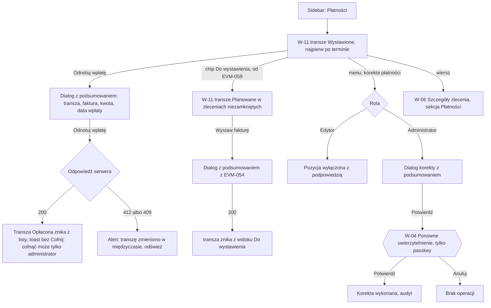

# 08 — Zestawienie nieopłaconych

> Dokument żywy (EVM-004; dialogi „Dodaj transzę” i „Zmień kwotę” oraz widok „Do wystawienia” — EVM-071, 2026-10-05) · przepływ AC2 nr 8 · kanał: web (płatności nie trafiają na telefon) · ekran: W-11 (+ akcje płatności w W-06) · indeks: [README.md](README.md)
> Źródła: `domain-model.md` → `PaymentMilestone`, tabela przejść „Etap płatności”, „Korekta płatności”; słownik „nieopłacone / po terminie” ([`domain.md`](../../product/domain.md)); styleguide § 4.4, § 4.11; polityki P2 (step-up), P6 (Tylko odczyt widzi płatności); SR-AUTHZ-10, SR-SESS-08; konsultacja `security-engineer` EVM-004 (M2, M3). Od EVM-071: historyjki EVM-053 (AC3, AC4, AC5, AC8), EVM-059, decyzja 17; SR-AUTHZ-03, SR-LOG-03, SR-API-05, -07; konsultacja `security-engineer` w EVM-071 (S7, B4).

## Przepływ


## W-11 Nieopłacone
- **Cel:** zobaczyć wszystkie wystawione, a nieopłacone transze (najpierw po terminie), ich sumy i szybko odnotować wpłatę.
- **Główna akcja:** „Odnotuj wpłatę” przy transzy.
- **Hierarchia treści:** 1) tytuł „Płatności — nieopłacone” (w widoku „Do wystawienia” — „Płatności — do wystawienia”, [niżej](#w-11-widok-do-wystawienia)); 2) kafle sum (nieopłacone, po terminie, najstarsza po terminie); 3) filtry; 4) tabela transz; 5) suma i paginacja.

**Makieta (expanded)**
```text
Płatności — nieopłacone
┌ Nieopłacone ───────────────┐┌ Po terminie ───────────────┐┌ Najdłużej po terminie ───┐
│ 12 transz · 48 300,00 zł   ││ «Po terminie» 4 ·           ││ 21 dni · ZL-2026-0031    │
│                            ││ 15 200,00 zł                ││                          │
└────────────────────────────┘└─────────────────────────────┘└──────────────────────────┘
Pokaż: {✓ Wszystkie wystawione} {Po terminie} {Do wystawienia}    Termin [od __.__.____ do __.__.____]
                                              └ od EVM-059
Klient [Szukaj klienta… ‹search›]
 12 transz                                 Sortuj: Najdłużej po terminie ▾  Na stronie [25 ▾]
┌────────────┬──────────┬──────────────────────┬──────────────┬───────────────┬──────────────────┬─────────────┬──────────────────────────┐
│ Termin     │ Po term. │ Zlecenie             │ Klient       │ Transza       │ Nr faktury       │       Kwota │ Status / akcje           │
├────────────┼──────────┼──────────────────────┼──────────────┼───────────────┼──────────────────┼─────────────┼──────────────────────────┤
│ 12.09.2026 │ 21 dni   │ ZL-2026-0031         │ Anna Testowa │ Płatność      │ FV/TEST/0003/2026│ 6 000,00 zł │ «Po terminie»            │
│            │          │ Dom — pełny pakiet   │              │ końcowa       │                  │             │ [Odnotuj wpłatę]       ⋮ │
├────────────┼──────────┼──────────────────────┼──────────────┼───────────────┼──────────────────┼─────────────┼──────────────────────────┤
│ 08.09.2026 │ 5 dni    │ ZL-2026-0042         │ Jan          │ Zaliczka      │ FV/TEST/0007/2026│ 3 600,00 zł │ «Po terminie»            │
│            │          │ Garaż — pełny proces │ Przykładowy  │               │                  │             │ [Odnotuj wpłatę]       ⋮ │
├────────────┼──────────┼──────────────────────┼──────────────┼───────────────┼──────────────────┼─────────────┼──────────────────────────┤
│ 15.10.2026 │ —        │ ZL-2026-0038         │ Firma Testowa│ Zaliczka      │ FV/TEST/0009/2026│ 4 500,00 zł │ «Wystawiona»             │
│            │          │ Dom — pełny pakiet   │ sp. z o.o.   │               │                  │             │ [Odnotuj wpłatę]       ⋮ │
│ …          │          │                      │              │               │                  │             │                          │
└────────────┴──────────┴──────────────────────┴──────────────┴───────────────┴──────────────────┴─────────────┴──────────────────────────┘
                                                Suma (12 transz): 48 300,00 zł
                                                        ‹ Poprzednia   Następna ›

 Dialog „Odnotuj wpłatę” (size.dialog.width.sm, § 4.11 — z podsumowaniem):
┌──────────────────────────────────────────────┐
│ Odnotować wpłatę za transzę „Zaliczka”?      │
│ ZL-2026-0042 · Garaż — pełny proces          │
│ Faktura FV/TEST/0007/2026 · 3 600,00 zł      │
│ Termin 08.09.2026 (5 dni po terminie)        │
│ Data wpłaty [03.10.2026 ‹calendar›]          │
│ Nie później niż dziś.                        │
│ Cofnąć wpłatę może tylko administrator.      │
│              [Anuluj]  [[ Odnotuj wpłatę ]]  │
└──────────────────────────────────────────────┘
```

## Akcje płatności — status × rola
Wspólna tabela dla W-11 i sekcji „Płatności” w [W-06](03-szczegoly-zlecenia.md#w-06-szczegóły-zlecenia) (M3 z konsultacji security). Dostępność akcji ściśle wg tabeli przejść „Etap płatności” w `domain-model.md`. **Edytor anuluje wyłącznie transzę „Planowaną”** (doprecyzowanie decyzji z EVM-002). Akcje Administratora ze step-upem przechodzą przez [W-04](01-logowanie-mfa.md#w-04-ponowne-uwierzytelnienie) (tylko passkey); u Edytora są widoczne, ale wyłączone z podpowiedzią „Korektę płatności może wykonać tylko administrator.”; rola Tylko odczyt nie widzi żadnej akcji. **Żadna akcja płatności nie ma „Cofnij”** — każda ma dialog z podsumowaniem (§ 4.11).

| Status transzy | Akcja | Przejście / operacja | A | E | R |
|---|---|---|---|---|---|
| Planowana | Wystaw fakturę… (kwota, nr faktury lub proformy, data wystawienia; termin domyślnie data + dni z planu) | `planned → invoiced` | tak | tak | ukryte |
| Planowana | Zmień kwotę… ([dialog](#dialogi-dodaj-transzę-i-zmień-kwotę) — bez podsumowania, zmianę kwoty w `planned` odwraca ta sama rola) | edycja `amountMinor` w `planned` | tak | tak | ukryte |
| Planowana | Anuluj transzę… (wymagany powód) | `planned → cancelled` | tak | tak | ukryte |
| Wystawiona (także po terminie) | Odnotuj wpłatę… (data wpłaty) | `invoiced → paid` | tak | tak | ukryte |
| Wystawiona | Popraw dane faktury (nr, data wystawienia, termin) | edycja `invoiceNumber`, `invoicedOn`, `dueDate` | tak | tak | ukryte |
| Wystawiona | Wycofaj fakturę… | `invoiced → planned` — korekta płatności | tak ↑ | wyłączone | ukryte |
| Wystawiona | Anuluj fakturę… | `invoiced → cancelled` — korekta płatności | tak ↑ | wyłączone | ukryte |
| Wystawiona, Opłacona | Zmień kwotę… (korekta — dialog z podsumowaniem kwoty przed i po, potem W-04; dialog „Zmień kwotę” transzy „Planowana” tu nie występuje — ustalenie B4) | edycja `amountMinor` w `invoiced` / `paid` — korekta płatności | tak ↑ | wyłączone | ukryte |
| Opłacona | Popraw datę wpłaty | edycja `paidOn` | tak | tak | ukryte |
| Opłacona | Cofnij wpłatę… | `paid → invoiced` — korekta płatności | tak ↑ | wyłączone | ukryte |
| Anulowana | Przywróć transzę… | `cancelled → planned` — korekta płatności | tak ↑ | wyłączone | ukryte |
| każdy | Usuń transzę… | soft delete `PaymentMilestone` — korekta płatności | tak ↑ | wyłączone | ukryte |
| — (zlecenie) | Dodaj transzę ([dialog](#dialogi-dodaj-transzę-i-zmień-kwotę)) | utworzenie `PaymentMilestone` (`planned`, na końcu listy; 21. — `422 limit_exceeded`) | tak | tak | ukryte |
| zlecenie Rozliczone albo Anulowane | wszystkie powyższe | zmiany płatności zablokowane (`domain-model.md`) | wyłączone: „Zlecenie jest rozliczone — płatności są tylko do odczytu. Przywrócić zlecenie może tylko administrator.” | wyłączone (jw.) | ukryte |

**Transza „Planowana” w W-06 — rozmieszczenie akcji** (ActionMenu, § 3.20):
- „Wystaw fakturę…” to widoczny przycisk wiersza;
- menu `⋮` („Akcje transzy: [nazwa]”) ma najpierw „Zmień kwotę…”, a na końcu, w osobnej grupie, „Anuluj transzę…” i „Usuń transzę…”;
- odnośnik „kwoty transz” z banera „Zlecenie założone w terenie” ustawia fokus na tym wyzwalaczu `⋮` ([W-06 → baner](03-szczegoly-zlecenia.md#w-06-szczegóły-zlecenia)).

**Dialogi z podsumowaniem** (tytuł-pytanie, skutek, przycisk z czasownikiem; fokus na „Anuluj”)
| Akcja | Podsumowanie w dialogu | Zdanie o skutku |
|---|---|---|
| Wystaw fakturę | transza, zlecenie, kwota, nr faktury, data wystawienia, termin | „Cofnąć wystawienie może tylko administrator.” |
| Odnotuj wpłatę | transza, faktura, kwota, termin (i dni po terminie), data wpłaty | „Cofnąć wpłatę może tylko administrator.” |
| Anuluj transzę (Planowaną) | transza, udział, powód | „Przywrócić transzę może tylko administrator.” (przycisk danger „Anuluj transzę”) |
| Korekty Administratora (wycofaj fakturę, anuluj fakturę, cofnij wpłatę, zmień kwotę, przywróć, usuń) | stan przed i po (np. „Wystawiona → Planowana”), kwota przed i po, nr faktury, data | „Operacja zostanie zapisana w dzienniku audytu.” — potem W-04 z tytułem „Potwierdź tożsamość, aby skorygować płatność” |

**Stany**
| Stan | Zachowanie |
|---|---|
| Pusty | „Wszystkie wystawione faktury są opłacone.” (`circle-check`); brak wyników filtrów — „Brak transz spełniających filtry. [Wyczyść filtry]”. |
| Ładowanie | Skeleton kafli sum i wierszy tabeli; „Odnotuj wpłatę” w dialogu w stanie ładowania. |
| Błąd | Nie wczytano zestawienia — EmptyState `circle-alert` „Nie udało się wczytać płatności. [Spróbuj ponownie]”; `412 version_conflict` / `409 invalid_state_transition` w dialogu — „Tę transzę zmieniono w międzyczasie (teraz: «Opłacona»). [Odśwież]” (forma bezosobowa — README → zasada wspólna 16); `422 transition_condition_not_met` — komunikat pod polem („Data wpłaty nie może być późniejsza niż dziś.”); `429` — wzór z README; brak `step_up` po anulowaniu W-04 — „Nie wykonano korekty.” (dane dialogu zostają). |
| Offline | Baner § 4.10; tabela z pamięci karty z banerem „Dane mogą być nieaktualne (z 14:05)”; akcje wyłączone z podpowiedzią. |
| Brak uprawnień | Tylko odczyt — pełny podgląd (kwoty, numery faktur, terminy, „Po terminie” — P6) bez akcji i bez `⋮`. Edytor — korekty wyłączone z podpowiedzią. Sumy liczone tą samą polityką co lista (SR-AUTHZ-03). Zlecenie niedostępne z wiersza — `404` w W-06. |

**Role** — tabela [Akcje płatności — status × rola](#akcje-płatności--status--rola); dodatkowo:
| Element | Operacja | A | E | R |
|---|---|---|---|---|
| Zestawienie, sumy, filtry | odczyt listy `PaymentMilestone` (`status = invoiced`, `isOverdue`) | tak | tak | tak |
| Eksport zestawienia | — (eksport danych — Administrator ze step-upem, M4) | nie ma w UI | nie ma w UI | nie ma w UI |

**Filtry i URL:** „Wszystkie wystawione” / „Po terminie” (status) — w adresie URL; zakres terminów i klient — w pamięci karty (klient to dane osobowe; termin poza listą dozwolonych parametrów URL z konsultacji security); paginacja maks. 100 (`api-guidelines.md`); tytuł karty „Płatności · EVia Manager”.

- **Responsywność:** `breakpoint.wide` — wszystkie kolumny; `breakpoint.expanded` — jak makieta; `breakpoint.medium` — bez kolumn „Klient” i „Nr faktury” (w szczegółach wiersza), kafle sum w jednym rzędzie; `breakpoint.compact` — lista kart: termin i status na górze, kwota `text.numeric-lg`, „Odnotuj wpłatę” na pełną szerokość, filtry w arkuszu.
- **Komponenty i tokeny:** Card (§ 3.8) — kafle sum, kwoty `text.numeric-lg`; FilterChip, FilterBar (§ 3.7); DatePicker zakres (§ 3.5); Combobox (§ 3.3) — klient; DataTable (§ 3.6) — kwoty `text.numeric` do prawej, `aria-sort`; StatusBadge (§ 3.9) — `color.status.payment.invoiced.*`, `color.status.payment.overdue.*` (wariant mocny), `color.status.payment.planned.*`, `color.status.payment.paid.*`, `color.status.payment.cancelled.*`; dni po terminie `text.numeric` `color.text.error` + `alarm-clock` (§ 4.2); ActionMenu (§ 3.20) — menu `⋮` transzy, korekty Edytora wyłączone z podpowiedzią; AlertDialog (§ 3.13) `size.dialog.width.sm`; Button secondary (akcja w wierszu), primary (w dialogu), danger (anulowanie); Toast (§ 3.14) bez akcji; odznaka wartości nieznanej (§ 3.9.1 — akcje płatności przy niej wyłączone z podpowiedzią).
- **Mikrocopy:** „Płatności — nieopłacone” · „Nieopłacone” · „Po terminie” · „Najdłużej po terminie” · „Wszystkie wystawione” · „Odnotuj wpłatę” · „Odnotować wpłatę za transzę „Zaliczka”?” · „Data wpłaty” · „Nie później niż dziś.” · „Cofnąć wpłatę może tylko administrator.” · „Korektę płatności może wykonać tylko administrator.” · toast: „Odnotowano wpłatę 3 600,00 zł za fakturę FV/TEST/0007/2026.” · pusty: „Wszystkie wystawione faktury są opłacone.” · kwoty wg § 6.3 („3 600,00 zł”, spacje niełamliwe).
- **Dostępność:** „Po terminie” niesie ikona, etykieta i liczba dni (nie sam kolor — § 4.2); kwoty i daty `tabular-nums`; wiersz z nagłówkiem (zlecenie + transza) dla czytnika; dialog z pułapką fokusu, fokus domyślnie na „Anuluj”; wyłączone korekty z `aria-disabled` i podpowiedzią osiągalną klawiaturą (§ 3.1).

## Dialogi „Dodaj transzę” i „Zmień kwotę”
Dialogi sekcji „Płatności” w [W-06](03-szczegoly-zlecenia.md#w-06-szczegóły-zlecenia) (EVM-053 AC3, AC4, AC8; EVM-071 AC4). Obie operacje odwraca ta sama rola bez step-upu (nowa transza „Planowana” — „Anuluj transzę…”; kwota w `planned` — ponowna zmiana), więc to zwykłe dialogi formularza, nie dialogi z podsumowaniem (§ 4.11). Kwota po wystawieniu to korekta Administratora ze step-upem — tabela [akcji płatności](#akcje-płatności--status--rola) (ustalenie B4, SR-AUTHZ-10).

- **Cel:** dopisać transzę spoza planu szablonu (np. dopłata po zmianie zakresu — wariant A z EVM-002) i wpisać kwotę transzy planowanej (zlecenia z szablonu mają transze bez kwot; zlecenia sprzed EVM-053 — bez transz).
- **Główna akcja:** „Dodaj transzę” / „Zapisz kwotę” (primary w dialogu).
- **Hierarchia treści:** 1) tytuł i zlecenie (przy kwocie — transza z udziałem), 2) pola, 3) zdanie o skutku, 4) akcje.
- **Wejścia:** „Dodaj transzę” (Button tertiary z ikoną `plus` pod tabelą „Płatności” i w pustym stanie „Brak transz.”); „Zmień kwotę…” — pierwsza pozycja menu `⋮` transzy „Planowana” („Akcje transzy: [nazwa]”); od E13 — odnośnik „kwoty transz” z banera „Zlecenie założone w terenie” ustawia fokus na tym wyzwalaczu ([W-06](03-szczegoly-zlecenia.md#w-06-szczegóły-zlecenia)).

```text
 Dialog „Dodaj transzę” (size.dialog.width.sm):
 │ Dodaj transzę                                                   [x]
 │ ZL-2026-0051 · Dom — sam montaż
 │ Nazwa transzy [Dopłata za instalację zasilającą______________]
 │ Kwota (opcjonalnie) [1 500,00] zł
 │ Kwotę możesz wpisać później — „Zmień kwotę…” w menu transzy.
 │ Nowa transza będzie ostatnia na liście i będzie miała status
 │ „Planowana”.
 │                                      [Anuluj]  [[ Dodaj transzę ]]

 Dialog „Zmień kwotę” — tylko transza „Planowana” (size.dialog.width.sm):
 │ Zmień kwotę transzy                                             [x]
 │ Po uzyskaniu zgód (30%) · ZL-2026-0042
 │ Udział z planu: 30% (tylko informacyjnie)
 │ Kwota [5 400,00] zł
 │ Kwota brutto do zapłaty. Status zostaje „Planowana”.
 │                                         [Anuluj]  [[ Zapisz kwotę ]]

 Po 412 (kwota) — nad polem InlineAlert błędu, pod polem „Aktualnie: …”:
 │ ┃‹circle-alert› Tę transzę zmieniono w międzyczasie. Twoje zmiany
 │ ┃ zachowaliśmy — sprawdź aktualne wartości i zapisz ponownie.
 │ Kwota [5 400,00] zł
 │ Aktualnie: 4 800,00 zł · «Planowana»            ← zwykły tekst
```

**Pola i walidacja**
| Dialog | Pole | Reguły i komunikaty |
|---|---|---|
| Dodaj transzę | Nazwa transzy | wymagana, zwykły tekst, limit długości z planu EVM-053; „Podaj nazwę transzy.” |
| Dodaj transzę | Kwota (opcjonalnie) | TextField kwota (§ 3.2, `text.numeric`, sufiks „zł”); puste = transza bez kwoty; > 0 i najwyżej 2 miejsca po przecinku: „Podaj kwotę większą od zera, np. 1 500,00 zł.”, „Kwota może mieć najwyżej 2 miejsca po przecinku.”; wpisane „1500” albo „1500,5” — normalizacja do „1 500,00” / „1 500,50” po opuszczeniu pola (§ 6.3) |
| Zmień kwotę | Kwota | wymagana, reguły jak wyżej (EVM-053 AC3 — `400` przy kwocie ≤ 0 albo > 2 miejscach); udział z planu tylko informacyjnie — bez wyliczania kwoty z udziału (EVM-053 → „Poza zakresem”) |

- **Zapis „Dodaj transzę”:** `POST` z identyfikatorem UUIDv7 i `Idempotency-Key` (README M1 → „Kontrakt API”); nowa transza na końcu listy (EVM-053 AC4); toast „Dodano transzę „Dopłata za instalację zasilającą”.”; błąd sieci — „Nie udało się dodać transzy. Spróbuj ponownie — nie dodamy jej dwa razy.”
- **Limit 20 transz:** przy 20 transzach „Dodaj transzę” wyłączony z podpowiedzią „Zlecenie ma już 20 transz — to limit.”; wyścig — `422 limit_exceeded`: alert w dialogu z tą samą treścią.
- **Zapis „Zmień kwotę”:** `PATCH` z `If-Match`; kwota w groszach (`amountMinor`, PLN); zdarzenie audytu z kwotą przed i po (wyjątek audytu dla płatności — SR-LOG-03); toast „Zmieniono kwotę transzy „Po uzyskaniu zgód”: 5 400,00 zł.”
- **Konflikt `412`** — „Tę transzę zmieniono w międzyczasie. Twoje zmiany zachowaliśmy — sprawdź aktualne wartości i zapisz ponownie.” z „Aktualnie: …” (README → zasada wspólna 16). Transza ma już inny status niż „Planowana” (`409 invalid_state_transition` albo stan po odświeżeniu): alert „Transza ma już status «Wystawiona» — kwotę zmieni administrator korektą płatności.”, „Zapisz kwotę” wyłączony.
- **Zlecenie zamknięte** (decyzja 17, EVM-053 AC5): „Dodaj transzę” i „Zmień kwotę…” wyłączone z podpowiedzią z wiersza „zlecenie Rozliczone albo Anulowane” w tabeli akcji; wyścig — `409 work_order_closed` w dialogu.

| Moment | Fokus |
|---|---|
| otwarcie „Dodaj transzę” | pole „Nazwa transzy” |
| otwarcie „Zmień kwotę” | pole „Kwota” (wartość zaznaczona) |
| „Anuluj”, `x`, Esc | wyzwalacz: „Dodaj transzę” albo `⋮` „Akcje transzy: …” |
| sukces „Dodaj transzę” | wyzwalacz `⋮` nowej transzy („Akcje transzy: Dopłata za instalację zasilającą”); wynik ogłasza toast |
| sukces „Zmień kwotę” | wyzwalacz `⋮` tej transzy |
| `412`, `409`, `422`, błąd | alert (`role="alert"`), potem pole z błędem albo z „Aktualnie: …” |

**Stany**
| Stan | Zachowanie |
|---|---|
| Pusty | Zlecenie bez transz (np. sprzed EVM-053) — „Brak transz. [Dodaj transzę]” (EVM-053 AC8); dialogi zawsze mają pola do wypełnienia. |
| Ładowanie | Zapis — przycisk w stanie ładowania, dialog nie zamyka się do wyniku; tabela „Płatności” odświeżana bez przeładowania strony. |
| Błąd | Walidacja pod polem + podsumowanie (§ 4.1); `412`, `409`, `422 limit_exceeded` — wyżej; `429` — wzór z README; błąd serwera — § 6.4. |
| Offline | „Dodaj transzę” i wyzwalacze `⋮` transz wyłączone z podpowiedzią „Zmienisz po powrocie połączenia.” (EVM-053 AC8); otwarty dialog — dane w pamięci karty, przycisk operacji wyłączony z podpowiedzią „Zapiszesz po powrocie połączenia.” |
| Brak uprawnień | Tylko odczyt — bez „Dodaj transzę” i wyzwalaczy `⋮` (kwoty, statusy i sumy widoczne — P6; mutacja `403`); transza innego zlecenia ścieżką tego zlecenia — `404` (EVM-053 AC7): alert „Nie znaleziono transzy. Odśwież zlecenie.”; pola serwera (`status`, `sharePercent`) nie są w dialogach (`read_only_field`). |

**Role**
| Akcja | Operacja | A | E | R |
|---|---|---|---|---|
| Dodaj transzę | utworzenie `PaymentMilestone` (`planned`; UUIDv7 + `Idempotency-Key`; 21. — `422`) | tak | tak | ukryte (`403`) |
| Zmień kwotę… (Planowana) | edycja `amountMinor` w `planned` (`If-Match`, audyt kwoty przed i po) | tak | tak | ukryte (`403`) |
| Zmień kwotę… (Wystawiona, Opłacona) | korekta płatności (A ↑) — [tabela akcji](#akcje-płatności--status--rola) | tak ↑ | wyłączone | ukryte |
| — w zleceniu zamkniętym | `409 work_order_closed` | wyłączone | wyłączone | ukryte |

- **Responsywność:** `breakpoint.medium` i szersze — dialog `size.dialog.width.sm`; `breakpoint.compact` — dialog na pełną szerokość, przyciski na dole, klawiatura numeryczna z przecinkiem dla kwoty (`inputmode="decimal"`).
- **Komponenty i tokeny:** Dialog (§ 3.13) `size.dialog.width.sm`, tytuł `text.heading-3`, zlecenie i transza `text.body-sm` `color.text.secondary`; TextField (§ 3.2) — tekst i kwota (`text.numeric`, sufiks „zł”); udział z planu `text.body-sm` `color.text.secondary`; InlineAlert (§ 3.19) `color.feedback.error.*`; StatusBadge (§ 3.9) `color.status.payment.planned.*` w „Aktualnie: …”; Button primary / tertiary (§ 3.1); Toast (§ 3.14).
- **Mikrocopy:** „Dodaj transzę” · „Nazwa transzy” · „Kwota (opcjonalnie)” · „Kwotę możesz wpisać później — „Zmień kwotę…” w menu transzy.” · „Nowa transza będzie ostatnia na liście i będzie miała status „Planowana”.” · „Dodano transzę „…”.” · „Zlecenie ma już 20 transz — to limit.” · „Zmień kwotę…” · „Zmień kwotę transzy” · „Udział z planu: 30% (tylko informacyjnie)” · „Kwota brutto do zapłaty. Status zostaje „Planowana”.” · „Zapisz kwotę” · „Zmieniono kwotę transzy „…”: 5 400,00 zł.” · „Tę transzę zmieniono w międzyczasie. Twoje zmiany zachowaliśmy — sprawdź aktualne wartości i zapisz ponownie.” · „Transza ma już status «Wystawiona» — kwotę zmieni administrator korektą płatności.” · „Podaj nazwę transzy.” · „Podaj kwotę większą od zera, np. 1 500,00 zł.” · „Kwota może mieć najwyżej 2 miejsca po przecinku.” · kwoty wg § 6.3.
- **Dostępność:** pułapka fokusu, `aria-labelledby` (tytuł), `aria-describedby` (transza i udział); jednostka „zł” w nazwie dostępnej pola („Kwota, złote”); fokus wg tabeli; wynik ogłasza toast (`role="status"`); pozycja „Zmień kwotę…” wyłączona offline i w zleceniu zamkniętym z `aria-disabled` i podpowiedzią.

## W-11: widok „Do wystawienia”
Wariant **„od EVM-059”** (P2). Przed EVM-059 chipa „Do wystawienia” nie ma.

- **Cel:** zobaczyć transze „Planowane” w zleceniach niezamkniętych, czyli faktury, które trzeba jeszcze wystawić, i od razu je wystawić (EVM-059; słownik — „Do wystawienia”, [`domain.md`](../../product/domain.md)).
- **Główna akcja:** „Wystaw fakturę…” w wierszu (A, E).
- **Hierarchia treści:** 1) tytuł „Płatności — do wystawienia” („Planowana” nie jest nieopłacona — § 6.2; rozstrzygnięcie 11), 2) kafle sum bez zmian, 3) chipy widoku i filtr klienta, 4) tabela transz, 5) paginacja.

```text
Płatności — do wystawienia
┌ Nieopłacone ───────────────┐┌ Po terminie ───────────────┐┌ Najdłużej po terminie ───┐
│ (kafle sum bez zmian)      ││                             ││                          │
└────────────────────────────┘└─────────────────────────────┘└──────────────────────────┘
Pokaż: {Wszystkie wystawione} {Po terminie} {✓ Do wystawienia}
Klient [Szukaj klienta… ‹search›]                   ← filtr „Termin” ukryty w tym widoku
 5 transz                                                    Sortowanie: wg zlecenia
 Zlecenie                          Klient                      Transza                         Kwota          Akcja
 ─────────────────────────────────────────────────────────────────────────────────────────────────────────────────────
 ZL-2026-0038 · Dom — pełny        Firma Testowa sp. z o.o.    Płatność końcowa (70%)          —              [Wystaw fakturę…]
 pakiet
 ZL-2026-0042 · Garaż — pełny      Jan Przykładowy             Po uzyskaniu zgód (30%)         5 400,00 zł    [Wystaw fakturę…]
 proces
 ZL-2026-0042 · Garaż — pełny      Jan Przykładowy             Po wykonaniu instalacji (30%)   —              [Wystaw fakturę…]
 proces
 ZL-2026-0042 · Garaż — pełny      Jan Przykładowy             Płatność końcowa (20%)          —              [Wystaw fakturę…]
 proces
 ZL-2026-0051 · Dom — sam montaż   Licznikowy Adam             Płatność za montaż (100%)       1 230,00 zł    [Wystaw fakturę…]
                                                        ‹ Poprzednia   Następna ›
```

**Zasady** (EVM-059 AC1–AC5; ustalenie S7)
- **Definicja:** transze w stanie „Planowana” w zleceniach niezamkniętych (bez „Rozliczone” i „Anulowane”) — lista i licznik tą samą polityką co zestawienie (warunek w zapytaniu — SR-AUTHZ-03).
- **Kolumny:** zlecenie (numer i tytuł; link do W-06), klient, transza z udziałem z planu, kwota albo „—”, akcja. Bez kolumn „Termin”, „Po term.” i „Nr faktury” (transza nie ma jeszcze faktury).
- **Sortowanie:** wg numeru zlecenia, w zleceniu — wg kolejności transz; bez innych sortowań w tym widoku.
- **„Wystaw fakturę…”** (Button secondary w wierszu, A i E) otwiera dialog z podsumowaniem z EVM-054 ([tabela dialogów](#akcje-płatności--status--rola)); transza bez kwoty — kwota jest polem dialogu. Po wystawieniu transza znika z widoku (EVM-059 AC2), toast „Wystawiono fakturę FV/TEST/0012/2026 dla transzy „Po uzyskaniu zgód”.”, fokus na „Wystaw fakturę…” następnego wiersza, a gdy go nie ma — na nagłówku tabeli.
- **Filtry i URL:** w adresie URL tylko identyfikator filtra „Do wystawienia” (jak status); filtr klienta — Combobox (§ 3.3) z wyborem klienta po identyfikatorze, w pamięci karty, nie w URL ani tytule karty (S7); filtr „Termin” ukryty (nie dotyczy transz bez faktury). Tytuł karty bez zmian — „Płatności · EVia Manager”.
- **Kafle sum** — bez zmian (dotyczą nieopłaconych); widok nie ma sumy kwot planowanych (EVM-059 AC3 — „ewentualne sumy”).
- **Klient usunięty** — zlecenia klienta usuniętego są zamknięte (EVM-041), więc nie ma ich w widoku; zasada wspólna 18 obowiązuje bez zmian.

**Stany**
| Stan | Zachowanie |
|---|---|
| Pusty | „Wszystkie transze mają wystawione faktury.” (`circle-check`, EVM-059 AC5); z filtrem klienta — „Brak transz spełniających filtry. [Wyczyść filtry]”. |
| Ładowanie | Skeleton wierszy tabeli (§ 3.16); kafle sum jak w W-11; „Wystaw fakturę” w dialogu w stanie ładowania. |
| Błąd | „Nie udało się wczytać płatności. [Spróbuj ponownie]”; `429` — wzór z README; dialog wystawienia — błędy z tabeli „Stany” W-11 (`412`, `409`, walidacja). |
| Offline | Tabela z pamięci karty z banerem „Dane mogą być nieaktualne (z 14:05)”; „Wystaw fakturę…” wyłączone z podpowiedzią „Wystawisz po powrocie połączenia.” (EVM-059 AC5). |
| Brak uprawnień | Tylko odczyt — chip i lista bez kolumny „Akcja” (EVM-059 AC4); zlecenie niedostępne z wiersza — `404` w W-06; niezalogowany — `401` → W-01. |

**Role**
| Akcja | Operacja | A | E | R |
|---|---|---|---|---|
| Widok „Do wystawienia” | odczyt listy `PaymentMilestone` (`status = planned`, zlecenie niezamknięte) — ta sama polityka co zestawienie | tak | tak | tak |
| Wystaw fakturę… | `planned → invoiced` (dialog z EVM-054) | tak | tak | ukryte |

- **Responsywność:** `breakpoint.wide` / `breakpoint.expanded` — jak makieta; `breakpoint.medium` — bez kolumny „Klient” (klient w nazwie dostępnej i pod numerem zlecenia); `breakpoint.compact` — lista kart: zlecenie, transza, kwota `text.numeric-lg`, „Wystaw fakturę…” na pełną szerokość; chipy przewijane poziomo, filtr klienta w arkuszu.
- **Komponenty i tokeny:** jak W-11 — FilterChip (§ 3.7), Combobox (§ 3.3), DataTable (§ 3.6) z kwotami `text.numeric` do prawej, Button secondary (§ 3.1) w wierszu, EmptyState (§ 3.15) z `circle-check` `color.icon.success`, Skeleton (§ 3.16), Banner offline (§ 4.10).
- **Mikrocopy:** „Płatności — do wystawienia” · „Do wystawienia” · „5 transz” (odmiana § 6.3) · „Wystaw fakturę…” · „Wszystkie transze mają wystawione faktury.” · „Wystawisz po powrocie połączenia.” · „Wystawiono fakturę FV/TEST/0012/2026 dla transzy „…”.”
- **Dostępność:** h1 zmienia się wraz z widokiem i jest ogłaszany po przełączeniu chipa (`aria-live="polite"`: „Widok: do wystawienia, 5 transz”); chipy jako grupa przełączników z `aria-pressed`; tabela z `caption` „Transze do wystawienia”; przyciski w wierszach z nazwą dostępną zaczynającą się od etykiety, z obiektem — „Wystaw fakturę: Po uzyskaniu zgód (30%), ZL-2026-0042” (WCAG 2.4.6, 2.5.3); kwota „—” z nazwą dostępną „kwota niewpisana”.
