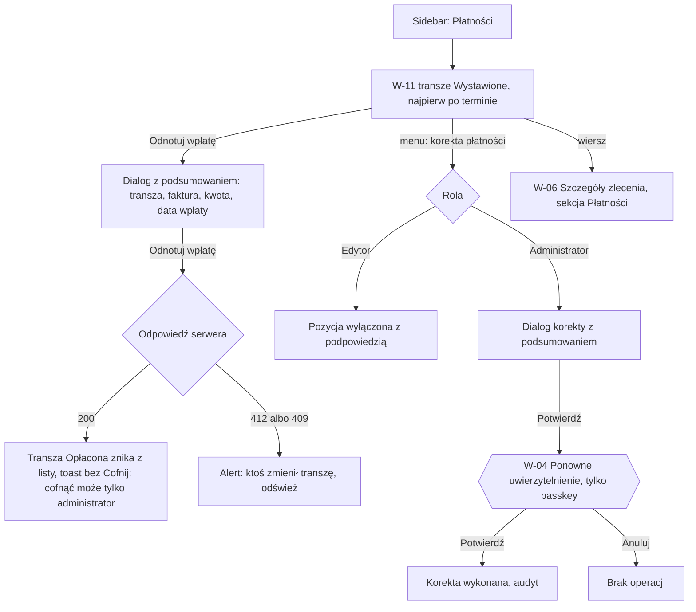

# 08 — Zestawienie nieopłaconych

> Dokument żywy (EVM-004) · przepływ AC2 nr 8 · kanał: web (płatności nie trafiają na telefon) · ekran: W-11 (+ akcje płatności w W-06) · indeks: [README.md](README.md)
> Źródła: `domain-model.md` → `PaymentMilestone`, tabela przejść „Etap płatności”, „Korekta płatności”; słownik „nieopłacone / po terminie” ([`domain.md`](../../product/domain.md)); styleguide § 4.4, § 4.11; polityki P2 (step-up), P6 (Tylko odczyt widzi płatności); SR-AUTHZ-10, SR-SESS-08; konsultacja `security-engineer` EVM-004 (M2, M3).

## Przepływ


## W-11 Nieopłacone
- **Cel:** zobaczyć wszystkie wystawione, a nieopłacone transze (najpierw po terminie), ich sumy i szybko odnotować wpłatę.
- **Główna akcja:** „Odnotuj wpłatę” przy transzy.
- **Hierarchia treści:** 1) tytuł „Płatności — nieopłacone”; 2) kafle sum (nieopłacone, po terminie, najstarsza po terminie); 3) filtry; 4) tabela transz; 5) suma i paginacja.

**Makieta (expanded)**
```text
Płatności — nieopłacone
┌ Nieopłacone ───────────────┐┌ Po terminie ───────────────┐┌ Najdłużej po terminie ───┐
│ 12 transz · 48 300,00 zł   ││ «Po terminie» 4 ·           ││ 21 dni · ZL-2026-0031    │
│                            ││ 15 200,00 zł                ││                          │
└────────────────────────────┘└─────────────────────────────┘└──────────────────────────┘
Pokaż: {✓ Wszystkie wystawione} {Po terminie}    Termin [od __.__.____ do __.__.____]
Klient [Szukaj klienta… ‹search›]
 12 transz                                 Sortuj: Najdłużej po terminie ▾  Na stronie [25 ▾]
┌────────────┬──────────┬──────────────────────┬──────────────┬───────────────┬──────────────────┬─────────────┬──────────────────────────┐
│ Termin     │ Po term. │ Zlecenie             │ Klient       │ Transza       │ Nr faktury       │       Kwota │ Status / akcje           │
├────────────┼──────────┼──────────────────────┼──────────────┼───────────────┼──────────────────┼─────────────┼──────────────────────────┤
│ 12.09.2026 │ 21 dni   │ ZL-2026-0031         │ Anna Testowa │ Płatność      │ FV/TEST/0003/2026│ 6 000,00 zł │ «Po terminie»            │
│            │          │ Dom — pełny pakiet   │              │ końcowa       │                  │             │ [Odnotuj wpłatę]       ⋮ │
├────────────┼──────────┼──────────────────────┼──────────────┼───────────────┼──────────────────┼─────────────┼──────────────────────────┤
│ 08.09.2026 │ 5 dni    │ ZL-2026-0042         │ Jan          │ Zaliczka      │ FV/TEST/0007/2026│ 3 600,00 zł │ «Po terminie»            │
│            │          │ Garaż — pełny proces │ Przykładowy  │               │                  │             │ [Odnotuj wpłatę]       ⋮ │
├────────────┼──────────┼──────────────────────┼──────────────┼───────────────┼──────────────────┼─────────────┼──────────────────────────┤
│ 15.10.2026 │ —        │ ZL-2026-0038         │ Firma Testowa│ Zaliczka      │ FV/TEST/0009/2026│ 4 500,00 zł │ «Wystawiona»             │
│            │          │ Dom — pełny pakiet   │ sp. z o.o.   │               │                  │             │ [Odnotuj wpłatę]       ⋮ │
│ …          │          │                      │              │               │                  │             │                          │
└────────────┴──────────┴──────────────────────┴──────────────┴───────────────┴──────────────────┴─────────────┴──────────────────────────┘
                                                Suma (12 transz): 48 300,00 zł
                                                        ‹ Poprzednia   Następna ›

 Dialog „Odnotuj wpłatę” (size.dialog.width.sm, § 4.11 — z podsumowaniem):
┌──────────────────────────────────────────────┐
│ Odnotować wpłatę za transzę „Zaliczka”?      │
│ ZL-2026-0042 · Garaż — pełny proces          │
│ Faktura FV/TEST/0007/2026 · 3 600,00 zł      │
│ Termin 08.09.2026 (5 dni po terminie)        │
│ Data wpłaty [03.10.2026 ‹calendar›]          │
│ Nie później niż dziś.                        │
│ Cofnąć wpłatę może tylko administrator.      │
│              [Anuluj]  [[ Odnotuj wpłatę ]]  │
└──────────────────────────────────────────────┘
```

## Akcje płatności — status × rola
Wspólna tabela dla W-11 i sekcji „Płatności” w [W-06](03-szczegoly-zlecenia.md#w-06-szczegóły-zlecenia) (M3 z konsultacji security). Dostępność akcji ściśle wg tabeli przejść „Etap płatności” w `domain-model.md`. **Edytor anuluje wyłącznie transzę „Planowaną”** (doprecyzowanie decyzji z EVM-002). Akcje Administratora ze step-upem przechodzą przez [W-04](01-logowanie-mfa.md#w-04-ponowne-uwierzytelnienie) (tylko passkey); u Edytora są widoczne, ale wyłączone z podpowiedzią „Korektę płatności może wykonać tylko administrator.”; rola Tylko odczyt nie widzi żadnej akcji. **Żadna akcja płatności nie ma „Cofnij”** — każda ma dialog z podsumowaniem (§ 4.11).

| Status transzy | Akcja | Przejście / operacja | A | E | R |
|---|---|---|---|---|---|
| Planowana | Wystaw fakturę… (kwota, nr faktury lub proformy, data wystawienia; termin domyślnie data + dni z planu) | `planned → invoiced` | tak | tak | ukryte |
| Planowana | Zmień kwotę | edycja `amountMinor` w `planned` | tak | tak | ukryte |
| Planowana | Anuluj transzę… (wymagany powód) | `planned → cancelled` | tak | tak | ukryte |
| Wystawiona (także po terminie) | Odnotuj wpłatę… (data wpłaty) | `invoiced → paid` | tak | tak | ukryte |
| Wystawiona | Popraw dane faktury (nr, data wystawienia, termin) | edycja `invoiceNumber`, `invoicedOn`, `dueDate` | tak | tak | ukryte |
| Wystawiona | Wycofaj fakturę… | `invoiced → planned` — korekta płatności | tak ↑ | wyłączone | ukryte |
| Wystawiona | Anuluj fakturę… | `invoiced → cancelled` — korekta płatności | tak ↑ | wyłączone | ukryte |
| Wystawiona, Opłacona | Zmień kwotę… | edycja `amountMinor` w `invoiced` / `paid` — korekta płatności | tak ↑ | wyłączone | ukryte |
| Opłacona | Popraw datę wpłaty | edycja `paidOn` | tak | tak | ukryte |
| Opłacona | Cofnij wpłatę… | `paid → invoiced` — korekta płatności | tak ↑ | wyłączone | ukryte |
| Anulowana | Przywróć transzę… | `cancelled → planned` — korekta płatności | tak ↑ | wyłączone | ukryte |
| każdy | Usuń transzę… | soft delete `PaymentMilestone` — korekta płatności | tak ↑ | wyłączone | ukryte |
| — (zlecenie) | Dodaj transzę | utworzenie `PaymentMilestone` (`planned`) | tak | tak | ukryte |
| zlecenie Rozliczone albo Anulowane | wszystkie powyższe | zmiany płatności zablokowane (`domain-model.md`) | wyłączone: „Zlecenie jest rozliczone — płatności są tylko do odczytu. Przywrócić zlecenie może tylko administrator.” | wyłączone (jw.) | ukryte |

**Transza „Planowana” w W-06 — rozmieszczenie akcji** (ActionMenu, § 3.20):
- „Wystaw fakturę…” to widoczny przycisk wiersza;
- menu `⋮` („Akcje transzy: [nazwa]”) ma najpierw „Zmień kwotę”, a na końcu, w osobnej grupie, „Anuluj transzę…” i „Usuń transzę…”;
- odnośnik „kwoty transz” z banera „Zlecenie założone w terenie” ustawia fokus na tym wyzwalaczu `⋮` ([W-06 → baner](03-szczegoly-zlecenia.md#w-06-szczegóły-zlecenia)).

**Dialogi z podsumowaniem** (tytuł-pytanie, skutek, przycisk z czasownikiem; fokus na „Anuluj”)
| Akcja | Podsumowanie w dialogu | Zdanie o skutku |
|---|---|---|
| Wystaw fakturę | transza, zlecenie, kwota, nr faktury, data wystawienia, termin | „Cofnąć wystawienie może tylko administrator.” |
| Odnotuj wpłatę | transza, faktura, kwota, termin (i dni po terminie), data wpłaty | „Cofnąć wpłatę może tylko administrator.” |
| Anuluj transzę (Planowaną) | transza, udział, powód | „Przywrócić transzę może tylko administrator.” (przycisk danger „Anuluj transzę”) |
| Korekty Administratora (wycofaj fakturę, anuluj fakturę, cofnij wpłatę, zmień kwotę, przywróć, usuń) | stan przed i po (np. „Wystawiona → Planowana”), kwota przed i po, nr faktury, data | „Operacja zostanie zapisana w dzienniku audytu.” — potem W-04 z tytułem „Potwierdź tożsamość, aby skorygować płatność” |

**Stany**
| Stan | Zachowanie |
|---|---|
| Pusty | „Wszystkie wystawione faktury są opłacone.” (`circle-check`); brak wyników filtrów — „Brak transz spełniających filtry. [Wyczyść filtry]”. |
| Ładowanie | Skeleton kafli sum i wierszy tabeli; „Odnotuj wpłatę” w dialogu w stanie ładowania. |
| Błąd | Nie wczytano zestawienia — EmptyState `circle-alert` „Nie udało się wczytać płatności. [Spróbuj ponownie]”; `412 version_conflict` / `409 invalid_state_transition` w dialogu — „Ktoś zmienił tę transzę w międzyczasie (teraz: «Opłacona»). [Odśwież]”; `422 transition_condition_not_met` — komunikat pod polem („Data wpłaty nie może być późniejsza niż dziś.”); `429` — wzór z README; brak `step_up` po anulowaniu W-04 — „Nie wykonano korekty.” (dane dialogu zostają). |
| Offline | Baner § 4.10; tabela z pamięci karty z banerem „Dane mogą być nieaktualne (z 14:05)”; akcje wyłączone z podpowiedzią. |
| Brak uprawnień | Tylko odczyt — pełny podgląd (kwoty, numery faktur, terminy, „Po terminie” — P6) bez akcji i bez `⋮`. Edytor — korekty wyłączone z podpowiedzią. Sumy liczone tą samą polityką co lista (SR-AUTHZ-03). Zlecenie niedostępne z wiersza — `404` w W-06. |

**Role** — tabela [Akcje płatności — status × rola](#akcje-płatności--status--rola); dodatkowo:
| Element | Operacja | A | E | R |
|---|---|---|---|---|
| Zestawienie, sumy, filtry | odczyt listy `PaymentMilestone` (`status = invoiced`, `isOverdue`) | tak | tak | tak |
| Eksport zestawienia | — (eksport danych — Administrator ze step-upem, M4) | nie ma w UI | nie ma w UI | nie ma w UI |

**Filtry i URL:** „Wszystkie wystawione” / „Po terminie” (status) — w adresie URL; zakres terminów i klient — w pamięci karty (klient to dane osobowe; termin poza listą dozwolonych parametrów URL z konsultacji security); paginacja maks. 100 (`api-guidelines.md`); tytuł karty „Płatności · EVia Manager”.

- **Responsywność:** `breakpoint.wide` — wszystkie kolumny; `breakpoint.expanded` — jak makieta; `breakpoint.medium` — bez kolumn „Klient” i „Nr faktury” (w szczegółach wiersza), kafle sum w jednym rzędzie; `breakpoint.compact` — lista kart: termin i status na górze, kwota `text.numeric-lg`, „Odnotuj wpłatę” na pełną szerokość, filtry w arkuszu.
- **Komponenty i tokeny:** Card (§ 3.8) — kafle sum, kwoty `text.numeric-lg`; FilterChip, FilterBar (§ 3.7); DatePicker zakres (§ 3.5); Combobox (§ 3.3) — klient; DataTable (§ 3.6) — kwoty `text.numeric` do prawej, `aria-sort`; StatusBadge (§ 3.9) — `color.status.payment.invoiced.*`, `color.status.payment.overdue.*` (wariant mocny), `color.status.payment.planned.*`, `color.status.payment.paid.*`, `color.status.payment.cancelled.*`; dni po terminie `text.numeric` `color.text.error` + `alarm-clock` (§ 4.2); ActionMenu (§ 3.20) — menu `⋮` transzy, korekty Edytora wyłączone z podpowiedzią; AlertDialog (§ 3.13) `size.dialog.width.sm`; Button secondary (akcja w wierszu), primary (w dialogu), danger (anulowanie); Toast (§ 3.14) bez akcji; odznaka wartości nieznanej (§ 3.9.1 — akcje płatności przy niej wyłączone z podpowiedzią).
- **Mikrocopy:** „Płatności — nieopłacone” · „Nieopłacone” · „Po terminie” · „Najdłużej po terminie” · „Wszystkie wystawione” · „Odnotuj wpłatę” · „Odnotować wpłatę za transzę „Zaliczka”?” · „Data wpłaty” · „Nie później niż dziś.” · „Cofnąć wpłatę może tylko administrator.” · „Korektę płatności może wykonać tylko administrator.” · toast: „Odnotowano wpłatę 3 600,00 zł za fakturę FV/TEST/0007/2026.” · pusty: „Wszystkie wystawione faktury są opłacone.” · kwoty wg § 6.3 („3 600,00 zł”, spacje niełamliwe).
- **Dostępność:** „Po terminie” niesie ikona, etykieta i liczba dni (nie sam kolor — § 4.2); kwoty i daty `tabular-nums`; wiersz z nagłówkiem (zlecenie + transza) dla czytnika; dialog z pułapką fokusu, fokus domyślnie na „Anuluj”; wyłączone korekty z `aria-disabled` i podpowiedzią osiągalną klawiaturą (§ 3.1).
