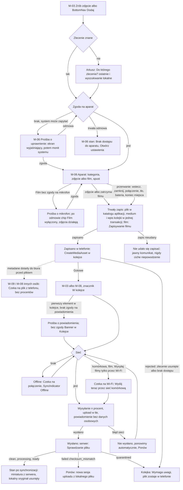

# 09 — Mobile: zdjęcie i film offline → kolejka → upload

> Dokument żywy (EVM-004) · przepływ AC2 nr 9 · kanał: mobile · ekrany: M-06 (z arkuszem wyboru zlecenia), M-07, M-08, M-09 · indeks: [README.md](README.md)
> Źródła: styleguide § 3.12, § 4.7, § 5 (teren, SyncIndicator, stany pliku, „nic nie ginie”); `offline-sync.md` (komenda `CreateMediaAsset`, kolejka, obiekty lokalne oczekujące, „Wymaga uwagi”, punkt 7 — usuwanie lokalnego oryginału); ADR-0007 (w tym ryzyka 4 i 10 — zapis wideo, mało miejsca; komunikat „wysyłanie wstrzymane — otwórz aplikację”), ADR-0009; polityki P2, P3, P5 (bitrate filmu), P7; SR-MOB-02, -05, -06, -08, -12, -13, SR-FILE-08; szczegóły techniczne uploadu w tle — spike EVM-011.

## Przepływ


## M-06 Aparat
- **Cel:** zrobić serię zdjęć lub nagrać film do zlecenia w garażu bez zasięgu, w rękawicach, jedną ręką — z kategorią wybraną przed spustem i pewnością, że nic nie zginie.
- **Główna akcja:** spust (`size.touch-target.shutter`).
- **Hierarchia treści:** 1) podgląd z aparatu; 2) górny pasek: zamknij, numer zlecenia, SyncIndicator; 3) etap (opcjonalnie) i chipy kategorii nad spustem; 4) przełącznik Zdjęcie / Film; 5) latarka · spust · licznik serii i „Gotowe”.

**Makieta (compact, ekran aparatu — CameraScreen, § 3.24)**
```text
┌──────────────────────────────────┐
│ ✕  ZL-2026-0042    ⟨Offline · 5⟩ │ color.bg.brand-strong
│                                  │
│                                  │
│      (podgląd z aparatu —        │
│       pełny ekran)               │
│                                  │
│                                  │
│      ┃ Zapisano w telefonie      │ ← toast po każdym ujęciu
├──────────────────────────────────┤
│ Etap: Montaż ładowarki ▾         │ → arkusz (opcjonalnie)
│ {Oględziny} {Przed pracami}      │
│ {✓ W trakcie prac} {Po zakończ.} │ chipy kategorii (przewijane)
│ {Usterka} {Pomiary} {Inne}       │
│ {✓ Zdjęcie}  {Film}              │
│                                  │
│ ‹flashlight›   ( ◉ )   3 zdjęcia │
│                        [Gotowe]  │ size.touch-target.field
└──────────────────────────────────┘
 Nagrywanie filmu: ikona spustu ‹circle› → ‹square›, czas „0:42 / 30:00” nad spustem,
 nazwa „Zatrzymaj nagrywanie”; wnętrze color.action.danger.bg tylko jako sygnał dodatkowy
 (§ 3.24 — stan nie opiera się na kolorze);
 gdy miejsca w telefonie wystarczy na krócej niż 30 min — limit z miejsca: „0:42 / 3:00”.

 Po zatrzymaniu filmu — „Zapisywanie filmu…” (do końca trwałego zapisu):
 │      Zapisywanie filmu…          │ ← na podglądzie, ogłaszane
 │ ‹flashlight›   ( ◉ )     1 film  │ spust nieaktywny
 │        [‹loader-circle› Gotowe]  │ „Gotowe” w stanie ładowania (§ 3.1)

 Brak zgody na mikrofon albo za mało miejsca na film — zdjęcia działają:
 │ {✓ Zdjęcie}  {Film} (wyłączony)  │
 │ Film wymaga dostępu do mikrofonu.│ albo: „Za mało miejsca na film.
 │ [Zezwól na mikrofon]             │  Zwolnij miejsce w telefonie.”
 Po trwałej odmowie zamiast [Zezwól na mikrofon] — [Otwórz ustawienia].

 Prośba o uprawnienie — aparat (pierwsze otwarcie aparatu, przed monitem systemu; EmptyState § 3.15):
 │                ‹camera›                    │
 │ Aparat do zdjęć z prac                     │
 │ Zdjęcia i filmy zapisujemy tylko           │
 │ w aplikacji — nie trafiają do galerii      │
 │ telefonu. Nie zapisujemy lokalizacji.      │
 │ [[ Zezwól na dostęp do aparatu ]]          │ → monit systemu
 │ [Nie teraz]                                │ → powrót do M-03
 Trwała odmowa: „Brak dostępu do aparatu. Zezwól aplikacji na używanie aparatu
 w ustawieniach telefonu.” [[ Otwórz ustawienia ]] (tabela „Uprawnienia systemowe”).

 Prośba o uprawnienie — mikrofon (pierwsze dotknięcie „Film”; BottomSheet § 3.13):
 │ Mikrofon do filmów                                  │
 │ Nagrywamy dźwięk razem z obrazem, np. Twój komentarz│
 │ do prac. Bez mikrofonu zdjęcia działają normalnie.  │
 │ [[ Zezwól na mikrofon ]]   [Nie teraz]              │

 Arkusz „Do którego zlecenia?” (BottomSheet, gdy wejście z BottomNav):
 │ Do którego zlecenia?                        │
 │ [Szukaj: adres, nazwisko, numer]            │
 │ Ostatnio otwierane                          │
 │ ZL-2026-0042 · Garaż — pełny proces         │
 │   ul. Testowa 7, Warszawa                   │
 │ Oczekuje na numer · Dom — sam montaż § 4.15 │
 │   ul. Fikcyjna 12, Piaseczno                │
 │ W trybie ukrytych danych (§ 4.18): tylko numery zleceń, bez tytułów i adresów.│
```

**Stany**
| Stan | Zachowanie |
|---|---|
| Pusty | Pierwsze uruchomienie aparatu — krótka podpowiedź nad chipami „Wybierz kategorię przed zdjęciem. Zmienisz ją w dowolnej chwili.”; kategoria domyślnie ostatnio używana w tym zleceniu. |
| Ładowanie | Uruchamianie aparatu — czarny podgląd z tekstem „Uruchamianie aparatu…” (bez spinnera); spust nieaktywny do gotowości. Zapis filmu po zatrzymaniu — „Zapisywanie filmu…” (tabela „Zapis i nagrywanie”). |
| Błąd | Aparat zajęty / błąd systemu: „Nie udało się uruchomić aparatu. [Spróbuj ponownie]”. Nieudany zapis, mało miejsca, przerwane nagranie i maksymalna długość filmu — tabela „Zapis i nagrywanie” niżej (nigdy ciche niepowodzenie). |
| Offline | Normalna praca — każde ujęcie od razu w telefonie i w kolejce; SyncIndicator „Offline · n”. |
| Brak uprawnień | Uprawnienia systemowe — tabela „Uprawnienia systemowe” niżej: prośba z ekranem wyjaśniającym w momencie użycia; trwała odmowa aparatu → EmptyState „Brak dostępu do aparatu” [[Otwórz ustawienia]]; brak mikrofonu wyłącza tylko „Film” (zdjęcia działają). Aplikacja **nie prosi o lokalizację** i nie pokazuje wskaźnika lokalizacji (P3). Tylko odczyt — brak dostępu do aplikacji (M-02). Tryb ukrytych danych (§ 4.18) — aparat działa; górny pasek i arkusz pokazują wyłącznie numer zlecenia. |

**Zapis i nagrywanie („nic nie ginie”, styleguide § 5.4)**
| Sytuacja | Zachowanie |
|---|---|
| Potwierdzenie zapisu (zdjęcie i film) | Toast „Zapisano w telefonie” i ogłoszenie („Zapisano zdjęcie 3”) pokazujemy **dopiero po trwałym zapisie**: plik zapisany na dysk w katalogu aplikacji (z wymuszeniem zapisu — `fsync`), a wiersz `MediaAsset` i wpis kolejki (`CreateMediaAsset`) zatwierdzone w **jednej transakcji** zaszyfrowanej bazy. Licznik serii rośnie dopiero po potwierdzeniu. Suma SHA-256 nie opóźnia potwierdzenia — liczymy ją po zapisie, przed utworzeniem sesji uploadu. |
| Zapisywanie filmu… | Po zatrzymaniu nagrania (spust, „Gotowe”, ✕, systemowe „wstecz”) — napis „Zapisywanie filmu…” na podglądzie (ogłaszany), spust nieaktywny, „Gotowe” w stanie ładowania (§ 3.1); aparat zamyka się dopiero po zakończeniu zapisu, potem „Zapisano w telefonie” (ogłoszenie „Zapisano film, 2 min 13 s”). |
| Nagrywanie przerwane przez technika | ✕ i systemowe „wstecz” w trakcie nagrania **zatrzymują i zapisują** nagranie (przez „Zapisywanie filmu…”) — nigdy go nie odrzucają. Niepotrzebny film technik usuwa w Kolejce (dialog, M-07). |
| Nagrywanie przerwane przez system | Połączenie przychodzące, przejście aplikacji w tło (Android zamyka sesję aparatu), aparat przejęty przez inną aplikację, krytyczny poziom baterii (próg — EVM-011): nagranie zatrzymujemy i zapisujemy to, co nagrano; po powrocie do aplikacji — Toast „Nagrywanie przerwane — zapisano 2:13 filmu.” i element w Kolejce. |
| Zabicie procesu w trakcie nagrania | Przy następnym uruchomieniu aplikacja odzyskuje nagranie (format odporny na przerwanie, np. fragmentowany MP4 — EVM-011; zlecenie i kategoria z wpisu „nagrywanie w toku” zapisanego w bazie przy starcie nagrania) → element w Kolejce i Banner (§ 3.19, `color.feedback.info.*`) „Nagrywanie przerwane — zapisano 2:13 filmu do ZL-2026-0042.” |
| Nie udało się zapisać | Plik nie do odtworzenia albo błąd zapisu: Banner (§ 3.19, `color.feedback.error.*`) „Nie udało się zapisać filmu (03.10.2026, 14:05). Nagraj go ponownie, jeśli to możliwe.” / „Nie udało się zapisać zdjęcia. Zrób je ponownie.” — nigdy ciche niepowodzenie; kolejka i baza nienaruszone. |
| Mało miejsca — ostrzeżenie | Banner (§ 3.19, `color.feedback.warning.*`) „Mało miejsca w telefonie: 1,2 GB. Wystarczy na ok. 3 min filmu.” — czas filmu liczony od miejsca **ponad progiem blokady filmu** (przykład: 1,2 GB − próg 1 GB = 200 MB, przy ok. 60 MB na minutę ≈ 3 min). |
| Za mało miejsca na film | Wolne miejsce poniżej progu: chip „Film” wyłączony (wariant na ciemnym tle, § 3.24) z tekstem pod przełącznikiem „Za mało miejsca na film. Zwolnij miejsce w telefonie.”; zdjęcia działają; kolejka i baza nienaruszone (ADR-0007, ryzyko 10). |
| Miejsce kończy się w trakcie nagrania | Licznik pokazuje limit z miejsca, gdy jest krótszy niż 30 min („0:42 / 3:00”); po dojściu do progu nagranie zatrzymuje się i zapisuje: „Film zapisany (za mało miejsca na dalsze nagrywanie).” |
| Brak miejsca na zdjęcie | Poniżej minimalnej rezerwy na bazę i kolejkę (wartość — EVM-011): „Brak miejsca — zdjęcie nie zostało zapisane. Zwolnij miejsce w telefonie.” (nigdy ciche niepowodzenie). |
| Maksymalna długość filmu | 30 min — zatrzymanie i zapis z komunikatem „Film zapisany (30 min — maksymalna długość). Nagraj kolejny, jeśli trzeba.” |

Wartości progów i bitrate to wynik EVM-011: próg blokady filmu roboczo 1 GB + rezerwa na pliki części (ADR-0007, ryzyko 10), bitrate ≤ 8 Mb/s, czyli ok. 60 MB na minutę (P5). Mikrocopy liczy czas filmu z wartości ostatecznych.

**Uprawnienia systemowe** (o każde pytamy w momencie użycia, najpierw ekran wyjaśniający, potem monit systemu)
| Uprawnienie | Kiedy pytamy | Odmowa — system może zapytać ponownie | Trwała odmowa (Android — zwykle po dwóch odmowach monit się nie pojawia) |
|---|---|---|---|
| Aparat | Pierwsze otwarcie aparatu: EmptyState „Aparat do zdjęć z prac” [[Zezwól na dostęp do aparatu]] → monit systemu; [Nie teraz] → powrót do M-03 | ten sam ekran wyjaśniający | EmptyState „Brak dostępu do aparatu. Zezwól aplikacji na używanie aparatu w ustawieniach telefonu.” [[Otwórz ustawienia]]; po powrocie z ustawień ze zgodą aparat startuje bez ponownego wejścia |
| Mikrofon (tylko film) | Pierwsze dotknięcie „Film”: BottomSheet „Mikrofon do filmów” [[Zezwól na mikrofon]] → monit systemu; [Nie teraz] → zostaje „Zdjęcie” | chip „Film” wyłączony, pod przełącznikiem „Film wymaga dostępu do mikrofonu.” [Zezwól na mikrofon]; zdjęcia działają | jak obok, akcja [Otwórz ustawienia] |
| Powiadomienia (Android 13+) | Po pierwszym „Gotowe” z elementem w kolejce — prośba w M-07 | Banner w Kolejce „Powiadomienia wyłączone…” [Włącz powiadomienia] → monit systemu | ten sam Banner, [Włącz powiadomienia] → ustawienia powiadomień aplikacji |
| Lokalizacja, galeria, kontakty, pliki poza aplikacją | nigdy (P3, P7) | — | — |

**Role**
| Akcja | Komenda (`offline-sync.md`) | A | E | R |
|---|---|---|---|---|
| Zdjęcie / film | `CreateMediaAsset` (`mediaType`, `category`, `procedureStageId?`, `capturedAt`) + sesja uploadu (ADR-0009) | tak | tak | brak dostępu (M-02) |
| Wybór zlecenia | lokalna baza (zakres urządzenia) i szybkie zlecenia oczekujące | tak | tak | — |

- **Responsywność:** orientacja pionowa i pozioma (WCAG 1.3.4) — w poziomej panel sterowania po prawej (spust w zasięgu kciuka), chipy pionowo; tryb „Leworęczny” (M-09) odwraca strony latarki i „Gotowe” (§ 5.2).
- **Komponenty i tokeny:** CameraScreen (§ 3.24); AppBar / SyncIndicator (§ 3.18, § 5.4) — fokus `color.focus.ring-inverse`; FilterChip (§ 3.7) w wariancie na ciemnym tle (§ 3.24) — `size.touch-target.min`, `space.inline.sm`; spust `size.touch-target.shutter` (obrys `color.border.inverse`, ikona `circle` / `square`); IconButton latarki `size.touch-target.min`, ikona `flashlight` / `flashlight-off` `size.icon.lg` `color.icon.inverse`; „Gotowe” Button primary `size.touch-target.field` z obrysem `color.border.inverse` (stan ładowania podczas „Zapisywanie filmu…” — § 3.1, ikona `loader-circle`); tekst na panelu `color.text.on-brand` na `color.bg.brand-strong`; Toast (§ 3.14); BottomSheet (§ 3.13) `radius.sheet` — także prośba o mikrofon; EmptyState (§ 3.15) — prośba o dostęp do aparatu (ikona `camera`) i trwała odmowa; chip „Film” wyłączony — wariant na ciemnym tle (§ 3.24: obrys przerywany `color.border.inverse`, ikona powodu `mic-off` / `hard-drive`, bez zaznaczenia), pod przełącznikiem tekst powodu `color.text.on-brand` i przycisk na ciemnym tle (§ 3.24: `color.text.on-brand`, obrys `color.border.inverse`) `size.touch-target.min`; Banner (§ 3.19) — `color.feedback.warning.*` (mało miejsca), `color.feedback.info.*` (odzyskane nagranie), `color.feedback.error.*` (nieudany zapis); odznaka „Oczekuje na numer” (§ 4.15); tryb ukrytych danych (§ 4.18).
- **Mikrocopy:** kategorie: „Oględziny”, „Stan przed pracami”, „W trakcie prac”, „Po zakończeniu”, „Usterka / problem”, „Pomiary”, „Inne” (`service-catalog.md` § 7) · „Zdjęcie” / „Film” · „Zapisano w telefonie” · „3 zdjęcia” (odmiana § 6.3) · „Gotowe” · „Etap: …” · „Do którego zlecenia?” · „Aparat do zdjęć z prac” · „Zezwól na dostęp do aparatu” · „Nie teraz” · „Mikrofon do filmów” · „Zezwól na mikrofon” · „Film wymaga dostępu do mikrofonu.” · „Brak dostępu do aparatu…” · „Otwórz ustawienia” · „Zapisywanie filmu…” · „Nagrywanie przerwane — zapisano 2:13 filmu.” · „Nie udało się zapisać filmu (03.10.2026, 14:05). Nagraj go ponownie, jeśli to możliwe.” · „Mało miejsca w telefonie: 1,2 GB. Wystarczy na ok. 3 min filmu.” · „Za mało miejsca na film. Zwolnij miejsce w telefonie.” · „Film zapisany (za mało miejsca na dalsze nagrywanie).”
- **Dostępność:** spust z nazwą „Zrób zdjęcie” / „Rozpocznij nagrywanie” / „Zatrzymaj nagrywanie”; zapis ogłaszany („Zapisano zdjęcie 3”, „Zapisywanie filmu…”, „Zapisano film, 2 min 13 s”) — dopiero po trwałym zapisie; chip „Film” wyłączony ma nazwę dostępną z powodem („Film, niedostępny — wymaga mikrofonu”), a powód jest też widocznym tekstem z przyciskiem obok (nie tylko podpowiedź — rękawice, § 5.1); brak gestów jako jedynej drogi — zoom przyciskami, wybór kategorii dotknięciem; latarka zawsze w zasięgu kciuka (§ 5.3); żadnych błysków poza aparatem; kontrast elementów panelu ≥ 3:1 (`color.border.inverse`, `color.text.on-brand` — § 2.1.4).

## M-07 Kolejka
- **Cel:** w każdej chwili wiedzieć, co jest niewysłane, dlaczego, i móc to wysłać — „nic nie ginie”.
- **Główna akcja:** zależna od sekcji — „Ponów wszystkie” (Błąd), „Wyślij teraz przez sieć komórkową” (Czeka na Wi-Fi), „Dodaj do innego zlecenia” (Wymaga uwagi).
- **Hierarchia treści:** 1) podsumowanie „Wysłano 9 z 12 · 3 w kolejce” + pasek; 2) Banner „Powiadomienia wyłączone” (tylko bez zgody na powiadomienia i przy niewysłanych elementach); 3) **Wymaga uwagi** (§ 4.16); 4) Błąd; 5) Czeka na Wi-Fi; 6) Wysyłanie; 7) W kolejce; 8) Wysłane dziś (zwinięte).

**Makieta (compact)**
```text
┌──────────────────────────────────┐
│ Kolejka      ⟨Wymaga uwagi · 1⟩  │ § 4.16
├──────────────────────────────────┤
│ Wysłano 9 z 12 · 3 w kolejce     │
│ ████████████████░░░░             │
│                                  │
│ Wymaga uwagi (1)          § 4.16 │
│ ┃▣ Zdjęcie · ZL-2026-0017        │
│ ┃ Zlecenie zostało usunięte      │
│ ┃ albo nie masz do niego dostępu.│
│ ┃ [Dodaj do innego zlecenia]     │
│ ┃ [Usuń z telefonu]              │
│                                  │
│ Błąd (1)       [Ponów wszystkie] │
│ ▣ Zdjęcie · ZL-2026-0042         │
│   Nie wysłano — przerwane        │
│   połączenie            [Ponów]  │
│                                  │
│ Czeka na Wi-Fi (1)               │
│ ▣ Film 4:12 · ZL-2026-0042       │
│   [Wyślij teraz przez sieć       │
│    komórkową · 180 MB]           │
│                                  │
│ Wysyłanie (1)                    │
│ ▣ Zdjęcie · 45% ████░░ [Wstrzymaj]│
│                                  │
│ W kolejce (2)                    │
│ ▣ Zdjęcie · ZL-2026-0042         │
│   W kolejce      [Usuń z kolejki]│
│ ✎ Wpis · ZL-2026-0042 · W kolejce│
│                                  │
│ ▸ Wysłane dziś (9)               │
├──────────────────────────────────┤
│ Zlecenia  Dodaj  Kolejka  Więcej │
└──────────────────────────────────┘
 Dialog usunięcia (§ 4.11 — zawsze, bo nieodwracalne), gdy biuro nic jeszcze nie wie
 (`CreateMediaAsset` bez wyniku `applied`):
 │ Usunąć 1 niewysłane zdjęcie?                         │
 │ Zdjęcie nie zostało wysłane i zniknie z telefonu.    │
 │ [[ Usuń zdjęcie ]] (danger)   [Anuluj] ← fokus       │

 Dialog usunięcia, gdy biuro widzi już wpis bez pliku (`CreateMediaAsset` = `applied`):
 │ Usunąć niewysłany film?                                │
 │ Film zniknie z telefonu. W biurze zostanie wpis        │
 │ bez pliku („Czeka na plik z telefonu”) — usunąć go     │
 │ może administrator w panelu.                           │
 │ [[ Usuń film ]] (danger)   [Anuluj] ← fokus            │

 Prośba o powiadomienia (Android 13+; BottomSheet § 3.13 po pierwszym „Gotowe”
 z elementem w kolejce — nie w trakcie serii zdjęć):
 │ Powiadomienia o wysyłaniu                              │
 │ Pokażemy postęp wysyłania i damy znać, gdy wysyłanie   │
 │ się zatrzyma i trzeba otworzyć aplikację. Bez nazwisk, │
 │ adresów i numerów zleceń.                              │
 │ [[ Włącz powiadomienia ]]   [Nie teraz]                │

 Bez zgody na powiadomienia — Banner pod podsumowaniem (§ 3.19, color.feedback.warning.*):
 │ ‹bell-off› Powiadomienia wyłączone — nie zobaczysz,    │
 │ że wysyłanie się zatrzymało.  [Włącz powiadomienia]   │
```

**Elementy kolejki i akcje**
| Element / stan | Znacznik (§ 5.4) | Akcja |
|---|---|---|
| W kolejce — metadane jeszcze nie w biurze (`CreateMediaAsset` bez wyniku `applied`) | `clock` „W kolejce” | „Usuń z kolejki” (dialog „Usunąć 1 niewysłane zdjęcie?”) — usuwa plik i komendę z kolejki; biuro nic nie zobaczy |
| W kolejce — metadane już w biurze (`CreateMediaAsset` = `applied`, plik niewysłany) | `clock` „W kolejce” | „Usuń z kolejki” wyłącznie z dialogiem ze skutkiem dla biura („W biurze zostanie wpis bez pliku („Czeka na plik z telefonu”) — usunąć go może administrator w panelu.”); telefon przerywa sesję uploadu, jeśli już powstała (`abort`), i niczego nie usuwa na serwerze (telefon tylko dodaje) |
| Offline | `wifi-off` „Czeka na połączenie” | — |
| Czeka na Wi-Fi (film, przełącznik włączony) | `wifi` „Czeka na Wi-Fi” | „Wyślij teraz przez sieć komórkową” (jednorazowo, z rozmiarem pliku) |
| Wysyłanie | `cloud-upload` „Wysyłanie 45%” + pasek | „Wstrzymaj” |
| Błąd (sieć, serwer, `checksum_mismatch`) | `cloud-alert` „Nie wysłano — [powód]” | „Ponów” (nowa sesja z lokalnego pliku) |
| Wysłano, serwer sprawdza plik | `cloud-check` „Wysłano · sprawdzanie” | — (lokalny oryginał zostaje do `clean`) |
| Wymaga uwagi — odrzucona mutacja (`target_unavailable`, `forbidden`, `validation_failed`) | `triangle-alert` „Wymaga uwagi” (§ 4.16, `color.sync.error.*`) + powód | „Dodaj do innego zlecenia” (nowe `CreateMediaAsset` / `CreateNote` z nowym identyfikatorem — bez edycji) · „Usuń z telefonu” (dialog) |
| Wymaga uwagi — plik w kwarantannie | `triangle-alert` „Plik zatrzymany przez skan bezpieczeństwa. Biuro sprawdzi plik.” (bez przyczyny — P5) | „Usuń z telefonu” (dialog) |
| Szybkie zlecenie oczekujące | `clock` „Oczekuje na numer” (§ 4.15) | — (elementy tego zlecenia czekają na jego wynik) |

**Stany**
| Stan | Zachowanie |
|---|---|
| Pusty | „Wszystko wysłane. Zdjęcia i wpisy zrobione bez zasięgu pojawią się tutaj.” + „Zsynchronizowano 14:05”. |
| Ładowanie | nd. — kolejka jest lokalna i dostępna od razu; postęp wysyłania aktualizowany na bieżąco. |
| Błąd | Sekcje „Błąd” i „Wymaga uwagi”; automatyczne ponawianie z rosnącą przerwą, „Ponów” wymusza od razu; brak miejsca na urządzeniu przy pobieraniu miniatur nie dotyczy kolejki. |
| Offline | SyncIndicator „Offline · 5” + baner § 5.4 „Brak zasięgu. Pracuj dalej — wyślemy wszystko, gdy wróci połączenie.”; elementy w stanie „Czeka na połączenie”. |
| Brak uprawnień | Tylko odczyt — M-02. Brak zgody na powiadomienia (Android 13+) przy niewysłanych elementach — Banner „Powiadomienia wyłączone — nie zobaczysz, że wysyłanie się zatrzymało.” [Włącz powiadomienia] (monit systemu, a po trwałej odmowie — ustawienia powiadomień aplikacji); wysyłanie działa dalej, Banner znika po wysłaniu wszystkiego albo po włączeniu powiadomień. Utrata dostępu do zlecenia — elementy trafiają do „Wymaga uwagi” (nie są kasowane). Tryb ukrytych danych (§ 4.18) — kolejka działa, ale bez nazw, adresów, telefonów i miniatur (dane nie są renderowane, także w nazwach dostępnych): „Zdjęcie · ZL-2026-0042”, ikona typu pliku zamiast miniatury. Po „Wyloguj urządzenie” (`401 session_revoked`) kolejka jest zaszyfrowana i niewidoczna do ponownego zalogowania tego samego konta (M-02). |

**Role**
| Akcja | Operacja | A | E | R |
|---|---|---|---|---|
| Podgląd kolejki, „Ponów”, „Wstrzymaj”, „Wyślij teraz przez sieć komórkową” | lokalna kolejka (`sync-core`) i sesje uploadu | tak | tak | brak dostępu (M-02) |
| Dodaj do innego zlecenia | nowa komenda `CreateMediaAsset` / `CreateNote` (telefon tylko dodaje) | tak | tak | — |
| Usuń z kolejki / z telefonu | usunięcie lokalne niewysłanego elementu (dialog — nieodwracalne); po `applied` metadanych — dialog ze skutkiem dla biura i `abort` sesji uploadu, jeśli istnieje (bez operacji usunięcia na serwerze) | tak | tak | — |
| Włącz powiadomienia | uprawnienie systemowe (Android 13+) | tak | tak | — |

**Powiadomienie systemowe uploadu w tle** (SR-MOB-08): „EVia Manager · Wysyłanie 3 z 12 plików” / „Wysłano 12 plików” / „Nie wysłano 2 plików — otwórz aplikację” (komunikat ADR-0007 „wysyłanie wstrzymane — otwórz aplikację”) — **bez** numerów zleceń, nazwisk, adresów i miniatur. Wymaga zgody na powiadomienia (Android 13+): bez niej postęp zadania widać tylko w systemowym menedżerze zadań, a komunikatu o wstrzymaniu technik nie zobaczy — dlatego prośba z wyjaśnieniem i Banner w Kolejce.

- **Responsywność:** jedna kolumna; sekcje zwijane (stan zwinięcia lokalnie); powiększenie czcionki do 200 % — przyciski akcji pod opisem, na pełną szerokość.
- **Komponenty i tokeny:** UploadQueueItem (§ 3.12) — miniatura `size.thumbnail.sm`, stany `color.sync.queued.*`, `color.sync.offline.*`, `color.sync.waiting-wifi.*`, `color.sync.in-progress.*`, `color.sync.error.*`, `color.sync.done.*`, pasek `size.progress-bar.height` z `color.sync.progress.*`; sekcja „Wymaga uwagi” i stan SyncIndicator (§ 4.16 — `triangle-alert`, `color.sync.error.*`, obrys lewy `color.feedback.error.border`); ProgressBar (§ 3.19); Button secondary / tertiary `size.touch-target.min`; AlertDialog (§ 3.13) z Button danger; BottomSheet (§ 3.13) — prośba o powiadomienia; Banner (§ 3.19) `color.feedback.warning.*`, ikona `bell-off` — powiadomienia wyłączone; Disclosure (§ 3.21) dla „Wysłane dziś”; odznaka „Oczekuje na numer” (§ 4.15); tryb ukrytych danych (§ 4.18).
- **Mikrocopy:** „Kolejka” · „Wysłano 9 z 12 · 3 w kolejce” · „Wymaga uwagi” · „Zlecenie zostało usunięte albo nie masz do niego dostępu.” · „Dodaj do innego zlecenia” · „Usuń z telefonu” · „Ponów wszystkie” · „Wyślij teraz przez sieć komórkową · 180 MB” · „Usunąć 1 niewysłane zdjęcie?” · „Zdjęcie nie zostało wysłane i zniknie z telefonu.” · „Usunąć niewysłany film?” · „Film zniknie z telefonu. W biurze zostanie wpis bez pliku („Czeka na plik z telefonu”) — usunąć go może administrator w panelu.” · „Powiadomienia o wysyłaniu” · „Włącz powiadomienia” · „Powiadomienia wyłączone — nie zobaczysz, że wysyłanie się zatrzymało.” · „Wszystko wysłane.” · liczby wg § 6.3 („1 film czeka”, „2 filmy czekają”).
- **Dostępność:** każdy element z nazwą dostępną (typ, zlecenie, stan); zmiany stanów ogłaszane zbiorczo co kilka sekund (§ 5.4); akcje jako widoczne przyciski, nie gesty (§ 3.12, § 5.1); akcje niszczące oddzielone od częstych.

## M-08 Media zlecenia
- **Cel:** zobaczyć zdjęcia i filmy zlecenia z jednoznacznym stanem każdego pliku.
- **Główna akcja:** „Zrób zdjęcie” (dolny pasek).
- **Hierarchia treści:** 1) licznik „48 zdjęć · 2 filmy · 3 niewysłane”; 2) filtr „Wszystkie / Niewysłane”; 3) siatka miniatur grupowana po kategorii, ze znacznikiem stanu w rogu.
- **Liczniki:** „48 zdjęć · 2 filmy” obejmują wszystkie media zlecenia — także pliki z innych urządzeń, które jeszcze nie dotarły („Czeka na plik z telefonu”); „niewysłane” i filtr „Niewysłane” — **tylko** elementy z Kolejki tego telefonu (technik nie wyśle cudzego pliku).

**Makieta (compact)**
```text
┌──────────────────────────────────┐
│ ← Media · ZL-2026-0042 ⟨Zsynchr.⟩│
├──────────────────────────────────┤
│ 48 zdjęć · 2 filmy · 3 niewysłane│
│ {✓ Wszystkie} {Niewysłane (3)}   │
│ W trakcie prac (24)              │
│ ┌────┐┌────┐┌────┐               │
│ │img ││img ││img │               │
│ │ ‹clock›│ ‹wifi›│ ‹scan-search›│ ← W kolejce · Czeka na Wi-Fi · Sprawdzanie (§ 5.4, § 4.14)
│ └────┘└────┘└────┘               │
│ ┌────┐┌────┐┌────┐               │
│ │img ││ ▶  ││ ⚠  │ ← Wymaga uwagi (§ 4.14 — z etykietą w kaflu)
│ └────┘└────┘└────┘               │
│ ┌──────────┐                     │
│ │‹image›   │ ← plik z innego telefonu, który jeszcze nie dotarł (§ 4.14)
│ │‹clock›   │                     │
│ │Czeka na  │                     │
│ │plik      │                     │
│ └──────────┘                     │
│ Stan przed pracami (12) …        │
├──────────────────────────────────┤
│ [[‹camera›   Zrób zdjęcie      ]]│
├──────────────────────────────────┤
│ Zlecenia  Dodaj  Kolejka  Więcej │
└──────────────────────────────────┘
```
- **Źródło miniatur:** własne niewysłane zdjęcia — z pliku lokalnego; pliki z serwera — miniatury **na żądanie, tylko gdy `fileState = ready`** i jest połączenie (sandbox aplikacji, wykluczone z kopii, kasowane przy unieważnieniu); offline — ikona typu i „Podgląd po połączeniu”. Podgląd pełnoekranowy: własny plik lokalny albo podgląd z serwera — **bez pobierania oryginałów** i bez panelu EXIF / GPS.
- **Plik z innego urządzenia, który jeszcze nie dotarł** (medium z serwera bez pliku albo `fileState = pending_upload`, spoza Kolejki tego telefonu — np. film kolegi czeka na Wi-Fi): kafel bez miniatury — ikona typu (`image` / `video`) i znacznik (§ 4.14) `clock` „Czeka na plik” jako tekst w kaflu (`color.sync.queued.*`); szczegóły w podglądzie i nazwie dostępnej: „Czeka na plik z telefonu · Marek Testowy · od 14:05”. Bez procentów, paska i akcji — wysyłką steruje telefon autora. Własne elementy zawsze pokazują stan z lokalnej Kolejki (§ 5.4), nie z serwera.

**Stany**
| Stan | Zachowanie |
|---|---|
| Pusty | „To zlecenie nie ma jeszcze zdjęć. [Zrób zdjęcie]” (§ 4.8). |
| Ładowanie | Skeleton kafli `size.thumbnail.md` dla miniatur z serwera; lokalne — od razu. |
| Błąd | Miniatura się nie wczytała — `image` + „Nie można wyświetlić” (§ 3.11); plik „Wymaga uwagi” — opis jak w Kolejce. |
| Offline | Znaczniki stanu z § 5.4; miniatury z serwera niepobrane — „Podgląd po połączeniu”; pliki z innych urządzeń — „Czeka na plik” wg ostatniej synchronizacji. |
| Brak uprawnień | Tylko odczyt — M-02; tryb ukrytych danych (§ 4.18) — ekran niedostępny (EmptyState, dane zleceń nie są renderowane); pliki oczekujące widać w Kolejce bez miniatur. |

**Role**
| Akcja | Operacja | A | E | R |
|---|---|---|---|---|
| Podgląd mediów i stanów | projekcja `MediaAsset` z podsumowaniem pliku | tak | tak | brak dostępu (M-02) |
| Zrób zdjęcie | `CreateMediaAsset` | tak | tak | — |
| Edycja, usuwanie, pobranie oryginału | — (tylko panel; telefon tylko dodaje) | nie | nie | — |

- **Responsywność:** siatka 3 kolumny (§ 3.11); pozioma orientacja — więcej kolumn przy zachowaniu `size.thumbnail.md`.
- **Komponenty i tokeny:** Gallery, Thumbnail (§ 3.11) — `size.thumbnail.md`, `radius.thumbnail`, `space.inline.xs`; znaczniki stanu § 5.4 (`color.sync.*`) i § 4.14 (w tym „Czeka na plik” — `clock`, `color.sync.queued.*`, tekst `text.body-sm`; plik w kwarantannie — `triangle-alert`, `color.sync.error.*`, bez przyczyny); FilterChip (§ 3.7); Button primary `size.touch-target.field`; Skeleton (§ 3.16).
- **Mikrocopy:** „48 zdjęć · 2 filmy · 3 niewysłane” · „Niewysłane (3)” · „Podgląd po połączeniu” · „Czeka na plik” · „Czeka na plik z telefonu · Marek Testowy · od 14:05” · „Zrób zdjęcie”.
- **Dostępność:** miniatura z nazwą „Zdjęcie, W trakcie prac, 02.10.2026, 9:12, w kolejce”; plik z innego telefonu — „Film, W trakcie prac, czeka na plik z telefonu, Marek Testowy, od 14:05”; znacznik stanu jako tekst w nazwie dostępnej, nie tylko ikona; przyciski „Poprzednie / Następne” w podglądzie.

## M-09 Więcej
- **Cel:** ustawienia wysyłania, pomoc i prywatność oraz bezpieczne wylogowanie lub wyczyszczenie danych firmowych.
- **Główna akcja:** brak jednej — ekran ustawień; akcje niszczące oddzielone na dole.
- **Hierarchia treści:** 1) konto (nazwa, e-mail); 2) wysyłanie; 3) obsługa (układ dla leworęcznych, blokada aplikacji); 4) konto i urządzenia — informacja, że zmiany są w panelu; 5) pomoc i prywatność; 6) o aplikacji i synchronizacji; 7) „Wyloguj”; 8) „Wyczyść dane firmowe”.

**Makieta (compact)**
```text
┌──────────────────────────────────┐
│ Więcej           ⟨Zsynchr. 14:05⟩│
├──────────────────────────────────┤
│ Piotr Testowy                    │
│ piotr.testowy@example.com        │
│                                  │
│ Wysyłanie                        │
│ Wysyłaj filmy tylko przez Wi-Fi  │
│ Zdjęcia i wpisy wysyłamy także   │
│ przez sieć komórkową.     [ ●  ] │ przełącznik
│                                  │
│ Obsługa                          │
│ Układ dla leworęcznych    [  ○ ] │
│ Blokuj aplikację po 5 min        │
│ w tle                     [ ●  ] │
│                                  │
│ Konto i urządzenia               │
│ Hasło, drugi krok logowania      │
│ i listę urządzeń zmienisz        │
│ w panelu na komputerze.          │
│                                  │
│ Pomoc                       [›]  │
│ Prywatność                  [›]  │ → klauzula informacyjna (M-11)
│                                  │
│ Wersja 1.0.0 · Ostatnia          │
│ synchronizacja dziś, 14:05       │
│                                  │
│ [Wyloguj]                        │
│ ──────────────────────────────── │
│ [Wyczyść dane firmowe] (danger)  │
├──────────────────────────────────┤
│ Zlecenia  Dodaj  Kolejka  Więcej │
└──────────────────────────────────┘

 Wyloguj przy niewysłanych elementach (dialog blokujący, § 5.4, P2):
 │ Wylogować się?                                          │
 │ 5 niewysłanych elementów zostanie zaszyfrowanych         │
 │ w telefonie — wyślemy je, gdy zalogujesz się ponownie    │
 │ na to samo konto. Dane zleceń usuniemy z telefonu.       │
 │ [[ Wyślij teraz ]]  [Wyloguj mimo to]  [Anuluj]          │
 „Wyślij teraz” — postęp w dialogu („Wysłano 3 z 5”), po wysłaniu wszystkiego wylogowanie.
 Bez niewysłanych elementów „Wyloguj” działa od razu (bez dialogu).

 Wyczyść dane firmowe (dialog, § 4.11):
 │ Usunąć wszystkie dane firmowe z telefonu?               │
 │ Usuniemy dane zleceń, zdjęcia i filmy oraz 5 niewysłanych│
 │ elementów. Tej operacji nie można cofnąć.               │
 │ [[ Usuń wszystkie dane ]] (danger)   [Anuluj] ← fokus    │
```

**Stany**
| Stan | Zachowanie |
|---|---|
| Pusty | nd. — ekran ustawień zawsze ma treść. |
| Ładowanie | Przełączniki blokowane do zapisu (§ 3.4); „Wyloguj” w stanie ładowania do potwierdzenia serwera (offline — wylogowanie lokalne). |
| Błąd | Nie udało się wylogować na serwerze (brak sieci): „Wylogowaliśmy telefon. Sesję na serwerze zakończymy, gdy wróci połączenie.” |
| Offline | „Wyślij teraz” w dialogu wylogowania wyłączony z podpowiedzią „Wyślesz, gdy wróci zasięg.”; pozostałe ustawienia działają lokalnie. |
| Brak uprawnień | Zmiana hasła, MFA i unieważnianie urządzeń — niedostępne w aplikacji (SR-AUTHZ-12) — tekst odsyła do panelu. Tylko odczyt — M-02. |

**Role**
| Akcja | Operacja | A | E | R |
|---|---|---|---|---|
| Ustawienia wysyłania i obsługi | lokalne ustawienia aplikacji | tak | tak | brak dostępu (M-02) |
| Wyloguj | wylogowanie mobilne (P2: kolejka zaszyfrowana do zalogowania tego samego konta) | tak | tak | — |
| Wyczyść dane firmowe | czyszczenie lokalne (P7 pkt 4, SR-MOB-12) | tak | tak | — |
| Zmiana hasła, MFA, urządzenia | — (tylko panel) | nie | nie | — |

- **Responsywność:** jedna kolumna; powiększenie czcionki do 200 % — opisy przełączników zawijane.
- **Komponenty i tokeny:** List, ListItem (§ 3.6) z wierszami `size.touch-target.min`; przełącznik (§ 3.4) — `color.control.checked`; nagłówki grup `text.heading-4`; Button tertiary („Wyloguj”), danger-tertiary („Wyczyść dane firmowe”, `color.action.danger.text-subtle`); AlertDialog (§ 3.13) z Button primary / secondary / danger; separator `color.border.subtle`.
- **Mikrocopy:** „Wysyłaj filmy tylko przez Wi-Fi” · „Zdjęcia i wpisy wysyłamy także przez sieć komórkową.” · „Układ dla leworęcznych” · „Blokuj aplikację po 5 min w tle” · „Hasło, drugi krok logowania i listę urządzeń zmienisz w panelu na komputerze.” · „Pomoc” · „Prywatność” · „Wyloguj” · „Wyczyść dane firmowe” · dialogi jak w makiecie.
- **Dostępność:** przełączniki z etykietą i stanem („włączone”); dialogi z fokusem na najbezpieczniejszej akcji; akcje niszczące oddzielone od częstych (§ 5.1).
