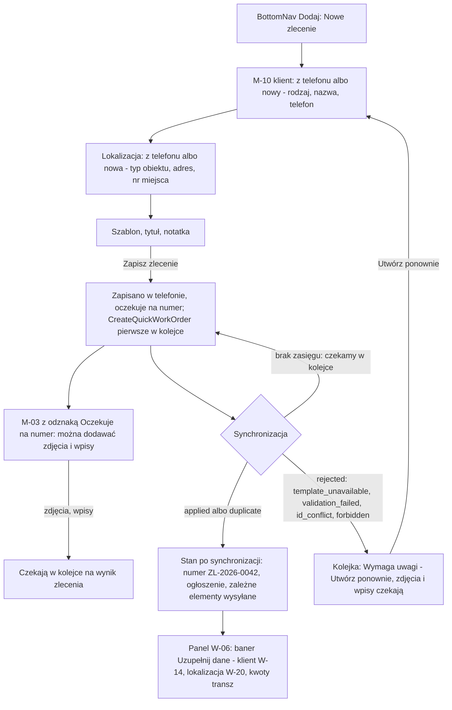

# 10 — Mobile: szybkie nowe zlecenie

> Dokument żywy (EVM-004) · przepływ AC2 nr 10 · kanał: mobile (dokończenie w panelu) · ekran: M-10 (+ M-03, M-05 z odznaką „Oczekuje na numer”) · indeks: [README.md](README.md)
> Źródła: `offline-sync.md` → komenda `CreateQuickWorkOrder` (pola, walidacja, `rejected`), zasada 2 (obiekty lokalne oczekujące); `domain-model.md` → D8 (numer nadaje serwer), „Kompozycja zlecenia z szablonu”; decyzja Konrada z EVM-002 (telefon tylko dodaje, numer `ZL-2026-0042` nadaje serwer); SR-SYNC-04, SR-DATA-02.

## Przepływ


## M-10 Szybkie zlecenie
- **Cel:** założyć zlecenie w terenie (np. na oględzinach), bez zasięgu i z minimum pisania — żeby od razu dokumentować je zdjęciami; biuro uzupełni resztę.
- **Główna akcja:** „Zapisz zlecenie” (dolny pasek, `size.touch-target.field`).
- **Hierarchia treści:** 1) klient (z telefonu albo nowy); 2) lokalizacja (z telefonu albo nowa); 3) szablon; 4) tytuł; 5) notatka (opcjonalnie); 6) informacja „Numer nadamy po synchronizacji.”

**Makieta (compact)**
```text
┌──────────────────────────────────┐
│ ✕ Nowe zlecenie   ⟨Offline · 5⟩  │
├──────────────────────────────────┤
│ Numer nadamy po synchronizacji.  │
│                                  │
│ Klient                           │
│ {Z telefonu} {✓ Nowy klient}     │
│ {✓ Osoba} {Firma}                │
│ Imię [Jan__________]             │
│ Nazwisko [Przykładowy_____]      │
│ Telefon [+48 600 000 001]        │ klawiatura tel
│ ┃‹info› W telefonie jest podobny │
│ ┃ klient: Jan Przykładowy ·      │
│ ┃ +48 600 000 001 [Wybierz]      │
│                                  │
│ Lokalizacja                      │
│ {Z telefonu} {✓ Nowa}            │
│ Typ obiektu [Dom jednorodzinny ▾]│ → arkusz
│ Ulica [ul. Fikcyjna___]          │
│ Nr budynku [12_]  Nr lokalu [__] │
│ Kod [05-500]  Miasto [Piaseczno] │
│ (garaż: Nr miejsca postojowego)  │
│                                  │
│ Szablon                   § 3.22 │
│ (•) Dom — sam montaż             │
│     3 pozycje · 1 transza        │
│ ( ) Dom — pełny pakiet           │
│     5 pozycji · 2 transze        │
│ [Pokaż wszystkie szablony]       │
│                                  │
│ Tytuł [Dom — sam montaż______]   │
│ Notatka (opcjonalnie)            │
│ [Klient ma własny wallbox.____]  │
│ ‹mic› Możesz dyktować.           │
│ Nie wpisuj PESEL, numerów        │
│ dokumentów ani kodów do bram     │
│ i alarmów.                       │
│ Szkic zapisany w telefonie · 13:38│
├──────────────────────────────────┤
│ [[      Zapisz zlecenie       ]] │
└──────────────────────────────────┘

 Po zapisie → M-03:
│ ← ‹clock› Oczekuje na numer § 4.15 ⟨Offline · 6⟩ │
│ Dom — sam montaż                                 │
│ Jan Przykładowy · ul. Fikcyjna 12, Piaseczno     │
│ ┃‹info› Zapisano w telefonie. Numer nadamy po    │
│ ┃ synchronizacji. Możesz już dodawać zdjęcia.    │
│ [[‹camera› Zrób zdjęcie]]                        │

 Po synchronizacji:
│ ← ZL-2026-0042            ⟨Zsynchr. 14:05⟩       │
│ toast: „Zlecenie dostało numer ZL-2026-0042.”    │
```

**Pola nowego klienta i lokalizacji** (wyłącznie pola komendy `CreateQuickWorkOrder` — minimalizacja na telefonie)
| Obiekt | Pola na telefonie | Uzupełnia biuro w panelu |
|---|---|---|
| Nowy klient | rodzaj (osoba / firma), nazwa (imię i nazwisko albo nazwa firmy), telefon | [W-14](13-klienci.md#dialog-edytuj-dane-klienta) „Edytuj dane klienta”: e-mail, NIP, osoba kontaktowa, adres korespondencyjny, notatki |
| Nowa lokalizacja | typ obiektu, adres (ulica, nr budynku, nr lokalu, kod pocztowy, miasto), nr miejsca postojowego (garaż) | [W-20 „Edytuj lokalizację”](14-edycja-lokalizacji-i-strony.md#dialog-edytuj-lokalizację) (z W-06): poziom garażu, OSD, zarządca, moc przyłączeniowa, PPE, notatki |
| Zlecenie | szablon, tytuł, notatka (opcjonalnie) | W-06: opiekun, planowana data, opis ([„Edytuj dane zlecenia”](03-szczegoly-zlecenia.md#w-06-a-edytuj-dane-zlecenia)), kwoty transz ([„Zmień kwotę”](08-nieoplacone.md#dialogi-dodaj-transzę-i-zmień-kwotę)), korekty zakresu i procesów ([„Edytuj zakres”](03-szczegoly-zlecenia.md#w-06-c-edytuj-zakres)) |

**Stany zlecenia z telefonu**
| Stan | UI | Co można |
|---|---|---|
| Zapisane w telefonie, bez wyniku | odznaka „Oczekuje na numer” (§ 4.15) zamiast numeru (M-03, M-05, arkusz wyboru zlecenia) | dodawać zdjęcia, filmy, wpisy (czekają w kolejce na wynik zlecenia: „Wyślemy po utworzeniu zlecenia”) |
| `applied` / `duplicate` | numer (np. `ZL-2026-0042`), ogłoszenie „Zlecenie dostało numer ZL-2026-0042.”, zależne elementy ruszają w kolejce | jak każde zlecenie (telefon tylko dodaje) |
| `rejected` (`template_unavailable`, `validation_failed`, `id_conflict`, `forbidden`) | Kolejka → „Wymaga uwagi” (§ 4.16), a w M-03 zlecenia znacznik „Wymaga uwagi” z „Przejdź do kolejki”: „Zlecenie nie zostało utworzone — [powód prostymi słowami].” | „Utwórz ponownie” (formularz wypełniony danymi, nowe identyfikatory; zależne zdjęcia i wpisy przechodzą do nowego zlecenia przed wysłaniem) · „Usuń z telefonu” (dialog z liczbą zależnych elementów) |
| Resync albo wyjście z zakresu przed wynikiem | bez zmian — obiekt oczekujący należy do kolejki (`offline-sync.md`, zasada 2) | jw. |

**Stany ekranu**
| Stan | Zachowanie |
|---|---|
| Pusty | „Z telefonu” pokazuje klientów i lokalizacje z zakresu urządzenia (wyszukiwanie lokalne); brak — od razu „Nowy klient” / „Nowa”. Szablony przefiltrowane po typie obiektu (`siteTypeHint`); brak szablonów w telefonie: „Brak szablonów w telefonie. Połącz się z internetem, aby je pobrać.” |
| Ładowanie | nd. — zapis lokalny jest natychmiastowy; szablony i słowniki z lokalnej bazy. |
| Błąd | Walidacja lokalna (te same reguły co kontrakt): podsumowanie błędów na górze + komunikaty pod polami („Podaj numer telefonu, np. 600 000 001.”, „Podaj adres lokalizacji.”); brak miejsca w telefonie — „Brak miejsca — zlecenie zostaje w szkicu.”; błędy synchronizacji — tabela wyżej. |
| Offline | Normalna praca; toast „Zapisano w telefonie. Numer nadamy po synchronizacji.” |
| Brak uprawnień | Tylko odczyt — M-02. Tryb ukrytych danych (§ 4.18) — formularz niedostępny (EmptyState) (wymaga danych klientów i lokalizacji z telefonu): „Nowe zlecenie założysz po ponownym zalogowaniu. Zdjęcia możesz robić dalej.” |

**Role**
| Akcja | Komenda (`offline-sync.md`) | A | E | R |
|---|---|---|---|---|
| Zapisz zlecenie | `CreateQuickWorkOrder` (`workOrderId`, `templateId`, `title`, `customerId` albo `newCustomer`, `siteId` albo `newSite`, `note?`) | tak | tak | brak dostępu (M-02) |
| Zdjęcia i wpisy do zlecenia oczekującego | `CreateMediaAsset`, `CreateNote` (zależność w kolejce) | tak | tak | — |
| Utwórz ponownie po odrzuceniu | nowa komenda `CreateQuickWorkOrder` z nowymi identyfikatorami | tak | tak | — |

**Po synchronizacji — panel** ([W-06](03-szczegoly-zlecenia.md#w-06-szczegóły-zlecenia)): zlecenie z `origin = mobile_quick` ma baner „Zlecenie założone w terenie (Piotr Testowy, 03.10.2026). Uzupełnij dane: klienta · lokalizacji · kwoty transz” z odnośnikami do akcji — klient → [W-14](13-klienci.md#w-14-klienci), lokalizacja → [W-20 „Edytuj lokalizację”](14-edycja-lokalizacji-i-strony.md#w-20-edycja-lokalizacji-i-strony) (OSD, zarządca, poziom, moc, PPE), kwoty transz → sekcja „Płatności” z fokusem na menu `⋮` pierwszej transzy „Planowana” bez kwoty (pozycja „Zmień kwotę”; bez takiej transzy — nagłówek sekcji) (specyfikacja: [W-06 → baner „Zlecenie założone w terenie”](03-szczegoly-zlecenia.md#w-06-szczegóły-zlecenia)); na liście W-10 widoczne jak każde inne (status „Nowe”). Możliwe duplikaty klientów i lokalizacji scala biuro — funkcja scalania poza v1 (`offline-sync.md`, otwarte 9).

- **Responsywność:** jedna kolumna; przy klawiaturze dolny pasek nad klawiaturą; powiększenie czcionki do 200 % — karty szablonów zawijane.
- **Komponenty i tokeny:** AppBar z SyncIndicator (§ 3.18, § 5.4); FilterChip (§ 3.7) jako wybór pojedynczy (`size.touch-target.min`); TextField (§ 3.2) — tekst, telefon (klawiatura `tel`), kod pocztowy; Select jako BottomSheet (§ 3.3, § 3.13); SelectableCard (§ 3.22); InlineAlert (§ 3.19) `color.feedback.info.*`; TextArea z dyktowaniem (§ 3.2, § 4.1); Button primary `size.touch-target.field` w dolnym pasku `elevation.bottom-bar`; odznaka „Oczekuje na numer” (§ 4.15); „Wymaga uwagi” (§ 4.16); tryb ukrytych danych (§ 4.18); Toast (§ 3.14).
- **Mikrocopy:** „Nowe zlecenie” · „Numer nadamy po synchronizacji.” · „Z telefonu” / „Nowy klient” / „Nowa” · „W telefonie jest podobny klient: … [Wybierz]” · „Pokaż wszystkie szablony” · „Możesz dyktować.” · „Nie wpisuj PESEL, numerów dokumentów ani kodów do bram i alarmów.” · „Szkic zapisany w telefonie · 13:38” · „Zapisz zlecenie” · „Oczekuje na numer” · „Zapisano w telefonie. Numer nadamy po synchronizacji. Możesz już dodawać zdjęcia.” · „Zlecenie dostało numer ZL-2026-0042.” · „Zlecenie nie zostało utworzone — szablon został wycofany.” · „Utwórz ponownie”.
- **Dostępność:** sekcje z nagłówkami; chipy jako grupy radio z etykietą; podsumowanie błędów z fokusem; nadanie numeru ogłaszane (TalkBack) bez przerywania pracy; cele dotyku ≥ `size.touch-target.min`; minimum pisania — wybór z telefonu przed nowym, dyktowanie w notatce (§ 5.1).
