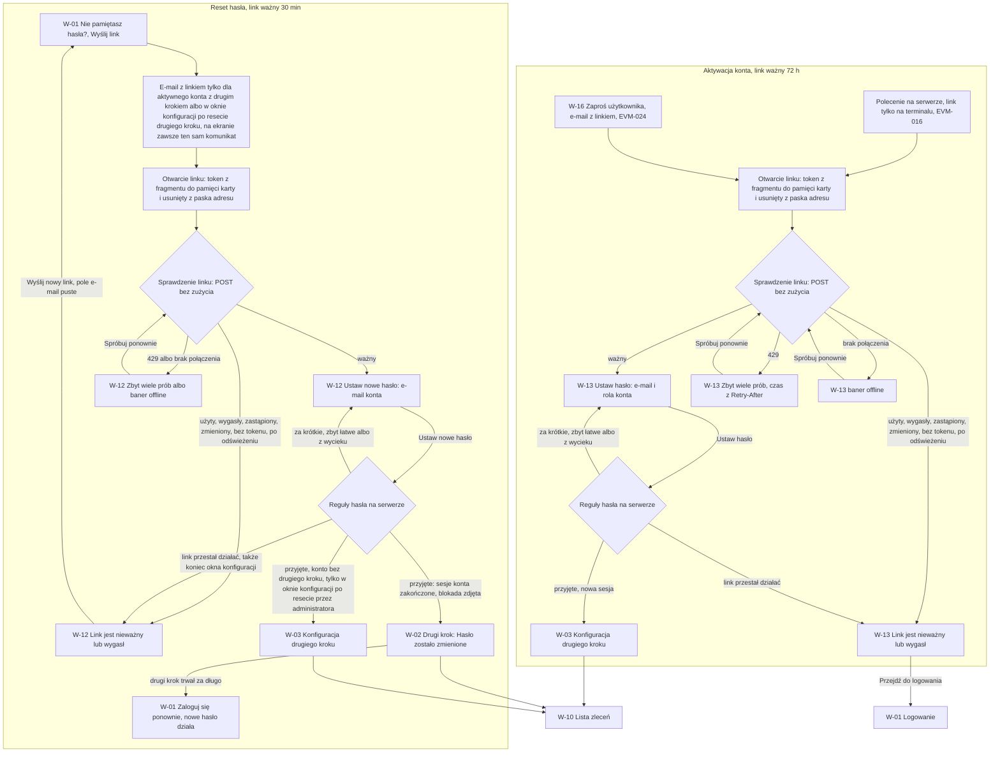

# 11 — Aktywacja konta i reset hasła (link jednorazowy)

> Dokument żywy (EVM-015) · przepływ 11 (E1) · kanał: web · ekrany: W-13, W-12 (oraz W-01, W-02, W-03 z [01](01-logowanie-mfa.md)) · treści e-maili: [e-maile.md](e-maile.md) · indeks: [README.md](README.md)
> Źródła: ADR-0005; polityki P1, P2, P10 ([`policies.md`](../../security/policies.md)); SR-AUTH-01, -02, -05, -11, -12, SR-SESS-02, SR-API-04, SR-LOG-02, SR-WEB-05; README M1 → „Zasady wspólne” → „Tokeny w linkach jednorazowych” ([`../../backlog/M1/README.md`](../../backlog/M1/README.md#zasady-wspólne-dla-historyjek-m1)); konsultacja `security-engineer` w EVM-015 (S3, kontrole 1–4, 9, 11, 12). Historyjki: EVM-016 i EVM-024 (W-13), EVM-025 (W-12).

## Przepływ


## Zasady wspólne W-12 i W-13
Kontrole z konsultacji `security-engineer` (EVM-015 — kontrole 1, 3, 4, 9, 12 i ustalenie S3) i z README M1 („Tokeny w linkach jednorazowych”). Obowiązują oba ekrany; tabele stanów niżej ich nie powtarzają.

1. **Token tylko we fragmencie adresu** (`#…`), nigdy w ścieżce ani w query. Link buduje serwer z adresu panelu w swojej konfiguracji — nigdy z nagłówka `Host` (CWE-640).
2. **Token znika z paska adresu.** Zaraz po wczytaniu panel przenosi token z fragmentu do pamięci karty i usuwa go z paska adresu i historii przeglądarki (`history.replaceState`). Do serwera token trafia wyłącznie w treści `POST` (SR-API-04, SR-LOG-02; CWE-598).
3. **Sprawdzenie linku przy wczytaniu** — `POST` z tokenem, bez zużycia linku (EVM-016 AC5). Nieważny link widać przed wpisaniem hasła. To rekomendacja dla planu EVM-016; jeśli kontrakt nie przewidzi sprawdzenia, formularz pojawia się bez e-maila konta, a stan linku nieważnego — po „Ustaw hasło”.
4. **Dane konta dopiero po sprawdzeniu** (S3): e-mail konta (W-12, W-13) i rola (W-13) wracają z serwera wyłącznie po sprawdzeniu ważnego tokenu. Stan przed odpowiedzią i stan linku nieważnego nie pokazują e-maila, nazwy ani roli. `displayName` nie pojawia się na tych ekranach w ogóle.
5. **Samo otwarcie linku go nie zużywa** — skaner linków w poczcie go nie „spali”. Link przestaje działać po aktywacji konta (W-13: EVM-016 AC4, EVM-024 AC3) albo po ustawieniu nowego hasła (W-12). Po zapisie hasła token znika z pamięci karty. Przerwana konfiguracja drugiego kroku po W-13: logowanie nowym hasłem w W-01 prowadzi z powrotem do W-03 (`403 mfa_enrollment_required`).
6. **Odświeżenie strony = link bez tokenu** → stan „Link jest nieważny lub wygasł.”. Ponowne otwarcie linku z wiadomości działa, dopóki link jest ważny.
7. **Jeden komunikat** „Link jest nieważny lub wygasł.” dla linku użytego, wygasłego, zastąpionego (nowszy link albo nowe zaproszenie), zmienionego i bez tokenu — bez informacji o koncie (CWE-204).
8. **Bez „Kopiuj link”**, bez zasobów i linków zewnętrznych (fonty, obrazy, skrypty, analityka — tylko zasoby panelu). Stopka „Prywatność · Pomoc” prowadzi do stron panelu, jak w W-01.
9. **Hasło i token tylko w pamięci karty** (SR-WEB-05) — nigdy w `localStorage`, `sessionStorage`, IndexedDB ani ciasteczkach; czyszczone po sukcesie i przy zamknięciu karty.
10. **Inne konto zalogowane w tej przeglądarce** — InlineAlert informacyjny „Ustawienie hasła wyloguje bieżące konto w tej przeglądarce.” (bez nazwy tego konta). Po zapisie powstaje nowa sesja z nowym identyfikatorem (SR-SESS-02), a poprzednia się kończy.
11. **Limit**: sprawdzenie i użycie linku to operacje publiczne — 60 żądań / min / IP (P10) → `429` z `Retry-After`.
12. **Tytuł karty bez danych osobowych:** „Aktywacja konta · EVia Manager” (W-13), „Nowe hasło · EVia Manager” (W-12) — także w stanie linku nieważnego.
13. **Kanał: tylko panel web.** Link otwarty na telefonie otwiera panel w przeglądarce telefonu; aplikacja mobilna nie ustawia haseł (SR-AUTHZ-12; „Nie pamiętasz hasła?” w M-01 też otwiera panel).

## Pole nowego hasła
Obowiązuje W-13, W-12 i formularz „Zmień hasło” w [W-15](12-konto-i-administracja.md#w-15-konto) (kontrola 2 z konsultacji; SR-AUTH-01, SR-AUTH-02, P2; ASVS V6.2.1, V6.2.5–V6.2.9).

| Reguła | W UI |
|---|---|
| Długość | co najmniej 15 znaków; górny limit podaje serwer (P2: co najmniej 128); bez `maxlength` poniżej 128 — zalecane bez `maxlength`, nadmiar zgłasza walidacja. Dowolne znaki Unicode; spacje się liczą |
| Bez przycinania | wartość trafia do serwera bez zmian — hasło jest wyłączone z przycinania z SR-INPUT-05 (SR-AUTH-01); normalizację NFC robi serwer |
| Podgląd i wklejanie | pole maskowane z „Pokaż” / „Ukryj”; wklejanie i menedżery haseł działają; bez CAPTCHA i testów poznawczych (WCAG 3.3.8) |
| Menedżer haseł | `autocomplete="new-password"`; w tym samym formularzu e-mail konta jako pole tylko do odczytu z `autocomplete="username"` (`readonly`, nie `disabled` — menedżer zapisze parę) |
| Jedno pole | bez „Powtórz hasło” — „Pokaż” pozwala sprawdzić wpis bez ponownego pisania |
| Bez dodatkowych reguł | bez reguł złożoności, pytań pomocniczych i podpowiedzi hasła |
| Walidacja | długość — po opuszczeniu pola i przy zapisie (§ 3.2); listy haseł popularnych, słowa kontekstowe i wycieki (SR-AUTH-02, Pwned Passwords k-anonimowo) — serwer przy zapisie; niedostępność Pwned Passwords nie zmienia UI |
| Odrzucenie | **jeden komunikat**, bez wskazania listy, która odrzuciła hasło, i bez powtórzenia hasła; pole jest czyszczone i dostaje fokus; po błędzie sieci wartość zostaje (pamięć karty) |
| Poufność | hasło nigdy w adresie URL, tytule karty, logach, analityce ani ogłoszeniach czytnika ekranu |

**Komunikaty:** „Hasło musi mieć co najmniej 15 znaków.” · „Hasło może mieć najwyżej [limit] znaków.” · „To hasło jest zbyt łatwe do odgadnięcia albo pojawiło się w wycieku danych. Wybierz inne — np. zdanie z kilku słów.” · podpowiedź pod polem: „Co najmniej 15 znaków — może to być zdanie ze spacjami.”

## W-13 Ustaw hasło
- **Cel:** aktywować konto jednorazowym linkiem — ustawić hasło i przejść do konfiguracji drugiego kroku (W-03). Ten sam ekran obsługuje link z polecenia na serwerze (pierwszy Administrator, EVM-016) i zaproszenie (EVM-024).
- **Główna akcja:** „Ustaw hasło”.
- **Hierarchia treści:** 1) logo „EVia Manager”, 2) tytuł „Ustaw hasło” i rola konta, 3) informacja o innym zalogowanym koncie (tylko gdy dotyczy), 4) e-mail konta (tylko do odczytu), 5) „Nowe hasło” z podpowiedzią, 6) „Ustaw hasło”, 7) zapowiedź następnego kroku, 8) stopka „Prywatność · Pomoc”.

**Makieta (expanded; ten sam układ na `breakpoint.compact`)**
```text
┌───────────────────────────────────────────────────────────────┐
│                     (tło color.bg.brand)                      │
│          ┌─────────────────────────────────────────┐          │
│          │  EVia Manager                           │          │
│          │                                         │          │
│          │  Ustaw hasło                            │          │
│          │  Aktywacja konta · rola: Edytor         │ ← po sprawdzeniu linku
│          │                                         │          │
│          │  ┃‹info› Ustawienie hasła wyloguje      │ ← tylko gdy w tej
│          │  ┃ bieżące konto w tej przeglądarce.    │   przeglądarce jest sesja
│          │                                         │          │
│          │  E-mail                                 │          │
│          │  anna.testowa@example.com               │ ← tylko do odczytu
│          │  Nowe hasło                             │          │
│          │  [••••••••••••••••••••••••]  [Pokaż]    │          │
│          │  Co najmniej 15 znaków — może to być    │          │
│          │  zdanie ze spacjami.                    │          │
│          │                                         │          │
│          │  [[            Ustaw hasło           ]] │          │
│          │  Następny krok: drugi krok logowania.   │          │
│          └─────────────────────────────────────────┘          │
│                     Prywatność · Pomoc                        │
└───────────────────────────────────────────────────────────────┘

 Sprawdzanie linku (przed odpowiedzią serwera — bez e-maila i roli):
 │  Ustaw hasło                                     │
 │  Sprawdzamy link…                                │
 │  ▒▒▒▒▒▒▒▒▒▒▒▒▒▒▒▒                                 │
 │  ▒▒▒▒▒▒▒▒▒▒▒▒▒▒▒▒▒▒▒▒▒▒▒▒▒▒                       │

 Link nieważny (jeden stan dla wszystkich przypadków — bez danych konta):
 │            ‹link-2-off› (size.icon.2xl)          │
 │  Link jest nieważny lub wygasł.                  │
 │  Otwórz link jeszcze raz, prosto z wiadomości    │
 │  z zaproszeniem. Jeśli nadal nie działa, poproś  │
 │  administratora o nowe zaproszenie.              │
 │  [[ Przejdź do logowania ]]                      │
```

**Stany**
| Stan | Zachowanie |
|---|---|
| Pusty | Po sprawdzeniu linku: pole „Nowe hasło” puste z fokusem; e-mail i rola z odpowiedzi serwera. Bez pola nazwy wyświetlanej (ustala ją zaproszenie; zmiana — W-15). |
| Ładowanie | Sprawdzanie linku — „Sprawdzamy link…” (`role="status"`) i Skeleton (§ 3.16) w kształcie pól, bez e-maila i roli; zapis — „Ustaw hasło” w stanie ładowania (§ 3.1), pole tylko do odczytu do odpowiedzi. |
| Błąd | Link nieważny — stan „Link jest nieważny lub wygasł.” (makieta) z „Przejdź do logowania”; ten sam stan, gdy link przestał działać między sprawdzeniem a zapisem (hasło czyszczone). Hasło — komunikaty z [Pole nowego hasła](#pole-nowego-hasła). `429` przy sprawdzeniu albo zapisie — „Zbyt wiele prób. Spróbuj ponownie za 1 min.” (czas z `Retry-After`) i „Spróbuj ponownie” (token zostaje w pamięci karty). Błąd serwera — § 6.4 z kodem pomocniczym. |
| Offline | Przy wczytaniu — Banner § 4.10 „Brak połączenia. Ustawienie hasła wymaga połączenia z internetem.” i „Spróbuj ponownie”, bez formularza (link niesprawdzony). Po sprawdzeniu — baner, „Ustaw hasło” wyłączony z podpowiedzią „Ustawisz hasło po powrocie połączenia.”; wpisane hasło zostaje w pamięci karty. |
| Brak uprawnień | nd. przed zalogowaniem — dostęp daje wyłącznie ważny link (operacja publiczna z limitem P10); link nieważny to stan błędu wyżej, bez `403` / `404` i bez danych konta. Inne konto zalogowane w tej przeglądarce — InlineAlert z makiety (zasada wspólna 10). |

**Role** (kolumny A / E / R — rola konta z linku; ekran działa bez logowania)
| Akcja | Operacja | A | E | R | Niezalogowany |
|---|---|---|---|---|---|
| Sprawdzenie linku | `POST` z tokenem w treści, bez zużycia (EVM-016 AC5); odpowiedź: e-mail i rola konta albo jeden błąd | tak | tak | tak | tak — tylko z ważnym linkiem; 60 / min / IP (P10) |
| Ustaw hasło | aktywacja konta: hasło (SR-AUTH-01, -02), nowa sesja (SR-SESS-02), potem W-03 (`403 mfa_enrollment_required` do końca konfiguracji — SR-AUTH-06) | tak — w W-03 tylko klucz dostępu (P1) | tak | tak — W-03 bez informacji o telefonie (P6) | tak — z ważnym linkiem |
| Nowe zaproszenie | — nie ma na ekranie: wysyła je Administrator w [W-16](12-konto-i-administracja.md#w-16-użytkownicy) (step-up); pierwszy Administrator — ponowne polecenie na serwerze (runbook EVM-016) | — | — | — | — |

- **Responsywność:** jak W-01 — karta w kolumnie `size.form.max-width` na środku; `breakpoint.compact` — karta na całą szerokość z marginesem siatki, stopka pod kartą. Link otwarty na telefonie — ten sam układ compact.
- **Komponenty i tokeny:** Card (§ 3.8) `color.bg.surface`, `radius.card`, `space.inset.lg` na tle `color.bg.brand`; logo i stopka `color.text.on-brand`; tytuł `text.heading-2`, rola `text.body` `color.text.secondary`; TextField (§ 3.2) — hasło (pokaż / ukryj) i e-mail tylko do odczytu (bez obrysu, `color.text.primary`); podpowiedź `text.body-sm` `color.text.tertiary`, błąd `color.text.error` + `circle-alert`; Button primary (§ 3.1) `size.control.height.web.lg`; InlineAlert (§ 3.19) `color.feedback.info.*` (inne konto zalogowane), `color.feedback.error.*` (`429`, błąd serwera); stan linku nieważnego — EmptyState (§ 3.15) w karcie: ikona `link-2-off` `size.icon.2xl` `color.icon.secondary`, tytuł `text.heading-3`, opis `text.body` `color.text.secondary`, Button primary; Skeleton (§ 3.16); Banner offline (§ 4.10); odstępy `space.stack.md`, `space.stack.lg`; fokus w karcie `color.focus.ring`, w stopce na tle marki `color.focus.ring-inverse`.
- **Mikrocopy:** „Ustaw hasło” · „Aktywacja konta · rola: Edytor” (Administrator, Tylko odczyt) · „Ustawienie hasła wyloguje bieżące konto w tej przeglądarce.” · „E-mail” · „Nowe hasło” · „Pokaż” / „Ukryj” · „Co najmniej 15 znaków — może to być zdanie ze spacjami.” · „Następny krok: drugi krok logowania.” · „Sprawdzamy link…” · „Link jest nieważny lub wygasł.” · „Otwórz link jeszcze raz, prosto z wiadomości z zaproszeniem. Jeśli nadal nie działa, poproś administratora o nowe zaproszenie.” · „Przejdź do logowania” · „Zbyt wiele prób. Spróbuj ponownie za 1 min.” · „Spróbuj ponownie” · „Brak połączenia. Ustawienie hasła wymaga połączenia z internetem.” · „Ustawisz hasło po powrocie połączenia.” · komunikaty hasła — [Pole nowego hasła](#pole-nowego-hasła).
- **Dostępność:** tytuł karty „Aktywacja konta · EVia Manager”; po sprawdzeniu linku fokus na polu „Nowe hasło” (stan ważny) albo na tytule stanu nieważnego; „Sprawdzamy link…” w `role="status"`; błędy w `role="alert"` z fokusem na polu albo komunikacie; podpowiedź powiązana z polem (`aria-describedby`); „Pokaż” z `aria-pressed` i nazwą „Pokaż hasło”; e-mail jako `readonly` z `autocomplete="username"`, hasło z `autocomplete="new-password"`; wklejanie i menedżery haseł działają, bez CAPTCHA i testów poznawczych (WCAG 3.3.8); ikona `link-2-off` dekoracyjna (`aria-hidden`); brak limitu czasu poza ważnością linku (72 h).

## W-12 Ustaw nowe hasło
- **Cel:** ustawić nowe hasło z linku z e-maila (prośba o link — [W-01](01-logowanie-mfa.md#w-01-logowanie) „Nie pamiętasz hasła?”) i potwierdzić logowanie drugim krokiem — reset nie omija drugiego kroku (SR-AUTH-11).
- **Główna akcja:** „Ustaw nowe hasło”.
- **Hierarchia treści:** 1) logo, 2) tytuł „Ustaw nowe hasło”, 3) informacja o innym zalogowanym koncie (gdy dotyczy), 4) e-mail konta (tylko do odczytu), 5) „Nowe hasło” z podpowiedzią, 6) skutki: zakończenie sesji i drugi krok, 7) „Ustaw nowe hasło”, 8) „Wróć do logowania”, 9) stopka.

**Makieta (expanded; ten sam układ na `breakpoint.compact`)**
```text
┌───────────────────────────────────────────────────────────────┐
│                     (tło color.bg.brand)                      │
│          ┌─────────────────────────────────────────┐          │
│          │  EVia Manager                           │          │
│          │                                         │          │
│          │  Ustaw nowe hasło                       │          │
│          │                                         │          │
│          │  ┃‹info› Ustawienie hasła wyloguje      │ ← tylko gdy w tej
│          │  ┃ bieżące konto w tej przeglądarce.    │   przeglądarce jest sesja
│          │                                         │          │
│          │  E-mail                                 │          │
│          │  jan.przykladowy@example.com            │ ← tylko do odczytu
│          │  Nowe hasło                             │          │
│          │  [••••••••••••••••••••••••]  [Pokaż]    │          │
│          │  Co najmniej 15 znaków — może to być    │          │
│          │  zdanie ze spacjami.                    │          │
│          │                                         │          │
│          │  Po zapisaniu zakończymy wszystkie      │          │
│          │  sesje tego konta, a logowanie          │          │
│          │  potwierdzisz drugim krokiem.           │          │
│          │                                         │          │
│          │  [[         Ustaw nowe hasło         ]] │          │
│          │  Wróć do logowania                      │ ← link   │
│          └─────────────────────────────────────────┘          │
│                     Prywatność · Pomoc                        │
└───────────────────────────────────────────────────────────────┘

 Link nieważny (jeden stan — bez danych konta):
 │            ‹link-2-off› (size.icon.2xl)          │
 │  Link jest nieważny lub wygasł.                  │
 │  Otwórz najnowszy link z wiadomości jeszcze raz  │
 │  albo wyślij nowy link — każdy link działa       │
 │  30 minut.                                       │
 │  [[ Wyślij nowy link ]]   [Wróć do logowania]    │ → W-01, formularz „Zresetuj
 │                                                  │   hasło” z pustym polem e-mail

 Po zapisie → W-02 (InlineAlert nad metodą drugiego kroku):
 │ ┃‹circle-check› Hasło zostało zmienione.         │
 │ ┃ Zakończyliśmy wszystkie sesje tego konta.      │
 │ ┃ Potwierdź logowanie drugim krokiem.            │
```

**Stany**
| Stan | Zachowanie |
|---|---|
| Pusty | Po sprawdzeniu linku: pole „Nowe hasło” puste z fokusem; e-mail konta z odpowiedzi serwera (bez nazwy i roli). |
| Ładowanie | Jak W-13: „Sprawdzamy link…” i Skeleton pól bez e-maila; zapis — „Ustaw nowe hasło” w stanie ładowania. |
| Błąd | Link nieważny — stan z makiety: „Wyślij nowy link” otwiera w W-01 formularz „Zresetuj hasło” **bez wpisanego e-maila** (ASVS V6.4.3), „Wróć do logowania” — W-01. Link wygasł w trakcie wpisywania — ten sam stan, hasło czyszczone. Hasło — [Pole nowego hasła](#pole-nowego-hasła). `429` — jak W-13. Błąd serwera — § 6.4. Drugi krok po zapisie trwał za długo — W-02 „Logowanie trwało zbyt długo. Zaloguj się ponownie — nowe hasło już działa.” → W-01. |
| Offline | Jak W-13: przy wczytaniu baner § 4.10 „Brak połączenia. Ustawienie hasła wymaga połączenia z internetem.” i „Spróbuj ponownie”; po sprawdzeniu — „Ustaw nowe hasło” wyłączony z podpowiedzią, hasło zostaje w pamięci karty. Link działa 30 minut — tekst nie obiecuje dłuższej ważności. |
| Brak uprawnień | nd. przed zalogowaniem — dostęp daje wyłącznie ważny link. Konto dezaktywowane nie dostaje linku (EVM-025 AC1); link wydany przed dezaktywacją — stan linku nieważnego. Konto bez drugiego kroku poza oknem konfiguracji też nie dostaje linku, a link wydany w oknie przestaje działać z jego końcem — [Konto bez drugiego kroku](#konto-bez-drugiego-kroku). Konto zablokowane po nieudanych logowaniach — reset działa i zdejmuje blokadę (EVM-026 AC7). |

**Po zapisie** (SR-AUTH-11, EVM-025 AC4–AC5): serwer kończy wszystkie sesje web konta (następne żądanie — `401 session_revoked`) i wysyła e-mail „Hasło zostało zmienione” ([e-maile.md](e-maile.md)). Panel przechodzi do W-02 z InlineAlert z makiety — dopiero po drugim kroku powstaje sesja. Konto bez drugiego kroku przechodzi do W-03 **wyłącznie w oknie konfiguracji** po resecie przez administratora — [Konto bez drugiego kroku](#konto-bez-drugiego-kroku). Sesje urządzeń mobilnych — od E9.

**Role** (kolumny A / E / R — rola konta z linku; ekran działa bez logowania)
| Akcja | Operacja | A | E | R | Niezalogowany |
|---|---|---|---|---|---|
| Sprawdzenie linku | `POST` z tokenem, bez zużycia; odpowiedź: e-mail konta albo jeden błąd | tak | tak | tak | tak — tylko z ważnym linkiem; 60 / min / IP (P10) |
| Ustaw nowe hasło | reset (SR-AUTH-11): hasło (SR-AUTH-01, -02), koniec sesji, e-mail, audyt; potem W-02 (W-03 — tylko konto bez drugiego kroku w oknie konfiguracji po resecie przez administratora) | tak — W-02: klucz dostępu | tak | tak | tak — z ważnym linkiem |
| Wyślij nowy link | W-01 „Zresetuj hasło” (pole e-mail puste); odpowiedź zawsze ta sama (EVM-025 AC1) | tak | tak | tak | tak |

- **Responsywność:** jak W-13.
- **Komponenty i tokeny:** jak W-13; dodatkowo link „Wróć do logowania” `color.text.link`, Button secondary „Wróć do logowania” w stanie linku nieważnego (§ 3.1), w W-02 InlineAlert (§ 3.19) `color.feedback.success.*` z ikoną `circle-check`; tekst skutków `text.body` `color.text.secondary`.
- **Mikrocopy:** „Ustaw nowe hasło” · „Ustawienie hasła wyloguje bieżące konto w tej przeglądarce.” · „E-mail” · „Nowe hasło” · „Pokaż” / „Ukryj” · „Co najmniej 15 znaków — może to być zdanie ze spacjami.” · „Po zapisaniu zakończymy wszystkie sesje tego konta, a logowanie potwierdzisz drugim krokiem.” · „Wróć do logowania” · „Sprawdzamy link…” · „Link jest nieważny lub wygasł.” · „Otwórz najnowszy link z wiadomości jeszcze raz albo wyślij nowy link — każdy link działa 30 minut.” · „Wyślij nowy link” · W-02: „Hasło zostało zmienione. Zakończyliśmy wszystkie sesje tego konta. Potwierdź logowanie drugim krokiem.” · „Logowanie trwało zbyt długo. Zaloguj się ponownie — nowe hasło już działa.” · komunikaty `429`, offline i hasła jak W-13.
- **Dostępność:** tytuł karty „Nowe hasło · EVia Manager”; fokus i ogłoszenia jak W-13; po przejściu do W-02 komunikat sukcesu w `role="status"`, fokus na nagłówku „Potwierdź logowanie”; „Wyślij nowy link” przenosi fokus na pole „E-mail” formularza „Zresetuj hasło” w W-01.

### Konto bez drugiego kroku
Ustalenie `security-engineer` z przeglądu EVM-015 (SR-AUTH-06, SR-AUTH-11, SR-AUTH-13, TM-44; ASVS V6.4.3, V6.4.4; CWE-640, CWE-308). Konto po resecie drugiego kroku przez administratora (W-16, dialog 7) nie ma żadnej metody drugiego kroku. Bez limitu czasu reset hasła albo samo hasło pozwoliłyby dopisać metodę napastnikowi, który ma dostęp do skrzynki — odzyskanie konta byłoby jednoskładnikowe. Dlatego W-03 po resecie działa tylko w **oknie konfiguracji**:

| Sytuacja | Zachowanie |
|---|---|
| Okno konfiguracji | otwiera je reset drugiego kroku przez administratora; długość — plan EVM-027 (rekomendacja ≤ 24 h; makiety i e-maile pokazują 24 h); najlepiej konfiguracja od razu, w trakcie rozmowy weryfikującej tożsamość; ponowny reset otwiera nowe okno |
| W oknie | W-12 → W-03 po zapisie hasła; logowanie hasłem w W-01 → W-03 (`403 mfa_enrollment_required`) |
| Prośba o link po końcu okna | konto nie dostaje linku; W-01 pokazuje ten sam komunikat co zawsze — bez enumeracji |
| Link wydany w oknie, użyty po jego końcu | stan „Link jest nieważny lub wygasł.” (ważność linku kończy się najpóźniej z końcem okna) |
| Logowanie hasłem po końcu okna | W-01, po poprawnym haśle: „Konfiguracja drugiego kroku wygasła — poproś administratora o ponowny reset.” — bez W-03 ([W-01](01-logowanie-mfa.md#w-01-logowanie); kod odpowiedzi — plan EVM-027) |
| Koniec okna w trakcie W-03 | serwer odrzuca rejestrację metody → W-01 z tym samym komunikatem ([W-03](01-logowanie-mfa.md#w-03-konfiguracja-mfa)) |

Ten sam termin podają dialog 7 w [W-16](12-konto-i-administracja.md#w-16-użytkownicy) („w ciągu 24 godzin”) i e-mail [5 „Reset przez Administratora”](e-maile.md#5-zmiana-drugiego-kroku-logowania) (data i godzina). Konto po aktywacji (W-13) bez dokończonego W-03 tej ścieżki nie ma — ma status „Oczekuje na aktywację”, więc nie dostaje linku resetu (warunek dla planów EVM-016 i EVM-024).
