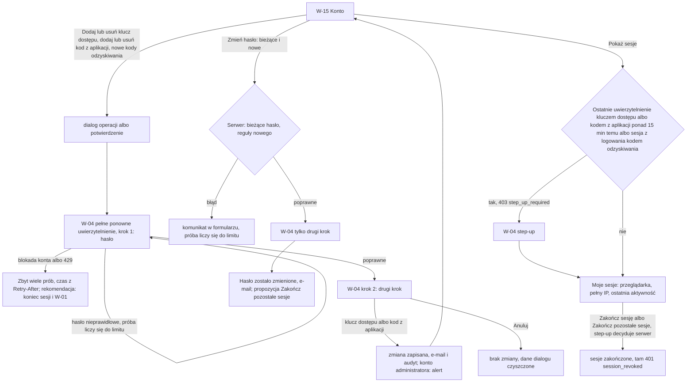
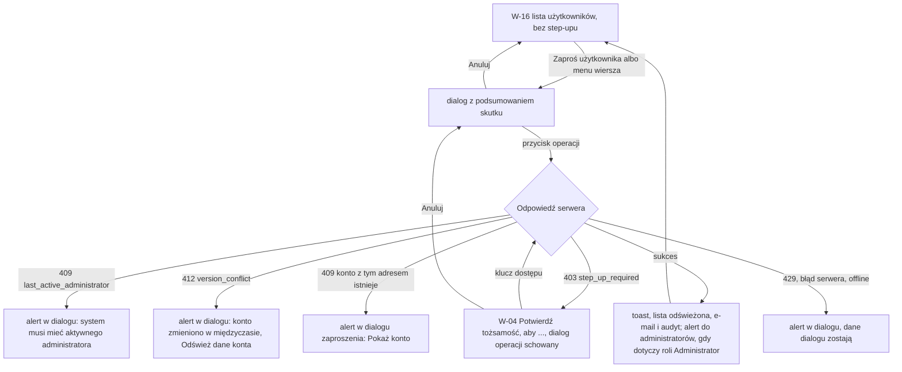
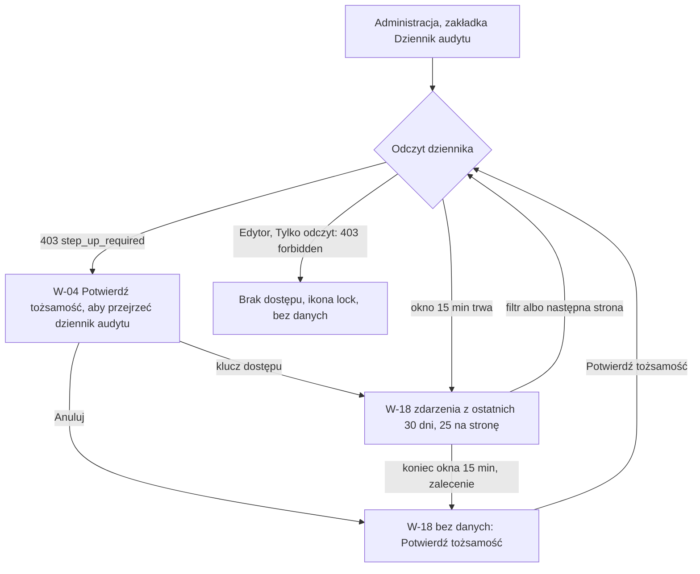

# 12 — Konto i administracja

> Dokument żywy (EVM-015) · przepływ 12 (E1) · kanał: web · ekrany: W-15, W-16, W-18 (oraz dialog [W-04](01-logowanie-mfa.md#w-04-ponowne-uwierzytelnienie)) · treści e-maili: [e-maile.md](e-maile.md) · indeks: [README.md](README.md)
> Źródła: ADR-0005; polityki P1, P2, P9, P10 ([`policies.md`](../../security/policies.md)); SR-AUTH-01, -03, -05, -08, -10, -13, SR-SESS-02, -04, -06, -07, -08, SR-AUTHZ-11, -12, SR-LOG-03, -07, SR-WEB-05, SR-INPUT-07; `domain-model.md` → `User`, `Session`, `AuditEvent`, macierz uprawnień; decyzje Konrada 3, 7, 10, 16 (README M1 → „Decyzje dla Konrada”; decyzja 16 potwierdzona na demo EVM-015 2026-10-04 — kod odzyskiwania tylko w logowaniu); konsultacja `security-engineer` w EVM-015 (S2, S4–S7, kontrole 5–9, 11, 12). Historyjki: EVM-028 (W-15), EVM-024 i EVM-027 (W-16), EVM-029 (W-18).

## Zasady wspólne przepływu 12
1. **Tylko panel web** (SR-AUTHZ-12): step-up, zmiana hasła, zmiany drugiego kroku, sesje i funkcje administracyjne nie występują w aplikacji mobilnej.
2. **O ponownym uwierzytelnieniu decyduje serwer.** Panel pokazuje [W-04](01-logowanie-mfa.md#w-04-ponowne-uwierzytelnienie) wyłącznie po odpowiedzi serwera (`403 step_up_required` albo kod pełnego ponownego uwierzytelnienia z planu EVM-028) i nie zapamiętuje, że step-up jest ważny. Trzy zastosowania dialogu (step-up, pełne ponowne uwierzytelnienie, zmiana hasła) — tabela w W-04.
3. **Hasła i kody tylko w pamięci karty** (SR-WEB-05) — czyszczone po sukcesie, „Anuluj” i wylogowaniu.
4. **Administracja** — pozycja Sidebar tylko dla Administratora; zakładki (Tabs, § 3.17) „Użytkownicy” (W-16, domyślna) i „Dziennik audytu” (W-18); zakładka „Urządzenia” (W-17) — od E9. Edytor i Tylko odczyt, którzy wejdą z adresu: `403` — EmptyState z ikoną `lock` „Nie masz dostępu do administracji. Ta część panelu jest dostępna tylko dla administratora. [Przejdź do zleceń]”, bez danych, tytuł karty „Brak dostępu · EVia Manager”.
5. **Tytuły kart bez danych osobowych:** „Konto · EVia Manager”, „Użytkownicy · EVia Manager”, „Dziennik audytu · EVia Manager”.
6. **Nazwa wyświetlana i nazwa klucza dostępu to zwykły tekst** — bez HTML i Markdown, wyświetlane bez interpretacji (SR-INPUT-05).
7. **Formy bezosobowe** (§ 6.1) — także w dialogach i dzienniku audytu: „Zmiana roli”, „Zresetowano drugi krok logowania”.

## Przepływ
**W-15 — zmiany konta**


**W-16 — operacja na koncie użytkownika**


**W-18 — wejście do dziennika audytu**


## W-15 Konto
- **Cel:** samodzielnie dbać o własne konto — nazwa wyświetlana, hasło, metody drugiego kroku i sesje — bez proszenia administratora (EVM-028).
- **Główna akcja:** w stanie wyjściowym strona nie ma przycisku primary — to zestaw niezależnych ustawień, więc akcje kart są drugorzędne (Button secondary): „Zapisz” (Profil), „Zmień hasło” (odsłania formularz hasła), „Dodaj klucz dostępu” (Drugi krok logowania), „Pokaż sesje” i „Zakończ pozostałe sesje” (Moje sesje). Jedyny primary widoku to „Zapisz nowe hasło” w rozwiniętym formularzu hasła (§ 3.1 — jedna akcja primary na widok / dialog); w dialogach — przycisk operacji.
- **Hierarchia treści:** 1) tytuł „Konto”, 2) Profil, 3) Hasło, 4) Drugi krok logowania (kotwica `#drugi-krok`), 5) Moje sesje. Sekcja „Urządzenia” — od E9; w M1 niewidoczna.
- **Wejście:** menu konta w TopBar → „Konto”; kotwica `#drugi-krok` — z W-03 i z M-02 („Konto → Drugi krok logowania”) oraz z e-maili 5 i 6 ([e-maile.md](e-maile.md)).

**Makieta (expanded; jedna kolumna kart `size.form.max-width` w obszarze treści; `[[ ]]` tylko przy „Zapisz nowe hasło” w rozwiniętym formularzu, pozostałe przyciski kart — secondary)**
```text
Konto
┌─ Profil ──────────────────────────────────────────────────────┐
│ Nazwa wyświetlana                                             │
│ [Anna Testowa__________________________]   [Zapisz]           │
│ Widzą ją inni użytkownicy, np. w dzienniku zlecenia.          │
│ E-mail   anna.testowa@example.com                             │
│          Zmianę adresu e-mail zgłoś administratorowi.         │
│ Rola     Administrator · Rolę zmienia administrator.          │
└───────────────────────────────────────────────────────────────┘
┌─ Hasło ───────────────────────────────────────────────────────┐
│ [Zmień hasło]             ← znika, gdy formularz jest otwarty │
│ po „Zmień hasło” (formularz w miejscu przycisku):             │
│ E-mail          anna.testowa@example.com   ← tylko do odczytu │
│ Bieżące hasło   [••••••••••••••••••]  [Pokaż]                 │
│ Nowe hasło      [••••••••••••••••••]  [Pokaż]                 │
│ Co najmniej 15 znaków — może to być zdanie ze spacjami.       │
│ Potem potwierdzisz zmianę drugim krokiem.                     │
│                            [Anuluj]  [[ Zapisz nowe hasło ]]  │
│ po zmianie (formularz zwinięty i wyczyszczony):               │
│ ┃‹circle-check› Hasło zostało zmienione. Wysłaliśmy e-mail    │
│ ┃ z informacją. Konto ma jeszcze 2 inne aktywne sesje.        │
│ ┃ [Zakończ pozostałe sesje]                                   │
│ [Zmień hasło]                                                 │
│ albo, gdy konto nie ma innych sesji:                          │
│ ┃‹circle-check› Hasło zostało zmienione. Wysłaliśmy e-mail    │
│ ┃ z informacją.                                               │
│ [Zmień hasło]                                                 │
└───────────────────────────────────────────────────────────────┘
┌─ Drugi krok logowania ─────────────────────── #drugi-krok ────┐
│ Każda zmiana wymaga hasła i drugiego kroku.                   │
│                                                               │
│ Klucze dostępu                                                │
│ ‹key-round› Laptop w biurze · dodano 03.10.2026   [Usuń…]     │
│ ‹key-round› Telefon · dodano 04.10.2026           [Usuń…]     │
│ [‹plus› Dodaj klucz dostępu]                                  │
│ ┃‹info› (A, jeden klucz) Dodaj drugi klucz dostępu, np.       │
│ ┃ w telefonie — bez niego utrata komputera blokuje logowanie. │
│                                                               │
│ Kod z aplikacji uwierzytelniającej                            │
│ ‹smartphone› Dodano 03.10.2026                    [Usuń…]     │
│ (A) Służy tylko do logowania w aplikacji na telefonie.        │
│ albo, gdy brak:  Nie dodano.   [Dodaj kod z aplikacji]        │
│                                                               │
│ Kody odzyskiwania                                             │
│ Pozostało 7 kodów · wygenerowano 03.10.2026                   │
│ [Wygeneruj nowe kody…]                                        │
│ ┃‹triangle-alert› Zostały 3 kody odzyskiwania. Wygeneruj      │ ← gdy ≤ 3
│ ┃ nowe, zanim się skończą.                                    │
└───────────────────────────────────────────────────────────────┘
┌─ Moje sesje ──────────────────────────────────────────────────┐
│ Przeglądarki, w których konto jest zalogowane.                │
│ [Pokaż sesje]           ← gdy potrzebny step-up → W-04        │
│ po potwierdzeniu:                                             │
│ ┌───────────────────┬────────────────┬───────────────┬──────────────┐
│ │ Przeglądarka      │ Adres IP       │ Ostatnia      │              │
│ │                   │                │ aktywność     │              │
│ ├───────────────────┼────────────────┼───────────────┼──────────────┤
│ │ Edge · Windows    │ 198.51.100.23  │ teraz         │ Ta sesja     │
│ │ Firefox · Windows │ 203.0.113.45   │ dziś, 08:10   │ [Zakończ sesję]│
│ │ Chrome · Android  │ 2001:db8:5::17 │ wczoraj, 18:40│ [Zakończ sesję]│
│ └───────────────────┴────────────────┴───────────────┴──────────────┘
│ [Zakończ pozostałe sesje]                                     │
│ Konto może mieć najwyżej 5 sesji naraz — szóste logowanie     │
│ zakończy najstarszą.                                          │
└───────────────────────────────────────────────────────────────┘
 Urządzenia — od E9 (lista telefonów, „Wyloguj urządzenie”); w M1 sekcja niewidoczna.
```

**Drugi krok logowania — operacje** (każda po pełnym ponownym uwierzytelnieniu — za każdym razem, bez okna 15 min; SR-AUTH-10, ASVS V7.5.1)
| Operacja | Przed W-04 | Po W-04 | Reguła |
|---|---|---|---|
| Dodaj klucz dostępu | Dialog „Dodaj klucz dostępu”: pole „Nazwa klucza” (zwykły tekst, podpowiedź „Pomoże odróżnić klucze, np. „Laptop w biurze”, „Telefon”.”; limit z planu EVM-028) → „Dodaj klucz dostępu” | monit systemu (WebAuthn) → toast „Dodano klucz dostępu.” | — |
| Usuń klucz dostępu | AlertDialog „Usunąć klucz dostępu „Telefon”?” — „Tym kluczem nie zalogujesz się już do panelu.” → „Usuń klucz” (danger) | toast „Usunięto klucz dostępu.” | Administrator: co najmniej 1 klucz; Edytor, Tylko odczyt: co najmniej 1 metoda (klucz albo kod z aplikacji) — EVM-028 AC4 |
| Dodaj kod z aplikacji | — (od razu W-04) | Dialog „Dodaj kod z aplikacji” jak W-03 krok 2, wariant kodu z aplikacji: kod QR, „Pokaż klucz do wpisania”, pole kodu (§ 3.2.1), „Potwierdź kod”; metoda działa dopiero po potwierdzeniu | Administrator — „Służy tylko do logowania w aplikacji na telefonie.”; Tylko odczyt — bez informacji o telefonie (P6) |
| Usuń kod z aplikacji | AlertDialog „Usunąć kod z aplikacji uwierzytelniającej?” — Edytor, Administrator: „Bez niego nie zalogujesz się w aplikacji na telefonie.” → „Usuń kod” (danger) | toast „Usunięto kod z aplikacji.” | jak wyżej (ostatnia metoda) |
| Wygeneruj nowe kody | AlertDialog „Wygenerować nowe kody odzyskiwania?” — „Dotychczasowe kody przestaną działać.” → „Wygeneruj nowe kody” | lista 10 kodów pokazana raz, jak W-03 krok 3: „Kopiuj kody”, „Drukuj kody”, ostrzeżenie o przechowywaniu, „Kody są zapisane w bezpiecznym miejscu”, „Zakończ”; w makietach bez przykładowych wartości | kody tylko w pamięci karty; zamknięcie karty przed „Zakończ” — kody już obowiązują; nowe kody wymagają ponownego potwierdzenia tożsamości |

- **Reguły ostatniej metody** (EVM-028 AC4): „Usuń…” przy ostatniej metodzie jest wyłączone z podpowiedzią — Administrator: „Konto administratora musi mieć klucz dostępu — najpierw dodaj drugi.”; Edytor, Tylko odczyt: „To jedyna metoda — najpierw dodaj inną.” Blokada w UI to wygoda; regułę egzekwuje serwer (odrzucenie — ten sam tekst w alercie karty).
- **Kod z aplikacji Administratora** nie liczy się do reguły — w panelu Administrator loguje się wyłącznie kluczem dostępu (P1).
- **Kod odzyskiwania nie działa w W-04** (decyzja 16) — w żadnym ponownym uwierzytelnieniu: ani w pełnym ponownym uwierzytelnieniu przed zmianą drugiego kroku (także przed „Dodaj klucz dostępu” i „Dodaj kod z aplikacji”), ani przy zmianie hasła, ani w step-upie „Moich sesji”. Kod działa wyłącznie w logowaniu ([W-02](01-logowanie-mfa.md#w-02-drugi-krok)) i nie otwiera okna step-upu — po logowaniu kodem odzyskiwania „Pokaż sesje” zawsze prowadzi do W-04, także w pierwszych 15 min. Po utracie wszystkich metod potrzebny jest reset drugiego kroku przez administratora po weryfikacji tożsamości ([W-16](#w-16-użytkownicy), dialog 7; SR-AUTH-13); drugi krok Administratora resetuje inny administrator (EVM-027 AC4), a bez drugiego Administratora — tryb awaryjny z runbooka (EVM-016 AC2, RR-16).
- **Ostrzeżenia o kodach odzyskiwania:** konto bez kodów (aktywowane przed EVM-023): „Konto nie ma kodów odzyskiwania. Bez nich utrata metody wymaga resetu przez administratora. [Wygeneruj kody]”; zostały ≤ 3: „Zostały 3 kody odzyskiwania. Wygeneruj nowe, zanim się skończą.” (odmiana liczebnika § 6.3).

**Zmiana hasła** (SR-AUTH-03, SR-AUTH-10; ASVS V7.5.1, V7.4.3; CWE-620)
- Formularz w karcie (bez dialogu — W-04 nie nakłada się na formularz): e-mail tylko do odczytu (`autocomplete="username"`), „Bieżące hasło” (`current-password`), „Nowe hasło” (`new-password`) — reguły z [Pole nowego hasła](11-aktywacja-i-reset-hasla.md#pole-nowego-hasła).
- **„Zmień hasło” nie jest przełącznikiem.** Przycisk (secondary) odsłania formularz w swoim miejscu i znika na czas jego rozwinięcia. Formularz ma jedno wyjście — „Anuluj” (zwija i czyści formularz) — i jeden zapis: primary „Zapisz nowe hasło”. Każda akcja ma inną nazwę dostępną, więc nie ma dwóch przycisków „Zmień hasło”.
- Kolejność sprawdzeń — rekomendacja dla planu EVM-028: bieżące hasło → reguły nowego hasła → drugi krok (W-04 pokazuje **tylko drugi krok**, bez kodu odzyskiwania — decyzja 16). Błąd nowego hasła widać przed W-04.
- „Bieżące hasło jest nieprawidłowe.” — pole czyszczone, fokus; próba liczy się do limitów SR-AUTH-05 (S7).
- **Hasła tylko w pamięci karty** (SR-WEB-05) — czyszczone po „Anuluj” formularza, po sukcesie i po wylogowaniu. „Anuluj” w W-04 nie czyści formularza: dane zostają w pamięci karty, a formularz wraca z nimi (§ 3.13).
- Po sukcesie: formularz zwinięty i wyczyszczony, InlineAlert sukcesu bez żadnych wartości (bez hasła), z liczbą pozostałych sesji i propozycją „Zakończ pozostałe sesje” (EVM-028 AC2); gdy konto nie ma innych sesji — „Hasło zostało zmienione. Wysłaliśmy e-mail z informacją.” bez liczby sesji i bez „Zakończ pozostałe sesje”; pod nim znów „Zmień hasło”. Uwierzytelnienie jest świeże, więc zwykle bez kolejnego W-04 — decyduje serwer (`403 step_up_required` → W-04), panel nie zapamiętuje ważności step-upu. E-mail „Hasło zostało zmienione”.
- **Fokus:** po „Zmień hasło” — pole „Bieżące hasło”; po „Anuluj” formularza — przycisk „Zmień hasło”; po „Anuluj” w W-04 — „Zapisz nowe hasło”; po sukcesie — komunikat sukcesu (`tabindex="-1"`), a następny Tab prowadzi do „Zakończ pozostałe sesje” (gdy konto nie ma innych sesji — do „Zmień hasło”).

**Moje sesje** (SR-SESS-07, SR-SESS-04, P9; ustalenia S2, S6)
- Lista i zakończenie sesji po step-upie (okno 15 min od ostatniego uwierzytelnienia kluczem dostępu albo kodem z aplikacji; sesja z logowania kodem odzyskiwania okna nie ma — [W-02](01-logowanie-mfa.md#w-02-drugi-krok); o W-04 decyduje serwer): sekcja pokazuje „Pokaż sesje”, a po potwierdzeniu — tabelę. Zakończenie wybranej i pozostałych sesji także wymaga step-upu (S2).
- Wiersz: przeglądarka i system ze **zamkniętego słownika** (rodzina przeglądarki · system, bez wersji; wartość zastępcza „Nieznana przeglądarka” / „Nieznany system”) — nigdy surowy User-Agent (S6, SR-INPUT-07); **pełny adres IP** tylko przy własnych sesjach (P9); ostatnia aktywność (§ 6.3, daty względne); „Ta sesja” zamiast przycisku — bieżącą sesję kończy „Wyloguj”.
- Sesję w żądaniu wskazuje nieprzezroczysty identyfikator rekordu sesji — nigdy token ani jego skrót.
- „Zakończ sesję” i „Zakończ pozostałe sesje” — bez dialogu (operacja nie usuwa danych; odwrócenie to ponowne logowanie), wynik w toaście „Zakończono sesję: Firefox · Windows.” / „Zakończono 2 sesje.”; tam następne żądanie dostaje `401 session_revoked`.
- Jedna sesja — „Konto jest zalogowane tylko w tej przeglądarce.” (bez tabeli i bez „Zakończ pozostałe sesje”).

**Stany**
| Stan | Zachowanie |
|---|---|
| Pusty | Brak kodu z aplikacji — „Nie dodano.” z „Dodaj kod z aplikacji”; brak kodów odzyskiwania — ostrzeżenie z „Wygeneruj kody”; jedna sesja — „Konto jest zalogowane tylko w tej przeglądarce.” |
| Ładowanie | Skeleton kart (§ 3.16), najpierw Profil; lista sesji po potwierdzeniu — Skeleton wierszy; zapis — przycisk w stanie ładowania; rejestracja klucza — „Postępuj zgodnie z instrukcją systemu.”; QR i kody — Skeleton w ich kształcie (jak W-03). |
| Błąd | Nazwa: „Podaj nazwę wyświetlaną.” / „Nazwa może mieć najwyżej 200 znaków.”; hasło — „Bieżące hasło jest nieprawidłowe.” i komunikaty pola nowego hasła; W-04 — „Hasło jest nieprawidłowe.” i błędy drugiego kroku jak W-02; blokada konta i `429` — „Zbyt wiele prób. Spróbuj ponownie za 15 min.” (czas z `Retry-After`) — rekomendacja dla planów EVM-026 i EVM-028: blokada osiągnięta przy ponownym uwierzytelnieniu kończy sesję, z której szły próby (→ W-01 „Zbyt wiele prób potwierdzenia tożsamości. Ze względów bezpieczeństwa zakończyliśmy sesję.”); rejestracja klucza przerwana — „Nie udało się dodać klucza dostępu. Spróbuj ponownie.”; zły kod przy dodawaniu kodu z aplikacji — jak W-03; odrzucenie ostatniej metody przez serwer — tekst reguły w alercie karty; sesja już zakończona — toast „Ta sesja już się zakończyła.” i odświeżona lista; błąd serwera — § 6.4. |
| Offline | Banner § 4.10; przyciski zmian wyłączone z podpowiedzią „Zmienisz po powrocie połączenia.”; wpisana nazwa i hasła zostają w pamięci karty (hasła do „Anuluj”); wczytana lista sesji z banerem „Dane mogą być nieaktualne (z 14:05)”; W-04 — „Brak połączenia. Potwierdzenie wymaga połączenia z internetem.” |
| Brak uprawnień | Każda rola ma W-15 dla własnego konta; niezalogowany — `401` → W-01; sesja albo klucz innej osoby wskazane identyfikatorem — `404` (EVM-028 AC8): toast „Nie znaleziono sesji.” / „Nie znaleziono klucza.” i odświeżona lista; Tylko odczyt — pełne W-15, blok kodu z aplikacji bez informacji o telefonie (P6). |

**Role** (wyłącznie własne konto)
| Element | Operacja | A | E | R |
|---|---|---|---|---|
| Nazwa wyświetlana | zmiana własnego `displayName` (≤ 200 znaków, zwykły tekst) — bez ponownego uwierzytelnienia | tak | tak | tak |
| Zmień hasło | bieżące hasło + nowe (SR-AUTH-01–03) + drugi krok (W-04 — tylko drugi krok, bez kodu odzyskiwania); e-mail, audyt; potem propozycja „Zakończ pozostałe sesje” (gdy konto ma inne sesje) | tak — drugi krok: klucz dostępu | tak | tak |
| Klucz dostępu — dodaj, usuń | WebAuthn po pełnym ponownym uwierzytelnieniu (SR-AUTH-09, -10); e-mail, audyt | tak — min. 1 klucz; alert do administratorów | tak — min. 1 metoda | tak — min. 1 metoda |
| Kod z aplikacji — dodaj, usuń | TOTP (SR-AUTH-07) po pełnym ponownym uwierzytelnieniu; e-mail, audyt | tak — tylko do aplikacji na telefonie; alert do administratorów | tak | tak — bez informacji o telefonie |
| Nowe kody odzyskiwania | 10 kodów (SR-AUTH-08), poprzednie unieważnione; pełne ponowne uwierzytelnienie; e-mail, audyt | tak — alert do administratorów | tak | tak |
| Moje sesje — lista | odczyt własnych `Session` z pełnym IP (P9) po step-upie | tak — step-up | tak — step-up | tak — step-up |
| Zakończ sesję, Zakończ pozostałe sesje | unieważnienie własnych sesji (SR-SESS-07) po step-upie | tak — step-up | tak — step-up | tak — step-up |
| Urządzenia | — (od E9) | — | — | — |

- **Responsywność:** `breakpoint.expanded` i `breakpoint.wide` — jedna kolumna kart `size.form.max-width` (makieta); `breakpoint.medium` — Sidebar zwinięty, ten sam układ; `breakpoint.compact` — karty na pełną szerokość, tabela sesji jako lista kart (§ 3.6) z „Zakończ sesję” na pełną szerokość, przyciski formularza hasła jeden pod drugim (akcja główna na dole).
- **Komponenty i tokeny:** Card (§ 3.8) `color.bg.surface`, `radius.card`, `space.inset.lg`, tytuł `text.heading-3`, odstęp kart `space.stack.md`; TextField (§ 3.2) — nazwa, hasła (pokaż / ukryj), e-mail tylko do odczytu; Button primary / secondary / tertiary / danger-tertiary (§ 3.1) — primary wyłącznie „Zapisz nowe hasło” w rozwiniętym formularzu (jedyny primary widoku) i przyciski operacji w dialogach; tertiary — „Anuluj” formularza hasła; secondary — „Zapisz”, „Zmień hasło” (odsłania formularz; niewidoczny, gdy formularz jest rozwinięty), „Dodaj klucz dostępu”, „Dodaj kod z aplikacji”, „Wygeneruj nowe kody…”, „Pokaż sesje”, „Zakończ pozostałe sesje”, a w wierszu tabeli „Zakończ sesję” (rozmiar sm — `size.control.height.web.sm`, `text.button-sm`); „Usuń…” jako danger-tertiary (`color.action.danger.text-subtle`); List (§ 3.6) kluczy, DataTable (§ 3.6) sesji — `text.body-sm`, daty `text.numeric`, adres IP `text.mono`; ikony `key-round`, `smartphone` `size.icon.md` `color.icon.secondary`; InlineAlert (§ 3.19) `color.feedback.success.*` (po zmianie hasła), `color.feedback.warning.*` (kody ≤ 3, brak kodów), `color.feedback.info.*` (drugi klucz Administratora), `color.feedback.error.*` (błędy karty); Dialog (§ 3.13) `size.dialog.width.sm` — „Dodaj klucz dostępu”, `size.dialog.width.md` — „Dodaj kod z aplikacji” i lista nowych kodów (Card, `text.mono`, Checkbox § 3.4); AlertDialog (§ 3.13) — usunięcie metody, nowe kody (fokus na „Anuluj”, § 4.11); pole kodu jednorazowego (§ 3.2.1); W-04 (§ 3.13); Toast (§ 3.14); Skeleton (§ 3.16); Banner offline (§ 4.10).
- **Mikrocopy:** „Konto” · „Profil” · „Nazwa wyświetlana” · „Widzą ją inni użytkownicy, np. w dzienniku zlecenia.” · „Zapisz” · „Zapisano nazwę.” · „Zmianę adresu e-mail zgłoś administratorowi.” · „Rolę zmienia administrator.” · „Hasło” · „Zmień hasło” · „Bieżące hasło” · „Nowe hasło” · „Potem potwierdzisz zmianę drugim krokiem.” · „Zapisz nowe hasło” · „Anuluj” · „Bieżące hasło jest nieprawidłowe.” · „Hasło zostało zmienione. Wysłaliśmy e-mail z informacją. Konto ma jeszcze 2 inne aktywne sesje.” · bez innych sesji: „Hasło zostało zmienione. Wysłaliśmy e-mail z informacją.” · „Zakończ pozostałe sesje” · „Drugi krok logowania” · „Każda zmiana wymaga hasła i drugiego kroku.” · „Klucze dostępu” · „dodano 03.10.2026” · „Dodaj klucz dostępu” · „Nazwa klucza” · „Usuń…” · „Usunąć klucz dostępu „Telefon”?” · „Tym kluczem nie zalogujesz się już do panelu.” · „Usuń klucz” · „Konto administratora musi mieć klucz dostępu — najpierw dodaj drugi.” · „To jedyna metoda — najpierw dodaj inną.” · „Dodaj drugi klucz dostępu, np. w telefonie — bez niego utrata komputera blokuje logowanie.” · „Kod z aplikacji uwierzytelniającej” · „Nie dodano.” · „Dodaj kod z aplikacji” · „Służy tylko do logowania w aplikacji na telefonie.” · „Kody odzyskiwania” · „Pozostało 7 kodów” · „Wygeneruj nowe kody…” · „Wygenerować nowe kody odzyskiwania?” · „Dotychczasowe kody przestaną działać.” · „Zostały 3 kody odzyskiwania. Wygeneruj nowe, zanim się skończą.” · „Konto nie ma kodów odzyskiwania. Bez nich utrata metody wymaga resetu przez administratora.” · „Moje sesje” · „Przeglądarki, w których konto jest zalogowane.” · „Pokaż sesje” · „Przeglądarka” · „Adres IP” · „Ostatnia aktywność” · „Ta sesja” · „Zakończ sesję” · „Zakończono sesję: Firefox · Windows.” · „Konto może mieć najwyżej 5 sesji naraz — szóste logowanie zakończy najstarszą.” · „Konto jest zalogowane tylko w tej przeglądarce.” · „Nieznana przeglądarka” · „Zmienisz po powrocie połączenia.”
- **Dostępność:** tytuł karty „Konto · EVia Manager”; tytuły kart jako nagłówki poziomu 2; kotwica `#drugi-krok` przenosi fokus na nagłówek karty (`tabindex="-1"`); „Pokaż sesje” z `aria-expanded`, po rozwinięciu fokus na nagłówku tabeli; „Zmień hasło” bez `aria-expanded` (znika na czas formularza) — fokus: po rozwinięciu na „Bieżące hasło”, po „Anuluj” formularza na „Zmień hasło”, po „Anuluj” w W-04 na „Zapisz nowe hasło”, po sukcesie na komunikacie sukcesu (`tabindex="-1"`), następny Tab — „Zakończ pozostałe sesje”, a gdy konto nie ma innych sesji — „Zmień hasło”; nazwy dostępne akcji hasła są różne („Zmień hasło”, „Zapisz nowe hasło”, „Anuluj”); pola haseł z `autocomplete` i e-mailem `readonly` (`username`); nazwy dostępne przycisków z obiektem („Usuń klucz dostępu Telefon”, „Zakończ sesję Firefox · Windows, 203.0.113.45”); pozycje wyłączone z `aria-disabled` i podpowiedzią osiągalną klawiaturą; lista nowych kodów jak W-03 (lista dla czytnika, wartości nie są ogłaszane); liczba pozostałych kodów i sesji tekstem; zmiany listy sesji ogłaszane w `role="status"`; tabela sesji z `caption` „Moje sesje”.

## W-16 Użytkownicy
- **Cel:** zarządzać dostępem zespołu — zaprosić osobę z rolą, zmienić rolę, dezaktywować i reaktywować konto, zakończyć sesje i zresetować drugi krok po utracie telefonu — bez ryzyka, że system zostanie bez administratora (EVM-024, EVM-027).
- **Główna akcja:** „Zaproś użytkownika”; operacje na koncie — menu wiersza (ActionMenu, § 3.20).
- **Hierarchia treści:** 1) tytuł „Administracja” i zakładki, 2) „Zaproś użytkownika”, 3) ostrzeżenie „jedyny aktywny administrator” (gdy dotyczy), 4) tabela: Nazwa, E-mail, Rola, Status, Ostatnie logowanie, Zaproszenie, `⋮`, 5) paginacja (gdy ponad 25 kont).

**Makieta (expanded)**
```text
Administracja
[ Użytkownicy ▌]  [ Dziennik audytu ]                          [[ ‹plus› Zaproś użytkownika ]]

┃‹triangle-alert› Jesteś jedynym aktywnym administratorem. Zaproś drugą osobę z rolą Administrator
┃ — bez niej utrata klucza dostępu zablokuje zarządzanie systemem.          ← tylko gdy dotyczy
┌────────────────────┬─────────────────────────────┬──────────────┬───────────────────────────┬──────────────┬───────────────────────────────┬───┐
│ Nazwa              │ E-mail                      │ Rola         │ Status                    │ Ostatnie     │ Zaproszenie                   │   │
│                    │                             │              │                           │ logowanie    │                               │   │
├────────────────────┼─────────────────────────────┼──────────────┼───────────────────────────┼──────────────┼───────────────────────────────┼───┤
│ Anna Testowa (Ty)  │ anna.testowa@example.com    │ Administrator│ ‹circle-check› Aktywne    │ dziś, 08:10  │ —                             │   │
│ Przejdź do Konta   │                             │              │                           │              │                               │   │
│ Jan Przykładowy    │ jan.przykladowy@example.com │ Edytor       │ ‹circle-check› Aktywne    │ wczoraj, 16:20│ —                            │ ⋮ │
│ Biuro Testowe      │ biuro@example.com           │ Tylko odczyt │ ‹clock› Oczekuje na       │ —            │ ‹mail› Wysłano 03.10.2026 ·   │ ⋮ │
│                    │                             │              │ aktywację                 │              │ ważne do 06.10.2026, 10:00    │   │
│ Jan Przykładowy    │ jan.przykladowy@firma.test  │ Edytor       │ ‹ban› Dezaktywowane       │ 01.10.2026   │ —                             │ ⋮ │
└────────────────────┴─────────────────────────────┴──────────────┴───────────────────────────┴──────────────┴───────────────────────────────┴───┘

 Menu wiersza „Jan Przykładowy” (aktywne):        Menu wiersza „Biuro Testowe” (oczekuje):
 │ Zmień rolę…                         │           │ Wyślij zaproszenie ponownie…        │
 │ Wyloguj ze wszystkich sesji…        │           │ Zmień rolę…                         │
 │ ─────────────────────────────────── │           │ ─────────────────────────────────── │
 │ Zresetuj drugi krok logowania…      │ danger    │ Dezaktywuj konto…                   │ danger
 │ Dezaktywuj konto…                   │ danger
 Menu wiersza dezaktywowanego: │ Reaktywuj konto… │
 Własny wiersz „(Ty)”: bez `⋮` — żadna operacja nie jest dozwolona na własnym koncie (§ 3.20);
 pod nazwą link „Przejdź do Konta” → W-15 (sekcja „Własny wiersz…” niżej).
```

**Kolumny**
| Kolumna | Treść | Uwagi |
|---|---|---|
| Nazwa | `displayName`; własne konto z dopiskiem „(Ty)” i linkiem „Przejdź do Konta” pod nazwą | zwykły tekst; sortowanie wg nazwy (kolacja `pl-PL`) |
| E-mail | adres konta | rozróżnia konta o tej samej nazwie |
| Rola | Administrator / Edytor / Tylko odczyt (§ 6.2, `domain.md`) | — |
| Status | ikona + etykieta (tabela [Status konta, stan zaproszenia i wynik zdarzenia](#status-konta-stan-zaproszenia-i-wynik-zdarzenia)) — „Aktywne”, „Oczekuje na aktywację”, „Dezaktywowane” | formy bezosobowe — etykieta opisuje konto, nie osobę |
| Ostatnie logowanie | data względna albo pełna (§ 6.3); „—”, gdy konto nie logowało się | — |
| Zaproszenie | „Wysyłanie…”, „Wysłano [data] · ważne do [data, godzina]”, „Nie wysłano” + „Wyślij ponownie”, „Wygasło [data]” + „Wyślij ponownie”, „Unieważniono [data]” + „Wyślij ponownie” (po reaktywacji konta nigdy nieaktywowanego — dialog 5); „—” dla kont aktywnych i dezaktywowanych | Administrator nigdy nie widzi linku ani tokenu zaproszenia; „Wyślij ponownie” w komórce otwiera ten sam dialog co pozycja menu |

**Lista bez step-upu, operacje ze step-upem** (S4; P2; macierz `User` w `domain-model.md`): lista jest dostępna Administratorowi w kanale `web` bez W-04. Nie ma w niej adresów IP ani szczegółów sesji i metod drugiego kroku innych osób. Każda z 7 operacji: dialog z podsumowaniem skutku (§ 4.11, fokus na „Anuluj” — w dialogu zaproszenia na pierwszym polu) → przycisk operacji → W-04, jeśli serwer odpowie `403 step_up_required` (dialog operacji chowa się na czas W-04 i wraca z danymi — § 3.13).

**Operacje — dialogi z podsumowaniem**
| # | Pozycja / przycisk | Tytuł dialogu | Treść (podsumowanie skutku) | Przycisk | Tytuł W-04 | Uwagi |
|---|---|---|---|---|---|---|
| 1 | „Zaproś użytkownika” | „Zaproś użytkownika” | pola: „E-mail”, „Nazwa wyświetlana” („Widzą ją inni użytkownicy. Osoba może ją potem zmienić.”), „Rola” (radio z opisem: Edytor — „zlecenia, klienci, płatności i media”; Tylko odczyt — „podgląd bez zmian”; Administrator — „także użytkownicy i dziennik audytu”; domyślnie Edytor); „Wyślemy e-mail z linkiem ważnym 72 godziny. Konto zacznie działać po ustawieniu hasła i drugiego kroku logowania.”; rola Administrator: „Wszyscy administratorzy dostaną alert bezpieczeństwa.” (EVM-024 AC1) | „Zaproś” | „Potwierdź tożsamość, aby zaprosić użytkownika” | `409` (kod z planu EVM-024) — „Konto z tym adresem już istnieje: Jan Przykładowy · Dezaktywowane. [Pokaż konto]”; adres z CR/LF albo niepoprawny — „Podaj adres e-mail, np. jan.przykladowy@example.com.” |
| 2 | „Wyślij zaproszenie ponownie…” | „Wysłać zaproszenie ponownie?” | „Wyślemy nowy link ważny 72 godziny na adres biuro@example.com. Poprzedni link przestanie działać.”; konto z rolą Administrator: „Wszyscy administratorzy dostaną alert bezpieczeństwa.” (EVM-024 AC1) | „Wyślij ponownie” | „…, aby ponownie wysłać zaproszenie” | tylko konto „Oczekuje na aktywację” (także po reaktywacji — stan zaproszenia „Unieważniono [data]”); „Poprzedni link przestanie działać.” — tylko gdy poprzedni link jest jeszcze ważny („Wysłano … · ważne do …”); osobna operacja z własnym zdarzeniem audytu |
| 3 | „Zmień rolę…” | „Zmienić rolę konta „Jan Przykładowy”?” | radio ról z obecną oznaczoną „(obecna)”; „Sesje tego konta zakończą się — nowa rola zadziała po ponownym zalogowaniu.”; nadanie albo odebranie roli Administrator: „Wszyscy administratorzy dostaną alert bezpieczeństwa.” (EVM-027 AC7) | „Zmień rolę” | „…, aby zmienić rolę użytkownika” | od E9 — skutki dla telefonów (P2): Administrator ↔ Edytor — „Wyloguj urządzenie”; na Tylko odczyt — „Zablokuj i wyczyść” z liczbą niewysłanych elementów i potwierdzeniem ich utraty |
| 4 | „Dezaktywuj konto…” | „Dezaktywować konto „Jan Przykładowy”?” | „Wszystkie sesje tego konta zakończą się od razu, a logowanie przestanie działać. Dane i historia zostają. Konto można później reaktywować.” | „Dezaktywuj konto” (danger) | „…, aby dezaktywować konto” | konto „Oczekuje na aktywację” — dodatkowo „Link z zaproszenia przestanie działać.” (serwer unieważnia token zaproszenia; reaktywacja go nie przywraca — dialog 5); od E9 — dane firmowe na telefonach usunięte (`device_wipe_required`), dialog pokaże liczbę niewysłanych elementów |
| 5 | „Reaktywuj konto…” | „Reaktywować konto „Jan Przykładowy”?” | konto aktywowane przed dezaktywacją: „Konto odzyska dostęp z rolą Edytor i dotychczasowymi metodami drugiego kroku.”; konto nigdy nieaktywowane: „Konto wróci do stanu „Oczekuje na aktywację”. Link z poprzedniego zaproszenia nie działa — po reaktywacji wyślij zaproszenie ponownie (nowy link ważny 72 godziny).”; konto z rolą Administrator: „Wszyscy administratorzy dostaną alert bezpieczeństwa.” (EVM-027 AC7) | „Reaktywuj konto” | „…, aby reaktywować konto” | konto nigdy nieaktywowane — po reaktywacji status „Oczekuje na aktywację”, w kolumnie „Zaproszenie” „Unieważniono [data]” (data dezaktywacji; bez linku i tokenu) + „Wyślij ponownie” (dialog 2). Reaktywacja nie wysyła zaproszenia i nie przywraca tokenu — nowy link powstaje tylko osobną operacją „Wyślij zaproszenie ponownie” (osobne zdarzenie audytu; rola Administrator — alert, EVM-024 AC1). O W-04 przy dialogu 2 decyduje serwer (`403 step_up_required`) — panel nie zapamiętuje ważności step-upu |
| 6 | „Wyloguj ze wszystkich sesji…” | „Wylogować konto „Jan Przykładowy” ze wszystkich sesji?” | „Wszystkie sesje tego konta w panelu zakończą się od razu. Logowanie nadal działa.” | „Wyloguj ze wszystkich sesji” | „…, aby zakończyć sesje użytkownika” | bez liczby i szczegółów sesji (S4); telefony — od E9 (W-17) |
| 7 | „Zresetuj drugi krok logowania…” | „Zresetować drugi krok logowania konta „Jan Przykładowy”?” | obowiązkowy wybór „Jak potwierdzono tożsamość?” — ( ) Osobiście ( ) W rozmowie wideo (bez wartości domyślnej, bez pola notatki); „Usuniemy wszystkie metody drugiego kroku i kody odzyskiwania tego konta, a jego sesje zakończą się. Przy następnym logowaniu konto skonfiguruje drugi krok od nowa. Wyślemy e-mail na adres konta.”; „Drugi krok trzeba skonfigurować w ciągu 24 godzin — najlepiej od razu, w trakcie tej rozmowy. Po tym czasie potrzebny będzie ponowny reset.”; konto z rolą Administrator: „Wszyscy administratorzy dostaną alert bezpieczeństwa.” (EVM-027 AC7) | „Zresetuj drugi krok” (danger) | „…, aby zresetować drugi krok logowania” | bez wyboru: „Wybierz, jak potwierdzono tożsamość.”; wybór trafia do audytu jako kod; „24 godzin” — długość okna konfiguracji z planu EVM-027 (rekomendacja ≤ 24 h; [11 → Konto bez drugiego kroku](11-aktywacja-i-reset-hasla.md#konto-bez-drugiego-kroku)); ponowny reset otwiera nowe okno; od E9 — telefon zgubiony razem z drugim krokiem: „Zablokuj i wyczyść” w tej samej procedurze (SR-AUTH-13) |

- **Pole notatki nie istnieje** w żadnym dialogu — notatka wpuściłaby dane osobowe do audytu (kontrola 7).
- **Zmiana roli na Administrator** konta, które ma tylko kod z aplikacji: Administrator loguje się w panelu wyłącznie kluczem dostępu (P1) — sposób dodania klucza przy następnym logowaniu ustala plan EVM-027 (EVM-015 → „Uwagi do rozważenia”); dialog dopisze wtedy jedno zdanie o skutku.

**Własny wiersz i ostatni aktywny Administrator** (decyzja 10; EVM-027 AC5–AC6; § 3.20). Ukrycie operacji w UI to tylko wygoda — reguły egzekwuje serwer (operacje na własnym koncie odrzuca, ostatniego aktywnego Administratora chroni `409`).
- **Własny wiersz „(Ty)” nie ma menu akcji `⋮`.** Żadna z 7 operacji nie jest dozwolona na własnym koncie, a menu bez dozwolonej pozycji nie jest pokazywane (§ 3.20). Pod nazwą — link „Przejdź do Konta” (W-15). Gdzie jest to, czego administrator może szukać we własnym wierszu:

| Operacja na własnym koncie | Gdzie |
|---|---|
| Zmiana roli, dezaktywacja | wykonuje inny administrator; W-15 → Profil: „Rolę zmienia administrator.” |
| Zakończenie własnych sesji | W-15 → Moje sesje |
| Zmiana własnego drugiego kroku | W-15 → Drugi krok logowania; reset — inny administrator |
| Zaproszenie, ponowne wysłanie, reaktywacja | nd. — własne konto jest aktywne |

- **Komunikat ochrony ostatniego aktywnego Administratora:** ostrzeżenie nad tabelą „Jesteś jedynym aktywnym administratorem…” (zawsze, gdy dotyczy) i alert w dialogu przy `409 last_active_administrator`. Przeglądający jest zawsze aktywnym administratorem, a własny wiersz nie ma operacji, więc `409` pojawia się tylko przy wyścigu (dwóch administratorów jednocześnie odbiera sobie nawzajem rolę albo dezaktywuje konta) — alert w dialogu: „Nie zapisano zmiany — system musi mieć co najmniej jednego aktywnego administratora. [Odśwież listę]”.
- `412 version_conflict` (konto zmienione równolegle — EVM-027 AC8): alert w dialogu „To konto zmieniono w międzyczasie. Sprawdź jego aktualny stan i wybierz operację ponownie. [Odśwież dane konta]” — wybór w dialogu (np. nowa rola) zostaje.

**Stany**
| Stan | Zachowanie |
|---|---|
| Pusty | Tylko własne konto: pod tabelą EmptyState (§ 3.15) „Na liście jest tylko Twoje konto. Zaproś pracowników — każdy ustawi własne hasło i drugi krok logowania. [Zaproś użytkownika]” oraz ostrzeżenie „Jesteś jedynym aktywnym administratorem…” (P1, RR-16). |
| Ładowanie | Skeleton wierszy (§ 3.16); dialogi — przycisk operacji w stanie ładowania, dialog nie zamyka się do wyniku. „Wysyłanie…” w kolumnie „Zaproszenie” to stan danych (kolejka e-mail), nie ładowanie. |
| Błąd | Lista — EmptyState `circle-alert` „Nie udało się wczytać użytkowników. [Spróbuj ponownie]”; operacje — alert w dialogu, dane dialogu zostają: `409 last_active_administrator`, `412`, `409` adresu e-mail (wyżej), `429` — „Zbyt wiele zapytań. Spróbuj ponownie za 1 min.” (czas z `Retry-After`), błąd serwera § 6.4; walidacja pól zaproszenia — pod polami + podsumowanie (§ 4.1); W-04 — komunikaty jak W-02, dialog zostaje; `400 invalid_cursor` — pierwsza strona. Wysyłka zaproszenia nieudana po ponowieniach — „Nie wysłano” + „Wyślij ponownie” (EVM-024 AC5). |
| Offline | Banner § 4.10; „Zaproś użytkownika”, „Wyślij ponownie” i wyzwalacze `⋮` wyłączone z podpowiedzią „Zmienisz po powrocie połączenia.” (wyłączony przycisk z podpowiedzią — § 3.1 i § 4.10; menu się nie otwiera; ukrycie elementu dotyczy tylko braku uprawnień, nie braku połączenia); otwarty dialog — dane zostają w pamięci karty, przycisk operacji wyłączony; lista z pamięci karty z banerem „Dane mogą być nieaktualne (z 14:05)”. |
| Brak uprawnień | Edytor, Tylko odczyt — pozycja „Administracja” niewidoczna; wejście z adresu — `403`: EmptyState `lock` „Nie masz dostępu do administracji. Ta część panelu jest dostępna tylko dla administratora. [Przejdź do zleceń]”, bez danych; niezalogowany — `401` → W-01. Własny wiersz — bez menu akcji, z linkiem „Przejdź do Konta” (§ 3.20); operację na własnym koncie (np. żądanie spoza UI) serwer odrzuca — kod z planu EVM-027. Ostatni aktywny Administrator — ostrzeżenie nad tabelą i `409` w dialogu. |

**Role**
| Akcja | Operacja | A | E | R |
|---|---|---|---|---|
| Lista użytkowników | odczyt `User` (pełne dane — A, macierz `domain-model.md`); `channels: [web]`; bez step-upu (S4) | tak | `403` (pozycja niewidoczna) | `403` (pozycja niewidoczna) |
| Zaproszenie, ponowne wysłanie | EVM-024 — `stepUp: true`, `channels: [web]` | tak ↑ | — | — |
| Zmiana roli, dezaktywacja, reaktywacja, wylogowanie ze wszystkich sesji, reset drugiego kroku | EVM-027 — `stepUp: true`, `channels: [web]`; operacje na własnym koncie odrzucane | tak ↑ (nie na własnym koncie) | — | — |

- **Responsywność:** `breakpoint.wide` i `breakpoint.expanded` — wszystkie kolumny (makieta); `breakpoint.medium` — Sidebar zwinięty, kolumny „Nazwa” (e-mail pod nazwą), „Rola”, „Status”, „Zaproszenie”, `⋮`; `breakpoint.compact` — lista kart (§ 3.6, § 3.8): nazwa, e-mail, rola, status, stan zaproszenia i `⋮` (ActionMenu jako BottomSheet; karta własnego konta — link „Przejdź do Konta” zamiast `⋮`), „Zaproś użytkownika” na pełną szerokość nad listą; dialogi na pełną szerokość.
- **Komponenty i tokeny:** Tabs (§ 3.17) — aktywna zakładka `border-width.indicator` `color.border.selected`; Button primary (§ 3.1) z ikoną `plus`; DataTable (§ 3.6) — nagłówek `color.bg.surface-subtle` + `text.label`, wiersz `size.control.height.web.lg`, `text.body-sm`, daty `text.numeric`; status konta i stan zaproszenia — ikona `size.icon.sm` w roli `color.icon.*` + etykieta `color.text.primary` (tabela niżej; nie StatusBadge — rozstrzygnięcie 9 EVM-015); ActionMenu (§ 3.20) — pozycje niszczące („Zresetuj drugi krok logowania…”, „Dezaktywuj konto…”) w osobnej grupie na końcu, `color.action.danger.text-subtle`; wyzwalacz `⋮` wyłączony offline — stany IconButton (§ 3.1); własny wiersz bez wyzwalacza, link „Przejdź do Konta” `color.text.link` `text.body-sm`; Dialog (§ 3.13) `size.dialog.width.md` (zaproszenie, zmiana roli, reset drugiego kroku), AlertDialog `size.dialog.width.sm` (pozostałe); TextField (§ 3.2) e-mail i nazwa; radio (§ 3.4) w `fieldset` z legendą (rola, sposób potwierdzenia tożsamości); Button danger (§ 3.1) w dialogach 4 i 7; InlineAlert (§ 3.19) `color.feedback.warning.*` (jedyny administrator), `color.feedback.info.*` (alert dla administratorów), `color.feedback.error.*` (`409`, `412`, `429`); Toast (§ 3.14); EmptyState (§ 3.15) z `lock`, `circle-alert`; Skeleton (§ 3.16); Banner offline (§ 4.10); W-04 (§ 3.13).
- **Mikrocopy:** „Administracja” · „Użytkownicy” · „Dziennik audytu” · „Zaproś użytkownika” · „Jesteś jedynym aktywnym administratorem. Zaproś drugą osobę z rolą Administrator — bez niej utrata klucza dostępu zablokuje zarządzanie systemem.” · nagłówki kolumn · „(Ty)” · etykiety statusu i zaproszenia (tabela niżej) · „Wyślij ponownie” · pozycje menu, tytuły, treści i przyciski dialogów (tabela operacji) · „Przejdź do Konta” · „Zmienisz po powrocie połączenia.” · „Wysłano zaproszenie.” · „Zmieniono rolę.” · „Dezaktywowano konto.” · „Reaktywowano konto.” · „Zakończono sesje konta.” · „Zresetowano drugi krok logowania.” · „Drugi krok trzeba skonfigurować w ciągu 24 godzin — najlepiej od razu, w trakcie tej rozmowy. Po tym czasie potrzebny będzie ponowny reset.” · „Na liście jest tylko Twoje konto. Zaproś pracowników — każdy ustawi własne hasło i drugi krok logowania.” · „Nie udało się wczytać użytkowników.” · „Nie masz dostępu do administracji. Ta część panelu jest dostępna tylko dla administratora.” · „Przejdź do zleceń”.
- **Dostępność:** tytuł karty „Użytkownicy · EVia Manager”; tabela z `caption` „Użytkownicy”; „(Ty)” w nazwie dostępnej wiersza; wyzwalacz menu z obiektem („Akcje konta: Jan Przykładowy, jan.przykladowy@example.com” — e-mail rozróżnia konta o tej samej nazwie); tak samo „Wyślij ponownie” w komórce „Zaproszenie” — nazwa dostępna z obiektem, zaczynająca się od widocznej etykiety („Wyślij ponownie zaproszenie: Biuro Testowe, biuro@example.com” — WCAG 2.4.6, 2.5.3); własny wiersz bez wyzwalacza — jedynym elementem fokusowalnym wiersza jest link „Przejdź do Konta” (nazwa dostępna = widoczna etykieta, WCAG 2.5.3); wyzwalacze wyłączone offline z `aria-disabled` i podpowiedzią osiągalną klawiaturą i czytaną przez czytnik; ikony statusu dekoracyjne (`aria-hidden`), informację niesie etykieta; dialogi § 4.11 — `fieldset` z legendą, błąd wyboru w `role="alert"`, po zamknięciu fokus wraca do wyzwalacza wiersza; wynik operacji ogłasza toast (`role="status"`); zakładki z klawiatury (strzałki).

## W-18 Dziennik audytu
- **Cel:** sprawdzić, kto, co, kiedy i z jakim wynikiem zrobił w systemie — bez wartości danych osobowych (EVM-029, P9).
- **Główna akcja:** zawężenie filtrami i przeglądanie stron (dziennik jest tylko do odczytu).
- **Hierarchia treści:** 1) „Administracja” i zakładki, 2) pasek filtrów (Akcja, Osoba, Wynik, Okres) i aktywne filtry, 3) tabela: Czas, Osoba, Akcja, Wynik, Obiekt, Adres IP (prefiks), 4) paginacja „Poprzednia strona” / „Następna strona”.
- **Wejście:** W-04 „Potwierdź tożsamość, aby przejrzeć dziennik audytu” (step-up — ostatnie uwierzytelnienie kluczem dostępu ponad 15 min temu albo sesja z logowania kodem odzyskiwania, [W-02](01-logowanie-mfa.md#w-02-drugi-krok); EVM-029 AC1–AC2). Po „Anuluj” — ekran bez danych.

**Makieta (expanded)**
```text
Administracja
[ Użytkownicy ]  [ Dziennik audytu ▌]
┌──────────────────────────────────────────────────────────────────────────────────────────┐
│ Akcja [Wszystkie akcje ▾]   Osoba [Wszystkie osoby ▾]   Wynik [Wszystkie ▾]                │
│ Okres [05.09.2026 – 04.10.2026 ‹calendar›]   {Dziś} {7 dni} {✓ 30 dni}                     │
│ Aktywne: {Wynik: Odmowa ✕}   Wyczyść filtry                                                │
└──────────────────────────────────────────────────────────────────────────────────────────┘
 Zdarzenia od najnowszych · 25 na stronę
┌───────────────────┬─────────────────────┬────────────────────────────┬────────────────┬──────────────────┬────────────────────┐
│ Czas              │ Osoba               │ Akcja                      │ Wynik          │ Obiekt           │ Adres IP (prefiks) │
├───────────────────┼─────────────────────┼────────────────────────────┼────────────────┼──────────────────┼────────────────────┤
│ 04.10.2026, 14:05 │ Anna Testowa        │ Odczyt dziennika audytu    │ ‹circle-check› │ —                │ 198.51.100.0/24    │
│                   │                     │                            │ Udane          │                  │                    │
│ 04.10.2026, 13:58 │ Anna Testowa        │ Zmiana roli                │ ‹circle-check› │ Jan Przykładowy  │ 198.51.100.0/24    │
│                   │                     │ Edytor → Tylko odczyt      │ Udane          │                  │                    │
│ 04.10.2026, 09:12 │ Osoba niezalogowana │ Logowanie                  │ ‹shield-x›     │ Nieznane konto   │ 203.0.113.0/24     │
│                   │                     │                            │ Odmowa         │                  │                    │
│ 04.10.2026, 09:10 │ Osoba niezalogowana │ Logowanie                  │ ‹shield-x›     │ Jan Przykładowy  │ 2001:db8:1234::/48 │
│                   │                     │                            │ Odmowa         │                  │                    │
│ 03.10.2026, 16:20 │ Jan Przykładowy     │ Anulowanie zlecenia (E3)   │ ‹circle-check› │ ZL-2026-0042     │ 198.51.100.0/24    │
│                   │                     │                            │ Udane          │                  │                    │
│ 03.10.2026, 11:00 │ Anna Testowa        │ Usunięcie dokumentu (E6)   │ ‹circle-check› │ Dokument         │ 198.51.100.0/24    │
│                   │                     │                            │ Udane          │                  │                    │
│ 01.10.2026, 10:00 │ System              │ Wydanie linku aktywacyjnego│ ‹circle-check› │ Anna Testowa     │ —                  │
│                   │                     │                            │ Udane          │                  │                    │
│ 30.09.2026, 15:30 │ Anna Testowa        │ Nieznana akcja             │ ‹circle-alert› │ Konto            │ 198.51.100.0/24    │
│                   │                     │                            │ Błąd           │ zanonimizowane   │                    │
└───────────────────┴─────────────────────┴────────────────────────────┴────────────────┴──────────────────┴────────────────────┘
                                                     [‹ Poprzednia strona]   [Następna strona ›]

 Przed potwierdzeniem tożsamości albo po „Anuluj” w W-04 (bez danych):
 │                ‹shield› (size.icon.2xl)                         │
 │  Potwierdź tożsamość, aby zobaczyć dziennik audytu.             │
 │  Dziennik pokazujemy po ponownym potwierdzeniu tożsamości       │
 │  kluczem dostępu.                                               │
 │  [[ Potwierdź tożsamość ]]                                      │
```

**Zasady komórek** (ustalenie S5; P9; SR-LOG-03)
| Kolumna | Zawartość | Nigdy |
|---|---|---|
| Czas | `occurredAt` w `Europe/Warsaw`, format § 6.3 (`04.10.2026, 14:05`); od najnowszych | — |
| Osoba (aktor) | konto — `displayName` jako link do wiersza konta w W-16 (po identyfikatorze konta — rozróżnia konta o tej samej nazwie); zdarzenie bez zalogowanej osoby (np. nieudane logowanie, prośba o link resetu) — „Osoba niezalogowana”; zadanie lub polecenie na serwerze — „System”; konto zanonimizowane — „Konto zanonimizowane” | e-mail, wpisany login |
| Akcja | etykieta z tabeli [Etykiety akcji E1](#etykiety-akcji-e1); wiersz szczegółów `text.body-sm` `color.text.secondary`: zmiana kodów („Edytor → Tylko odczyt”), sposób potwierdzenia tożsamości przy resecie („Tożsamość potwierdzona: osobiście”), nazwy zmienionych pól („Zmienione pole: nazwa wyświetlana”); kod spoza mapy — „Nieznana akcja” | surowy kod akcji, wartości pól |
| Wynik | ikona + etykieta: „Udane”, „Odmowa”, „Błąd” (tabela niżej) | sam kolor |
| Obiekt | konto — `displayName` jako link do W-16; nieudane logowanie na nieistniejące konto — „Nieznane konto”; konto zanonimizowane — „Konto zanonimizowane”; zlecenie — numer (`ZL-2026-0042`); inne obiekty — tylko typ („Dokument”, „Zdjęcie”, „Klient”, „Sesja”); brak obiektu — „—” | nazwy klientów, adresy, nazwy plików, treści, wpisany e-mail |
| Adres IP (prefiks) | prefiks IPv4 /24 albo IPv6 /48 (`203.0.113.0/24`, `2001:db8:1234::/48`); zdarzenie systemowe — „—” | pełny adres; łączenie z pełnym IP sesji (P9) |

- **Nazwy rozwiązujemy przy odczycie:** audyt przechowuje tylko identyfikatory (`actorUserId`, `objectId`) — `displayName` nie jest kopiowany do audytu (SR-LOG-03, S5).
- **Bez eksportu, druku i kopiowania zbiorczego** — brak przycisków i zaznaczania wierszy; eksport audytu to osobna historyjka ze step-upem (M4, P10).
- **Odczyt jest audytowany** (EVM-029 AC6) — otwarcie i każda zmiana filtra zapisują zdarzenie „Odczyt dziennika audytu”, widoczne w tabeli.

**Filtry** (§ 3.7; tylko w pamięci karty — nie w adresie URL ani tytule karty, bo osoba to dane osobowe)
| Filtr | Kontrolka | Wartości |
|---|---|---|
| Akcja | Select (§ 3.3) z grupami | „Wszystkie akcje”; grupy z tabeli [Etykiety akcji E1](#etykiety-akcji-e1); kolejne epiki dopisują swoje grupy |
| Osoba | Combobox (§ 3.3) — wybór konta z listy W-16 (po identyfikatorze); opcja: nazwa · rola · status | „Wszystkie osoby”, „System”, „Osoba niezalogowana”; bez pola tekstowego na e-mail |
| Wynik | Select (§ 3.3) | „Wszystkie”, „Udane”, „Odmowa”, „Błąd” |
| Okres | DatePicker — zakres (§ 3.5) z szybkim wyborem | domyślnie ostatnie 30 dni; „Dziś”, „7 dni”, „30 dni” |

**Paginacja:** kursor, 25 zdarzeń na stronę, „Poprzednia strona” / „Następna strona”, **bez licznika całkowitego** (`api-guidelines.md`); jedyne sortowanie — od najnowszych.

**Okno step-upu:** po upływie 15 minut od ostatniego uwierzytelnienia kluczem dostępu (czas z odpowiedzi serwera; logowanie kodem odzyskiwania okna nie otwiera — [W-02](01-logowanie-mfa.md#w-02-drugi-krok)) panel czyści wczytaną stronę i wraca do stanu „Potwierdź tożsamość…” — zalecenie dla planu EVM-029. Każde kolejne żądanie (filtr, strona) i tak przechodzi kontrolę serwera (`403 step_up_required` → W-04).

**Stany**
| Stan | Zachowanie |
|---|---|
| Pusty | „Brak zdarzeń w wybranym okresie.” (EVM-029 AC8), przy aktywnych filtrach z „Wyczyść filtry”; przed potwierdzeniem tożsamości i po „Anuluj” w W-04 — EmptyState `shield` „Potwierdź tożsamość, aby zobaczyć dziennik audytu.” z „Potwierdź tożsamość”, bez danych. |
| Ładowanie | Skeleton wierszy tabeli (§ 3.16); filtry pozostają aktywne; po 10 s „Ładowanie trwa dłużej niż zwykle…”. |
| Błąd | „Nie udało się wczytać dziennika. [Spróbuj ponownie]”; `429` — „Zbyt wiele zapytań. Spróbuj ponownie za 1 min.” (czas z `Retry-After`), filtry zostają; `400 invalid_cursor` — pierwsza strona z komunikatem „Lista została zaktualizowana — wróciliśmy na początek.”; W-04 — komunikaty jak W-02, dialog zostaje. |
| Offline | W-04: „Brak połączenia. Potwierdzenie wymaga połączenia z internetem.” (EVM-029 AC8); wczytana strona — Banner § 4.10, filtry i paginacja wyłączone z podpowiedzią, dane znikają z końcem okna step-upu. |
| Brak uprawnień | Edytor, Tylko odczyt — pozycja „Administracja” niewidoczna, wejście z adresu — `403` z `lock` jak W-16, bez danych; niezalogowany — `401` → W-01. Administrator bez świeżego uwierzytelnienia — stan „Potwierdź tożsamość…” (nie `lock`). |

**Role**
| Akcja | Operacja | A | E | R |
|---|---|---|---|---|
| Przeglądanie, filtry, strony | odczyt `AuditEvent` (A ↑, `channels: [web]`); każdy odczyt audytowany (EVM-029 AC6) | wejście ↑ | `403` (pozycja niewidoczna) | `403` (pozycja niewidoczna) |
| Eksport, druk, kopiowanie zbiorcze | — (M4, osobna historyjka ze step-upem) | nie ma w UI | — | — |

- **Responsywność:** `breakpoint.wide` — wszystkie kolumny, filtry w jednym rzędzie; `breakpoint.expanded` — makieta; `breakpoint.medium` — Sidebar zwinięty, kolumny „Czas”, „Osoba”, „Akcja” (wynik ikoną z etykietą pod akcją), „Obiekt”; adres IP w nazwie dostępnej wiersza i pod obiektem; `breakpoint.compact` — lista kart (§ 3.6): czas, akcja z wynikiem, osoba, obiekt, prefiks IP; filtry w arkuszu z „Pokaż wyniki” (bez licznika — „Pokaż zdarzenia”).
- **Komponenty i tokeny:** Tabs (§ 3.17); FilterBar, FilterChip (§ 3.7) — chipy `size.control.height.web.sm`, `radius.pill`; Select i Combobox (§ 3.3); DatePicker zakres (§ 3.5); DataTable (§ 3.6) — nagłówek `color.bg.surface-subtle` + `text.label`, przyklejony (`elevation.sticky`, `layer.sticky`), wiersz `size.control.height.web.lg`, `text.body-sm`, czas `text.numeric`, prefiks IP `text.mono`; wynik — ikona `size.icon.sm` w roli `color.icon.*` + etykieta `color.text.primary`; linki osoby i obiektu `color.text.link`; Button secondary (§ 3.1) paginacji; EmptyState (§ 3.15) z `shield`, `circle-alert`, `lock`; Skeleton (§ 3.16); Banner offline (§ 4.10); W-04 (§ 3.13).
- **Mikrocopy:** „Dziennik audytu” · „Akcja” · „Wszystkie akcje” · „Osoba” · „Wszystkie osoby” · „Wynik” · „Wszystkie” · „Okres” · „Dziś” · „7 dni” · „30 dni” · „Wyczyść filtry” · „Zdarzenia od najnowszych · 25 na stronę” · nagłówki kolumn · „Udane” · „Odmowa” · „Błąd” · „Osoba niezalogowana” · „System” · „Nieznane konto” · „Konto zanonimizowane” · „Nieznana akcja” · „Poprzednia strona” · „Następna strona” · „Brak zdarzeń w wybranym okresie.” · „Potwierdź tożsamość, aby zobaczyć dziennik audytu.” · „Dziennik pokazujemy po ponownym potwierdzeniu tożsamości kluczem dostępu.” · „Potwierdź tożsamość” · „Nie udało się wczytać dziennika.” · „Lista została zaktualizowana — wróciliśmy na początek.”
- **Dostępność:** tytuł karty „Dziennik audytu · EVia Manager” (bez filtrów i nazw); tabela z `caption` „Dziennik audytu — zdarzenia od najnowszych”, nagłówki z `scope`; nazwa dostępna wiersza z pełnym czasem i wynikiem słownie; link osoby „Anna Testowa — pokaż konto na liście użytkowników”; ikony wyniku dekoracyjne (`aria-hidden`); po zmianie strony fokus na nagłówku tabeli i ogłoszenie „Wczytano następną stronę zdarzeń” (`aria-live="polite"`); filtry z etykietami, chipy aktywnych filtrów z „Usuń filtr …”; wyczyszczenie danych po końcu okna ogłaszane w `role="status"`.

### Etykiety akcji E1
Kody akcji ustalają plany historyjek (EVM-016, EVM-023–EVM-029) — panel mapuje kod → etykietę; kod spoza mapy daje „Nieznana akcja” bez surowej wartości (zasada § 3.9.1). Każda kolejna historyjka z audytem dopisuje tu swoje etykiety (przykłady z E3 i E6 w makiecie są poglądowe).

| Grupa (filtr „Akcja”) | Etykieta | Wiersz szczegółów | Historyjka |
|---|---|---|---|
| Logowanie i sesje | Logowanie | — | EVM-067, EVM-026 |
| | Drugi krok logowania | metoda: klucz dostępu / kod z aplikacji / kod odzyskiwania | EVM-067, EVM-023 |
| | Blokada konta | — | EVM-026 |
| | Ponowne uwierzytelnienie | „step-up” albo „pełne” | EVM-029, EVM-028 |
| | Wylogowanie | — | EVM-016 |
| | Zakończenie sesji | „własna sesja” / „najstarsza sesja — limit 5” | EVM-028 |
| Hasło i drugi krok | Prośba o link resetu hasła | — | EVM-025 |
| | Ustawienie hasła z linku | — | EVM-025 |
| | Zmiana hasła | — | EVM-028 |
| | Dodanie klucza dostępu · Usunięcie klucza dostępu | — (bez nazwy klucza) | EVM-016, EVM-028 |
| | Dodanie kodu z aplikacji · Usunięcie kodu z aplikacji | — | EVM-023, EVM-028 |
| | Nowe kody odzyskiwania | — | EVM-023, EVM-028 |
| | Użycie kodu odzyskiwania | — (kod działa tylko w logowaniu — decyzja 16) | EVM-023 |
| Użytkownicy | Wydanie linku aktywacyjnego · Tryb awaryjny | — | EVM-016 |
| | Zaproszenie · Ponowne wysłanie zaproszenia | rola | EVM-024 |
| | Aktywacja konta | — | EVM-016, EVM-024 |
| | Zmiana roli | „[rola] → [rola]” | EVM-027 |
| | Dezaktywacja konta · Reaktywacja konta | — | EVM-027 |
| | Zakończenie sesji użytkownika | — | EVM-027 |
| | Reset drugiego kroku | „Tożsamość potwierdzona: osobiście / w rozmowie wideo” | EVM-027 |
| | Zmiana nazwy wyświetlanej | „Zmienione pole: nazwa wyświetlana” (bez wartości) | EVM-028 |
| Dziennik audytu | Odczyt dziennika audytu | — | EVM-029 |

## Status konta, stan zaproszenia i wynik zdarzenia
Ikona + etykieta tekstowa, nie StatusBadge: § 3.9 i § 4.4 obejmują statusy zlecenia, etapu i płatności, a nowa grupa odznak wymagałaby nowych tokenów (rozstrzygnięcie 9 EVM-015; styleguide bez zmian). Ikona `size.icon.sm` w roli `color.icon.*` (≥ 3:1), etykieta `text.body-sm` `color.text.primary`; kolor nigdy nie jest jedynym nośnikiem — każda wartość ma unikalną ikonę w swojej grupie.

| Grupa | Wartość (model) | Etykieta | Ikona | Rola koloru ikony |
|---|---|---|---|---|
| Status konta (`User.status`) | `active` | Aktywne | `circle-check` | `color.icon.success` |
| | `invited` | Oczekuje na aktywację | `clock` | `color.icon.info` |
| | `deactivated` | Dezaktywowane | `ban` | `color.icon.secondary` |
| | wartość nieznana | Nieznany status | `circle-help` | `color.icon.secondary` |
| Stan zaproszenia | wysyłka w kolejce | Wysyłanie… | `send` | `color.icon.info` |
| | wysłane, ważne | Wysłano [data] · ważne do [data, godzina] | `mail` | `color.icon.secondary` |
| | wysyłka nieudana | Nie wysłano + „Wyślij ponownie” | `circle-alert` | `color.icon.error` |
| | wygasłe | Wygasło [data] + „Wyślij ponownie” | `timer-off` | `color.icon.secondary` |
| | unieważnione dezaktywacją (widoczne po reaktywacji konta nigdy nieaktywowanego) | Unieważniono [data] + „Wyślij ponownie” | `link-2-off` | `color.icon.secondary` |
| Wynik zdarzenia (`AuditEvent.outcome`) | `success` | Udane | `circle-check` | `color.icon.success` |
| | `denied` | Odmowa | `shield-x` | `color.icon.warning` |
| | `failed` | Błąd | `circle-alert` | `color.icon.error` |
| | wartość nieznana | Nieznany wynik | `circle-help` | `color.icon.secondary` |

Etykiety statusu konta są bezosobowe (§ 6.1) — opisują konto, nie osobę. „Oczekuje na aktywację” (`invited`) to to samo brzmienie co w EVM-016 AC1 i EVM-024 AC1. Reaktywacja konta nigdy nieaktywowanego przywraca „Oczekuje na aktywację” ze stanem zaproszenia „Unieważniono [data]” (W-16, dialog 5).
