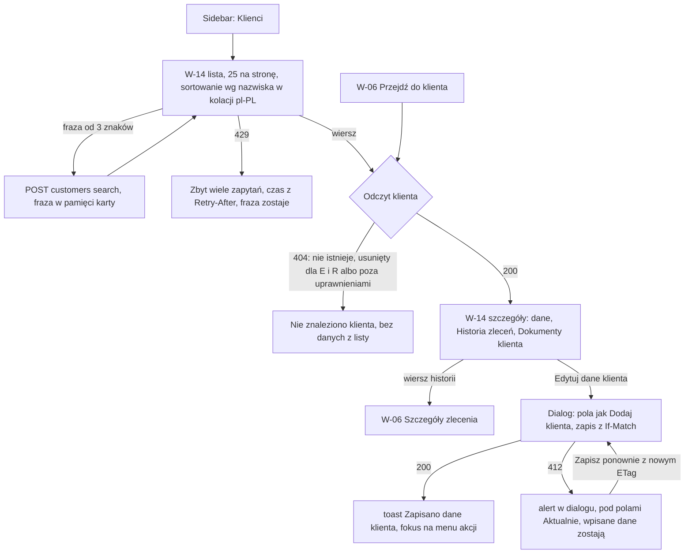

# 13 — Klienci

> Dokument żywy (EVM-071) · przepływ 13 (E2) · kanał: web · ekran: W-14 (lista i szczegóły klienta; dialogi „Edytuj dane klienta” i „Anonimizuj klienta…”, potem [W-04](01-logowanie-mfa.md#w-04-ponowne-uwierzytelnienie)) · indeks: [README.md](README.md)
> Źródła: `domain-model.md` → `Customer` (atrybuty, `sortName`, soft delete tylko bez niezamkniętych zleceń — `409 has_active_dependents`), „Usuwanie danych” (anonimizacja), „Macierz encja × operacja × rola” (`Customer`: odczyt A, E, R; edycja A, E; soft delete i przywrócenie A; anonimizacja A ↑), „Klasyfikacja danych” (DO-K); `api-guidelines.md` (kursor, `POST …/search`); historyjki EVM-039 (lista, szczegóły, edycja, historia zleceń), EVM-041 (usunięcie, przywrócenie, anonimizacja), EVM-050 (dokumenty klienta); polityki P6, P10; SR-API-02, SR-API-04, SR-AUTHZ-02, -03, -05, SR-DATA-02, -08, SR-PRIV-02, -04, SR-SESS-08, SR-LOG-03, SR-WEB-03, -05; konsultacja `security-engineer` w EVM-071 (S2, S3, A1, A2, B3, B5).

## Zasady wspólne przepływu 13
1. **Dane klienta to dane osobowe (DO-K).** Tytuł karty bez nazwiska: „Klienci · EVia Manager”, „Klient · EVia Manager”, „Nie znaleziono · EVia Manager”. W adresie URL tylko identyfikator klienta. Fraza wyszukiwania i filtr „Usunięci” są w pamięci karty — nie w URL, tytule karty ani logach (SR-API-04, SR-WEB-05).
2. **Masowy odczyt** (P10, EVM-039 AC5): lista, wyszukiwanie i szczegóły liczą się do progów. Panel nie pobiera klientów „na zapas” — bez wczytywania kolejnej strony i szczegółów z wyprzedzeniem (np. przy najechaniu na wiersz).
3. **Klienta usuniętego widzi tylko Administrator** (EVM-041 AC1). Edytor i Tylko odczyt dostają `404` — jeden stan „Nie znaleziono klienta”, bez danych z pamięci listy (README → zasada wspólna 2). W widokach zleceń taki klient to „Klient usunięty” bez danych ([README → zasada wspólna 18](README.md#bezpieczeństwo-i-prywatność-w-ui); ustalenie A1).
4. **Klienta zanonimizowanego nie da się edytować** (ustalenie A2): ponowne wpisanie danych byłoby reidentyfikacją. Serwer odrzuca edycję (`409`, kod z planu EVM-041); panel wyłącza „Edytuj dane klienta…” z podpowiedzią.
5. **UI tylko odzwierciedla reguły** — wyłączenie akcji przy niezamkniętych zleceniach, po anonimizacji albo offline to wygoda. Każdą regułę egzekwuje serwer, a wyścig kończy się alertem w miejscu operacji.
6. **Formy bezosobowe** (§ 6.1): „Usunięto klienta.”, „Zanonimizowano klienta.”, „Dane klienta zmieniono w międzyczasie.”

## Przepływ
**Lista, szczegóły i edycja (A, E; R — bez edycji)**


**Usunięcie, przywrócenie i anonimizacja (tylko Administrator)**

```mermaid
flowchart TD
  A["W-14 szczegóły klienta"] -->|"Usuń klienta, bez dialogu"| R1{"Odpowiedź serwera"}
  R1 -->|"409 has_active_dependents"| E1["alert: Klient ma niezamknięte zlecenia"]
  R1 -->|"200"| DEL["toast Usunięto klienta z Cofnij, Banner Klient jest usunięty"]
  F["W-14 lista z filtrem Usunięci"] -->|"wiersz"| DD["Szczegóły: Banner Klient jest usunięty, Przywróć klienta"]
  DEL -->|"Cofnij albo Przywróć klienta"| RES["klient znów widoczny dla wszystkich ról"]
  DD -->|"Przywróć klienta"| RES
  A -->|"Anonimizuj klienta"| AD["AlertDialog: co zostanie zastąpione, co się nie zmieni, pole Rozumiem"]
  DEL -->|"Anonimizuj klienta, bez przywracania"| AD
  DD -->|"Anonimizuj klienta, bez przywracania"| AD
  AD -->|"Anuluj"| A
  AD -->|"Anonimizuj klienta"| R2{"Odpowiedź serwera"}
  R2 -->|"403 step_up_required"| W4{{"W-04 Potwierdź tożsamość, aby zanonimizować klienta"}}
  W4 -->|"klucz dostępu"| R2
  W4 -->|"Anuluj"| NO["dialog wraca z alertem Nie wykonano operacji"]
  R2 -->|"409 has_active_dependents, 412, błąd zapisu w rejestrze usunięć"| E2["alert w dialogu, dane klienta nienaruszone"]
  R2 -->|"200: wpis w rejestrze usunięć, potem anonimizacja"| AN["Klient zanonimizowany, edycja wyłączona"]
```


## W-14 Klienci
- **Cel:** szybko znaleźć klienta (także powracającego), poprawić jego dane kontaktowe i zobaczyć wszystkie jego zlecenia i dokumenty — bez ujawniania danych osobowych w adresie, tytule karty i poza uprawnieniami.
- **Główna akcja:** wybór klienta z listy (cały wiersz jest linkiem). Lista i szczegóły nie mają przycisku primary — klient powstaje przy nowym zleceniu ([W-05](02-nowe-zlecenie-z-szablonu.md#w-05-nowe-zlecenie), EVM-039 → „Poza zakresem”), a akcje klienta są w menu `⋮` nagłówka szczegółów (rozstrzygnięcie 4 w EVM-071).
- **Hierarchia treści:** lista — 1) tytuł „Klienci”, 2) wyszukiwanie (i filtr „Usunięci” — A), 3) tabela, 4) paginacja; szczegóły — 1) nazwa klienta i rodzaj, menu `⋮`, 2) Banner stanu (usunięty, zanonimizowany — gdy dotyczy), 3) „Dane klienta”, 4) „Historia zleceń (n)”, 5) „Dokumenty klienta (n)”.
- **Wejścia:** Sidebar „Klienci”; [W-06](03-szczegoly-zlecenia.md#w-06-szczegóły-zlecenia) — „Przejdź do klienta” w karcie „Klient”; od E13 — odnośnik „klienta” w banerze „Zlecenie założone w terenie”.

### Lista
**Makieta (expanded)**
```text
Klienci
┌───────────────────────────────────────────────────────────────────────────────────────
│ Szukaj klientów
│ [_____________________________________ ‹search›]      {Usunięci}   ← chip tylko A
│ Co najmniej 3 znaki: nazwisko, nazwa firmy, NIP, telefon albo e-mail.
└───────────────────────────────────────────────────────────────────────────────────────
 Klient ▲ (nazwisko i imię / firma)   Rodzaj   Telefon             E-mail
 ───────────────────────────────────────────────────────────────────────────────────────
 Fikcyjny Marek                       Osoba    +48 600 000 003     marek.fikcyjny@example.com
 Firma Testowa sp. z o.o.             Firma    +48 22 000 00 01    biuro@firma.test
 Licznikowy Adam                      Osoba    +48 600 000 004     —
 Ładowarkowa Ewa                      Osoba    +48 600 000 005     ewa.ladowarkowa@example.com
 Przykładowa Lucyna                   Osoba    +48 600 000 006     —
 Przykładowy Jan                      Osoba    +48 600 000 001     jan.przykladowy@example.com
 Testowy Łukasz                       Osoba    +48 600 000 007     lukasz.testowy@example.com
                                                 [‹ Poprzednia strona]   [Następna strona ›]

 Filtr „Usunięci” włączony (Administrator) — ta sama tabela, tylko klienci usunięci:
 Przykładowy Piotr   ‹trash-2› Usunięty    Osoba    +48 600 000 009     —
```

**Kolumny**
| Kolumna | Treść | Uwagi |
|---|---|---|
| Klient | `sortName` — nazwisko przed imieniem („Przykładowy Jan”); firma — nazwa firmy | widoczna kolejność odpowiada sortowaniu; od tej wartości zaczyna się nazwa dostępna wiersza-linku (Dostępność niżej); na `breakpoint.medium` pod nazwą druga linia z e-mailem; w szczegółach i w innych ekranach — `displayName` („Jan Przykładowy”); klient zanonimizowany — „Klient zanonimizowany”; z filtrem „Usunięci” — znacznik „Usunięty” (ikona `trash-2` + etykieta) |
| Rodzaj | „Osoba” / „Firma” | — |
| Telefon | format § 6.3 | zwykły tekst w tabeli (link `tel:` — w szczegółach) |
| E-mail | adres albo „—” | zwykły tekst |

**Wyszukiwanie, sortowanie i paginacja** (EVM-039 AC1)
- **Wyszukiwanie:** pole „Szukaj klientów” wysyła `POST /api/v1/customers/search` z frazą w treści, dopiero od 3 znaków i po krótkiej przerwie w pisaniu. Krótsza fraza nie jest wysyłana — pod polem zostaje podpowiedź „Co najmniej 3 znaki…”. Wyszukiwanie ignoruje polskie znaki i wielkość liter („lodz” → „Łódź”; test „Lodz” → „Łódź” — README M1). Zmiana frazy wraca na pierwszą stronę; „x” w polu czyści frazę i wraca do pełnej listy.
- **Sortowanie:** jedno — wg `sortName` rosnąco w kolacji `pl-PL` (nazwisko przed imieniem, „Ł” po „L”, firmy wg nazwy). W makiecie kolejność kolacji: „Licznikowy” przed „Ładowarkowa”, a ta przed „Przykładowa” (sortowanie po kodach znaków dałoby „Ładowarkowa” na końcu). Nagłówek kolumny „Klient” ma `aria-sort="ascending"`; innych sortowań w M1 nie ma.
- **Paginacja:** kursor, 25 klientów na stronę, „Poprzednia strona” / „Następna strona”, **bez licznika całkowitego** (`api-guidelines.md`). Kursor w treści żądania wyszukiwania (jak W-10).
- **Filtr „Usunięci”** (tylko Administrator; EVM-041 AC3): FilterChip — po włączeniu lista pokazuje wyłącznie klientów usuniętych, wyszukiwanie działa w ich obrębie. Stan filtra jest w pamięci karty. Parametr filtra wysłany przez Edytora albo Tylko odczyt serwer **odrzuca** (kod z planu EVM-041), a nie pomija po cichu (ustalenie B5).

### Szczegóły klienta
**Makieta (klient — osoba; na `breakpoint.expanded` „Dane klienta” to kolumna boczna — 4 kolumny siatki, a Historia i Dokumenty — treść, 8 kolumn, jak W-06)**
```text
Klienci / Jan Przykładowy
 Jan Przykładowy                                              ⋮  ← „Akcje klienta: Jan Przykładowy”
 Osoba

 ┌─ Dane klienta ──────────────────────────────────
 │ Telefon                  +48 600 000 001                ← link tel:
 │ E-mail                   jan.przykladowy@example.com    ← link mailto:
 │ Adres korespondencyjny   —
 │ Notatki                  Kontakt najlepiej po 16:00.
 └─────────────────────────────────────────────────

 ┌─ Historia zleceń (3) ───────────────────────────
 │ Zlecenie                                   Status            Utworzono
 │ ZL-2026-0058 · Garaż — montaż ładowarki    «Nowe»            28.09.2026
 │ ZL-2026-0042 · Garaż — pełny proces        «W realizacji»    01.09.2026
 │ ZL-2026-0017 · Garaż — sama instalacja     «Rozliczone»      15.01.2026
 └─────────────────────────────────────────────────

 ┌─ Dokumenty klienta (1) ─────────────────────────
 │ Rodzaj             Tytuł                       Wersja   Klasa
 │ Umowa z klientem   Umowa — montaż ładowarki    1        ‹lock› Dane identyfikacyjne   [Pobierz]
 │   Tylko odczyt: zamiast [Pobierz] — ‹lock› „Plik dostępny dla administratora i edytora”
 └─────────────────────────────────────────────────

 Firma — w „Dane klienta”: Nazwa firmy · NIP (albo „—”) · Osoba kontaktowa · Telefon · E-mail ·
 Adres korespondencyjny · Notatki.

 Klient usunięty (widzi tylko Administrator) — nad sekcjami:
 ┃‹info› Klient jest usunięty — widzi go tylko administrator.          [Przywróć klienta]

 Klient zanonimizowany — nagłówek „Klient zanonimizowany”, pola „—”:
 ┃‹info› Klient jest zanonimizowany — jego danych nie można już zmienić. Zlecenia,
 ┃ lokalizacje i dokumenty zostały bez zmian.
```

**Menu `⋮` nagłówka — „Akcje klienta: [nazwa]”** (ActionMenu, § 3.20; trzy stany wyzwalacza — [README → zasada wspólna 20](README.md#bezpieczeństwo-i-prywatność-w-ui))
```text
 Administrator, klient aktywny:
 │ Edytuj dane klienta…
 │ ─────────────────────────────
 │ Usuń klienta                     ← grupa niszcząca, color.action.danger.text-subtle
 │ Anonimizuj klienta…
 Edytor, klient aktywny — te same pozycje; „Usuń klienta” i „Anonimizuj klienta…”
 wyłączone z podpowiedzią. Tylko odczyt — bez wyzwalacza `⋮`.
```

| Stan klienta | Administrator | Edytor | Tylko odczyt |
|---|---|---|---|
| aktywny, wszystkie zlecenia zamknięte | wszystkie pozycje aktywne | „Edytuj dane klienta…” aktywne; „Usuń klienta” — wyłączone: „Usunąć klienta może tylko administrator.”; „Anonimizuj klienta…” — wyłączone: „Zanonimizować klienta może tylko administrator.” | bez wyzwalacza (§ 3.20 — rola nie ma żadnej dozwolonej pozycji) |
| aktywny z niezamkniętymi zleceniami | „Usuń klienta” wyłączone: „Klient ma niezamknięte zlecenia (1). Usuniesz go, gdy wszystkie będą rozliczone albo anulowane.”; „Anonimizuj klienta…” wyłączone: „Klient ma niezamknięte zlecenia (1). Zanonimizujesz go, gdy wszystkie będą rozliczone albo anulowane.” (liczba z odpowiedzi serwera — plan EVM-041; licznik w nawiasie jak „Dokumenty klienta (1)” — rzeczownik w liczbie mnogiej bez odmiany, odmiana wg § 6.3 tylko przy liczbie w zdaniu, np. „1 zlecenie”, „3 zlecenia”, „5 zleceń”) | jak wyżej — podpowiedź roli (rola nigdy nie wykona operacji) | jw. |
| zanonimizowany | „Edytuj dane klienta…” wyłączone: „Klient jest zanonimizowany — jego danych nie można już zmienić.”; „Anonimizuj klienta…” wyłączone: „Klient jest już zanonimizowany.”; „Usuń klienta” aktywne | wyzwalacz **wyłączony z podpowiedzią** „Klient jest zanonimizowany — jego danych nie można już zmienić.” (jedyną pozycję dozwoloną roli blokuje stan) | jw. |
| usunięty (lista z filtrem „Usunięci”) | Banner z „Przywróć klienta”; w menu: „Edytuj dane klienta…” wyłączone: „Klient jest usunięty — przywróć go, aby zmienić dane.”; „Anonimizuj klienta…” aktywne (ustalenie A2 — bez przywracania, które znów pokazałoby dane E i R); bez „Usuń klienta” | `404` — „Nie znaleziono klienta” | `404` |
| usunięty i zanonimizowany | Banner „Klient jest usunięty i zanonimizowany — widzi go tylko administrator.” z „Przywróć klienta”; wyzwalacz wyłączony z podpowiedzią „Dane zanonimizowanego klienta są tylko do odczytu.” | `404` | `404` |
| offline (każdy stan) | wyzwalacz wyłączony z podpowiedzią „Zmienisz po powrocie połączenia.” (§ 3.1, § 4.10); „Przywróć klienta” — wyłączony z tą samą podpowiedzią | jw. | bez wyzwalacza |

**Historia zleceń (n)** (EVM-039 AC2; SR-AUTHZ-03)
- Wiersz: numer i tytuł zlecenia, odznaka statusu (§ 3.9, `color.status.order.*`), data utworzenia (§ 6.3). Od najnowszych; cały wiersz to link do W-06 (zwykła autoryzacja zlecenia).
- Lista i licznik „(n)” liczone **tą samą polityką co lista zleceń** (filtr `customerId` w zapytaniu listy `work-orders` — README M1 → „Granice modułów”); zleceń poza uprawnieniami nie ma w wierszach ani w liczniku.
- Paginacja jak lista (25, kursor). Pusty: „Klient nie ma zleceń.” — bez akcji (zlecenie zakłada się w W-05).

**Dokumenty klienta (n)** (EVM-050; P6, SR-AUTHZ-06, -07)
- Wiersz jak w [W-09](06-galeria-i-upload.md#w-09-media-i-dokumenty): rodzaj, tytuł, wersja, klasa poufności tekstem; klasy ograniczone dla roli Tylko odczyt mają ikonę `lock` i tekst „Plik dostępny dla administratora i edytora” zamiast „Pobierz”.
- „Pobierz” — Button tertiary w wierszu, nazwa dostępna z obiektem: „Pobierz: Umowa — montaż ładowarki, wersja 1” (WCAG 2.4.6, 2.5.3). Pobranie z audytem; dokument w stanie innym niż gotowy ma znacznik z § 4.14 zamiast „Pobierz”.
- **Na `breakpoint.compact`** „Pobierz” otwiera AlertDialog (`size.dialog.width.sm`, na telefonie na pełną szerokość): „Pobrać dokument na telefon?” — „Na telefonie nie pobieraj oryginałów ani dokumentów — plik trafi do „Pobrane” i może trafić do kopii w chmurze.” — [Anuluj] (fokus) [Pobierz dokument] (ustalenie A4, decyzja 19). Warunek to szerokość widoku, nie rozpoznanie urządzenia.
- Dokumenty klienta dodaje się w zleceniu: W-09 → „Dodaj dokument” → „Przypisz do: Klienta” (EVM-050 AC1). W-14 nie ma „Dodaj dokument”. Pusty: „Dokumenty klienta (0)” i „Dokumenty klienta dodasz w zleceniu: Media i dokumenty → Dodaj dokument → Przypisz do: Klienta.” (Tylko odczyt — bez drugiego zdania).

### Dialog „Edytuj dane klienta”
Pola jak dialog „Dodaj klienta” w [W-05](02-nowe-zlecenie-z-szablonu.md#w-05-nowe-zlecenie), wypełnione bieżącymi danymi (EVM-039 AC3, walidacja jak przy dodaniu — EVM-020). Bez podpowiedzi „Podobny klient” — dotyczy tylko dodawania.

```text
 Dialog „Edytuj dane klienta” (size.dialog.width.md):
 │ Edytuj dane klienta                                       [x]
 │ Jan Przykładowy
 │ Rodzaj  (•) Osoba  ( ) Firma
 │ Imię [Jan_____________]   Nazwisko [Przykładowy_____________]
 │ (Firma: Nazwa firmy, NIP (opcjonalnie), Osoba kontaktowa)
 │ Telefon [+48 600 000 001]   E-mail (opcjonalnie) [jan.przykladowy@example.com]
 │ ▸ Adres korespondencyjny (opcjonalnie — do dokumentów)
 │ Notatki (opcjonalnie) [Kontakt najlepiej po 16:00.______________]
 │ Nie wpisuj PESEL, numerów dokumentów ani kodów do bram i alarmów.
 │                                      [Anuluj]  [[ Zapisz dane klienta ]]

 Po 412 — nad polami InlineAlert błędu, pod zmienionymi polami „Aktualnie: …”:
 │ ┃‹circle-alert› Dane klienta zmieniono w międzyczasie. Twoje zmiany
 │ ┃ zachowaliśmy — sprawdź aktualne wartości i zapisz ponownie.
 │ Telefon [+48 600 000 008]
 │ Aktualnie: +48 600 000 001                   ← zwykły tekst, text.body-sm
```
- **Zapis:** `PATCH` z `If-Match`; toast „Zapisano dane klienta.”. Pola kontrolowane przez serwer nie są wysyłane (`400` `read_only_field` — EVM-039 AC4).
- **Zmiana rodzaju** (Osoba ↔ Firma): formularz pokazuje pola drugiego rodzaju; pod radiem podpowiedź „Po zmianie rodzaju pola poprzedniego rodzaju nie zostaną zapisane.” (skutek po stronie serwera — plan EVM-039).
- **Konflikt `412`** — [README → zasada wspólna 16](README.md#bezpieczeństwo-i-prywatność-w-ui): wpisane dane zostają, „Aktualnie: …” jako zwykły tekst (SR-WEB-03), zapis ponownie z nowym `ETag`.
- **Zamknięcie z niezapisanymi zmianami** — widok „Odrzucić zmiany?” w tym samym dialogu (README → zasada wspólna 17).
- **Fokus:** po otwarciu — pierwsze pole („Imię”; firma — „Nazwa firmy”); po „Anuluj” i po zamknięciu — wyzwalacz `⋮` „Akcje klienta: …”; po sukcesie — ten sam wyzwalacz, wynik ogłasza toast (`role="status"`); po `412` — alert (`role="alert"`), fokus zostaje w dialogu na pierwszym polu z „Aktualnie: …”.

### Usunięcie i przywrócenie (Administrator)
- **„Usuń klienta”** — bez dialogu: soft delete odwraca ta sama rola bez step-upu, więc obowiązuje § 4.11 (rozstrzygnięcie 4; potwierdzone przez `security-engineer` — oba zdarzenia trafiają do audytu, SR-LOG-03). Toast: „Usunięto klienta. Widzi go tylko administrator. [Cofnij]” (10 s). „Cofnij” = przywrócenie.
- **Po usunięciu** strona zostaje otwarta; nad sekcjami Banner (§ 3.19, `color.feedback.info.*`) „Klient jest usunięty — widzi go tylko administrator.” z Button secondary „Przywróć klienta”. Fokus — na Bannerze (`tabindex="-1"`).
- **„Przywróć klienta”** (z Bannera; wejście z listy z filtrem „Usunięci”): toast „Przywrócono klienta. Widzą go wszystkie role. [Cofnij]”; Banner znika, fokus na nagłówku strony.
- **`409 has_active_dependents`** (wyścig — ktoś otworzył albo przywrócił zlecenie): InlineAlert błędu pod nagłówkiem „Nie usunięto klienta — ma niezamknięte zlecenia (1). Usuniesz go, gdy wszystkie będą rozliczone albo anulowane.” (EVM-041 AC2).
- Klient usunięty nie występuje dla Edytora i Tylko odczyt na liście, w wyszukiwaniu ani po `id` (`404`); w widokach zleceń — „Klient usunięty” ([README → zasada wspólna 18](README.md#bezpieczeństwo-i-prywatność-w-ui)).

### Anonimizacja (Administrator ze step-upem)
```text
 AlertDialog „Anonimizuj klienta…” (size.dialog.width.md, wariant danger):
 │ Zanonimizować klienta „Jan Przykładowy”?                          [x]
 │ Tej operacji nie można cofnąć. Dane klienta zastąpimy wartościami
 │ neutralnymi („Klient zanonimizowany”), a wyszukiwanie przestanie je
 │ znajdować.
 │ Zostaną zastąpione:
 │ · imię i nazwisko (firma: nazwa firmy, NIP, osoba kontaktowa)
 │ · telefon, e-mail, adres korespondencyjny, notatki
 │ Nie zmienią się:
 │ · zlecenia klienta (3) — pokażą „Klient zanonimizowany”
 │ · lokalizacje i strony
 │ · wpisy dziennika, zdjęcia, filmy i dokumenty, w tym Dokumenty klienta (1)
 │ Jeśli żądanie dotyczy też tych danych, usuń je osobno według procedury
 │ obsługi praw osób.
 │ [ ] Rozumiem, że tej operacji nie można cofnąć.
 │                                    [Anuluj]  [Anonimizuj klienta]  ← danger
```
- **Treść** (ustalenie B3): dialog pokazuje **nazwy pól, nie ich wartości**; liczby w nawiasach („zlecenia klienta (3)”, „Dokumenty klienta (1)”) liczone tą samą polityką co listy. Pola z EVM-041 AC4; dane poza zakresem (lokalizacje, strony, wpisy) — procedura ręczna (EVM-041 → „Poza zakresem”, SR-PRIV-02).
- **Potwierdzenie bez przepisywania nazwy** (WCAG 3.3.8) — pole wyboru. „Anonimizuj klienta” nie jest blokowany (§ 4.1); bez zaznaczenia — komunikat pod polem „Potwierdź, że rozumiesz skutek operacji.” (`role="alert"`, fokus na polu).
- **Kolejność:** dialog → „Anonimizuj klienta” → przy `403 step_up_required` [W-04](01-logowanie-mfa.md#w-04-ponowne-uwierzytelnienie) „Potwierdź tożsamość, aby zanonimizować klienta” (dialog anonimizacji chowa się na czas W-04 i wraca z zaznaczonym polem — § 3.13) → operacja wysłana ponownie. O W-04 decyduje serwer (README → zasada wspólna 15).
- **Wynik:** toast „Zanonimizowano klienta.”; strona pokazuje „Klient zanonimizowany” z InlineAlert informacyjnym; fokus na nagłówku strony (wyzwalacz `⋮` może być wyłączony).
- **Błędy w dialogu** (dane dialogu zostają): „Anuluj” w W-04 — „Nie wykonano operacji.” (EVM-041 AC8); `409 has_active_dependents` — „Nie zanonimizowano klienta — ma niezamknięte zlecenia (1). Zanonimizujesz go, gdy wszystkie będą rozliczone albo anulowane.”; `412` — „Dane klienta zmieniono w międzyczasie. Sprawdź aktualne dane i wybierz operację ponownie. [Odśwież dane klienta]”; zapis w rejestrze usunięć nieudany (EVM-041 AC5) — „Nie zanonimizowano klienta. Dane są bez zmian. Spróbuj ponownie za chwilę (kod: 7F3A).”; `429` — wzór z README.
- **Fokus:** po otwarciu — „Anuluj” (§ 4.11); po „Anuluj”, `x` i Esc — wyzwalacz `⋮` „Akcje klienta: …” (§ 3.13); po powrocie z W-04 przez „Anuluj” — dialog wraca z alertem „Nie wykonano operacji.” (`role="alert"`) i fokusem na „Anonimizuj klienta”; po sukcesie — nagłówek strony (wyżej).
- **Klient usunięty** — anonimizacja z Bannera / menu bez przywracania (ustalenie A2). Po anonimizacji klient pozostaje usunięty.
- **Klient zanonimizowany** — „Edytuj dane klienta…” wyłączone z podpowiedzią dla A i E; serwer odrzuca edycję (`409`, kod z planu EVM-041 — ustalenie A2).

### Stany
| Stan | Zachowanie |
|---|---|
| Pusty | Brak klientów: A, E — „Nie masz jeszcze klientów. Dodasz ich przy nowym zleceniu.” (EVM-039 AC8); R — „Nie ma jeszcze klientów.”; brak wyników — „Brak klientów spełniających kryteria.” z „Wyczyść wyszukiwanie”; filtr „Usunięci” bez wyników — „Brak usuniętych klientów.” z „Pokaż wszystkich klientów”; Historia zleceń i Dokumenty klienta — teksty w sekcjach wyżej. |
| Ładowanie | Skeleton wierszy tabeli (§ 3.16); szczegóły — najpierw nagłówek, potem Skeleton kart „Dane klienta”, „Historia zleceń” i „Dokumenty klienta”; pole wyszukiwania pozostaje aktywne; po 10 s „Ładowanie trwa dłużej niż zwykle…”; dialogi — przycisk operacji w stanie ładowania, dialog nie zamyka się do wyniku. |
| Błąd | Lista — EmptyState `circle-alert` „Nie udało się wczytać klientów. [Spróbuj ponownie]”; sekcja szczegółów — alert w sekcji z „Spróbuj ponownie” (pozostałe działają); **`429`** — wyszukiwanie (60 / min — SR-API-02) i masowy odczyt (EVM-039 AC5): „Zbyt wiele zapytań. Spróbuj ponownie za 1 min.” (czas z `Retry-After`), fraza i filtr zostają; `400 invalid_cursor` — pierwsza strona z komunikatem „Lista się zmieniła — wróciliśmy na początek.”; edycja — walidacja pod polami + podsumowanie (§ 4.1), `412` — zasada 16; usunięcie i anonimizacja — sekcje wyżej; błąd serwera — § 6.4. |
| Offline | Banner § 4.10; lista i szczegóły z pamięci karty z banerem „Dane mogą być nieaktualne (z 14:05)”; pole wyszukiwania wyłączone z podpowiedzią „Wyszukasz po powrocie połączenia.”; paginacja i chip „Usunięci” wyłączone z podpowiedzią; wyzwalacz `⋮` i „Przywróć klienta” — wyłączone z podpowiedzią „Zmienisz po powrocie połączenia.”; otwarty dialog — dane zostają w pamięci karty, przycisk operacji wyłączony. |
| Brak uprawnień | **`404`** — jeden stan (§ 4.13, `search-x`): „Nie znaleziono klienta. Mógł zostać usunięty albo nie masz do niego dostępu. [Wróć do listy klientów]” — bez danych z pamięci listy (ustalenie B5, CWE-204); tytuł karty „Nie znaleziono · EVia Manager”. Tylko odczyt — lista i szczegóły bez wyzwalacza `⋮`, dokumenty ograniczone z `lock`. Edytor — akcje Administratora wyłączone z podpowiedzią. Niezalogowany — `401` → W-01. |

### Role
| Akcja | Operacja | A | E | R |
|---|---|---|---|---|
| Lista, wyszukiwanie, szczegóły | odczyt `Customer` (`GET` lista bez danych osobowych w parametrach, `POST /api/v1/customers/search` z frazą; `channels: [web]`) | tak | tak | tak |
| Filtr „Usunięci” | lista klientów usuniętych (EVM-041) | tak | ukryty; parametr odrzucany przez serwer (B5) | ukryty; jw. |
| Historia zleceń | lista `WorkOrder` z filtrem `customerId` — ta sama polityka co W-10 (SR-AUTHZ-03) | tak | tak | tak |
| Edytuj dane klienta | edycja `Customer` (`PATCH`, `If-Match`; klient zanonimizowany — `409`) | tak | tak | ukryte (`403`) |
| Usuń klienta | soft delete `Customer` — tylko bez niezamkniętych zleceń (`409 has_active_dependents`) | tak | wyłączone (`403`) | ukryte (`403`) |
| Przywróć klienta | przywrócenie `Customer` | tak | — (`404`) | — (`404`) |
| Anonimizuj klienta… | anonimizacja `Customer` — `stepUp: true`, `channels: [web]`; wpis do rejestru usunięć przed zmianą (SR-PRIV-04); audyt bez wartości (SR-LOG-03) | tak ↑ | wyłączone (`403`) | ukryte (`403`) |
| Pobierz dokument klienta `standard` | pobranie pliku `Document` (kotwica `customerId`, audyt) | tak | tak | tak |
| Pobierz dokument `building_security` / `identity_data` | jw. | tak | tak | nie — `lock` (`403`) |

- **Responsywność:** `breakpoint.wide` / `breakpoint.expanded` — lista: tabela z 4 kolumnami; szczegóły: treść 8 kolumn siatki (Historia, Dokumenty) + kolumna boczna 4 („Dane klienta”), jak W-06; `breakpoint.medium` — Sidebar zwinięty, lista bez kolumny „E-mail” — adres jako druga linia pod nazwą w kolumnie „Klient” (`text.body-sm`, `color.text.secondary`, jak lokalizacja w W-10; bez adresu — bez drugiej linii), szczegóły w jednej kolumnie: „Dane klienta”, „Historia zleceń”, „Dokumenty klienta”; `breakpoint.compact` — lista kart (§ 3.6, § 3.8) z tymi samymi danymi co tabela: nazwa (`sortName`) ze znacznikiem „Usunięty” (filtr „Usunięci”), rodzaj, telefon, e-mail (gdy jest); cała karta to link z tą samą nazwą dostępną co wiersz tabeli (Dostępność niżej); wyszukiwanie na pełną szerokość, chip „Usunięci” pod nim; szczegóły jedna pod drugą, Historia i Dokumenty jako listy kart; menu `⋮` jako BottomSheet (§ 3.20); dialogi na pełną szerokość z przyciskami na dole; pobranie dokumentu — AlertDialog z ostrzeżeniem (A4).
- **Komponenty i tokeny:** Breadcrumbs (§ 3.17) w szczegółach; nagłówek strony `text.heading-1`, rodzaj `text.body-sm` `color.text.secondary`; SearchField (§ 3.7) z etykietą `text.label` i podpowiedzią `color.text.tertiary`; FilterChip (§ 3.7) „Usunięci” — `size.control.height.web.sm`, `radius.pill`, wybrany `color.bg.selected` + `color.border.selected` + `check`; DataTable (§ 3.6) — nagłówek `color.bg.surface-subtle` + `text.label`, przyklejony (`elevation.sticky`, `layer.sticky`), wiersz `size.control.height.web.lg`, `text.body-sm`, daty `text.numeric`, `aria-sort`; znacznik „Usunięty” — ikona `trash-2` `size.icon.sm` `color.icon.secondary` + etykieta `text.label` `color.text.secondary` (nie StatusBadge — to nie status z modelu); Card (§ 3.8) „Dane klienta” — `space.inset.lg`, `radius.card`, `color.border.default`, tytuł `text.heading-3`; linki `tel:` i `mailto:` `color.text.link`; StatusBadge (§ 3.9) `color.status.order.*` w Historii; klasa poufności tekstem + `lock` (§ 4.13); znaczniki § 4.14 przy dokumentach niegotowych; ActionMenu (§ 3.20) — grupa niszcząca `color.action.danger.text-subtle`, wyzwalacz IconButton `ellipsis-vertical`; Banner / InlineAlert (§ 3.19) `color.feedback.info.*` (usunięty, zanonimizowany), `color.feedback.error.*` (`409`, `412`, `429`); Dialog (§ 3.13) `size.dialog.width.md` (edycja), AlertDialog `size.dialog.width.md` (anonimizacja, wariant danger) i `size.dialog.width.sm` (pobranie na compact); TextField, radio, Checkbox, Disclosure (§ 3.2, § 3.4, § 3.21) jak W-05; Button primary / secondary / tertiary / danger (§ 3.1); Toast (§ 3.14) z „Cofnij”; EmptyState (§ 3.15) z `search-x`, `circle-alert`; Skeleton (§ 3.16); Banner offline (§ 4.10); W-04 (§ 3.13); odstępy `space.stack.md`, `space.inline.md`.
- **Mikrocopy:** „Klienci” · „Szukaj klientów” · „Co najmniej 3 znaki: nazwisko, nazwa firmy, NIP, telefon albo e-mail.” · „Usunięci” · „Usunięty” · „Klient (nazwisko i imię / firma)” · „Rodzaj” · „Osoba” / „Firma” · „Telefon” · „E-mail” · „Poprzednia strona” / „Następna strona” · „Dane klienta” · „Adres korespondencyjny” · „Notatki” · „Historia zleceń (3)” · „Utworzono” · „Klient nie ma zleceń.” · „Dokumenty klienta (1)” · „Pobierz” · „Plik dostępny dla administratora i edytora” · „Pobrać dokument na telefon?” · „Na telefonie nie pobieraj oryginałów ani dokumentów — plik trafi do „Pobrane” i może trafić do kopii w chmurze.” · „Pobierz dokument” · „Edytuj dane klienta…” · „Zapisz dane klienta” · „Po zmianie rodzaju pola poprzedniego rodzaju nie zostaną zapisane.” · „Zapisano dane klienta.” · „Dane klienta zmieniono w międzyczasie. Twoje zmiany zachowaliśmy — sprawdź aktualne wartości i zapisz ponownie.” · „Aktualnie: …” · „Usuń klienta” · „Usunięto klienta. Widzi go tylko administrator.” · „Cofnij” · „Klient jest usunięty — widzi go tylko administrator.” · „Przywróć klienta” · „Przywrócono klienta. Widzą go wszystkie role.” · „Anonimizuj klienta…” · „Zanonimizować klienta „Jan Przykładowy”?” · „Tej operacji nie można cofnąć.” · „Zostaną zastąpione:” · „Nie zmienią się:” · „Rozumiem, że tej operacji nie można cofnąć.” · „Potwierdź, że rozumiesz skutek operacji.” · „Anonimizuj klienta” · „Zanonimizowano klienta.” · „Klient zanonimizowany” · „Klient jest zanonimizowany — jego danych nie można już zmienić.” · „Nie wykonano operacji.” · „Klient ma niezamknięte zlecenia (1). Usuniesz go, gdy wszystkie będą rozliczone albo anulowane.” · „Klient ma niezamknięte zlecenia (1). Zanonimizujesz go, gdy wszystkie będą rozliczone albo anulowane.” · „Usunąć klienta może tylko administrator.” · „Zanonimizować klienta może tylko administrator.” · „Nie masz jeszcze klientów. Dodasz ich przy nowym zleceniu.” · „Brak klientów spełniających kryteria.” · „Brak usuniętych klientów.” · „Nie znaleziono klienta. Mógł zostać usunięty albo nie masz do niego dostępu.” · „Wróć do listy klientów” · „Wyszukasz po powrocie połączenia.” · „Zmienisz po powrocie połączenia.”
- **Dostępność:** tytuły kart wyżej (bez nazwiska i frazy); tabela z `caption` „Klienci”; wiersz tabeli i karta na compact jako link z nazwą dostępną **zaczynającą się od widocznej nazwy klienta (`sortName`)**, potem pozostałe dane w kolejności kolumn — jedna nazwa na wszystkich breakpointach (WCAG 2.5.3; sterowanie głosem: „kliknij Przykładowy Jan”): „Przykładowy Jan, osoba, telefon +48 600 000 001, e-mail jan.przykladowy@example.com”; bez e-maila — bez ostatniego członu („Licznikowy Adam, osoba, telefon +48 600 000 004”); firma — „Firma Testowa sp. z o.o., firma, telefon +48 22 000 00 01, e-mail biuro@firma.test”; z filtrem „Usunięci” znacznik zaraz po nazwie, jak na ekranie — „Przykładowy Piotr, usunięty, osoba, telefon +48 600 000 009”; klient zanonimizowany — „Klient zanonimizowany, osoba” (puste pola „—” pomijane); `displayName` („Jan Przykładowy”) tylko w szczegółach i innych ekranach; pole wyszukiwania z widoczną etykietą i podpowiedzią w `aria-describedby`, przycisk `x` w polu z nazwą „Wyczyść frazę” (inną niż „Wyczyść wyszukiwanie” w pustym stanie); wczytanie wyników ogłaszane `aria-live="polite"` („Wczytano wyniki wyszukiwania.”, bez liczby całkowitej); chip „Usunięci” jako przełącznik (`aria-pressed`); zmiana strony — fokus na nagłówku tabeli i ogłoszenie „Wczytano następną stronę klientów.”; nagłówek szczegółów h1, sekcje h2; wyzwalacz `⋮` z nazwą „Akcje klienta: Jan Przykładowy”; pozycje wyłączone z `aria-disabled` i podpowiedzią osiągalną klawiaturą; „Pobierz” z nazwą z obiektem; tabela Historii z `caption` „Historia zleceń klienta”, wiersz-link „ZL-2026-0042, Garaż — pełny proces, W realizacji, utworzono 01.09.2026”; ikony znaczników dekoracyjne (`aria-hidden`), informację niesie etykieta; AlertDialog anonimizacji — `role="alertdialog"`, fokus na „Anuluj” (§ 4.11), pole wyboru z etykietą, błąd w `role="alert"`; po „Anuluj” fokus wraca na wyzwalacz `⋮` „Akcje klienta: …” (§ 3.13), a po powrocie z W-04 przez „Anuluj” — alert „Nie wykonano operacji.” (`role="alert"`) w dialogu i fokus na „Anonimizuj klienta”; Banner usuniętego klienta jako region z nazwą „Stan klienta”; toasty `role="status"`; telefon i e-mail jako linki `tel:` i `mailto:` — tekstem linku jest sam numer albo adres, a nazwa dostępna zaczyna się od tego widocznego tekstu (WCAG 2.5.3): „+48 600 000 001 — zadzwoń”, „jan.przykladowy@example.com — napisz e-mail”.
