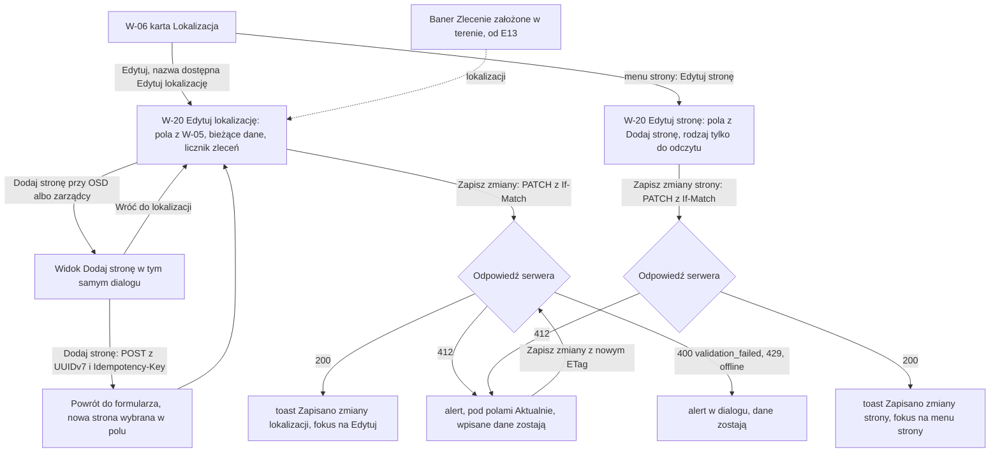

# 14 — Edycja lokalizacji i strony

> Dokument żywy (EVM-071) · przepływ 14 (E3) · kanał: web · ekran: W-20 — dialogi „Edytuj lokalizację” (z widokiem „Dodaj stronę”) i „Edytuj stronę”, otwierane z karty „Lokalizacja” w [W-06](03-szczegoly-zlecenia.md#w-06-szczegóły-zlecenia) · indeks: [README.md](README.md)
> Źródła: `domain-model.md` → `Site` (pola, typ strony w `…PartyId` walidowany w aplikacji), `Party` (rodzaje i formy), „Macierz encja × operacja × rola” (`Site`, `Party`: odczyt A, E, R; utworzenie i edycja A, E), „Klasyfikacja danych” (`Site` DO-K z PPE, `Party` DO-3); pola i dialog „Dodaj stronę” — [W-05](02-nowe-zlecenie-z-szablonu.md#w-05-nowe-zlecenie); README M1 → „Kontrakt API” (tworzenie: UUIDv7 + `Idempotency-Key`, edycja: `If-Match`); historyjka EVM-036 (AC1–AC4, AC7, AC8); SR-AUTHZ-03, -04, -05, -08, SR-INPUT-02, SR-DATA-02, SR-API-05, -07, SR-WEB-03; konsultacja `security-engineer` w EVM-071 (S4, B6).

## Zasady wspólne przepływu 14
1. **Lokalizacja i strona są wspólne.** Lokalizacja bywa wspólna dla zleceń różnych klientów (scenariusz D4′), a strona (OSD, zarządca) — dla wielu lokalizacji. Dialog zawsze mówi, czego dotyczy zmiana, i pokazuje tylko licznik — bez listy innych zleceń, klientów ani lokalizacji (SR-AUTHZ-08; ustalenie B6).
2. **Licznik „(n)”** liczony tą samą polityką co lista zleceń — filtr `siteId` w zapytaniu listy `work-orders` (SR-AUTHZ-03, README M1 → „Granice modułów”). Gdy licznik się nie wczyta, zdanie zostaje bez liczby.
3. **Lokalizacja i strona nie są danymi zlecenia.** Edycja działa także w zleceniu „Rozliczone” albo „Anulowane” — decyzja 17 obejmuje dane zlecenia, zakres, procesy i płatności, a `Site` i `Party` to osobne encje, z których korzystają też inne zlecenia.
4. **Rodzaj strony waliduje serwer** — pole OSD przyjmuje tylko stronę rodzaju OSD, a „Zarządca / administracja” — rodzaje Administracja, Zarządca, Wspólnota / spółdzielnia (EVM-036 AC2, SR-INPUT-02). Comboboxy pokazują tylko pasujące rodzaje; strona innego rodzaju z żądania spoza UI → `400 validation_failed`.
5. **Notatki** lokalizacji i strony — zwykły tekst z podpowiedzią „Nie wpisuj PESEL…”; `Site.notes` trafia na telefony techników (README → zasada wspólna 8).
6. **Konflikt `412`** — [README → zasada wspólna 16](README.md#bezpieczeństwo-i-prywatność-w-ui); dane wpisane w dialogu zostają w pamięci karty.
7. **Tylko odczyt** widzi dane lokalizacji i stron w karcie W-06, ale nie widzi „Edytuj”, wyzwalaczy `⋮` stron ani dialogów (`403` przy żądaniu spoza UI).

## Przepływ


## W-20 Edycja lokalizacji i strony
- **Cel:** uzupełnić i poprawić dane lokalizacji (PPE, moc, zarządca, OSD, poziom garażu) i stron, gdy biuro je pozna — z jasną informacją, że zmiana dotyczy wszystkich zleceń w tej lokalizacji albo wszystkich miejsc, gdzie występuje strona (EVM-036).
- **Główna akcja:** „Zapisz zmiany” (lokalizacja), „Zapisz zmiany strony” (strona), „Dodaj stronę” (widok w dialogu lokalizacji) — jedna akcja primary w każdym widoku.
- **Hierarchia treści:** dialog lokalizacji — 1) tytuł i adres lokalizacji, 2) InlineAlert z licznikiem zleceń, 3) pola sekcji „2. Lokalizacja” z W-05, 4) akcje; dialog strony — 1) tytuł, nazwa i rodzaj strony, 2) InlineAlert o stronie wspólnej, 3) pola „Dodaj stronę”, 4) akcje.
- **Wejścia:** W-06 → karta „Lokalizacja” → „Edytuj” (nazwa dostępna „Edytuj lokalizację”); menu `⋮` przy OSD i zarządcy w tej karcie → „Edytuj stronę…”; **od E13 (M2)** — odnośnik „lokalizacji” w banerze „Zlecenie założone w terenie” (EVM-036 → „Poza zakresem”; makieta odnośnika — [W-06](03-szczegoly-zlecenia.md#w-06-szczegóły-zlecenia)).

### Dialog „Edytuj lokalizację”
**Makieta (`size.dialog.width.md`)**
```text
 │ Edytuj lokalizację                                                  [x]
 │ ul. Testowa 7, 00-001 Warszawa · miejsce nr 15, poziom −1
 │ ┃‹info› Zmiana dotyczy wszystkich zleceń w tej lokalizacji (2).
 │
 │ Typ obiektu [Garaż w budynku wielorodzinnym ▾]
 │ Ulica [ul. Testowa__________]   Nr budynku [7__]   Nr lokalu (opcjonalnie) [__]
 │ Kod pocztowy [00-001]   Miasto [Warszawa______]
 │ Nr miejsca postojowego [15_]   Poziom [−1_]
 │ OSD [Stoen Operator ▾]                                       [+ Dodaj stronę]
 │ Zarządca / administracja (opcjonalnie)
 │ [Wspólnota Mieszkaniowa „Zielony Dziedziniec” ▾]             [+ Dodaj stronę]
 │ Moc przyłączeniowa (opcjonalnie) [40__] kW
 │ PPE (opcjonalnie) [PL-TEST-0001____]
 │ Notatki do lokalizacji (opcjonalnie)
 │ [Wjazd od ul. Fikcyjnej, klucz u administratora.________________]
 │ Nie wpisuj PESEL, numerów dokumentów ani kodów do bram i alarmów.
 │ Notatki zobaczą technicy w aplikacji.
 │                                            [Anuluj]  [[ Zapisz zmiany ]]

 Widok „Dodaj stronę” — w tym samym dialogu, zamiast formularza lokalizacji:
 │ Edytuj lokalizację › Dodaj stronę                                   [x]
 │ Rodzaj strony [OSD ▾]          ← z pola, z którego otwarto; przy zarządcy:
 │                                  Administracja / Zarządca / Wspólnota / spółdzielnia
 │ Forma  (•) Firma lub instytucja  ( ) Osoba fizyczna
 │ Nazwa [__________________________]
 │ Osoba kontaktowa (opcjonalnie) [__________]
 │ Telefon (opcjonalnie) [__________]   E-mail (opcjonalnie) [__________]
 │ Notatki (opcjonalnie) [__________________________]
 │ Nie wpisuj PESEL, numerów dokumentów ani kodów do bram i alarmów.
 │                                [Wróć do lokalizacji]  [[ Dodaj stronę ]]

 Po 412 — nad polami InlineAlert błędu, pod zmienionymi polami „Aktualnie: …”:
 │ ┃‹circle-alert› Lokalizację zmieniono w międzyczasie. Twoje zmiany
 │ ┃ zachowaliśmy — sprawdź aktualne wartości i zapisz ponownie.
 │ PPE (opcjonalnie) [PL-TEST-0001____]
 │ Aktualnie: PL-TEST-0002                          ← zwykły tekst, text.body-sm
```

**Pola** — jak sekcja „2. Lokalizacja” w [W-05](02-nowe-zlecenie-z-szablonu.md#w-05-nowe-zlecenie), wypełnione bieżącymi danymi; wymagalność pól jak w W-05 (plan EVM-021). Wybór „Istniejąca / Nowa lokalizacja” z W-05 nie występuje — dialog edytuje jedną, istniejącą lokalizację.

| Pole | Kontrolka | Uwagi |
|---|---|---|
| Typ obiektu | Select (§ 3.3) | etykiety `SiteType` (`service-catalog.md` § 7) |
| Ulica, Nr budynku, Nr lokalu (opcjonalnie), Kod pocztowy, Miasto | TextField (§ 3.2) | kod pocztowy wg § 6.3 |
| Nr miejsca postojowego, Poziom | TextField | poziom z minusem typograficznym („−1”) |
| OSD | Combobox stron (§ 3.3) — tylko rodzaj OSD; w stanie „brak wyników” i obok pola — „Dodaj stronę” | serwer waliduje rodzaj (zasada 4) |
| Zarządca / administracja (opcjonalnie) | Combobox stron — rodzaje Administracja, Zarządca, Wspólnota / spółdzielnia; „Dodaj stronę” | jw. |
| Moc przyłączeniowa (opcjonalnie) | TextField liczba z sufiksem „kW” (`text.numeric`) | wartość techniczna |
| PPE (opcjonalnie) | TextField (`text.mono`) | rozwinięcie skrótu w podpowiedzi (§ 6.2); PPE nie trafia na telefon |
| Notatki do lokalizacji (opcjonalnie) | TextArea (§ 3.2) | podpowiedź „Nie wpisuj PESEL…” + „Notatki zobaczą technicy w aplikacji.” (SR-DATA-02) |

**Licznik zleceń** (EVM-036 AC1; ustalenie S4)
- InlineAlert (§ 3.19, `color.feedback.info.*`) nad polami: „Zmiana dotyczy wszystkich zleceń w tej lokalizacji (2).” — **zawsze widoczny, także przy n = 1** (krok A1″ ze [scenariuszy](scenariusze-a-d.md), EVM-071 AC2): biuro nie musi pamiętać, czy lokalizacja jest wspólna.
- Licznik — zasada wspólna 2. Liczba w nawiasie, więc zdanie nie zależy od odmiany liczebnika.

**„Dodaj stronę” — widok w tym samym dialogu** (rozstrzygnięcie 5; § 3.13 — bez dialogu na dialogu)
- „Dodaj stronę” przy polu OSD albo „Zarządca / administracja” (także w stanie „brak wyników” comboboxu) zastępuje formularz lokalizacji widokiem „Edytuj lokalizację › Dodaj stronę”. Formularz lokalizacji z wpisanymi danymi czeka w pamięci karty.
- Pola jak dialog „Dodaj stronę” w W-05; „Rodzaj strony” ustawiony wg pola, z którego otwarto widok (OSD — tylko OSD; zarządca — trzy rodzaje do wyboru).
- **„Dodaj stronę”** (primary) zapisuje stronę osobnym żądaniem — `POST` z identyfikatorem UUIDv7 nadanym przez panel i `Idempotency-Key` (README M1 → „Kontrakt API”; tylko wstawianie — SR-API-05). Po sukcesie widok wraca do formularza lokalizacji, nowa strona jest wybrana w polu, z którego otwarto widok, a komunikat w `role="status"` mówi: „Dodano stronę „Stoen Operator”. Zapisz zmiany lokalizacji, aby ją przypisać.”
- **„Wróć do lokalizacji”** (secondary) wraca bez zapisu strony; Esc w tym widoku działa jak „Wróć do lokalizacji”, a `x` zamyka cały dialog (z pytaniem o niezapisane zmiany — README → zasada wspólna 17).
- Strona dodana, a potem „Anuluj” w formularzu lokalizacji: strona zostaje w systemie (można ją wybrać później), lokalizacja się nie zmienia.
- Błąd zapisu strony — alert w widoku „Dodaj stronę”, dane zostają; ponowienie z tym samym `Idempotency-Key` nie tworzy drugiej strony.

**Zapis lokalizacji**
- „Zapisz zmiany” — `PATCH` z `If-Match`; toast „Zapisano zmiany lokalizacji.”; dialog się zamyka, fokus wraca do „Edytuj” w karcie „Lokalizacja” (EVM-036 AC1). Technicy zobaczą zmianę w aplikacji po synchronizacji (projekcja M-03, od M2).
- `412` — zasada wspólna 16: InlineAlert „Lokalizację zmieniono w międzyczasie. Twoje zmiany zachowaliśmy — sprawdź aktualne wartości i zapisz ponownie.”, pod zmienionymi polami „Aktualnie: …” (zwykły tekst — SR-WEB-03; tylko wartości, które użytkownik i tak widzi w karcie — S4); ponowny zapis z nowym `ETag`.
- Walidacja — komunikaty pod polami i podsumowanie błędów na górze (§ 4.1): „Podaj adres lokalizacji.”, „Wybierz OSD z listy albo dodaj nową stronę.”; `400 validation_failed` z rodzajem strony (żądanie spoza UI) — „Wybrana strona ma inny rodzaj. Wybierz stronę z listy.”

**Fokus** (lista nazw dostępnych i fokusu — rozstrzygnięcie 13)
| Moment | Fokus |
|---|---|
| otwarcie dialogu | pierwsze pole — „Typ obiektu” (InlineAlert z licznikiem jest wcześniej w kolejności czytania i w `aria-describedby` dialogu) |
| „Dodaj stronę” | pierwsze pole widoku — „Rodzaj strony” (przy OSD — „Forma”, bo rodzaj jest jeden) |
| „Wróć do lokalizacji” | przycisk „Dodaj stronę” przy polu, z którego otwarto widok |
| sukces „Dodaj stronę” | combobox z nowo wybraną stroną |
| „Anuluj” / `x` | „Edytuj” w karcie „Lokalizacja” |
| sukces „Zapisz zmiany” | „Edytuj” w karcie „Lokalizacja”; wynik ogłasza toast |
| `412`, błąd zapisu | alert (`role="alert"`), potem pierwsze pole z „Aktualnie: …” |

### Dialog „Edytuj stronę”
**Makieta (`size.dialog.width.md`)**
```text
 │ Edytuj stronę                                                       [x]
 │ Stoen Operator · OSD
 │ ┃‹info› Strona jest wspólna — zmiana będzie widoczna we wszystkich
 │ ┃ lokalizacjach i zleceniach z tą stroną.
 │
 │ Rodzaj strony   OSD                          ← tylko do odczytu
 │ Rodzaju strony nie można zmienić — od niego zależy, gdzie można ją wybrać.
 │ Forma  (•) Firma lub instytucja  ( ) Osoba fizyczna
 │ Nazwa [Stoen Operator______________]
 │ Osoba kontaktowa (opcjonalnie) [__________]
 │ Telefon (opcjonalnie) [+48 22 000 00 02]   E-mail (opcjonalnie) [przylacza@osd.test]
 │ Notatki (opcjonalnie) [Wnioski tylko przez portal OSD._______________]
 │ Nie wpisuj PESEL, numerów dokumentów ani kodów do bram i alarmów.
 │                                    [Anuluj]  [[ Zapisz zmiany strony ]]
```
- **Wejście:** menu `⋮` przy OSD i przy zarządcy w karcie „Lokalizacja” (nazwa wyzwalacza „Akcje strony: Stoen Operator (OSD)”) → „Edytuj stronę…”. Menu ma jedną pozycję; Tylko odczyt nie widzi wyzwalacza (§ 3.20).
- **Pola** jak „Dodaj stronę” z W-05. **Rodzaj strony tylko do odczytu** — pola `…PartyId` lokalizacji walidują rodzaj (EVM-036 AC2), więc jego zmiana unieważniłaby przypisania (rozstrzygnięcie 5).
- **InlineAlert** o stronie wspólnej (EVM-036 AC3) — bez listy i bez nazw lokalizacji ani klientów, w których strona występuje (B6, SR-AUTHZ-08).
- **Zapis:** `PATCH` z `If-Match`; toast „Zapisano zmiany strony.”; `412` — „Stronę zmieniono w międzyczasie. Twoje zmiany zachowaliśmy — sprawdź aktualne wartości i zapisz ponownie.” (zasada wspólna 16).
- **Fokus:** otwarcie — „Forma” (pierwsze pole edytowalne); „Anuluj” / `x` / sukces — wyzwalacz `⋮` „Akcje strony: …”.

### Stany
| Stan | Zachowanie |
|---|---|
| Pusty | nd. dla dialogów — zawsze edytują istniejący obiekt, pola wypełnione bieżącymi danymi (puste pola opcjonalne pokazują placeholder z przykładem formatu); combobox stron bez wyników — „Brak stron dla „…”. [Dodaj stronę]” (§ 3.3). |
| Ładowanie | Otwarcie dialogu — Skeleton pól (§ 3.16) do wczytania bieżącej wersji i `ETag`; licznik — Skeleton tekstu w InlineAlert; opcje comboboxu — Skeleton 3 wierszy; zapis — „Zapisz zmiany” / „Dodaj stronę” w stanie ładowania, dialog nie zamyka się do wyniku. |
| Błąd | Nie wczytano danych do dialogu — alert w dialogu „Nie udało się wczytać lokalizacji. [Spróbuj ponownie]” (pola niedostępne); licznik nie wczytany — zdanie bez liczby; `412` — zasada wspólna 16; walidacja — pod polami + podsumowanie; `429` — „Zbyt wiele zapytań. Spróbuj ponownie za 1 min.” (czas z `Retry-After`), dane zostają; błąd serwera — § 6.4 („Nie udało się zapisać zmian lokalizacji. Spróbuj ponownie…”). |
| Offline | Baner § 4.10; „Edytuj” w karcie „Lokalizacja” i wyzwalacze `⋮` stron wyłączone z podpowiedzią „Zmienisz po powrocie połączenia.” (EVM-036 AC8); otwarty dialog — dane zostają w pamięci karty, „Zapisz zmiany” i „Dodaj stronę” wyłączone z podpowiedzią „Zapiszesz po powrocie połączenia.”, comboboxy — „Wyszukiwanie wymaga połączenia.” |
| Brak uprawnień | Tylko odczyt — „Edytuj” i wyzwalacze `⋮` stron ukryte; dane lokalizacji i stron widoczne w karcie W-06 (notatki jako zwykły tekst — SR-WEB-03); żądanie zmiany — `403`. Lokalizacja albo strona usunięta w międzyczasie — `404`: alert w dialogu „Nie znaleziono lokalizacji. Mogła zostać usunięta. [Odśwież zlecenie]”, bez danych. Niezalogowany — `401` → W-01. |

### Role
| Akcja | Operacja | A | E | R |
|---|---|---|---|---|
| Edytuj lokalizację | edycja `Site` (`PATCH`, `If-Match`; pola kontrolowane przez serwer — `400` `read_only_field`) | tak | tak | ukryte (`403`) |
| Zmień OSD / zarządcę | `distributionSystemOperatorPartyId`, `managerPartyId` — rodzaj strony walidowany na serwerze (`400 validation_failed`) | tak | tak | ukryte |
| Dodaj stronę (widok w W-20) | utworzenie `Party` (`POST`, UUIDv7 + `Idempotency-Key`, tylko wstawianie) | tak | tak | ukryte |
| Edytuj stronę | edycja `Party` (`PATCH`, `If-Match`); rodzaj tylko do odczytu | tak | tak | ukryte (`403`) |
| Licznik „(n)” | odczyt listy `WorkOrder` z filtrem `siteId` — ta sama polityka co W-10 (SR-AUTHZ-03) | tak | tak | — (R nie otwiera dialogu) |
| Zlecenie „Rozliczone” / „Anulowane” | edycja lokalizacji i strony bez zmian (zasada 3) | tak | tak | — |

- **Responsywność:** `breakpoint.expanded` i `breakpoint.wide` — dialog `size.dialog.width.md`, pola adresu po dwa–trzy w wierszu jak w W-05; `breakpoint.medium` — ten sam dialog, pola adresu po dwa; `breakpoint.compact` — dialog pełnoekranowy (§ 3.13), pola jedno pod drugim, „Dodaj stronę” pod polem, przyciski na dole na pełną szerokość (akcja główna na dole), comboboxy jako arkusz dolny (§ 3.3).
- **Komponenty i tokeny:** Dialog (§ 3.13) `size.dialog.width.md`, `radius.dialog`, `elevation.dialog`, `layer.dialog`, scrim `color.bg.scrim`, tytuł `text.heading-3`, podtytuł (adres, nazwa strony) `text.body-sm` `color.text.secondary`, padding `space.inset.lg`; InlineAlert (§ 3.19) `color.feedback.info.*` (licznik, strona wspólna), `color.feedback.error.*` (`412`, błędy); TextField, TextArea (§ 3.2) — PPE `text.mono`, moc `text.numeric` z sufiksem „kW”; Select i Combobox (§ 3.3) z akcją „Dodaj stronę” w stanie „brak wyników”; radio (§ 3.4) w `fieldset` z legendą „Forma”; Button primary / secondary / tertiary (§ 3.1) — „Dodaj stronę” przy polu jako tertiary z ikoną `plus`; „Aktualnie: …” `text.body-sm` `color.text.secondary`; podpowiedzi `color.text.tertiary`; ActionMenu (§ 3.20) — wyzwalacz `⋮` przy stronie; Toast (§ 3.14); Skeleton (§ 3.16); Banner offline (§ 4.10); odstępy `space.stack.md` (pola), `space.stack.lg` (grupy), `space.inline.md`.
- **Mikrocopy:** „Edytuj lokalizację” · „Zmiana dotyczy wszystkich zleceń w tej lokalizacji (2).” · „Zmiana dotyczy wszystkich zleceń w tej lokalizacji.” (bez licznika) · etykiety pól jak W-05 · „Nie wpisuj PESEL, numerów dokumentów ani kodów do bram i alarmów. Notatki zobaczą technicy w aplikacji.” · „Dodaj stronę” · „Edytuj lokalizację › Dodaj stronę” · „Wróć do lokalizacji” · „Dodano stronę „Stoen Operator”. Zapisz zmiany lokalizacji, aby ją przypisać.” · „Zapisz zmiany” · „Zapisano zmiany lokalizacji.” · „Lokalizację zmieniono w międzyczasie. Twoje zmiany zachowaliśmy — sprawdź aktualne wartości i zapisz ponownie.” · „Aktualnie: …” · „Wybierz OSD z listy albo dodaj nową stronę.” · „Wybrana strona ma inny rodzaj. Wybierz stronę z listy.” · „Edytuj stronę…” · „Edytuj stronę” · „Strona jest wspólna — zmiana będzie widoczna we wszystkich lokalizacjach i zleceniach z tą stroną.” · „Rodzaju strony nie można zmienić — od niego zależy, gdzie można ją wybrać.” · „Zapisz zmiany strony” · „Zapisano zmiany strony.” · „Stronę zmieniono w międzyczasie. Twoje zmiany zachowaliśmy — sprawdź aktualne wartości i zapisz ponownie.” · „Nie znaleziono lokalizacji. Mogła zostać usunięta.” · „Zmienisz po powrocie połączenia.” · „Zapiszesz po powrocie połączenia.” · „Wyszukiwanie wymaga połączenia.”
- **Dostępność:** dialog z pułapką fokusu, `aria-labelledby` (tytuł) i `aria-describedby` (adres i InlineAlert z licznikiem); fokus wg tabeli „Fokus”; widok „Dodaj stronę” zmienia tytuł dialogu („Edytuj lokalizację › Dodaj stronę”) i jest ogłaszany przez przeniesienie fokusu; pola w `fieldset` z legendami jak W-05 („Adres”, „Strony”); comboboxy z obsługą klawiatury (§ 3.3); „Dodaj stronę” przy polach z nazwą dostępną z celem: „Dodaj stronę: OSD”, „Dodaj stronę: zarządca” (dwa przyciski w jednym widoku nie mają tej samej nazwy); „Aktualnie: …” powiązane z polem przez `aria-describedby` (obok błędu, najpierw błąd); skróty OSD i PPE z rozwinięciem w podpowiedzi (§ 6.2); notatki to zwykły tekst; „Rodzaj strony” w dialogu strony jako tekst tylko do odczytu z etykietą (nie wyłączone pole); toasty `role="status"`; tytuł karty bez zmian („ZL-2026-0042 · EVia Manager”).
