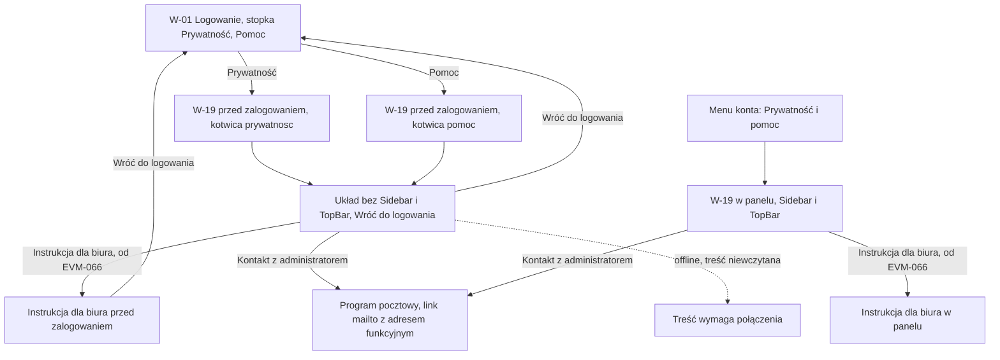

# 15 — Prywatność i pomoc

> Dokument żywy (EVM-071) · przepływ 15 (E8) · kanał: web · ekran: W-19 „Prywatność i pomoc” (także przed zalogowaniem) i strona „Instrukcja dla biura” w tym samym układzie · indeks: [README.md](README.md)
> Źródła: `rodo.md` → „Obowiązek informacyjny” (klauzule: klienci, osoby kontaktowe stron, pracownicy i BYOD); decyzja 9 (dane administratora danych, punkty `[PRAWNIK/IOD]`) i decyzja 19 (panel w przeglądarce prywatnego telefonu) — README M1 → „Decyzje dla Konrada”; polityki P7 (pkt 5 — zgłoszenie utraty), P11 (CSP); SR-PRIV-05, SR-PRIV-10, SR-WEB-03, SR-WEB-07, SR-INPUT-05, SR-AUTHZ-05; WCAG 3.2.6 (spójna pomoc); historyjki EVM-063 (W-19, klauzule), EVM-066 (instrukcja dla biura w panelu); konsultacja `security-engineer` w EVM-071 (S1, A5, A6, B9).

## Zasady wspólne przepływu 15
1. **Treść statyczna z repozytorium** — klauzule, pomoc i instrukcja są budowane razem z panelem i renderowane komponentami; bez HTML ani Markdown z bazy, bez zasobów z zewnątrz (skrypty, fonty, CDN) — CSP z P11 (SR-WEB-03, SR-WEB-07, SR-INPUT-05; ustalenie B9).
2. **Przed zalogowaniem strona nie wywołuje API wymagającego sesji** i nie pokazuje danych użytkownika. Kontakt do administratora pochodzi z minimalnej publicznej konfiguracji — wyłącznie adres funkcyjny jako link `mailto:` (w makietach `pomoc@firma.test`), nigdy dane osoby (S1, B9).
3. **Pomoc w stałym miejscu** (WCAG 3.2.6): sekcja „Pomoc” jest pierwsza i ma ten sam układ na W-19 i na stronie „Instrukcja dla biura”, w panelu i przed zalogowaniem. Wejścia też są stałe: menu konta (po zalogowaniu) i stopka W-01 (przed zalogowaniem).
4. **UI pokazuje tylko to, co system robi** (README M1): odnośnik „Instrukcja dla biura” pojawia się od EVM-066; do tego czasu „Pomoc” ma tylko kontakt i zgłaszanie utraty sprzętu (EVM-063 AC3). Przed zalogowaniem „Pomoc” ma kontakt, zgłaszanie utraty sprzętu i blok „Problem z logowaniem?” — wskazówki bez danych konta, które prowadzą do „Nie pamiętasz hasła?” w W-01 albo do kontaktu z administratorem. Ten blok rozszerza EVM-063 AC3 („tylko kontakt”) — do potwierdzenia w planie EVM-063.
5. **Bez danych osobowych w treści i w tytule karty**: „Prywatność i pomoc · EVia Manager”, „Instrukcja dla biura · EVia Manager”.

## Przepływ


## W-19 Prywatność i pomoc
- **Cel:** w jednym, stałym miejscu dać pomoc (kontakt do administratora, instrukcję, zgłoszenie utraty sprzętu) i klauzule informacyjne RODO — także osobie, która nie może się zalogować (EVM-063).
- **Główna akcja:** brak przycisku primary — to strona treści. Najważniejsze odnośniki: kontakt do administratora (`mailto:`) i „Instrukcja dla biura” (od EVM-066).
- **Hierarchia treści:** 1) tytuł „Prywatność i pomoc”, 2) „Pomoc” (kotwica `#pomoc`) — kontakt, zgłaszanie utraty sprzętu, instrukcja, podpowiedzi przy logowaniu (przed zalogowaniem), 3) „Prywatność” (kotwica `#prywatnosc`) — administrator danych i klauzule jako Disclosure, każda z wersją i datą.
- **Wejścia:** menu konta w TopBar → „Prywatność i pomoc” (każdy ekran po zalogowaniu — szkielet panelu w [README](README.md#panel-web-m1)); stopka [W-01](01-logowanie-mfa.md#w-01-logowanie) „Prywatność · Pomoc” — dwa odnośniki z kotwicami `#prywatnosc` i `#pomoc`; z W-19 — strona „Instrukcja dla biura” i powrót.

**Makieta A — w panelu (expanded; treść w kolumnie `size.form.max-width`)**
```text
Prywatność i pomoc
┌─ Pomoc ─────────────────────────────────────────────────── #pomoc
│ Kontakt z administratorem: pomoc@firma.test          ← link mailto: tylko adres
│ ┃‹triangle-alert› Zgubiony telefon lub laptop albo podejrzenie, że ktoś zna
│ ┃ hasło — zgłoś to od razu administratorowi: pomoc@firma.test
│ Instrukcja dla biura                                  ← link, od EVM-066
│ Krok po kroku: zlecenia, zdjęcia z telefonu, dokumenty i zasady
│ bezpiecznej pracy.
└──────────────────────────────────────────────────────────────
┌─ Prywatność ────────────────────────────────────────────── #prywatnosc
│ Administrator danych: [nazwa firmy, adres i dane rejestrowe — decyzja 9]
│ ▸ Klauzula dla klientów (do przekazania klientom)
│   Wersja 1.0 · obowiązuje od 01.11.2026
│ ▸ Klauzula dla osób kontaktowych stron
│   Wersja 1.0 · obowiązuje od 01.11.2026
│ ▾ Klauzula dla pracowników i pracy na prywatnym telefonie (BYOD)
│   Wersja 1.0 · obowiązuje od 01.11.2026
│   [treść klauzuli od security-engineer — EVM-063; punkty [PRAWNIK/IOD]
│    rozstrzygnięte albo oznaczone w „Decyzje” EVM-063]
└──────────────────────────────────────────────────────────────
```

**Makieta B — przed zalogowaniem (expanded; ten sam układ na `breakpoint.compact`)**
```text
┌──────────────────────────────────────────────────────────────
│ EVia Manager                                   [‹arrow-left› Wróć do logowania]
│ (bez Sidebar, TopBar i menu konta; bez danych użytkownika)
│
│ Prywatność i pomoc
│ ┌─ Pomoc ───────────────────────────────────────────── #pomoc
│ │ Kontakt z administratorem: pomoc@firma.test
│ │ ┃‹triangle-alert› Zgubiony telefon lub laptop albo podejrzenie, że ktoś
│ │ ┃ zna hasło — zgłoś to od razu administratorowi: pomoc@firma.test
│ │ Instrukcja dla biura                              ← od EVM-066
│ │ Problem z logowaniem?
│ │ · Nie pamiętasz hasła? Wróć do logowania i wybierz „Nie pamiętasz hasła?”.
│ │ · Nie masz dostępu do drugiego kroku logowania? Poproś administratora
│ │   o reset drugiego kroku.
│ └──────────────────────────────────────────────────────────
│ ┌─ Prywatność ──────────────────────────────────────── #prywatnosc
│ │ (jak w makiecie A)
│ └──────────────────────────────────────────────────────────
└──────────────────────────────────────────────────────────────
```

### Sekcja „Pomoc”
| Element | Treść | Uwagi |
|---|---|---|
| Kontakt z administratorem | „Kontakt z administratorem: pomoc@firma.test” — tekstem linku `mailto:` jest sam adres; nazwa dostępna zaczyna się od tego widocznego tekstu: „pomoc@firma.test — napisz do administratora” (WCAG 2.5.3) | adres funkcyjny z konfiguracji (EVM-063 AC3; S1, B9) — bez nazwiska i telefonu osoby; brak adresu w konfiguracji — „Kontakt z administratorem: zapytaj przełożonego.” |
| Zgłaszanie utraty sprzętu (ustalenie A6) | InlineAlert (§ 3.19, `color.feedback.warning.*`): „Zgubiony telefon lub laptop albo podejrzenie, że ktoś zna hasło — zgłoś to od razu administratorowi: pomoc@firma.test” | adres — link `mailto:` jak w wierszu wyżej; także przed zalogowaniem; P7 pkt 5, SR-PRIV-10 |
| Instrukcja dla biura (od EVM-066) | Link „Instrukcja dla biura” + opis jednym zdaniem | strona w panelu, ten sam układ (niżej); przed EVM-066 — elementu nie ma |
| Problem z logowaniem (tylko przed zalogowaniem) | dwie podpowiedzi: reset hasła z W-01, reset drugiego kroku przez administratora | bez samoobsługowego odzyskania drugiego kroku (W-02, decyzja 16); wskazówki ogólne, bez danych konta; rozszerzenie EVM-063 AC3 — zasada 4 |

### Sekcja „Prywatność”
- **Administrator danych** — zwykły tekst z miejscem na dane z decyzji 9 (nazwa firmy, adres, dane rejestrowe); w makietach bez wartości NIP i KRS.
- **Klauzule jako Disclosure** (§ 3.21, wariant sekcji pomocniczej; EVM-063 AC2, SR-PRIV-05; ustalenie A5): domyślnie zwinięte, podsumowanie pod tytułem = wersja i data.
  1. „Klauzula dla klientów (do przekazania klientom)” — pod tytułem zdanie „Tę klauzulę przekazujemy klientom przy przyjęciu zlecenia.”;
  2. „Klauzula dla osób kontaktowych stron”;
  3. „Klauzula dla pracowników i pracy na prywatnym telefonie (BYOD)” — obejmuje panel w przeglądarce prywatnego telefonu (decyzja 19), a od M2 — aplikację (M-11, E14).
- **Wersja i data** — „Wersja 1.0 · obowiązuje od 01.11.2026” (format daty § 6.3; wartości w makiecie przykładowe); zmiana treści = nowa wersja w repozytorium.
- **Treść** — miejsce na tekst od `security-engineer` (EVM-063); renderowana komponentami (nagłówki, akapity, listy), linki tylko `https:` i `mailto:`.

### Strona „Instrukcja dla biura” (od EVM-066)
- **Ten sam układ i mechanizm treści statycznej co W-19** (EVM-066 AC6): w panelu — Sidebar i TopBar; przed zalogowaniem — układ z makiety B z „Wróć do logowania” i odnośnikiem „Prywatność i pomoc”.
- **Kolejność:** 1) tytuł „Instrukcja dla biura”, 2) sekcja „Pomoc” — ta sama co w W-19 (stałe miejsce — WCAG 3.2.6), 3) „Spis treści” — lista odnośników do rozdziałów (h2), 4) rozdziały z nagłówkami h2 / h3 i zrzutami ekranu z danymi syntetycznymi i tekstem alternatywnym.
- Treść bez danych osobowych, szczegółów konfiguracji bezpieczeństwa i procedur Administratora z runbooków (EVM-066 AC6; konsultacja `security-engineer` w EVM-071, część D).
- Tytuł karty „Instrukcja dla biura · EVia Manager”; adres stały, kotwice rozdziałów w URL dozwolone (bez danych osobowych).

### Stany
| Stan | Zachowanie |
|---|---|
| Pusty | nd. — treść statyczna jest zawsze; przed EVM-066 brak odnośnika „Instrukcja dla biura” (to wariant, nie stan pusty). Brak adresu kontaktowego w konfiguracji — tekst zastępczy z tabeli „Pomoc”. |
| Ładowanie | Skeleton tekstu (§ 3.16) w kształcie nagłówków i akapitów, do wczytania treści strony (EVM-063 AC6); sekcja „Pomoc” pojawia się pierwsza. |
| Błąd | Nie wczytano treści — EmptyState `circle-alert` „Nie udało się wczytać strony. [Spróbuj ponownie]”; przed zalogowaniem obok zawsze „Wróć do logowania”. `429` — nd. (strona nie wywołuje API wymagającego sesji); limit żądań nieuwierzytelnionych dotyczy tylko zasobów statycznych — przy odmowie ten sam EmptyState. |
| Offline | Treść już wczytana w tej karcie — pokazana bez zmian z Banner § 4.10; treść niewczytana — EmptyState `wifi-off` „Treść wymaga połączenia.” (EVM-063 AC6, EVM-066 AC6) z „Spróbuj ponownie”; link `mailto:` działa zawsze. |
| Brak uprawnień | nd. — W-19 i instrukcję widzą wszystkie role i niezalogowany (EVM-063 AC5, EVM-066 AC6). Wygaśnięcie sesji na W-19 w panelu — jak każdy ekran (§ 4.17); strona otwarta przed zalogowaniem nie ma sesji. |

### Role
| Element | Operacja | A | E | R | Niezalogowany |
|---|---|---|---|---|---|
| W-19 — Pomoc i Prywatność | treść statyczna z repozytorium panelu | tak (w panelu) | tak (w panelu) | tak (w panelu) | tak — układ przed zalogowaniem, bez danych użytkownika i bez API z sesją |
| Kontakt z administratorem | link `mailto:` z minimalnej publicznej konfiguracji | tak | tak | tak | tak |
| Instrukcja dla biura (od EVM-066) | treść statyczna z repozytorium | tak | tak | tak | tak |
| Wejście | menu konta → „Prywatność i pomoc” | tak | tak | tak | — |
| Wejście | stopka W-01 → „Prywatność” / „Pomoc” | — | — | — | tak |

- **Responsywność:** `breakpoint.expanded` i `breakpoint.wide` — treść w kolumnie `size.form.max-width` (tekst ciągły — § 2.2), w panelu obok Sidebar; `breakpoint.medium` — Sidebar zwinięty, ta sama kolumna; `breakpoint.compact` — kolumna na pełną szerokość z marginesem siatki; przed zalogowaniem — „Wróć do logowania” pod nazwą „EVia Manager”, cele dotyku ≥ `size.touch-target.min` (panel w przeglądarce telefonu — decyzja 19); spis treści instrukcji jako Disclosure „Spis treści” (§ 3.21) na compact.
- **Komponenty i tokeny:** tytuł strony `text.heading-1`; sekcje „Pomoc” i „Prywatność” — Card (§ 3.8) `color.bg.surface`, `radius.card`, `color.border.default`, `space.inset.lg`, tytuł `text.heading-2` (h2), odstęp `space.stack.lg`; treść `text.body` `color.text.primary`, wersja i data `text.body-sm` `color.text.secondary`; linki `color.text.link` (podkreślone); InlineAlert (§ 3.19) `color.feedback.warning.*` z ikoną `triangle-alert` (zgłaszanie utraty); Disclosure (§ 3.21) — klauzule, nagłówek `text.heading-4`; Button tertiary (§ 3.1) z ikoną `arrow-left` „Wróć do logowania”; układ przed zalogowaniem — tło `color.bg.canvas`, nazwa „EVia Manager” jak W-01; EmptyState (§ 3.15) z `circle-alert`, `wifi-off`; Skeleton (§ 3.16); Banner offline (§ 4.10); Sidebar i TopBar (§ 3.17) — tylko w panelu.
- **Mikrocopy:** „Prywatność i pomoc” · „Pomoc” · „Kontakt z administratorem: pomoc@firma.test” · „Kontakt z administratorem: zapytaj przełożonego.” · „Zgubiony telefon lub laptop albo podejrzenie, że ktoś zna hasło — zgłoś to od razu administratorowi: pomoc@firma.test” · „Instrukcja dla biura” · „Krok po kroku: zlecenia, zdjęcia z telefonu, dokumenty i zasady bezpiecznej pracy.” · „Problem z logowaniem?” · „Nie pamiętasz hasła? Wróć do logowania i wybierz „Nie pamiętasz hasła?”.” · „Nie masz dostępu do drugiego kroku logowania? Poproś administratora o reset drugiego kroku.” · „Prywatność” · „Administrator danych:” · „Klauzula dla klientów (do przekazania klientom)” · „Tę klauzulę przekazujemy klientom przy przyjęciu zlecenia.” · „Klauzula dla osób kontaktowych stron” · „Klauzula dla pracowników i pracy na prywatnym telefonie (BYOD)” · „Wersja 1.0 · obowiązuje od 01.11.2026” · „Wróć do logowania” · „Spis treści” · „Nie udało się wczytać strony.” · „Treść wymaga połączenia.” · „Spróbuj ponownie”.
- **Dostępność:** tytuły kart wyżej; jeden h1, sekcje h2 z kotwicami `id="pomoc"` i `id="prywatnosc"` i `tabindex="-1"` — wejście z kotwicy przenosi fokus na nagłówek sekcji (jak `#drugi-krok` w W-15), z `scroll-padding` przy przyklejonym TopBar (WCAG 2.4.11); klauzule — Disclosure z nagłówkiem h3, `aria-expanded`, nazwa dostępna = tytuł + „wersja 1.0, obowiązuje od 01.11.2026”; linki `mailto:` — tekstem linku jest sam adres, a nazwa dostępna zaczyna się od niego: „pomoc@firma.test — napisz do administratora” (WCAG 2.5.3); „Wróć do logowania” jako link (nawigacja), nie przycisk; spis treści instrukcji jako `nav` z nazwą „Spis treści”; zrzuty z tekstem alternatywnym opisującym, co pokazują (bez danych osobowych); InlineAlert o utracie sprzętu bez `role="alert"` (treść stała, nie błąd); `lang="pl"`; ten sam porządek elementów pomocy na każdej stronie (WCAG 3.2.6).
