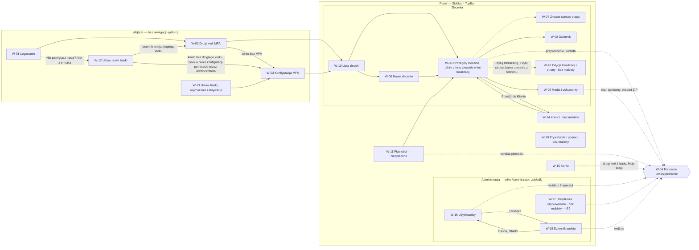
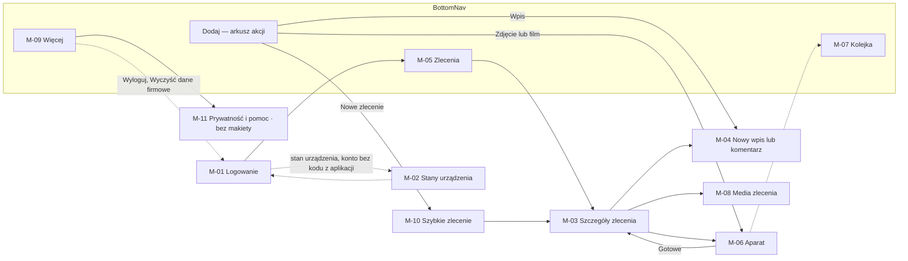

# Przepływy i makiety MVP (M1–M2)

> Dokument żywy (EVM-004; aktualizacja do styleguide'u 1.2.0 — EVM-014, 2026-10-04; makiety E1 — EVM-015, 2026-10-04). Właściciel: `ux-designer`. Stan: **makiety low-fi zaakceptowane przez Konrada 2026-10-03 (demo EVM-004)** — wiążąca specyfikacja UI dla epików E1–E7 (panel web, M1) i E9–E13 (aplikacja mobilna, M2); makiety E1 z EVM-015 (przepływy 11–12, treści e-maili, zmiany W-02, W-03 i W-04; poprawki po demo 2026-10-04 — decyzja 16 bez zmian) — do akceptacji na demo końcowym EVM-015. Szczegóły ekranów doprecyzowujemy przy refinemencie epików; zmiana zachowania opisanego tutaj = zmiana tego dokumentu w historyjce.
> Podstawa: styleguide **1.2.0** ([`../styleguide.md`](../styleguide.md); od 1.2.0 makiety odwołują się wyłącznie do § styleguide'u — dawne propozycje P-1…P-13 mają własne §, tabela [Propozycje do styleguide'u](#propozycje-do-styleguideu)), tokeny ([`design/tokens/`](../../../design/tokens/README.md)), model domeny ([`domain-model.md`](../../architecture/domain-model.md)), synchronizacja offline ([`offline-sync.md`](../../architecture/offline-sync.md)), polityki P1–P12 ([`policies.md`](../../security/policies.md)) i wymagania `SR-…` ([`requirements.md`](../../security/requirements.md)). Słownictwo UI: [`domain.md`](../../product/domain.md) i styleguide § 6.2.

## Spis treści
1. [Jak czytać makiety](#jak-czytać-makiety)
2. [Szkielet aplikacji](#szkielet-aplikacji)
3. [Mapa nawigacji](#mapa-nawigacji) (AC1)
4. [Ekrany](#ekrany) — przepływy 1–10 (EVM-004) oraz przepływy E1 (EVM-015): [11 — aktywacja konta i reset hasła](11-aktywacja-i-reset-hasla.md), [12 — konto i administracja](12-konto-i-administracja.md); [treści e-maili](e-maile.md)
5. [Macierz ekran × rola](#macierz-ekran--rola)
6. [Zasady wspólne](#zasady-wspólne) — stany, bezpieczeństwo i prywatność w UI, dane w makietach
7. [Pokrycie kryteriów AC2–AC5](#pokrycie-kryteriów-ac2ac5) (EVM-004)
8. [Pokrycie EVM-015](#pokrycie-evm-015) — makiety E1 i treści e-maili
9. [Zgodność z politykami](#zgodność-z-politykami) — P1–P7 i P9
10. [Propozycje do styleguide'u](#propozycje-do-styleguideu) — od 1.2.0 mapa P-n → § styleguide'u

## Jak czytać makiety
**Forma.** Diagram przepływu w Mermaid + dla każdego ekranu: cel, główna akcja, hierarchia treści, szkielet ASCII, tabela stanów, różnice ról, zachowanie responsywne, komponenty i tokeny, mikrocopy, dostępność. Makiety są low-fi: pokazują układ, hierarchię i treść, **nie** proporcje ani kolory. Wartości wizualne wynikają wyłącznie z tokenów i komponentów styleguide'u — w makietach nie ma literałów kolorów, rozmiarów ani fontów.

**Notacja w szkieletach ASCII**

| Zapis | Znaczenie | Komponent |
|---|---|---|
| `[[Zapisz zlecenie]]` | przycisk główny (jeden na widok) | Button primary (§ 3.1) |
| `[Anuluj]` | przycisk drugorzędny lub tekstowy (wariant w adnotacji) | Button secondary / tertiary (§ 3.1) |
| `[____________]` | pole tekstowe | TextField (§ 3.2) |
| `[Wybierz… ▾]` | select albo combobox | Select / Combobox (§ 3.3) |
| `( ) / (•)`, `[ ] / [x]` | radio, checkbox | § 3.4 |
| `«W toku»` | odznaka statusu (ikona + etykieta) | StatusBadge (§ 3.9) |
| `«W toku ▾»` | odznaka jako przycisk zmiany statusu | StatusBadge (§ 3.9) + ActionMenu (§ 3.20) |
| `{Czekamy na OSD > 14 dni}` / `{✓ …}` | chip filtra / wybrany chip | FilterChip (§ 3.7) |
| `⋮` | menu akcji | ActionMenu (§ 3.20) |
| `▸` / `▾` przy nagłówku | sekcja zwinięta / rozwinięta | Disclosure (§ 3.21) |
| `⟨Offline · 5⟩` | kapsuła wskaźnika synchronizacji | SyncIndicator (§ 5.4) |
| `▒▒▒▒` | szkielet ładowania | Skeleton (§ 3.16) |
| `‹lock›` | ikona Lucide (nazwa) | § 2.10 |

**Odwołania:** `§ 3.x` — komponent styleguide'u, `§ 4.x` — wzorzec, `§ 5.x` — teren, `§ 6.x` — treści; tokeny semantyczne pełnymi nazwami (np. `color.status.stage.waiting.*`, `space.stack.md`). Układ web opisujemy dla breakpointu `breakpoint.expanded`, a zmiany dla `breakpoint.medium` i `breakpoint.compact` — w punkcie „Responsywność”; mobile — układ compact.

**Role:** **A** — Administrator, **E** — Edytor, **R** — Tylko odczyt (słownik: [`domain.md`](../../product/domain.md)). W tabelach ról: „tak”, „tak ↑” (Administrator ze step-upem — dialog [W-04](01-logowanie-mfa.md#w-04-ponowne-uwierzytelnienie)), „wyłączone” (przycisk wyłączony z podpowiedzią — styleguide § 4.13), „ukryte” (element niewidoczny — dla roli Tylko odczyt akcje edycji są zawsze ukryte). Każda akcja wskazuje komendę albo przejście z [`domain-model.md`](../../architecture/domain-model.md#stany-i-przejścia) lub [`offline-sync.md`](../../architecture/offline-sync.md#komendy-mobilne-mvp) — to wejście do testów macierzy ról (SR-AUTHZ-05). Aplikacja mobilna: Administrator = Edytor (kanał `mobile` bez funkcji administracyjnych i step-upu, SR-AUTHZ-12); Tylko odczyt — brak dostępu (P6).

**Identyfikatory ekranów:** `W-xx` — panel web, `M-xx` — aplikacja mobilna. Ekrany oznaczone „bez makiety” występują tylko na mapie nawigacji; makietę dostają przy refinemencie swojego epiku.

**Przepływy E1 (EVM-015):** [11](11-aktywacja-i-reset-hasla.md) — wejście z linku jednorazowego (W-13, W-12); [12](12-konto-i-administracja.md) — konto i administracja (W-15, W-16, W-18). Treści e-maili — [e-maile.md](e-maile.md): e-mail nie jest ekranem, więc plik nie ma numeru (jak [scenariusze-a-d.md](scenariusze-a-d.md)); kolejne epiki dopisują tam swoje e-maile. Przepływy EVM-071 numerujemy od 13.

## Szkielet aplikacji
### Panel web (M1)
```text
┌──────────────┬──────────────────────────────────────────────────────────────────┐
│ EVia Manager │ Zlecenia / ZL-2026-0042            [Szukaj zleceń… ‹search›]  Anna Testowa ▾ │
│              ├──────────────────────────────────────────────────────────────────┤
│ ‹clipboard-  │                                                                  │
│  list›       │   (treść ekranu — tło color.bg.canvas,                           │
│  Zlecenia  ▌ │    karty i tabele na color.bg.surface)                           │
│ ‹users›      │                                                                  │
│  Klienci     │                                                                  │
│ ‹banknote›   │                                                                  │
│  Płatności   │                                                                  │
│ ‹shield›     │                                                                  │
│  Administracja (tylko A)                                                        │
│              │                                                                  │
└──────────────┴──────────────────────────────────────────────────────────────────┘
 Menu konta (Anna Testowa ▾): Konto · Prywatność i pomoc · Wyloguj
```
- **Sidebar** (§ 3.17): `color.bg.brand-strong`, `size.sidebar.width.expanded`; aktywna pozycja — pasek `color.brand.accent` `border-width.indicator` + pogrubienie; pierwszy element fokusowalny — „Przejdź do treści”. Pozycje: Zlecenia, Klienci, Płatności, Administracja (tylko Administrator — pozycji bez uprawnień nie pokazujemy, § 4.13).
- **TopBar** (§ 3.17): `size.app-bar.height.web`, `color.bg.surface`; okruszki (Breadcrumbs), wyszukiwanie zleceń (fraza wysyłana przez `POST …/search`, nie trafia do URL ani tytułu karty), menu konta z pozycjami **Konto**, **Prywatność i pomoc** (klauzula informacyjna — SR-PRIV-05, pomoc w stałym miejscu — WCAG 3.2.6) i **Wyloguj** — dostępne z każdego ekranu po zalogowaniu (SR-SESS-05).
- `breakpoint.medium` — Sidebar zwinięty (`size.sidebar.width.collapsed`, podpowiedzi z nazwą); `breakpoint.compact` — Sidebar jako panel wysuwany z przycisku `menu`, wyszukiwanie jako IconButton.

### Aplikacja mobilna (M2)
```text
┌──────────────────────────────────┐
│ ← Zlecenia        ⟨Zsynchr. 14:05⟩│  AppBar: color.bg.brand-strong
├──────────────────────────────────┤
│ (baner offline / „Wymaga uwagi”) │  Banner § 3.19 — tylko gdy dotyczy
│                                  │
│   (treść ekranu)                 │
│                                  │
├──────────────────────────────────┤
│ [[ akcja główna ekranu ]]        │  dolny pasek akcji (gdy jest)
├──────────────────────────────────┤
│ ‹list›     ‹plus›   ‹upload› ‹…› │  BottomNav
│ Zlecenia   Dodaj    Kolejka  Więcej│
└──────────────────────────────────┘
```
- **AppBar** (§ 3.18): `size.app-bar.height.mobile`, `color.bg.brand-strong`, tytuł `text.heading-3` `color.text.on-brand`, wstecz `arrow-left`, **SyncIndicator** (§ 5.4) zawsze po prawej; dotknięcie → [M-07 Kolejka](09-mobile-zdjecia-filmy-offline.md#m-07-kolejka).
- **BottomNav** (§ 3.18): 4 pozycje — **Zlecenia** ([M-05](07-lista-zlecen-i-filtry.md#m-05-lista-zleceń)), **Dodaj** (arkusz akcji — ActionMenu, § 3.20: Zdjęcie lub film → [M-06](09-mobile-zdjecia-filmy-offline.md#m-06-aparat), Wpis → [M-04](05-wpis-i-komentarz.md#m-04-nowy-wpis), Nowe zlecenie → [M-10](10-mobile-szybkie-zlecenie.md#m-10-szybkie-zlecenie)), **Kolejka** (licznik jako odznaka z liczbą), **Więcej** ([M-09](09-mobile-zdjecia-filmy-offline.md#m-09-więcej) — w tym Wyloguj i Prywatność).
- Akcje główne w strefie kciuka (§ 5.2), cele dotyku ≥ `size.touch-target.min`, akcje główne `size.touch-target.field`.

## Mapa nawigacji
Węzeł = ekran; linia ciągła — nawigacja, przerywana — dialog lub stan wywoływany z ekranu. Linki do makiet: tabela [Ekrany](#ekrany).

### Panel web (M1)


### Aplikacja mobilna (M2)


## Ekrany
| ID | Ekran | Kanał | Przepływ (AC2) | Makieta | Epik |
|---|---|---|---|---|---|
| W-01 | Logowanie | web | 1 | [tak](01-logowanie-mfa.md#w-01-logowanie) | E1 |
| W-02 | Drugi krok MFA | web | 1 | [tak](01-logowanie-mfa.md#w-02-drugi-krok) | E1 |
| W-03 | Konfiguracja MFA | web | 1 | [tak](01-logowanie-mfa.md#w-03-konfiguracja-mfa) | E1 |
| W-04 | Ponowne uwierzytelnienie (step-up, pełne ponowne uwierzytelnienie, zmiana hasła) — dialog | web | 1 (używany w 3, 6, 8, 12) | [tak](01-logowanie-mfa.md#w-04-ponowne-uwierzytelnienie) | E1 |
| W-05 | Nowe zlecenie z szablonu | web | 2 | [tak](02-nowe-zlecenie-z-szablonu.md#w-05-nowe-zlecenie) | E3 |
| W-06 | Szczegóły zlecenia | web | 3 | [tak](03-szczegoly-zlecenia.md#w-06-szczegóły-zlecenia) | E3, E4, E7 |
| W-07 | Zmiana statusu etapu — menu i dialog | web | 4 | [tak](04-aktualizacja-etapu.md#w-07-zmiana-statusu-etapu) | E4 |
| W-08 | Dziennik (zakładka zlecenia) | web | 5 | [tak](05-wpis-i-komentarz.md#w-08-dziennik) | E5 |
| W-09 | Media i dokumenty (zakładka zlecenia) | web | 6 | [tak](06-galeria-i-upload.md#w-09-media-i-dokumenty) | E6 |
| W-10 | Lista zleceń z filtrami | web | 7 | [tak](07-lista-zlecen-i-filtry.md#w-10-lista-zleceń) | E3, E4 |
| W-11 | Płatności — nieopłacone | web | 8 | [tak](08-nieoplacone.md#w-11-nieopłacone) | E7 |
| W-12 | Ustaw nowe hasło (reset hasła z linku; prośba o link: W-01) | web | 11 | [tak](11-aktywacja-i-reset-hasla.md#w-12-ustaw-nowe-hasło) | E1 |
| W-13 | Ustaw hasło (zaproszenie i aktywacja pierwszego Administratora) | web | 11 | [tak](11-aktywacja-i-reset-hasla.md#w-13-ustaw-hasło) | E1 |
| W-14 | Klienci — lista i szczegóły | web | — | bez makiety — przy refinemencie E2 | E2 |
| W-15 | Konto — profil, hasło, drugi krok logowania (m.in. dodanie kodu z aplikacji uwierzytelniającej do aplikacji na telefonie — cel stanu M-02 „Dodaj kod z aplikacji uwierzytelniającej”), moje sesje; urządzenia — od E9 | web | 12 | [tak](12-konto-i-administracja.md#w-15-konto) (sekcja urządzeń — od E9) | E1, E9 |
| W-16 | Administracja — użytkownicy (zaproszenia, role, dezaktywacja i reaktywacja, sesje, reset drugiego kroku) | web | 12 | [tak](12-konto-i-administracja.md#w-16-użytkownicy) | E1 |
| W-17 | Administracja — urządzenia użytkowników („Wyloguj urządzenie”, „Zablokuj i wyczyść”, niewysłane elementy, poziom poprawek) | web | — | bez makiety — E9 (M2) | E9 |
| W-18 | Administracja — dziennik audytu | web | 12 | [tak](12-konto-i-administracja.md#w-18-dziennik-audytu) | E1 |
| W-19 | Prywatność i pomoc (klauzula informacyjna) | web | — | bez makiety — przy refinemencie E8 | E8 |
| W-20 | Edycja lokalizacji i strony — dialog z karty „Lokalizacja” W-06 i z banera zlecenia z telefonu | web | — (używany w 3, 10) | bez makiety — przy refinemencie E3 / E4 (zachowanie i pola: [W-06 → karta „Lokalizacja”](03-szczegoly-zlecenia.md#w-06-szczegóły-zlecenia); pola jak sekcja „2. Lokalizacja” i dialog „Dodaj stronę” w [W-05](02-nowe-zlecenie-z-szablonu.md#w-05-nowe-zlecenie)) | E3, E4 |
| M-01 | Logowanie w aplikacji | mobile | 1 | [tak](01-logowanie-mfa.md#m-01-logowanie-w-aplikacji) | E9 |
| M-02 | Stany urządzenia (blokujące i ostrzeżenia) | mobile | 1 | [tak](01-logowanie-mfa.md#m-02-stany-urządzenia) | E9, E14 |
| M-03 | Szczegóły zlecenia | mobile | 3 (także 4, 9, 10) | [tak](03-szczegoly-zlecenia.md#m-03-szczegóły-zlecenia) | E10 |
| M-04 | Nowy wpis lub komentarz | mobile | 5 | [tak](05-wpis-i-komentarz.md#m-04-nowy-wpis) | E12 |
| M-05 | Lista zleceń | mobile | 7 | [tak](07-lista-zlecen-i-filtry.md#m-05-lista-zleceń) | E10 |
| M-06 | Aparat (z arkuszem wyboru zlecenia) | mobile | 9 | [tak](09-mobile-zdjecia-filmy-offline.md#m-06-aparat) | E11 |
| M-07 | Kolejka | mobile | 9 | [tak](09-mobile-zdjecia-filmy-offline.md#m-07-kolejka) | E11, E12 |
| M-08 | Media zlecenia | mobile | 9 | [tak](09-mobile-zdjecia-filmy-offline.md#m-08-media-zlecenia) | E11 |
| M-09 | Więcej (ustawienia, wylogowanie, czyszczenie danych) | mobile | 9 | [tak](09-mobile-zdjecia-filmy-offline.md#m-09-więcej) | E9, E11 |
| M-10 | Szybkie nowe zlecenie | mobile | 10 | [tak](10-mobile-szybkie-zlecenie.md#m-10-szybkie-zlecenie) | E13 |
| M-11 | Prywatność i pomoc (klauzula informacyjna) | mobile | — | bez makiety — przy refinemencie E14 | E14 |

Każdy ekran z tabeli jest na mapie nawigacji i odwrotnie (węzeł „Dodaj — arkusz akcji” to element BottomNav, opisany w [Szkielecie aplikacji](#aplikacja-mobilna-m2)).

## Macierz ekran × rola
Szczegóły akcji — tabele „Role” przy ekranach. „Pełny” = wszystkie akcje ekranu dostępne roli zgodnie z macierzą uprawnień modelu; akcje tylko dla Administratora ze step-upem są u Edytora wyłączone z podpowiedzią.

| Ekran | Administrator (A) | Edytor (E) | Tylko odczyt (R) |
|---|---|---|---|
| W-01, W-02, W-03 | passkey obowiązkowy (TOTP tylko do aplikacji mobilnej — opcjonalnie w W-03) | passkey lub TOTP; do aplikacji na telefonie TOTP (sam albo obok passkey — W-03 informuje) | passkey lub TOTP |
| W-04 | tylko passkey (step-up; w pełnym ponownym uwierzytelnieniu hasło + passkey) | passkey lub TOTP (np. eksport ZIP, W-15) | tylko własne konto w W-15: „Moje sesje” — step-up; drugi krok i hasło — pełne ponowne uwierzytelnienie |
| W-05 | pełny | pełny | brak dostępu — przycisku „Nowe zlecenie” nie ma; wejście z linku → `403`: `lock` + „Nie możesz tworzyć zleceń.” |
| W-06 | pełny; przywrócenie zlecenia, korekty płatności ↑ | pełny bez operacji ↑ (wyłączone z podpowiedzią) | podgląd wszystkich sekcji z płatnościami; akcje ukryte |
| W-07 | pełny | pełny | odznaki statyczne, menu niedostępne |
| W-08 | wpis, komentarz, korekta; usunięcie i redakcja (redakcja ↑) | wpis, komentarz, korekta; usunięcie wyłączone | podgląd, filtr typów |
| W-09 | upload, edycja metadanych, oryginały, usunięcie, ponowny skan ↑, eksport ZIP ↑ | upload, edycja metadanych, oryginały, eksport ZIP ↑; usunięcie wyłączone; bez przyczyny kwarantanny | miniatury i podglądy, pliki `standard`; bez oryginałów, `identity_data`, `building_security`, eksportu |
| W-10 | pełny | pełny | podgląd i filtry; bez „Nowe zlecenie” |
| W-11 | wystaw, odnotuj, anuluj Planowaną; korekty ↑ | wystaw, odnotuj, anuluj Planowaną; korekty wyłączone | podgląd, sumy i filtry; akcje ukryte |
| W-12, W-13 | tak — bez logowania, tylko z ważnym linkiem (aktywacja: w W-03 tylko klucz dostępu) | tak — z ważnym linkiem | tak — z ważnym linkiem |
| W-14 | pełny | pełny | podgląd |
| W-15 | własne konto; „Moje sesje” — step-up; drugi krok i hasło — pełne ponowne uwierzytelnienie; min. 1 klucz dostępu | jak A (min. 1 metoda: klucz dostępu lub kod z aplikacji) | jak E; blok kodu z aplikacji bez informacji o telefonie |
| W-16 | lista; operacje ↑ (nie na własnym koncie) | brak (pozycja niewidoczna; wejście z adresu — `403` z `lock`) | brak (jw.) |
| W-17 | bez makiety — E9 | — | — |
| W-18 | wejście ↑ | brak (pozycja niewidoczna; wejście z adresu — `403` z `lock`) | brak (jw.) |
| W-19 | tak | tak | tak |
| W-20 | pełny | pełny | brak — akcje „Edytuj” ukryte (dane lokalizacji i stron widzi w karcie W-06) |
| M-01 – M-11 | jak Edytor (kanał `mobile`: bez funkcji administracyjnych i step-upu) | pełny w zakresie „telefon tylko dodaje” | brak dostępu: [M-02](01-logowanie-mfa.md#m-02-stany-urządzenia) „Aplikacja niedostępna dla Twojej roli” (`403 channel_not_allowed`) |

## Zasady wspólne
### Stany ekranu
Każdy ekran ma tabelę z pięcioma stanami. Wspólne zachowanie (szczegóły w tabelach ekranów):

| Stan | Panel web | Aplikacja mobilna |
|---|---|---|
| **Pusty** | EmptyState (§ 3.15): dlaczego pusto + co zrobić; brak wyników filtrów — „Wyczyść filtry” | jak web; akcje w strefie kciuka |
| **Ładowanie** | Skeleton (§ 3.16) w kształcie treści od pierwszej klatki; częściowe dane od razu (najpierw nagłówek); po 10 s „Ładowanie trwa dłużej niż zwykle…” + „Spróbuj ponownie” | dane z lokalnej bazy od razu; Skeleton tylko przy pierwszej synchronizacji; odświeżanie pociągnięciem (jedyny dozwolony spinner) |
| **Błąd** | § 4.9: alert w sekcji z wyjściem albo EmptyState `circle-alert` + „Spróbuj ponownie”; `429` — „Zbyt wiele zapytań. Spróbuj ponownie za 1 min.” (czas z `Retry-After`); konflikt `412` — komunikat z § 6.4, wpisane dane zostają | błędy wysyłki w SyncIndicator i na ekranie Kolejka; odrzucone mutacje → „Wymaga uwagi” (§ 4.16) |
| **Offline** | baner § 4.10 tylko gdy operacja wymaga sieci; wpisane dane zostają **w pamięci karty**; panel nie ma kolejki offline | SyncIndicator „Offline · 5” + baner § 5.4; praca na lokalnej bazie, zapis do kolejki („Zapisano w telefonie”) |
| **Brak uprawnień** | `404` (zasób nie istnieje, usunięty albo poza uprawnieniami) — jeden stan „Nie znaleziono …” bez danych zasobu; `403` (akcja lub plik w widocznym kontekście) — `lock` + wyjaśnienie; Tylko odczyt — akcje edycji ukryte; Edytor przy akcjach Administratora — wyłączone z podpowiedzią (§ 4.13) | Tylko odczyt — M-02 (brak dostępu do aplikacji); zlecenie, które zniknęło z zakresu — „Nie znaleziono zlecenia” + elementy oczekujące zostają w Kolejce |

`nd.` w tabeli stanu ekranu zawsze ma uzasadnienie.

### Bezpieczeństwo i prywatność w UI
Ustalenia z konsultacji `security-engineer` (EVM-004) i wymagania `SR-…`, obowiązujące na wszystkich ekranach:
1. **Tytuł karty przeglądarki bez nazwisk, adresów i fraz wyszukiwania** (historia przeglądarki na współdzielonych komputerach): `Zlecenia · EVia Manager`, `ZL-2026-0042 · EVia Manager`, `Nie znaleziono · EVia Manager`.
2. **Ekran `404` bez danych zasobu** — także z pamięci listy (np. nazwy klienta z poprzedniego ekranu); styleguide § 4.13.
3. **„Wyloguj” dostępne z każdego ekranu** po zalogowaniu (web — menu konta w TopBar; mobile — Więcej, a w stanach blokujących M-02 — przycisk na ekranie) (SR-SESS-05).
4. **Link do klauzuli informacyjnej** w panelu (menu konta i ekran logowania) i w aplikacji (Więcej i ekran logowania) (SR-PRIV-05, SR-MOB-12).
5. **Wygaśnięcie sesji web:** ostrzeżenie przed końcem bezczynności, „Przedłuż sesję” przedłuża tylko bezczynność, w granicach 12 h od zalogowania (WCAG 2.2.1, SR-SESS-03) — wzorzec „Sesja wygasa” (§ 4.17): czas z serwera, po wygaśnięciu albo `401` dane znikają z widoku i z pamięci zapytań.
6. **Szkice i niezapisane zmiany w panelu tylko w pamięci karty** — nigdy w `localStorage`, `sessionStorage`, IndexedDB ani ciasteczkach; odrzucane przy wylogowaniu, zamknięciu karty i zalogowaniu innej osoby; przywracane tylko po ponownym uwierzytelnieniu tej samej osoby w tej samej karcie; mikrocopy nie obiecuje trwałego zapisu (styleguide § 4.1, SR-WEB-05, SR-SESS-05, TM-10). Aplikacja mobilna — szkice w zaszyfrowanej bazie (SR-MOB-01).
7. **URL bez danych osobowych:** tylko status, rodzaj strony, liczba dni X i identyfikator zapisanego widoku; wyszukiwanie przez `POST …/search` (SR-API-04, AB-16); paginacja maks. 100 pozycji na stronę (`api-guidelines.md`); zapamiętywanie filtrów poza magazynami przeglądarki (styleguide § 4.3).
8. **Pola notatek** (notatki klienta, lokalizacji i strony, wpisy, komentarze, opisy): podpowiedź „Nie wpisuj PESEL, numerów dokumentów ani kodów do bram i alarmów”; zwykły tekst bez Markdown i HTML; w treści aktywne są tylko linki `https:`, `tel:` i `mailto:` (SR-DATA-02, SR-INPUT-05, SR-WEB-03). `Site.notes` trafia na telefony pracowników.
9. **Pliki:** bez „Kopiuj link”; bez masowego pobierania oryginałów; eksport ZIP mediów tylko Administrator i Edytor ze step-upem, ukryty dla roli Tylko odczyt; bez eksportu CSV / XLSX w MVP (AB-07, SR-FILE-09, SR-FILE-10).
10. **Step-up i funkcje administracyjne wyłącznie w panelu** (SR-AUTHZ-12, SR-SESS-08); [W-04](01-logowanie-mfa.md#w-04-ponowne-uwierzytelnienie) nie występuje w aplikacji mobilnej.
11. **Telefon tylko dodaje** (decyzja Konrada z EVM-002): wpisy, komentarze, media, szybkie zlecenie; etapy, metadane dokumentów i dane zlecenia tylko do odczytu; bez płatności, PPE i historii lokalizacji (projekcja z `offline-sync.md`, SR-SYNC-04).
12. **Powiadomienia systemowe** (upload w tle) bez danych osobowych: „Wysyłanie 3 z 12 plików” (SR-MOB-08); wymagają zgody (Android 13+) — prośba z ekranem wyjaśniającym, a bez zgody Banner w Kolejce ([M-07](09-mobile-zdjecia-filmy-offline.md#m-07-kolejka)).
13. **„Cofnij”** tylko przez przejście odwrotne tej samej roli bez step-upu; operacje, których odwrócenie wymaga Administratora ze step-upem — dialog z podsumowaniem (styleguide § 4.11; lista: [04-aktualizacja-etapu.md](04-aktualizacja-etapu.md#cofnij--lista-przejść)).
14. **Linki jednorazowe** (aktywacja, zaproszenie, reset hasła — [11](11-aktywacja-i-reset-hasla.md#zasady-wspólne-w-12-i-w-13); EVM-015): token tylko we fragmencie `#…`, usuwany z paska adresu po wczytaniu i wysyłany wyłącznie w `POST`; odświeżenie strony = link nieważny; jeden komunikat dla linku użytego, wygasłego, zastąpionego, zmienionego i bez tokenu; e-mail i rola konta dopiero po sprawdzeniu linku na serwerze; bez „Kopiuj link” i zasobów zewnętrznych (README M1 → „Tokeny w linkach jednorazowych”, SR-API-04; CWE-598).
15. **O ponownym uwierzytelnieniu decyduje serwer** — panel pokazuje W-04 wyłącznie po odpowiedzi serwera i nie zapamiętuje, że step-up jest ważny; hasła i kody z W-04, W-12, W-13 i W-15 tylko w pamięci karty, czyszczone po sukcesie, „Anuluj” i wylogowaniu (SR-WEB-05). Błędne hasło i kod w ponownym uwierzytelnieniu liczą się do limitów logowania (SR-AUTH-05; EVM-015, ustalenie S7).

### Dane w makietach
Wyłącznie dane syntetyczne (SR-PRIV-08, styleguide § 6.3): fikcyjne osoby („Jan Przykładowy”, „Anna Testowa”), adresy („ul. Testowa 7, 00-001 Warszawa”), telefony w formacie z § 6.3 z fikcyjnymi cyframi, e-maile tylko w domenach `example.com` i `*.test` (RFC 2606), numery zleceń w formacie modelu (`ZL-2026-0042`), numery faktur oznaczone `TEST`, bez numerów PESEL, NIP i tablic rejestracyjnych (także na podglądzie aparatu). **PPE wyłącznie w formie oznaczonej `TEST`**, której nie da się pomylić z prawdziwym kodem PPE (np. `PL-TEST-0001`), i tylko w makietach panelu — w makietach aplikacji mobilnej PPE nie występuje (projekcja telefonu jest bez PPE — zasada 11). Nazwa OSD jako firmy (np. „Stoen Operator”) jest dopuszczalna — to rodzaj strony, nie klient.

Od EVM-015 także: **adresy IP wyłącznie z zakresów dokumentacyjnych** — IPv4 z RFC 5737 (`192.0.2.0/24`, `198.51.100.0/24`, `203.0.113.0/24`), IPv6 z RFC 3849 (`2001:db8::/32`); **bez przykładowych wartości tokenów, kodów z aplikacji i kodów odzyskiwania** (w makietach i e-mailach — opis albo `[token]`); adres panelu w e-mailach — `[adres panelu]`. Diagramy Mermaid renderujemy wyłącznie lokalnie (bez serwisów online).

## Pokrycie kryteriów AC2–AC5
| AC2 — przepływ | Plik | Diagram | Ekrany z makietą |
|---|---|---|---|
| 1. Logowanie z MFA | [01-logowanie-mfa.md](01-logowanie-mfa.md) | tak | W-01, W-02, W-03, W-04, M-01, M-02 |
| 2. Utworzenie zlecenia z szablonu | [02-nowe-zlecenie-z-szablonu.md](02-nowe-zlecenie-z-szablonu.md) | tak | W-05 |
| 3. Szczegóły zlecenia — „status na pierwszy rzut oka” | [03-szczegoly-zlecenia.md](03-szczegoly-zlecenia.md) | tak | W-06, M-03 |
| 4. Aktualizacja etapu | [04-aktualizacja-etapu.md](04-aktualizacja-etapu.md) | tak | W-07 (+ informacja na M-03) |
| 5. Wpis i komentarz | [05-wpis-i-komentarz.md](05-wpis-i-komentarz.md) | tak | W-08, M-04 |
| 6. Galeria i upload | [06-galeria-i-upload.md](06-galeria-i-upload.md) | tak | W-09 |
| 7. Lista zleceń z filtrami (w tym „czekamy na OSD dłużej niż X dni”) | [07-lista-zlecen-i-filtry.md](07-lista-zlecen-i-filtry.md) | tak | W-10 (filtr i zapisany widok), M-05 |
| 8. Zestawienie nieopłaconych | [08-nieoplacone.md](08-nieoplacone.md) | tak | W-11 |
| 9. Mobile: zdjęcie / film offline → kolejka → upload | [09-mobile-zdjecia-filmy-offline.md](09-mobile-zdjecia-filmy-offline.md) | tak, do stanu po synchronizacji | M-06, M-07, M-08, M-09 |
| 10. Mobile: szybkie nowe zlecenie | [10-mobile-szybkie-zlecenie.md](10-mobile-szybkie-zlecenie.md) | tak, do stanu po synchronizacji (numer) | M-10 (+ M-03, M-05) |

- **AC3 — stany i role:** każdy ekran z makietą ma tabelę pięciu stanów i tabelę ról (web: A / E / R; mobile: A / E, R — brak dostępu).
- **AC4 — zgodność ze styleguide'em:** każdy ekran ma listę „Komponenty i tokeny” z odwołaniami do § styleguide'u 1.2.0 (EVM-014); elementy, które w EVM-004 były propozycjami P-1…P-13, wskazują teraz swoje § (§ 3.2.1, § 3.9.1, § 3.15.1, § 3.20–§ 3.24, § 4.14–§ 4.18).
- **AC5 — scenariusze A–D:** [scenariusze-a-d.md](scenariusze-a-d.md).

## Pokrycie EVM-015
Makiety ekranów E1 odłożonych w EVM-004 do refinementu epiku ([historyjka EVM-015](../../backlog/M1/EVM-015-makiety-e1.md)).

| AC | Plik | Ekran / sekcja |
|---|---|---|
| AC1 — W-13 „Ustaw hasło” | [11-aktywacja-i-reset-hasla.md](11-aktywacja-i-reset-hasla.md) | [W-13](11-aktywacja-i-reset-hasla.md#w-13-ustaw-hasło), [Zasady wspólne W-12 i W-13](11-aktywacja-i-reset-hasla.md#zasady-wspólne-w-12-i-w-13), [Pole nowego hasła](11-aktywacja-i-reset-hasla.md#pole-nowego-hasła), diagram przepływu |
| AC2 — W-12 „Ustaw nowe hasło” | [11-aktywacja-i-reset-hasla.md](11-aktywacja-i-reset-hasla.md), [01-logowanie-mfa.md](01-logowanie-mfa.md) | [W-12](11-aktywacja-i-reset-hasla.md#w-12-ustaw-nowe-hasło); W-01 (formularz „Zresetuj hasło” z pustym polem), [W-02](01-logowanie-mfa.md#w-02-drugi-krok) (komunikat po resecie i „…nowe hasło już działa”) |
| AC3 — W-15 „Konto” | [12-konto-i-administracja.md](12-konto-i-administracja.md) | [W-15](12-konto-i-administracja.md#w-15-konto) — Profil, Hasło, Drugi krok logowania, Moje sesje; Urządzenia — od E9 |
| AC4 — W-16 „Użytkownicy” | [12-konto-i-administracja.md](12-konto-i-administracja.md) | [W-16](12-konto-i-administracja.md#w-16-użytkownicy) — lista, 7 operacji z dialogami, ochrona ostatniego aktywnego Administratora |
| AC5 — W-18 „Dziennik audytu” | [12-konto-i-administracja.md](12-konto-i-administracja.md) | [W-18](12-konto-i-administracja.md#w-18-dziennik-audytu), [Etykiety akcji E1](12-konto-i-administracja.md#etykiety-akcji-e1) |
| AC6 — treści e-maili E1 | [e-maile.md](e-maile.md) | zasady treści, stopka, 9 szablonów z wariantami |
| AC7 — spójność z EVM-004 | [01-logowanie-mfa.md](01-logowanie-mfa.md), ten plik | W-03 — warianty „przed EVM-023” i „od EVM-023”; W-04 — trzy zastosowania i tytuły operacji E1; W-02 — podpowiedzi po zalogowaniu kodem odzyskiwania (decyzja 16) i komunikat po resecie hasła; mapa nawigacji, tabela „Ekrany”, macierz ekran × rola (W-17 — „bez makiety — E9”); słownictwo — [`domain.md`](../../product/domain.md) |
| AC8 — jakość | wszystkie pliki wyżej | dane syntetyczne ([Dane w makietach](#dane-w-makietach)), diagramy Mermaid renderowane lokalnie, `npm run docs:check` |

Ekrany W-12–W-18 działają wyłącznie w panelu web; step-up, zmiana hasła i zmiany drugiego kroku nie występują w aplikacji mobilnej (SR-AUTHZ-12).

## Zgodność z politykami
| Polityka | Co w makietach | Gdzie |
|---|---|---|
| P1 — MFA | MFA dla wszystkich ról; Administrator w panelu — passkey; TOTP Administratora tylko w aplikacji; aplikacja na telefonie tylko z TOTP — W-03 informuje A i E i pozwala dodać TOTP obok passkey, konto bez TOTP na telefonie → M-02 z drogą do panelu (Konto → Drugi krok logowania), bez konfiguracji MFA na telefonie; kody odzyskiwania pokazane raz; step-up i funkcje administracyjne tylko w panelu; bez „Zapamiętaj mnie”. Od EVM-015: W-03 przed EVM-023 — tylko klucz dostępu; W-15 — zmiany drugiego kroku po pełnym ponownym uwierzytelnieniu, reguły ostatniej metody (Administrator — min. 1 klucz dostępu), nowe kody pokazane raz, zachęta do drugiego klucza (decyzja 3); W-16 — reset drugiego kroku po weryfikacji tożsamości (osobiście / wideo, bez notatki) z oknem konfiguracji (rekomendacja ≤ 24 h — [11](11-aktywacja-i-reset-hasla.md#konto-bez-drugiego-kroku)), ochrona ostatniego aktywnego Administratora i ostrzeżenie „jedyny aktywny administrator” (pkt 5); kod odzyskiwania niedostępny w każdym ponownym uwierzytelnieniu (decyzja 16) — działa tylko w logowaniu (W-02), potem podpowiedź o resecie drugiego kroku przez administratora; alerty dla Administratorów | [01](01-logowanie-mfa.md) W-01–W-04, M-01, M-02; [12](12-konto-i-administracja.md) W-15, W-16; [e-maile](e-maile.md) |
| P2 — hasła, sesje i urządzenia | `401 session_revoked` („Wyloguj urządzenie” — kolejka zostaje), `401 device_wipe_required` („Zablokuj i wyczyść”), 7 dni offline (dane ukryte, aparat i kolejka działają), limit urządzeń, logowanie innej osoby = wyczyszczenie, ostrzeżenie o wygaśnięciu sesji web. Od EVM-015: hasło min. 15 znaków bez reguł złożoności (W-12, W-13, W-15); linki jednorazowe 30 min / 72 h; reset kończy sesje i nie omija drugiego kroku — konto bez drugiego kroku konfiguruje go (W-03) tylko w oknie po resecie przez administratora, poza nim nie dostaje linku resetu; zmiana hasła — bieżące hasło i drugi krok, potem propozycja „Zakończ pozostałe sesje”; limit 5 sesji web z e-mailem o najstarszej; step-up dla operacji W-16, wejścia do W-18 i „Moje sesje”; skutki dla urządzeń w dialogach W-16 — od E9 | [01](01-logowanie-mfa.md) M-02, [09](09-mobile-zdjecia-filmy-offline.md) M-09, zasady wspólne pkt 5, 14, 15; [11](11-aktywacja-i-reset-hasla.md) W-12, W-13; [12](12-konto-i-administracja.md) W-15, W-16, W-18 |
| P3 — EXIF / GPS | aparat bez wskaźnika lokalizacji, brak „Z galerii”; ostrzeżenie o metadanych przy „Pobierz oryginał”; lightbox bez panelu EXIF / GPS | [06](06-galeria-i-upload.md) W-09, [09](09-mobile-zdjecia-filmy-offline.md) M-06 |
| P5 — skanowanie plików | stany „Sprawdzanie pliku”, „Wymaga uwagi” (przyczyna i „Skanuj ponownie” ↑ tylko Administrator), „Nieskanowany antywirusem — plik za duży”; brak podglądu i pobrania przed `clean` (styleguide § 4.14) | [06](06-galeria-i-upload.md) W-09, [09](09-mobile-zdjecia-filmy-offline.md) M-07, M-08 |
| P6 — Tylko odczyt | widzi płatności i dokumenty `standard`; bez oryginałów, `identity_data`, `building_security`, eksportu i aplikacji mobilnej; bez akcji edycji; klasa poufności dokumentu przy uploadzie | wszystkie tabele ról; [06](06-galeria-i-upload.md) W-09; [01](01-logowanie-mfa.md) M-02 |
| P7 — telefony | blokada ekranu (logowanie odrzucone, w trakcie sesji — dane ukryte), ostrzeżenie o poprawkach bezpieczeństwa (6 / 12 miesięcy, nieblokujące), blokada aplikacji po 5 min w tle, „Wyczyść dane firmowe”; uprawnienia: aparat i mikrofon (P7 pkt 3) oraz powiadomienia o wysyłaniu (Android 13+; poza listą P7 pkt 3 — uwaga dla `security-engineer` w historyjce), każde w momencie użycia z ekranem wyjaśniającym przed monitem systemu i stanem odmowy (brak mikrofonu wyłącza tylko film); bez lokalizacji, galerii i kontaktów | [01](01-logowanie-mfa.md) M-01, M-02; [09](09-mobile-zdjecia-filmy-offline.md) M-06, M-07, M-09 |
| P9 — adres IP (EVM-015) | „Moje sesje” — pełny adres IP wyłącznie przy własnych sesjach, po step-upie; W-16 — bez adresów IP; W-18 — tylko prefiks IPv4 /24 albo IPv6 /48, bez łączenia z pełnym IP sesji; e-maile — bez IP i geolokalizacji; adresy w makietach z RFC 5737 / RFC 3849 | [12](12-konto-i-administracja.md) W-15, W-16, W-18; [e-maile](e-maile.md) |

## Propozycje do styleguide'u
Propozycje z EVM-004 (zaakceptowane przez Konrada 2026-10-03) są **od styleguide'u 1.2.0 (EVM-014) jego częścią** — obowiązuje opis w § z kolumny „Od 1.2.0”; zapis akceptacji, rozstrzygnięcia projektowe i zmiany kolumny „Ekrany”: styleguide § 8 → 1.2.0 i „Propozycje (EVM-004)”. Kolumna „Ekrany” = ekrany, których makieta, tabela stanów lub lista „Komponenty i tokeny” używa elementu (także przez notację `⋮`, `▸` / `▾`, `«… ▾»`); jest taka sama jak w styleguide § 8.

**Makiety E1 (EVM-015):** kolumna „Ekrany” tu i w styleguide § 8 to zapis makiet EVM-004 dla wersji 1.2.0 — nie obejmuje W-12–W-18. Użycie komponentów w makietach E1 (m.in. ActionMenu § 3.20 w W-16, pole kodu § 3.2.1 w W-04 i W-15) pokazują listy „Komponenty i tokeny” ekranów w [11](11-aktywacja-i-reset-hasla.md) i [12](12-konto-i-administracja.md). Odświeżenie kolumny — przy najbliższej wersji styleguide'u (EVM-015 → „Uwagi do rozważenia”). Makiety E1 nie wymagają nowych tokenów ani komponentów.

| ID | Element | Od 1.2.0 | Ekrany |
|---|---|---|---|
| P-1 | Menu akcji (ActionMenu) | [§ 3.20](../styleguide.md#320-menu-akcji-actionmenu-od-120) | W-06, W-07, W-08, W-09, W-11; arkusz „Dodaj” w BottomNav |
| P-2 | Sekcja rozwijana (Disclosure) | [§ 3.21](../styleguide.md#321-sekcja-rozwijana-disclosure-od-120) | W-05, W-06, M-03, M-07 |
| P-3 | Karta wyboru (SelectableCard) | [§ 3.22](../styleguide.md#322-karta-wyboru-selectablecard-od-120) | W-05, M-10 |
| P-4 | Pole kodu jednorazowego i kodu odzyskiwania (TextField) | [§ 3.2.1](../styleguide.md#321-pole-kodu-jednorazowego-i-kodu-odzyskiwania-od-120) | W-02, W-03, W-04, M-01 |
| P-5 | Pusty stan blokujący (EmptyState) | [§ 3.15.1](../styleguide.md#3151-pusty-stan-blokujący-od-120) | W-03, M-02 |
| P-6 | Postęp procesu (ProcedureProgress) | [§ 3.23](../styleguide.md#323-postęp-procesu-procedureprogress-od-120) | W-06, W-10 (kompaktowo), M-03 |
| P-7 | Stany pliku na serwerze | [§ 4.14](../styleguide.md#414-stany-pliku-na-serwerze-od-120) | W-09, M-08 |
| P-8 | „Oczekuje na numer” | [§ 4.15](../styleguide.md#415-oczekuje-na-numer-od-120) | M-03, M-05, M-06, M-07, M-10 |
| P-9 | „Wymaga uwagi” w Kolejce i SyncIndicator | [§ 4.16](../styleguide.md#416-wymaga-uwagi-w-kolejce-i-syncindicator-od-120) | M-03, M-04, M-07, M-10, AppBar (SyncIndicator) |
| P-10 | Ekran aparatu (CameraScreen) | [§ 3.24](../styleguide.md#324-ekran-aparatu-camerascreen-od-120) | M-06 |
| P-11 | „Sesja wygasa” | [§ 4.17](../styleguide.md#417-sesja-wygasa-od-120) | wszystkie ekrany web po zalogowaniu |
| P-12 | Odznaka wartości nieznanej (StatusBadge) | [§ 3.9.1](../styleguide.md#391-odznaka-wartości-nieznanej-od-120) | W-06, W-10, W-11, M-03, M-05 |
| P-13 | „Dane ukryte” na telefonie | [§ 4.18](../styleguide.md#418-dane-ukryte-na-telefonie-od-120) | M-02, M-03, M-04, M-05, M-06, M-07, M-08, M-10 |
